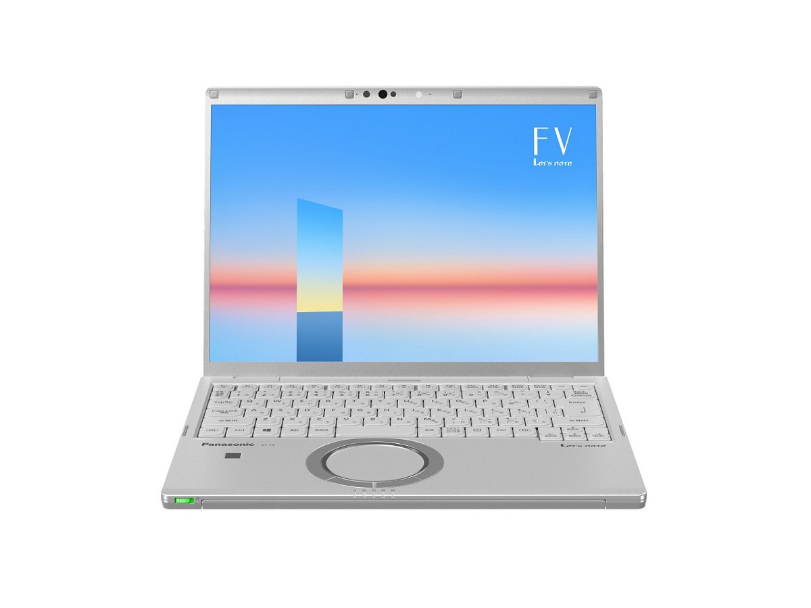
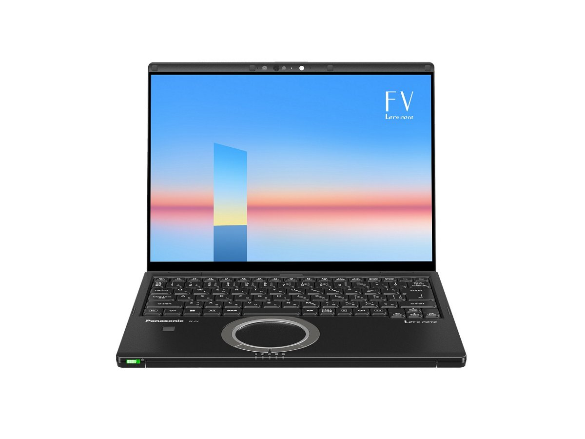
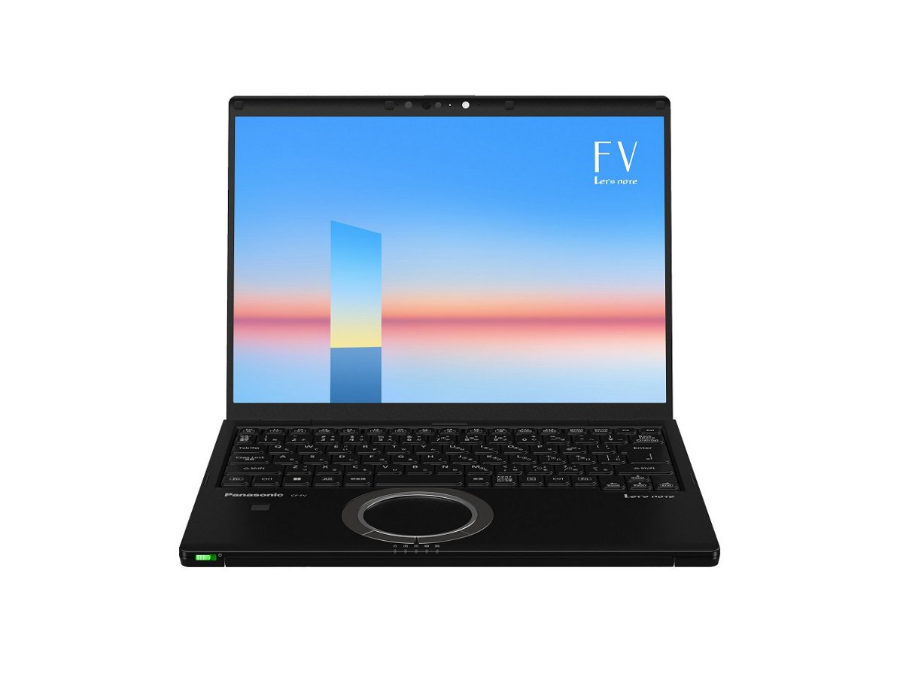
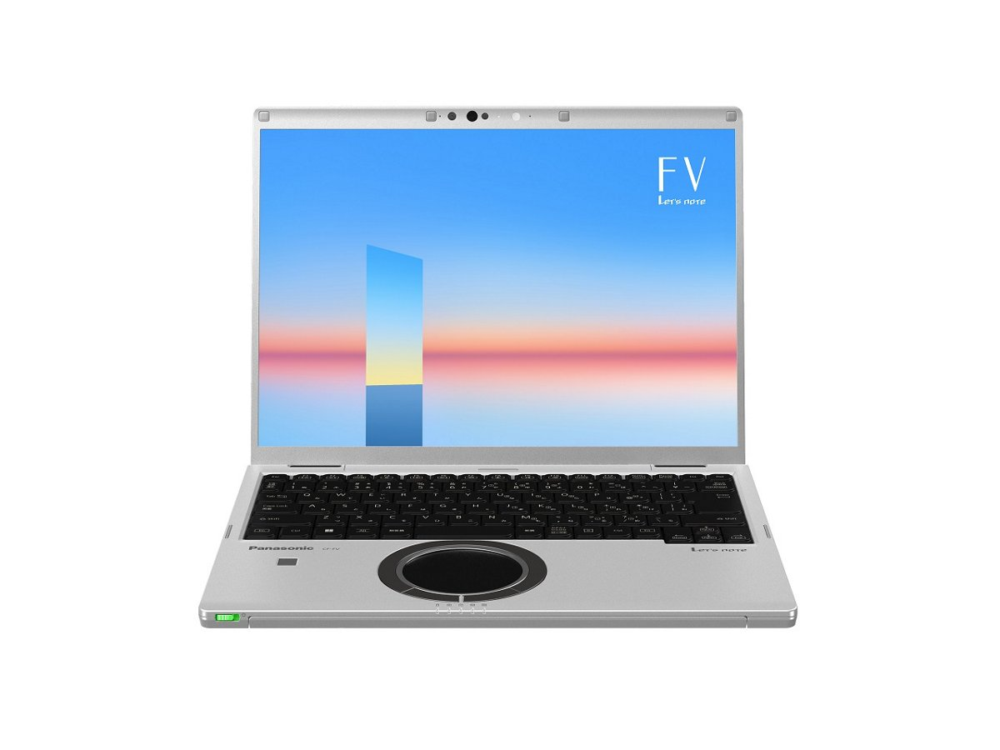
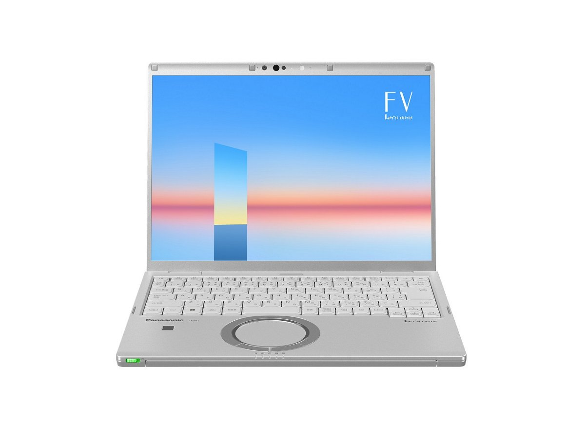

# 松下 Let's note CF-FV1 规格参数

[English](../../en/CF-FV1/) · [日本語](../../ja/CF-FV1/) · **中文**

**CF-FV1** 是松下 Let's note 笔记本电脑，属于 FV 系列，配备 14.0英寸 QHD 屏幕。本页收录其全部 15 个型号（2021-06 – 2022-06 发售）的规格参数。每个型号均附官方规格表链接。

*松下 Let's note CF-FV1（CF-FV1JDSCR, CF-FV1JDWCR, CF-FV1FDSQR, CF-FV1FDWQR），银色。图片 © Panasonic*

## 型号列表

| 型号（品番） | 发售 | 停产 | 主要规格 |
| :-- | :-- | :-- | :-- |
| [CF-FV1BDMCR](https://panasonic.jp/pc/p-db/CF-FV1BDMCR_spec.html) | 2022-06 | 2022-11 | Windows 11 Pro 64ビット、インテル® CoreTM i5-1235U プロセッサー、メモリー：16GB（空きスロットなし）、SSD：512GB、LAN、無線LAN 802.11a（W52/W53/W56）/b/g/n/ac/ax（6GHz帯含む）、Microsoft® Office Home and Business 2021 |
| [CF-FV1BDTCR](https://panasonic.jp/pc/p-db/CF-FV1BDTCR_spec.html) | 2022-06 | 2022-11 | Windows 11 Pro 64ビット、インテル® CoreTM i5-1235U プロセッサー、メモリー：16GB（空きスロットなし）、SSD：512GB、LAN、無線LAN 802.11a（W52/W53/W56）/b/g/n/ac/ax（6GHz帯含む） |
| [CF-FV1MDPCR](https://panasonic.jp/pc/p-db/CF-FV1MDPCR_spec.html) | 2022-01 | 2022-05 | Windows 11 Pro 64ビット、インテル® CoreTM i7-1165G7プロセッサー、メモリー：16GB（空きスロットなし）、SSD：512GB、LAN、無線LAN 802.11a（W52/W53/W56）/b/g/n/ac/ax（6GHz帯含む）、Microsoft® Office Home and Business 2021 |
| [CF-FV1MFNCR](https://panasonic.jp/pc/p-db/CF-FV1MFNCR_spec.html) | 2022-01 | 2022-05 | Windows 11 Pro 64ビット、インテル® CoreTM i7-1165G7プロセッサー、メモリー：16GB（空きスロットなし）、SSD：512GB、LAN、無線LAN 802.11a（W52/W53/W56）/b/g/n/ac/ax（6GHz帯含む）、LTE対応ワイヤレスWAN、Microsoft® Office Home and Business 2021 |
| [CF-FV1LDMCR](https://panasonic.jp/pc/p-db/CF-FV1LDMCR_spec.html) | 2022-01 | 2022-05 | Windows 11 Pro 64ビット、インテル® CoreTM i5-1135G7 プロセッサー、メモリー：16GB（空きスロットなし）、SSD：512GB、LAN、無線LAN 802.11a（W52/W53/W56）/b/g/n/ac/ax（6GHz帯含む）、Microsoft® Office Home and Business 2021 |
| [CF-FV1LDTCR](https://panasonic.jp/pc/p-db/CF-FV1LDTCR_spec.html) | 2022-01 | 2022-05 | Windows 11 Pro 64ビット、インテル® CoreTM i5-1135G7 プロセッサー、メモリー：8GB（空きスロットなし）、SSD：512GB、LAN、無線LAN 802.11a（W52/W53/W56）/b/g/n/ac/ax（6GHz帯含む） |
| [CF-FV1KDPCR](https://panasonic.jp/pc/p-db/CF-FV1KDPCR_spec.html) | 2021-12 | 2022-04 | Windows 11 Pro 64ビット、インテル® CoreTM i7-1165G7プロセッサー、メモリー：16GB（空きスロットなし）、SSD：512GB、LAN、無線LAN 802.11a（W52/W53/W56）/b/g/n/ac/ax（6GHz帯含む）、Microsoft® Office Home and Business 2021 |
| [CF-FV1KFNCR](https://panasonic.jp/pc/p-db/CF-FV1KFNCR_spec.html) | 2021-12 | 2022-04 | Windows 11 Pro 64ビット、インテル® CoreTM i7-1165G7プロセッサー、メモリー：16GB（空きスロットなし）、SSD：512GB、LAN、無線LAN 802.11a（W52/W53/W56）/b/g/n/ac/ax（6GHz帯含む）、Microsoft® Office Home and Business 2021 |
| [CF-FV1JDMCR](https://panasonic.jp/pc/p-db/CF-FV1JDMCR_spec.html) | 2021-12 | 2022-04 | Windows 11 Pro 64ビット、インテル® CoreTM i5-1135G7 プロセッサー、メモリー：16GB（空きスロットなし）、SSD：512GB、LAN、無線LAN 802.11a（W52/W53/W56）/b/g/n/ac/ax（6GHz帯含む）、Microsoft® Office Home and Business 2021 |
| [CF-FV1JDSCR](https://panasonic.jp/pc/p-db/CF-FV1JDSCR_spec.html) | 2021-12 | 2022-04 | Windows 11 Pro 64ビット、インテル® CoreTM i5-1135G7 プロセッサー、メモリー：8GB（空きスロットなし）、SSD：256GB、LAN、無線LAN 802.11a（W52/W53/W56）/b/g/n/ac/ax（6GHz帯含む）、Microsoft® Office Home and Business 2021 |
| [CF-FV1JDWCR](https://panasonic.jp/pc/p-db/CF-FV1JDWCR_spec.html) | 2021-12 | 2022-04 | Windows 11 Pro 64ビット、インテル® CoreTM i5-1135G7 プロセッサー、メモリー：8GB（空きスロットなし）、SSD：256GB、LAN、無線LAN 802.11a（W52/W53/W56）/b/g/n/ac/ax（6GHz帯含む） |
| [CF-FV1GFNQR](https://panasonic.jp/pc/p-db/CF-FV1GFNQR_spec.html) | 2021-06 | 2021-10 | Windows 10 Pro 64ビット、インテル® CoreTM i7-1165G7プロセッサー、メモリー：16GB（空きスロットなし）、SSD：512GB、LAN、無線LAN 802.11a（W52/W53/W56）/b/g/n/ac/ax（6GHz帯含む）、Microsoft® Office Home and Business 2019 |
| [CF-FV1FDMQR](https://panasonic.jp/pc/p-db/CF-FV1FDMQR_spec.html) | 2021-06 | 2021-10 | Windows 10 Pro 64ビット、インテル® CoreTM i5-1135G7プロセッサー、メモリー：16GB（空きスロットなし）、SSD：512GB、LAN、無線LAN 802.11a（W52/W53/W56）/b/g/n/ac/ax（6GHz帯含む）、Microsoft® Office Home and Business 2019 |
| [CF-FV1FDSQR](https://panasonic.jp/pc/p-db/CF-FV1FDSQR_spec.html) | 2021-06 | 2021-10 | Windows 10 Pro 64ビット、インテル® CoreTM i5-1135G7 プロセッサー、メモリー：16GB（空きスロットなし）、SSD：256GB、LAN、無線LAN 802.11a（W52/W53/W56）/b/g/n/ac/ax（6GHz帯含む）、Microsoft® Office Home and Business 2019 |
| [CF-FV1FDWQR](https://panasonic.jp/pc/p-db/CF-FV1FDWQR_spec.html) | 2021-06 | 2021-10 | Windows 10 Pro 64ビット、インテル® CoreTM i5-1135G7 プロセッサー、メモリー：8GB（空きスロットなし）、SSD：256GB、LAN、無線LAN 802.11a（W52/W53/W56）/b/g/n/ac/ax（6GHz帯含む）、Microsoft® Office Home and Business 2019 |

## 通用规格

| 项目 | 规格 |
| :-- | :-- |
| 芯片组 | CPUに内蔵 |
| 光驱 | 搭載されていません |
| 显示屏 / 色彩 | 2160×1440ドット：約1677万色 |
| 有线网络 | 1000BASE-T/100BASE-TX/10BASE-T |
| 蓝牙 | Bluetooth v5.1 / ■対応プロファイル / 【Classic】 / ・A2DP（Source） / ・AVRCP（Target） / ・HCRP（Client） / ・HFP（AG） / ・HID（Host） / ・OPP（ClientおよびServer） / ・PAN（User） / ・SPP（DevAおよびDevB） / 【Low Energy】 / ・HOGP（Host） |
| 音频 | PCM音源（24ビットステレオ）、インテル® High Definition Audio準拠、ステレオスピーカー |
| 安全芯片 | TPM（TCG V2.0準拠） |
| 安全（Windows Hello） | 顔認証対応カメラ/指紋センサー（タッチ式） |
| 内存扩展槽 | なし |
| 摄像头 | 顔認証対応カメラ、有効画素数：最大 1920x1080ピクセル（約207万画素） |
| 麦克风 | アレイマイク |
| 传感器 | 照度(明るさ)、ジャイロ、加速度 |
| 接口 | ・USB3.1 Type-Cポート×2（Thunderbolt™4対応、USB Power Delivery対応） / ・USB3.0 Type-Aポート×3（うち１つはスマホ充電対応を兼ねる） / ・LANコネクター（RJ-45） / ・外部ディスプレイコネクター（アナログRGB ミニD-sub 15ピン） / ・HDMI出力端子（4K60p出力対応） / ・ヘッドセット端子（マイク入力＋オーディオ出力）（ヘッドセットミニジャック3.5mm、CTIA準拠） |
| 功耗 | 最大約85W |
| 能效达成率 | — |

## 各型号差异

| 型号（品番） | 处理器 | 内存 | 存储 | 重量 | 续航 |
| :-- | :-- | :-- | :-- | :-- | :-- |
| CF-FV1BDMCR | Core i5-1135G7 | 16GB LPDDR4x SDRAM | 512GB | 0.999 kg | 11 h |
| CF-FV1BDTCR | Core i5-1135G7 | 16GB LPDDR4x SDRAM | 512GB | 0.999 kg | 11 h |
| CF-FV1MDPCR | Core i7-1165G7 | 16GB LPDDR4x SDRAM | 512GB | 1.204 kg | 21 h |
| CF-FV1MFNCR | Core i7-1165G7 | 16GB LPDDR4x SDRAM | 512GB | 1.139 kg | 21 h |
| CF-FV1LDMCR | Core i5-1135G7 | 16GB LPDDR4x SDRAM | 512GB | 0.999 kg | 11 h |
| CF-FV1LDTCR | Core i5-1135G7 | 16GB LPDDR4x SDRAM | 512GB | 0.999 kg | 11 h |
| CF-FV1KDPCR | Core i7-1165G7 | 16GB LPDDR4x SDRAM | 512GB | 1.204 kg | 21 h |
| CF-FV1KFNCR | Core i7-1165G7 | 16GB LPDDR4x SDRAM | 512GB | 1.139 kg | 21 h |
| CF-FV1JDMCR | Core i5-1135G7 | 16GB LPDDR4x SDRAM | 512GB | 0.999 kg | 11 h |
| CF-FV1JDSCR | Core i5-1135G7 | 16GB LPDDR4x SDRAM | 256GB | 0.999 kg | 11 h |
| CF-FV1JDWCR | Core i5-1135G7 | 8GB LPDDR4x SDRAM | 256GB | 0.999 kg | 11.5 h |
| CF-FV1GFNQR | Core i7-1165G7 | 16GB LPDDR4x SDRAM | 512GB | 1.139 kg | 21 h |
| CF-FV1FDMQR | Core i5-1135G7 | 16GB LPDDR4x SDRAM | 512GB | 0.999 kg | 11 h |
| CF-FV1FDSQR | Core i5-1135G7 | 16GB LPDDR4x SDRAM | 256GB | 0.999 kg | 11 h |
| CF-FV1FDWQR | Core i5-1135G7 | 8GB LPDDR4x SDRAM | 256GB | 0.999 kg | 11.5 h |

CF-FV1BDMCR 的全部差异规格

| 项目 | 规格 |
| :-- | :-- |
| 操作系统 | Windows 11 Pro |
| 处理器 | インテル® Core™ i5-1135G7 プロセッサー / インテル® ターボ・ブースト・テクノロジー2.0利用時は最大4.20GHz / コア数：4コア / キャッシュ：8MB |
| 内存 | 16GB LPDDR4x SDRAM（拡張スロットなし） |
| 显存 | 最大8110MB (メインメモリーと共用) |
| 存储 | SSD：512GB（PCIe） / 上記容量のうち約15GBをリカバリー領域、約1GBをシステム領域として使用（ユーザー使用不可） |
| 显示屏 | 14.0型(3:2)QHD TFTカラー液晶 （2160 x 1440ドット）、アンチグレア |
| 显示屏 / 显卡 | インテル® Iris® Xᵉ グラフィックス（CPUに内蔵） |
| 显示屏 / 外接显示输出 | 最大：1920×1200：約1677万色 / （以下HDMI出力/USB3.1 Type-Cポートのみ） / 最大：4096×2160（30 Hz/60 Hz） |
| 显示屏 / 同时显示 | 最大：1920×1200：約1677万色 / （以下HDMI出力/USB3.1 Type-Cポートのみ） / 最大：2160×1440：約1677万色 |
| 无线网络 | Wi-Fi 6対応 IEEE802.11a/b/g/n/ac/ax 準拠 （5 GHzチャンネル帯：W52/W53/W56）WPA3、WPA2-AES/TKIP対応 |
| 无线广域网 | 搭載されていません |
| SD 卡槽 | SDメモリーカード×1スロット（SDHCメモリーカード/SDXCメモリーカード対応/著作権保護技術対応/UHS-I・UHS-Ⅱ高速転送対応） |
| 键盘 | OADG準拠87キー、キーピッチ19mm（縦・横/一部キーを除く） |
| 指点设备 | 高精度タッチパッド対応ホイールパッド |
| 电源 | ▼ACアダプター / 入力：AC100V～240V、50Hz/60Hz、出力：DC16V、5.3A、電源コードは100V専用 / ▼バッテリーパック（S） / 11.55V リチウムイオン・定格容量2543mAh |
| 能效 | 目標年度2022年度 12区分17.5［kWh/年］ |
| 续航 / 充电时间 | ▼駆動時間 / （JEITA Ver.2.0） / 約11時間［付属バッテリーパック（S）装着時］ / ▼充電時間 / 最大2.5時間（電源オフ時）／最大2.5時間（電源オン時） |
| 尺寸（宽×深×高） | 幅308.6mm×奥行235.3mm×高さ18.2mm（突起部除く） |
| 颜色 | ブラック＆シルバー |
| 重量（含电池） | パソコン本体：約0.999kg（付属バッテリーパック(S)（約200g）装着時） / ACアダプター：約230g（電源コード（約60g）除く） |
| 预装软件 | ・Microsoft® Edge / ・Microsoft® .NET Framework 4.8 / ・Microsoft® Windows Media Player 12 / ・マカフィーリブセーフ（60日間 無料体験版） / ・i-フィルター for マルチデバイス (30日間無料お試し版) / ・WinZip （45日試用版） / ・Aptioセットアップ / ・PC-Diagnosticユーティリティ / ・Panasonic PC設定ユーティリティ / ・データ消去ユーティリティ / ・DirectX 12 / ・PC情報ビューアー / ・Panasonic PC リカバリーディスク作成ユーティリティ / ・Panasonic PC Camera Utility / ・Panasonic PC快適NAVI / ・Panasonic PC VVork |
| Microsoft Office | Microsoft® Office Home and Business 2021 |
| 附件 | バッテリーパック(S)、ACアダプター、取扱説明書、Microsoft Office Home & Business 2021 |

官方规格表: <https://panasonic.jp/pc/p-db/CF-FV1BDMCR_spec.html>

CF-FV1BDTCR 的全部差异规格

| 项目 | 规格 |
| :-- | :-- |
| 操作系统 | Windows 11 Pro |
| 处理器 | インテル® Core™ i5-1135G7 プロセッサー / インテル® ターボ・ブースト・テクノロジー2.0利用時は最大4.20GHz / コア数：4コア / キャッシュ：8MB |
| 内存 | 16GB LPDDR4x SDRAM（拡張スロットなし） |
| 显存 | 最大8110MB (メインメモリーと共用) |
| 存储 | SSD：512GB（PCIe） / 上記容量のうち約15GBをリカバリー領域、約1GBをシステム領域として使用（ユーザー使用不可） |
| 显示屏 | 14.0型(3:2)QHD TFTカラー液晶 （2160 x 1440ドット）、アンチグレア |
| 显示屏 / 显卡 | インテル® Iris® Xᵉ グラフィックス（CPUに内蔵） |
| 显示屏 / 外接显示输出 | 最大：1920×1200：約1677万色 / （以下HDMI出力/USB3.1 Type-Cポートのみ） / 最大：4096×2160（30 Hz/60 Hz） |
| 显示屏 / 同时显示 | 最大：1920×1200：約1677万色 / （以下HDMI出力/USB3.1 Type-Cポートのみ） / 最大：2160×1440：約1677万色 |
| 无线网络 | Wi-Fi 6対応 IEEE802.11a/b/g/n/ac/ax 準拠 （5 GHzチャンネル帯：W52/W53/W56）WPA3、WPA2-AES/TKIP対応 |
| 无线广域网 | 搭載されていません |
| SD 卡槽 | SDメモリーカード×1スロット（SDHCメモリーカード/SDXCメモリーカード対応/著作権保護技術対応/UHS-I・UHS-Ⅱ高速転送対応） |
| 键盘 | OADG準拠87キー、キーピッチ19mm（縦・横/一部キーを除く） |
| 指点设备 | 高精度タッチパッド対応ホイールパッド |
| 电源 | ▼ACアダプター / 入力：AC100V～240V、50Hz/60Hz、出力：DC16V、5.3A、電源コードは100V専用 / ▼バッテリーパック（S） / 11.55V リチウムイオン・定格容量2543mAh |
| 能效 | 目標年度2022年度 12区分17.5［kWh/年］ |
| 续航 / 充电时间 | ▼駆動時間 / （JEITA Ver.2.0） / 約11時間［付属バッテリーパック（S）装着時］ / ▼充電時間 / 最大2.5時間（電源オフ時）／最大2.5時間（電源オン時） |
| 尺寸（宽×深×高） | 幅308.6mm×奥行235.3mm×高さ18.2mm（突起部除く） |
| 颜色 | シルバー |
| 重量（含电池） | パソコン本体：約0.999kg（付属バッテリーパック(S)（約200g）装着時） / ACアダプター：約230g（電源コード（約60g）除く） |
| 预装软件 | ・Microsoft® Edge / ・Microsoft® .NET Framework 4.8 / ・Microsoft® Windows Media Player 12 / ・マカフィーリブセーフ（60日間 無料体験版） / ・i-フィルター for マルチデバイス (30日間無料お試し版) / ・WinZip （45日試用版） / ・Aptioセットアップ / ・PC-Diagnosticユーティリティ / ・Panasonic PC設定ユーティリティ / ・データ消去ユーティリティ / ・DirectX 12 / ・PC情報ビューアー / ・Panasonic PC リカバリーディスク作成ユーティリティ / ・Panasonic PC Camera Utility / ・Panasonic PC快適NAVI / ・Panasonic PC VVork |
| 附件 | バッテリーパック(S)、ACアダプター、取扱説明書 |

官方规格表: <https://panasonic.jp/pc/p-db/CF-FV1BDTCR_spec.html>

CF-FV1MDPCR 的全部差异规格

| 项目 | 规格 |
| :-- | :-- |
| 操作系统 | Windows 11 Pro |
| 处理器 | インテル® Core™ i7-1165G7 プロセッサー / (キャッシュ12MB、インテル® ターボ・ブースト・テクノロジー2.0利用時は最大4.70GHz） |
| 内存 | 16GB LPDDR4x SDRAM（拡張スロットなし） |
| 显存 | 最大8110MB (メインメモリーと共用) |
| 存储 | SSD：512GB（PCIe） / 上記容量のうち約15GBをリカバリー領域、約1GBをシステム領域として使用（ユーザー使用不可） |
| 显示屏 | 14.0 型（3:2）QHD TFTカラー液晶（2160×1440ドット） / （静電容量式マルチタッチパネル、アンチリフレクション保護フィルム付き） |
| 显示屏 / 显卡 | インテル® Iris® Xᵉ グラフィックス（CPUに内蔵） |
| 显示屏 / 外接显示输出 | 最大：1920×1200：約1677万色 / （以下HDMI出力/USB3.1 Type-Cポートのみ） / 最大：4096×2160（30 Hz/60 Hz） |
| 显示屏 / 同时显示 | 最大：1920×1200：約1677万色 / （以下HDMI出力/USB3.1 Type-Cポートのみ） / 最大：2160×1440：約1677万色 |
| 无线网络 | IEEE802.11a/b/g/n/ac/ax 準拠 （5 GHzチャンネル帯：W52/W53/W56）WPA3、WPA2-AES/TKIP対応、Wi-Fi準拠 |
| SD 卡槽 | SDメモリーカード×1スロット（SDHCメモリーカード/SDXCメモリーカード対応/著作権保護技術対応/UHS-I・UHS-Ⅱ高速転送対応） |
| 键盘 | OADG準拠87キー、キーピッチ19mm（縦・横/一部キーを除く）、バックライトキーボード |
| 指点设备 | 高精度タッチパッド対応ホイールパッド・静電タッチパネル（10フィンガー対応） |
| 电源 | ▼ACアダプター / 入力：AC100V～240V、50Hz/60Hz、出力：DC16V、5.3A、電源コードは100V専用 / ▼ACアダプター（USB Power Delivery対応） / 入力：AC100V～240V、50Hz/60Hz、出力：DC20V、5A、電源コードは100V専用 / ▼バッテリーパック（L） / 11.55V リチウムイオン・定格容量4786mAh |
| 能效 | 目標年度2022年度 12区分17.5［kWh/年］ |
| 续航 / 充电时间 | ▼駆動時間 / （JEITA Ver.2.0） / 約21時間［付属バッテリーパック（L）装着時］ / ▼充電時間 / 最大3時間（電源オフ時）／最大3時間（電源オン時） |
| 尺寸（宽×深×高） | 幅308.6mm×奥行235.3mm×高さ18.5mm（突起部除く） |
| 颜色 | ブラック |
| 重量（含电池） | パソコン本体：約1.204kg（付属バッテリーパック(L)（約300g）装着時） / ACアダプター：約230g（電源コード（約60g）除く） |
| 预装软件 | ・Microsoft® Edge / ・Microsoft® .NET Framework 4.8 / ・Microsoft® Windows Media Player 12 / ・マカフィーリブセーフ（60日間 無料体験版） / ・i-フィルター for マルチデバイス (30日間無料お試し版) / ・WinZip （45日試用版） / ・Aptioセットアップ / ・PC-Diagnosticユーティリティ / ・Panasonic PC設定ユーティリティ / ・ハードディスクデータ消去ユーティリティ / ・DirectX 12 / ・PC情報ビューアー / ・Panasonic PC リカバリーディスク作成ユーティリティ / ・Panasonic PC Camera Utility / ・Panasonic PC快適NAVI / ・Panasonic PC VVork |
| Microsoft Office | Microsoft® Office Home and Business 2021 |
| 附件 | バッテリーパック(L)、ACアダプター、ACアダプター（USB Power Delivery対応）、専用布、取扱説明書、Microsoft Office Home & Business 2021 |
| 核心数 | 4コア |
| 无线通信模块 | Intel® Wi-Fi 6 AX201 |
| LTE | 搭載されていません |

官方规格表: <https://panasonic.jp/pc/p-db/CF-FV1MDPCR_spec.html>

CF-FV1MFNCR 的全部差异规格

| 项目 | 规格 |
| :-- | :-- |
| 操作系统 | Windows 11 Pro |
| 处理器 | インテル® Core™ i7-1165G7 プロセッサー / (キャッシュ12MB、インテル® ターボ・ブースト・テクノロジー2.0利用時は最大4.70GHz） |
| 内存 | 16GB LPDDR4x SDRAM（拡張スロットなし） |
| 显存 | 最大8110MB (メインメモリーと共用) |
| 存储 | SSD：512GB（PCIe） / 上記容量のうち約15GBをリカバリー領域、約1GBをシステム領域として使用（ユーザー使用不可） |
| 显示屏 | 14.0型(3:2)QHD TFTカラー液晶 （2160 x 1440ドット）、アンチグレア |
| 显示屏 / 显卡 | インテル® Iris® Xᵉ グラフィックス（CPUに内蔵） |
| 显示屏 / 外接显示输出 | 最大：1920×1200：約1677万色 / （以下HDMI出力/USB3.1 Type-Cポートのみ） / 最大：4096×2160（30 Hz/60 Hz） |
| 显示屏 / 同时显示 | 最大：1920×1200：約1677万色 / （以下HDMI出力/USB3.1 Type-Cポートのみ） / 最大：2160×1440：約1677万色 |
| 无线网络 | IEEE802.11a/b/g/n/ac/ax 準拠 （5 GHzチャンネル帯：W52/W53/W56）WPA3、WPA2-AES/TKIP対応、Wi-Fi準拠 |
| 键盘 | OADG準拠87キー、キーピッチ19mm（縦・横/一部キーを除く）、バックライトキーボード |
| 指点设备 | 高精度タッチパッド対応ホイールパッド |
| 电源 | ▼ACアダプター / 入力：AC100V～240V、50Hz/60Hz、出力：DC16V、5.3A、電源コードは100V専用 / ▼バッテリーパック（L） / 11.55V リチウムイオン・定格容量4786mAh |
| 能效 | 目標年度2022年度 12区分17.5［kWh/年］ |
| 续航 / 充电时间 | ▼駆動時間 / （JEITA Ver.2.0） / 約21時間［付属バッテリーパック（L）装着時］ / ▼充電時間 / 最大3時間（電源オフ時）／最大3時間（電源オン時） |
| 尺寸（宽×深×高） | 幅308.6mm×奥行235.3mm×高さ18.2mm（突起部除く） |
| 颜色 | ブラック |
| 重量（含电池） | パソコン本体：約1.139kg（付属バッテリーパック(L)（約300g）装着時） / ACアダプター：約230g（電源コード（約60g）除く） |
| 预装软件 | ・Microsoft® Edge / ・Microsoft® .NET Framework 4.8 / ・Microsoft® Windows Media Player 12 / ・マカフィーリブセーフ（60日間 無料体験版） / ・i-フィルター for マルチデバイス (30日間無料お試し版) / ・WinZip （45日試用版） / ・Aptioセットアップ / ・PC-Diagnosticユーティリティ / ・Panasonic PC設定ユーティリティ / ・ハードディスクデータ消去ユーティリティ / ・DirectX 12 / ・PC情報ビューアー / ・Panasonic PC リカバリーディスク作成ユーティリティ / ・Panasonic PC Camera Utility / ・Panasonic PC快適NAVI / ・Panasonic PC VVork |
| Microsoft Office | Microsoft® Office Home and Business 2021 |
| 附件 | バッテリーパック(L)、ACアダプター、取扱説明書、Microsoft Office Home & Business 2021 |
| 核心数 | 4コア |
| 无线通信模块 | Intel® Wi-Fi 6 AX201 |
| LTE | ワイヤレスWANモジュール内蔵（LTE対応） |
| 卡槽 / SD 卡 | SDメモリーカード×1スロット（SDHCメモリーカード/SDXCメモリーカード対応/著作権保護技術対応/UHS-I・UHS-Ⅱ高速転送対応） |
| 卡槽 / 其他 | nano SIMカードスロット |

官方规格表: <https://panasonic.jp/pc/p-db/CF-FV1MFNCR_spec.html>

CF-FV1LDMCR 的全部差异规格

| 项目 | 规格 |
| :-- | :-- |
| 操作系统 | Windows 11 Pro |
| 处理器 | インテル® Core™ i5-1135G7 プロセッサー / (キャッシュ 8MB、インテル® ターボ・ブースト・テクノロジー2.0利用時は最大4.20GHz） |
| 内存 | 16GB LPDDR4x SDRAM（拡張スロットなし） |
| 显存 | 最大8110MB (メインメモリーと共用) |
| 存储 | SSD：512GB（PCIe） / 上記容量のうち約15GBをリカバリー領域、約1GBをシステム領域として使用（ユーザー使用不可） |
| 显示屏 | 14.0型(3:2)QHD TFTカラー液晶 （2160 x 1440ドット）、アンチグレア |
| 显示屏 / 显卡 | インテル® Iris® Xᵉ グラフィックス（CPUに内蔵） |
| 显示屏 / 外接显示输出 | 最大：1920×1200：約1677万色 / （以下HDMI出力/USB3.1 Type-Cポートのみ） / 最大：4096×2160（30 Hz/60 Hz） |
| 显示屏 / 同时显示 | 最大：1920×1200：約1677万色 / （以下HDMI出力/USB3.1 Type-Cポートのみ） / 最大：2160×1440：約1677万色 |
| 无线网络 | IEEE802.11a/b/g/n/ac/ax 準拠 （5 GHzチャンネル帯：W52/W53/W56）WPA3、WPA2-AES/TKIP対応、Wi-Fi準拠 |
| SD 卡槽 | SDメモリーカード×1スロット（SDHCメモリーカード/SDXCメモリーカード対応/著作権保護技術対応/UHS-I・UHS-Ⅱ高速転送対応） |
| 键盘 | OADG準拠87キー、キーピッチ19mm（縦・横/一部キーを除く） |
| 指点设备 | 高精度タッチパッド対応ホイールパッド |
| 电源 | ▼ACアダプター / 入力：AC100V～240V、50Hz/60Hz、出力：DC16V、5.3A、電源コードは100V専用 / ▼バッテリーパック（S） / 11.55V リチウムイオン・定格容量2543mAh |
| 能效 | 目標年度2022年度 12区分17.5［kWh/年］ |
| 续航 / 充电时间 | ▼駆動時間 / （JEITA Ver.2.0） / 約11時間［付属バッテリーパック（S）装着時］ / ▼充電時間 / 最大2.5時間（電源オフ時）／最大2.5時間（電源オン時） |
| 尺寸（宽×深×高） | 幅308.6mm×奥行235.3mm×高さ18.2mm（突起部除く） |
| 颜色 | ブラック＆シルバー |
| 重量（含电池） | パソコン本体：約0.999kg（付属バッテリーパック(S)（約200g）装着時） / ACアダプター：約230g（電源コード（約60g）除く） |
| 预装软件 | ・Microsoft® Edge / ・Microsoft® .NET Framework 4.8 / ・Microsoft® Windows Media Player 12 / ・マカフィーリブセーフ（60日間 無料体験版） / ・i-フィルター for マルチデバイス (30日間無料お試し版) / ・WinZip （45日試用版） / ・Aptioセットアップ / ・PC-Diagnosticユーティリティ / ・Panasonic PC設定ユーティリティ / ・ハードディスクデータ消去ユーティリティ / ・DirectX 12 / ・PC情報ビューアー / ・Panasonic PC リカバリーディスク作成ユーティリティ / ・Panasonic PC Camera Utility / ・Panasonic PC快適NAVI / ・Panasonic PC VVork |
| Microsoft Office | Microsoft® Office Home and Business 2021 |
| 附件 | バッテリーパック(S)、ACアダプター、取扱説明書、Microsoft Office Home & Business 2021 |
| 核心数 | 4コア |
| 无线通信模块 | Intel® Wi-Fi 6 AX201 |
| LTE | 搭載されていません |

官方规格表: <https://panasonic.jp/pc/p-db/CF-FV1LDMCR_spec.html>

CF-FV1LDTCR 的全部差异规格

| 项目 | 规格 |
| :-- | :-- |
| 操作系统 | Windows 11 Pro |
| 处理器 | インテル® Core™ i5-1135G7 プロセッサー / (キャッシュ 8MB、インテル® ターボ・ブースト・テクノロジー2.0利用時は最大4.20GHz） |
| 内存 | 16GB LPDDR4x SDRAM（拡張スロットなし） |
| 显存 | 最大8110MB (メインメモリーと共用) |
| 存储 | SSD：512GB（PCIe） / 上記容量のうち約15GBをリカバリー領域、約1GBをシステム領域として使用（ユーザー使用不可） |
| 显示屏 | 14.0型(3:2)QHD TFTカラー液晶 （2160 x 1440ドット）、アンチグレア |
| 显示屏 / 显卡 | インテル® Iris® Xᵉ グラフィックス（CPUに内蔵） |
| 显示屏 / 外接显示输出 | 最大：1920×1200：約1677万色 / （以下HDMI出力/USB3.1 Type-Cポートのみ） / 最大：4096×2160（30 Hz/60 Hz） |
| 显示屏 / 同时显示 | 最大：1920×1200：約1677万色 / （以下HDMI出力/USB3.1 Type-Cポートのみ） / 最大：2160×1440：約1677万色 |
| 无线网络 | IEEE802.11a/b/g/n/ac/ax 準拠 （5 GHzチャンネル帯：W52/W53/W56）WPA3、WPA2-AES/TKIP対応、Wi-Fi準拠 |
| SD 卡槽 | SDメモリーカード×1スロット（SDHCメモリーカード/SDXCメモリーカード対応/著作権保護技術対応/UHS-I・UHS-Ⅱ高速転送対応） |
| 键盘 | OADG準拠87キー、キーピッチ19mm（縦・横/一部キーを除く） |
| 指点设备 | 高精度タッチパッド対応ホイールパッド |
| 电源 | ▼ACアダプター / 入力：AC100V～240V、50Hz/60Hz、出力：DC16V、5.3A、電源コードは100V専用 / ▼バッテリーパック（S） / 11.55V リチウムイオン・定格容量2543mAh |
| 能效 | 目標年度2022年度 12区分17.5［kWh/年］ |
| 续航 / 充电时间 | ▼駆動時間 / （JEITA Ver.2.0） / 約11時間［付属バッテリーパック（S）装着時］ / ▼充電時間 / 最大2.5時間（電源オフ時）／最大2.5時間（電源オン時） |
| 尺寸（宽×深×高） | 幅308.6mm×奥行235.3mm×高さ18.2mm（突起部除く） |
| 颜色 | シルバー |
| 重量（含电池） | パソコン本体：約0.999kg（付属バッテリーパック(S)（約200g）装着時） / ACアダプター：約230g（電源コード（約60g）除く） |
| 预装软件 | ・Microsoft® Edge / ・Microsoft® .NET Framework 4.8 / ・Microsoft® Windows Media Player 12 / ・マカフィーリブセーフ（60日間 無料体験版） / ・i-フィルター for マルチデバイス (30日間無料お試し版) / ・WinZip （45日試用版） / ・Aptioセットアップ / ・PC-Diagnosticユーティリティ / ・Panasonic PC設定ユーティリティ / ・ハードディスクデータ消去ユーティリティ / ・DirectX 12 / ・PC情報ビューアー / ・Panasonic PC リカバリーディスク作成ユーティリティ / ・Panasonic PC Camera Utility / ・Panasonic PC快適NAVI / ・Panasonic PC VVork |
| 附件 | バッテリーパック(S)、ACアダプター、取扱説明書 |
| 核心数 | 4コア |
| 无线通信模块 | Intel® Wi-Fi 6 AX201 |
| LTE | 搭載されていません |

官方规格表: <https://panasonic.jp/pc/p-db/CF-FV1LDTCR_spec.html>

CF-FV1KDPCR 的全部差异规格

| 项目 | 规格 |
| :-- | :-- |
| 操作系统 | Windows 11 Pro |
| 处理器 | インテル® Core™ i7-1165G7 プロセッサー / (キャッシュ12MB、インテル® ターボ・ブースト・テクノロジー2.0利用時は最大4.70GHz） |
| 内存 | 16GB LPDDR4x SDRAM（拡張スロットなし） |
| 显存 | 最大8110MB (メインメモリーと共用) |
| 存储 | SSD：512GB（PCIe） / 上記容量のうち約15GBをリカバリー領域、約1GBをシステム領域として使用（ユーザー使用不可） |
| 显示屏 | 14.0 型（3:2）QHD TFTカラー液晶（2160×1440ドット） / （静電容量式マルチタッチパネル、アンチリフレクション保護フィルム付き） |
| 显示屏 / 显卡 | インテル® Iris® Xᵉ グラフィックス（CPUに内蔵） |
| 显示屏 / 外接显示输出 | 最大：1920×1200：約1677万色 / （以下HDMI出力/USB3.1 Type-Cポートのみ） / 最大：4096×2160（30 Hz/60 Hz） |
| 显示屏 / 同时显示 | 最大：1920×1200：約1677万色 / （以下HDMI出力/USB3.1 Type-Cポートのみ） / 最大：2160×1440：約1677万色 |
| 无线网络 | IEEE802.11a/b/g/n/ac/ax 準拠 （5 GHzチャンネル帯：W52/W53/W56）WPA3、WPA2-AES/TKIP対応、Wi-Fi準拠 |
| SD 卡槽 | SDメモリーカード×1スロット（SDHCメモリーカード/SDXCメモリーカード対応/著作権保護技術対応/UHS-I・UHS-Ⅱ高速転送対応） |
| 键盘 | OADG準拠87キー、キーピッチ19mm（縦・横/一部キーを除く）、バックライトキーボード |
| 指点设备 | 高精度タッチパッド対応ホイールパッド・静電タッチパネル（10フィンガー対応） |
| 电源 | ▼ACアダプター / 入力：AC100V～240V、50Hz/60Hz、出力：DC16V、5.3A、電源コードは100V専用 / ▼ACアダプター（USB Power Delivery対応） / 入力：AC100V～240V、50Hz/60Hz、出力：DC20V、5A、電源コードは100V専用 / ▼バッテリーパック（L） / 11.55V リチウムイオン・定格容量4786mAh |
| 能效 | 目標年度2022年度 12区分18.6［kWh/年］ |
| 续航 / 充电时间 | ▼駆動時間 / （JEITA Ver.2.0） / 約21時間［付属バッテリーパック（L）装着時］ / ▼充電時間 / 最大3時間（電源オフ時）／最大3時間（電源オン時） |
| 尺寸（宽×深×高） | 幅308.6mm×奥行235.3mm×高さ18.5mm（突起部除く） |
| 颜色 | ブラック |
| 重量（含电池） | パソコン本体：約1.204kg（付属バッテリーパック(L)（約300g）装着時） / ACアダプター：約230g（電源コード（約60g）除く） |
| 预装软件 | ・Microsoft® Edge / ・Microsoft® .NET Framework 4.8 / ・Microsoft® Windows Media Player 12 / ・マカフィーリブセーフ（60日間 無料体験版） / ・i-フィルター for マルチデバイス (30日間無料お試し版) / ・WinZip （45日試用版） / ・Aptioセットアップ / ・PC-Diagnosticユーティリティ / ・Panasonic PC設定ユーティリティ / ・ハードディスクデータ消去ユーティリティ / ・DirectX 12 / ・PC情報ビューアー / ・Panasonic PC リカバリーディスク作成ユーティリティ / ・Panasonic PC Camera Utility / ・Panasonic PC快適NAVI / ・Panasonic PC VVork |
| Microsoft Office | Microsoft® Office Home and Business 2021 |
| 附件 | バッテリーパック(L)、ACアダプター、ACアダプター（USB Power Delivery対応）、専用布、取扱説明書、Microsoft Office Home & Business 2021 |
| 核心数 | 4コア |
| 无线通信模块 | Intel® Wi-Fi 6 AX201 |
| LTE | 搭載されていません |

官方规格表: <https://panasonic.jp/pc/p-db/CF-FV1KDPCR_spec.html>

CF-FV1KFNCR 的全部差异规格

| 项目 | 规格 |
| :-- | :-- |
| 操作系统 | Windows 11 Pro |
| 处理器 | インテル® Core™ i7-1165G7 プロセッサー / (キャッシュ12MB、インテル® ターボ・ブースト・テクノロジー2.0利用時は最大4.70GHz） |
| 内存 | 16GB LPDDR4x SDRAM（拡張スロットなし） |
| 显存 | 最大8110MB (メインメモリーと共用) |
| 存储 | SSD：512GB（PCIe） / 上記容量のうち約15GBをリカバリー領域、約1GBをシステム領域として使用（ユーザー使用不可） |
| 显示屏 | 14.0型(3:2)QHD TFTカラー液晶 （2160 x 1440ドット）、アンチグレア |
| 显示屏 / 显卡 | インテル® Iris® Xᵉ グラフィックス（CPUに内蔵） |
| 显示屏 / 外接显示输出 | 最大：1920×1200：約1677万色 / （以下HDMI出力/USB3.1 Type-Cポートのみ） / 最大：4096×2160（30 Hz/60 Hz） |
| 显示屏 / 同时显示 | 最大：1920×1200：約1677万色 / （以下HDMI出力/USB3.1 Type-Cポートのみ） / 最大：2160×1440：約1677万色 |
| 无线网络 | IEEE802.11a/b/g/n/ac/ax 準拠 （5 GHzチャンネル帯：W52/W53/W56）WPA3、WPA2-AES/TKIP対応、Wi-Fi準拠 |
| 键盘 | OADG準拠87キー、キーピッチ19mm（縦・横/一部キーを除く）、バックライトキーボード |
| 指点设备 | 高精度タッチパッド対応ホイールパッド |
| 电源 | ▼ACアダプター / 入力：AC100V～240V、50Hz/60Hz、出力：DC16V、5.3A、電源コードは100V専用 / ▼バッテリーパック（L） / 11.55V リチウムイオン・定格容量4786mAh |
| 能效 | 目標年度2022年度 12区分18.6［kWh/年］ |
| 续航 / 充电时间 | ▼駆動時間 / （JEITA Ver.2.0） / 約21時間［付属バッテリーパック（L）装着時］ / ▼充電時間 / 最大3時間（電源オフ時）／最大3時間（電源オン時） |
| 尺寸（宽×深×高） | 幅308.6mm×奥行235.3mm×高さ18.2mm（突起部除く） |
| 颜色 | ブラック |
| 重量（含电池） | パソコン本体：約1.139kg（付属バッテリーパック(L)（約300g）装着時） / ACアダプター：約230g（電源コード（約60g）除く） |
| 预装软件 | ・Microsoft® Edge / ・Microsoft® .NET Framework 4.8 / ・Microsoft® Windows Media Player 12 / ・マカフィーリブセーフ（60日間 無料体験版） / ・i-フィルター for マルチデバイス (30日間無料お試し版) / ・WinZip （45日試用版） / / ・Aptioセットアップ / ・PC-Diagnosticユーティリティ / ・Panasonic PC設定ユーティリティ / ・ハードディスクデータ消去ユーティリティ / ・DirectX 12 / ・PC情報ビューアー / ・Panasonic PC リカバリーディスク作成ユーティリティ / ・Panasonic PC Camera Utility / ・Panasonic PC快適NAVI / ・Panasonic PC VVork |
| Microsoft Office | Microsoft® Office Home and Business 2021 |
| 附件 | バッテリーパック(L)、ACアダプター、取扱説明書、Microsoft Office Home & Business 2021 |
| 核心数 | 4コア |
| 无线通信模块 | Intel® Wi-Fi 6 AX201 |
| LTE | ワイヤレスWANモジュール内蔵（LTE対応） |
| 卡槽 / SD 卡 | SDメモリーカード×1スロット（SDHCメモリーカード/SDXCメモリーカード対応/著作権保護技術対応/UHS-I・UHS-Ⅱ高速転送対応） |
| 卡槽 / 其他 | nano SIMカードスロット |

官方规格表: <https://panasonic.jp/pc/p-db/CF-FV1KFNCR_spec.html>

CF-FV1JDMCR 的全部差异规格

| 项目 | 规格 |
| :-- | :-- |
| 操作系统 | Windows 11 Pro |
| 处理器 | インテル® Core™ i5-1135G7 プロセッサー / (キャッシュ 8MB、インテル® ターボ・ブースト・テクノロジー2.0利用時は最大4.20GHz） |
| 内存 | 16GB LPDDR4x SDRAM（拡張スロットなし） |
| 显存 | 最大8110MB (メインメモリーと共用) |
| 存储 | SSD：512GB（PCIe） / 上記容量のうち約15GBをリカバリー領域、約1GBをシステム領域として使用（ユーザー使用不可） |
| 显示屏 | 14.0型(3:2)QHD TFTカラー液晶 （2160 x 1440ドット）、アンチグレア |
| 显示屏 / 显卡 | インテル® Iris® Xᵉ グラフィックス（CPUに内蔵） |
| 显示屏 / 外接显示输出 | 最大：1920×1200：約1677万色 / （以下HDMI出力/USB3.1 Type-Cポートのみ） / 最大：4096×2160（30 Hz/60 Hz） |
| 显示屏 / 同时显示 | 最大：1920×1200：約1677万色 / （以下HDMI出力/USB3.1 Type-Cポートのみ） / 最大：2160×1440：約1677万色 |
| 无线网络 | IEEE802.11a/b/g/n/ac/ax 準拠 （5 GHzチャンネル帯：W52/W53/W56）WPA3、WPA2-AES/TKIP対応、Wi-Fi準拠 |
| SD 卡槽 | SDメモリーカード×1スロット（SDHCメモリーカード/SDXCメモリーカード対応/著作権保護技術対応/UHS-I・UHS-Ⅱ高速転送対応） |
| 键盘 | OADG準拠87キー、キーピッチ19mm（縦・横/一部キーを除く） |
| 指点设备 | 高精度タッチパッド対応ホイールパッド |
| 电源 | ▼ACアダプター / 入力：AC100V～240V、50Hz/60Hz、出力：DC16V、5.3A、電源コードは100V専用 / ▼バッテリーパック（S） / 11.55V リチウムイオン・定格容量2543mAh |
| 能效 | 目標年度2022年度 12区分18.6［kWh/年］ |
| 续航 / 充电时间 | ▼駆動時間 / （JEITA Ver.2.0） / 約11時間［付属バッテリーパック（S）装着時］ / ▼充電時間 / 最大2.5時間（電源オフ時）／最大2.5時間（電源オン時） |
| 尺寸（宽×深×高） | 幅308.6mm×奥行235.3mm×高さ18.2mm（突起部除く） |
| 颜色 | ブラック＆シルバー |
| 重量（含电池） | パソコン本体：約0.999kg（付属バッテリーパック(S)（約200g）装着時） / ACアダプター：約230g（電源コード（約60g）除く） |
| 预装软件 | ・Microsoft® Edge / ・Microsoft® .NET Framework 4.8 / ・Microsoft® Windows Media Player 12 / ・マカフィーリブセーフ（60日間 無料体験版） / ・i-フィルター for マルチデバイス (30日間無料お試し版) / ・WinZip （45日試用版） / ・Aptioセットアップ / ・PC-Diagnosticユーティリティ / ・Panasonic PC設定ユーティリティ / ・ハードディスクデータ消去ユーティリティ / ・DirectX 12 / ・PC情報ビューアー / ・Panasonic PC リカバリーディスク作成ユーティリティ / ・Panasonic PC Camera Utility / ・Panasonic PC快適NAVI / ・Panasonic PC VVork |
| Microsoft Office | Microsoft® Office Home and Business 2021 |
| 附件 | バッテリーパック(S)、ACアダプター、取扱説明書、Microsoft Office Home & Business 2021 |
| 核心数 | 4コア |
| 无线通信模块 | Intel® Wi-Fi 6 AX201 |
| LTE | 搭載されていません |

官方规格表: <https://panasonic.jp/pc/p-db/CF-FV1JDMCR_spec.html>

CF-FV1JDSCR 的全部差异规格

| 项目 | 规格 |
| :-- | :-- |
| 操作系统 | Windows 11 Pro |
| 处理器 | インテル® Core™ i5-1135G7 プロセッサー / (キャッシュ 8MB、インテル® ターボ・ブースト・テクノロジー2.0利用時は最大4.20GHz） |
| 内存 | 16GB LPDDR4x SDRAM（拡張スロットなし） |
| 显存 | 最大8110MB (メインメモリーと共用) |
| 存储 | SSD：256GB（PCIe） / 上記容量のうち約15GBをリカバリー領域、約1GBをシステム領域として使用（ユーザー使用不可） |
| 显示屏 | 14.0型(3:2)QHD TFTカラー液晶 （2160 x 1440ドット）、アンチグレア |
| 显示屏 / 显卡 | インテル® Iris® Xᵉ グラフィックス（CPUに内蔵） |
| 显示屏 / 外接显示输出 | 最大：1920×1200：約1677万色 / （以下HDMI出力/USB3.1 Type-Cポートのみ） / 最大：4096×2160（30 Hz/60 Hz） |
| 显示屏 / 同时显示 | 最大：1920×1200：約1677万色 / （以下HDMI出力/USB3.1 Type-Cポートのみ） / 最大：2160×1440：約1677万色 |
| 无线网络 | IEEE802.11a/b/g/n/ac/ax 準拠 （5 GHzチャンネル帯：W52/W53/W56）WPA3、WPA2-AES/TKIP対応、Wi-Fi準拠 |
| SD 卡槽 | SDメモリーカード×1スロット（SDHCメモリーカード/SDXCメモリーカード対応/著作権保護技術対応/UHS-I・UHS-Ⅱ高速転送対応） |
| 键盘 | OADG準拠87キー、キーピッチ19mm（縦・横/一部キーを除く） |
| 指点设备 | 高精度タッチパッド対応ホイールパッド |
| 电源 | ▼ACアダプター / 入力：AC100V～240V、50Hz/60Hz、出力：DC16V、5.3A、電源コードは100V専用 / ▼バッテリーパック（S） / 11.55V リチウムイオン・定格容量2543mAh |
| 能效 | 目標年度2022年度 12区分18.6［kWh/年］ |
| 续航 / 充电时间 | ▼駆動時間 / （JEITA Ver.2.0） / 約11時間［付属バッテリーパック（S）装着時］ / ▼充電時間 / 最大2.5時間（電源オフ時）／最大2.5時間（電源オン時） |
| 尺寸（宽×深×高） | 幅308.6mm×奥行235.3mm×高さ18.2mm（突起部除く） |
| 颜色 | シルバー |
| 重量（含电池） | パソコン本体：約0.999kg（付属バッテリーパック(S)（約200g）装着時） / ACアダプター：約230g（電源コード（約60g）除く） |
| 预装软件 | ・Microsoft® Edge / ・Microsoft® .NET Framework 4.8 / ・Microsoft® Windows Media Player 12 / ・マカフィーリブセーフ（60日間 無料体験版） / ・i-フィルター for マルチデバイス (30日間無料お試し版) / ・WinZip （45日試用版） / ・Aptioセットアップ / ・PC-Diagnosticユーティリティ / ・Panasonic PC設定ユーティリティ / ・ハードディスクデータ消去ユーティリティ / ・DirectX 12 / ・PC情報ビューアー / ・Panasonic PC リカバリーディスク作成ユーティリティ / ・Panasonic PC Camera Utility / ・Panasonic PC快適NAVI / ・Panasonic PC VVork |
| Microsoft Office | Microsoft® Office Home and Business 2021 |
| 附件 | バッテリーパック(S)、ACアダプター、取扱説明書、Microsoft Office Home & Business 2021 |
| 核心数 | 4コア |
| 无线通信模块 | Intel® Wi-Fi 6 AX201 |
| LTE | 搭載されていません |

官方规格表: <https://panasonic.jp/pc/p-db/CF-FV1JDSCR_spec.html>

CF-FV1JDWCR 的全部差异规格

| 项目 | 规格 |
| :-- | :-- |
| 操作系统 | Windows 11 Pro |
| 处理器 | インテル® Core™ i5-1135G7 プロセッサー / (キャッシュ 8MB、インテル® ターボ・ブースト・テクノロジー2.0利用時は最大4.20GHz） |
| 内存 | 8GB LPDDR4x SDRAM（拡張スロットなし） |
| 显存 | 最大4020MB (メインメモリーと共用) |
| 存储 | SSD：256GB（PCIe） / 上記容量のうち約15GBをリカバリー領域、約1GBをシステム領域として使用（ユーザー使用不可） |
| 显示屏 | 14.0型(3:2)QHD TFTカラー液晶 （2160 x 1440ドット）、アンチグレア |
| 显示屏 / 显卡 | インテル® UHD グラフィックス（CPUに内蔵） |
| 显示屏 / 外接显示输出 | 最大：1920×1200：約1677万色 / （以下HDMI出力/USB3.1 Type-Cポートのみ） / 最大：4096×2160（30 Hz/60 Hz） |
| 显示屏 / 同时显示 | 最大：1920×1200：約1677万色 / （以下HDMI出力/USB3.1 Type-Cポートのみ） / 最大：2160×1440：約1677万色 |
| 无线网络 | IEEE802.11a/b/g/n/ac/ax 準拠 （5 GHzチャンネル帯：W52/W53/W56）WPA3、WPA2-AES/TKIP対応、Wi-Fi準拠 |
| SD 卡槽 | SDメモリーカード×1スロット（SDHCメモリーカード/SDXCメモリーカード対応/著作権保護技術対応/UHS-I・UHS-Ⅱ高速転送対応） |
| 键盘 | OADG準拠87キー、キーピッチ19mm（縦・横/一部キーを除く） |
| 指点设备 | 高精度タッチパッド対応ホイールパッド |
| 电源 | ▼ACアダプター / 入力：AC100V～240V、50Hz/60Hz、出力：DC16V、5.3A、電源コードは100V専用 / ▼バッテリーパック（S） / 11.55V リチウムイオン・定格容量2543mAh |
| 能效 | 目標年度2022年度 12区分18.6［kWh/年］ |
| 续航 / 充电时间 | ▼駆動時間 / （JEITA Ver.2.0） / 約11.5時間［付属バッテリーパック（S）装着時］ / ▼充電時間 / 最大2.5時間（電源オフ時）／最大2.5時間（電源オン時） |
| 尺寸（宽×深×高） | 幅308.6mm×奥行235.3mm×高さ18.2mm（突起部除く） |
| 颜色 | シルバー |
| 重量（含电池） | パソコン本体：約0.999kg（付属バッテリーパック(S)（約200g）装着時） / ACアダプター：約230g（電源コード（約60g）除く） |
| 预装软件 | ・Microsoft® Edge / ・Microsoft® .NET Framework 4.8 / ・Microsoft® Windows Media Player 12 / ・マカフィーリブセーフ（60日間 無料体験版） / ・i-フィルター for マルチデバイス (30日間無料お試し版) / ・WinZip （45日試用版） / ・Aptioセットアップ / ・PC-Diagnosticユーティリティ / ・Panasonic PC設定ユーティリティ / ・ハードディスクデータ消去ユーティリティ / ・DirectX 12 / ・PC情報ビューアー / ・Panasonic PC リカバリーディスク作成ユーティリティ / ・Panasonic PC Camera Utility / ・Panasonic PC快適NAVI / ・Panasonic PC VVork |
| 附件 | バッテリーパック(S)、ACアダプター、取扱説明書 |
| 核心数 | 4コア |
| 无线通信模块 | Intel® Wi-Fi 6 AX201 |
| LTE | 搭載されていません |

官方规格表: <https://panasonic.jp/pc/p-db/CF-FV1JDWCR_spec.html>

CF-FV1GFNQR 的全部差异规格

| 项目 | 规格 |
| :-- | :-- |
| 操作系统 | Windows 10 Pro 64ビット |
| 处理器 | インテル® Core™ i7-1165G7 プロセッサー / (キャッシュ12MB、インテル® ターボ・ブースト・テクノロジー2.0利用時は最大4.70GHz） |
| 内存 | 16GB LPDDR4x SDRAM（拡張スロットなし） |
| 显存 | 最大8110MB (メインメモリーと共用) |
| 存储 | SSD：512GB（PCIe） / 上記容量のうち約15GBをリカバリー領域、約1GBをシステム領域として使用（ユーザー使用不可） |
| 显示屏 | 14.0型(3:2)QHD TFTカラー液晶 （2160 x 1440ドット）、アンチグレア |
| 显示屏 / 显卡 | インテル® Iris® Xᵉ グラフィックス（CPUに内蔵） |
| 显示屏 / 外接显示输出 | 最大：1920×1200ドット：約1677万色 / （以下HDMI出力/USB3.1 Type-Cポートのみ） / 最大：4096×2160（30 Hz/60 Hz） |
| 显示屏 / 同时显示 | 最大：1920×1200ドット：約1677万色 / （以下HDMI出力/USB3.1 Type-Cポートのみ） / 最大：2160×1440ドット：約1677万色 |
| 无线网络 | IEEE802.11a/b/g/n/ac/ax 準拠 （5 GHzチャンネル帯：W52/W53/W56）WPA3、WPA2-AES/TKIP対応、Wi-Fi準拠 |
| SD 卡槽 | SDメモリーカード×1スロット（SDHCメモリーカード/SDXCメモリーカード対応/著作権保護技術対応/UHS-I・UHS-Ⅱ高速転送対応） |
| 键盘 | OADG準拠87キー、キーピッチ19mm（縦・横/一部キーを除く）、バックライトキーボード |
| 指点设备 | 高精度タッチパッド対応ホイールパッド |
| 电源 | ▼ACアダプター / 入力：AC100V～240V、50Hz/60Hz、出力：DC16V、5.3A、電源コードは100V専用 / ▼バッテリーパック（L） / 11.55V リチウムイオン・定格容量4786mAh |
| 能效 | 目標年度2022年度 12区分18.6［kWh/年］ |
| 续航 / 充电时间 | ▼駆動時間 / （JEITA Ver.2.0） / 約21時間 / ▼充電時間 / 約3時間（電源OFF時）、約3時間（電源ON時） |
| 尺寸（宽×深×高） | 幅308.6mm×奥行235.3mm×高さ18.2mm（突起部除く） |
| 颜色 | ブラック |
| 重量（含电池） | パソコン本体：約1.139kg（付属バッテリーパック(L)（約300g）装着時） / ACアダプター：約230g（電源コード（約60g）除く） |
| 预装软件 | ・Microsoft® Internet Explorer 11 / ・Microsoft® Edge / ・Microsoft® .NET Framework 4.8 / ・Microsoft® Windows Media Player 12 / ・マカフィーリブセーフ（60日間 無料体験版） / ・i-フィルター6.0 (30日間無料お試し版) / ・WinZip 20.5日本語版（45日体験版） / ・Aptioセットアップ / ・PC-Diagnosticユーティリティ / ・Panasonic PC設定ユーティリティ / ・ハードディスクデータ消去ユーティリティ / ・DirectX 12 / ・PC情報ビューアー / ・Panasonic PC リカバリーディスク作成ユーティリティ / ・Panasonic PC Camera Utility / ・Panasonic PC快適NAVI / ・Panasonic PC VVork |
| Microsoft Office | Microsoft® Office Home and Business 2019 |
| 附件 | バッテリーパック(L)、ACアダプター、取扱説明書、Microsoft Office Home & Business 2019 |
| 核心数 | 4コア |
| 无线通信模块 | Intel® Wi-Fi 6 AX201 |
| LTE | ワイヤレスWANモジュール内蔵（LTE対応） |

官方规格表: <https://panasonic.jp/pc/p-db/CF-FV1GFNQR_spec.html>

CF-FV1FDMQR 的全部差异规格

| 项目 | 规格 |
| :-- | :-- |
| 操作系统 | Windows 10 Pro 64ビット |
| 处理器 | インテル® Core™ i5-1135G7 プロセッサー / (キャッシュ 8MB、インテル® ターボ・ブースト・テクノロジー2.0利用時は最大4.20GHz） |
| 内存 | 16GB LPDDR4x SDRAM（拡張スロットなし） |
| 显存 | 最大8110MB (メインメモリーと共用) |
| 存储 | SSD：512GB（PCIe） / 上記容量のうち約15GBをリカバリー領域、約1GBをシステム領域として使用（ユーザー使用不可） |
| 显示屏 | 14.0型(3:2)QHD TFTカラー液晶 （2160 x 1440ドット）、アンチグレア |
| 显示屏 / 显卡 | インテル® Iris® Xᵉ グラフィックス（CPUに内蔵） |
| 显示屏 / 外接显示输出 | 最大：1920×1200ドット：約1677万色 / （以下HDMI出力/USB3.1 Type-Cポートのみ） / 最大：4096×2160（30 Hz/60 Hz） |
| 显示屏 / 同时显示 | 最大：1920×1200ドット：約1677万色 / （以下HDMI出力/USB3.1 Type-Cポートのみ） / 最大：2160×1440ドット：約1677万色 |
| 无线网络 | IEEE802.11a/b/g/n/ac/ax 準拠 （5 GHzチャンネル帯：W52/W53/W56）WPA3、WPA2-AES/TKIP対応、Wi-Fi準拠 |
| SD 卡槽 | SDメモリーカード×1スロット（SDHCメモリーカード/SDXCメモリーカード対応/著作権保護技術対応/UHS-I・UHS-Ⅱ高速転送対応） |
| 键盘 | OADG準拠87キー、キーピッチ19mm（縦・横/一部キーを除く） |
| 指点设备 | 高精度タッチパッド対応ホイールパッド |
| 电源 | ▼ACアダプター / 入力：AC100V～240V、50Hz/60Hz、出力：DC16V、5.3A、電源コードは100V専用 / ▼バッテリーパック（S） / 11.55V リチウムイオン・定格容量2543mAh |
| 能效 | 目標年度2022年度 12区分18.6［kWh/年］ |
| 续航 / 充电时间 | ▼駆動時間 / （JEITA Ver.2.0） / 約11時間 / ▼充電時間 / 約2.5時間（電源OFF時）、約2.5時間（電源ON時） |
| 尺寸（宽×深×高） | 幅308.6mm×奥行235.3mm×高さ18.2mm（突起部除く） |
| 颜色 | ブラック＆シルバー |
| 重量（含电池） | パソコン本体：約0.999kg（付属バッテリーパック(S)（約200g）装着時） / ACアダプター：約230g（電源コード（約60g）除く） |
| 预装软件 | ・Microsoft® Internet Explorer 11 / ・Microsoft® Edge / ・Microsoft® .NET Framework 4.8 / ・Microsoft® Windows Media Player 12 / ・マカフィーリブセーフ（60日間 無料体験版） / ・i-フィルター6.0 (30日間無料お試し版) / ・WinZip 20.5日本語版（45日体験版） / ・Aptioセットアップ / ・PC-Diagnosticユーティリティ / ・Panasonic PC設定ユーティリティ / ・ハードディスクデータ消去ユーティリティ / ・DirectX 12 / ・PC情報ビューアー / ・Panasonic PC リカバリーディスク作成ユーティリティ / ・Panasonic PC Camera Utility / ・Panasonic PC快適NAVI / ・Panasonic PC VVork |
| Microsoft Office | Microsoft® Office Home and Business 2019 |
| 附件 | バッテリーパック(S)、ACアダプター、取扱説明書、Microsoft Office Home & Business 2019 |
| 核心数 | 4コア |
| 无线通信模块 | Intel® Wi-Fi 6 AX201 |
| LTE | 搭載されていません |

官方规格表: <https://panasonic.jp/pc/p-db/CF-FV1FDMQR_spec.html>

CF-FV1FDSQR 的全部差异规格

| 项目 | 规格 |
| :-- | :-- |
| 操作系统 | Windows 10 Pro 64ビット |
| 处理器 | インテル® Core™ i5-1135G7 プロセッサー / (キャッシュ 8MB、インテル® ターボ・ブースト・テクノロジー2.0利用時は最大4.20GHz） |
| 内存 | 16GB LPDDR4x SDRAM（拡張スロットなし） |
| 显存 | 最大8110MB (メインメモリーと共用) |
| 存储 | SSD：256GB（PCIe） / 上記容量のうち約15GBをリカバリー領域、約1GBをシステム領域として使用（ユーザー使用不可） |
| 显示屏 | 14.0型(3:2)QHD TFTカラー液晶 （2160 x 1440ドット）、アンチグレア |
| 显示屏 / 显卡 | インテル® Iris® Xᵉ グラフィックス（CPUに内蔵） |
| 显示屏 / 外接显示输出 | 最大：1920×1200ドット：約1677万色 / （以下HDMI出力/USB3.1 Type-Cポートのみ） / 最大：4096×2160（30 Hz/60 Hz） |
| 显示屏 / 同时显示 | 最大：1920×1200ドット：約1677万色 / （以下HDMI出力/USB3.1 Type-Cポートのみ） / 最大：2160×1440ドット：約1677万色 |
| 无线网络 | IEEE802.11a/b/g/n/ac/ax 準拠 （5 GHzチャンネル帯：W52/W53/W56）WPA3、WPA2-AES/TKIP対応、Wi-Fi準拠 |
| SD 卡槽 | SDメモリーカード×1スロット（SDHCメモリーカード/SDXCメモリーカード対応/著作権保護技術対応/UHS-I・UHS-Ⅱ高速転送対応） |
| 键盘 | OADG準拠87キー、キーピッチ19mm（縦・横/一部キーを除く） |
| 指点设备 | 高精度タッチパッド対応ホイールパッド |
| 电源 | ▼ACアダプター / 入力：AC100V～240V、50Hz/60Hz、出力：DC16V、5.3A、電源コードは100V専用 / ▼バッテリーパック（S） / 11.55V リチウムイオン・定格容量2543mAh |
| 能效 | 目標年度2022年度 12区分18.6［kWh/年］ |
| 续航 / 充电时间 | ▼駆動時間 / （JEITA Ver.2.0） / 約11時間 / ▼充電時間 / 約2.5時間（電源OFF時）、約2.5時間（電源ON時） |
| 尺寸（宽×深×高） | 幅308.6mm×奥行235.3mm×高さ18.2mm（突起部除く） |
| 颜色 | シルバー |
| 重量（含电池） | パソコン本体：約0.999kg（付属バッテリーパック(S)（約200g）装着時） / ACアダプター：約230g（電源コード（約60g）除く） |
| 预装软件 | ・Microsoft® Internet Explorer 11 / ・Microsoft® Edge / ・Microsoft® .NET Framework 4.8 / ・Microsoft® Windows Media Player 12 / ・マカフィーリブセーフ（60日間 無料体験版） / ・i-フィルター6.0 (30日間無料お試し版) / ・WinZip 20.5日本語版（45日体験版） / ・Aptioセットアップ / ・PC-Diagnosticユーティリティ / ・Panasonic PC設定ユーティリティ / ・ハードディスクデータ消去ユーティリティ / ・DirectX 12 / ・PC情報ビューアー / ・Panasonic PC リカバリーディスク作成ユーティリティ / ・Panasonic PC Camera Utility / ・Panasonic PC快適NAVI / ・Panasonic PC VVork |
| Microsoft Office | Microsoft® Office Home and Business 2019 |
| 附件 | バッテリーパック(S)、ACアダプター、取扱説明書、Microsoft Office Home & Business 2019 |
| 核心数 | 4コア |
| 无线通信模块 | Intel® Wi-Fi 6 AX201 |
| LTE | 搭載されていません |

官方规格表: <https://panasonic.jp/pc/p-db/CF-FV1FDSQR_spec.html>

CF-FV1FDWQR 的全部差异规格

| 项目 | 规格 |
| :-- | :-- |
| 操作系统 | Windows 10 Pro 64ビット |
| 处理器 | インテル® Core™ i5-1135G7 プロセッサー / (キャッシュ 8MB、インテル® ターボ・ブースト・テクノロジー2.0利用時は最大4.20GHz） |
| 内存 | 8GB LPDDR4x SDRAM（拡張スロットなし） |
| 显存 | 最大4020MB (メインメモリーと共用) |
| 存储 | SSD：256GB（PCIe） / 上記容量のうち約15GBをリカバリー領域、約1GBをシステム領域として使用（ユーザー使用不可） |
| 显示屏 | 14.0型(3:2)QHD TFTカラー液晶 （2160 x 1440ドット）、アンチグレア |
| 显示屏 / 显卡 | インテル® UHD グラフィックス（CPUに内蔵） |
| 显示屏 / 外接显示输出 | 最大：1920×1200ドット：約1677万色 / （以下HDMI出力/USB3.1 Type-Cポートのみ） / 最大：4096×2160（30 Hz/60 Hz） |
| 显示屏 / 同时显示 | 最大：1920×1200ドット：約1677万色 / （以下HDMI出力/USB3.1 Type-Cポートのみ） / 最大：2160×1440ドット：約1677万色 |
| 无线网络 | IEEE802.11a/b/g/n/ac/ax 準拠 （5 GHzチャンネル帯：W52/W53/W56）WPA3、WPA2-AES/TKIP対応、Wi-Fi準拠 |
| SD 卡槽 | SDメモリーカード×1スロット（SDHCメモリーカード/SDXCメモリーカード対応/著作権保護技術対応/UHS-I・UHS-Ⅱ高速転送対応） |
| 键盘 | OADG準拠87キー、キーピッチ19mm（縦・横/一部キーを除く） |
| 指点设备 | 高精度タッチパッド対応ホイールパッド |
| 电源 | ▼ACアダプター / 入力：AC100V～240V、50Hz/60Hz、出力：DC16V、5.3A、電源コードは100V専用 / ▼バッテリーパック（S） / 11.55V リチウムイオン・定格容量2543mAh |
| 能效 | 目標年度2022年度 12区分18.6［kWh/年］ |
| 续航 / 充电时间 | ▼駆動時間 / （JEITA Ver.2.0） / 約11.5時間 / ▼充電時間 / 約2.5時間（電源OFF時）、約2.5時間（電源ON時） |
| 尺寸（宽×深×高） | 幅308.6mm×奥行235.3mm×高さ18.2mm（突起部除く） |
| 颜色 | シルバー |
| 重量（含电池） | パソコン本体：約0.999kg（付属バッテリーパック(S)（約200g）装着時） / ACアダプター：約230g（電源コード（約60g）除く） |
| 预装软件 | ・Microsoft® Internet Explorer 11 / ・Microsoft® Edge / ・Microsoft® .NET Framework 4.8 / ・Microsoft® Windows Media Player 12 / ・マカフィーリブセーフ（60日間 無料体験版） / ・i-フィルター6.0 (30日間無料お試し版) / ・WinZip 20.5日本語版（45日体験版） / ・Aptioセットアップ / ・PC-Diagnosticユーティリティ / ・Panasonic PC設定ユーティリティ / ・ハードディスクデータ消去ユーティリティ / ・DirectX 12 / ・PC情報ビューアー / ・Panasonic PC リカバリーディスク作成ユーティリティ / ・Panasonic PC Camera Utility / ・Panasonic PC快適NAVI / ・Panasonic PC VVork |
| 附件 | バッテリーパック(S)、ACアダプター、取扱説明書 |
| 核心数 | 4コア |
| 无线通信模块 | Intel® Wi-Fi 6 AX201 |
| LTE | 搭載されていません |

官方规格表: <https://panasonic.jp/pc/p-db/CF-FV1FDWQR_spec.html>

## 图片

*松下 Let's note CF-FV1（CF-FV1KFNCR, CF-FV1GFNQR），黑色。图片 © Panasonic*

*松下 Let's note CF-FV1（CF-FV1JDMCR, CF-FV1FDMQR），黑银。图片 © Panasonic*

*松下 Let's note CF-FV1（CF-FV1MDPCR），黑色。图片 © Panasonic*

*松下 Let's note CF-FV1（CF-FV1MFNCR），黑色。图片 © Panasonic*

*松下 Let's note CF-FV1（CF-FV1LDMCR），黑银。图片 © Panasonic*

*松下 Let's note CF-FV1（CF-FV1LDTCR），银色。图片 © Panasonic*

## 相关机型

- 同系列新一代: [CF-FV3](../CF-FV3/)
- [Let's note 全部机型](../)

---

来源：松下官方[停产产品列表](https://panasonic.jp/pc/support/products/)及各型号规格表（panasonic.jp）。规格数值保留官方日文原文。产品图片 © Panasonic。本页为非官方整理，与松下公司无关。
