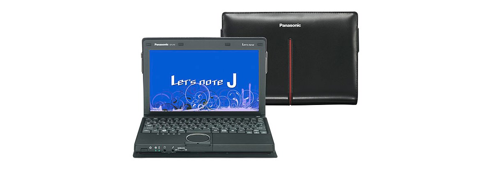
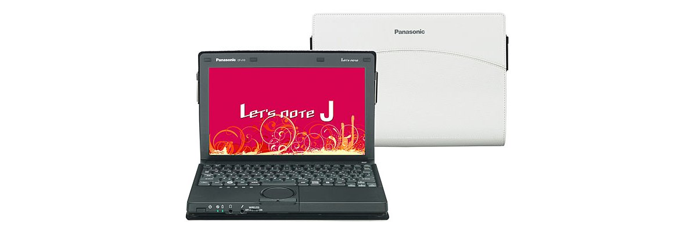
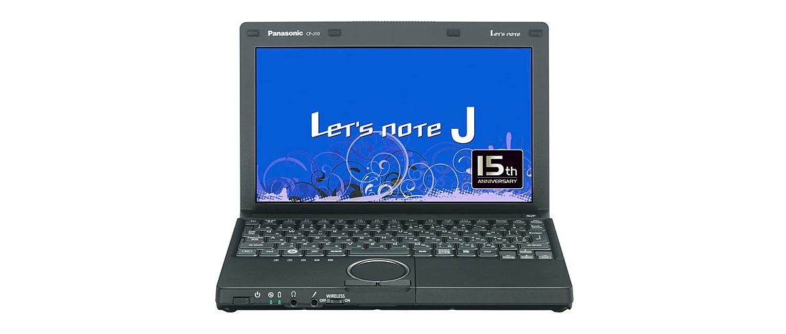
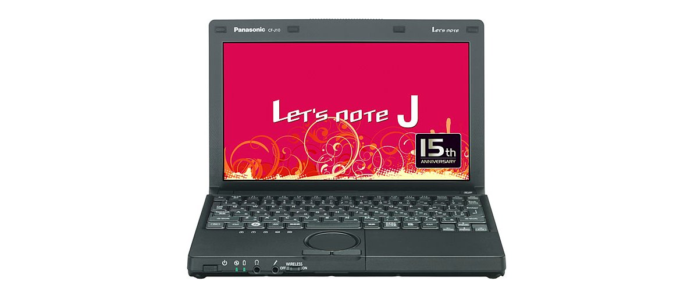
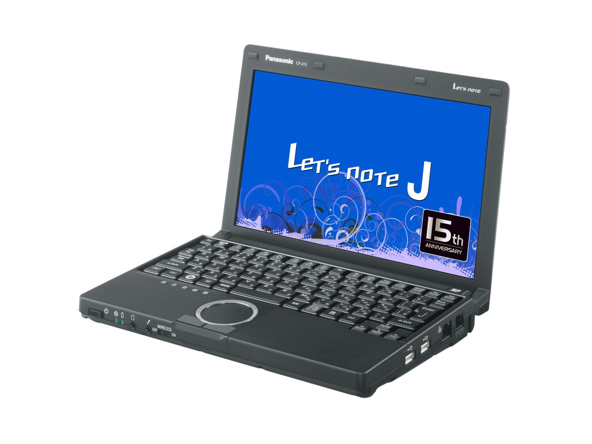

# 松下 Let's note CF-J10 规格参数

[English](../../en/CF-J10/) · [日本語](../../ja/CF-J10/) · **中文**

**CF-J10** 是松下 Let's note 笔记本电脑，属于 J10 系列，配备 10.1英寸 WXGA 屏幕。本页收录其全部 20 个型号（2011-02 – 2012-05 发售）的规格参数。每个型号均附官方规格表链接。

*松下 Let's note CF-J10（CF-J10SYBHR, CF-J10SYNHR, CF-J10QYBHR, CF-J10QYNHR）。图片 © Panasonic*

## 型号列表

| 型号（品番） | 发售 | 停产 | 主要规格 |
| :-- | :-- | :-- | :-- |
| [CF-J10YYNHR](https://panasonic.jp/pc/p-db/CF-J10YYNHR_spec.html) | 2012-05 | 2013-05 | Windows 7 Home Premium 64位 正版（已应用 Service Pack 1）、英特尔® CoreTM i5-2450M（2.50GHz）、内存：标配4GB（空闲插槽1个，最大8GB）、SSD：128GB、LAN、无线LAN 802.11a(W52/W53/W56)/b/g/n、Office Home and Business 2010 |
| [CF-J10YYBHR](https://panasonic.jp/pc/p-db/CF-J10YYBHR_spec.html) | 2012-05 | 2013-02 | Windows 7 Home Premium 64位 正版（已应用 Service Pack 1）、英特尔® CoreTM i5-2450M（2.50GHz）、内存：标配4GB（空闲插槽1个，最大8GB）、SSD：128GB、LAN、无线LAN 802.11a(W52/W53/W56)/b/g/n |
| [CF-J10XYAHR](https://panasonic.jp/pc/p-db/CF-J10XYAHR_spec.html) | 2012-05 | 2013-02 | Windows 7 Home Premium 64位 正版 （已应用 Service Pack 1）、英特尔® CoreTM i3-2350M（2.30GHz）、内存：标准4GB（空闲插槽1、最大8GB）、HDD：320GB、LAN、无线LAN 802.11a(W52/W53/W56)/b/g/n |
| [CF-J10XYPHR](https://panasonic.jp/pc/p-db/CF-J10XYPHR_spec.html) | 2012-05 | 2013-02 | Windows 7 Home Premium 64位 正版 （已应用 Service Pack 1）、英特尔® CoreTM i3-2350M（2.30GHz）、内存：标准4GB（空闲插槽1、最大8GB）、HDD：320GB、LAN、无线LAN 802.11a(W52/W53/W56)/b/g/n、Office Home and Business 2010 |
| [CF-J10WYBHR](https://panasonic.jp/pc/p-db/CF-J10WYBHR_spec.html) | 2012-02 | 2012-05 | Windows® 7 Home Premium 64位 正版（已应用 Service Pack 1）、英特尔® CoreTM i5-2435M（2.40GHz）、内存：标准4GB（空闲插槽1、最大8GB）、SSD：128GB、、LAN、无线LAN 802.11a(W52/W53/W56)/b/g/n |
| [CF-J10WYNHR](https://panasonic.jp/pc/p-db/CF-J10WYNHR_spec.html) | 2012-02 | 2012-05 | Windows® 7 Home Premium 64位 正版（已应用 Service Pack 1）、英特尔® CoreTM i5-2435M（2.40GHz）、内存：标准4GB（空闲插槽1、最大8GB）、SSD：128GB、LAN、无线LAN 802.11a(W52/W53/W56)/b/g/n、Office Home and Business 2010 |
| [CF-J10VYAHR](https://panasonic.jp/pc/p-db/CF-J10VYAHR_spec.html) | 2012-02 | 2012-07 | Windows® 7 Home Premium 64位 正版（已应用 Service Pack 1）、英特尔® CoreTM i3-2350M（2.30GHz）、内存：标准4GB（空闲插槽1、最大8GB）、HDD：250GB、LAN、无线LAN 802.11a(W52/W53/W56)/b/g/n |
| [CF-J10VYPHR](https://panasonic.jp/pc/p-db/CF-J10VYPHR_spec.html) | 2012-02 | 2012-07 | Windows® 7 Home Premium 64位 正版（已应用 Service Pack 1）、英特尔® CoreTM i3-2350M（2.30GHz）、内存：标准4GB（空闲插槽1、最大8GB）、HDD：250GB、LAN、无线LAN 802.11a(W52/W53/W56)/b/g/n、Office Home and Business 2010 |
| [CF-J10UYBHR](https://panasonic.jp/pc/p-db/CF-J10UYBHR_spec.html) | 2011-09 | 2012-04 | Windows® 7 Home Premium 64位 正版（已应用 Service Pack 1）、英特尔® CoreTM i5-2410M（2.30GHz）、内存：标准4GB（空闲插槽1、最大8GB）、SSD：128GB、、LAN、无线LAN 802.11a(W52/W53/W56)/b/g/n |
| [CF-J10UYNHR](https://panasonic.jp/pc/p-db/CF-J10UYNHR_spec.html) | 2011-09 | 2012-02 | Windows® 7 Home Premium 64位 正版（已应用 Service Pack 1）、英特尔® CoreTM i5-2410M（2.30GHz）、内存：标准4GB（空闲插槽1、最大8GB）、SSD：128GB、LAN、无线LAN 802.11a(W52/W53/W56)/b/g/n、Office Home and Business 2010 ＜数量限定＞ |
| [CF-J10TYAHR](https://panasonic.jp/pc/p-db/CF-J10TYAHR_spec.html) | 2011-09 | 2012-02 | Windows® 7 Home Premium 64位 正版（已应用 Service Pack 1）、英特尔® CoreTM i3-2330M（2.20GHz）、内存：标准4GB（空闲插槽1、最大8GB）、HDD：250GB、LAN、无线LAN 802.11a(W52/W53/W56)/b/g/n |
| [CF-J10TYPHR](https://panasonic.jp/pc/p-db/CF-J10TYPHR_spec.html) | 2011-09 | 2012-02 | Windows® 7 Home Premium 64位 正版（已应用 Service Pack 1）、英特尔® CoreTM i3-2330M（2.20GHz）、内存：标准4GB（空闲插槽1、最大8GB）、HDD：250GB、LAN、无线LAN 802.11a(W52/W53/W56)/b/g/n、Office Home and Business 2010 ＜数量限定＞ |
| [CF-J10SYBHR](https://panasonic.jp/pc/p-db/CF-J10SYBHR_spec.html) | 2011-05 | 2011-09 | Windows® 7 Home Premium 32位 正版（已应用 Service Pack 1）、英特尔® CoreTM i5-2410M（2.30GHz）、内存：标准2GB（空闲插槽1、最大6GB）、SSD：128GB、、LAN、无线LAN 802.11a(W52/W53/W56)/b/g/n |
| [CF-J10SYNHR](https://panasonic.jp/pc/p-db/CF-J10SYNHR_spec.html) | 2011-05 | 2011-09 | Windows® 7 Home Premium 32位 正版（已应用 Service Pack 1）、英特尔® CoreTM i5-2410M（2.30GHz）、内存：标准2GB（空闲插槽1、最大6GB）、SSD：128GB、LAN、无线LAN 802.11a(W52/W53/W56)/b/g/n、Office Home and Business 2010 ＜数量限定＞ |
| [CF-J10RYAHR](https://panasonic.jp/pc/p-db/CF-J10RYAHR_spec.html) | 2011-05 | 2011-09 | Windows® 7 Home Premium 32位 正版（已应用 Service Pack 1）、英特尔® CoreTM i3-2310M（2.10GHz）、内存：标准2GB（空闲插槽1、最大6GB）、HDD：250GB、LAN、无线LAN 802.11a(W52/W53/W56)/b/g/n |
| [CF-J10RYPHR](https://panasonic.jp/pc/p-db/CF-J10RYPHR_spec.html) | 2011-05 | 2011-09 | Windows® 7 Home Premium 32位 正版（已应用 Service Pack 1）、英特尔® CoreTM i3-2310M（2.10GHz）、内存：标准2GB（空闲插槽1、最大6GB）、HDD：250GB、LAN、无线LAN 802.11a(W52/W53/W56)/b/g/n、Office Home and Business 2010 ＜数量限定＞ |
| [CF-J10QYBHR](https://panasonic.jp/pc/p-db/CF-J10QYBHR_spec.html) | 2011-02 | 2011-04 | Windows® 7 Home Premium 正版、英特尔® CoreTM i5-480M（2.66GHz）、内存：标准2GB（最大6GB）、SSD：128GB、、LAN、无线LAN 802.11a(W52/W53/W56)/b/g/n |
| [CF-J10QYNHR](https://panasonic.jp/pc/p-db/CF-J10QYNHR_spec.html) | 2011-02 | 2011-04 | Windows® 7 Home Premium 正版、英特尔® CoreTM i5-480M（2.66GHz）、内存：标准2GB（最大6GB）、SSD：128GB、LAN、无线LAN 802.11a(W52/W53/W56)/b/g/n、Office Home and Business 2010 ＜数量限定＞ |
| [CF-J10PYAHR](https://panasonic.jp/pc/p-db/CF-J10PYAHR_spec.html) | 2011-02 | 2011-04 | Windows® 7 Home Premium 正版、英特尔® CoreTM i3-380M（2.53GHz）、内存：标准2GB（最大6GB）、HDD：160GB、LAN、无线LAN 802.11a(W52/W53/W56)/b/g/n |
| [CF-J10PYPHR](https://panasonic.jp/pc/p-db/CF-J10PYPHR_spec.html) | 2011-02 | 2011-04 | Windows® 7 Home Premium 正版、英特尔® CoreTM i3-380M（2.53GHz）、内存：标准2GB（最大6GB）、HDD：160GB、LAN、无线LAN 802.11a(W52/W53/W56)/b/g/n、Office Home and Business 2010 ＜数量限定＞ |

## 通用规格

| 项目 | 规格 |
| :-- | :-- |
| 显示屏 / 色彩 | 1366×768像素：约1677万色 |
| 无线通信模块 | 英特尔 Centrino Advanced-N + WiMAX 6250 |
| 无线网络 | 符合IEEE802.11a（W52/W53/W56）/b/g/n |
| 指点设备 | 滚轮触控板 |
| 功耗 | 最大约65W |
| 能效达成率（2011 年度标准） | — |

## 各型号差异

| 型号（品番） | 处理器 | 内存 | 存储 | 重量 | 续航 |
| :-- | :-- | :-- | :-- | :-- | :-- |
| CF-J10YYNHR | Core i5-2450M，智能缓存3MB，运行频率2.50GHz，支持睿频加速技术2.0 | 4GBPC3-8500 | 128GB | 1.205 kg | 12.5 h |
| CF-J10YYBHR | Core i5-2450M，智能缓存3MB，运行频率2.50GHz，支持睿频加速技术2.0 | 4GBPC3-8500 | 128GB | 1.205 kg | 12.5 h |
| CF-J10XYAHR | Core i3-2350M，智能缓存3MB，运行频率2.30GHz | 4GBPC3-8500 | 硬盘驱动器 | 1.185 kg | 7.5 h |
| CF-J10XYPHR | Core i3-2350M，智能缓存3MB，运行频率2.30GHz | 4GBPC3-8500 | 硬盘驱动器 | 1.185 kg | 7.5 h |
| CF-J10WYBHR | Core i5-2435M，智能缓存3MB，运行频率2.40GHz，支持睿频加速技术2.0 | 4GBPC3-8500 | 128GB | 1.205 kg | 12.5 h |
| CF-J10WYNHR | Core i5-2435M，智能缓存3MB，运行频率2.40GHz，支持睿频加速技术2.0 | 4GBPC3-8500 | 128GB | 1.205 kg | 12.5 h |
| CF-J10VYAHR | Core i3-2350M，智能缓存3MB，运行频率2.30GHz | 4GBPC3-8500 | 250GB | 1.185 kg | 7.5 h |
| CF-J10VYPHR | Core i3-2350M，智能缓存3MB，运行频率2.30GHz | 4GBPC3-8500 | 250GB | 1.185 kg | 7.5 h |
| CF-J10UYBHR | Core i5-2410M，智能缓存3MB，运行频率2.30GHz，支持睿频加速技术2.0 | 4GBPC3-8500 | 128GB | 1.205 kg | 12.5 h |
| CF-J10UYNHR | Core i5-2410M，智能缓存3MB，运行频率2.30GHz，支持睿频加速技术2.0 | 4GBPC3-8500 | 128GB | 1.205 kg | 12.5 h |
| CF-J10TYAHR | Core i3-2330M，智能缓存3MB，运行频率2.20GHz | 4GBPC3-8500 | 250GB | 1.185 kg | 7.5 h |
| CF-J10TYPHR | Core i3-2330M，智能缓存3MB，运行频率2.20GHz | 4GBPC3-8500 | 250 GB | 1.185 kg | 7.5 h |
| CF-J10SYBHR | Core i5-2410M，智能缓存3MB，运行频率2.30GHz，支持睿频加速技术2.0 | 2GBPC3-8500 | 128GB | 1.205 kg | 13 h |
| CF-J10SYNHR | Core i5-2410M，智能缓存3MB，运行频率2.30GHz，支持睿频加速技术2.0 | 2GBPC3-8500 | 128GB | 1.205 kg | 13 h |
| CF-J10RYAHR | Core i3-2310M，智能缓存3MB，运行频率2.10GHz | 2GBPC3-8500 | 250GB | 1.185 kg | 8 h |
| CF-J10RYPHR | Core i3-2310M，智能缓存3MB，运行频率2.10GHz | 2GBPC3-8500 | 250GB | 1.185 kg | 8 h |
| CF-J10QYBHR | Core i5-480M，智能缓存3MB，运行频率2.66GHz，使用睿频加速技术时最高 | 2GB、PC3-6400 | 128GB | 1.205 kg | 12 h |
| CF-J10QYNHR | Core i5-480M，智能缓存3MB，运行频率2.66GHz，使用睿频加速技术时最高 | 2GB、PC3-6400 | 128GB | 1.205 kg | 12 h |
| CF-J10PYAHR | Core i3-380M，智能缓存3MB，运行频率2.53GHz | 2GB、PC3-6400 | 160GB HDD | 1.185 kg | 7.5 h |
| CF-J10PYPHR | Core i3-380M，智能缓存3MB，运行频率2.53GHz | 2GB、PC3-6400 | 160GB HDD | 1.185 kg | 7.5 h |

CF-J10YYNHR 的全部差异规格

| 项目 | 规格 |
| :-- | :-- |
| 操作系统 | ▼基础操作系统：Windows7 Home Premium 64位正版（已应用 Service Pack1）/Windows7 Home Premium 32位正版（已应用 Service Pack1） / ▼安装操作系统：Windows7 Home Premium 64位正版（已应用 Service Pack1） |
| 处理器 | 英特尔 Core i5-2450M 处理器，英特尔 智能缓存3MB，运行频率2.50GHz，使用英特尔 睿频加速技术2.0时最高3.10GHz |
| 芯片组 | 移动 英特尔 HM65 Express 芯片组 |
| 内存 | 标配4GBPC3-8500/DDR3 SDRAM（最大8GB） (空闲插槽×1) |
| 显存 | 最大1696MB（与主内存共用） |
| 固态硬盘 | 闪存驱动器（SSD）：128GB（Serial ATA）上述容量中约15GB用作恢复区域、约300MB用作系统区域（用户不可使用） |
| 光驱 | 未配备 |
| 显示屏 | 10.1英寸宽屏（16：9）TFT彩色液晶 HD (1366×768像素) |
| 显示屏 / 显卡 | 英特尔 HD显卡3000（集成于CPU） |
| 显示屏 / 外接显示输出 | 800×600、1024×768、1280×768、1280×1024、1360×768、1366×768、1400×1050、1600×900、1680×1050、1600×1200、1920×1080、1920×1200像素：约1677万色 |
| 显示屏 / 同时显示 | 800×600、1024×768、1280×768、1360×768、1366×768像素：约1677万 |
| 移动 WiMAX | 符合IEEE802.16e-2005（接收最大28Mbps（尽力而为方式）、发送最大6Mbps（尽力而为方式）） |
| 有线网络 | 1000BASE-T/100BASE-TX/10BASE-T，未配备调制解调器。 |
| 音频 | PCM音源（24位立体声）、英特尔 High Definition Audio标准、单声道扬声器 |
| 卡槽 / PC 卡 | 未配备 |
| 卡槽 / SD 卡 | SD存储卡×1插槽（支持SDHC存储卡/SDXC存储卡/支持版权保护技术/支持UHS-I高速传输） |
| 内存扩展槽 | DDR3 204针SO-DIMM专用插槽×1 (1.5V/PC3-8500/DDR3 SDRAM) |
| 接口 | LAN 接口（RJ-45） / 外接显示器接口（模拟 RGB 迷你 Dsub 15 针） / HDMI 输出端子 / 麦克风输入端子（立体声迷你插孔 M3（支持插入式电源）） / 音频输出端子（立体声迷你插孔 M3） / USB2.0 端口×2（右侧面） / USB3.0 端口×1（右侧面） |
| 键盘 | 符合OADG标准86键、键距17mm（横向）/14.2mm（纵向）（部分键除外） |
| 电源 | ▼AC适配器※19：输入：AC100V～240V、50Hz/60Hz、输出：DC16V、4.06A、电源线仅限100V专用 / ▼电池组：附带电池组（L）（7.2V锂离子・标称容量9.3Ah、额定容量8.7Ah） |
| 能效 | 2011年度标准 0类0.085 |
| 续航 / 充电时间 | ▼续航时间：安装附带的电池组(L)时：约12.5小时、安装另售的电池组(S)时：约8小时 / ▼充电时间：约3.5小时（电源关闭时）/ 约5小时（电源开启时） |
| 尺寸（宽×深×高） | 安装护套时：宽259 mm×深185 mm×高39 mm/48 mm（前部/后部）※25、未安装护套时：宽251.9 mm×深171.7 mm×高27.3 mm/35.1 mm（前部/后部） |
| 颜色 | 黑色 |
| 重量（含电池） | 安装护套时：约1.205kg，未安装护套时：约0.99kg（安装附带的电池组(L)（约0.32kg）时）、AC适配器：约0.2kg（不含电源线（约0.06kg）） |
| 预装软件 | 峰值转移控制实用程序、电源计划扩展实用程序、McAfee PC安全中心、无线切换实用程序、安全设置实用程序、电池剩余电量显示校正实用程序、Fn Ctrl功能互换实用程序、“i-Filter 6.0”（30天免费试用版）、ATOK for Windows 免费试用版、金山词霸、WinZip 14.5 日语版、快速启动管理器、恢复光盘创建实用程序、DirectX 11、Dashboard for Panasonic PC、Windows Live Mail、Windows Live Photo Gallery、Windows Live Messenger、Windows Live Writer、Windows Live Movie Maker、Windows Live Mesh、Aptio设置实用程序、硬盘数据擦除实用程序、PC-Diagnostic实用程序 |
| Microsoft Office | Microsoft Office Home and Business 2010 |
| 附件 | 护套（黑豹黑）、AC适配器、电池组、使用说明书、Microsoft Office Home and Business 2010 |

官方规格表: <https://panasonic.jp/pc/p-db/CF-J10YYNHR_spec.html>

CF-J10YYBHR 的全部差异规格

| 项目 | 规格 |
| :-- | :-- |
| 操作系统 | ▼基础操作系统：Windows7 Home Premium 64位正版（已应用 Service Pack1）/Windows7 Home Premium 32位正版（已应用 Service Pack1） / ▼安装操作系统：Windows7 Home Premium 64位正版（已应用 Service Pack1） |
| 处理器 | 英特尔 Core i5-2450M 处理器，英特尔 智能缓存3MB，运行频率2.50GHz，使用英特尔 睿频加速技术2.0时最高3.10GHz |
| 芯片组 | 移动 英特尔 HM65 Express 芯片组 |
| 内存 | 标配4GBPC3-8500/DDR3 SDRAM（最大8GB） (空闲插槽×1) |
| 显存 | 最大1696MB（与主内存共用） |
| 固态硬盘 | 闪存驱动器（SSD）：128GB（Serial ATA）上述容量中约15GB用作恢复区域、约300MB用作系统区域（用户不可使用） |
| 光驱 | 未配备 |
| 显示屏 | 10.1英寸宽屏（16：9）TFT彩色液晶 HD (1366×768像素) |
| 显示屏 / 显卡 | 英特尔 HD显卡3000（集成于CPU） |
| 显示屏 / 外接显示输出 | 800×600、1024×768、1280×768、1280×1024、1360×768、1366×768、1400×1050、1600×900、1680×1050、1600×1200、1920×1080、1920×1200像素：约1677万色 |
| 显示屏 / 同时显示 | 800×600、1024×768、1280×768、1360×768、1366×768像素：约1677万 |
| 移动 WiMAX | 符合IEEE802.16e-2005（接收最大28Mbps（尽力而为方式）、发送最大6Mbps（尽力而为方式）） |
| 有线网络 | 1000BASE-T/100BASE-TX/10BASE-T，未配备调制解调器。 |
| 音频 | PCM音源（24位立体声）、英特尔 High Definition Audio标准、单声道扬声器 |
| 卡槽 / PC 卡 | 未配备 |
| 卡槽 / SD 卡 | SD存储卡×1插槽（支持SDHC存储卡/SDXC存储卡/支持UHS-I高速传输/支持版权保护技术） |
| 内存扩展槽 | DDR3 204针SO-DIMM专用插槽×1 (1.5V/PC3-8500/DDR3 SDRAM) |
| 接口 | LAN 接口（RJ-45） / 外接显示器接口（模拟 RGB 迷你 Dsub 15 针） / HDMI 输出端子 / 麦克风输入端子（立体声迷你插孔 M3（支持插入式电源）） / 音频输出端子（立体声迷你插孔 M3） / USB2.0 端口×2（右侧面） / USB3.0 端口×1（右侧面） |
| 键盘 | 符合OADG标准86键、键距17mm（横向）/14.2mm（纵向）（部分键除外） |
| 电源 | ▼AC适配器※19：输入：AC100V～240V、50Hz/60Hz、输出：DC16V、4.06A、电源线仅限100V专用 / ▼电池组：附带电池组（L）（7.2V锂离子・标称容量9.3Ah、额定容量8.7Ah） |
| 能效 | 2011年度标准 0类0.085 |
| 续航 / 充电时间 | ▼续航时间：安装附带的电池组(L)时：约12.5小时、安装另售的电池组(S)时：约8小时 / ▼充电时间：约3.5小时（电源关闭时）/ 约5小时（电源开启时） |
| 尺寸（宽×深×高） | 安装护套时：宽259 mm×深185 mm×高39 mm/48 mm（前部/后部）※25、未安装护套时：宽251.9 mm×深171.7 mm×高27.3 mm/35.1 mm（前部/后部） |
| 颜色 | 黑色 |
| 重量（含电池） | 安装护套时：约1.205kg，未安装护套时：约0.99kg（安装附带的电池组(L)（约0.32kg）时）、AC适配器：约0.2kg（不含电源线（约0.06kg）） |
| 预装软件 | 峰值转移控制实用程序、电源计划扩展实用程序、McAfee PC安全中心、无线切换实用程序、安全设置实用程序、电池剩余电量显示校正实用程序、Fn Ctrl功能互换实用程序、“i-Filter 6.0”（30天免费试用版）、ATOK for Windows 免费试用版、金山词霸、WinZip 14.5 日语版、快速启动管理器、恢复光盘创建实用程序、DirectX 11、Dashboard for Panasonic PC、Windows Live Mail、Windows Live Photo Gallery、Windows Live Messenger、Windows Live Writer、Windows Live Movie Maker、Windows Live Mesh、Aptio设置实用程序、硬盘数据擦除实用程序、PC-Diagnostic实用程序 |
| 附件 | 护套（黑豹黑）、AC适配器、电池组、使用说明书 |

官方规格表: <https://panasonic.jp/pc/p-db/CF-J10YYBHR_spec.html>

CF-J10XYAHR 的全部差异规格

| 项目 | 规格 |
| :-- | :-- |
| 操作系统 | ▼基础操作系统：Windows7 Home Premium 64位正版（已应用 Service Pack1）/Windows7 Home Premium 32位正版（已应用 Service Pack1） / ▼安装操作系统：Windows7 Home Premium 64位正版（已应用 Service Pack1） |
| 处理器 | 英特尔 Core i3-2350M 处理器、英特尔 智能缓存3MB、工作频率2.30GHz |
| 芯片组 | 移动 英特尔 HM65 Express 芯片组 |
| 内存 | 标配4GBPC3-8500/DDR3 SDRAM（最大8GB） (空闲插槽×1) |
| 显存 | 最大1696MB（与主内存共用） |
| 光驱 | 未配备 |
| 显示屏 | 10.1英寸宽屏（16：9）TFT彩色液晶 HD (1366×768像素) |
| 显示屏 / 显卡 | 英特尔 HD显卡3000（集成于CPU） |
| 显示屏 / 外接显示输出 | 800×600、1024×768、1280×768、1280×1024、1360×768、1366×768、1400×1050、1600×900、1680×1050、1600×1200、1920×1080、1920×1200像素：约1677万色 |
| 显示屏 / 同时显示 | 800×600、1024×768、1280×768、1360×768、1366×768像素：约1677万 |
| 移动 WiMAX | 符合IEEE802.16e-2005（接收最大28Mbps（尽力而为方式）、发送最大6Mbps（尽力而为方式）） |
| 有线网络 | 1000BASE-T/100BASE-TX/10BASE-T，未配备调制解调器。 |
| 音频 | PCM音源（24位立体声）、英特尔 High Definition Audio标准、单声道扬声器 |
| 卡槽 / PC 卡 | 未配备 |
| 卡槽 / SD 卡 | SD存储卡×1插槽（支持SDHC存储卡/SDXC存储卡/支持UHS-I高速传输/支持版权保护技术） |
| 内存扩展槽 | DDR3 204针SO-DIMM专用插槽×1 (1.5V/PC3-8500/DDR3 SDRAM) |
| 接口 | LAN 接口（RJ-45） / 外接显示器接口（模拟 RGB 迷你 Dsub 15 针） / HDMI 输出端子 / 麦克风输入端子（立体声迷你插孔 M3（支持插入式电源）） / 音频输出端子（立体声迷你插孔 M3） / USB2.0 端口×2（右侧面） / USB3.0 端口×1（右侧面） |
| 键盘 | 符合OADG标准86键、键距17mm（横向）/14.2mm（纵向）（部分键除外） |
| 电源 | ▼AC适配器※19：输入：AC100V～240V、50Hz/60Hz、输出：DC16V、4.06A、电源线仅限100V专用 / ▼电池组：附带电池组（L）（7.2V锂离子・标称容量6.2Ah、额定容量5.8Ah） |
| 能效 | 2011年度基准 N类别0.11 |
| 续航 / 充电时间 | ▼续航时间：安装附带的电池组(S)时：约7.5小时、安装另售的电池组(L)时：约11.5小时 / ▼充电时间：约3.5小时（电源关闭时）/ 约5小时（电源开启时） |
| 尺寸（宽×深×高） | 安装护套时：宽259 mm×深185 mm×高39 mm/48 mm（前部/后部）※25、未安装护套时：宽251.9 mm×深171.7 mm×高27.3 mm/35.1 mm（前部/后部） |
| 颜色 | 黑色 |
| 重量（含电池） | 安装护套时：约1.185kg，未安装护套时：约0.97kg（安装附带的电池组(S)（约0.23kg）时）、AC适配器：约0.2kg（不含电源线（约0.06kg）） |
| 预装软件 | 峰值转移控制实用程序、电源计划扩展实用程序、McAfee PC安全中心、无线切换实用程序、安全设置实用程序、电池剩余电量显示校正实用程序、Fn Ctrl功能互换实用程序、“i-Filter 6.0”（30天免费试用版）、ATOK for Windows 免费试用版、金山词霸、WinZip 14.5 日语版、快速启动管理器、恢复光盘创建实用程序、DirectX 11、Dashboard for Panasonic PC、Windows Live Mail、Windows Live Photo Gallery、Windows Live Messenger、Windows Live Writer、Windows Live Movie Maker、Windows Live Mesh、Aptio设置实用程序、硬盘数据擦除实用程序、PC-Diagnostic实用程序 |
| 附件 | 护套（雪纺白）、AC适配器、电池组、使用说明书 |
| 硬盘 | 硬盘驱动器（HDD）320GB（Serial ATA、5400rpm）上述容量中约15GB用作恢复区域、约300MB用作系统区域（用户不可使用） |

官方规格表: <https://panasonic.jp/pc/p-db/CF-J10XYAHR_spec.html>

CF-J10XYPHR 的全部差异规格

| 项目 | 规格 |
| :-- | :-- |
| 操作系统 | ▼基础操作系统：Windows7 Home Premium 64位正版（已应用 Service Pack1）/Windows7 Home Premium 32位正版（已应用 Service Pack1） / ▼安装操作系统：Windows7 Home Premium 64位正版（已应用 Service Pack1） |
| 处理器 | 英特尔 Core i3-2350M 处理器、英特尔 智能缓存3MB、工作频率2.30GHz |
| 芯片组 | 移动 英特尔 HM65 Express 芯片组 |
| 内存 | 标配4GBPC3-8500/DDR3 SDRAM（最大8GB） (空闲插槽×1) |
| 显存 | 最大1696MB（与主内存共用） |
| 光驱 | 未配备 |
| 显示屏 | 10.1英寸宽屏（16：9）TFT彩色液晶 HD (1366×768像素) |
| 显示屏 / 显卡 | 英特尔 HD显卡3000（集成于CPU） |
| 显示屏 / 外接显示输出 | 800×600、1024×768、1280×768、1280×1024、1360×768、1366×768、1400×1050、1600×900、1680×1050、1600×1200、1920×1080、1920×1200像素：约1677万色 |
| 显示屏 / 同时显示 | 800×600、1024×768、1280×768、1360×768、1366×768像素：约1677万 |
| 移动 WiMAX | 符合IEEE802.16e-2005（接收最大28Mbps（尽力而为方式）、发送最大6Mbps（尽力而为方式）） |
| 有线网络 | 1000BASE-T/100BASE-TX/10BASE-T，未配备调制解调器。 |
| 音频 | PCM音源（24位立体声）、英特尔 High Definition Audio标准、单声道扬声器 |
| 卡槽 / PC 卡 | 未配备 |
| 卡槽 / SD 卡 | SD存储卡×1插槽（支持SDHC存储卡/SDXC存储卡/支持UHS-I高速传输/支持版权保护技术） |
| 内存扩展槽 | DDR3 204针SO-DIMM专用插槽×1 (1.5V/PC3-8500/DDR3 SDRAM) |
| 接口 | LAN 接口（RJ-45） / 外接显示器接口（模拟 RGB 迷你 Dsub 15 针） / HDMI 输出端子 / 麦克风输入端子（立体声迷你插孔 M3（支持插入式电源）） / 音频输出端子（立体声迷你插孔 M3） / USB2.0 端口×2（右侧面） / USB3.0 端口×1（右侧面） |
| 键盘 | 符合OADG标准86键、键距17mm（横向）/14.2mm（纵向）（部分键除外） |
| 电源 | ▼AC适配器※19：输入：AC100V～240V、50Hz/60Hz、输出：DC16V、4.06A、电源线仅限100V专用 / ▼电池组：附带电池组（L）（7.2V锂离子・标称容量6.2Ah、额定容量5.8Ah） |
| 能效 | 2011年度基准 N类别0.11 |
| 续航 / 充电时间 | ▼续航时间：安装附带的电池组(S)时：约7.5小时、安装另售的电池组(L)时：约11.5小时 / ▼充电时间：约3.5小时（电源关闭时）/ 约5小时（电源开启时） |
| 尺寸（宽×深×高） | 安装护套时：宽259 mm×深185 mm×高39 mm/48 mm（前部/后部）※25、未安装护套时：宽251.9 mm×深171.7 mm×高27.3 mm/35.1 mm（前部/后部） |
| 颜色 | 黑色 |
| 重量（含电池） | 安装护套时：约1.185kg，未安装护套时：约0.97kg（安装附带的电池组(S)（约0.23kg）时）、AC适配器：约0.2kg（不含电源线（约0.06kg）） |
| 预装软件 | 峰值转移控制实用程序、电源计划扩展实用程序、McAfee PC安全中心、无线切换实用程序、安全设置实用程序、电池剩余电量显示校正实用程序、Fn Ctrl功能互换实用程序、“i-Filter 6.0”（30天免费试用版）、ATOK for Windows 免费试用版、金山词霸、WinZip 14.5 日语版、快速启动管理器、恢复光盘创建实用程序、DirectX 11、Dashboard for Panasonic PC、Windows Live Mail、Windows Live Photo Gallery、Windows Live Messenger、Windows Live Writer、Windows Live Movie Maker、Windows Live Mesh、Aptio设置实用程序、硬盘数据擦除实用程序、PC-Diagnostic实用程序 |
| Microsoft Office | Microsoft Office Home and Business 2010 |
| 附件 | 护套（雪纺白）、AC适配器、电池组、使用说明书、Microsoft Office Home and Business 2010 |
| 硬盘 | 硬盘驱动器（HDD）320GB（Serial ATA、5400rpm）上述容量中约15GB用作恢复区域、约300MB用作系统区域（用户不可使用） |

官方规格表: <https://panasonic.jp/pc/p-db/CF-J10XYPHR_spec.html>

CF-J10WYBHR 的全部差异规格

| 项目 | 规格 |
| :-- | :-- |
| 操作系统 | ▼基础OS：Windows 7 Home Premium 32/64位 正版(已应用Service Pack 1)（日语版） / ▼安装OS：Windows 7 Home Premium 64位 正版(已应用Service Pack 1)（日语版） |
| 处理器 | 英特尔 Core i5-2435M 处理器，英特尔 智能缓存3MB，运行频率2.40GHz，使用英特尔 睿频加速技术2.0时最高3.00GHz |
| 芯片组 | 移动 英特尔 HM65 Express 芯片组 |
| 内存 | 标配4GBPC3-8500/DDR3 SDRAM（最大8GB） (空闲插槽×1) |
| 显存 | 最大1696MB（与主内存共用），增加2GB或4GB内存时最大1556MB（与主内存共用） |
| 固态硬盘 | 闪存驱动器（SSD）：128GB（Serial ATA）上述容量中约12GB用作恢复区域、约300MB用作系统区域（用户不可使用） |
| 显示屏 | 10.1英寸宽屏（16：9）TFT彩色液晶 WXGA (1366×768像素) |
| 显示屏 / 显卡 | 英特尔 HD显卡3000（集成于英特尔 Core i5-2435M 处理器） |
| 显示屏 / 外接显示输出 | 800×600、1024×768、1280×768、1280×1024、1360×768、1366×768、1400×1050、1600×900、1680×1050、1600×1200、1920×1080、1920×1200像素：约1677万色 |
| 显示屏 / 同时显示 | 800×600、1024×768、1280×768、1360×768、1366×768像素：约1677万色 |
| 有线网络 | 1000BASE-T / 100BASE-TX / 10BASE-T |
| 音频 | PCM音源（24位立体声）、英特尔 High Definition Audio 标准・单声道扬声器 |
| 内存扩展槽 | DDR3 204针SO-DIMM专用插槽×1 (1.5V/PC3-8500/DDR3 SDRAM) |
| 接口 | USB2.0端口×2(右侧面)、USB3.0端口×1(左侧面)、LAN接口（RJ-45）、HDMI输出端子、外接显示器接口（模拟RGB 迷你Dsub 15针）、麦克风输入端子（立体声迷你插孔M3（支持插入式电源））、音频输出端子（立体声迷你插孔M3） |
| 键盘 | 符合OADG标准85键、键距17mm（横向）/14.2mm（纵向）（部分键除外） |
| 电源 | ▼AC适配器：输入：AC100V～240V、50Hz/60Hz，输出：DC16V、4.06A，电源线仅适用于100V / ▼电池组：附带电池组(L)（7.2V锂离子・标称容量9.3Ah、额定容量8.7Ah） |
| 能效 | 2011年度基准 N类别0.086 |
| 续航 / 充电时间 | ▼续航时间：安装附带的电池组(L)时：约12.5小时、安装另售的电池组(S)时：约8小时 / ▼充电时间：约3.5小时（电源关闭时）/ 约5小时（电源开启时） |
| 尺寸（宽×深×高） | 安装护套时：宽259 mm×深185 mm×高39 mm/48 mm（前部/后部）、未安装护套时：宽251.9 mm×深171.7 mm×高27.3 mm/35.1 mm（前部/后部） |
| 重量（含电池） | 安装护套时：约1.205kg，未安装护套时：约0.99kg（安装附带的电池组(L)（约0.32kg）时）、AC适配器：约0.2kg（不含电源线（约0.06kg）） |
| 预装软件 | Microsoft Internet Explorer 9.0、绿色goo棒、网络选择器3、无线切换实用程序、安全设置实用程序、迈克菲PC安全中心、i-过滤器6.0（30天试用版）、Adobe Reader、WinZip 14.5日语版、电池余量显示校正实用程序、滚轮触控板实用程序、NumLock通知、Hotkey设置、Fn Ctrl功能互换实用程序、ATOK for Windows 免费试用版、金山词典、电源计划扩展实用程序、峰值转移控制实用程序、Microsoft Windows Media Player 12、投影仪助手、USB键盘助手、显示器助手、Wireless Manager mobile edition5.5、英特尔 WiDi软件、缩放查看器、画面分割实用程序、快速启动管理器、PC信息弹窗、PC信息查看器、Aptio设置实用程序、PC-Diagnostic实用程序、Dashboard for Panasonic PC、硬盘数据擦除实用程序、DirectX 11、Microsoft .NET Framework 3.5.1、英特尔 PROSet/Wireless Software、英特尔 My WiFi 技术、VIP Access for Desktop（英特尔 IPT 用应用程序）、英特尔身份保护技术、Windows Live邮件、Windows Live照片库、Windows Live Messenger、Windows Live Writer、Silverlight、贴合视图、恢复光盘创建实用程序 |
| 附件 | 护套（黑豹黑）、AC适配器、电池组、使用说明书 等 |
| SD 卡槽 | SD存储卡×1插槽（支持SDHC存储卡/SDXC存储卡/支持版权保护技术/支持UHS-I高速传输） |

官方规格表: <https://panasonic.jp/pc/p-db/CF-J10WYBHR_spec.html>

CF-J10WYNHR 的全部差异规格

| 项目 | 规格 |
| :-- | :-- |
| 操作系统 | ▼基础OS：Windows 7 Home Premium 32/64位 正版(已应用Service Pack 1)（日语版） / ▼安装OS：Windows 7 Home Premium 64位 正版(已应用Service Pack 1)（日语版） |
| 处理器 | 英特尔 Core i5-2435M 处理器，英特尔 智能缓存3MB，运行频率2.40GHz，使用英特尔 睿频加速技术2.0时最高3.00GHz |
| 芯片组 | 移动 英特尔 HM65 Express 芯片组 |
| 内存 | 标配4GBPC3-8500/DDR3 SDRAM（最大8GB） (空闲插槽×1) |
| 显存 | 最大1696MB（与主内存共用），增加2GB或4GB内存时最大1556MB（与主内存共用） |
| 固态硬盘 | 闪存驱动器（SSD）：128GB（Serial ATA）上述容量中约12GB用作恢复区域、约300MB用作系统区域（用户不可使用） |
| 显示屏 | 10.1英寸宽屏（16：9）TFT彩色液晶 WXGA (1366×768像素) |
| 显示屏 / 显卡 | 英特尔 HD显卡3000（集成于英特尔 Core i5-2410M 处理器） |
| 显示屏 / 外接显示输出 | 800×600、1024×768、1280×768、1280×1024、1360×768、1366×768、1400×1050、1600×900、1680×1050、1600×1200、1920×1080、1920×1200像素：约1677万色 |
| 显示屏 / 同时显示 | 800×600、1024×768、1280×768、1360×768、1366×768像素：约1677万色 |
| 有线网络 | 1000BASE-T / 100BASE-TX / 10BASE-T |
| 音频 | PCM音源（24位立体声）、英特尔 High Definition Audio 标准・单声道扬声器 |
| 内存扩展槽 | DDR3 204针SO-DIMM专用插槽×1 (1.5V/PC3-8500/DDR3 SDRAM) |
| 接口 | USB2.0端口×2(右侧面)、USB3.0端口×1(左侧面)、LAN接口（RJ-45）、HDMI输出端子、外接显示器接口（模拟RGB 迷你Dsub 15针）、麦克风输入端子（立体声迷你插孔M3（支持插入式电源））、音频输出端子（立体声迷你插孔M3） |
| 键盘 | 符合OADG标准85键、键距17mm（横向）/14.2mm（纵向）（部分键除外） |
| 电源 | ▼AC适配器：输入：AC100V～240V、50Hz/60Hz，输出：DC16V、4.06A，电源线仅适用于100V / ▼电池组：附带电池组(L)（7.2V锂离子・标称容量9.3Ah、额定容量8.7Ah） |
| 能效 | 2011年度基准 N类别0.087 |
| 续航 / 充电时间 | ▼续航时间：安装附带的电池组(L)时：约12.5小时、安装另售的电池组(S)时：约8小时 / ▼充电时间：约3.5小时（电源关闭时）/ 约5小时（电源开启时） |
| 尺寸（宽×深×高） | 安装护套时：宽259 mm×深185 mm×高39 mm/48 mm（前部/后部）、未安装护套时：宽251.9 mm×深171.7 mm×高27.3 mm/35.1 mm（前部/后部） |
| 重量（含电池） | 安装护套时：约1.205kg，未安装护套时：约0.99kg（安装附带的电池组(L)（约0.32kg）时）、AC适配器：约0.2kg（不含电源线（约0.06kg）） |
| 预装软件 | Microsoft Internet Explorer 9.0、绿色goo棒、网络选择器3、无线切换实用程序、安全设置实用程序、迈克菲PC安全中心、i-过滤器6.0（30天试用版）、Adobe Reader、WinZip 14.5日语版、电池余量显示校正实用程序、滚轮触控板实用程序、NumLock通知、Hotkey设置、Fn Ctrl功能互换实用程序、ATOK for Windows 免费试用版、金山词典、电源计划扩展实用程序、峰值转移控制实用程序、Microsoft Windows Media Player 12、投影仪助手、USB键盘助手、显示器助手、Wireless Manager mobile edition5.5、英特尔 WiDi软件、缩放查看器、画面分割实用程序、快速启动管理器、PC信息弹窗、PC信息查看器、Aptio设置实用程序、PC-Diagnostic实用程序、Dashboard for Panasonic PC、硬盘数据擦除实用程序、DirectX 11、Microsoft .NET Framework 3.5.1、英特尔 PROSet/Wireless Software、英特尔 My WiFi 技术、VIP Access for Desktop（英特尔 IPT 用应用程序）、英特尔身份保护技术、Windows Live邮件、Windows Live照片库、Windows Live Messenger、Windows Live Writer、Silverlight、贴合视图、恢复光盘创建实用程序 |
| Microsoft Office | 搭载 Microsoft Office Home and Business 2010 |
| 附件 | 护套（黑豹黑）、AC适配器、电池组、使用说明书 等 |
| SD 卡槽 | SD存储卡×1插槽（支持SDHC存储卡/SDXC存储卡/支持版权保护技术/支持UHS-I高速传输） |

官方规格表: <https://panasonic.jp/pc/p-db/CF-J10WYNHR_spec.html>

CF-J10VYAHR 的全部差异规格

| 项目 | 规格 |
| :-- | :-- |
| 操作系统 | ▼基础OS：Windows 7 Home Premium 32/64位正版(已应用Service Pack 1)（日语版） / ▼安装OS：Windows 7 Home Premium 64位 正版(已应用Service Pack 1)（日语版） |
| 处理器 | 英特尔 Core i3-2350M 处理器、英特尔 智能缓存3MB、工作频率2.30GHz |
| 芯片组 | 移动 英特尔 HM65 Express 芯片组 |
| 内存 | 标配4GBPC3-8500/DDR3 SDRAM（最大8GB） (空闲插槽×1) |
| 显存 | 最大1696MB，增加2GB或4GB内存时最大1556MB（与主内存共用） |
| 显示屏 | 10.1英寸宽屏（16：9）TFT彩色液晶 WXGA (1366×768像素) |
| 显示屏 / 显卡 | 英特尔 HD显卡3000（集成于英特尔 Core i3-2350M 处理器） |
| 显示屏 / 外接显示输出 | 800×600、1024×768、1280×768、1280×1024、1360×768、1366×768、1400×1050、1600×900、1680×1050、1600×1200、1920×1080、1920×1200像素：约1677万色 |
| 显示屏 / 同时显示 | 800×600、1024×768、1280×768、1360×768、1366×768像素：约1677万色 |
| 有线网络 | 1000BASE-T / 100BASE-TX / 10BASE-T |
| 音频 | PCM音源（24位立体声）、英特尔 High Definition Audio 标准・单声道扬声器 |
| 内存扩展槽 | DDR3 204针SO-DIMM专用插槽×1 (1.5V/PC3-8500/DDR3 SDRAM) |
| 接口 | USB2.0端口×2(右侧面)、USB3.0端口×1(左侧面)、LAN接口（RJ-45）、HDMI输出端子、外接显示器接口（模拟RGB 迷你Dsub 15针）、麦克风输入端子（立体声迷你插孔M3（支持插入式电源））、音频输出端子（立体声迷你插孔M3） |
| 键盘 | 符合OADG标准85键、键距17mm（横向）/14.2mm（纵向）（部分键除外） |
| 电源 | ▼AC适配器：输入：AC100V～240V、50Hz/60Hz，输出：DC16V、4.06A，电源线仅适用于100V / ▼电池组：附带电池组(S)（7.2V锂离子・标称容量6.2Ah、额定容量5.8Ah） |
| 能效 | 2011年度基准 N类别0.11 |
| 续航 / 充电时间 | ▼续航时间：安装附带的电池组(S)时：约7.5小时、安装另售的电池组(L)时：约11.5小时 / ▼充电时间：约3.5小时（电源关闭时）/ 约5小时（电源开启时） |
| 尺寸（宽×深×高） | 安装护套时：宽259mm×深185mm×高39mm/48mm（前部/后部）、未安装护套时：宽251.9mm×深171.7mm×高27.3mm/35.1mm（前部/后部） |
| 重量（含电池） | 安装护套时：约1.185kg，未安装护套时：约0.97kg / （安装附带的电池组(S)（约0.23kg）时）、AC适配器：约0.2kg（不含电源线（约0.06kg）） |
| 预装软件 | Microsoft Internet Explorer 9.0、绿色goo棒、网络选择器3、无线切换实用程序、安全设置实用程序、迈克菲PC安全中心、i-过滤器6.0（30天试用版）、Adobe Reader、WinZip 14.5日语版、电池余量显示校正实用程序、滚轮触控板实用程序、NumLock通知、Hotkey设置、Fn Ctrl功能互换实用程序、ATOK for Windows 免费试用版、金山词典、电源计划扩展实用程序、峰值转移控制实用程序、Microsoft Windows Media Player 12、投影仪助手、USB键盘助手、显示器助手、Wireless Manager mobile edition5.5、英特尔 WiDi软件、缩放查看器、画面分割实用程序、快速启动管理器、PC信息弹窗、PC信息查看器、Aptio设置实用程序、PC-Diagnostic实用程序、Dashboard for Panasonic PC、硬盘数据擦除实用程序、DirectX 11、Microsoft .NET Framework 3.5.1、英特尔 PROSet/Wireless Software、英特尔 My WiFi 技术、VIP Access for Desktop（英特尔 IPT 用应用程序）、英特尔身份保护技术、Windows Live邮件、Windows Live照片库、Windows Live Messenger、Windows Live Writer、Silverlight、贴合视图、恢复光盘创建实用程序 |
| 附件 | 护套（雪纺白）、AC适配器、电池组、使用说明书 等 |
| 硬盘 | 250GB（Serial ATA、2.5英寸 5400转/分）在上述容量中，约12GB用作恢复区域，约300MB用作系统区域（用户不可使用） |
| SD 卡槽 | SD存储卡×1插槽（支持SDHC存储卡/SDXC存储卡/支持版权保护技术/支持UHS-I高速传输） |

官方规格表: <https://panasonic.jp/pc/p-db/CF-J10VYAHR_spec.html>

CF-J10VYPHR 的全部差异规格

| 项目 | 规格 |
| :-- | :-- |
| 操作系统 | ▼基础OS：Windows 7 Home Premium 32/64位正版(已应用Service Pack 1)（日语版） / ▼安装OS：Windows 7 Home Premium 64位 正版(已应用Service Pack 1)（日语版） |
| 处理器 | 英特尔 Core i3-2350M 处理器、英特尔 智能缓存3MB、工作频率2.30GHz |
| 芯片组 | 移动 英特尔 HM65 Express 芯片组 |
| 内存 | 标配4GBPC3-8500/DDR3 SDRAM（最大8GB） (空闲插槽×1) |
| 显存 | 最大1696MB，增加2GB或4GB内存时最大1556MB（与主内存共用） |
| 显示屏 | 10.1英寸宽屏（16：9）TFT彩色液晶 WXGA (1366×768像素) |
| 显示屏 / 显卡 | 英特尔 HD显卡3000（集成于英特尔 Core i3-2350M 处理器） |
| 显示屏 / 外接显示输出 | 800×600、1024×768、1280×768、1280×1024、1360×768、1366×768、1400×1050、1600×900、1680×1050、1600×1200、1920×1080、1920×1200像素：约1677万色 |
| 显示屏 / 同时显示 | 800×600、1024×768、1280×768、1360×768、1366×768像素：约1677万色 |
| 有线网络 | 1000BASE-T / 100BASE-TX / 10BASE-T |
| 音频 | PCM音源（24位立体声）、英特尔 High Definition Audio 标准・单声道扬声器 |
| 内存扩展槽 | DDR3 204针SO-DIMM专用插槽×1 (1.5V/PC3-8500/DDR3 SDRAM) |
| 接口 | USB2.0端口×2(右侧面)、USB3.0端口×1(左侧面)、LAN接口（RJ-45）、HDMI输出端子、外接显示器接口（模拟RGB 迷你Dsub 15针）、麦克风输入端子（立体声迷你插孔M3（支持插入式电源））、音频输出端子（立体声迷你插孔M3） |
| 键盘 | 符合OADG标准85键、键距17mm（横向）/14.2mm（纵向）（部分键除外） |
| 电源 | ▼AC适配器：输入：AC100V～240V、50Hz/60Hz，输出：DC16V、4.06A，电源线仅适用于100V / ▼电池组：附带电池组(S)（7.2V锂离子・标称容量6.2Ah、额定容量5.8Ah） |
| 能效 | 2011年度基准 N类别0.11 |
| 续航 / 充电时间 | ▼续航时间：安装附带的电池组(S)时：约7.5小时、安装另售的电池组(L)时：约11.5小时 / ▼充电时间：约3.5小时（电源关闭时）/ 约5小时（电源开启时） |
| 尺寸（宽×深×高） | 安装护套时：宽259mm×深185mm×高39mm/48mm（前部/后部）、未安装护套时：宽251.9mm×深171.7mm×高27.3mm/35.1mm（前部/后部） |
| 重量（含电池） | 安装护套时：约1.185kg，未安装护套时：约0.97kg / （安装附带的电池组(S)（约0.23kg）时）、AC适配器：约0.2kg（不含电源线（约0.06kg）） |
| 预装软件 | Microsoft Internet Explorer 9.0、绿色goo棒、网络选择器3、无线切换实用程序、安全设置实用程序、迈克菲PC安全中心、i-过滤器6.0（30天试用版）、Adobe Reader、WinZip 14.5日语版、电池余量显示校正实用程序、滚轮触控板实用程序、NumLock通知、Hotkey设置、Fn Ctrl功能互换实用程序、ATOK for Windows 免费试用版、金山词典、电源计划扩展实用程序、峰值转移控制实用程序、Microsoft Windows Media Player 12、投影仪助手、USB键盘助手、显示器助手、Wireless Manager mobile edition5.5、英特尔 WiDi软件、缩放查看器、画面分割实用程序、快速启动管理器、PC信息弹窗、PC信息查看器、Aptio设置实用程序、PC-Diagnostic实用程序、Dashboard for Panasonic PC、硬盘数据擦除实用程序、DirectX 11、Microsoft .NET Framework 3.5.1、英特尔 PROSet/Wireless Software、英特尔 My WiFi 技术、VIP Access for Desktop（英特尔 IPT 用应用程序）、英特尔身份保护技术、Windows Live邮件、Windows Live照片库、Windows Live Messenger、Windows Live Writer、Silverlight、贴合视图、恢复光盘创建实用程序 |
| Microsoft Office | 搭载 Microsoft Office Home and Business 2010 |
| 附件 | 护套（雪纺白）、AC适配器、电池组、使用说明书 等 |
| 硬盘 | 250GB（Serial ATA、2.5英寸 5400转/分）在上述容量中，约12GB用作恢复区域，约300MB用作系统区域（用户不可使用） |
| SD 卡槽 | SD存储卡×1插槽（支持SDHC存储卡/SDXC存储卡/支持版权保护技术/支持UHS-I高速传输） |

官方规格表: <https://panasonic.jp/pc/p-db/CF-J10VYPHR_spec.html>

CF-J10UYBHR 的全部差异规格

| 项目 | 规格 |
| :-- | :-- |
| 操作系统 | ▼基础OS：Windows 7 Home Premium 32/64位 正版(已应用Service Pack 1)（日语版） / ▼安装OS：Windows 7 Home Premium 64位 正版(已应用Service Pack 1)（日语版） |
| 处理器 | 英特尔 Core i5-2410M 处理器，英特尔 智能缓存3MB，运行频率2.30GHz，使用英特尔 睿频加速技术2.0时最高2.90GHz |
| 芯片组 | 移动 英特尔 HM65 Express 芯片组 |
| 内存 | 标配4GBPC3-8500/DDR3 SDRAM（最大8GB） (空闲插槽×1) |
| 显存 | 最大1696MB（与主内存共用），增加2GB或4GB内存时最大1556MB（与主内存共用） |
| 固态硬盘 | 闪存驱动器（SSD）：128GB（Serial ATA）上述容量中约12GB用作恢复区域、约300MB用作系统区域（用户不可使用） |
| 显示屏 | 10.1英寸宽屏（16：9）TFT彩色液晶 WXGA (1366×768像素) |
| 显示屏 / 显卡 | 英特尔 HD显卡3000（集成于英特尔 Core i5-2410M 处理器） |
| 显示屏 / 外接显示输出 | 800×600、1024×768、1280×768、1280×1024、1360×768、1366×768、1400×1050、1600×900、1680×1050、1600×1200、1920×1080、1920×1200像素：约1677万色 |
| 显示屏 / 同时显示 | 800×600、1024×768、1280×768、1360×768、1366×768像素：约1677万色 |
| 有线网络 | 1000BASE-T / 100BASE-TX / 10BASE-T |
| 音频 | PCM音源（24位立体声）、英特尔 High Definition Audio 标准・单声道扬声器 |
| 内存扩展槽 | DDR3 204针SO-DIMM专用插槽×1 (1.5V/PC3-8500/DDR3 SDRAM) |
| 接口 | USB2.0端口×2(右侧面)、USB3.0端口×1(左侧面)、LAN接口（RJ-45）、HDMI输出端子、外接显示器接口（模拟RGB 迷你Dsub 15针）、麦克风输入端子（立体声迷你插孔M3（支持插入式电源））、音频输出端子（立体声迷你插孔M3） |
| 键盘 | 符合OADG标准85键、键距17mm（横向）/14.2mm（纵向）（部分键除外） |
| 电源 | ▼AC适配器：输入：AC100V～240V、50Hz/60Hz，输出：DC16V、4.06A，电源线仅适用于100V / ▼电池组：附带电池组(L)（7.2V锂离子・标称容量9.3Ah、额定容量8.7Ah） |
| 能效 | 2011年度基准 N类别0.087 |
| 续航 / 充电时间 | ▼续航时间：安装附带的电池组(L)时：约12.5小时、安装另售的电池组(S)时：约8小时 / ▼充电时间：约3.5小时（电源关闭时）/ 约5小时（电源开启时） |
| 尺寸（宽×深×高） | 安装护套时：宽259 mm×深185 mm×高39 mm/48 mm（前部/后部）、未安装护套时：宽251.9 mm×深171.7 mm×高27.3 mm/35.1 mm（前部/后部） |
| 重量（含电池） | 安装护套时：约1.205kg，未安装护套时：约0.99kg（安装附带的电池组(L)（约0.32kg）时）、AC适配器：约0.2kg（不含电源线（约0.06kg）） |
| 预装软件 | Microsoft Internet Explorer 9.0、绿色goo棒、网络选择器2、无线切换实用程序、安全设置实用程序、迈克菲PC安全中心、i-过滤器6.0（30天试用版）、Adobe Reader、WinZip 14.5 日语版、电池余量显示校正实用程序、滚轮触控板实用程序、NumLock通知、Hotkey设置、Fn Ctrl 功能互换实用程序、ATOK for Windows 免费试用版、金山词典、电源计划扩展实用程序、峰值转移控制实用程序、Microsoft Windows Media Player12、投影仪助手、USB键盘助手、显示器助手、Wireless Manager mobile edition 5.5、英特尔 无线显示软件、缩放查看器、贴合视图、快速启动管理器、PC信息弹窗、PC信息查看器、Aptio设置实用程序、PC-Diagnostic实用程序、恢复光盘创建实用程序、硬盘数据擦除实用程序、DirectX 11、Microsoft .NET Framework 3.5.1、英特尔 PROSet/Wireless Software、英特尔身份保护技术 |
| 附件 | 护套（黑豹黑）、AC适配器、电池组、使用说明书 等 |
| SD 卡槽 | SD存储卡×1插槽（支持SDHC存储卡/SDXC存储卡/支持版权保护技术/支持UHS-I高速传输） |

官方规格表: <https://panasonic.jp/pc/p-db/CF-J10UYBHR_spec.html>

CF-J10UYNHR 的全部差异规格

| 项目 | 规格 |
| :-- | :-- |
| 操作系统 | ▼基础OS：Windows 7 Home Premium 32/64位 正版(已应用Service Pack 1)（日语版） / ▼安装OS：Windows 7 Home Premium 64位 正版(已应用Service Pack 1)（日语版） |
| 处理器 | 英特尔 Core i5-2410M 处理器，英特尔 智能缓存3MB，运行频率2.30GHz，使用英特尔 睿频加速技术2.0时最高2.90GHz |
| 芯片组 | 移动 英特尔 HM65 Express 芯片组 |
| 内存 | 标配4GBPC3-8500/DDR3 SDRAM（最大8GB） (空闲插槽×1) |
| 显存 | 最大1696MB（与主内存共用），增加2GB或4GB内存时最大1556MB（与主内存共用） |
| 固态硬盘 | 闪存驱动器（SSD）：128GB（Serial ATA）上述容量中约12GB用作恢复区域、约300MB用作系统区域（用户不可使用） |
| 显示屏 | 10.1英寸宽屏（16：9）TFT彩色液晶 WXGA (1366×768像素) |
| 显示屏 / 显卡 | 英特尔 HD显卡3000（集成于英特尔 Core i5-2410M 处理器） |
| 显示屏 / 外接显示输出 | 800×600、1024×768、1280×768、1280×1024、1360×768、1366×768、1400×1050、1600×900、1680×1050、1600×1200、1920×1080、1920×1200像素：约1677万色 |
| 显示屏 / 同时显示 | 800×600、1024×768、1280×768、1360×768、1366×768像素：约1677万色 |
| 有线网络 | 1000BASE-T / 100BASE-TX / 10BASE-T |
| 音频 | PCM音源（24位立体声）、英特尔 High Definition Audio 标准・单声道扬声器 |
| 内存扩展槽 | DDR3 204针SO-DIMM专用插槽×1 (1.5V/PC3-8500/DDR3 SDRAM) |
| 接口 | USB2.0端口×2(右侧面)、USB3.0端口×1(左侧面)、LAN接口（RJ-45）、HDMI输出端子、外接显示器接口（模拟RGB 迷你Dsub 15针）、麦克风输入端子（立体声迷你插孔M3（支持插入式电源））、音频输出端子（立体声迷你插孔M3） |
| 键盘 | 符合OADG标准85键、键距17mm（横向）/14.2mm（纵向）（部分键除外） |
| 电源 | ▼AC适配器：输入：AC100V～240V、50Hz/60Hz，输出：DC16V、4.06A，电源线仅适用于100V / ▼电池组：附带电池组(L)（7.2V锂离子・标称容量9.3Ah、额定容量8.7Ah） |
| 能效 | 2011年度基准 N类别0.087 |
| 续航 / 充电时间 | ▼续航时间：安装附带的电池组(L)时：约12.5小时、安装另售的电池组(S)时：约8小时 / ▼充电时间：约3.5小时（电源关闭时）/ 约5小时（电源开启时） |
| 尺寸（宽×深×高） | 安装护套时：宽259 mm×深185 mm×高39 mm/48 mm（前部/后部）、未安装护套时：宽251.9 mm×深171.7 mm×高27.3 mm/35.1 mm（前部/后部） |
| 重量（含电池） | 安装护套时：约1.205kg，未安装护套时：约0.99kg（安装附带的电池组(L)（约0.32kg）时）、AC适配器：约0.2kg（不含电源线（约0.06kg）） |
| 预装软件 | Microsoft Internet Explorer 9.0、绿色goo棒、网络选择器2、无线切换实用程序、安全设置实用程序、迈克菲PC安全中心、i-过滤器6.0（30天试用版）、Adobe Reader、WinZip 14.5 日语版、电池余量显示校正实用程序、滚轮触控板实用程序、NumLock通知、Hotkey设置、Fn Ctrl 功能互换实用程序、ATOK for Windows 免费试用版、金山词典、电源计划扩展实用程序、峰值转移控制实用程序、Microsoft Windows Media Player12、投影仪助手、USB键盘助手、显示器助手、Wireless Manager mobile edition 5.5、英特尔 无线显示软件、缩放查看器、贴合视图、快速启动管理器、PC信息弹窗、PC信息查看器、Aptio设置实用程序、PC-Diagnostic实用程序、恢复光盘创建实用程序、硬盘数据擦除实用程序、DirectX 11、Microsoft .NET Framework 3.5.1、英特尔 PROSet/Wireless Software、英特尔身份保护技术 |
| Microsoft Office | 搭载 Microsoft Office Home and Business 2010 |
| 附件 | 护套（黑豹黑）、AC适配器、电池组、使用说明书 等 |
| SD 卡槽 | SD存储卡×1插槽（支持SDHC存储卡/SDXC存储卡/支持版权保护技术/支持UHS-I高速传输） |

官方规格表: <https://panasonic.jp/pc/p-db/CF-J10UYNHR_spec.html>

CF-J10TYAHR 的全部差异规格

| 项目 | 规格 |
| :-- | :-- |
| 操作系统 | ▼基础OS：Windows 7 Home Premium 32/64位正版(已应用Service Pack 1)（日语版） / ▼安装OS：Windows 7 Home Premium 64位 正版(已应用Service Pack 1)（日语版） |
| 处理器 | 英特尔 Core i3-2330M 处理器、英特尔 智能缓存3MB、工作频率2.20GHz |
| 芯片组 | 移动 英特尔 HM65 Express 芯片组 |
| 内存 | 标配4GBPC3-8500/DDR3 SDRAM（最大8GB） (空闲插槽×1) |
| 显存 | 最大1696MB，增加2GB或4GB内存时最大1556MB（与主内存共用） |
| 显示屏 | 10.1英寸宽屏（16：9）TFT彩色液晶 WXGA (1366×768像素) |
| 显示屏 / 显卡 | 英特尔 HD显卡3000（集成于英特尔 Core i3-2330M 处理器） |
| 显示屏 / 外接显示输出 | 800×600、1024×768、1280×768、1280×1024、1360×768、1366×768、1400×1050、1600×900、1680×1050、1600×1200、1920×1080、1920×1200像素：约1677万色 |
| 显示屏 / 同时显示 | 800×600、1024×768、1280×768、1360×768、1366×768像素：约1677万色 |
| 有线网络 | 1000BASE-T / 100BASE-TX / 10BASE-T |
| 音频 | PCM音源（24位立体声）、英特尔 High Definition Audio 标准・单声道扬声器 |
| 内存扩展槽 | DDR3 204针SO-DIMM专用插槽×1 (1.5V/PC3-8500/DDR3 SDRAM) |
| 接口 | USB2.0端口×2(右侧面)、USB3.0端口×1(左侧面)、LAN接口（RJ-45）、HDMI输出端子、外接显示器接口（模拟RGB 迷你Dsub 15针）、麦克风输入端子（立体声迷你插孔M3（支持插入式电源））、音频输出端子（立体声迷你插孔M3） |
| 键盘 | 符合OADG标准85键、键距17mm（横向）/14.2mm（纵向）（部分键除外） |
| 电源 | ▼AC适配器：输入：AC100V～240V、50Hz/60Hz，输出：DC16V、4.06A，电源线仅适用于100V / ▼电池组：附带电池组(S)（7.2V锂离子・标称容量6.2Ah、额定容量5.8Ah） |
| 能效 | 2011年度基准 N类别0.12 |
| 续航 / 充电时间 | ▼续航时间：安装附带的电池组(S)时：约7.5小时、安装另售的电池组(L)时：约11.5小时 / ▼充电时间：约3.5小时（电源关闭时）/ 约5小时（电源开启时） |
| 尺寸（宽×深×高） | 安装护套时：宽259mm×深185mm×高39mm/48mm（前部/后部）、未安装护套时：宽251.9mm×深171.7mm×高27.3mm/35.1mm（前部/后部） |
| 重量（含电池） | 安装护套时：约1.185kg，未安装护套时：约0.97kg / （安装附带的电池组(S)（约0.23kg）时）、AC适配器：约0.2kg（不含电源线（约0.06kg）） |
| 预装软件 | Microsoft Internet Explorer 9.0、绿色goo棒、网络选择器2、无线切换实用程序、安全设置实用程序、迈克菲PC安全中心、i-过滤器6.0（30天试用版）、Adobe Reader、WinZip 14.5 日语版、电池余量显示校正实用程序、滚轮触控板实用程序、NumLock通知、Hotkey设置、Fn Ctrl 功能互换实用程序、ATOK for Windows 免费试用版、金山词典、电源计划扩展实用程序、峰值转移控制实用程序、Microsoft Windows Media Player12、投影仪助手、USB键盘助手、显示器助手、Wireless Manager mobile edition 5.5、英特尔 无线显示软件、缩放查看器、贴合视图、快速启动管理器、PC信息弹窗、PC信息查看器、Aptio设置实用程序、PC-Diagnostic实用程序、恢复光盘创建实用程序、硬盘数据擦除实用程序、DirectX 11、Microsoft .NET Framework 3.5.1、英特尔 PROSet/Wireless Software、英特尔身份保护技术 |
| 附件 | 护套（雪纺白）、AC适配器、电池组、使用说明书 等 |
| 硬盘 | 250GB（Serial ATA、2.5英寸 5400转/分）在上述容量中，约12GB用作恢复区域，约300MB用作系统区域（用户不可使用） |
| SD 卡槽 | SD存储卡×1插槽（支持SDHC存储卡/SDXC存储卡/支持版权保护技术/支持UHS-I高速传输） |

官方规格表: <https://panasonic.jp/pc/p-db/CF-J10TYAHR_spec.html>

CF-J10TYPHR 的全部差异规格

| 项目 | 规格 |
| :-- | :-- |
| 操作系统 | ▼基础OS：Windows 7 Home Premium 32/64位 正版(已应用Service Pack 1)（日语版） / ▼安装OS：Windows 7 Home Premium 64位 正版(已应用Service Pack 1)（日语版） |
| 处理器 | 英特尔 Core i3-2330M 处理器、英特尔 智能缓存3MB、工作频率2.20GHz |
| 芯片组 | 移动 英特尔 HM65 Express 芯片组 |
| 内存 | 标配4GBPC3-8500/DDR3 SDRAM（最大8GB） (空闲插槽×1) |
| 显存 | 最大1696MB，增加2GB或4GB内存时最大1556MB（与主内存共用） |
| 显示屏 | 10.1英寸宽屏（16：9）TFT彩色液晶 WXGA (1366×768像素) |
| 显示屏 / 显卡 | 搭载英特尔HD显卡3000（内置于英特尔 Core i3-2330M 处理器） |
| 显示屏 / 外接显示输出 | 800×600、1024×768、1280×768、1280×1024、1360×768、1366×768、1400×1050、1600×900、1680×1050、1600×1200、1920×1080、1920×1200像素：约1677万色 |
| 显示屏 / 同时显示 | 800×600、1024×768、1280×768、1360×768、1366×768像素：约1677万色 |
| 有线网络 | 1000BASE-T / 100BASE-TX / 10BASE-T |
| 音频 | PCM音源（24位立体声）、英特尔 High Definition Audio 标准・单声道扬声器 |
| 内存扩展槽 | DDR3 204针SO-DIMM专用插槽×1 (1.5V/PC3-8500/DDR3 SDRAM) |
| 接口 | USB2.0端口×2(右侧面)、USB3.0端口×1(左侧面)、LAN接口（RJ-45）、HDMI输出端子、外接显示器接口（模拟RGB 迷你Dsub 15针）、麦克风输入端子（立体声迷你插孔M3（支持插入式电源））、音频输出端子（立体声迷你插孔M3） |
| 键盘 | 符合OADG标准85键、键距17mm（横向）/14.2mm（纵向）（部分键除外） |
| 电源 | ▼AC适配器：输入：AC100V～240V、50Hz/60Hz，输出：DC16V、4.06A，电源线仅适用于100V / ▼电池组：附带电池组(S)（7.2V锂离子・标称容量6.2Ah、额定容量5.8Ah） |
| 能效 | 2011年度基准 N类别0.12 |
| 续航 / 充电时间 | ▼续航时间：安装附带的电池组(S)时：约7.5小时、安装另售的电池组(L)时：约11.5小时 / ▼充电时间：约3.5小时（电源关闭时）/ 约5小时（电源开启时） |
| 尺寸（宽×深×高） | 安装护套时：宽259mm×深185mm×高39mm/48mm（前部/后部）、未安装护套时：宽251.9mm×深171.7mm×高27.3mm/35.1mm（前部/后部） |
| 重量（含电池） | 安装护套时：约1.185kg，未安装护套时：约0.97kg / （安装附带的电池组(S)（约0.23kg）时）、AC适配器：约0.2kg（不含电源线（约0.06kg）） |
| 预装软件 | Microsoft Internet Explorer 9.0、绿色goo棒、网络选择器2、无线切换实用程序、安全设置实用程序、迈克菲PC安全中心、i-过滤器6.0（30天试用版）、Adobe Reader、WinZip 14.5 日语版、电池余量显示校正实用程序、滚轮触控板实用程序、NumLock通知、Hotkey设置、Fn Ctrl 功能互换实用程序、ATOK for Windows 免费试用版、金山词典、电源计划扩展实用程序、峰值转移控制实用程序、Microsoft Windows Media Player12、投影仪助手、USB键盘助手、显示器助手、Wireless Manager mobile edition 5.5、英特尔 无线显示软件、缩放查看器、贴合视图、快速启动管理器、PC信息弹窗、PC信息查看器、Aptio设置实用程序、PC-Diagnostic实用程序、恢复光盘创建实用程序、硬盘数据擦除实用程序、DirectX 11、Microsoft .NET Framework 3.5.1、英特尔 PROSet/Wireless Software、英特尔身份保护技术 |
| Microsoft Office | 搭载 Microsoft Office Home and Business 2010 |
| 附件 | 护套（雪纺白）、AC适配器、电池组、使用说明书 等 |
| 硬盘 | 250 GB （Serial ATA、2.5英寸 5400转/分）在上述容量中，约12GB用作恢复区域，约300MB用作系统区域（用户不可使用） |
| SD 卡槽 | SD存储卡×1插槽（支持SDHC存储卡/SDXC存储卡/支持版权保护技术/支持UHS-I高速传输） |

官方规格表: <https://panasonic.jp/pc/p-db/CF-J10TYPHR_spec.html>

CF-J10SYBHR 的全部差异规格

| 项目 | 规格 |
| :-- | :-- |
| 操作系统 | ▼基础OS：Windows 7 Home Premium 32/64位 正版(已应用Service Pack 1)（日语版） / ▼安装OS：Windows 7 Home Premium 32位 正版(已应用Service Pack 1)（日语版） |
| 处理器 | 英特尔 Core i5-2410M 处理器，英特尔 智能缓存3MB，运行频率2.30GHz，使用英特尔 睿频加速技术2.0时最高2.90GHz |
| 芯片组 | 移动 英特尔 HM65 Express 芯片组 |
| 内存 | 标准2GB PC3-8500/DDR3 SDRAM（最大6GB） (空插槽×1) |
| 显存 | 最大784MB，增加2GB或4GB内存时最大1556MB（与主内存共享） |
| 固态硬盘 | 闪存驱动器（SSD）：128GB（Serial ATA）上述容量中约12GB用作恢复区域、约300MB用作系统区域（用户不可使用） |
| 显示屏 | 10.1英寸宽屏（16：9）TFT彩色液晶 WXGA (1366×768像素) |
| 显示屏 / 显卡 | 英特尔 HD显卡3000（集成于英特尔 Core i5-2410M 处理器） |
| 显示屏 / 外接显示输出 | 800×600、1024×768、1280×768、1280×1024、1360×768、1366×768、1400×1050、1600×900、1680×1050、1600×1200、1920×1080、1920×1200像素：约1677万色 |
| 显示屏 / 同时显示 | 800×600、1024×768、1280×768、1360×768、1366×768像素：约1677万色 |
| 有线网络 | 1000BASE-T / 100BASE-TX / 10BASE-T |
| 音频 | PCM音源（24位立体声）、英特尔 High Definition Audio 标准・单声道扬声器 |
| 内存扩展槽 | DDR3 204针SO-DIMM专用插槽×1 (1.5V/PC3-8500/DDR3 SDRAM) |
| 接口 | USB2.0端口×2(右侧面)、USB3.0端口×1(左侧面)、LAN接口（RJ-45）、HDMI输出端子、外接显示器接口（模拟RGB 迷你Dsub 15针）、麦克风输入端子（立体声迷你插孔M3（支持插入式电源））、音频输出端子（立体声迷你插孔M3） |
| 键盘 | 符合OADG标准85键、键距17mm（横向）/14.2mm（纵向）（部分键除外） |
| 电源 | ▼AC适配器：输入：AC100 V～240 V、50Hz/60Hz，输出：DC16 V、4.06 A，电源线仅适用于100 V / ▼电池组：附带电池组(L)（7.2 V锂离子・标称容量9.3 Ah、额定容量8.7 Ah） |
| 能效 | 2011年度基准 N类别0.087 |
| 续航 / 充电时间 | ▼续航时间：安装附带的电池组(L)时：约13小时、安装另售的电池组(S)时：约8.5小时 / ▼充电时间：约3.5小时（电源关闭时）/ 约5小时（电源开启时） |
| 尺寸（宽×深×高） | 安装护套时：宽259 mm×深185 mm×高39 mm/48 mm（前部/后部）、未安装护套时：宽251.9 mm×深171.7 mm×高27.3 mm/35.1 mm（前部/后部） |
| 重量（含电池） | 安装护套时：约1.205kg，未安装护套时：约0.99kg（安装附带的电池组(L)（约0.32kg）时）、AC适配器：约0.2kg （不含电源线（约0.06kg）） |
| 预装软件 | Microsoft Internet Explorer 9.0、绿色goo棒、网络选择器2、无线切换实用程序、安全设置实用程序、迈克菲PC安全中心、i-过滤器6.0（30天试用版）、Adobe Reader、WinZip 14.5 日语版、电池余量显示校正实用程序、滚轮触控板实用程序、NumLock通知、Hotkey设置、Fn Ctrl 功能互换实用程序、ATOK for Windows 免费试用版、金山词典、电源计划扩展实用程序、Microsoft Windows Media Player12、投影仪助手、USB键盘助手、显示器助手、Wireless Manager mobile edition 5.5、英特尔 无线显示软件、缩放查看器、贴合视图、快速启动管理器、PC信息弹窗、PC信息查看器、Aptio设置实用程序、PC-Diagnostic实用程序、恢复光盘创建实用程序、硬盘数据擦除实用程序、DirectX 11、Microsoft .NET Framework 3.5.1、英特尔 PROSet/Wireless Software、英特尔身份保护技术 |
| 附件 | 护套（黑豹黑）、AC适配器、电池组、使用说明书 等 |
| SD 卡槽 | SD存储卡×1插槽（支持SDHC存储卡/SDXC存储卡/支持版权保护技术/支持UHS-I高速传输） |

官方规格表: <https://panasonic.jp/pc/p-db/CF-J10SYBHR_spec.html>

CF-J10SYNHR 的全部差异规格

| 项目 | 规格 |
| :-- | :-- |
| 操作系统 | ▼基础OS：Windows 7 Home Premium 32/64位 正版(已应用Service Pack 1)（日语版） / ▼安装OS：Windows 7 Home Premium 32位 正版(已应用Service Pack 1)（日语版） |
| 处理器 | 英特尔 Core i5-2410M 处理器，英特尔 智能缓存3MB，运行频率2.30GHz，使用英特尔 睿频加速技术2.0时最高2.90GHz |
| 芯片组 | 移动 英特尔 HM65 Express 芯片组 |
| 内存 | 标准2GB PC3-8500/DDR3 SDRAM（最大6GB） (空插槽×1) |
| 显存 | 最大784MB，增加2GB或4GB内存时最大1556MB（与主内存共享） |
| 固态硬盘 | 闪存驱动器（SSD）：128GB（Serial ATA）上述容量中约12GB用作恢复区域、约300MB用作系统区域（用户不可使用） |
| 显示屏 | 10.1英寸宽屏（16：9）TFT彩色液晶 WXGA (1366×768像素) |
| 显示屏 / 显卡 | 英特尔 HD显卡3000（集成于英特尔 Core i5-2410M 处理器） |
| 显示屏 / 外接显示输出 | 800×600、1024×768、1280×768、1280×1024、1360×768、1366×768、1400×1050、1600×900、1680×1050、1600×1200、1920×1080、1920×1200像素：约1677万色 |
| 显示屏 / 同时显示 | 800×600、1024×768、1280×768、1360×768、1366×768像素：约1677万色 |
| 有线网络 | 1000BASE-T / 100BASE-TX / 10BASE-T |
| 音频 | PCM音源（24位立体声）、英特尔 High Definition Audio 标准・单声道扬声器 |
| 内存扩展槽 | DDR3 204针SO-DIMM专用插槽×1 (1.5V/PC3-8500/DDR3 SDRAM) |
| 接口 | USB2.0端口×2(右侧面)、USB3.0端口×1(左侧面)、LAN接口（RJ-45）、HDMI输出端子、外接显示器接口（模拟RGB 迷你Dsub 15针）、麦克风输入端子（立体声迷你插孔M3（支持插入式电源））、音频输出端子（立体声迷你插孔M3） |
| 键盘 | 符合OADG标准85键、键距17mm（横向）/14.2mm（纵向）（部分键除外） |
| 电源 | ▼AC适配器：输入：AC100 V～240 V、50Hz/60Hz，输出：DC16 V、4.06 A，电源线仅适用于100 V / ▼电池组：附带电池组(L)（7.2 V锂离子・标称容量9.3 Ah、额定容量8.7 Ah） |
| 能效 | 2011年度基准 N类别0.087 |
| 续航 / 充电时间 | ▼续航时间：安装附带的电池组(L)时：约13小时、安装另售的电池组(S)时：约8.5小时 / ▼充电时间：约3.5小时（电源关闭时）/ 约5小时（电源开启时） |
| 尺寸（宽×深×高） | 安装护套时：宽259 mm×深185 mm×高39 mm/48 mm（前部/后部）、未安装护套时：宽251.9 mm×深171.7 mm×高27.3 mm/35.1 mm（前部/后部） |
| 重量（含电池） | 安装护套时：约1.205kg，未安装护套时：约0.99kg（安装附带的电池组(L)（约0.32kg）时）、AC适配器：约0.2kg （不含电源线（约0.06kg）） |
| 预装软件 | Microsoft Internet Explorer 9.0、绿色goo棒、网络选择器2、无线切换实用程序、安全设置实用程序、迈克菲PC安全中心、i-过滤器6.0（30天试用版）、Adobe Reader、WinZip 14.5 日语版、电池余量显示校正实用程序、滚轮触控板实用程序、NumLock通知、Hotkey设置、Fn Ctrl 功能互换实用程序、ATOK for Windows 免费试用版、金山词典、电源计划扩展实用程序、Microsoft Windows Media Player12、投影仪助手、USB键盘助手、显示器助手、Wireless Manager mobile edition 5.5、英特尔 无线显示软件、缩放查看器、贴合视图、快速启动管理器、PC信息弹窗、PC信息查看器、Aptio设置实用程序、PC-Diagnostic实用程序、恢复光盘创建实用程序、硬盘数据擦除实用程序、DirectX 11、Microsoft .NET Framework 3.5.1、英特尔 PROSet/Wireless Software、英特尔身份保护技术 |
| Microsoft Office | 搭载 Microsoft Office Home and Business 2010 |
| 附件 | 护套（黑豹黑）、AC适配器、电池组、使用说明书 等 |
| SD 卡槽 | SD存储卡×1插槽（支持SDHC存储卡/SDXC存储卡/支持版权保护技术/支持UHS-I高速传输） |

官方规格表: <https://panasonic.jp/pc/p-db/CF-J10SYNHR_spec.html>

CF-J10RYAHR 的全部差异规格

| 项目 | 规格 |
| :-- | :-- |
| 操作系统 | ▼基础OS：Windows 7 Home Premium 32/64位正版(已应用Service Pack 1)（日语版） / ▼安装OS：Windows 7 Home Premium 32位 正版(已应用Service Pack 1)（日语版） |
| 处理器 | 英特尔 Core i3-2310M 处理器、英特尔 智能缓存3MB、工作频率2.10GHz |
| 芯片组 | 移动 英特尔 HM65 Express 芯片组 |
| 内存 | 标准2GB PC3-8500/DDR3 SDRAM（最大6GB） (空插槽×1) |
| 显存 | 最大784MB，增加2GB或4GB内存时最大1556MB（与主内存共享） |
| 显示屏 | 10.1英寸宽屏（16：9）TFT彩色液晶 WXGA (1366×768像素) |
| 显示屏 / 显卡 | 英特尔 HD显卡3000（集成于英特尔 Core i3-2310M 处理器） |
| 显示屏 / 外接显示输出 | 800×600、1024×768、1280×768、1280×1024、1360×768、1366×768、1400×1050、1600×900、1680×1050、1600×1200、1920×1080、1920×1200像素：约1677万色 |
| 显示屏 / 同时显示 | 800×600、1024×768、1280×768、1360×768、1366×768像素：约1677万色 |
| 有线网络 | 1000BASE-T / 100BASE-TX / 10BASE-T |
| 音频 | PCM音源（24位立体声）、英特尔 High Definition Audio 标准・单声道扬声器 |
| 内存扩展槽 | DDR3 204针SO-DIMM专用插槽×1 (1.5V/PC3-8500/DDR3 SDRAM) |
| 接口 | USB2.0端口×2(右侧面)、USB3.0端口×1(左侧面)、LAN接口（RJ-45）、HDMI输出端子、外接显示器接口（模拟RGB 迷你Dsub 15针）、麦克风输入端子（立体声迷你插孔M3（支持插入式电源））、音频输出端子（立体声迷你插孔M3） |
| 键盘 | 符合OADG标准85键、键距17mm（横向）/14.2mm（纵向）（部分键除外） |
| 电源 | ▼AC适配器：输入：AC100 V～240 V、50Hz/60Hz，输出：DC16 V、4.06 A，电源线仅适用于100 V / ▼电池组：附带电池组(S)（7.2 V锂离子・标称容量6.2 Ah、额定容量5.8 Ah） |
| 能效 | 2011年度基准 N类别0.13 |
| 续航 / 充电时间 | ▼续航时间：安装附带的电池组(S)时：约8小时、安装另售的电池组(L)时：约12小时 / ▼充电时间：约3.5小时（电源关闭时）/ 约5小时（电源开启时） |
| 尺寸（宽×深×高） | 安装护套时：宽259mm×深185mm×高39mm/48mm（前部/后部）、未安装护套时：宽251.9mm×深171.7mm×高27.3mm/35.1mm（前部/后部） |
| 重量（含电池） | 安装护套时：约1.185kg，未安装护套时：约0.97kg / （安装附带的电池组(S)（约0.23kg）时）、AC适配器：约0.2kg（不含电源线（约0.06kg）） |
| 预装软件 | Microsoft Internet Explorer 9.0、绿色goo棒、网络选择器2、无线切换实用程序、安全设置实用程序、迈克菲PC安全中心、i-过滤器6.0（30天试用版）、Adobe Reader、WinZip 14.5 日语版、电池余量显示校正实用程序、滚轮触控板实用程序、NumLock通知、Hotkey设置、Fn Ctrl 功能互换实用程序、ATOK for Windows 免费试用版、金山词典、电源计划扩展实用程序、Microsoft Windows Media Player12、投影仪助手、USB键盘助手、显示器助手、Wireless Manager mobile edition 5.5、英特尔 无线显示软件、缩放查看器、贴合视图、快速启动管理器、PC信息弹窗、PC信息查看器、Aptio设置实用程序、PC-Diagnostic实用程序、恢复光盘创建实用程序、硬盘数据擦除实用程序、DirectX 11、Microsoft .NET Framework 3.5.1、英特尔 PROSet/Wireless Software、英特尔身份保护技术 |
| 附件 | 护套（雪纺白）、AC适配器、电池组、使用说明书 等 |
| 硬盘 | 250GB（Serial ATA）在上述容量中，约12GB用作恢复区域，约300MB用作系统区域（用户不可使用） |
| SD 卡槽 | SD存储卡×1插槽（支持SDHC存储卡/SDXC存储卡/支持版权保护技术/支持UHS-I高速传输） |

官方规格表: <https://panasonic.jp/pc/p-db/CF-J10RYAHR_spec.html>

CF-J10RYPHR 的全部差异规格

| 项目 | 规格 |
| :-- | :-- |
| 操作系统 | ▼基础OS：Windows 7 Home Premium 32/64位 正版(已应用Service Pack 1)（日语版） / ▼安装OS：Windows 7 Home Premium 32位 正版(已应用Service Pack 1)（日语版） |
| 处理器 | 英特尔 Core i3-2310M 处理器、英特尔 智能缓存3MB、工作频率2.10GHz |
| 芯片组 | 移动 英特尔 HM65 Express 芯片组 |
| 内存 | 标准2GB PC3-8500/DDR3 SDRAM（最大6GB） (空插槽×1) |
| 显存 | 最大784MB，增加2GB或4GB内存时最大1556MB（与主内存共享） |
| 显示屏 | 10.1英寸宽屏（16：9）TFT彩色液晶 WXGA (1366×768像素) |
| 显示屏 / 显卡 | 搭载英特尔HD显卡3000（内置于英特尔 Core i3-2310M 处理器） |
| 显示屏 / 外接显示输出 | 800×600、1024×768、1280×768、1280×1024、1360×768、1366×768、1400×1050、1600×900、1680×1050、1600×1200、1920×1080、1920×1200像素：约1677万色 |
| 显示屏 / 同时显示 | 800×600、1024×768、1280×768、1360×768、1366×768像素：约1677万色 |
| 有线网络 | 1000BASE-T / 100BASE-TX / 10BASE-T |
| 音频 | PCM音源（24位立体声）、英特尔 High Definition Audio 标准・单声道扬声器 |
| 内存扩展槽 | DDR3 204针SO-DIMM专用插槽×1 (1.5V/PC3-8500/DDR3 SDRAM) |
| 接口 | USB2.0端口×2(右侧面)、USB3.0端口×1(左侧面)、LAN接口（RJ-45）、HDMI输出端子、外接显示器接口（模拟RGB 迷你Dsub 15针）、麦克风输入端子（立体声迷你插孔M3（支持插入式电源））、音频输出端子（立体声迷你插孔M3） |
| 键盘 | 符合OADG标准85键、键距17mm（横向）/14.2mm（纵向）（部分键除外） |
| 电源 | ▼AC适配器：输入：AC100 V～240 V、50Hz/60Hz，输出：DC16 V、4.06 A，电源线仅适用于100 V / ▼电池组：附带电池组(S)（7.2 V锂离子・标称容量6.2 Ah、额定容量5.8 Ah） |
| 能效 | 2011年度基准 N类别0.13 |
| 续航 / 充电时间 | ▼续航时间：安装附带的电池组(S)时：约8小时、安装另售的电池组(L)时：约12小时 / ▼充电时间：约3.5小时（电源关闭时）/ 约5小时（电源开启时） |
| 尺寸（宽×深×高） | 安装护套时：宽259mm×深185mm×高39mm/48mm（前部/后部）、未安装护套时：宽251.9mm×深171.7mm×高27.3mm/35.1mm（前部/后部） |
| 重量（含电池） | 安装护套时：约1.185kg，未安装护套时：约0.97kg / （安装附带的电池组(S)（约0.23kg）时）、AC适配器：约0.2kg（不含电源线（约0.06kg）） |
| 预装软件 | Microsoft Internet Explorer 9.0、绿色goo棒、网络选择器2、无线切换实用程序、安全设置实用程序、迈克菲PC安全中心、i-过滤器6.0（30天试用版）、Adobe Reader、WinZip 14.5 日语版、电池余量显示校正实用程序、滚轮触控板实用程序、NumLock通知、Hotkey设置、Fn Ctrl 功能互换实用程序、ATOK for Windows 免费试用版、金山词典、电源计划扩展实用程序、Microsoft Windows Media Player12、投影仪助手、USB键盘助手、显示器助手、Wireless Manager mobile edition 5.5、英特尔 无线显示软件、缩放查看器、贴合视图、快速启动管理器、PC信息弹窗、PC信息查看器、Aptio设置实用程序、PC-Diagnostic实用程序、恢复光盘创建实用程序、硬盘数据擦除实用程序、DirectX 11、Microsoft .NET Framework 3.5.1、英特尔 PROSet/Wireless Software、英特尔身份保护技术 |
| Microsoft Office | 搭载 Microsoft Office Home and Business 2010 |
| 附件 | 护套（雪纺白）、AC适配器、电池组、使用说明书 等 |
| 硬盘 | 250GB（Serial ATA）在上述容量中，约12GB用作恢复区域，约300MB用作系统区域（用户不可使用） |
| SD 卡槽 | SD存储卡×1插槽（支持SDHC存储卡/SDXC存储卡/支持版权保护技术/支持UHS-I高速传输） |

官方规格表: <https://panasonic.jp/pc/p-db/CF-J10RYPHR_spec.html>

CF-J10QYBHR 的全部差异规格

| 项目 | 规格 |
| :-- | :-- |
| 操作系统 | ▼基础OS：Windows7 Home Premium 32位 正版（日语版）/Windows7 Home Premium 64位正版（日语版） / ▼安装OS：Windows7 Home Premium 32位 正版（日语版） |
| 处理器 | 英特尔 Core i5-480M 处理器，英特尔 智能缓存3MB，运行频率2.66GHz，使用英特尔 睿频加速技术时最高2.93GHz |
| 芯片组 | 移动 英特尔 HM55 Express 芯片组 |
| 内存 | 标准2GB、PC3-6400/DDR3 SDRAM（最大6GB）、空插槽1 |
| 显存 | 最大763MB，增加2GB或4GB内存时最大1563MB、（与主内存共享） |
| 固态硬盘 | 闪存驱动器（SSD）：128GB（Serial ATA）上述容量中约12 GB用作恢复区域、约300MB用作系统区域（用户不可使用） |
| 显示屏 | 10.1英寸宽屏（16：9）TFT彩色液晶 WXGA (1366×768像素) |
| 显示屏 / 显卡 | 英特尔 HD显卡（集成于英特尔 Core i5-480M 处理器） |
| 显示屏 / 外接显示输出 | 800×600、1024×768、1280×768、1280×1024、1360×768、1366×768、1400×1050、1680×1050、1600×1200、1920×1080、1920×1200像素：约1677万色 |
| 显示屏 / 同时显示 | 800×600、1024×768、1280×768、1360×768、1366×768像素：约1677万色 |
| 有线网络 | 1000BASE-T / 100BASE-TX / 10BASE-T |
| 音频 | PCM音源（24位立体声）、英特尔 High Definition Audio标准、单声道扬声器 |
| 内存扩展槽 | DDR3 204针SO-DIMM专用插槽×1 (1.5V/PC3-6400/DDR3 SDRAM) |
| 接口 | USB端口×3（USB2.0×3）、LAN接口（RJ-45）、HDMI输出端子、外部显示器接口（模拟RGB mini Dsub 15针）、麦克风输入端子（立体声迷你插孔M3（支持插入式电源））、音频输出端子（立体声迷你插孔M3） |
| 键盘 | 符合OADG标准85键、键距17mm（横向）/14.2mm（纵向）（部分键除外） |
| 电源 | ▼AC适配器：输入：AC100V～240V、50Hz/60Hz，输出：DC16V、4.06A，电源线仅适用于100V，▼电池组：附带电池组(L)（7.2 V锂离子・标称容量9.3 Ah、额定容量8.7 Ah） |
| 能效 | 2011年度基准 N类别0.13 |
| 续航 / 充电时间 | ▼续航时间：安装附带的电池组(L)时：约12小时、安装另售的电池组(S)时：约8小时 / ▼充电时间：约3.5小时（电源关闭时）/ 约5小时（电源开启时） |
| 尺寸（宽×深×高） | 安装护套时：宽259mm×深185mm×高39mm/48mm（前部/后部）、未安装护套时：宽251.9mm×深171.7mm×高27.3mm/35.1mm（前部/后部） |
| 重量（含电池） | 安装护套时：约1.205kg，未安装护套时：约0.99kg（安装附带的电池组(L)（约0.32kg）时）、AC适配器：约0.2kg（不含电源线（约0.06kg）） |
| 预装软件 | Microsoft Internet Explorer8.0、绿色 goo 棒、网络选择器 2、无线切换实用程序、安全设置实用程序、McAfee PC 安全中心、i-过滤器5.0（30天试用版）、Adobe Reader、WinZip 14.5 日语版、电池剩余电量显示校正实用程序、滚轮触控板实用程序、NumLock 通知、Hotkey 设置、Fn Ctrl 功能互换实用程序、ATOK for Windows 免费试用版、金山词霸、电源计划扩展实用程序、Microsoft Windows Media Player 12、投影仪助手、USB 键盘助手、USB 鼠标助手、显示助手、Wireless Manager mobile edition 5.5、缩放查看器、贴合视图、快速启动管理器、PC 信息弹窗、PC 信息查看器、Aptio 设置实用程序、PC-Diagnostic 实用程序、恢复光盘创建实用程序、硬盘数据擦除实用程序、Microsoft .NET Framework 3.5.1、英特尔 PROSet/Wireless Software、DirectX 10 |
| 附件 | 护套（黑豹黑）、AC适配器、电池组、使用说明书 等 |
| SD 卡槽 | SD存储卡×1插槽（支持SDHC存储卡/SDXC存储卡/支持版权保护技术、支持UHS-I高速传输） |

官方规格表: <https://panasonic.jp/pc/p-db/CF-J10QYBHR_spec.html>

CF-J10QYNHR 的全部差异规格

| 项目 | 规格 |
| :-- | :-- |
| 操作系统 | ▼基础OS：Windows7 Home Premium 32位 正版（日语版）/Windows7 Home Premium 64位正版（日语版） / ▼安装OS：Windows7 Home Premium 32位 正版（日语版） |
| 处理器 | 英特尔 Core i5-480M 处理器，英特尔 智能缓存3MB，运行频率2.66GHz，使用英特尔 睿频加速技术时最高2.93GHz |
| 芯片组 | 移动 英特尔 HM55 Express 芯片组 |
| 内存 | 标准2GB、PC3-6400/DDR3 SDRAM（最大6GB）、空插槽1 |
| 显存 | 最大763MB，增加2GB或4GB内存时最大1563MB、（与主内存共享） |
| 固态硬盘 | 闪存驱动器（SSD）：128GB（Serial ATA）上述容量中约12 GB用作恢复区域、约300MB用作系统区域（用户不可使用） |
| 显示屏 | 10.1英寸宽屏（16：9）TFT彩色液晶 WXGA (1366×768像素) |
| 显示屏 / 显卡 | 英特尔 HD显卡（集成于英特尔 Core i5-480M 处理器） |
| 显示屏 / 外接显示输出 | 800×600、1024×768、1280×768、1280×1024、1360×768、1366×768、1400×1050、1680×1050、1600×1200、1920×1080、1920×1200像素：约1677万色 |
| 显示屏 / 同时显示 | 800×600、1024×768、1280×768、1360×768、1366×768像素：约1677万色 |
| 有线网络 | 1000BASE-T / 100BASE-TX / 10BASE-T |
| 音频 | PCM音源（24位立体声）、英特尔 High Definition Audio标准、单声道扬声器 |
| 内存扩展槽 | DDR3 204针SO-DIMM专用插槽×1 (1.5V/PC3-6400/DDR3 SDRAM) |
| 接口 | USB端口×3（USB2.0×3）、LAN接口（RJ-45）、HDMI输出端子、外部显示器接口（模拟RGB mini Dsub 15针）、麦克风输入端子（立体声迷你插孔M3（支持插入式电源））、音频输出端子（立体声迷你插孔M3） |
| 键盘 | 符合OADG标准85键、键距17mm（横向）/14.2mm（纵向）（部分键除外） |
| 电源 | ▼AC适配器：输入：AC100V～240V、50Hz/60Hz，输出：DC16V、4.06A，电源线仅适用于100V，▼电池组：附带电池组(L)（7.2 V锂离子・标称容量9.3 Ah、额定容量8.7 Ah） |
| 能效 | 2011年度基准 N类别0.13 |
| 续航 / 充电时间 | ▼续航时间：安装附带的电池组(L)时：约12小时、安装另售的电池组(S)时：约8小时 / ▼充电时间：约3.5小时（电源关闭时）/ 约5小时（电源开启时） |
| 尺寸（宽×深×高） | 安装护套时：宽259mm×深185mm×高39mm/48mm（前部/后部）、未安装护套时：宽251.9mm×深171.7mm×高27.3mm/35.1mm（前部/后部） |
| 重量（含电池） | 安装护套时：约1.205kg，未安装护套时：约0.99kg（安装附带的电池组(L)（约0.32kg）时）、AC适配器：约0.2kg（不含电源线（约0.06kg）） |
| 预装软件 | Microsoft Internet Explorer8.0、绿色 goo 棒、网络选择器 2、无线切换实用程序、安全设置实用程序、McAfee PC 安全中心、i-过滤器5.0（30天试用版）、Adobe Reader、WinZip 14.5 日语版、电池剩余电量显示校正实用程序、滚轮触控板实用程序、NumLock 通知、Hotkey 设置、Fn Ctrl 功能互换实用程序、ATOK for Windows 免费试用版、金山词霸、电源计划扩展实用程序、Microsoft Windows Media Player 12、投影仪助手、USB 键盘助手、USB 鼠标助手、显示助手、Wireless Manager mobile edition 5.5、缩放查看器、贴合视图、快速启动管理器、PC 信息弹窗、PC 信息查看器、Aptio 设置实用程序、PC-Diagnostic 实用程序、恢复光盘创建实用程序、硬盘数据擦除实用程序、Microsoft .NET Framework 3.5.1、英特尔 PROSet/Wireless Software、DirectX 10 |
| Microsoft Office | 搭载 Microsoft Office Home and Business 2010 |
| 附件 | 护套（黑豹黑）、AC适配器、电池组、使用说明书 等 |
| SD 卡槽 | SD存储卡×1插槽（支持SDHC存储卡/SDXC存储卡/支持版权保护技术、支持UHS-I高速传输） |

官方规格表: <https://panasonic.jp/pc/p-db/CF-J10QYNHR_spec.html>

CF-J10PYAHR 的全部差异规格

| 项目 | 规格 |
| :-- | :-- |
| 操作系统 | ▼基础OS：Windows7 Home Premium 32位 正版（日语版）/Windows7 Home Premium 64位正版（日语版） / ▼安装OS：Windows7 Home Premium 32位 正版（日语版） |
| 处理器 | 英特尔 Core i3-380M 处理器、英特尔 智能缓存3MB、工作频率2.53GHz |
| 芯片组 | 移动 英特尔 HM55 Express 芯片组 |
| 内存 | 标准2GB、PC3-6400/DDR3 SDRAM（最大6GB）、空插槽1 |
| 显存 | 最大763MB，增加2GB或4GB内存时最大1563MB、（与主内存共享） |
| 显示屏 | 10.1英寸宽屏（16：9）TFT彩色液晶 WXGA (1366×768像素) |
| 显示屏 / 显卡 | 英特尔 HD显卡（集成于英特尔 Core i3-380M 处理器） |
| 显示屏 / 外接显示输出 | 800×600、1024×768、1280×768、1280×1024、1360×768、1366×768、1400×1050、1680×1050、1600×1200、1920×1080、1920×1200像素：约1677万色 |
| 显示屏 / 同时显示 | 800×600、1024×768、1280×768、1360×768、1366×768像素：约1677万色 |
| 有线网络 | 1000BASE-T / 100BASE-TX / 10BASE-T |
| 音频 | PCM音源（24位立体声）、英特尔 High Definition Audio标准、单声道扬声器 |
| 内存扩展槽 | DDR3 204针SO-DIMM专用插槽×1 (1.5V/PC3-6400/DDR3 SDRAM) |
| 接口 | USB端口×3（USB2.0×3）、LAN接口（RJ-45）、HDMI输出端子、外部显示器接口（模拟RGB mini Dsub 15针）、麦克风输入端子（立体声迷你插孔M3（支持插入式电源））、音频输出端子（立体声迷你插孔M3） |
| 键盘 | 符合OADG标准85键、键距17mm（横向）/14.2mm（纵向）（部分键除外） |
| 电源 | ▼AC适配器：输入：AC100V～240V、50Hz/60Hz，输出：DC16V、4.06A，电源线仅适用于100V，▼电池组：附带电池组(S) / （7.2V锂离子・标称容量6.2Ah、额定容量5.8Ah） |
| 能效 | 2011年度基准 N类别0.14 |
| 续航 / 充电时间 | ▼续航时间:安装附带的电池组(S)时：约7.5小时、安装另售的电池组(L)时：约11小时，▼充电时间：约3.5小时（电源关闭时）/ 约5小时（电源开启时） |
| 尺寸（宽×深×高） | 安装护套时：宽259mm×深185mm×高39mm/48mm（前部/后部）、未安装护套时：宽251.9mm×深171.7mm×高27.3mm/35.1mm（前部/后部） |
| 重量（含电池） | 安装护套时：约1.185kg，未安装护套时：约0.97kg（安装附带的电池组(S)（约0.23 kg）时）、AC适配器：约0.2kg（不含电源线（约0.06kg）） |
| 预装软件 | Microsoft Internet Explorer8.0、绿色 goo 棒、网络选择器 2、无线切换实用程序、安全设置实用程序、McAfee PC 安全中心、i-过滤器5.0（30天试用版）、Adobe Reader、WinZip 14.5 日语版、电池剩余电量显示校正实用程序、滚轮触控板实用程序、NumLock 通知、Hotkey 设置、Fn Ctrl 功能互换实用程序、ATOK for Windows 免费试用版、金山词霸、电源计划扩展实用程序、Microsoft Windows Media Player 12、投影仪助手、USB 键盘助手、USB 鼠标助手、显示助手、Wireless Manager mobile edition 5.5、缩放查看器、贴合视图、快速启动管理器、PC 信息弹窗、PC 信息查看器、Aptio 设置实用程序、PC-Diagnostic 实用程序、恢复光盘创建实用程序、硬盘数据擦除实用程序、Microsoft .NET Framework 3.5.1、英特尔 PROSet/Wireless Software、DirectX 10 |
| 附件 | 护套（雪纺白）、AC适配器、电池组、使用说明书 等 |
| 硬盘 | 160GB HDD（Serial ATA、5400转/分 2.5英寸HDD） / 上述容量中约12GB用作恢复区域、约300MB用作系统区域（用户不可使用） |
| SD 卡槽 | SD存储卡×1插槽（支持SDHC存储卡/SDXC存储卡/支持版权保护技术、支持UHS-I高速传输） |

官方规格表: <https://panasonic.jp/pc/p-db/CF-J10PYAHR_spec.html>

CF-J10PYPHR 的全部差异规格

| 项目 | 规格 |
| :-- | :-- |
| 操作系统 | ▼基础OS：Windows7 Home Premium 32位 正版（日语版）/Windows7 Home Premium 64位正版（日语版） / ▼安装OS：Windows7 Home Premium 32位 正版（日语版） |
| 处理器 | 英特尔 Core i3-380M 处理器、英特尔 智能缓存3MB、工作频率2.53GHz |
| 芯片组 | 移动 英特尔 HM55 Express 芯片组 |
| 内存 | 标准2GB、PC3-6400/DDR3 SDRAM（最大6GB）、空插槽1 |
| 显存 | 最大763MB，增加2GB或4GB内存时最大1563MB、（与主内存共享） |
| 显示屏 | 10.1英寸宽屏（16：9）TFT彩色液晶 WXGA (1366×768像素) |
| 显示屏 / 显卡 | 英特尔 HD显卡（集成于英特尔 Core i3-380M 处理器） |
| 显示屏 / 外接显示输出 | 800×600、1024×768、1280×768、1280×1024、1360×768、1366×768、1400×1050、1680×1050、1600×1200、1920×1080、1920×1200像素：约1677万色 |
| 显示屏 / 同时显示 | 800×600、1024×768、1280×768、1360×768、1366×768像素：约1677万色 |
| 有线网络 | 1000BASE-T / 100BASE-TX / 10BASE-T |
| 音频 | PCM音源（24位立体声）、英特尔 High Definition Audio标准、单声道扬声器 |
| 内存扩展槽 | DDR3 204针SO-DIMM专用插槽×1 (1.5V/PC3-6400/DDR3 SDRAM) |
| 接口 | USB端口×3（USB2.0×3）、LAN接口（RJ-45）、HDMI输出端子、外部显示器接口（模拟RGB mini Dsub 15针）、麦克风输入端子（立体声迷你插孔M3（支持插入式电源））、音频输出端子（立体声迷你插孔M3） |
| 键盘 | 符合OADG标准85键、键距17mm（横向）/14.2mm（纵向）（部分键除外） |
| 电源 | ▼AC适配器：输入：AC100V～240V、50Hz/60Hz，输出：DC16V、4.06A，电源线仅适用于100V，▼电池组：附带电池组(S) / （7.2V锂离子・标称容量6.2Ah、额定容量5.8Ah） |
| 能效 | 2011年度基准 N类别0.14 |
| 续航 / 充电时间 | ▼续航时间:安装附带的电池组(S)时：约7.5小时、安装另售的电池组(L)时：约11小时，▼充电时间：约3.5小时（电源关闭时）/ 约5小时（电源开启时） |
| 尺寸（宽×深×高） | 安装护套时：宽259mm×深185mm×高39mm/48mm（前部/后部）、未安装护套时：宽251.9mm×深171.7mm×高27.3mm/35.1mm（前部/后部） |
| 重量（含电池） | 安装护套时：约1.185kg，未安装护套时：约0.97kg（安装附带的电池组(S)（约0.23 kg）时）、AC适配器：约0.2kg（不含电源线（约0.06kg）） |
| 预装软件 | Microsoft Internet Explorer8.0、绿色 goo 棒、网络选择器 2、无线切换实用程序、安全设置实用程序、McAfee PC 安全中心、i-过滤器5.0（30天试用版）、Adobe Reader、WinZip 14.5 日语版、电池剩余电量显示校正实用程序、滚轮触控板实用程序、NumLock 通知、Hotkey 设置、Fn Ctrl 功能互换实用程序、ATOK for Windows 免费试用版、金山词霸、电源计划扩展实用程序、Microsoft Windows Media Player 12、投影仪助手、USB 键盘助手、USB 鼠标助手、显示助手、Wireless Manager mobile edition 5.5、缩放查看器、贴合视图、快速启动管理器、PC 信息弹窗、PC 信息查看器、Aptio 设置实用程序、PC-Diagnostic 实用程序、恢复光盘创建实用程序、硬盘数据擦除实用程序、Microsoft .NET Framework 3.5.1、英特尔 PROSet/Wireless Software、DirectX 10 |
| Microsoft Office | 搭载 Microsoft Office Home and Business 2010 |
| 附件 | 护套（雪纺白）、AC适配器、电池组、使用说明书 等 |
| 硬盘 | 160GB HDD（Serial ATA、5400转/分 2.5英寸HDD） / 上述容量中约12GB用作恢复区域、约300MB用作系统区域（用户不可使用） |
| SD 卡槽 | SD存储卡×1插槽（支持SDHC存储卡/SDXC存储卡/支持版权保护技术、支持UHS-I高速传输） |

官方规格表: <https://panasonic.jp/pc/p-db/CF-J10PYPHR_spec.html>

## 图片

*松下 Let's note CF-J10（CF-J10RYAHR, CF-J10RYPHR, CF-J10PYAHR, CF-J10PYPHR）。图片 © Panasonic*

*松下 Let's note CF-J10（CF-J10YYNHR, CF-J10YYBHR），黑色。图片 © Panasonic*

*松下 Let's note CF-J10（CF-J10XYAHR, CF-J10XYPHR），黑色。图片 © Panasonic*

*松下 Let's note CF-J10（CF-J10WYBHR, CF-J10WYNHR）。图片 © Panasonic*

*松下 Let's note CF-J10（CF-J10VYAHR, CF-J10VYPHR）。图片 © Panasonic*

*松下 Let's note CF-J10（CF-J10UYBHR, CF-J10UYNHR）。图片 © Panasonic*

## 相关机型

- [Let's note 全部机型](../)

---

来源：松下官方[停产产品列表](https://panasonic.jp/pc/support/products/)及各型号规格表（panasonic.jp），由日文翻译，准确措辞以官方规格表为准。产品图片 © Panasonic。本页为非官方整理，与松下公司无关。
