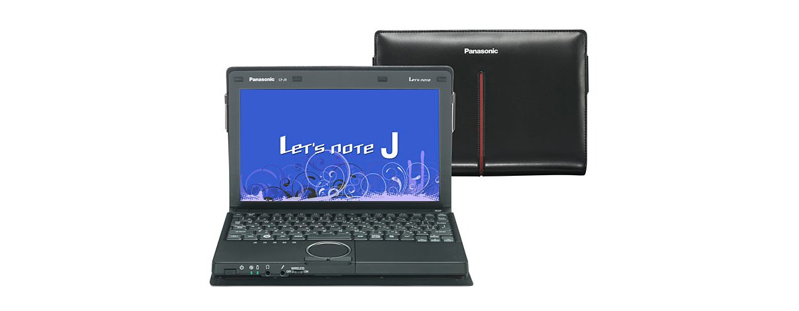
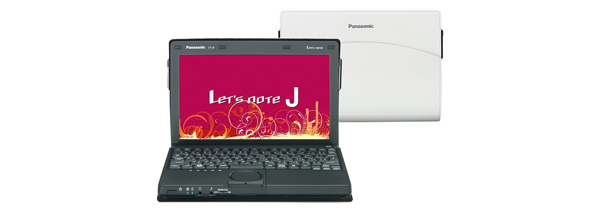

# 松下 Let's note CF-J9 规格参数

[English](../../en/CF-J9/) · [日本語](../../ja/CF-J9/) · **中文**

**CF-J9** 是松下 Let's note 笔记本电脑，属于 J9 系列，配备 10.1英寸 WXGA 屏幕。本页收录其全部 4 个型号（2010-10 发售）的规格参数。每个型号均附官方规格表链接。

*松下 Let's note CF-J9（CF-J9LY1AHR, CF-J9LY1NHR）。图片 © Panasonic*

## 型号列表

| 型号（品番） | 发售 | 停产 | 主要规格 |
| :-- | :-- | :-- | :-- |
| [CF-J9LY1AHR](https://panasonic.jp/pc/p-db/CF-J9LY1AHR_spec.html) | 2010-10 | 2011-02 | Windows® 7 Home Premium 正版、英特尔® CoreTM i5-460M（2.53GHz）、内存：标准2GB（最大6GB）、SSD：128GB、、LAN、无线LAN 802.11a(W52/W53/W56)/b/g/n |
| [CF-J9LY1NHR](https://panasonic.jp/pc/p-db/CF-J9LY1NHR_spec.html) | 2010-10 | 2011-02 | Windows® 7 Home Premium 正版、英特尔® CoreTM i5-460M（2.53GHz）、内存：标准2GB（最大6GB）、SSD：128GB、LAN、无线LAN 802.11a(W52/W53/W56)/b/g/n、Office Home and Business 2010 ＜数量限定＞ |
| [CF-J9NYABHR](https://panasonic.jp/pc/p-db/CF-J9NYABHR_spec.html) | 2010-10 | 2011-02 | Windows® 7 Home Premium 正版、英特尔® CoreTM i3-370M（2.40GHz）、内存：标准2GB（最大6GB）、HDD：160GB、LAN、无线LAN 802.11a(W52/W53/W56)/b/g/n |
| [CF-J9NYAPHR](https://panasonic.jp/pc/p-db/CF-J9NYAPHR_spec.html) | 2010-10 | 2011-02 | Windows® 7 Home Premium 正版、英特尔® CoreTM i3-370M（2.40GHz）、内存：标准2GB（最大6GB）、HDD：160GB、LAN、无线LAN 802.11a(W52/W53/W56)/b/g/n、Office Home and Business 2010 ＜数量限定＞ |

## 通用规格

| 项目 | 规格 |
| :-- | :-- |
| 操作系统 | ▼基础OS：Windows7 Home Premium 32位 正版（日语版）/Windows7 Home Premium 64位正版（日语版）▼安装OS：Windows7 Home Premium 32位 正版（日语版） |
| 芯片组 | 移动 英特尔 HM55 Express 芯片组 |
| 内存 | 标准2GB DDR3 SDRAM（最大6GB）空插槽1 |
| 显存 | 最大763MB，增加2GB或4GB内存时最大1563MB（与主内存共享） |
| 显示屏 | 10.1英寸（16：9）TFT彩色液晶 WXGA (1366×768像素) |
| 显示屏 / 色彩 | 1366×768像素：约1677万色※6 |
| 显示屏 / 外接显示输出 | 800×600像素、1024×768像素、1280×768像素、1280×1024像素、1360×768像素、1366×768像素、1400×1050像素、1680×1050像素、1600×1200像素、1920×1080像素、1920×1200像素：约1677万色 |
| 显示屏 / 同时显示 | 800×600像素、1024×768像素、1280×768像素、1360×768像素、1366×768像素：约1677万色 |
| 无线通信模块 | 英特尔 Centrino Advanced-N + WiMAX 6250 |
| 无线网络 | 符合IEEE802.11a（W52/W53/W56）/b/g/n |
| 有线网络 | 1000BASE-T / 100BASE-TX / 10BASE-T |
| 音频 | PCM音源（24位立体声）、英特尔 High Definition Audio 标准・单声道扬声器 |
| SD 卡槽 | SD存储卡※10×1插槽（支持SDHC存储卡/SDXC存储卡/支持版权保护技术） |
| 内存扩展槽 | DDR3 204针SO-DIMM专用插槽×1 / (1.5V/PC3-6400/DDR3 SDRAM) |
| 接口 | USB端口×3（USB2.0×3）、LAN接口（RJ-45）、HDMI输出端子、外部显示器接口（模拟RGB mini Dsub 15针）、麦克风输入端子（立体声迷你插孔M3（支持插入式电源））、音频输出端子（立体声迷你插孔M3） |
| 键盘 | 符合OADG标准85键、键距17mm（横向）/14.2mm（纵向）（部分键除外） |
| 指点设备 | 滚轮触控板 |
| 功耗 | 最大约60W |
| 能效达成率（2011 年度标准） | — |
| 尺寸（宽×深×高） | 安装护套时：宽259mm×深185mm×高39mm/48mm（前部/后部） / 未安装护套时：宽251.9mm×深171.7mm×高27.3mm/35.1mm（前部/后部） |

## 各型号差异

| 型号（品番） | 处理器 | 内存 | 存储 | 重量 | 续航 |
| :-- | :-- | :-- | :-- | :-- | :-- |
| CF-J9LY1AHR | Core i5-460M | 2GBDDR3 SDRAM | 128GB | 1.205 kg | 12 h |
| CF-J9LY1NHR | Core i5-460M | 2GBDDR3 SDRAM | 128GB | 1.205 kg | 12 h |
| CF-J9NYABHR | Core i3-370M | 2GBDDR3 SDRAM | 硬盘驱动器 | 1.185 kg | 7.5 h |
| CF-J9NYAPHR | Core i3-370M | 2GBDDR3 SDRAM | 硬盘驱动器 | 1.185 kg | 7.5 h |

CF-J9LY1AHR 的全部差异规格

| 项目 | 规格 |
| :-- | :-- |
| 处理器 | 英特尔 Core i5-460M 处理器 / 英特尔 智能缓存 3MB，运行频率2.53GHz， / 使用英特尔 睿频加速技术时最高2.80GHz |
| 固态硬盘 | 闪存驱动器（SSD）：128GB（Serial ATA）上述容量中约12GB用作恢复区域、约300 MB用作系统区域（用户不可使用） |
| 显示屏 / 显卡 | 英特尔 HD显卡 / （集成于英特尔 Core i5-460M 处理器） |
| 电源 | ▼AC适配器：输入：AC100 V～240 V、50Hz/60Hz、输出：DC16 V、3.75 A、电源线仅限100 V专用，▼电池组：附带电池组（L）（7.2 V锂离子・标称容量9.3Ah、额定容量8.7Ah） |
| 能效 | 2011年度基准 N类别0.15 |
| 续航 / 充电时间 | ▼续航时间：安装附带的电池组(L)时：约12小时（电池的节能模式(ECO) 无效时）、安装另售的电池组(S)时：约8小时(电池的节能模式(ECO) 无效时) / ▼充电时间：约3.5小时（电源关闭时）/ 约5小时（电源开启时） |
| 重量（含电池） | 安装护套时：约1.205kg/未安装护套时：约0.99kg / （安装附带的电池组(L)（约0.32kg）时）、AC适配器：约0.185kg （不含电源线（约0.06kg）） |
| 预装软件 | Microsoft Internet Explorer8.0、绿色 goo 棒、网络选择器 2、无线切换实用程序、安全设置实用程序、McAfee PC 安全中心、i-过滤器5.0（30天试用版）、Adobe Reader、WinZip 14.5 日语版、电池剩余电量显示校正实用程序、滚轮触控板实用程序、NumLock 通知、Hotkey 设置、Fn Ctrl 功能互换实用程序、ATOK for Windows 免费试用版、金山词霸、电源计划扩展实用程序、Microsoft Windows Media Player 12、投影仪助手、USB 键盘助手、USB 鼠标助手、显示助手、Wireless Manager mobile edition 5.5、缩放查看器、贴合视图、快速启动管理器、PC 信息弹窗、PC 信息查看器、Aptio 设置实用程序、PC-Diagnostic 实用程序、恢复光盘创建实用程序、硬盘数据擦除实用程序、Microsoft .NET Framework 3.5.1、英特尔 PROSet/Wireless Software |
| 附件 | AC适配器、电池组、保护套（黑豹黑）、使用说明书 等 |

官方规格表: <https://panasonic.jp/pc/p-db/CF-J9LY1AHR_spec.html>

CF-J9LY1NHR 的全部差异规格

| 项目 | 规格 |
| :-- | :-- |
| 处理器 | 英特尔 Core i5-460M 处理器 / 英特尔 智能缓存 3MB，运行频率2.53GHz， / 使用英特尔 睿频加速技术时最高2.80GHz |
| 固态硬盘 | 闪存驱动器（SSD）：128GB（Serial ATA）上述容量中约12GB用作恢复区域、约300 MB用作系统区域（用户不可使用） |
| 显示屏 / 显卡 | 英特尔 HD显卡 / （集成于英特尔 Core i5-460M 处理器） |
| 电源 | ▼AC适配器：输入：AC100 V～240 V、50Hz/60Hz、输出：DC16 V、3.75 A、电源线仅限100 V专用，▼电池组：附带电池组（L）（7.2 V锂离子・标称容量9.3Ah、额定容量8.7Ah） |
| 能效 | 2011年度基准 N类别0.13 |
| 续航 / 充电时间 | ▼续航时间：安装附带的电池组(L)时：约12小时（电池的节能模式(ECO) 无效时）、安装另售的电池组(S)时：约8小时(电池的节能模式(ECO) 无效时) / ▼充电时间：约3.5小时（电源关闭时）/ 约5小时（电源开启时） |
| 重量（含电池） | 安装护套时：约1.205kg/未安装护套时：约0.99kg / （安装附带的电池组(L)（约0.32kg）时）、AC适配器：约0.185kg （不含电源线（约0.06kg）） |
| 预装软件 | Microsoft Internet Explorer8.0、绿色 goo 棒、网络选择器 2、无线切换实用程序、安全设置实用程序、McAfee PC 安全中心、i-过滤器5.0（30天试用版）、Adobe Reader、WinZip 14.5 日语版、电池剩余电量显示校正实用程序、滚轮触控板实用程序、NumLock 通知、Hotkey 设置、Fn Ctrl 功能互换实用程序、ATOK for Windows 免费试用版、金山词霸、电源计划扩展实用程序、Microsoft Windows Media Player 12、投影仪助手、USB 键盘助手、USB 鼠标助手、显示助手、Wireless Manager mobile edition 5.5、缩放查看器、贴合视图、快速启动管理器、PC 信息弹窗、PC 信息查看器、Aptio 设置实用程序、PC-Diagnostic 实用程序、恢复光盘创建实用程序、硬盘数据擦除实用程序、Microsoft .NET Framework 3.5.1、英特尔 PROSet/Wireless Software、Microsoft Office Home and Business 2010 |
| 附件 | AC适配器、电池组、保护套（黑豹黑）、使用说明书 等 |
| Microsoft Office | 搭载 Microsoft Office Home and Business 2010 |

官方规格表: <https://panasonic.jp/pc/p-db/CF-J9LY1NHR_spec.html>

CF-J9NYABHR 的全部差异规格

| 项目 | 规格 |
| :-- | :-- |
| 处理器 | 英特尔 Core i3-370M 处理器 / 英特尔 智能缓存 3MB（1MB =1,048,576字节。1GB =1,073,741,824字节。）、工作频率2.40GHz |
| 显示屏 / 显卡 | 英特尔 HD显卡 / （集成于英特尔 Core i3-370M 处理器） |
| 电源 | ▼AC适配器：输入：AC100 V～240 V、50Hz/60Hz，输出：DC16 V、3.75 A，电源线仅适用于100 V，▼电池组：附带电池组(S)（7.2 V锂离子・标称容量6.2 Ah、额定容量5.8 Ah） |
| 能效 | 2011年度基准 N类别0.15 |
| 续航 / 充电时间 | ▼续航时间：安装附带的电池组(S)时：约7.5小时（电池的节能模式(ECO) 无效时）、安装另售的电池组(L)时：约11小时(电池的节能模式(ECO) 无效时) / ▼充电时间：约3.5小时（电源关闭时）/ 约5小时（电源开启时） |
| 重量（含电池） | 安装护套时：约1.185 kg/未安装护套时：约0.97 kg / （安装附带的电池组(S)（约0.23 kg）时）、AC适配器：约0.185 kg （不含电源线（约0.06kg）） |
| 预装软件 | Microsoft Internet Explorer8.0、绿色 goo 棒、网络选择器 2、无线切换实用程序、安全设置实用程序、McAfee PC 安全中心、i-过滤器5.0（30天试用版）、Adobe Reader、WinZip 14.5 日语版、电池剩余电量显示校正实用程序、滚轮触控板实用程序、NumLock 通知、Hotkey 设置、Fn Ctrl 功能互换实用程序、ATOK for Windows 免费试用版、金山词霸、电源计划扩展实用程序、Microsoft Windows Media Player 12、投影仪助手、USB 键盘助手、USB 鼠标助手、显示助手、Wireless Manager mobile edition 5.5、缩放查看器、贴合视图、快速启动管理器、PC 信息弹窗、PC 信息查看器、Aptio 设置实用程序、PC-Diagnostic 实用程序、恢复光盘创建实用程序、硬盘数据擦除实用程序、Microsoft .NET Framework 3.5.1、英特尔 PROSet/Wireless Software |
| 附件 | AC适配器、电池组、保护套（雪纺白）、使用说明书 等 |
| 硬盘 | 硬盘驱动器（HDD）：160GB（Serial ATA）上述容量中约12 GB用作恢复区域、约300MB用作系统区域（用户不可使用） |

官方规格表: <https://panasonic.jp/pc/p-db/CF-J9NYABHR_spec.html>

CF-J9NYAPHR 的全部差异规格

| 项目 | 规格 |
| :-- | :-- |
| 处理器 | 英特尔 Core i3-370M 处理器 / 英特尔 智能缓存 3MB（1MB =1,048,576字节。1GB =1,073,741,824字节。）、工作频率2.40GHz |
| 显示屏 / 显卡 | 英特尔 HD显卡 / （集成于英特尔 Core i3-370M 处理器） |
| 电源 | ▼AC适配器：输入：AC100 V～240 V、50Hz/60Hz，输出：DC16 V、3.75 A，电源线仅适用于100 V，▼电池组：附带电池组(S)（7.2 V锂离子・标称容量6.2 Ah、额定容量5.8 Ah） |
| 能效 | 2011年度基准 N类别0.15 |
| 续航 / 充电时间 | ▼续航时间：安装附带的电池组(S)时：约7.5小时（电池的节能模式(ECO) 无效时）、安装另售的电池组(L)时：约11小时(电池的节能模式(ECO) 无效时) / ▼充电时间：约3.5小时（电源关闭时）/ 约5小时（电源开启时） |
| 重量（含电池） | 安装护套时：约1.185 kg/未安装护套时：约0.97 kg / （安装附带的电池组(S)（约0.23 kg）时）、AC适配器：约0.185 kg （不含电源线（约0.06kg）） |
| 预装软件 | Microsoft Internet Explorer8.0、绿色 goo 棒、网络选择器 2、无线切换实用程序、安全设置实用程序、McAfee PC 安全中心、i-过滤器5.0（30天试用版）、Adobe Reader、WinZip 14.5 日语版、电池剩余电量显示校正实用程序、滚轮触控板实用程序、NumLock 通知、Hotkey 设置、Fn Ctrl 功能互换实用程序、ATOK for Windows 免费试用版、金山词霸、电源计划扩展实用程序、Microsoft Windows Media Player 12、投影仪助手、USB 键盘助手、USB 鼠标助手、显示助手、Wireless Manager mobile edition 5.5、缩放查看器、贴合视图、快速启动管理器、PC 信息弹窗、PC 信息查看器、Aptio 设置实用程序、PC-Diagnostic 实用程序、恢复光盘创建实用程序、硬盘数据擦除实用程序、Microsoft .NET Framework 3.5.1、英特尔 PROSet/Wireless Software、Microsoft Office Home and Business 2010 |
| 附件 | AC适配器、电池组、保护套（雪纺白）、使用说明书 等 |
| Microsoft Office | 搭载 Microsoft Office Home and Business 2010 |
| 硬盘 | 硬盘驱动器（HDD）：160GB（Serial ATA）上述容量中约12 GB用作恢复区域、约300MB用作系统区域（用户不可使用） |

官方规格表: <https://panasonic.jp/pc/p-db/CF-J9NYAPHR_spec.html>

## 图片

*松下 Let's note CF-J9（CF-J9NYABHR, CF-J9NYAPHR）。图片 © Panasonic*

## 相关机型

- [Let's note 全部机型](../)

---

来源：松下官方[停产产品列表](https://panasonic.jp/pc/support/products/)及各型号规格表（panasonic.jp），由日文翻译，准确措辞以官方规格表为准。产品图片 © Panasonic。本页为非官方整理，与松下公司无关。
