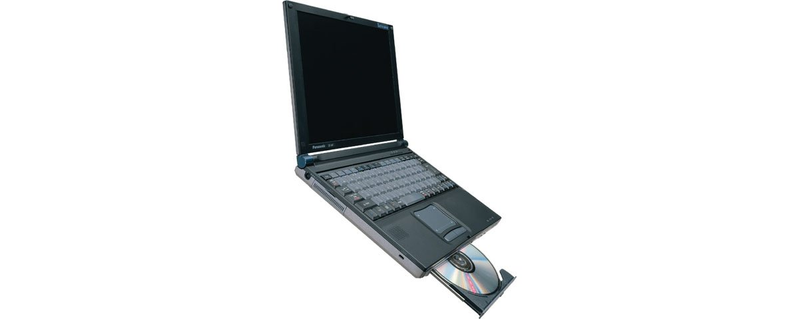

# 松下 Let's note CF-M1 规格参数

[English](../../en/CF-M1/) · [日本語](../../ja/CF-M1/) · **中文**

**CF-M1** 是松下 Let's note 笔记本电脑，属于 M1 系列，配备 11.3英寸 XGA 屏幕。本页收录其全部 5 个型号（1999-09 – 2000-03 发售）的规格参数。每个型号均附官方规格表链接。

*松下 Let's note CF-M1（CF-M1EV, CF-M1ER, CF-M1R, CF-M1VA …）。图片 © Panasonic*

## 型号列表

| 型号（品番） | 发售 | 停产 | 主要规格 |
| :-- | :-- | :-- | :-- |
| [CF-M1EV](https://panasonic.jp/pc/p-db/CF-M1EV_spec.html) | 2000-03 | 2000-04 | Celeron(400MHz)、HDD：8.1GB、CD-ROM、LAN、Windows 98SE |
| [CF-M1ER](https://panasonic.jp/pc/p-db/CF-M1ER_spec.html) | 2000-02 | 2000-03 | PentiumIII(500MHz)、HDD：8.1GB、CD-ROM、LAN、Windows 98SE |
| [CF-M1R](https://panasonic.jp/pc/p-db/CF-M1R_spec.html) | 1999-11 | 1999-12 | PentiumIII(400MHz)、HDD：8.1GB、CD-ROM、LAN、Windows 98SE |
| [CF-M1VA](https://panasonic.jp/pc/p-db/CF-M1VA_spec.html) | 1999-10 | 1999-11 | Celeron(333MHz)、HDD：8.1GB、CD-ROM、LAN、Windows 98SE、Office 2000 |
| [CF-M1V](https://panasonic.jp/pc/p-db/CF-M1V_spec.html) | 1999-09 | 2000-01 | Celeron(333MHz)、HDD：8.1GB、CD-ROM、LAN、Windows 98SE |

## 通用规格

| 项目 | 规格 |
| :-- | :-- |
| 芯片组 | Intel(R) 440BX AGPset |
| 显存 | 2.5MB |
| 硬盘 | 8.1GB (UltraATA) ※1 |
| 光驱 | CD-ROM驱动器：最大24倍速・可拆卸 |
| 软驱（选配） | 外置 3.5英寸 支持3模式 (1.44MB /1.2MB /720KB) |
| 多功能仓位 | CD-ROM驱动器（标准附带）、扩展电池组（选配）、 / 减重器（标准附带）可互换 |
| 显示屏 | XGA (1024×768像素) 11.3英寸TFT彩色液晶 |
| 显示屏 / 色彩 | 1024×768像素 :约1600万色 ※2 |
| 显示屏 / 外接显示输出 | 640×480、800×600、1024×768像素：约1600万色、1280×1024像素：256色 |
| 显示屏 / 同时显示 | 640×480、800×600、1024×768像素：约1600万色 ※2、1280×1024像素 ※3：256色 |
| 调制解调器 | 主机内置 数据：56kbps（V.90/K56flex自动支持） FAX：14.4kbps、支持语音功能 (RJ-11) ※4 |
| 有线网络 | 主机内置 100BASE-TX /10BASE-T (RJ-45) ※5 |
| 音频 | PCM音源 (16位立体声)、内置扬声器(单声道)、内置麦克风（单声道） |
| PC 卡槽 | PC卡(TypeII×1插槽)、CardBus对应 |
| 内存扩展槽 | 144针DIMM专用插槽×1 |
| 接口 / 音频 | 麦克风输入（迷你插孔）、音频输出（立体声迷你插孔） |
| 接口 / USB | 4针 |
| 接口 / 红外 | 符合 IrDA V1.1 标准 4Mbps ※6 |
| 接口 / 其他 | 扩展总线连接器 |
| 接口 / 选配 I/O 盒 | 串行（Dsub 9针）、并行（Dsub 25针）、外部显示器（迷你D-sub 9针）、外部鼠标／键盘（迷你Din 6针）、FDD接口 |
| 接口 / 选配迷你 I/O 盒 | 外部显示器(迷你D-sub9针)、外部鼠标／键盘(迷你Din 6针) |
| 键盘 | 符合OADG标准的键盘 (86键)、键距 17mm |
| 指点设备 | 智能指针III |
| 电源 | AC 100V-240V (50Hz/60Hz)（AC电源线仅适用于100V）、 / 标准电池组／扩展电池组<另售>／大容量电池组<另售>（锂离子） |
| 尺寸（宽×深×高） | 270mm × 215mm × 29mm（不含凸起部） |

## 各型号差异

| 型号（品番） | 处理器 | 内存 | 存储 | 重量 | 续航 |
| :-- | :-- | :-- | :-- | :-- | :-- |
| CF-M1EV | 低电压版Celeron 400MHz | 64MB SDRAM | 8.1GB | 1.5 kg | 1.5 h |
| CF-M1ER | 低电压版Pentium III 500MHz | 64MB SDRAM | 8.1GB | 1.5 kg | 1.5 h |
| CF-M1R | Pentium III 400MHz | 64MB SDRAM | 8.1GB | 1.4 kg | 1.5 h |
| CF-M1VA | Celeron 333MHz | 64MB SDRAM | 8.1GB | 1.4 kg | 1.8 h |
| CF-M1V | Celeron 333MHz | 64MB SDRAM | 8.1GB | 1.4 kg | 1.8 h |

CF-M1EV 的全部差异规格

| 项目 | 规格 |
| :-- | :-- |
| 处理器 | 低电压版 移动英特尔(R) Celeron(TM)处理器 400MHz（系统总线时钟：100MHz） |
| 内存 | 标准 64MB SDRAM（最大 192MB） |
| 二级缓存 | 128KB |
| 显示芯片 | NeoMagic公司制NM2200 |
| 显示屏 / 双屏显示（示例） | 内部LCD 1024×768像素 :65536色－ 外部显示器 640×480像素 :约65536色 / 内部LCD 1024×768像素 ：256色－ 外部显示器 1024×768像素：约256色 |
| 功耗 | 约36W |
| 能效 | S区分 0.0011 ※7 |
| 电池 | 标准电池组 / 驱动:约1.5小时 ※8※9 充电:约2.5小时(电源OFF时)、约5.5小时(电源ON时)※10 / 标准＋扩展电池组<另售> / 驱动:约6.2小时 ※9 充电:约7小时(电源OFF时)、约18.5小时(电源ON时)※10 / 大容量<另售>＋扩展电池组<另售> / 驱动:约9.5小时 ※9 充电:约9.5小时(电源OFF时)、约28小时(电源ON时)※10 |
| 重量（含电池） | 约1.5kg（安装减重模块时）、 / 约1.7kg（安装CD-R/RW驱动器时） |
| 预装软件 | Microsoft(R) Windows(R) 98 Second Edition、 / Microsoft(R) Internet Explorer 5、 / Microsoft(R) IME 98、 / Intellisync(TM) for Notebooks ◆、 / Adobe(R) Acrobat(R) Reader 4.0 ◆、 / 互联网入门、 / 网页浏览器、 / 插画邮件 ※11、 / 快速启动器、 / 快速连接选择器、 / 舞得酷FAX 2001 Lite (语音版) ◆※12、 / Phoenix BaySwap(TM)、 / 在线注册(DION、ODN) ◆、 / 用@nifty上网 ◆ |
| 注意事项 | ※1 HDD容量按1GB=1,000,000,000字节显示。 / ※2 内部LCD通过图形加速器的抖动功能实现。 / ※3 同时显示时，仅显示整个画面的一部分（1024×768像素）。将光标移动到画面边缘时，整个画面会滚动。 / ※4 仅限日本国内NTT模拟一般线路专用。自动判别并切换V.90和K56flex。另外，56kbps为数据接收时的理论值。数据发送时最大速度为33.6kpbs。 / ※5 根据接口形状的不同，有些可能无法使用。 / ※6 红外线通信端口的有效距离为20～50cm。 / ※7 能源消耗效率是指，用依据节能法规定的测量方法测得的耗电量，除以依据节能法规定的复合理论性能所得的值。 / ※8 内置CD-ROM驱动器时。 / ※9 LCD背光亮度最低时。会因运行环境和系统设置而变动。 / ※10 对完全放电的电池充电可能需要较长时间。即使电源关闭状态也会消耗电力，因此从满充电起约1周（使用标准电池时）后电池电量会耗尽。另外，电源ON时的充电时间为最短情况。会因计算机的运行状态而变动。 / ※11 根据字体种类的不同，有些可能无法正确显示。请使用等宽字体。 / ※12 除内置调制解调器以外不保证运行。 / 关于标有◆的软件操作的售后支持，由各软件厂商提供。 / ●本电脑除Windows 98 Second Edition以外不保证运行。 / ●一般标称为用于Windows 98 Second Edition的软件及外围设备中，有些无法在本电脑上使用。购买时请向各软件及外围设备的销售商确认。 / ●使用随附的产品恢复CD-ROM无法仅重新安装OS。 |

官方规格表: <https://panasonic.jp/pc/p-db/CF-M1EV_spec.html>

CF-M1ER 的全部差异规格

| 项目 | 规格 |
| :-- | :-- |
| 处理器 | 低电压版 移动英特尔(R) Pentium(R) III 处理器 500MHz（系统总线时钟：100MHz） |
| 内存 | 标准 64MB SDRAM（最大 192MB） |
| 二级缓存 | 256KB |
| 显示芯片 | NeoMagic公司制 NM2200 |
| 显示屏 / 双屏显示（示例） | 内部LCD 1024×768像素 :65536色－ 外部显示器 640×480像素 :约65536色 / 内部LCD 1024×768像素 ：256色－ 外部显示器 1024×768像素：约256色 |
| 功耗 | 约37W |
| 能效 | S区分 0.0009 ※7 |
| 电池 | 标准电池组 / 驱动:约1.5小时 ※8※9 充电:约2.5小时(电源OFF时)、约5.5小时(电源ON时)※10 / 标准＋扩展电池组<另售> / 驱动:约6.2小时 ※9 充电:约7小时(电源OFF时)、约18.5小时(电源ON时)※10 / 大容量<另售>＋扩展电池组<另售> / 驱动:约9.5小时 ※9 充电:约9.5小时(电源OFF时)、约28小时(电源ON时)※10 |
| 重量（含电池） | 约1.5kg（安装减重模块时）、 / 约1.7kg（安装CD-R/RW驱动器时） |
| 预装软件 | Microsoft(R) Windows(R) 98 Second Edition、 / Microsoft(R) Internet Explorer 5、 / Microsoft(R) IME 98、 / Intellisync(TM) for Notebooks ◆、 / Adobe(R) Acrobat(R) Reader 4.0 ◆、 / 互联网入门、 / 网页浏览器、 / 插画邮件 ※11、 / 快速启动器、 / 快速连接选择器、 / 舞得酷FAX 2001 Lite (语音版) ◆※12、 / Phoenix BaySwap(TM)、 / 在线注册(DION、ODN) ◆、 / 用@nifty上网 ◆ |
| 注意事项 | ※1 HDD容量按1GB=1,000,000,000字节显示。 / ※2 内部LCD通过图形加速器的抖动功能实现。 / ※3 同时显示时，仅显示整个画面的一部分（1024×768像素）。将光标移动到画面边缘时，整个画面会滚动。 / ※4 仅限日本国内NTT模拟一般线路专用。自动判别并切换V.90和K56flex。另外，56kbps为数据接收时的理论值。数据发送时最大速度为33.6kpbs。 / ※5 根据接口形状的不同，有些可能无法使用。 / ※6 红外线通信端口的有效距离为20～50cm。 / ※7 能源消耗效率是指，用依据节能法规定的测量方法测得的耗电量，除以依据节能法规定的复合理论性能所得的值。 / ※8 内置CD-ROM驱动器时。 / ※9 LCD背光亮度最低时。会因运行环境和系统设置而变动。 / ※10 对完全放电的电池充电可能需要较长时间。即使电源关闭状态也会消耗电力，因此从满充电起约1周（使用标准电池时）后电池电量会耗尽。另外，电源ON时的充电时间为最短情况。会因计算机的运行状态而变动。 / ※11 根据字体种类的不同，有些可能无法正确显示。请使用等宽字体。 / ※12 除内置调制解调器以外不保证运行。 / 关于标有◆的软件操作的售后支持，由各软件厂商提供。 / ●本电脑除Windows 98 Second Edition以外不保证运行。 / ●一般标称为用于Windows 98 Second Edition的软件及外围设备中，有些无法在本电脑上使用。购买时请向各软件及外围设备的销售商确认。 / ●使用随附的产品恢复CD-ROM无法仅重新安装OS。 |

官方规格表: <https://panasonic.jp/pc/p-db/CF-M1ER_spec.html>

CF-M1R 的全部差异规格

| 项目 | 规格 |
| :-- | :-- |
| 处理器 | 移动 Intel(R) Pentium(R) III 处理器 400MHz |
| 内存 | 标准 64MB SDRAM（最大 192MB） |
| 二级缓存 | 256KB |
| 显示芯片 | NeoMagic公司制 NM2200 |
| 显示屏 / 双屏显示（示例） | 内部LCD 1024×768像素 :约65,536万色 － 外部显示器 640×480像素 :256色 / 内部LCD 1024×768像素 :256色 － 外部显示器 1024×768像素 :256色 |
| 功耗 | 约35W |
| 能效 | 待机模式时：约1.0W ※7 |
| 电池 | 标准电池组 / 驱动:约1.5小时 ※8※9 充电:约2.5小时(电源OFF时)、约5.5小时(电源ON时)※10 / 标准＋扩展电池组<另售> / 驱动:约6.6小时 ※9 充电:约7小时(电源OFF时)、约18.5小时(电源ON时)※10 / 大容量<另售>＋扩展电池组<另售> / 驱动:约10.6小时 ※9 充电:约9.5小时(电源OFF时)、约28小时(电源ON时)※10 |
| 重量（含电池） | 约1.4kg（安装减重模块时）、 / 约1.6kg（安装CD-R/RW驱动器时） |
| 预装软件 | Microsoft(R) Windows(R) 98 Second Edition、 / Microsoft(R) Internet Explorer 5、 / Microsoft(R) IME 98、 / Intellisync(TM) for Notebooks ◆、 / Adobe(R) Acrobat(R) Reader 4.0J ◆、 / 互联网入门、 / 网页浏览器、 / 插画邮件 ※11、 / 快速启动器、 / 快速连接选择器、 / 舞得酷FAX V3 Lite ◆※12、 / Phoenix PowerPanel(TM)、 / Phoenix BaySwap(TM)、 / 在线注册(DION、ODN) ◆、 / 用Nifty-Serve上网 |
| 注意事项 | ※1 HDD容量按1GB=1,000,000,000字节显示。 / ※2 内部LCD通过图形加速器的抖动功能实现。 / ※3 同时显示时，仅显示整个画面的一部分（1024×768像素）。将光标移动到画面边缘时，整个画面会滚动。 / ※4 仅限日本国内NTT模拟一般线路专用。自动判别并切换V.90和K56flex。另外，56kbps为数据接收时的理论值。数据发送时最大速度为33.6kpbs。 / ※5 根据接口形状的不同，有些可能无法使用。 / ※6 红外线通信端口的有效距离为20～50cm。 / ※7 基于节能法的能源消耗效率。 / ※8 内置CD-ROM驱动器时。 / ※9 LCD背光亮度最低时。会因运行环境和系统设置而变动。 / ※10 对完全放电的电池充电可能需要较长时间。即使电源关闭状态也会消耗电力，因此从满充电起约1周（使用标准电池时）后电池电量会耗尽。另外，电源ON时的充电时间为最短情况。会因计算机的运行状态而变动。 / ※11 根据字体种类的不同，有些可能无法正确显示。请使用等宽字体。 / ※12 除内置调制解调器以外不保证运行。 / 关于标有◆的软件操作的售后支持，由各软件厂商提供。 / ●本电脑除Windows 98 Second Edition以外不保证运行。 / ●一般标称为用于Windows 98 Second Edition的软件及外围设备中，有些无法在本电脑上使用。购买时请向各软件及外围设备的销售商确认。 / ●使用随附的产品恢复CD-ROM无法仅重新安装OS。 |

官方规格表: <https://panasonic.jp/pc/p-db/CF-M1R_spec.html>

CF-M1VA 的全部差异规格

| 项目 | 规格 |
| :-- | :-- |
| 处理器 | 移动 Intel(R) Celeron(TM) 处理器 333MHz |
| 内存 | 标准 64MB SDRAM（最大 128MB） |
| 二级缓存 | 128KB |
| 显示芯片 | NeoMagic公司制 NM2200 |
| 显示屏 / 双屏显示（示例） | 内部LCD 1024×768像素 :约65,536万色 － 外部显示器 640×480像素 :256色 / 内部LCD 1024×768像素 :256色 － 外部显示器 1024×768像素 :256色 |
| 功耗 | 约35W |
| 能效 | 待机模式时：约1.0W ※7 |
| 电池 | 标准电池组 / 驱动:约1.8小时 ※8※9 充电:约2.5小时(电源OFF时)、约5.5小时(电源ON时)※10 / 标准＋扩展电池组<另售> / 驱动:约7小时 ※9 充电:约7小时(电源OFF时)、约18.5小时(电源ON时)※10 / 大容量<另售>＋扩展电池组<另售> / 驱动:约11小时 ※9 充电:约9.5小时(电源OFF时)、约28小时(电源ON时)※10 |
| 重量（含电池） | 约1.4kg（安装减重模块时）、 / 约1.6kg（安装CD-R/RW驱动器时） |
| 预装软件 | Microsoft(R) Windows(R) 98 Second Edition、 / Microsoft(R) Internet Explorer 5、 / Microsoft(R) IME 2000、 / Microsoft(R) Office 2000 Personal ◆※11、 / Intellisync(TM) for Notebooks ◆、 / Adobe(R) Acrobat(R) Reader 4.0J ◆、 / 互联网入门、 / 插画邮件 ※12、 / 快速启动器、 / 快速连接选择器、 / 舞得酷FAX V3 Lite ◆※13、 / Phoenix PowerPanel(TM)、 / NIFTY Manager for Windows ◆ |
| 注意事项 | ※1 HDD容量按1GB=1,000,000,000字节显示。 / ※2 内部LCD通过图形加速器的抖动功能实现。 / ※3 同时显示时，仅显示整个画面的一部分（1024×768像素）。将光标移动到画面边缘时，整个画面会滚动。 / ※4 仅限日本国内NTT模拟一般线路专用。自动判别并切换V.90和K56flex。另外，56kbps为数据接收时的理论值。数据发送时最大速度为33.6kpbs。 / ※5 根据接口形状的不同，有些可能无法使用。 / ※6 红外线通信端口的有效距离为20～50cm。 / ※7 基于节能法的能源消耗效率。 / ※8 内置CD-ROM驱动器时。 / ※9 LCD背光亮度最低时。会因运行环境和系统设置而变动。 / ※10 对完全放电的电池充电可能需要较长时间。即使电源关闭状态也会消耗电力，因此从满充电起约1周（使用标准电池时）后电池电量会耗尽。另外，电源ON时的充电时间为最短情况。会因计算机的运行状态而变动。 / ※11 "Bookshelf Basic 2.0"仅随CD-ROM附带。 / ※12 根据字体种类的不同，有些可能无法正确显示。请使用等宽字体。 / ※13 除内置调制解调器以外不保证运行。 / 关于标有◆的软件操作的售后支持，由各软件厂商提供。 / ●本电脑除Windows 98 Second Edition以外不保证运行。 / ●一般标称为用于Windows 98 Second Edition的软件及外围设备中，有些无法在本电脑上使用。购买时请向各软件及外围设备的销售商确认。 / ●使用随附的产品恢复CD-ROM无法仅重新安装OS。 |

官方规格表: <https://panasonic.jp/pc/p-db/CF-M1VA_spec.html>

CF-M1V 的全部差异规格

| 项目 | 规格 |
| :-- | :-- |
| 处理器 | 移动 Intel(R) Celeron(TM) 处理器 333MHz |
| 内存 | 标准 64MB SDRAM（最大 128MB） |
| 二级缓存 | 128KB |
| 显示芯片 | NeoMagic公司制NM2200 |
| 显示屏 / 双屏显示（示例） | 内部LCD 1024×768像素 :约65,536万色 － 外部显示器 640×480像素 :256色 / 内部LCD 1024×768像素 :256色 － 外部显示器 1024×768像素 :256色 |
| 功耗 | 约35W |
| 能效 | 待机模式时：约1.0W ※7 |
| 电池 | 标准电池组 / 驱动:约1.8小时 ※8※9 充电:约2.5小时(电源OFF时)、约5.5小时(电源ON时)※10 / 标准＋扩展电池组<另售> / 驱动:约7小时 ※9 充电:约7小时(电源OFF时)、约18.5小时(电源ON时)※10 / 大容量<另售>＋扩展电池组<另售> / 驱动:约11小时 ※9 充电:约9.5小时(电源OFF时)、约28小时(电源ON时)※10 |
| 重量（含电池） | 约1.4kg（安装减重模块时）、 / 约1.6kg（安装CD-ROM驱动器时） |
| 预装软件 | Microsoft(R) Windows(R) 98 Second Edition、 / Microsoft(R) Internet Explorer 5、 / Microsoft(R) IME 98、 / Intellisync(TM) for Notebooks ◆、 / Adobe(R) Acrobat(R) Reader 4.0J ◆、 / 互联网入门、 / 插画邮件 ※11、 / 快速启动器、 / 快速连接选择器、 / 舞得酷FAX V3 Lite ◆※12、 / Phoenix PowerPanel(TM)、 / NIFTY Manager for Windows ◆ |
| 注意事项 | ※1 HDD容量按1GB=1,000,000,000字节显示。 / ※2 内部LCD通过图形加速器的抖动功能实现。 / ※3 同时显示时，仅显示整个画面的一部分（1024×768像素）。将光标移动到画面边缘时，整个画面会滚动。 / ※4 仅限日本国内NTT模拟一般线路专用。自动判别并切换V.90和K56flex。另外，56kbps为数据接收时的理论值。数据发送时最大速度为33.6kpbs。 / ※5 根据接口形状的不同，有些可能无法使用。 / ※6 红外线通信端口的有效距离为20～50cm。 / ※7 基于节能法的能源消耗效率。 / ※8 内置CD-ROM驱动器时。 / ※9 LCD背光亮度最低时。会因运行环境和系统设置而变动。 / ※10 对完全放电的电池充电可能需要较长时间。即使电源关闭状态也会消耗电力，因此从满充电起约1周（使用标准电池时）后电池电量会耗尽。另外，电源ON时的充电时间为最短情况。会因计算机的运行状态而变动。 / ※11 根据字体种类的不同，有些可能无法正确显示。请使用等宽字体。 / ※12 除内置调制解调器以外不保证运行。 / 关于标有◆的软件操作的售后支持，由各软件厂商提供。 / ●本电脑除Windows 98 Second Edition以外不保证运行。 / ●一般标称为用于Windows 98 Second Edition的软件及外围设备中，有些无法在本电脑上使用。购买时请向各软件及外围设备的销售商确认。 / ●使用随附的产品恢复CD-ROM无法仅重新安装OS。 |

官方规格表: <https://panasonic.jp/pc/p-db/CF-M1V_spec.html>

## 相关机型

- [Let's note 全部机型](../)

---

来源：松下官方[停产产品列表](https://panasonic.jp/pc/support/products/)及各型号规格表（panasonic.jp），由日文翻译，准确措辞以官方规格表为准。产品图片 © Panasonic。本页为非官方整理，与松下公司无关。
