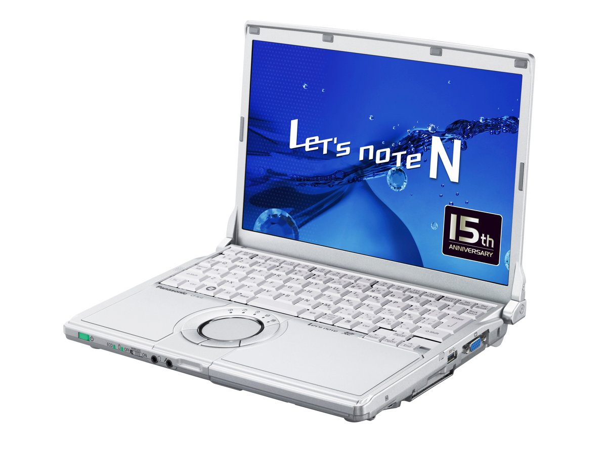

# 松下 Let's note CF-N10 规格参数

[English](../../en/CF-N10/) · [日本語](../../ja/CF-N10/) · **中文**

🗄️ 在 [Let's note 陈列柜](https://letsnote-specs.github.io/zh/CF-N10/)中查看此机型

**CF-N10** 是松下 Let's note 笔记本电脑，属于 N10 系列，配备 12.1英寸 WXGA 屏幕。本页收录其全部 3 个型号（2011-02 – 2011-09 发售）的规格参数。每个型号均附官方规格表链接。

*松下 Let's note CF-N10（CF-N10EYADR）。图片 © Panasonic*

## 型号列表

| 型号（品番） | 发售 | 停产 | 主要规格 |
| :-- | :-- | :-- | :-- |
| [CF-N10EYADR](https://panasonic.jp/pc/p-db/CF-N10EYADR_spec.html) | 2011-09 | 2012-02 | Windows® 7 Professional 64位 正版（已应用 Service Pack 1）、英特尔® CoreTM i5-2540M（2.60GHz）、内存：标准4GB（空闲插槽1、最大8GB）、HDD：640GB、LAN、无线LAN 802.11a(W52/W53/W56)/b/g/n |
| [CF-N10CYADR](https://panasonic.jp/pc/p-db/CF-N10CYADR_spec.html) | 2011-05 | 2011-09 | Windows® 7 Professional 64位 正版（已应用 Service Pack 1）、英特尔® CoreTM i5-2520M（2.50GHz）、内存：标准4GB（空闲插槽1、最大8GB）、HDD：640GB、LAN、无线LAN 802.11a(W52/W53/W56)/b/g/n |
| [CF-N10AYADR](https://panasonic.jp/pc/p-db/CF-N10AYADR_spec.html) | 2011-02 | 2011-04 | Windows® 7 Professional 正版、英特尔® CoreTM i5-2520M（2.50GHz）、内存：标配4GB（最大8GB）、HDD：500GB、LAN、无线LAN 802.11a(W52/W53/W56)/b/g/n |

## 通用规格

| 项目 | 规格 |
| :-- | :-- |
| 显存 | 最大1696MB（与主内存共用） |
| 显示屏 / 色彩 | 1280×800像素：约1677万色 |
| 显示屏 / 同时显示 | 800×600、1024×768、1280×720、1280×768、1280×800像素：约1677万色 |
| 无线通信模块 | 英特尔 Centrino Advanced-N + WiMAX 6250 |
| 无线网络 | 符合IEEE802.11a（W52/W53/W56）/b/g/n |
| 有线网络 | 1000BASE-T/100BASE-TX/10BASE-T |
| 安全芯片 | TPM(符合TCG V1.2) |
| 键盘 | 符合OADG标准85键、键距19mm（横向）/16mm（纵向）（部分键除外） |
| 指点设备 | 滚轮触控板 |
| 功耗 | 最大约65W |
| 能效达成率（2011 年度标准） | — |
| 尺寸（宽×深×高） | 宽282.8mm×深209.6mm×高23.4mm/38.7mm（前部/后部）※最厚处为41.4mm |

## 各型号差异

| 型号（品番） | 处理器 | 内存 | 存储 | 重量 | 续航 |
| :-- | :-- | :-- | :-- | :-- | :-- |
| CF-N10EYADR | Core i5-2540M vPro | 4GB PC3-8500 | 640GB | 1.28 kg | 16.5 h |
| CF-N10CYADR | Core i5-2520M vPro | 4GB PC3-8500 | 640GB | 1.28 kg | 16.5 h |
| CF-N10AYADR | Core i5-2520M vPro | 4GB PC3-8500 | 500GB | 1.27 kg | 15.5 h |

CF-N10EYADR 的全部差异规格

| 项目 | 规格 |
| :-- | :-- |
| 操作系统 | ▼基础操作系统：Windows7 Professional32位正版/Windows7 Professional 64位正版（配备 WindowsXP Mode） / ▼安装操作系统：Windows7 Professional64位正版（配备 WindowsXP Mode）[已应用 Service Pack1] |
| 处理器 | 采用英特尔 vPro 技术 / 英特尔 Core i5-2540M vPro 处理器 / 英特尔智能缓存3MB、工作频率2.60GHz（使用英特尔 睿频加速技术2.0时最高3.30GHz） |
| 芯片组 | 移动 英特尔 QM67 Express 芯片组 |
| 内存 | 标配4GB PC3-8500/DDR3 SDRAM 最大8GB （空闲插槽1） |
| 硬盘 | 640GB（Serial ATA、2.5英寸HDD 5400转/分）上述容量中约12GB用作恢复区域、约300MB用作系统区域（用户不可使用） |
| 显示屏 | 12.1英寸宽屏(16:10) TFT彩色液晶 WXGA（1280 x 800像素） |
| 显示屏 / 显卡 | 配备英特尔 HD 图形3000（内置于英特尔 Core i5-2540M vPro处理器） |
| 显示屏 / 外接显示输出 | 800×600、1024×768、1280×720、1280×768、1280×1024、1400×1050、1600×900、1600×1200、1680×1050、1920×1080、1920×1200像素：约1677万色 |
| 移动 WiMAX | 符合IEEE802.16e-2005（接收最大28Mbps（尽力而为方式）、发送最大6Mbps（尽力而为方式）） |
| 音频 | PCM音源（24位立体声）、英特尔 High Definition Audio标准、单声道扬声器 |
| 卡槽 / PC 卡 | PC卡(TYPE II)×1插槽(CardBus对应、允许电流3.3V：400mA、5V：400mA) |
| 卡槽 / SD 卡 | SD存储卡×1插槽（支持SDHC存储卡/SDXC存储卡/支持UHS-I高速传输/支持版权保护技术） |
| 内存扩展槽 | DDR3 204针SO-DIMM×1插槽(1.5V/PC3-8500/DDR3 SDRAM) |
| 接口 | LAN 接口（RJ-45）、外接显示器接口（模拟 RGB 迷你 Dsub 15 针）、HDMI 输出端子、麦克风输入端子（立体声迷你插孔 M3（支持插入式电源））、音频输出端子（立体声迷你插孔 M3）、USB2.0 端口×2（左侧面）、USB3.0 端口×1（右侧面） |
| 电源 | ▼AC适配器 / 输入：AC100V～240V、50Hz/60Hz，输出：DC16V、4.06A，电源线为100V专用 / ▼电池组 / 7.2V 锂离子・标称容量13.6Ah、额定容量12.8Ah，[另售]轻量电池组：7.2V 锂离子・标称容量6.8Ah、额定容量6.4Ah |
| 能效 | 2011年度标准 N分类0.083 |
| 续航 / 充电时间 | ▼续航时间：约16.5小时 （安装另售的轻量电池组时：约8小时） / ▼充电时间：约4小时（电源OFF时）、约5小时（电源ON时） |
| 重量（含电池） | 电脑主机：约1.28kg（安装附赠电池组（约0.42kg）时）、电脑主机：约1.115kg（安装另售轻量电池组（约0.255kg）时）、AC适配器：约0.2kg（不含电源线（约0.06kg）） |
| 预装软件 | Microsoft Internet Explorer 9.0、绿色goo棒、网络选择器2、无线切换实用程序、安全设置实用程序、迈克菲PC安全中心、i-过滤器6.0（30天试用版）、Infineon TPM Professional Package V3.7、Adobe Reader、WinZip 14.5日语版、电池余量显示校正实用程序、滚轮触控板实用程序、NumLock通知、Hotkey设置、Fn Ctrl功能互换实用程序、ATOK for Windows 免费试用版、金山词典、电源计划扩展实用程序、峰值转移控制实用程序、Microsoft Windows Media Player 12、投影仪助手、USB键盘助手、显示器助手、Wireless Manager mobile edition5.5、英特尔 无线显示软件、缩放查看器、Windows XP Mode、快速启动管理器、PC信息弹窗、PC信息查看器、Aptio设置实用程序、PC-Diagnostic实用程序、硬盘数据擦除实用程序、DirectX 11、Microsoft .NET Framework 3.5.1、英特尔 PROSet/Wireless Software、英特尔身份保护技术、Windows Live邮件、Windows Live照片库、Windows Live Messenger、Windows Live Writer、Silverlight、贴合视图 |
| 附件 | 产品恢复 DVD-ROM 2 张（用于 Windows7）、AC 适配器、电池组、使用说明书 等 |

官方规格表: <https://panasonic.jp/pc/p-db/CF-N10EYADR_spec.html>

CF-N10CYADR 的全部差异规格

| 项目 | 规格 |
| :-- | :-- |
| 操作系统 | ▼基础操作系统：Windows7 Professional32位正版/Windows7 Professional 64位正版（配备 WindowsXP Mode） / ▼安装操作系统：Windows7 Professional64位正版（配备 WindowsXP Mode）[已应用 Service Pack1] |
| 处理器 | 采用英特尔 vPro 技术 / 英特尔 Core i5-2520M vPro 处理器 / 英特尔智能缓存3MB、工作频率2.50GHz（使用英特尔 睿频加速技术2.0时最高3.20GHz） |
| 内存 | 标配4GB PC3-8500/DDR3 SDRAM 最大8GB （空闲插槽1） |
| 硬盘 | 640GB（Serial ATA、2.5英寸HDD 5400转/分）上述容量中约12GB用作恢复区域、约300MB用作系统区域（用户不可使用） |
| 显示屏 | 12.1英寸宽屏(16:10) TFT彩色液晶 WXGA（1280 x 800像素） |
| 显示屏 / 外接显示输出 | 800×600、1024×768、1280×720、1280×768、1280×1024、1400×1050、1600×900、1600×1200、1680×1050、1920×1080、1920×1200像素：约1677万色 |
| 移动 WiMAX | 符合IEEE802.16e-2005（接收最大28Mbps（尽力而为方式）、发送最大6Mbps（尽力而为方式）） |
| 音频 | PCM音源（24位立体声）、英特尔 High Definition Audio标准、单声道扬声器 |
| 卡槽 / PC 卡 | PC卡(TYPE II)×1插槽(CardBus对应、允许电流3.3V：400mA、5V：400mA) |
| 卡槽 / SD 卡 | SD存储卡×1插槽（支持SDHC存储卡/SDXC存储卡/支持UHS-I高速传输/支持版权保护技术） |
| 内存扩展槽 | DDR3 204针SO-DIMM×1插槽(1.5V/PC3-8500/DDR3 SDRAM) |
| 接口 | LAN 接口（RJ-45）、外接显示器接口（模拟 RGB 迷你 Dsub 15 针）、HDMI 输出端子、麦克风输入端子（立体声迷你插孔 M3（支持插入式电源））、音频输出端子（立体声迷你插孔 M3）、USB2.0 端口×2、USB3.0 端口×1（右侧面） |
| 电源 | ▼AC适配器 / 输入：AC100V～240V、50Hz/60Hz，输出：DC16V、4.06A，电源线为100V专用 / ▼电池组 / 7.2V 锂离子・标称容量13.6Ah、额定容量12.8Ah，[另售]轻量电池组：7.2V 锂离子・标称容量6.4Ah、额定容量5.8Ah |
| 能效 | 2011年度标准 N分类0.084 |
| 续航 / 充电时间 | ▼续航时间：约16.5小时 （安装另售的轻量电池组时：约8小时） / ▼充电时间：约4小时（电源OFF时）、约5小时（电源ON时） |
| 重量（含电池） | 电脑主机：约1.28kg（安装附赠电池组（约0.42kg）时）、电脑主机：约1.115kg（安装另售轻量电池组（约0.255kg）时）、AC适配器：约0.2kg（不含电源线（约0.06kg）） |
| 预装软件 | Microsoft Internet Explorer 9.0、绿色goo棒、网络选择器2、无线切换实用程序、安全设置实用程序、迈克菲PC安全中心、i-过滤器6.0（30天试用版）、Infineon TPM Professional Package V3.7、Adobe Reader、WinZip 14.5日语版、电池余量显示校正实用程序、滚轮触控板实用程序、NumLock通知、Hotkey设置、Fn Ctrl功能互换实用程序、ATOK for Windows 免费试用版、金山词典、电源计划扩展实用程序、Microsoft Windows Media Player 12、投影仪助手、USB键盘助手、显示器助手、Wireless Manager mobile edition5.5、英特尔 无线显示软件、缩放查看器、Windows XP Mode、快速启动管理器、PC信息弹窗、PC信息查看器、Aptio设置实用程序、PC-Diagnostic实用程序、硬盘数据擦除实用程序、DirectX 11、Microsoft .NET Framework 3.5.1、英特尔 PROSet/Wireless Software、英特尔身份保护技术、Windows Live邮件、Windows Live照片库、Windows Live Messenger、Windows Live Writer、Silverlight、贴合视图 |
| 附件 | 产品恢复 DVD-ROM 2 张（用于 Windows7）、AC 适配器、电池组、使用说明书 等 |

官方规格表: <https://panasonic.jp/pc/p-db/CF-N10CYADR_spec.html>

CF-N10AYADR 的全部差异规格

| 项目 | 规格 |
| :-- | :-- |
| 操作系统 | ▼基础操作系统：Windows7 Professional 32位正版/Windows7 Professional 64位正版（配备 Windows XP Mode） ▼安装操作系统：Windows7 Professional 64位正版（配备 Windows XP Mode）※均为日语版 |
| 处理器 | 采用英特尔 vPro 技术 / 英特尔 Core i5-2520M vPro 处理器 / 英特尔智能缓存3MB、工作频率2.50GHz（使用英特尔睿频加速技术时最高3.20GHz） |
| 内存 | 标配4GB PC3-8500/DDR3 SDRAM最大8GB（空闲插槽1） |
| 硬盘 | 500GB（Serial ATA、2.5英寸HDD 5400转/分）上述容量中约12GB用作恢复区域、约300MB用作系统区域（用户不可使用） |
| 显示屏 | 12.1英寸宽屏(16:10)TFT彩色液晶 WXGA(1280×800像素) |
| 显示屏 / 外接显示输出 | 1280×720、1600×900、800×600、1024×768、1280×768、1280×1024、1400×1050、1680×1050、1600×1200、1920×1080、1920×1200像素：约1677万色 |
| 移动 WiMAX | 符合IEEE802.16e-2005（接收最大20Mbps、发送最大6Mbps） |
| 音频 | PCM音源（24位立体声）、英特尔High Definition Audio 标准、单声道扬声器 |
| 卡槽 / PC 卡 | 支持UHS-I高速传输、PC卡（TYPEII）×1插槽(CardBus支持、允许电流3.3V：400mA、5V：400mA) |
| 卡槽 / SD 卡 | SD存储卡×1插槽（支持SDHC存储卡/SDXC存储卡/支持版权保护技术） |
| 内存扩展槽 | DDR3 204针SO-DIMM专用插槽×1 (1.5V/PC3-8500/DDR3 SDRAM) |
| 接口 | LAN接口（RJ-45）、外接显示器接口（模拟RGB 迷你Dsub 15针）、HDMI输出端子、麦克风输入（立体声迷你插孔M3（支持插入式电源））、音频输出（立体声迷你插孔M3）、USB端口×3（USB2.0） |
| 电源 | ▼AC适配器：输入：AC100V～240V、50Hz/60Hz，输出：DC16 V、4.06A，电源线仅适用于100V / ▼电池组：7.2V锂离子・标称容量12.4Ah、额定容量11.6Ah，（另售）轻量电池组：7.2V锂离子・标称容量6.2Ah、额定容量5.8Ah |
| 能效 | 2011年度标准 N分类0.084 |
| 续航 / 充电时间 | ▼续航时间：约15.5小时 （安装另售的轻量电池组时：约7.5小时） / ▼充电时间：约3.5小时（电源OFF时）、约5小时（电源ON时）安装另售的轻量电池组时：约3.5小时（电源OFF时）、约5小时（电源ON时） |
| 重量（含电池） | 电脑主机：约1.27kg（安装附赠电池组 / （约0.41kg）时）／电脑主机：约1.11kg（安装另售轻量电池组（约0.25kg）时） |
| 预装软件 | Microsoft Internet Explorer8.0、Adobe Reader、Microsoft Windows Media Player12、Microsoft .NET Framework 3.5.1、WindowsLive 邮件、WindowsLive Messenger、WindowsLive 照片库、WindowsLive Writer、缩放查看器、PC 信息查看器、PC 信息弹窗、NumLock 通知、Wireless Manager mobile edition5.5、无线切换实用程序、安全设置实用程序、Infineon TPM Professional Package V3.7、电池剩余电量显示校正实用程序、Hotkey 设置、McAfee PC 安全中心、绿色 goo 棒、硬盘数据擦除实用程序、滚轮触控板实用程序、网络选择器 2、USB 键盘助手、Fn Ctrl 功能互换实用程序、i-过滤器5.0（30天试用版）、电源计划扩展实用程序、显示助手、贴合视图、Aptio 设置实用程序、PC-Diagnostic 实用程序、投影仪助手、快速启动管理器、WindowsXP Mode、英特尔 PROSet/Wireless Software、ATOK for Windows 免费试用版、金山词霸、WinZip14.5 日语版、英特尔无线显示软件、英特尔无线显示软件 |
| 附件 | 产品恢复 DVD-ROM 1 张（用于 Windows7）、AC 适配器、电池组、使用说明书 等 |

官方规格表: <https://panasonic.jp/pc/p-db/CF-N10AYADR_spec.html>

## 图片

*松下 Let's note CF-N10（CF-N10CYADR）。图片 © Panasonic*

*松下 Let's note CF-N10（CF-N10AYADR）。图片 © Panasonic*

## 相关机型

- [Let's note 全部机型](../)

---

来源：松下官方[停产产品列表](https://panasonic.jp/pc/support/products/)及各型号规格表（panasonic.jp），由日文翻译，准确措辞以官方规格表为准。产品图片 © Panasonic。本页为非官方整理，与松下公司无关。
