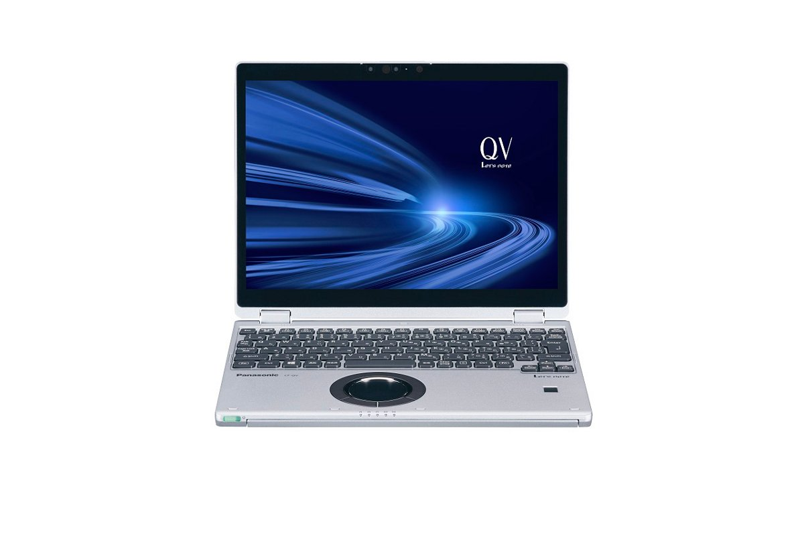
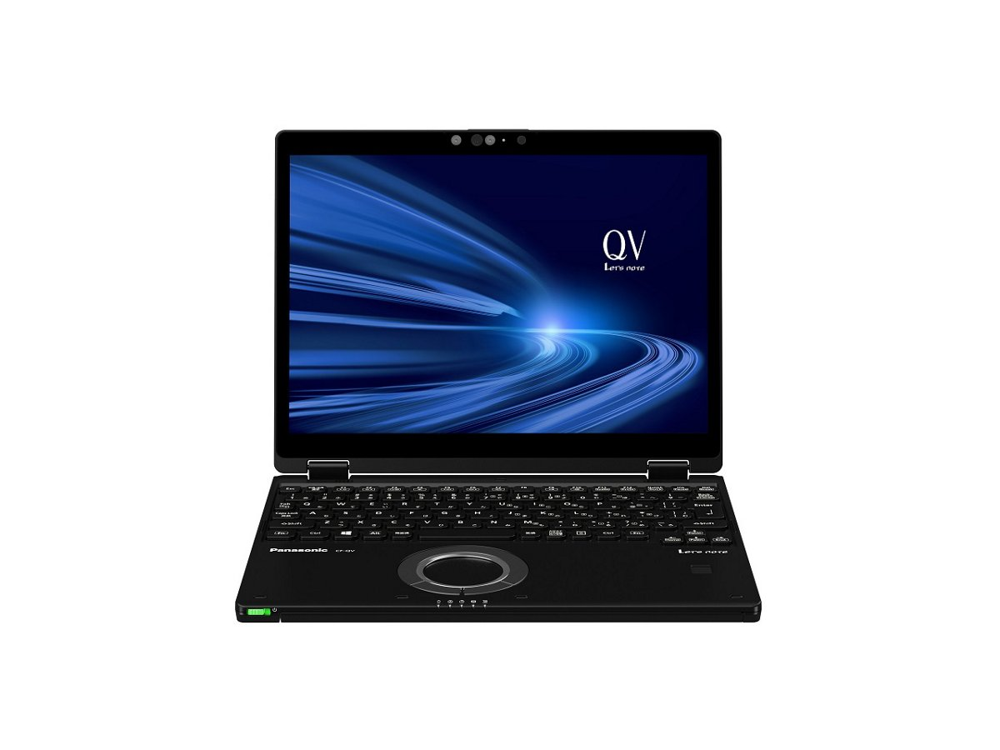
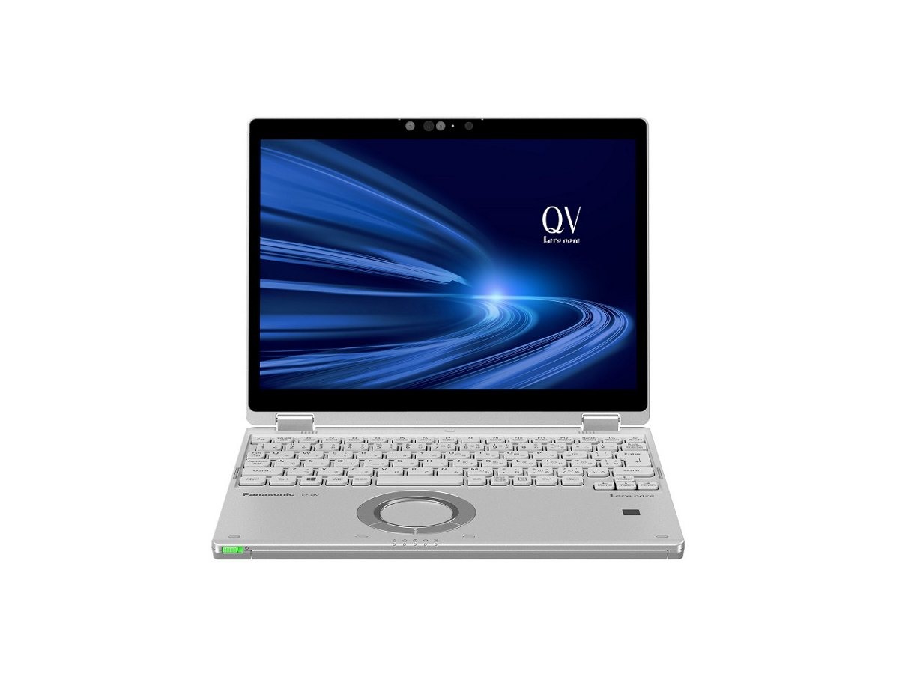
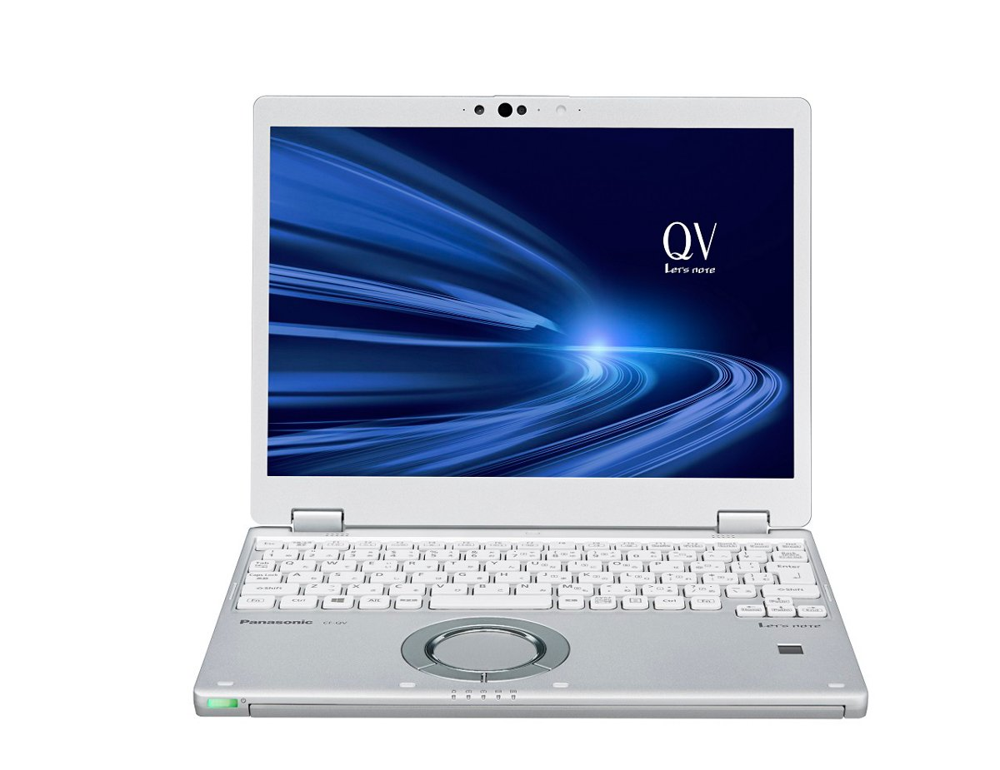

# 松下 Let's note CF-QV9 规格参数

[English](../../en/CF-QV9/) · [日本語](../../ja/CF-QV9/) · **中文**

**CF-QV9** 是松下 Let's note 笔记本电脑，属于 QV 系列，配备 12.0英寸 WQXGA＋ 屏幕。本页收录其全部 9 个型号（2020-06 – 2021-01 发售）的规格参数。每个型号均附官方规格表链接。

*松下 Let's note CF-QV9（CF-QV9CDMQR, CF-QV9ADMQR, CF-QV9HDMQR），黑银。图片 © Panasonic*

## 型号列表

| 型号（品番） | 发售 | 停产 | 主要规格 |
| :-- | :-- | :-- | :-- |
| [CF-QV9CDMQR](https://panasonic.jp/pc/p-db/CF-QV9CDMQR_spec.html) | 2021-01 | 2021-05 | Windows 10 Pro 64位、英特尔® CoreTM i5-10210U 处理器、内存：16GB（无空余插槽）、SSD：256GB、LAN、无线LAN 802.11a（W52/W53/W56）/b/g/n/ac/ax（含6GHz频段）、Microsoft® Office Home and Business 2019 |
| [CF-QV9DFNQR](https://panasonic.jp/pc/p-db/CF-QV9DFNQR_spec.html) | 2021-01 | 2021-05 | Windows 10 Pro 64位、英特尔® CoreTM i7-10710U 处理器、内存：16GB（无空余插槽）、SSD：512GB、LAN、无线LAN 802.11a（W52/W53/W56）/b/g/n/ac/ax（含6GHz频段）、Microsoft® Office Home and Business 2019 |
| [CF-QV9M1AQR](https://panasonic.jp/pc/p-db/CF-QV9M1AQR_spec.html) | 2020-11 | 2021-02 | Windows 10 Pro 64位、英特尔® CoreTM i5-10210U 处理器、内存：8GB（无空余插槽）、SSD：256GB、LAN、无线LAN 802.11a（W52/W53/W56）/b/g/n/ac/ax（含6GHz频段）、Microsoft® Office Home and Business 2019 |
| [CF-QV9ADGQR](https://panasonic.jp/pc/p-db/CF-QV9ADGQR_spec.html) | 2020-10 | 2021-02 | Windows 10 Pro 64位、英特尔® CoreTM i5-10210U 处理器、内存：8GB（无空余插槽）、SSD：256GB、LAN、无线LAN 802.11a（W52/W53/W56）/b/g/n/ac/ax（含6GHz频段）、Microsoft® Office Home and Business 2019 |
| [CF-QV9ADMQR](https://panasonic.jp/pc/p-db/CF-QV9ADMQR_spec.html) | 2020-10 | 2021-02 | Windows 10 Pro 64位、英特尔® CoreTM i5-10210U 处理器、内存：16GB（无空余插槽）、SSD：256GB、LAN、无线LAN 802.11a（W52/W53/W56）/b/g/n/ac/ax（含6GHz频段）、Microsoft® Office Home and Business 2019 |
| [CF-QV9EFNQR](https://panasonic.jp/pc/p-db/CF-QV9EFNQR_spec.html) | 2020-10 | 2021-02 | Windows 10 Pro 64位、英特尔® CoreTM i7-10710U 处理器、内存：8GB（无空余插槽）、SSD：512GB、LAN、无线LAN 802.11a（W52/W53/W56）/b/g/n/ac/ax（含6GHz频段）、支持LTE的无线WAN、Microsoft® Office Home and Business 2019 |
| [CF-QV9HDGQR](https://panasonic.jp/pc/p-db/CF-QV9HDGQR_spec.html) | 2020-06 | 2020-09 | Windows 10 Pro 64位、英特尔® CoreTM i5-10210U 处理器、内存：8GB（无空余插槽）、SSD：256GB、LAN、无线LAN 802.11a（W52/W53/W56）/b/g/n/ac/ax（含6GHz频段）、Microsoft® Office Home and Business 2019 |
| [CF-QV9HDMQR](https://panasonic.jp/pc/p-db/CF-QV9HDMQR_spec.html) | 2020-06 | 2020-09 | Windows 10 Pro 64位、英特尔® CoreTM i5-10210U 处理器、内存：16GB（无空余插槽）、SSD：256GB、LAN、无线LAN 802.11a（W52/W53/W56）/b/g/n/ac/ax（含6GHz频段）、Microsoft® Office Home and Business 2019 |
| [CF-QV9KFNQR](https://panasonic.jp/pc/p-db/CF-QV9KFNQR_spec.html) | 2020-06 | 2020-09 | Windows 10 Pro 64位、英特尔® CoreTM i7-10710U 处理器、内存：8GB（无空余插槽）、SSD：512GB、LAN、无线LAN 802.11a（W52/W53/W56）/b/g/n/ac/ax（含6GHz频段）、Microsoft® Office Home and Business 2019 |

## 通用规格

| 项目 | 规格 |
| :-- | :-- |
| 操作系统 | Windows 10 Pro 64位 |
| 芯片组 | 内置于CPU |
| 光驱 | 未配备 |
| 显示屏 / 显卡 | 英特尔® UHD 显卡（CPU内置） |
| 显示屏 / 色彩 | 2880×1920像素：约1677万色 |
| 显示屏 / 外接显示输出 | 1024×768、1280×768、1280×1024、1360×768、1366×768、1400×1050、1600×900、1600×1200、1680×1050、1920×1080、1920×1200像素：约1677万色 / 仅HDMI输出：2560×1440、3840×2160（30 Hz/60 Hz）、4096×2160（30 Hz/60 Hz） |
| 显示屏 / 同时显示 | 1024×768、1280×768、1280×1024、1360×768、1366×768、1400×1050、1600×900、1600×1200、1680×1050、1920×1080、1920×1200、2160×1440、2880×1920像素：约1677万色 |
| 有线网络 | 1000BASE-T/100BASE-TX/10BASE-T |
| 音频 | PCM音源（24位立体声）、英特尔® High Definition Audio标准、立体声扬声器 |
| 安全芯片 | TPM（符合TCG V2.0） |
| 安全（Windows Hello） | 支持人脸识别的摄像头/指纹传感器（触摸式） |
| 内存扩展槽 | 无 |
| 摄像头 | 支持人脸识别的摄像头，有效像素：最大 1920x1080像素（约207万像素） |
| 麦克风 | 阵列麦克风 |
| 接口 | ・USB3.1 Type-C端口（支持Thunderbolt™3、USB Power Delivery） / ・USB3.0 Type-A端口×3（其中1个兼作手机充电） / ・LAN接口（RJ-45） / ・外接显示器接口（模拟RGB 迷你D-sub 15针） / ・HDMI输出端子（支持4K60p输出） / ・耳麦端子（麦克风输入＋音频输出）（耳麦迷你插孔3.5mm、CTIA标准） |
| 键盘 | 符合OADG标准86键、键距19mm（横向）/15.2mm（纵向）（部分键除外） |
| 电源 | ▼AC适配器 / 输入：AC100V～240V、50Hz/60Hz、输出：DC16V、4.06A、电源线仅限100V专用 / ▼电池组 / 7.6V锂离子・额定容量5020mAh |
| 功耗 | 最大约65W |
| 能效 | 目标年度2022年度 12区分19.0［kWh/年］ |
| 能效达成率 | — |
| 尺寸（宽×深×高） | 宽273.0mm×深209.2mm×高18.7mm（不含突起部） |
| 预装软件 | ・Microsoft® Internet Explorer 11 / ・Microsoft® Edge / ・Microsoft® .NET Framework 4.8 / ・Microsoft® Windows Media Player 12 / ・迈克菲 LiveSafe（60天免费试用版） / ・i-Filter 6.0（30天免费试用版） / ・WinZip 20.5 日语版（45天试用版） / ・Aptio 设置 / ・PC-Diagnostic 实用程序 / ・Panasonic PC 设置实用程序 / ・硬盘数据擦除实用程序 / ・DirectX 12 / ・PC 信息查看器 / ・Panasonic PC 恢复光盘创建实用程序 / ・Panasonic PC Camera Utility |
| Microsoft Office | Microsoft® Office Home and Business 2019 |

## 各型号差异

| 型号（品番） | 处理器 | 内存 | 存储 | 重量 | 续航 |
| :-- | :-- | :-- | :-- | :-- | :-- |
| CF-QV9CDMQR | Core i5-10210U | 16GB LPDDR3 SDRAM | 256GB | 0.949 kg | 11 h |
| CF-QV9DFNQR | Core i7-10710U | 16GB LPDDR3 SDRAM | 512GB | 0.979 kg | 11 h |
| CF-QV9M1AQR | Core i5-10210U | 8GB LPDDR3 SDRAM | 256GB | 0.879 kg | 12.5 h |
| CF-QV9ADGQR | Core i5-10210U | 8GB LPDDR3 SDRAM | 256GB | 0.949 kg | 11.5 h |
| CF-QV9ADMQR | Core i5-10210U | 16GB LPDDR3 SDRAM | 256GB | 0.949 kg | 11 h |
| CF-QV9EFNQR | Core i7-10710U | 8GB LPDDR3 SDRAM | 512GB | 0.979 kg | 11.5 h |
| CF-QV9HDGQR | Core i5-10210U | 8GB LPDDR3 SDRAM | 256GB | 0.949 kg | 11.5 h |
| CF-QV9HDMQR | Core i5-10210U | 16GB LPDDR3 SDRAM | 256GB | 0.949 kg | 11 h |
| CF-QV9KFNQR | Core i7-10710U | 8GB LPDDR3 SDRAM | 512GB | 0.979 kg | 11.5 h |

CF-QV9CDMQR 的全部差异规格

| 项目 | 规格 |
| :-- | :-- |
| 处理器 | 英特尔® Core™ i5-10210U 处理器 / （缓存6MB、运行频率1.60GHz、使用英特尔® 睿频加速技术2.0时最高4.20GHz） |
| 核心数 | 4核 |
| 内存 | 16GB LPDDR3 SDRAM（无扩展插槽） |
| 显存 | 最大8167MB（与主内存共享） |
| 固态硬盘 | 闪存驱动器（SSD）256GB（PCIe）上述容量中约15GB用作恢复区域、约1GB用作系统区域（用户不可使用） |
| 显示屏 | 12.0英寸(3:2)WQXGA+ TFT彩色液晶（2880×1920像素）（电容式多点触控面板、附防反射保护膜） |
| 无线通信模块 | Intel® Wi-Fi 6 AX201 |
| 无线网络 | 符合IEEE802.11a/b/g/n/ac/ax（5 GHz频道频段：W52/W53/W56）支持WPA3、WPA2-AES/TKIP、符合Wi-Fi |
| LTE | 未配备 |
| 蓝牙 | Bluetooth v5.1 / ■支持配置文件 / 【Classic】 / ・A2DP（Source） / ・AVRCP（Target） / ・HCRP（Client） / ・HFP（AG） / ・HID（Host） / ・OPP（Client和Server） / ・PAN（User） / ・SPP（DevA和DevB） / 【Low Energy】 / ・HOGP（Host） |
| SD 卡槽 | SD存储卡×1插槽（支持SDHC存储卡/SDXC存储卡/支持版权保护技术/支持UHS-I・UHS-Ⅱ高速传输） |
| 传感器 | 照度传感器 / 地磁传感器 / 陀螺仪传感器 / 加速度传感器 |
| 指点设备 | 滚轮触控板・静电触控面板（支持 10 指） |
| 续航 / 充电时间 | ▼续航时间 / （JEITA Ver.2.0） / 约11小时 / ▼充电时间 / 约2.5小时（电源OFF时）、约2.5小时（电源ON时） |
| 颜色 | 黑色＆银色 |
| 重量（含电池） | 电脑主机：约0.949kg（安装附带的电池组（约235g）时） / AC适配器：约220g（不含电源线（约60g）） |
| 附件 | 电池组、AC适配器、专用布、使用说明书、Microsoft Office Home & Business 2019等 |

官方规格表: <https://panasonic.jp/pc/p-db/CF-QV9CDMQR_spec.html>

CF-QV9DFNQR 的全部差异规格

| 项目 | 规格 |
| :-- | :-- |
| 处理器 | 英特尔® Core™ i7-10710U 处理器 / （缓存12MB、运行频率1.10GHz、使用英特尔® 睿频加速技术2.0时最高4.70GHz） |
| 核心数 | 6核 |
| 内存 | 16GB LPDDR3 SDRAM（无扩展插槽） |
| 显存 | 最大8167MB（与主内存共享） |
| 固态硬盘 | 闪存驱动器（SSD）512GB（PCIe）上述容量中约15GB用作恢复区域、约1GB用作系统区域（用户不可使用） |
| 显示屏 | 12.0英寸(3:2)WQXGA+ TFT彩色液晶（2880×1920像素）（电容式多点触控面板、附防反射保护膜） |
| 无线通信模块 | Intel® Wi-Fi 6 AX201 |
| 无线网络 | 符合IEEE802.11a/b/g/n/ac/ax（5 GHz频道频段：W52/W53/W56）支持WPA3、WPA2-AES/TKIP、符合Wi-Fi |
| LTE | 内置无线WAN模块（支持LTE） |
| 蓝牙 | Bluetooth v5.1 / ■支持配置文件 / 【Classic】 / ・A2DP（Source） / ・AVRCP（Target） / ・HCRP（Client） / ・HFP（AG） / ・HID（Host） / ・OPP（Client和Server） / ・PAN（User） / ・SPP（DevA和DevB） / 【Low Energy】 / ・HOGP（Host） |
| 传感器 | 照度传感器 / 地磁传感器 / 陀螺仪传感器 / 加速度传感器 |
| 指点设备 | 滚轮触控板・静电触控面板（支持 10 指） |
| 续航 / 充电时间 | ▼续航时间 / （JEITA Ver.2.0） / 约11小时 / ▼充电时间 / 约2.5小时（电源OFF时）、约2.5小时（电源ON时） |
| 颜色 | 黑色 |
| 重量（含电池） | 电脑主机：约0.979kg（安装附带的电池组（约235g）时） / AC适配器：约220g（不含电源线（约60g）） |
| 附件 | 电池组、AC适配器、专用布、使用说明书、Microsoft Office Home & Business 2019等 |
| 卡槽 / SD 卡 | SD存储卡×1插槽（支持SDHC存储卡/SDXC存储卡/支持版权保护技术/支持UHS-I・UHS-Ⅱ高速传输） |
| 卡槽 / 其他 | nano SIM卡插槽 |

官方规格表: <https://panasonic.jp/pc/p-db/CF-QV9DFNQR_spec.html>

CF-QV9M1AQR 的全部差异规格

| 项目 | 规格 |
| :-- | :-- |
| 处理器 | 英特尔® Core™ i5-10210U 处理器 / （英特尔®智能缓存6MB、运行频率1.60GHz、使用英特尔® 睿频加速技术2.0时最高4.20GHz） |
| 核心数 | 4核 |
| 内存 | 8GB LPDDR3 SDRAM（无扩展插槽） |
| 显存 | 最大4071MB（与主内存共享） |
| 固态硬盘 | 闪存驱动器（SSD）256GB（PCIe）上述容量中约15GB用作恢复区域、约1GB用作系统区域（用户不可使用） |
| 显示屏 | 12.0英寸(3:2)WQXGA+ TFT彩色液晶（2880×1920像素）防眩光 |
| 无线通信模块 | 英特尔® Wi-Fi 6 AX201 |
| 无线网络 | 符合IEEE802.11a（W52/W53/W56）/b/g/n/ac/ax（支持WPA3、WPA2-AES/TKIP、符合Wi-Fi） |
| LTE | 未配备 |
| 蓝牙 | Bluetooth v5.1 / ■支持配置文件 / 【Classic】 / ・A2DP（Source） / ・AVRCP（Target） / ・HCRP（Client） / ・HFP（AG） / ・HID（Host） / ・OPP（Client和Server） / ・PAN（User） / ・SPP（DevA和DevB） / 【Low Energy】 / ・HOGP（Host） |
| SD 卡槽 | SD存储卡×1插槽（支持SDHC存储卡/SDXC存储卡/支持版权保护技术/支持UHS-I・UHS-Ⅱ高速传输） |
| 传感器 | 照度传感器 |
| 指点设备 | 滚轮触控板 |
| 续航 / 充电时间 | ▼续航时间 / （JEITA Ver.2.0） / 约12.5小时 / ▼充电时间 / 约2.5小时（电源OFF时）、约2.5小时（电源ON时） |
| 颜色 | 银色 |
| 重量（含电池） | 电脑主机：约0.879kg（安装附带的电池组（约235g）时） / AC适配器：约220g（不含电源线（约60g）） |
| 附件 | 电池组、AC适配器、使用说明书、Microsoft Office Home & Business 2019等 |

官方规格表: <https://panasonic.jp/pc/p-db/CF-QV9M1AQR_spec.html>

CF-QV9ADGQR 的全部差异规格

| 项目 | 规格 |
| :-- | :-- |
| 处理器 | 英特尔® Core™ i5-10210U 处理器 / （英特尔®智能缓存6MB、运行频率1.60GHz、使用英特尔® 睿频加速技术2.0时最高4.20GHz） |
| 核心数 | 4核 |
| 内存 | 8GB LPDDR3 SDRAM（无扩展插槽） |
| 显存 | 最大4071MB（与主内存共享） |
| 固态硬盘 | 闪存驱动器（SSD）256GB（PCIe）上述容量中约15GB用作恢复区域、约1GB用作系统区域（用户不可使用） |
| 显示屏 | 12.0英寸(3:2)WQXGA+ TFT彩色液晶（2880×1920像素）（电容式多点触控面板、附防反射保护膜） |
| 无线通信模块 | 英特尔® Wi-Fi 6 AX201 |
| 无线网络 | 符合IEEE802.11a（W52/W53/W56）/b/g/n/ac/ax（支持WPA3、WPA2-AES/TKIP、符合Wi-Fi） |
| LTE | 未配备 |
| 蓝牙 | Bluetooth v5.1 / ■支持配置文件 / 【Classic】 / ・A2DP（Source） / ・AVRCP（Target） / ・HCRP（Client） / ・HFP（AG） / ・HID（Host） / ・OPP（Client和Server） / ・PAN（User） / ・SPP（DevA和DevB） / 【Low Energy】 / ・HOGP（Host） |
| SD 卡槽 | SD存储卡×1插槽（支持SDHC存储卡/SDXC存储卡/支持版权保护技术/支持UHS-I・UHS-Ⅱ高速传输） |
| 传感器 | 照度传感器 / 地磁传感器 / 陀螺仪传感器 / 加速度传感器 |
| 指点设备 | 滚轮触控板・静电触控面板（支持 10 指） |
| 续航 / 充电时间 | ▼续航时间 / （JEITA Ver.2.0） / 约11.5小时 / ▼充电时间 / 约2.5小时（电源OFF时）、约2.5小时（电源ON时） |
| 颜色 | 银色 |
| 重量（含电池） | 电脑主机：约0.949kg（安装附带的电池组（约235g）时） / AC适配器：约220g（不含电源线（约60g）） |
| 附件 | 电池组、AC适配器、专用布、使用说明书、Microsoft Office Home & Business 2019等 |

官方规格表: <https://panasonic.jp/pc/p-db/CF-QV9ADGQR_spec.html>

CF-QV9ADMQR 的全部差异规格

| 项目 | 规格 |
| :-- | :-- |
| 处理器 | 英特尔® Core™ i5-10210U 处理器 / （英特尔®智能缓存6MB、运行频率1.60GHz、使用英特尔® 睿频加速技术2.0时最高4.20GHz） |
| 核心数 | 4核 |
| 内存 | 16GB LPDDR3 SDRAM（无扩展插槽） |
| 显存 | 最大8167MB（与主内存共享） |
| 固态硬盘 | 闪存驱动器（SSD）256GB（PCIe）上述容量中约15GB用作恢复区域、约1GB用作系统区域（用户不可使用） |
| 显示屏 | 12.0英寸(3:2)WQXGA+ TFT彩色液晶（2880×1920像素）（电容式多点触控面板、附防反射保护膜） |
| 无线通信模块 | 英特尔® Wi-Fi 6 AX201 |
| 无线网络 | 符合IEEE802.11a（W52/W53/W56）/b/g/n/ac/ax（支持WPA3、WPA2-AES/TKIP、符合Wi-Fi） |
| LTE | 未配备 |
| 蓝牙 | Bluetooth v5.1 / ■支持配置文件 / 【Classic】 / ・A2DP（Source） / ・AVRCP（Target） / ・HCRP（Client） / ・HFP（AG） / ・HID（Host） / ・OPP（Client和Server） / ・PAN（User） / ・SPP（DevA和DevB） / 【Low Energy】 / ・HOGP（Host） |
| SD 卡槽 | SD存储卡×1插槽（支持SDHC存储卡/SDXC存储卡/支持版权保护技术/支持UHS-I・UHS-Ⅱ高速传输） |
| 传感器 | 照度传感器 / 地磁传感器 / 陀螺仪传感器 / 加速度传感器 |
| 指点设备 | 滚轮触控板・静电触控面板（支持 10 指） |
| 续航 / 充电时间 | ▼续航时间 / （JEITA Ver.2.0） / 约11小时 / ▼充电时间 / 约2.5小时（电源OFF时）、约2.5小时（电源ON时） |
| 颜色 | 黑色＆银色 |
| 重量（含电池） | 电脑主机：约0.949kg（安装附带的电池组（约235g）时） / AC适配器：约220g（不含电源线（约60g）） |
| 附件 | 电池组、AC适配器、专用布、使用说明书、Microsoft Office Home & Business 2019等 |

官方规格表: <https://panasonic.jp/pc/p-db/CF-QV9ADMQR_spec.html>

CF-QV9EFNQR 的全部差异规格

| 项目 | 规格 |
| :-- | :-- |
| 处理器 | 英特尔® Core™ i7-10710U 处理器 / （英特尔®智能缓存12MB、运行频率1.10GHz、使用英特尔® 睿频加速技术2.0时最高4.70GHz） |
| 核心数 | 6核 |
| 内存 | 8GB LPDDR3 SDRAM（无扩展插槽） |
| 显存 | 最大4071MB（与主内存共享） |
| 固态硬盘 | 闪存驱动器（SSD）512GB（PCIe）上述容量中约15GB用作恢复区域、约1GB用作系统区域（用户不可使用） |
| 显示屏 | 12.0英寸(3:2)WQXGA+ TFT彩色液晶（2880×1920像素）（电容式多点触控面板、附防反射保护膜） |
| 无线通信模块 | 英特尔® Wi-Fi 6 AX201 |
| 无线网络 | 符合IEEE802.11a（W52/W53/W56）/b/g/n/ac/ax（支持WPA3、WPA2-AES/TKIP、符合Wi-Fi） |
| LTE | 内置无线WAN模块（支持LTE） |
| 蓝牙 | Bluetooth v5.1 / ■支持配置文件 / 【Classic】 / ・A2DP（Source） / ・AVRCP（Target） / ・HCRP（Client） / ・HFP（AG） / ・HID（Host） / ・OPP（Client和Server） / ・PAN（User） / ・SPP（DevA和DevB） / 【Low Energy】 / ・HOGP（Host） |
| 传感器 | 照度传感器 / 地磁传感器 / 陀螺仪传感器 / 加速度传感器 |
| 指点设备 | 滚轮触控板・静电触控面板（支持 10 指） |
| 续航 / 充电时间 | ▼续航时间 / （JEITA Ver.2.0） / 约11.5小时 / ▼充电时间 / 约2.5小时（电源OFF时）、约2.5小时（电源ON时） |
| 颜色 | 黑色 |
| 重量（含电池） | 电脑主机：约0.979kg（安装附带的电池组（约235g）时） / AC适配器：约220g（不含电源线（约60g）） |
| 附件 | 电池组、AC适配器、专用布、使用说明书、Microsoft Office Home & Business 2019等 |
| 卡槽 / SD 卡 | SD存储卡×1插槽（支持SDHC存储卡/SDXC存储卡/支持版权保护技术/支持UHS-I・UHS-Ⅱ高速传输） |
| 卡槽 / 其他 | nano SIM卡插槽 |

官方规格表: <https://panasonic.jp/pc/p-db/CF-QV9EFNQR_spec.html>

CF-QV9HDGQR 的全部差异规格

| 项目 | 规格 |
| :-- | :-- |
| 处理器 | 英特尔® Core™ i5-10210U 处理器 / （英特尔®智能缓存6MB、运行频率1.60GHz、使用英特尔® 睿频加速技术2.0时最高4.20GHz） |
| 核心数 | 4核 |
| 内存 | 8GB LPDDR3 SDRAM（无扩展插槽） |
| 显存 | 最大4071MB（与主内存共享） |
| 固态硬盘 | 闪存驱动器（SSD）256GB（PCIe）上述容量中约15GB用作恢复区域、约1GB用作系统区域（用户不可使用） |
| 显示屏 | 12.0英寸(3:2)WQXGA+ TFT彩色液晶（2880×1920像素）（电容式多点触控面板、附防反射保护膜） |
| 无线通信模块 | 英特尔® Wi-Fi 6 AX201 |
| 无线网络 | 符合IEEE802.11a（W52/W53/W56）/b/g/n/ac/ax（支持WPA3、WPA2-AES/TKIP、符合Wi-Fi） |
| LTE | 未配备 |
| 蓝牙 | Bluetooth v5.0 / ■支持配置文件 / 【Classic】 / ・A2DP（Source） / ・AVRCP（Target） / ・HCRP（Client） / ・HFP（AG） / ・HID（Host） / ・OPP（Client和Server） / ・PAN（User） / ・SPP（DevA和DevB） / 【Low Energy】 / ・HOGP（Host） |
| SD 卡槽 | SD存储卡×1插槽（支持SDHC存储卡/SDXC存储卡/支持版权保护技术/支持UHS-I・UHS-Ⅱ高速传输） |
| 传感器 | 照度传感器 / 地磁传感器 / 陀螺仪传感器 / 加速度传感器 |
| 指点设备 | 滚轮触控板・静电触控面板（支持 10 指） |
| 续航 / 充电时间 | ▼续航时间 / （JEITA Ver.2.0） / 约11.5小时 / ▼充电时间 / 约2.5小时（电源OFF时）、约2.5小时（电源ON时） |
| 颜色 | 银色 |
| 重量（含电池） | 电脑主机：约0.949kg（安装附带的电池组（约235g）时） / AC适配器：约220g（不含电源线（约60g）） |
| 附件 | 电池组、AC适配器、专用布、使用说明书、Microsoft Office Home & Business 2019等 |

官方规格表: <https://panasonic.jp/pc/p-db/CF-QV9HDGQR_spec.html>

CF-QV9HDMQR 的全部差异规格

| 项目 | 规格 |
| :-- | :-- |
| 处理器 | 英特尔® Core™ i5-10210U 处理器 / （英特尔®智能缓存6MB、运行频率1.60GHz、使用英特尔® 睿频加速技术2.0时最高4.20GHz） |
| 核心数 | 4核 |
| 内存 | 16GB LPDDR3 SDRAM（无扩展插槽） |
| 显存 | 最大8167MB（与主内存共享） |
| 固态硬盘 | 闪存驱动器（SSD）256GB（PCIe）上述容量中约15GB用作恢复区域、约1GB用作系统区域（用户不可使用） |
| 显示屏 | 12.0英寸(3:2)WQXGA+ TFT彩色液晶（2880×1920像素）（电容式多点触控面板、附防反射保护膜） |
| 无线通信模块 | 英特尔® Wi-Fi 6 AX201 |
| 无线网络 | 符合IEEE802.11a（W52/W53/W56）/b/g/n/ac/ax（支持WPA3、WPA2-AES/TKIP、符合Wi-Fi） |
| LTE | 未配备 |
| 蓝牙 | Bluetooth v5.0 / ■支持配置文件 / 【Classic】 / ・A2DP（Source） / ・AVRCP（Target） / ・HCRP（Client） / ・HFP（AG） / ・HID（Host） / ・OPP（Client和Server） / ・PAN（User） / ・SPP（DevA和DevB） / 【Low Energy】 / ・HOGP（Host） |
| SD 卡槽 | SD存储卡×1插槽（支持SDHC存储卡/SDXC存储卡/支持版权保护技术/支持UHS-I・UHS-Ⅱ高速传输） |
| 传感器 | 照度传感器 / 地磁传感器 / 陀螺仪传感器 / 加速度传感器 |
| 指点设备 | 滚轮触控板・静电触控面板（支持 10 指） |
| 续航 / 充电时间 | ▼续航时间 / （JEITA Ver.2.0） / 约11小时 / ▼充电时间 / 约2.5小时（电源OFF时）、约2.5小时（电源ON时） |
| 颜色 | 黑色＆银色 |
| 重量（含电池） | 电脑主机：约0.949kg（安装附带的电池组（约235g）时） / AC适配器：约220g（不含电源线（约60g）） |
| 附件 | 电池组、AC适配器、专用布、使用说明书、Microsoft Office Home & Business 2019等 |

官方规格表: <https://panasonic.jp/pc/p-db/CF-QV9HDMQR_spec.html>

CF-QV9KFNQR 的全部差异规格

| 项目 | 规格 |
| :-- | :-- |
| 处理器 | 英特尔® Core™ i7-10710U 处理器 / （英特尔®智能缓存12MB、运行频率1.10GHz、使用英特尔® 睿频加速技术2.0时最高4.70GHz） |
| 核心数 | 6核 |
| 内存 | 8GB LPDDR3 SDRAM（无扩展插槽） |
| 显存 | 最大4071MB（与主内存共享） |
| 固态硬盘 | 闪存驱动器（SSD）512GB（PCIe）上述容量中约15GB用作恢复区域、约1GB用作系统区域（用户不可使用） |
| 显示屏 | 12.0英寸(3:2)WQXGA+ TFT彩色液晶（2880×1920像素）（电容式多点触控面板、附防反射保护膜） |
| 无线通信模块 | 英特尔® Wi-Fi 6 AX201 |
| 无线网络 | 符合IEEE802.11a（W52/W53/W56）/b/g/n/ac/ax（支持WPA3、WPA2-AES/TKIP、符合Wi-Fi） |
| LTE | 内置无线WAN模块（支持LTE） |
| 蓝牙 | Bluetooth v5.0 / ■支持配置文件 / 【Classic】 / ・A2DP（Source） / ・AVRCP（Target） / ・HCRP（Client） / ・HFP（AG） / ・HID（Host） / ・OPP（Client和Server） / ・PAN（User） / ・SPP（DevA和DevB） / 【Low Energy】 / ・HOGP（Host） |
| 传感器 | 照度传感器 / 地磁传感器 / 陀螺仪传感器 / 加速度传感器 |
| 指点设备 | 滚轮触控板・静电触控面板（支持 10 指） |
| 续航 / 充电时间 | ▼续航时间 / （JEITA Ver.2.0） / 约11.5小时 / ▼充电时间 / 约2.5小时（电源OFF时）、约2.5小时（电源ON时） |
| 颜色 | 黑色 |
| 重量（含电池） | 电脑主机：约0.979kg（安装附带的电池组（约235g）时） / AC适配器：约220g（不含电源线（约60g）） |
| 附件 | 电池组、AC适配器、专用布、使用说明书、Microsoft Office Home & Business 2019等 |
| 卡槽 / SD 卡 | SD存储卡×1插槽（支持SDHC存储卡/SDXC存储卡/支持版权保护技术/支持UHS-I・UHS-Ⅱ高速传输） |
| 卡槽 / 其他 | nano SIM卡插槽 |

官方规格表: <https://panasonic.jp/pc/p-db/CF-QV9KFNQR_spec.html>

## 图片

*松下 Let's note CF-QV9（CF-QV9DFNQR, CF-QV9EFNQR, CF-QV9KFNQR），黑色。图片 © Panasonic*

*松下 Let's note CF-QV9（CF-QV9ADGQR, CF-QV9HDGQR），银色。图片 © Panasonic*

*松下 Let's note CF-QV9（CF-QV9M1AQR），银色。图片 © Panasonic*

## 相关机型

- 同系列新一代: [CF-QV1](../CF-QV1/)
- 同系列上一代: [CF-QV8](../CF-QV8/)
- [Let's note 全部机型](../)

---

来源：松下官方[停产产品列表](https://panasonic.jp/pc/support/products/)及各型号规格表（panasonic.jp），由日文翻译，准确措辞以官方规格表为准。产品图片 © Panasonic。本页为非官方整理，与松下公司无关。
