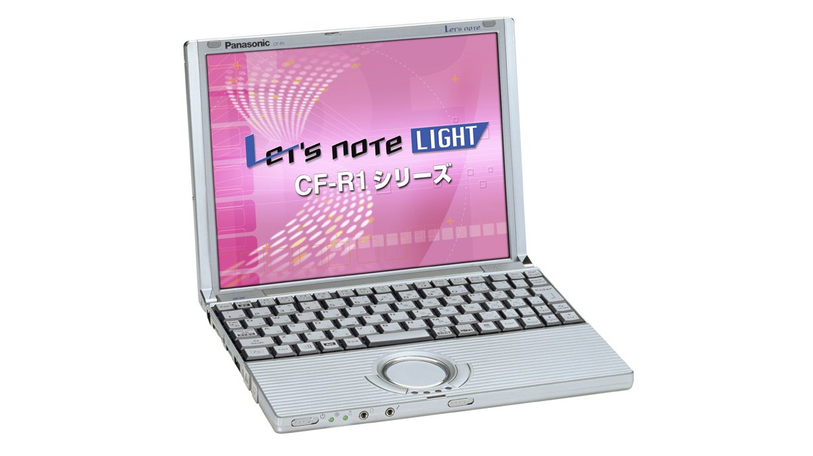
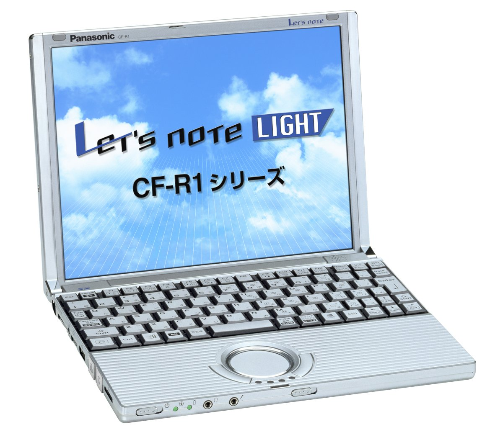
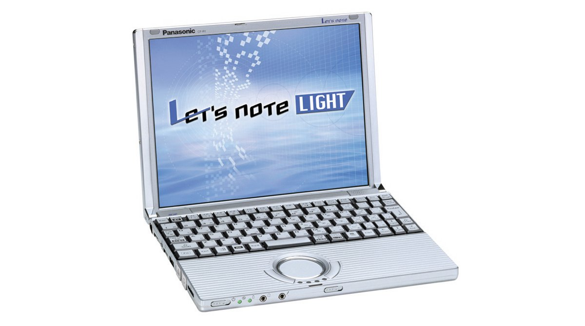

# 松下 Let's note CF-R1 规格参数

[English](../../en/CF-R1/) · [日本語](../../ja/CF-R1/) · **中文**

**CF-R1** 是松下 Let's note 笔记本电脑，属于 R1 系列，配备 10.4英寸 XGA 屏幕。本页收录其全部 4 个型号（2002-03 – 2003-02 发售）的规格参数。每个型号均附官方规格表链接。

*松下 Let's note CF-R1（CF-R1MCAXR, CF-R1NCAXR）。图片 © Panasonic*

## 型号列表

| 型号（品番） | 发售 | 停产 | 主要规格 |
| :-- | :-- | :-- | :-- |
| [CF-R1MCAXR](https://panasonic.jp/pc/p-db/CF-R1MCAXR_spec.html) | 2003-02 | 2003-03 | Windows® XP Professional、PentiumIII-M(933MHz・ULV)、内存：128MB（最大384MB）、HDD：20GB、LAN、USB2.0 |
| [CF-R1NCAXR](https://panasonic.jp/pc/p-db/CF-R1NCAXR_spec.html) | 2002-11 | 2002-12 | Windows® XP Professional、PentiumIII-M(866MHz・ULV)、内存：128MB（最大384MB）、HDD：20GB、LAN、USB2.0 |
| [CF-R1PCAXR](https://panasonic.jp/pc/p-db/CF-R1PCAXR_spec.html) | 2002-06 | 2002-07 | Windows® XP Professional、PentiumIII-M(800MHz・ULV)、内存：128MB（最大256MB）、HDD：20GB、LAN |
| [CF-R1RCXR](https://panasonic.jp/pc/p-db/CF-R1RCXR_spec.html) | 2002-03 | 2002-04 | Windows® XP Professional、PentiumIII-M(700MHz・ULV)、内存：128MB（最大256MB）、HDD：20GB、LAN |

## 通用规格

| 项目 | 规格 |
| :-- | :-- |
| 二级缓存 | 512 KB |
| 软驱（选配） | USB连接外置3.5英寸3模式支持(1.44 MB/1.2 MB/720 KB)（选配） |
| 显示屏 | XGA (1024×768像素) 10.4英寸TFT彩色液晶 |
| 有线网络 | 100BASE-TX / 10BASE-T |
| 音频 | PCM音源(16位立体声)、单声道扬声器 |
| 卡槽 / PC 卡 | PC卡(TYPE II)×1插槽 CardBus对应 |
| 键盘 | 符合OADG标准的键盘(85键)：键距17.5mm |
| 指点设备 | 滚轮触控板 |
| 电源 | AC100 V-240 V（50 Hz/60 Hz）（AC电源线仅适用于100 V）、标准电池组（7.4 V锂离子・4.4 Ah） |
| 功耗 | 最大约40 W |
| 尺寸（宽×深×高） | 宽240 mm×深183 mm×高23.5 mm／37.2 mm（前部／后部）不含突起部 |
| 重量（含电池） | 约960 g |

## 各型号差异

| 型号（品番） | 处理器 | 内存 | 存储 | 重量 | 续航 |
| :-- | :-- | :-- | :-- | :-- | :-- |
| CF-R1MCAXR | 超低电压版Pentium III 933 MHz -M | 128 MB SDRAM | 20 GB | 0.96 kg | 5 h |
| CF-R1NCAXR | 超低电压版Pentium III 866 MHz -M | 128 MB SDRAM | 20 GB | 0.96 kg | 5 h |
| CF-R1PCAXR | Pentium III 800 MHz -M | 128 MB SDRAM | 20 GB | 0.96 kg | 6 h |
| CF-R1RCXR | Pentium III 700 MHz -M | 128 MB SDRAM | 20 GB | 0.96 kg | 6.0 h |

CF-R1MCAXR 的全部差异规格

| 项目 | 规格 |
| :-- | :-- |
| 处理器 | 超低电压版移动 英特尔(R)Pentium(R) III 处理器 933 MHz -M（配备 Intel Speed Step(R) 技术）（系统总线时钟：133 MHz） |
| 芯片组 | Intel(R) 830 MG Chipset |
| 内存 | 标准128 MB SDRAM（最大384 MB） |
| 显存 | 最大32 MB（与主内存共享） |
| 硬盘 | 20 GB (Ultra ATA100)，其中约3GB用作恢复用数据区域（用户不可使用） |
| 显示屏 / 色彩 | 1024×768像素：约1600万色 |
| 显示屏 / 外接显示输出 | 800×600像素、1024×768像素、1280×1024像素：约1600万色 |
| 显示屏 / 同时显示 | 800×600像素、1024×768像素、1280×1024像素：约1600万色 |
| 调制解调器 | 数据：56 kbps(V.90 / k56flex自动对应) / FAX：14.4 kbps/不支持语音 |
| 卡槽 / SD 卡 | SD 存储卡 /多媒体卡×1插槽 |
| 内存扩展槽 | 144针微型DIMM专用插槽×1(256 MB PC133) |
| 接口 / 音频 | 麦克风输入（单声道迷你插孔）、音频输出（立体声迷你插孔） |
| 接口 / USB | USB接口×2（USB2.0×1、USB1.1×1） |
| 接口 / 外接显示 | 专用接口 16针 |
| 接口 / 其他 | 调制解调器接口、LAN 接口（RJ-45） |
| 能效 | S区分 0.00033 |
| 电池 | 续航时间 约5小时 充电时间 约3小时（电源OFF时）、约3小时（电源ON时） |
| 预装软件 | Microsoft(R)Windows(R) XP Professional with Service Pack1, / Microsoft(R)Internet Explorer6,Adobe(R) Acrobat(R) Reader,CN-Stage, / Panasonic PC 在线会员注册,DMI查看器,网络选择器, / SD实用程序,Microsoft(R) Windows(R) MediaTM Player 8,DirectX 8,滚轮触摸板实用程序,在线注册◆(hi-ho、@nifty、BIGLOBE、DION、OCN、ODN、docomo AOL),硬盘数据擦除实用程序 |
| 注意事项 | 与现有英特尔低电压版相比，进一步降低电压水平（电池驱动时0.95V） / ※20 本产品将系统重新安装所需的恢复数据备份在硬盘中。因此不附带产品恢复CD-ROM。 / ＊一般来说，标有Windows XP、DOS/V用等的软件及外围设备中，有些无法在本电脑上使用。购买时请向各软件及外围设备的销售商确认。 / ◆标记的软件操作相关支持由各厂商提供。 / PC启动时使用外部FDD时，请使用推荐的外部FDD(CF-VFDU03J)。 |

官方规格表: <https://panasonic.jp/pc/p-db/CF-R1MCAXR_spec.html>

CF-R1NCAXR 的全部差异规格

| 项目 | 规格 |
| :-- | :-- |
| 处理器 | 超低电压版移动 英特尔(R)Pentium(R) III 处理器 866 MHz -M （配备 Intel Speed Step(R) 技术）（系统总线时钟：133 MHz） |
| 芯片组 | Intel(R) 830 MG Chipset |
| 内存 | 标准128 MB SDRAM（最大384 MB） |
| 显存 | 最大32 MB（与主内存共享 |
| 硬盘 | 20 GB (Ultra ATA100)，其中约3GB用作恢复用数据区域（用户不可使用） |
| 显示屏 / 色彩 | 1024×768像素：约1600万色 |
| 显示屏 / 外接显示输出 | 800×600像素、1024×768像素、1280×1024像素：约1600万色 |
| 显示屏 / 同时显示 | 800×600像素、1024×768像素、1280×1024像素：约1600万色 |
| 调制解调器 | 数据：56 kbps(V.90 / k56flex自动对应) / FAX：14.4 kbps/不支持语音 |
| 卡槽 / SD 卡 | SD 存储卡 /多媒体卡×1插槽 |
| 内存扩展槽 | 144针微型DIMM专用插槽×1(256 MB PC133) |
| 接口 / 音频 | 麦克风输入（单声道迷你插孔）、音频输出（立体声迷你插孔） |
| 接口 / USB | USB接口×2（USB2.0×1、USB1.1×1） |
| 接口 / 外接显示 | 专用接口 16针 |
| 接口 / 其他 | 调制解调器接口、LAN 接口（RJ-45） |
| 能效 | S区分 0.00036 |
| 电池 | 续航时间 约5小时 充电时间 约3小时（电源OFF时）、约3小时（电源ON时） |
| 预装软件 | Microsoft(R)Windows(R) XP Professional with Service Pack1, / Microsoft(R)Internet Explorer6,Adobe(R) Acrobat(R) Reader,CN-Stage, / Panasonic PC 在线会员注册,DMI查看器,网络选择器, / SD实用程序,Microsoft(R) Windows(R) MediaTM Player 8,DirectX 8,滚轮触摸板实用程序,在线注册◆(hi-ho、@nifty、BIGLOBE、DION、OCN、ODN、docomo AOL) |
| 注意事项 | 与现有英特尔低电压版相比，进一步降低电压水平（电池驱动时0.95V） / ※18 本产品将系统重新安装所需的恢复数据备份在硬盘中。因此不附带产品恢复CD-ROM。 / ＊一般来说，标有Windows XP、DOS/V用等的软件及外围设备中，有些无法在本电脑上使用。购买时请向各软件及外围设备的销售商确认。 / ◆标记的软件操作相关支持由各厂商提供。 / PC启动时使用外部FDD时，请使用推荐的外部FDD(CF-VFDU03J)。 |

官方规格表: <https://panasonic.jp/pc/p-db/CF-R1NCAXR_spec.html>

CF-R1PCAXR 的全部差异规格

| 项目 | 规格 |
| :-- | :-- |
| 处理器 | 支持 Intel(R) SpeedStepTM 技术的超低电压版 / 移动 Pentium(R) III 处理器 800 MHz -M（系统总线时钟：100 MHz） |
| 芯片组 | Intel(R) 440 MX Chipset |
| 内存 | 标准128 MB SDRAM（最大256 MB） |
| 显存 | 4MB（图形芯片：Silicon Motion(R), Inc. 制 Lynx 3DM+） |
| 硬盘 | 20 GB (Ultra ATA)※1（其中约3GB用作恢复用数据区域） |
| 显示屏 / 色彩 | 1024×768像素：约1600万色※2 |
| 显示屏 / 外接显示输出 | 640×480像素、800×600像素、1024×768像素、1280×1024像素 ※4：约1600万色※3 |
| 显示屏 / 同时显示 | 640×480像素、800×600像素、1024×768像素、1280×1024像素 ※4：约1600万色※2 |
| 调制解调器 | 数据：56 kbps(V.90 / k56flex自动对应)*8 / FAX：14.4 kbps/不支持语音 |
| 卡槽 / SD 卡 | SD存储卡※9/多媒体卡※10×1插槽 |
| 内存扩展槽 | 144针微型DIMM专用插槽×1(128 MB PC100) |
| 能效 | S区分 0.00038※12 |
| 电池 | 续航时间※13 约6小时※14 / 充电时间※15 约3小时（电源OFF时）、约3小时（电源ON时） |
| 预装软件 | Microsoft(R)Windows(R) XP Professional※16、Microsoft(R)Internet Explorer6、Adobe(R) Acrobat(R) Reader 5.0、CN-Stage、Panasonic PC 在线会员注册、电波状况监视器II、DMI查看器、网络选择器、SD实用程序、Microsoft(R) Windows(R) Media(TM) Player 8、DirectX 8、滚轮触摸板实用程序、在线注册◆ |
| 注意事项 | 与现有英特尔低电压版相比，进一步降低电压水平（电池驱动时0.95V） / ※1 HDD容量按1GB=1,000,000,000字节显示。使用磁盘实用程序等时请使用支持NTFS的产品。恢复用数据保存在HDD中，因此与可用区域不同。 / ※2 通过图形加速器的抖动功能实现。 / ※3 根据所连接的显示器，可能无法显示。 / ※4 内部LCD仅显示整个画面的一部分（1024×768像素）。将光标移动到画面边缘时，整个画面会滚动。 / ※5 根据连接器的形状，有些可能无法使用。 / ※6 用于手机、PHS电话连接。需要另售的连接线。可使用的电话为手机（PDC/cdmaOne）、支持数据通信的PHS（NTT DoCoMo、Astel）、NTT DoCoMo、DDI Pocket的H"（Edge）以及支持α-DATA32的电话机（部分机型除外）。不支持FOMA、CDMA2000 1x（型号为Axxx的电话机）、AirH"。 / ※7 仅限日本国内NTT模拟普通线路专用。 / ※8 自动判别并切换V.90和k56flex。此外，56kbps是数据接收时的理论值。数据发送时最大速度为33.6kbps。 / ※9 本机SD存储卡插槽的传输速率为2MB/秒。即使使用支持高速传输速率的SD存储卡也为2MB/秒。不保证与所有SD设备的连接/运行。 / ※10 不保证所有多媒体卡的运行。※11 不保证所有支持USB的外围设备的运行。 / ※12 能耗效率是指根据节能法规定的测量方法测得的功耗除以节能法规定的复合理论性能所得的值。 / ※13 电池驱动时间因运行环境、系统设置而异。※14 基于JEITA电池驱动时间测量法（Ver1.0）的驱动时间。 / ※15 电池充电时间因运行环境、系统设置而异。对完全放电的电池充电可能需要较长时间。 / ※16 本电脑不保证在已安装的OS以外环境下运行。 / ※17 本产品将系统重新安装所需的恢复数据备份在硬盘中。因此不附带产品恢复CD-ROM。 / ＊一般来说，标有Windows XP、DOS/V用等的软件及外围设备中，有些无法在本电脑上使用。购买时请向各软件及外围设备的销售商确认。 / ◆标记的软件操作相关支持由各厂商提供。 |
| 无线通信端口 / 手机 | PDC：数据/FAX 9600bps 分组 9600bps/28.8kbps / cdmaOne：数据/FAX 14.4kbps 分组 64kbps ※6 |
| 无线通信端口 / PHS | PIAFS 64kbps/PIAFS 32kbps ※6 |
| 音频接口 | 麦克风输入（单声道迷你插孔）、音频输出（立体声迷你插孔） |
| USB | USB接口×2（USB1.1）※11 |
| 外接显示接口 | 专用接口 16针 |
| 其他接口 | 调制解调器接口※7、LAN 接口（RJ-45）※5 |

官方规格表: <https://panasonic.jp/pc/p-db/CF-R1PCAXR_spec.html>

CF-R1RCXR 的全部差异规格

| 项目 | 规格 |
| :-- | :-- |
| 处理器 | 支持Intel(R) SpeedStep(TM) 技术的超低电压版 / 移动Pentium(R) III处理器 700 MHz -M（系统总线时钟：100 MHz） |
| 芯片组 | Intel(R) 440 MX Chipset |
| 内存 | 标准128 MB SDRAM（最大256 MB） |
| 显存 | 4MB（图形芯片：Silicon Motion(R), Inc. 制 Lynx 3DM+） |
| 硬盘 | 20 GB (Ultra ATA)※1（其中约3GB用作恢复用数据区域） |
| 显示屏 / 色彩 | 1024×768像素：约1600万色※2 |
| 显示屏 / 外接显示输出 | 640×480像素、800×600像素、1024×768像素、1280×1024像素※4：约1600万色 ※3 |
| 显示屏 / 同时显示 | 640×480像素、800×600像素、1024×768像素、1280×1024像素※4：约1600万色※2 |
| 调制解调器 | 数据：56 kbps(V.90 / k56flex自动对应)*8 / FAX：14.4 kbps/不支持语音 |
| 卡槽 / SD 卡 | SD存储卡※9/多媒体卡※10 ×1插槽 |
| 内存扩展槽 | 144针微型DIMM专用插槽×1(128 MB PC100) |
| 能效 | S区分 0.00043 ※12 |
| 电池 | 续航时间※13 约6.0小时※14 / 充电时间※15 约3.0小时（电源OFF时）、约3.0小时（电源ON时） |
| 预装软件 | Microsoft(R)Windows(R) XP Professional※6 、Microsoft(R)Internet Explorer6、Adobe(R) Acrobat(R) Reader 5.0、CN-Stage、电波状况监视器II、DMI查看器、Microsoft(R)Windows(R)Media(TM)Player8、Directx8、网络选择器、SD实用程序 |
| 注意事项 | 与现有英特尔低电压版相比，进一步降低电压水平（电源驱动时1.1V） / ※1 HDD容量按1GB=1,000,000,000字节显示。使用磁盘实用程序等时请使用支持NTFS的产品。恢复用数据保存在HDD中，因此与可用区域不同。 / ※2 通过图形加速器的抖动功能实现。 / ※3 根据所连接的显示器，可能无法显示。 / ※4 内部LCD仅显示整个画面的一部分（1024×768像素）。将光标移动到画面边缘时，整个画面会滚动。 / ※5 根据连接器的形状，有些可能无法使用。 / ※6 用于手机、PHS电话连接。需要另售的连接线。可使用的电话为手机（PDC/cdmaOne）、支持数据通信的PHS（NTT DoCoMo、Astel）、NTT DoCoMo、DDI Pocket的H"（Edge）以及支持α-DATA32的电话机（部分机型除外）。 / ※7 仅限日本国内NTT模拟普通线路专用。 / ※8 自动判别并切换V.90和k56flex。此外，56kbps是数据接收时的理论值。数据发送时最大速度为33.6kbps。 / ※9 本机SD插槽的传输速率为2MB/秒。即使使用支持高速传输速率的SD存储卡也为2MB/秒。不保证与所有SD设备的连接/运行。 / ※10 不保证所有多媒体卡的运行。※11 不保证所有支持USB的外围设备的运行。 / ※12 能耗效率是指根据节能法规定的测量方法测得的功耗除以节能法规定的复合理论性能所得的值。 / ※13 电池驱动时间因运行环境、系统设置而异。※14 基于JEITA电池驱动时间测量法（Ver1.0）的驱动时间。 / ※15 电池充电时间因运行环境、系统设置而异。对完全放电的电池充电可能需要较长时间。 / ※16 本电脑不保证在已安装的OS以外环境下运行。 / ※17 本产品将系统重新安装所需的恢复数据备份在硬盘中。因此不附带产品恢复CD-ROM。 / ＊一般来说，标有Windows XP、DOS/V用等的软件及外围设备中，有些无法在本电脑上使用。购买时请向各软件及外围设备的销售商确认。 |
| 无线通信端口 / 手机 | PDC：数据/FAX 9600bps 分组 9600bps/28.8kbps / cdmaOne：数据/FAX 14.4kbps 分组 64kbps ※6 |
| 无线通信端口 / PHS | PIAFS 64kbps/PIAFS 32kbps ※6 |
| 音频接口 | 麦克风输入（单声道迷你插孔）、音频输出（立体声迷你插孔） |
| USB | USB接口×2（USB1.1）※11 |
| 外接显示接口 | 专用接口 16针 |
| 其他接口 | 调制解调器接口※7、LAN 接口（RJ-45）※5 |

官方规格表: <https://panasonic.jp/pc/p-db/CF-R1RCXR_spec.html>

## 图片

*松下 Let's note CF-R1（CF-R1PCAXR）。图片 © Panasonic*

*松下 Let's note CF-R1（CF-R1RCXR）。图片 © Panasonic*

## 相关机型

- [Let's note 全部机型](../)

---

来源：松下官方[停产产品列表](https://panasonic.jp/pc/support/products/)及各型号规格表（panasonic.jp），由日文翻译，准确措辞以官方规格表为准。产品图片 © Panasonic。本页为非官方整理，与松下公司无关。
