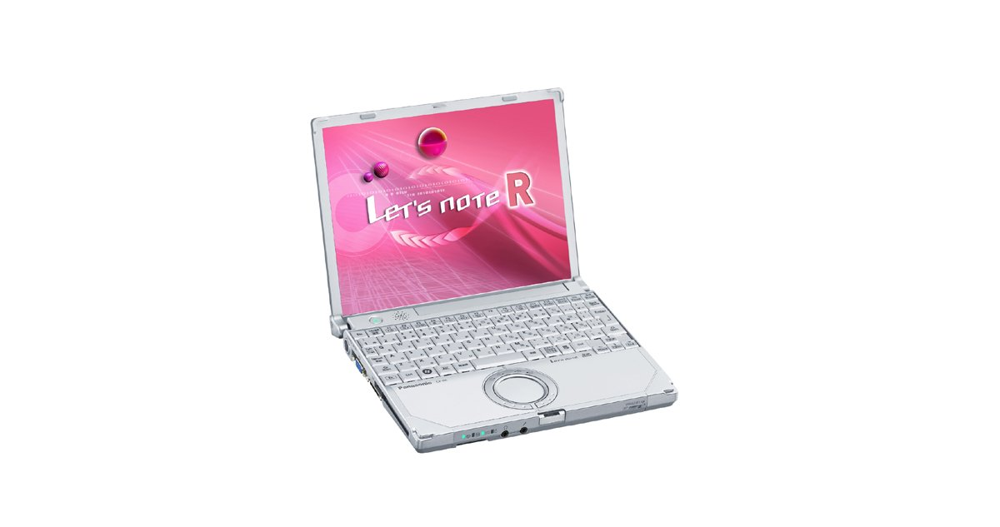
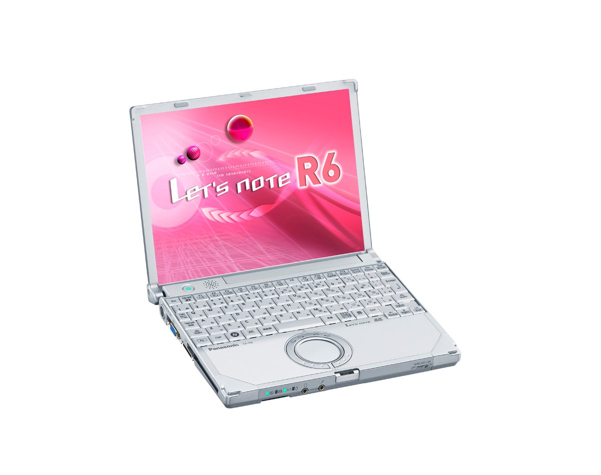

# 松下 Let's note CF-R6 规格参数

[English](../../en/CF-R6/) · [日本語](../../ja/CF-R6/) · **中文**

**CF-R6** 是松下 Let's note 笔记本电脑，属于 R6 系列，配备 10.4英寸 XGA 屏幕。本页收录其全部 3 个型号（2007-03 – 2007-05 发售）的规格参数。每个型号均附官方规格表链接。

*松下 Let's note CF-R6（CF-R6AW1BJR, CF-R6AW1PJR）。图片 © Panasonic*

## 型号列表

| 型号（品番） | 发售 | 停产 | 主要规格 |
| :-- | :-- | :-- | :-- |
| [CF-R6AW1BJR](https://panasonic.jp/pc/p-db/CF-R6AW1BJR_spec.html) | 2007-05 | 2008-03 | Windows Vista® Business 正規版 、CoreTM2 Duo U7500(1.06GHz・ULV)、メモリー：1GB（最大1.5GB)、HDD：80GB、LAN、無線LAN 802.11a(J52/W52/W53)/b/g、USB2.0 |
| [CF-R6AW1PJR](https://panasonic.jp/pc/p-db/CF-R6AW1PJR_spec.html) | 2007-05 | 2008-03 | Windows Vista® Business 正規版 、CoreTM2 Duo U7500(1.06GHz・ULV)、メモリー：1GB（最大1.5GB)、HDD：80GB、LAN、無線LAN 802.11a(J52/W52/W53)/b/g、USB2.0、Office Personal ＜台数限定＞ |
| [CF-R6MW4AJR](https://panasonic.jp/pc/p-db/CF-R6MW4AJR_spec.html) | 2007-03 | 2008-03 | Windows Vista® Business 正規版 、CoreTM Duo U2400 (1.06GHz・ULV)、メモリー：512MB（最大1.5GB)、HDD： 60GB、LAN、無線LAN 802.11a(J52/W52/W53)/b/g、USB2.0 |

## 通用规格

| 项目 | 规格 |
| :-- | :-- |
| 操作系统 | Windows Vista TM Business 正規版 |
| 芯片组 | モバイル インテル(R) 945GMS Express チップセット |
| 显示屏 | XGA (1024×768ドット)10.4型TFTカラー液晶 |
| 显示屏 / 色彩 | 1024×768ドット：約1677万色 |
| 显示屏 / 同时显示 | 800×600/1024×768ドット：約1677万色 |
| 有线网络 | 100BASE-TX / 10BASE-T |
| 安全芯片 | ＴＰＭ（TCG V1.2準拠） |
| 卡槽 / PC 卡 | PCカード（TYPEII）×1スロット(CardBus対応、許容電流3.3V：400mA、5V：400mA) |
| 键盘 | OADG準拠キーボード（85キー）：キーピッチ17mm（横）／14.3mm（縦）（一部キーを除く） |
| 指点设备 | ホイールパッド |
| 电源 | AC100V～240V（50Hz/60Hz）（電源コードは100V専用） / バッテリーパック （7.2 Vリチウムイオン・5.8 Ah） |
| 功耗 | 最大約40W |
| 尺寸（宽×深×高） | 幅229mm×奥行187 mm×高さ29.4mm/42.5mm（前部/後部） |
| 附件 | プロダクトリカバリーDVD-ROM、ACアダプター、標準バッテリーパック、Windows Anytime Upgrade DVD、取扱説明書 等 |

## 各型号差异

| 型号（品番） | 处理器 | 内存 | 存储 | 重量 | 续航 |
| :-- | :-- | :-- | :-- | :-- | :-- |
| CF-R6AW1BJR | Core 2 Duo 超低電圧版U7500 | 1GB DDR2 SDRAM | 80GB | 0.94 kg | — |
| CF-R6AW1PJR | Core 2 Duo 超低電圧版U7500 | 1GB DDR2 SDRAM | 80GB | 0.94 kg | — |
| CF-R6MW4AJR | Core Duo超低電圧版U2400 | 512MB DDR2 SDRAM | 60GB | 0.93 kg | — |

CF-R6AW1BJR 的全部差异规格

| 项目 | 规格 |
| :-- | :-- |
| 处理器 | インテル(R) Core TM 2 Duoプロセッサー 超低電圧版U7500 / 2次キャッシュメモリー 2MB、動作周波数 1.06GHz、フロントサイド・バス 533MHz |
| 内存 | 標準1GB DDR2 SDRAM（拡張メモリースロットに512MBメモリー増設済み、空きスロット0。 / 本体に標準装着済みの512MBメモリーを外して、1GBメモリーを増設した場合は、最大1.5GB。） |
| 显存 | 最大224MB （メインメモリーと共用） |
| 硬盘 | 80GB（Serial ATA）上記容量のうち約6GBは修復用領域（リカバリー用データ領域を含む）として使用。（ユーザー使用不可） |
| 软驱（选配） | USB接続外付3.5型3モード対応（1.44MB /1.2MB /720KB ） |
| 显示屏 / 外接显示输出 | 800×600/1024×768/1280×768/1280×1024/1400×1050/1440×900/1600×1200/2048×1536ドット（60Ｈｚ）：約1677万色 |
| 无线网络 | インテル(R)PRO/Wireless 3945ABGネットワーク・コネクション、IEEE802.11a（J52/W52/W53）/b/g準拠 、 / (WPA-AES/TKIP対応、Wi-Fi準拠) |
| 调制解调器 | データ：56kbps（V.90） FAX：14.4kbps /ボイス非対応 |
| 音频 | PCM音源（16ビットステレオ）/インテル(R) High Definition Audio 準拠、モノラルスピーカー |
| 卡槽 / SD 卡 | SDメモリーカード ×1スロット（SDHCメモリーカード/著作権保護機能対応。Windows Ready Boost機能には対応しておりません） |
| 内存扩展槽 | DDR2 172ピン マイクロDIMM専用スロット×1(1.8V/PC2-4200/DDR2 SDRAM、512MBメモリー増設済み) |
| 接口 | USBポート×2（USB2.0） 、モデムコネクター（RJ-11） 、LANコネクター（RJ-45）、 / 外部ディスプレイコネクター（アナログRGB ミニDsub 15ピン）、ミニポートリプリケーターコネクター（専用50ピン・R6に搭載） |
| 能效 | 2007年度基準Ｉ区分0.00027 |
| 重量（含电池） | 約940g |
| 预装软件 | Microsoft(R) Internet Explorer7.0、Adobe(R) Reader、DMIビューアー、Microsoft(R) Windows(R) MediaTM Player 11、DirectX 10、Microsoft(R) Windows(R) Movie Maker 6.0、Microsoft(R) .NET Framework3.0、ホイールパッドユーティリティ、hi-hoオンラインサインアップ、ズームビューアー、PC情報ビューアー、NumLockお知らせ、ハードディスクデータ消去ユーティリティ 、Wireless Manager mobile edition3.0 、無線切り替えユーティリティ、セキュリティ設定ユーティリティ、エコノミーモード（ECO）切り替えユーティリティ、省電力設定ユーティリティ、バッテリー残量表示補正ユーティリティ、Hotkey設定、セットアップユーティリティ、PC-Diagnosticユーティリティ 、マカフィー・インターネットセキュリティスイートベーシックエディション 、gooスティック、ネットセレクター2、Infineon TPM Professional Package V3.0 SP1 |

官方规格表: <https://panasonic.jp/pc/p-db/CF-R6AW1BJR_spec.html>

CF-R6AW1PJR 的全部差异规格

| 项目 | 规格 |
| :-- | :-- |
| 处理器 | インテル(R) Core TM 2 Duoプロセッサー 超低電圧版U7500 / 2次キャッシュメモリー 2MB、動作周波数 1.06GHz、フロントサイド・バス 533MHz |
| 内存 | 標準1GB DDR2 SDRAM（拡張メモリースロットに512MBメモリー増設済み、空きスロット0。 / 本体に標準装着済みの512MBメモリーを外して、1GBメモリーを増設した場合は、最大1.5GB。） |
| 显存 | 最大224MB （メインメモリーと共用） |
| 硬盘 | 80GB（Serial ATA）上記容量のうち約6GBは修復用領域（リカバリー用データ領域を含む）として使用。（ユーザー使用不可） |
| 软驱（选配） | USB接続外付3.5型3モード対応（1.44MB /1.2MB /720KB ） |
| 显示屏 / 外接显示输出 | 800×600/1024×768/1280×768/1280×1024/1400×1050/1440×900/1600×1200/2048×1536ドット（60Ｈｚ）：約1677万色 |
| 无线网络 | インテル(R)PRO/Wireless 3945ABGネットワーク・コネクション、IEEE802.11a（J52/W52/W53）/b/g準拠 、 / (WPA-AES/TKIP対応、Wi-Fi準拠) |
| 调制解调器 | データ：56kbps（V.90） FAX：14.4kbps /ボイス非対応 |
| 音频 | PCM音源（16ビットステレオ）/インテル(R) High Definition Audio 準拠、モノラルスピーカー |
| 卡槽 / SD 卡 | SDメモリーカード ×1スロット（SDHCメモリーカード/著作権保護機能対応。Windows Ready Boost機能には対応しておりません） |
| 内存扩展槽 | DDR2 172ピン マイクロDIMM専用スロット×1(1.8V/PC2-4200/DDR2 SDRAM、512MBメモリー増設済み) |
| 接口 | USBポート×2（USB2.0） 、モデムコネクター（RJ-11） 、LANコネクター（RJ-45）、 / 外部ディスプレイコネクター（アナログRGB ミニDsub 15ピン）、ミニポートリプリケーターコネクター（専用50ピン・R6に搭載） |
| 能效 | 2007年度基準Ｉ区分0.00027 |
| 重量（含电池） | 約940g |
| 预装软件 | Microsoft(R) Internet Explorer7.0、Adobe(R) Reader、DMIビューアー、Microsoft(R) Windows(R) MediaTM Player 11、DirectX 10、Microsoft(R) Windows(R) Movie Maker 6.0、Microsoft(R) .NET Framework3.0、ホイールパッドユーティリティ、hi-hoオンラインサインアップ、ズームビューアー、PC情報ビューアー、NumLockお知らせ、ハードディスクデータ消去ユーティリティ 、Wireless Manager mobile edition3.0 、無線切り替えユーティリティ、セキュリティ設定ユーティリティ、エコノミーモード（ECO）切り替えユーティリティ、省電力設定ユーティリティ、バッテリー残量表示補正ユーティリティ、Hotkey設定、セットアップユーティリティ、PC-Diagnosticユーティリティ 、マカフィー・インターネットセキュリティスイートベーシックエディション 、gooスティック、ネットセレクター2、Infineon TPM Professional Package V3.0 SP1 / Microsoft(R) Office Personal 2007with PowerPoint 2007 |

官方规格表: <https://panasonic.jp/pc/p-db/CF-R6AW1PJR_spec.html>

CF-R6MW4AJR 的全部差异规格

| 项目 | 规格 |
| :-- | :-- |
| 处理器 | インテル(R) Centrino(R) Duo モバイルテクノロジー / インテル(R) Core TM Duoプロセッサー超低電圧版U2400 / 2次キャッシュメモリー2MB、動作周波数 1.06GHz、フロントサイド・バス 533MHz |
| 内存 | 標準512MB DDR2 SDRAM（最大1536MB）空きスロット1 |
| 显存 | 最大64MB（メインメモリーと共用） |
| 硬盘 | 60GB（Serial ATA）上記容量のうち約6GBは修復用領域として使用。（ユーザー使用不可） |
| 软驱（选配） | USB接続外付3.5型3モード対応（1.44MB/1.2MB/720KB） |
| 显示屏 / 外接显示输出 | 800×600/1024×768/1280×768/1280×1024/1400×1050/1600×1200/2048×1536ドット（60Ｈｚ）：約1677万色 |
| 无线网络 | インテル(R)PRO/Wireless 3945ABG ネットワーク・コネクション、IEEE802.11a（J52/W52/W53）/b/g準拠、(WPA-AES/TKIP対応、Wi-Fi準拠) |
| 调制解调器 | データ：56kbps（V.90）、FAX：14.4kbps /ボイス非対応 |
| 音频 | PCM音源（16ビットステレオ）/インテル(R) High Definition Audio 準拠、ステレオスピーカー |
| 卡槽 / SD 卡 | SDメモリーカード×1スロット（著作権保護機能対応）・転送速度 8MB/秒 |
| 内存扩展槽 | DDR2 172ピン マイクロDIMM専用スロット×1(1.8V/PC2-4200/DDR2 SDRAM) |
| 接口 | USBポート×2（USB2.0）、モデムコネクター（RJ-11）、LANコネクター（RJ-45）、外部ディスプレイコネクター（アナログRGB ミニDsub 15ピン）、ミニポートリプリケーターコネクター（専用50ピン・Y5、R6に搭載） |
| 能效 | 2007年度基準Ｉ区分0.00084 |
| 重量（含电池） | 約930g |
| 预装软件 | Microsoft(R) Internet Explorer7.0、Adobe(R) Reader、DMIビューアー、Microsoft(R) Windows(R) MediaTM Player 11、DirectX 10、Microsoft(R) Windows(R) Movie Maker 6.0、Microsoft(R) .NET Framework3.0、ホイールパッドユーティリティ、hi-hoオンラインサインアップ、ズームビューアー、PC情報ビューアー、NumLockお知らせ、ハードディスクデータ消去ユーティリティ、Wireless Manager mobile edition3.0、無線切り替えユーティリティ、セキュリティ設定ユーティリティ、エコノミーモード（ECO）切り替えユーティリティ、省電力設定ユーティリティ、バッテリー残量表示補正ユーティリティ、Hotkey設定、セットアップユーティリティ、PC-Diagnosticユーティリティ、マカフィー・インターネットセキュリティスイートベーシックエディション、gooスティック、ホイールパッドユーティリティ |

官方规格表: <https://panasonic.jp/pc/p-db/CF-R6MW4AJR_spec.html>

## 图片

*松下 Let's note CF-R6（CF-R6MW4AJR）。图片 © Panasonic*

## 相关机型

- [Let's note 全部机型](../)

---

来源：松下官方[停产产品列表](https://panasonic.jp/pc/support/products/)及各型号规格表（panasonic.jp）。规格数值保留官方日文原文。产品图片 © Panasonic。本页为非官方整理，与松下公司无关。
