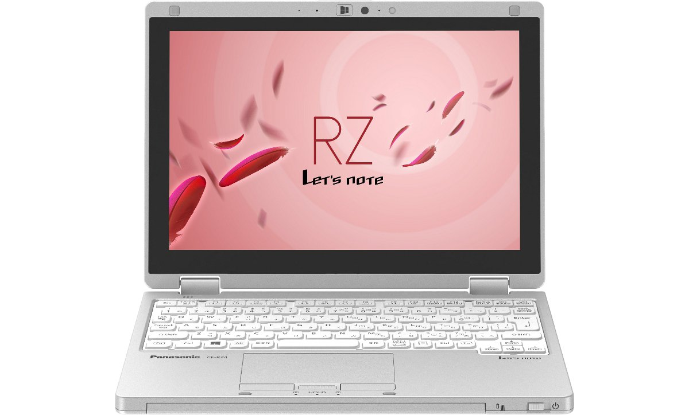
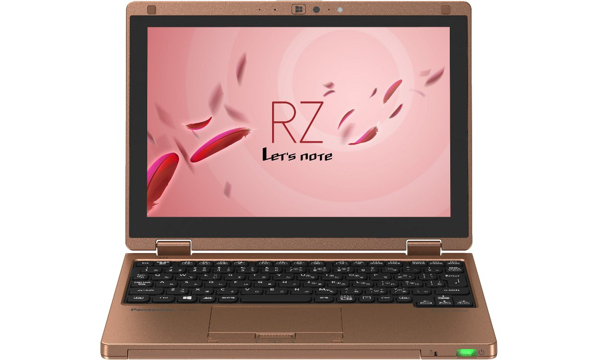

# 松下 Let's note CF-RZ4 规格参数

[English](../../en/CF-RZ4/) · [日本語](../../ja/CF-RZ4/) · **中文**

🗄️ 在 [Let's note 陈列柜](https://letsnote-specs.github.io/zh/CF-RZ4/)中查看此机型

**CF-RZ4** 是松下 Let's note 笔记本电脑，属于 RZ 系列，配备 10.1英寸 WUXGA 屏幕。本页收录其全部 16 个型号（2014-10 – 2015-06 发售）的规格参数。每个型号均附官方规格表链接。

*松下 Let's note CF-RZ4（CF-RZ4LDDJR, CF-RZ4LDFJR, CF-RZ4LFDJR, CF-RZ4DDLBR …），银色。图片 © Panasonic*

## 型号列表

| 型号（品番） | 发售 | 停产 | 主要规格 |
| :-- | :-- | :-- | :-- |
| [CF-RZ4LDDJR](https://panasonic.jp/pc/p-db/CF-RZ4LDDJR_spec.html) | 2015-06 | 2016-02 | Windows 8.1 Update 64位、英特尔® CoreTM M-5Y10c 处理器、内存：4GB（无扩展插槽）、SSD：128GB、LAN、无线LAN 802.11a(W52/W53/W56)/b/g/n/ac |
| [CF-RZ4LDFJR](https://panasonic.jp/pc/p-db/CF-RZ4LDFJR_spec.html) | 2015-06 | 2016-02 | Windows 8.1 Update 64位、英特尔® CoreTM M-5Y10c 处理器、内存：4GB（无扩展插槽）、SSD：128GB、LAN、无线LAN 802.11a(W52/W53/W56)/b/g/n/ac、Microsoft® Office Home and Business Premium |
| [CF-RZ4LFDJR](https://panasonic.jp/pc/p-db/CF-RZ4LFDJR_spec.html) | 2015-06 | 2016-02 | Windows 8.1 Update 64位、英特尔® CoreTM M-5Y10c 处理器、内存：4GB（无扩展插槽）、SSD：128GB、LAN、无线LAN 802.11a(W52/W53/W56)/b/g/n/ac、支持 Xi（LTE）的无线WAN |
| [CF-RZ4LDEJR](https://panasonic.jp/pc/p-db/CF-RZ4LDEJR_spec.html) | 2015-06 | 2016-02 | Windows 8.1 Pro Update 64位、Intel® CoreTM M-5Y10c 处理器、内存：4GB（无扩展插槽）、SSD：128GB、LAN、无线LAN 802.11a(W52/W53/W56)/b/g/n/ac、Microsoft® Office Home and Business Premium |
| [CF-RZ4DDLBR](https://panasonic.jp/pc/p-db/CF-RZ4DDLBR_spec.html) | 2015-06 | 2016-02 | Windows 8.1 Pro Update 64位、Intel® CoreTM M-5Y71 vProTM 处理器、内存：8GB（无扩展插槽）、SSD：256GB、LAN、无线LAN 802.11a(W52/W53/W56)/b/g/n/ac、Microsoft® Office Home and Business Premium |
| [CF-RZ4DFMBR](https://panasonic.jp/pc/p-db/CF-RZ4DFMBR_spec.html) | 2015-06 | 2016-02 | Windows 8.1 Pro Update 64位、Intel® CoreTM M-5Y71 vProTM 处理器、内存：8GB（无扩展插槽）、SSD：256GB、LAN、无线LAN 802.11a（W52/W53/W56）/b/g/n/ac、支持Xi（LTE）的无线WAN、Microsoft® Office Home and Business Premium |
| [CF-RZ4JDDJR](https://panasonic.jp/pc/p-db/CF-RZ4JDDJR_spec.html) | 2015-02 | 2015-11 | Windows 8.1 Update 64位、英特尔® CoreTM M-5Y31 处理器、内存：4GB（无扩展插槽）、SSD：128GB、LAN、无线LAN 802.11a(W52/W53/W56)/b/g/n/ac |
| [CF-RZ4JDFJR](https://panasonic.jp/pc/p-db/CF-RZ4JDFJR_spec.html) | 2015-02 | 2015-11 | Windows 8.1 Update 64位、英特尔® CoreTM M-5Y31 处理器、内存：4GB（无扩展插槽）、SSD：128GB、LAN、无线LAN 802.11a(W52/W53/W56)/b/g/n/ac、Microsoft® Office Home and Business Premium |
| [CF-RZ4JDEJR](https://panasonic.jp/pc/p-db/CF-RZ4JDEJR_spec.html) | 2015-02 | 2015-11 | Windows 8.1 Update 64位、英特尔® CoreTM M-5Y31 处理器、内存：4GB（无扩展插槽）、SSD：128GB、LAN、无线LAN 802.11a(W52/W53/W56)/b/g/n/ac、Microsoft® Office Home and Business Premium |
| [CF-RZ4JDLBR](https://panasonic.jp/pc/p-db/CF-RZ4JDLBR_spec.html) | 2015-02 | 2015-11 | Windows 8.1 Pro Update 64位、Intel® CoreTM M-5Y31 处理器、内存：8GB（无扩展插槽）、SSD：256GB、LAN、无线LAN 802.11a(W52/W53/W56)/b/g/n/ac、Microsoft® Office Home and Business Premium |
| [CF-RZ4JDMBR](https://panasonic.jp/pc/p-db/CF-RZ4JDMBR_spec.html) | 2015-02 | 2015-11 | Windows 8.1 Pro Update 64位、Intel® CoreTM M-5Y31 处理器、内存：8GB（无扩展插槽）、SSD：256GB、LAN、无线LAN 802.11a(W52/W53/W56)/b/g/n/ac、Microsoft® Office Home and Business Premium |
| [CF-RZ4CDDJR](https://panasonic.jp/pc/p-db/CF-RZ4CDDJR_spec.html) | 2014-10 | 2015-06 | Windows 8.1 Update 64位、英特尔® CoreTM M-5Y10 处理器、内存：4GB（无扩展插槽）、SSD：128GB、LAN、无线LAN 802.11a(W52/W53/W56)/b/g/n/ac |
| [CF-RZ4CDFJR](https://panasonic.jp/pc/p-db/CF-RZ4CDFJR_spec.html) | 2014-10 | 2015-06 | Windows 8.1 Update 64位、英特尔® CoreTM M-5Y10 处理器、内存：4GB（无扩展插槽）、SSD：128GB、LAN、无线LAN 802.11a(W52/W53/W56)/b/g/n/ac、Microsoft® Office Home and Business Premium |
| [CF-RZ4CDEJR](https://panasonic.jp/pc/p-db/CF-RZ4CDEJR_spec.html) | 2014-10 | 2015-06 | Windows 8.1 Update 64位、英特尔® CoreTM M-5Y10 处理器、内存：4GB（无扩展插槽）、SSD：128GB、LAN、无线LAN 802.11a(W52/W53/W56)/b/g/n/ac、Microsoft® Office Home and Business Premium |
| [CF-RZ4CDLBR](https://panasonic.jp/pc/p-db/CF-RZ4CDLBR_spec.html) | 2014-10 | 2015-06 | Windows 8.1 Pro Update 64位、Intel® CoreTM M-5Y10 处理器、内存：8GB（无扩展插槽）、SSD：256GB、LAN、无线LAN 802.11a(W52/W53/W56)/b/g/n/ac、Microsoft® Office Home and Business Premium |
| [CF-RZ4CDMBR](https://panasonic.jp/pc/p-db/CF-RZ4CDMBR_spec.html) | 2014-10 | 2015-06 | Windows 8.1 Pro Update 64位、英特尔® CoreTM M-5Y10 处理器、内存：8GB（无扩展插槽）、SSD：256GB、LAN、无线LAN 802.11a(W52/W53/W56)/b/g/n/ac、Microsoft® Office Home and Business Premium |

## 通用规格

| 项目 | 规格 |
| :-- | :-- |
| 显示屏 / 显卡 | 英特尔 HD 显卡 5300（集成于CPU） |
| 显示屏 / 色彩 | 1920×1200像素：约1677万色 |
| 显示屏 / 外接显示输出 | 1024×768、1280×768、1280×1024、1360×768、1366×768、1400×1050、1600×900、1600×1200、1680×1050、1920×1080、1920×1200像素：约1677万色 |
| 无线通信模块 | 英特尔 Dual Band Wireless-AC 7265 |
| 无线网络 | 符合IEEE802.11a（W52/W53/W56）/b/g/n/ac |
| 有线网络 | 1000BASE-T/100BASE-TX/10BASE-T |
| 音频 | PCM音源（24位立体声）、英特尔 High Definition Audio标准、单声道扬声器 |
| 麦克风 | 阵列麦克风 |
| 传感器 | 照度传感器 / 地磁传感器 / 陀螺仪传感器 / 加速度传感器 |
| 键盘 | 符合OADG标准86键、键距16.8mm（横向）/14.2mm（纵向）（部分键除外） |
| 电源 | ▼AC适配器 / 输入：AC100V～240V、50Hz/60Hz，输出：DC16V、2.8A，电源线为100V专用 / ▼电池组 / 7.6V（锂离子）标称容量4860mAh、额定容量4740mAh |
| 功耗 | 最大约45W |
| 能效达成率（2011 年度标准） | — |
| 尺寸（宽×深×高） | 宽250mm × 深180.8mm × 高19.5mm (不含突起部) |

## 各型号差异

| 型号（品番） | 处理器 | 内存 | 存储 | 重量 | 续航 |
| :-- | :-- | :-- | :-- | :-- | :-- |
| CF-RZ4LDDJR | Core M-5Y10c | 4GB LPDDR3 SDRAM | 128GB | 0.745 kg | 10 h |
| CF-RZ4LDFJR | Core M-5Y10c | 4GB LPDDR3 SDRAM | 128GB | 0.745 kg | 10 h |
| CF-RZ4LFDJR | Core M-5Y10c | 4GB LPDDR3 SDRAM | 128GB | 0.770 kg | 10 h |
| CF-RZ4LDEJR | Core M-5Y10c | 4GB LPDDR3 SDRAM | 128GB | 0.745 kg | 10 h |
| CF-RZ4DDLBR | Core M-5Y71 vPro | 8GB LPDDR3 SDRAM | 256GB | 0.745 kg | 10 h |
| CF-RZ4DFMBR | Core M-5Y71 vPro | 8GB LPDDR3 SDRAM | 256GB | 0.770 kg | 10 h |
| CF-RZ4JDDJR | Core M-5Y31 | 4GB LPDDR3 SDRAM | 128GB | 0.745 kg | 10 h |
| CF-RZ4JDFJR | Core M-5Y31 | 4GB LPDDR3 SDRAM | 128GB | 0.745 kg | 10 h |
| CF-RZ4JDEJR | Core M-5Y31 | 4GB LPDDR3 SDRAM | 128GB | 0.745 kg | 10 h |
| CF-RZ4JDLBR | Core M-5Y31 | 8GB LPDDR3 SDRAM | 256GB | 0.745 kg | 10 h |
| CF-RZ4JDMBR | Core M-5Y31 | 8GB LPDDR3 SDRAM | 256GB | 0.745 kg | 10 h |
| CF-RZ4CDDJR | Core M-5Y10 | 4GB LPDDR3 SDRAM | 128GB | 0.745 kg | 10 h |
| CF-RZ4CDFJR | Core M-5Y10 | 4GB LPDDR3 SDRAM | 128GB | 0.745 kg | 10 h |
| CF-RZ4CDEJR | Core M-5Y10 | 4GB LPDDR3 SDRAM | 128GB | 0.745 kg | 10 h |
| CF-RZ4CDLBR | Core M-5Y10 | 8GB LPDDR3 SDRAM | 256GB | 0.745 kg | 10 h |
| CF-RZ4CDMBR | Core M-5Y10 | 8GB LPDDR3 SDRAM | 256GB | 0.745 kg | 10 h |

CF-RZ4LDDJR 的全部差异规格

| 项目 | 规格 |
| :-- | :-- |
| 操作系统 | Windows 8.1 Update 64位（日语版） |
| 处理器 | 英特尔Core M-5Y10c 处理器 / 英特尔智能缓存4MB，工作频率0.80GHz（使用英特尔 睿频加速技术2.0时最高2.00GHz） |
| 芯片组 | 内置于CPU |
| 内存 | 4GB LPDDR3 SDRAM（空余插槽0） |
| 显存 | 最大1993MB（与主内存共享） |
| 固态硬盘 | 闪存驱动器（SSD）128GB（Serial ATA）上述容量中约16GB用作恢复区域、约1GB用作系统区域（用户不可使用） |
| 显示屏 | 10.1英寸(16:10) WUXGA TFT彩色IPS液晶 （1920×1200像素）、静电触摸面板、附防眩光保护膜 |
| 显示屏 / 同时显示 | 1024×768、1280×768、1280×1024、1360×768、1366×768、1400×1050、1600×900、1600×1200、1680×1050、1920×1080、1920×1200像素：约1677万色 |
| 蓝牙 | Bluetooth v4.0 / ■支持配置文件 / 【Classic】 / ・A2DP（Source） / ・AVRCP（Target） / ・HCRP（Client） / ・HFP（AG） / ・HID（Host） / ・OPP（Client和Server） / ・PAN（User） / ・SPP（DevA和DevB） / 【Low Energy】 / ・HOGP（Host） |
| SD 卡槽 | SD存储卡×1插槽（支持SDHC存储卡/SDXC存储卡/支持UHS-II、UHS-I高速传输/支持版权保护技术） |
| 摄像头 | 有效像素：最大1920×1080像素（约207万像素） |
| 接口 | ・LAN接口（RJ-45） / ・外接显示器接口（模拟RGB 迷你D-sub 15针） / ・HDMI输出端子 / ・耳麦端子（麦克风输入＋音频输出）（耳麦迷你插孔M3） / ・USB3.0端口×3（其中1个兼作USB充电端口） |
| 指点设备 | 静电触摸面板（液晶）/触控板 |
| 能效 | 2011年度基准 S类别0.030 |
| 续航 / 充电时间 | ▼续航时间： / （JEITA Ver.2.0）约10小时 / ▼充电时间： / 约2.5小时（电源ON时/OFF时均） |
| 颜色 | 银色 |
| 重量（含电池） | 电脑主机：约0.745kg、AC适配器：约0.185kg（不含壁挂插头（约0.02kg）电源线（约0.06 kg）） |
| 预装软件 | ・Microsoft Internet Explorer 11 / ・网络选择器Lite / ・Intel PROSet/Wireless Software for Bluetooth Technology / ・安全设置实用程序 / ・McAfee LiveSafe / ・i-Filter 6.0 (30天免费试用版)) / ・Adobe Reader / ・WinZip 18.5日文版（45天体验版） / ・HOLD模式设置实用程序 / ・触摸操作帮助实用程序 / ・电源计划扩展实用程序 / ・峰移控制实用程序 / ・Wireless Manager mobile edition / ・Intel WiDi / ・USB充电设置实用程序 / ・摄像头实用程序 / ・Camera for Panasonic PC / ・画面旋转工具 / ・Aptio设置实用程序 / ・PC-Diagnostic实用程序 / ・Dashboard for Panasonic PC / ・无线诊断实用程序 / ・恢复光盘创建实用程序 / ・硬盘数据擦除实用程序 / ・DirectX 11.2 / ・英特尔 PROSet/Wireless Software / ・英特尔My WiFi技术 / ・Skype / ・NAVITIME / ・触摸面板模式设置实用程序 / ・手写工具2 / ・Adobe Reader Touch / ・Bing翻译 / ・屏幕共享辅助实用程序 / ・触摸板误动作防止实用程序 |
| 附件 | 带壁挂插头的AC适配器、电池组、使用说明书、专用布 |

官方规格表: <https://panasonic.jp/pc/p-db/CF-RZ4LDDJR_spec.html>

CF-RZ4LDFJR 的全部差异规格

| 项目 | 规格 |
| :-- | :-- |
| 操作系统 | Windows 8.1 Update 64位（日语版） |
| 处理器 | 英特尔Core M-5Y10c 处理器 / 英特尔智能缓存4MB，工作频率0.80GHz（使用英特尔 睿频加速技术2.0时最高2.00GHz） |
| 芯片组 | 内置于CPU |
| 内存 | 4GB LPDDR3 SDRAM（空余插槽0） |
| 显存 | 最大1993MB（与主内存共享） |
| 固态硬盘 | 闪存驱动器（SSD）128GB（Serial ATA）上述容量中约16GB用作恢复区域、约1GB用作系统区域（用户不可使用） |
| 显示屏 | 10.1英寸(16:10) WUXGA TFT彩色IPS液晶 （1920×1200像素）、静电触摸面板、附防眩光保护膜 |
| 显示屏 / 同时显示 | 1024×768、1280×768、1280×1024、1360×768、1366×768、1400×1050、1600×900、1600×1200、1680×1050、1920×1080、1920×1200像素：约1677万色 |
| 蓝牙 | Bluetooth v4.0 / ■支持配置文件 / 【Classic】 / ・A2DP（Source） / ・AVRCP（Target） / ・HCRP（Client） / ・HFP（AG） / ・HID（Host） / ・OPP（Client和Server） / ・PAN（User） / ・SPP（DevA和DevB） / 【Low Energy】 / ・HOGP（Host） |
| SD 卡槽 | SD存储卡×1插槽（支持SDHC存储卡/SDXC存储卡/支持UHS-II、UHS-I高速传输/支持版权保护技术） |
| 摄像头 | 有效像素：最大1920×1080像素（约207万像素） |
| 接口 | ・LAN接口（RJ-45） / ・外接显示器接口（模拟RGB 迷你D-sub 15针） / ・HDMI输出端子 / ・耳麦端子（麦克风输入＋音频输出）（耳麦迷你插孔M3） / ・USB3.0端口×3（其中1个兼作USB充电端口） |
| 指点设备 | 静电触摸面板（液晶）/触控板 |
| 能效 | 2011年度基准 S类别0.030 |
| 续航 / 充电时间 | ▼续航时间： / （JEITA Ver.2.0）约10小时 / ▼充电时间： / 约2.5小时（电源ON时/OFF时均） |
| 颜色 | 银色 |
| 重量（含电池） | 电脑主机：约0.745kg、AC适配器：约0.185kg（不含壁挂插头（约0.02kg）电源线（约0.06 kg）） |
| 预装软件 | ・Microsoft Internet Explorer 11 / ・网络选择器Lite / ・Intel PROSet/Wireless Software for Bluetooth Technology / ・安全设置实用程序 / ・McAfee LiveSafe / ・i-Filter 6.0 ((30天免费试用版) / ・Adobe Reader / ・WinZip 18.5日文版（45天体验版） / ・HOLD模式设置实用程序 / ・触摸操作帮助实用程序 / ・电源计划扩展实用程序 / ・峰移控制实用程序 / ・Wireless Manager mobile edition / ・Intel WiDi / ・USB充电设置实用程序 / ・摄像头实用程序 / ・Camera for Panasonic PC / ・画面旋转工具 / ・Aptio设置实用程序 / ・PC-Diagnostic实用程序 / ・Dashboard for Panasonic PC / ・无线诊断实用程序 / ・恢复光盘创建实用程序 / ・硬盘数据擦除实用程序 / ・DirectX 11.2 / ・英特尔 PROSet/Wireless Software / ・英特尔My WiFi技术 / ・Skype / ・NAVITIME / ・触摸面板模式设置实用程序 / ・手写工具2 / ・Adobe Reader Touch / ・Bing翻译 / ・屏幕共享辅助实用程序 / ・触摸板误动作防止实用程序 |
| 附件 | 带壁挂插头的AC适配器、电池组、使用说明书、专用布、Microsoft Office Home & Business Premium |
| Microsoft Office | Microsoft Office Home & Business Premium |

官方规格表: <https://panasonic.jp/pc/p-db/CF-RZ4LDFJR_spec.html>

CF-RZ4LFDJR 的全部差异规格

| 项目 | 规格 |
| :-- | :-- |
| 操作系统 | Windows 8.1 Update 64位（日语版） |
| 处理器 | 英特尔Core M-5Y10c 处理器 / 英特尔智能缓存4MB，工作频率0.80GHz（使用英特尔 睿频加速技术2.0时最高2.00GHz） |
| 芯片组 | 内置于CPU |
| 内存 | 4GB LPDDR3 SDRAM（空余插槽0） |
| 显存 | 最大1993MB（与主内存共享） |
| 固态硬盘 | 闪存驱动器（SSD）128GB（Serial ATA）上述容量中约16GB用作恢复区域、约1GB用作系统区域（用户不可使用） |
| 显示屏 | 10.1英寸(16:10) WUXGA TFT彩色IPS液晶 （1920×1200像素）、静电触摸面板、附防眩光保护膜 |
| 显示屏 / 同时显示 | 1024×768、1280×768、1280×1024、1360×768、1366×768、1400×1050、1600×900、1600×1200、1680×1050、1920×1080、1920×1200像素：约1677万色 |
| 蓝牙 | Bluetooth v4.0 / ■支持配置文件 / 【Classic】 / ・A2DP（Source） / ・AVRCP（Target） / ・HCRP（Client） / ・HFP（AG） / ・HID（Host） / ・OPP（Client和Server） / ・PAN（User） / ・SPP（DevA和DevB） / 【Low Energy】 / ・HOGP（Host） |
| 摄像头 | 有效像素：最大1920×1080像素（约207万像素） |
| 接口 | ・LAN接口（RJ-45） / ・外接显示器接口（模拟RGB 迷你D-sub 15针） / ・HDMI输出端子 / ・耳麦端子（麦克风输入＋音频输出）（耳麦迷你插孔M3） / ・USB3.0端口×3（其中1个兼作USB充电端口） |
| 指点设备 | 静电触摸面板（液晶）/触控板 |
| 能效 | 2011年度基准 S类别0.030 |
| 续航 / 充电时间 | ▼续航时间： / （JEITA Ver.2.0）约10小时 / ▼充电时间： / 约2.5小时（电源ON时/OFF时均） |
| 颜色 | 银色 |
| 重量（含电池） | 电脑主机：约0.770kg，AC适配器：约0.185kg（不含壁挂式插头（约0.02kg）和电源线（约0.06 kg）） |
| 预装软件 | ・Microsoft Internet Explorer 11 / ・网络选择器Lite / ・Intel PROSet/Wireless Software for Bluetooth Technology / ・安全设置实用程序 / ・McAfee LiveSafe / ・i-Filter 6.0 (30天免费试用版)) / ・Adobe Reader / ・WinZip 18.5日文版（45天体验版） / ・HOLD模式设置实用程序 / ・触摸操作帮助实用程序 / ・电源计划扩展实用程序 / ・峰移控制实用程序 / ・Wireless Manager mobile edition / ・Intel WiDi / ・USB充电设置实用程序 / ・摄像头实用程序 / ・Camera for Panasonic PC / ・画面旋转工具 / ・Aptio设置实用程序 / ・PC-Diagnostic实用程序 / ・Dashboard for Panasonic PC / ・无线诊断实用程序 / ・恢复光盘创建实用程序 / ・硬盘数据擦除实用程序 / ・DirectX 11.2 / ・英特尔 PROSet/Wireless Software / ・英特尔My WiFi技术 / ・Skype / ・NAVITIME / ・触摸面板模式设置实用程序 / ・手写工具2 / ・Adobe Reader Touch / ・Bing翻译 / ・屏幕共享辅助实用程序 / ・触摸板误动作防止实用程序 |
| 附件 | 带壁挂插头的AC适配器、电池组、使用说明书、专用布 |
| LTE | 内置无线WAN模块（支持Xi(LTE)） |
| 卡槽 / SD 卡 | SD存储卡×1插槽（支持SDHC存储卡/SDXC存储卡/支持UHS-II、UHS-I高速传输/支持版权保护技术） |
| 卡槽 / 其他 | docomo UIM卡（标准尺寸） |

官方规格表: <https://panasonic.jp/pc/p-db/CF-RZ4LFDJR_spec.html>

CF-RZ4LDEJR 的全部差异规格

| 项目 | 规格 |
| :-- | :-- |
| 操作系统 | Windows 8.1 Update 64位（日语版） |
| 处理器 | 英特尔Core M-5Y10c 处理器 / 英特尔智能缓存4MB，工作频率0.80GHz（使用英特尔 睿频加速技术2.0时最高2.00GHz） |
| 芯片组 | 内置于CPU |
| 内存 | 4GB LPDDR3 SDRAM（空余插槽0） |
| 显存 | 最大1993MB（与主内存共享） |
| 固态硬盘 | 闪存驱动器（SSD）128GB（Serial ATA）上述容量中约16GB用作恢复区域、约1GB用作系统区域（用户不可使用） |
| 显示屏 | 10.1英寸(16:10) WUXGA TFT彩色IPS液晶 （1920×1200像素）、静电触摸面板、附防眩光保护膜 |
| 显示屏 / 同时显示 | 1024×768、1280×768、1280×1024、1360×768、1366×768、1400×1050、1600×900、1600×1200、1680×1050、1920×1080、1920×1200像素：约1677万色 |
| 蓝牙 | Bluetooth v4.0 / ■支持配置文件 / 【Classic】 / ・A2DP（Source） / ・AVRCP（Target） / ・HCRP（Client） / ・HFP（AG） / ・HID（Host） / ・OPP（Client和Server） / ・PAN（User） / ・SPP（DevA和DevB） / 【Low Energy】 / ・HOGP（Host） |
| SD 卡槽 | SD存储卡×1插槽（支持SDHC存储卡/SDXC存储卡/支持UHS-II、UHS-I高速传输/支持版权保护技术） |
| 摄像头 | 有效像素：最大1920×1080像素（约207万像素） |
| 接口 | ・LAN接口（RJ-45） / ・外接显示器接口（模拟RGB 迷你D-sub 15针） / ・HDMI输出端子 / ・耳麦端子（麦克风输入＋音频输出）（耳麦迷你插孔M3） / ・USB3.0端口×3（其中1个兼作USB充电端口） |
| 指点设备 | 静电触摸面板（液晶）/触控板 |
| 能效 | 2011年度基准 S类别0.030 |
| 续航 / 充电时间 | ▼续航时间： / （JEITA Ver.2.0）约10小时 / ▼充电时间： / 约2.5小时（电源ON时/OFF时均） |
| 颜色 | 蓝色&铜色 |
| 重量（含电池） | 电脑主机：约0.745kg、AC适配器：约0.185kg（不含壁挂插头（约0.02kg）电源线（约0.06 kg）） |
| 预装软件 | ・Microsoft Internet Explorer 11 / ・网络选择器Lite / ・Intel PROSet/Wireless Software for Bluetooth Technology / ・安全设置实用程序 / ・McAfee LiveSafe / ・i-Filter 6.0 (30天体验版) / ・Adobe Reader / ・WinZip 18.5日文版（45天体验版） / ・HOLD模式设置实用程序 / ・触摸操作帮助实用程序 / ・电源计划扩展实用程序 / ・峰移控制实用程序 / ・Wireless Manager mobile edition / ・Intel WiDi / ・USB充电设置实用程序 / ・摄像头实用程序 / ・Camera for Panasonic PC / ・画面旋转工具 / ・Aptio设置实用程序 / ・PC-Diagnostic实用程序 / ・Dashboard for Panasonic PC / ・无线诊断实用程序 / ・恢复光盘创建实用程序 / ・硬盘数据擦除实用程序 / ・DirectX 11.2 / ・英特尔 PROSet/Wireless Software / ・英特尔My WiFi技术 / ・Skype / ・NAVITIME / ・触摸面板模式设置实用程序 / ・手写工具2 / ・Adobe Reader Touch / ・Bing翻译 / ・屏幕共享辅助实用程序 / ・触摸板误动作防止实用程序 |
| 附件 | 带壁挂插头的AC适配器、电池组、使用说明书、专用布、Microsoft Office Home & Business Premium |
| Microsoft Office | Microsoft Office Home & Business Premium |

官方规格表: <https://panasonic.jp/pc/p-db/CF-RZ4LDEJR_spec.html>

CF-RZ4DDLBR 的全部差异规格

| 项目 | 规格 |
| :-- | :-- |
| 操作系统 | Windows 8.1 Pro Update 64位（日语版） |
| 处理器 | 英特尔Core M-5Y71 vPro处理器 / 英特尔智能缓存4MB，工作频率1.20GHz（使用英特尔 睿频加速技术2.0时最高2.90GHz） |
| 芯片组 | 内置于CPU |
| 内存 | 8GB LPDDR3 SDRAM（空余插槽0） |
| 显存 | 最大3839MB（与主内存共享） |
| 固态硬盘 | 闪存驱动器（SSD）256GB（Serial ATA）上述容量中约16GB用作恢复区域、约1GB用作系统区域（用户不可使用） |
| 显示屏 | 10.1英寸(16:10) WUXGA TFT彩色IPS液晶 （1920×1200像素）、静电触摸面板、附防眩光保护膜 |
| 显示屏 / 同时显示 | 1024×768、1280×768、1280×1024、1360×768、1366×768、1400×1050、1600×900、1600×1200、1680×1050、1920×1080、1920×1200像素：约1677万色 |
| 蓝牙 | Bluetooth v4.0 / ■支持配置文件 / 【Classic】 / ・A2DP（Source） / ・AVRCP（Target） / ・HCRP（Client） / ・HFP（AG） / ・HID（Host） / ・OPP（Client和Server） / ・PAN（User） / ・SPP（DevA和DevB） / 【Low Energy】 / ・HOGP（Host） |
| SD 卡槽 | SD存储卡×1插槽（支持SDHC存储卡/SDXC存储卡/支持UHS-II、UHS-I高速传输/支持版权保护技术） |
| 摄像头 | 有效像素：最大1920×1080像素（约207万像素） |
| 接口 | ・LAN接口（RJ-45） / ・外接显示器接口（模拟RGB 迷你D-sub 15针） / ・HDMI输出端子 / ・耳麦端子（麦克风输入＋音频输出）（耳麦迷你插孔M3） / ・USB3.0端口×3（其中1个兼作USB充电端口） |
| 指点设备 | 静电触摸面板（液晶）/触控板 |
| 能效 | 2011年度标准 N分类0.022 |
| 续航 / 充电时间 | ▼续航时间： / （JEITA Ver.2.0）约10小时 / ▼充电时间： / 约2.5小时（电源ON时/OFF时均） |
| 颜色 | 银色 |
| 重量（含电池） | 电脑主机：约0.745kg、AC适配器：约0.185kg（不含壁挂插头（约0.02kg）电源线（约0.06 kg）） |
| 预装软件 | ・Microsoft Internet Explorer 11 / ・网络选择器Lite / ・Intel PROSet/Wireless Software for Bluetooth Technology / ・安全设置实用程序 / ・McAfee LiveSafe / ・i-Filter 6.0 (30天免费试用版) / ・Adobe Reader / ・WinZip 18.5日文版（45天体验版） / ・HOLD模式设置实用程序 / ・触摸操作帮助实用程序 / ・电源计划扩展实用程序 / ・峰移控制实用程序 / ・Wireless Manager mobile edition / ・Intel WiDi / ・USB充电设置实用程序 / ・摄像头实用程序 / ・Camera for Panasonic PC / ・画面旋转工具 / ・Aptio设置实用程序 / ・PC-Diagnostic实用程序 / ・Dashboard for Panasonic PC / ・无线诊断实用程序 / ・恢复光盘创建实用程序 / ・硬盘数据擦除实用程序 / ・DirectX 11.2 / ・英特尔 PROSet/Wireless Software / ・英特尔My WiFi技术 / ・Skype / ・NAVITIME / ・触摸面板模式设置实用程序 / ・手写工具2 / ・Adobe Reader Touch / ・Bing翻译 / ・屏幕共享辅助实用程序 / ・触摸板误动作防止实用程序 |
| 附件 | 带壁挂插头的AC适配器、电池组、使用说明书、专用布、Microsoft Office Home & Business Premium |
| Microsoft Office | Microsoft Office Home & Business Premium |
| 安全芯片 | TPM（符合 TCG V1.2） |

官方规格表: <https://panasonic.jp/pc/p-db/CF-RZ4DDLBR_spec.html>

CF-RZ4DFMBR 的全部差异规格

| 项目 | 规格 |
| :-- | :-- |
| 操作系统 | Windows 8.1 Pro Update 64位（日语版） |
| 处理器 | 英特尔Core M-5Y71 vPro处理器 / 英特尔智能缓存4MB，工作频率1.20GHz（使用英特尔 睿频加速技术2.0时最高2.90GHz） |
| 芯片组 | 内置于CPU |
| 内存 | 8GB LPDDR3 SDRAM（空余插槽0） |
| 显存 | 最大3839MB（与主内存共享） |
| 固态硬盘 | 闪存驱动器（SSD）256GB（Serial ATA）上述容量中约16GB用作恢复区域、约1GB用作系统区域（用户不可使用） |
| 显示屏 | 10.1英寸(16:10) WUXGA TFT彩色IPS液晶 （1920×1200像素）、静电触摸面板、附防眩光保护膜 |
| 显示屏 / 同时显示 | 1024×768、1280×768、1280×1024、1360×768、1366×768、1400×1050、1600×900、1600×1200、1680×1050、1920×1080、1920×1200像素：约1677万色 |
| 蓝牙 | Bluetooth v4.0 / ■支持配置文件 / 【Classic】 / ・A2DP（Source） / ・AVRCP（Target） / ・HCRP（Client） / ・HFP（AG） / ・HID（Host） / ・OPP（Client和Server） / ・PAN（User） / ・SPP（DevA和DevB） / 【Low Energy】 / ・HOGP（Host） |
| SD 卡槽 | SD存储卡×1插槽（支持SDHC存储卡/SDXC存储卡/支持UHS-II、UHS-I高速传输/支持版权保护技术） |
| 摄像头 | 有效像素：最大1920×1080像素（约207万像素） |
| 接口 | ・LAN接口（RJ-45） / ・外接显示器接口（模拟RGB 迷你D-sub 15针） / ・HDMI输出端子 / ・耳麦端子（麦克风输入＋音频输出）（耳麦迷你插孔M3） / ・USB3.0端口×3（其中1个兼作USB充电端口） |
| 指点设备 | 静电触摸面板（液晶）/触控板 |
| 能效 | 2011年度标准 N分类0.022 |
| 续航 / 充电时间 | ▼续航时间： / （JEITA Ver.2.0）约10小时 / ▼充电时间： / 约2.5小时（电源ON时/OFF时均） |
| 颜色 | 暖金色＆铜色 |
| 重量（含电池） | 电脑主机：约0.770kg，AC适配器：约0.185kg（不含壁挂式插头（约0.02kg）和电源线（约0.06 kg）） |
| 预装软件 | ・Microsoft Internet Explorer 11 / ・网络选择器Lite / ・Intel PROSet/Wireless Software for Bluetooth Technology / ・安全设置实用程序 / ・McAfee LiveSafe / ・i-Filter 6.0 (30天免费试用版) / ・Adobe Reader / ・WinZip 18.5日文版（45天体验版） / ・HOLD模式设置实用程序 / ・触摸操作帮助实用程序 / ・电源计划扩展实用程序 / ・峰移控制实用程序 / ・Wireless Manager mobile edition / ・Intel WiDi / ・USB充电设置实用程序 / ・摄像头实用程序 / ・Camera for Panasonic PC / ・画面旋转工具 / ・Aptio设置实用程序 / ・PC-Diagnostic实用程序 / ・Dashboard for Panasonic PC / ・无线诊断实用程序 / ・恢复光盘创建实用程序 / ・硬盘数据擦除实用程序 / ・DirectX 11.2 / ・英特尔 PROSet/Wireless Software / ・英特尔My WiFi技术 / ・Skype / ・NAVITIME / ・触摸面板模式设置实用程序 / ・手写工具2 / ・Adobe Reader Touch / ・Bing翻译 / ・屏幕共享辅助实用程序 / ・触摸板误动作防止实用程序 |
| 附件 | 带壁挂插头的AC适配器、电池组、使用说明书、专用布、Microsoft Office Home & Business Premium |
| Microsoft Office | Microsoft Office Home & Business Premium |
| LTE | 内置无线WAN模块（支持Xi(LTE)） |
| 安全芯片 | TPM（符合 TCG V1.2） |

官方规格表: <https://panasonic.jp/pc/p-db/CF-RZ4DFMBR_spec.html>

CF-RZ4JDDJR 的全部差异规格

| 项目 | 规格 |
| :-- | :-- |
| 操作系统 | Windows 8.1 Update 64位（日语版） |
| 处理器 | 英特尔Core M-5Y31处理器 / 英特尔智能缓存4MB，工作频率0.9GHz（使用英特尔 睿频加速技术2.0时最高2.4GHz） |
| 内存 | 4GB LPDDR3 SDRAM（无空余插槽） |
| 显存 | 最大1993MB（与主内存共享） |
| 固态硬盘 | 闪存驱动器（SSD）128GB（Serial ATA）上述容量中约16GB用作恢复区域、约1GB用作系统区域（用户不可使用） |
| 显示屏 | 10.1英寸(16:10) WUXGA TFT彩色IPS液晶 （1920×1200像素）、静电触摸面板、附防眩光保护膜 |
| 显示屏 / 同时显示 | 1024×768、1280×768、1280×1024、1360×768、1366×768、1400×1050、1600×900、1600×1200、1680×1050、1920×1080、1920×1200像素：约1677万色 |
| 蓝牙 | Bluetooth v4.0 / ■支持配置文件 / 【Classic】 / ・A2DP（Source） / ・AVRCP（Target） / ・HCRP（Client） / ・HFP（AG） / ・HID（Host） / ・OPP（Client和Server） / ・PAN（User） / ・SPP（DevA和DevB） / 【Low Energy】 / ・HOGP（Host） |
| SD 卡槽 | SD存储卡×1插槽（支持SDHC存储卡/SDXC存储卡/支持UHS-II、UHS-I高速传输/支持版权保护技术） |
| 摄像头 | 有效像素：最大1920×1080像素 |
| 接口 | ・LAN接口（RJ-45） / ・外接显示器接口（模拟RGB 迷你D-sub 15针） / ・HDMI输出端子 / ・耳麦端子（麦克风输入＋音频输出，耳麦迷你插孔M3） / ・USB3.0端口×3（其中1个兼作USB充电端口） |
| 指点设备 | 静电触摸面板（液晶）/触控板 |
| 能效 | 2011年度基准 S类别0.026 |
| 续航 / 充电时间 | ▼续航时间： / （JEITA Ver.2.0）约10小时/（JEITA Ver.1.0）约14小时 / ▼充电时间： / 约2.5小时（电源ON时/OFF时均） |
| 颜色 | 银色 |
| 重量（含电池） | 电脑主机：约0.745kg、AC适配器：约0.185kg（不含壁挂插头（约0.02kg）电源线（约0.06 kg）） |
| 预装软件 | ・Microsoft Internet Explorer 11 / ・网络选择器Lite / ・Intel PROSet/Wireless Software for Bluetooth Technology / ・安全设置实用程序 / ・McAfee LiveSafe / ・i-Filter 6.0 (30天免费试用版)) / ・Adobe Reader / ・WinZip 18.5日文版（45天体验版） / ・HOLD模式设置实用程序 / ・触摸操作帮助实用程序 / ・电源计划扩展实用程序 / ・峰移控制实用程序 / ・Wireless Manager mobile edition / ・Intel WiDi / ・USB充电设置实用程序 / ・摄像头实用程序 / ・Camera for Panasonic PC / ・画面旋转工具 / ・Aptio设置实用程序 / ・PC-Diagnostic实用程序 / ・Dashboard for Panasonic PC / ・无线诊断实用程序 / ・恢复光盘创建实用程序 / ・硬盘数据擦除实用程序 / ・DirectX 11.2 / ・英特尔 PROSet/Wireless Software / ・英特尔My WiFi技术 / ・Skype / ・NAVITIME / ・触摸面板模式设置实用程序 / ・手写工具2 / ・Adobe Reader Touch / ・Bing翻译 / ・屏幕共享辅助实用程序 / ・触摸板误动作防止实用程序 |
| 附件 | 带壁挂插头的AC适配器、电池组、使用说明书、专用布 |

官方规格表: <https://panasonic.jp/pc/p-db/CF-RZ4JDDJR_spec.html>

CF-RZ4JDFJR 的全部差异规格

| 项目 | 规格 |
| :-- | :-- |
| 操作系统 | Windows 8.1 Update 64位（日语版） |
| 处理器 | 英特尔Core M-5Y31处理器 / 英特尔智能缓存4MB，工作频率0.9GHz（使用英特尔 睿频加速技术2.0时最高2.4GHz） |
| 内存 | 4GB LPDDR3 SDRAM（无空余插槽） |
| 显存 | 最大1993MB（与主内存共享） |
| 固态硬盘 | 闪存驱动器（SSD）128GB（Serial ATA）上述容量中约16GB用作恢复区域、约1GB用作系统区域（用户不可使用） |
| 显示屏 | 10.1英寸(16:10) WUXGA TFT彩色IPS液晶 （1920×1200像素）、静电触摸面板、附防眩光保护膜 |
| 显示屏 / 同时显示 | 1024×768、1280×768、1280×1024、1360×768、1366×768、1400×1050、1600×900、1600×1200、1680×1050、1920×1080、1920×1200像素：约1677万色 |
| 蓝牙 | Bluetooth v4.0 / ■支持配置文件 / 【Classic】 / ・A2DP（Source） / ・AVRCP（Target） / ・HCRP（Client） / ・HFP（AG） / ・HID（Host） / ・OPP（Client和Server） / ・PAN（User） / ・SPP（DevA和DevB） / 【Low Energy】 / ・HOGP（Host） |
| SD 卡槽 | SD存储卡×1插槽（支持SDHC存储卡/SDXC存储卡/支持UHS-II、UHS-I高速传输/支持版权保护技术） |
| 摄像头 | 有效像素：最大1920×1080像素 |
| 接口 | ・LAN接口（RJ-45） / ・外接显示器接口（模拟RGB 迷你D-sub 15针） / ・HDMI输出端子 / ・耳麦端子（麦克风输入＋音频输出，耳麦迷你插孔M3） / ・USB3.0端口×3（其中1个兼作USB充电端口） |
| 指点设备 | 静电触摸面板（液晶）/触控板 |
| 能效 | 2011年度基准 S类别0.026 |
| 续航 / 充电时间 | ▼续航时间： / （JEITA Ver.2.0）约10小时/（JEITA Ver.1.0）约14小时 / ▼充电时间： / 约2.5小时（电源ON时/OFF时均） |
| 颜色 | 银色 |
| 重量（含电池） | 电脑主机：约0.745kg、AC适配器：约0.185kg（不含壁挂插头（约0.02kg）电源线（约0.06 kg）） |
| 预装软件 | ・Microsoft Internet Explorer 11 / ・网络选择器Lite / ・Intel PROSet/Wireless Software for Bluetooth Technology / ・安全设置实用程序 / ・McAfee LiveSafe / ・i-Filter 6.0 ((30天免费试用版) / ・Adobe Reader / ・WinZip 18.5日文版（45天体验版） / ・HOLD模式设置实用程序 / ・触摸操作帮助实用程序 / ・电源计划扩展实用程序 / ・峰移控制实用程序 / ・Wireless Manager mobile edition / ・Intel WiDi / ・USB充电设置实用程序 / ・摄像头实用程序 / ・Camera for Panasonic PC / ・画面旋转工具 / ・Aptio设置实用程序 / ・PC-Diagnostic实用程序 / ・Dashboard for Panasonic PC / ・无线诊断实用程序 / ・恢复光盘创建实用程序 / ・硬盘数据擦除实用程序 / ・DirectX 11.2 / ・英特尔 PROSet/Wireless Software / ・英特尔My WiFi技术 / ・Skype / ・NAVITIME / ・触摸面板模式设置实用程序 / ・手写工具2 / ・Adobe Reader Touch / ・Bing翻译 / ・屏幕共享辅助实用程序 / ・触摸板误动作防止实用程序 |
| 附件 | 带壁挂插头的AC适配器、电池组、使用说明书、专用布、Microsoft Office Home & Business Premium |
| Microsoft Office | Microsoft Office Home & Business Premium |

官方规格表: <https://panasonic.jp/pc/p-db/CF-RZ4JDFJR_spec.html>

CF-RZ4JDEJR 的全部差异规格

| 项目 | 规格 |
| :-- | :-- |
| 操作系统 | Windows 8.1 Update 64位（日语版） |
| 处理器 | 英特尔Core M-5Y31处理器 / 英特尔智能缓存4MB，工作频率0.9GHz（使用英特尔 睿频加速技术2.0时最高2.4GHz） |
| 内存 | 4GB LPDDR3 SDRAM（无空余插槽） |
| 显存 | 最大1993MB（与主内存共享） |
| 固态硬盘 | 闪存驱动器（SSD）128GB（Serial ATA）上述容量中约16GB用作恢复区域、约1GB用作系统区域（用户不可使用） |
| 显示屏 | 10.1英寸(16:10) WUXGA TFT彩色IPS液晶 （1920×1200像素）、静电触摸面板、附防眩光保护膜 |
| 显示屏 / 同时显示 | 1024×768、1280×768、1280×1024、1360×768、1366×768、1400×1050、1600×900、1600×1200、1680×1050、1920×1080、1920×1200像素：约1677万色 |
| 蓝牙 | Bluetooth v4.0 / ■支持配置文件 / 【Classic】 / ・A2DP（Source） / ・AVRCP（Target） / ・HCRP（Client） / ・HFP（AG） / ・HID（Host） / ・OPP（Client和Server） / ・PAN（User） / ・SPP（DevA和DevB） / 【Low Energy】 / ・HOGP（Host） |
| SD 卡槽 | SD存储卡×1插槽（支持SDHC存储卡/SDXC存储卡/支持UHS-II、UHS-I高速传输/支持版权保护技术） |
| 摄像头 | 有效像素：最大1920×1080像素 |
| 接口 | ・LAN接口（RJ-45） / ・外接显示器接口（模拟RGB 迷你D-sub 15针） / ・HDMI输出端子 / ・耳麦端子（麦克风输入＋音频输出，耳麦迷你插孔M3） / ・USB3.0端口×3（其中1个兼作USB充电端口） |
| 指点设备 | 静电触摸面板（液晶）/触控板 |
| 能效 | 2011年度基准 S类别0.026 |
| 续航 / 充电时间 | ▼续航时间： / （JEITA Ver.2.0）约10小时/（JEITA Ver.1.0）约14小时 / ▼充电时间： / 约2.5小时（电源ON时/OFF时均） |
| 颜色 | 蓝色&铜色 |
| 重量（含电池） | 电脑主机：约0.745kg、AC适配器：约0.185kg（不含壁挂插头（约0.02kg）电源线（约0.06 kg）） |
| 预装软件 | ・Microsoft Internet Explorer 11 / ・网络选择器Lite / ・Intel PROSet/Wireless Software for Bluetooth Technology / ・安全设置实用程序 / ・McAfee LiveSafe / ・i-Filter 6.0 (30天体验版) / ・Adobe Reader / ・WinZip 18.5日文版（45天体验版） / ・HOLD模式设置实用程序 / ・触摸操作帮助实用程序 / ・电源计划扩展实用程序 / ・峰移控制实用程序 / ・Wireless Manager mobile edition / ・Intel WiDi / ・USB充电设置实用程序 / ・摄像头实用程序 / ・Camera for Panasonic PC / ・画面旋转工具 / ・Aptio设置实用程序 / ・PC-Diagnostic实用程序 / ・Dashboard for Panasonic PC / ・无线诊断实用程序 / ・恢复光盘创建实用程序 / ・硬盘数据擦除实用程序 / ・DirectX 11.2 / ・英特尔 PROSet/Wireless Software / ・英特尔My WiFi技术 / ・Skype / ・NAVITIME / ・触摸面板模式设置实用程序 / ・手写工具2 / ・Adobe Reader Touch / ・Bing翻译 / ・屏幕共享辅助实用程序 / ・触摸板误动作防止实用程序 |
| 附件 | 带壁挂插头的AC适配器、电池组、使用说明书、专用布、Microsoft Office Home & Business Premium |
| Microsoft Office | Microsoft Office Home & Business Premium |

官方规格表: <https://panasonic.jp/pc/p-db/CF-RZ4JDEJR_spec.html>

CF-RZ4JDLBR 的全部差异规格

| 项目 | 规格 |
| :-- | :-- |
| 操作系统 | Windows 8.1 Pro Update 64位（日语版） |
| 处理器 | 英特尔Core M-5Y31处理器 / 英特尔智能缓存4MB，工作频率0.9GHz（使用英特尔 睿频加速技术2.0时最高2.4GHz） |
| 内存 | 8GB LPDDR3 SDRAM（无空余插槽） |
| 显存 | 最大3839MB（与主内存共享） |
| 固态硬盘 | 闪存驱动器（SSD）256GB（Serial ATA）上述容量中约16GB用作恢复区域、约1GB用作系统区域（用户不可使用） |
| 显示屏 | 10.1英寸(16:10) WUXGA TFT彩色IPS液晶 （1920×1200像素）、静电触摸面板、附防眩光保护膜 |
| 显示屏 / 同时显示 | 1024×768、1280×768、1280×1024、1360×768、1366×768、1400×1050、1600×900、1600×1200、1680×1050、1920×1080、1920×1200像素：约1677万色 |
| 蓝牙 | Bluetooth v4.0 / ■支持配置文件 / 【Classic】 / ・A2DP（Source） / ・AVRCP（Target） / ・HCRP（Client） / ・HFP（AG） / ・HID（Host） / ・OPP（Client和Server） / ・PAN（User） / ・SPP（DevA和DevB） / 【Low Energy】 / ・HOGP（Host） |
| SD 卡槽 | SD存储卡×1插槽（支持SDHC存储卡/SDXC存储卡/支持UHS-II、UHS-I高速传输/支持版权保护技术） |
| 摄像头 | 有效像素：最大1920×1080像素 |
| 接口 | ・LAN接口（RJ-45） / ・外接显示器接口（模拟RGB 迷你D-sub 15针） / ・HDMI输出端子 / ・耳麦端子（麦克风输入＋音频输出，耳麦迷你插孔M3） / ・USB3.0端口×3（其中1个兼作USB充电端口） |
| 指点设备 | 静电触摸面板（液晶）/触控板 |
| 能效 | 2011年度标准 N分类0.026 |
| 续航 / 充电时间 | ▼续航时间： / （JEITA Ver.2.0）约10小时/（JEITA Ver.1.0）约14小时 / ▼充电时间： / 约2.5小时（电源ON时/OFF时均） |
| 颜色 | 银色 |
| 重量（含电池） | 电脑主机：约0.745kg、AC适配器：约0.185kg（不含壁挂插头（约0.02kg）电源线（约0.06 kg）） |
| 预装软件 | ・Microsoft Internet Explorer 11 / ・网络选择器Lite / ・Intel PROSet/Wireless Software for Bluetooth Technology / ・安全设置实用程序 / ・McAfee LiveSafe / ・i-Filter 6.0 (30天免费试用版) / ・Adobe Reader / ・WinZip 18.5日文版（45天体验版） / ・HOLD模式设置实用程序 / ・触摸操作帮助实用程序 / ・电源计划扩展实用程序 / ・峰移控制实用程序 / ・Wireless Manager mobile edition / ・Intel WiDi / ・USB充电设置实用程序 / ・摄像头实用程序 / ・Camera for Panasonic PC / ・画面旋转工具 / ・Aptio设置实用程序 / ・PC-Diagnostic实用程序 / ・Dashboard for Panasonic PC / ・无线诊断实用程序 / ・恢复光盘创建实用程序 / ・硬盘数据擦除实用程序 / ・DirectX 11.2 / ・英特尔 PROSet/Wireless Software / ・英特尔My WiFi技术 / ・Skype / ・NAVITIME / ・触摸面板模式设置实用程序 / ・手写工具2 / ・Adobe Reader Touch / ・Bing翻译 / ・屏幕共享辅助实用程序 / ・触摸板误动作防止实用程序 |
| 附件 | 带壁挂插头的AC适配器、电池组、使用说明书、专用布、Microsoft Office Home & Business Premium |
| Microsoft Office | Microsoft Office Home & Business Premium |

官方规格表: <https://panasonic.jp/pc/p-db/CF-RZ4JDLBR_spec.html>

CF-RZ4JDMBR 的全部差异规格

| 项目 | 规格 |
| :-- | :-- |
| 操作系统 | Windows 8.1 Pro Update 64位（日语版） |
| 处理器 | 英特尔Core M-5Y31处理器 / 英特尔智能缓存4MB，工作频率0.9GHz（使用英特尔 睿频加速技术2.0时最高2.4GHz） |
| 内存 | 8GB LPDDR3 SDRAM（无空余插槽） |
| 显存 | 最大3839MB（与主内存共享） |
| 固态硬盘 | 闪存驱动器（SSD）256GB（Serial ATA）上述容量中约16GB用作恢复区域、约1GB用作系统区域（用户不可使用） |
| 显示屏 | 10.1英寸(16:10) WUXGA TFT彩色IPS液晶 （1920×1200像素）、静电触摸面板、附防眩光保护膜 |
| 显示屏 / 同时显示 | 1024×768、1280×768、1280×1024、1360×768、1366×768、1400×1050、1600×900、1600×1200、1680×1050、1920×1080、1920×1200像素：约1677万色 |
| 蓝牙 | Bluetooth v4.0 / ■支持配置文件 / 【Classic】 / ・A2DP（Source） / ・AVRCP（Target） / ・HCRP（Client） / ・HFP（AG） / ・HID（Host） / ・OPP（Client和Server） / ・PAN（User） / ・SPP（DevA和DevB） / 【Low Energy】 / ・HOGP（Host） |
| SD 卡槽 | SD存储卡×1插槽（支持SDHC存储卡/SDXC存储卡/支持UHS-II、UHS-I高速传输/支持版权保护技术） |
| 摄像头 | 有效像素：最大1920×1080像素 |
| 接口 | ・LAN接口（RJ-45） / ・外接显示器接口（模拟RGB 迷你D-sub 15针） / ・HDMI输出端子 / ・耳麦端子（麦克风输入＋音频输出，耳麦迷你插孔M3） / ・USB3.0端口×3（其中1个兼作USB充电端口） |
| 指点设备 | 静电触摸面板（液晶）/触控板 |
| 能效 | 2011年度标准 N分类0.026 |
| 续航 / 充电时间 | ▼续航时间： / （JEITA Ver.2.0）约10小时/（JEITA Ver.1.0）约14小时 / ▼充电时间： / 约2.5小时（电源ON时/OFF时均） |
| 颜色 | 蓝色&铜色 |
| 重量（含电池） | 电脑主机：约0.745kg、AC适配器：约0.185kg（不含壁挂插头（约0.02kg）电源线（约0.06 kg）） |
| 预装软件 | ・Microsoft Internet Explorer 11 / ・网络选择器Lite / ・Intel PROSet/Wireless Software for Bluetooth Technology / ・安全设置实用程序 / ・McAfee LiveSafe / ・i-Filter 6.0 (30天免费试用版) / ・Adobe Reader / ・WinZip 18.5日文版（45天体验版） / ・HOLD模式设置实用程序 / ・触摸操作帮助实用程序 / ・电源计划扩展实用程序 / ・峰移控制实用程序 / ・Wireless Manager mobile edition / ・Intel WiDi / ・USB充电设置实用程序 / ・摄像头实用程序 / ・Camera for Panasonic PC / ・画面旋转工具 / ・Aptio设置实用程序 / ・PC-Diagnostic实用程序 / ・Dashboard for Panasonic PC / ・无线诊断实用程序 / ・恢复光盘创建实用程序 / ・硬盘数据擦除实用程序 / ・DirectX 11.2 / ・英特尔 PROSet/Wireless Software / ・英特尔My WiFi技术 / ・Skype / ・NAVITIME / ・触摸面板模式设置实用程序 / ・手写工具2 / ・Adobe Reader Touch / ・Bing翻译 / ・屏幕共享辅助实用程序 / ・触摸板误动作防止实用程序 |
| 附件 | 带壁挂插头的AC适配器、电池组、使用说明书、专用布、Microsoft Office Home & Business Premium |
| Microsoft Office | Microsoft Office Home & Business Premium |

官方规格表: <https://panasonic.jp/pc/p-db/CF-RZ4JDMBR_spec.html>

CF-RZ4CDDJR 的全部差异规格

| 项目 | 规格 |
| :-- | :-- |
| 操作系统 | Windows 8.1 Update 64位（日语版） |
| 处理器 | 英特尔Core M-5Y10处理器 / 英特尔智能缓存4MB，工作频率0.8GHz（使用英特尔 睿频加速技术2.0时最高2.0GHz） |
| 内存 | 4GB LPDDR3 SDRAM（无空余插槽） |
| 显存 | 最大1993MB（与主内存共享） |
| 固态硬盘 | 闪存驱动器（SSD）128GB（Serial ATA）上述容量中约16GB用作恢复区域、约1GB用作系统区域（用户不可使用） |
| 显示屏 | 10.1英寸宽屏(16:10) WUXGA TFT彩色IPS液晶 （1920×1200像素）、静电触摸屏、附防眩光保护膜 |
| 显示屏 / 同时显示 | 1024×768、1280×768、1280×1024、1360×768、1366×768、1400×1050、1600×900、1600×1200、1680×1050、1920×1080、1920×1200像素：约1677万色5 |
| 蓝牙 | Bluetooth v4.0 |
| SD 卡槽 | SD存储卡×1插槽（支持SDHC存储卡/SDXC存储卡/支持UHS-II高速传输/支持版权保护技术） |
| 摄像头 | 分辨率：FullHD（1080p）、有效像素数：最大1920×1080像素 |
| 接口 | ・LAN接口（RJ-45） / ・外接显示器接口（模拟RGB 迷你D-sub 15针） / ・HDMI输出端子 / ・耳麦端子（麦克风输入＋音频输出，耳麦迷你插孔M3） / ・USB3.0端口×3（其中1个兼作USB充电端口） |
| 指点设备 | 静电触摸屏（液晶）/触控板 |
| 能效 | 2011年度基准 S类别0.029 |
| 续航 / 充电时间 | ▼续航时间： / （JEITA Ver.2.0）约10小时/（JEITA Ver.1.0）约14小时 / ▼充电时间： / 约2.5小时（电源ON时/OFF时均） |
| 颜色 | 银色 |
| 重量（含电池） | 电脑主机：约0.745kg、AC适配器：约0.185kg（不含壁挂插头（约0.02kg）电源线（约0.06 kg）） |
| 预装软件 | ・Microsoft Internet Explorer 11 / ・网络选择器Lite / ・无线工具箱 / ・Intel PROSet/Wireless Software for Bluetooth Technology / ・安全设置实用程序 / ・McAfee PC安全中心 / ・i-Filter 6.0 (30天体验版) / ・Adobe Reader / ・WinZip 17.0日文版（45天体验版） / ・电池余量显示校正实用程序 / ・NumLock通知 / ・Hotkey设置 / ・Fn Ctrl互换实用程序 / ・HOLD模式设置实用程序 / ・触摸操作帮助实用程序 / ・手写工具2 / ・触摸板误操作防止实用程序 / ・屏幕共享辅助实用程序 / ・电源计划扩展实用程序 / ・峰移控制实用程序 / ・Microsoft Windows Media Player 12 / ・投影仪助手 / ・USB键盘助手 / ・显示器助手 / ・Wireless Manager mobile edition / ・USB充电设置实用程序 / ・摄像头实用程序（桌面画面用） / ・Camera for Panasonic PC（开始画面用） / ・画面分割实用程序 / ・画面旋转工具 / ・触摸面板模式设置实用程序 / ・PC信息弹出窗口 / ・PC信息查看器 / ・Aptio设置实用程序 / ・PC-Diagnostic实用程序 / ・Dashboard for Panasonic PC / ・无线诊断实用程序 / ・恢复光盘创建实用程序 / ・硬盘数据擦除实用程序 / ・DirectX 11.2 / ・Microsoft .NET Framework 4.5 / ・英特尔 PROSet/Wireless Software / ・英特尔 My WiFi 技术 / ・英特尔 WiDi / ・VIP Access for Desktop / ・Skype（开始画面用） / ・NAVITIME（开始画面用） / ・Adobe Reader Touch（开始画面用） / ・Bing翻译（开始画面用） |
| 附件 | AC适配器、壁挂插头、电池组、使用说明书、专用布 |

官方规格表: <https://panasonic.jp/pc/p-db/CF-RZ4CDDJR_spec.html>

CF-RZ4CDFJR 的全部差异规格

| 项目 | 规格 |
| :-- | :-- |
| 操作系统 | Windows 8.1 Update 64位（日语版） |
| 处理器 | 英特尔Core M-5Y10处理器 / 英特尔智能缓存4MB，工作频率0.8GHz（使用英特尔 睿频加速技术2.0时最高2.0GHz） |
| 内存 | 4GB LPDDR3 SDRAM（无空余插槽） |
| 显存 | 最大1993MB（与主内存共享） |
| 固态硬盘 | 闪存驱动器（SSD）128GB（Serial ATA）上述容量中约16GB用作恢复区域、约1GB用作系统区域（用户不可使用） |
| 显示屏 | 10.1英寸宽屏(16:10) WUXGA TFT彩色IPS液晶 （1920×1200像素）、静电触摸屏、附防眩光保护膜 |
| 显示屏 / 同时显示 | 1024×768、1280×768、1280×1024、1360×768、1366×768、1400×1050、1600×900、1600×1200、1680×1050、1920×1080、1920×1200像素：约1677万色 |
| 蓝牙 | Bluetooth v4.0 |
| SD 卡槽 | SD存储卡×1插槽（支持SDHC存储卡/SDXC存储卡/支持UHS-II高速传输/支持版权保护技术） |
| 摄像头 | 分辨率：FullHD（1080p）、有效像素数：最大1920×1080像素 |
| 接口 | ・LAN接口（RJ-45） / ・外接显示器接口（模拟RGB 迷你D-sub 15针） / ・HDMI输出端子 / ・耳麦端子（麦克风输入＋音频输出，耳麦迷你插孔M3） / ・USB3.0端口×3（其中1个兼作USB充电端口） |
| 指点设备 | 静电触摸屏（液晶）/触控板 |
| 能效 | 2011年度基准 S类别0.029 |
| 续航 / 充电时间 | ▼续航时间： / （JEITA Ver.2.0）约10小时/（JEITA Ver.1.0）约14小时 / ▼充电时间： / 约2.5小时（电源ON时/OFF时均） |
| 颜色 | 银色 |
| 重量（含电池） | 电脑主机：约0.745kg、AC适配器：约0.185kg（不含壁挂插头（约0.02kg）电源线（约0.06 kg）） |
| 预装软件 | ・Microsoft Internet Explorer 11 / ・网络选择器Lite / ・无线工具箱 / ・Intel PROSet/Wireless Software for Bluetooth Technology / ・安全设置实用程序 / ・McAfee PC安全中心 / ・i-Filter 6.0 (30天体验版) / ・Adobe Reader / ・WinZip 17.0日文版（45天体验版） / ・电池余量显示校正实用程序 / ・NumLock通知 / ・Hotkey设置 / ・Fn Ctrl互换实用程序 / ・HOLD模式设置实用程序 / ・触摸操作帮助实用程序 / ・手写工具2 / ・触摸板误操作防止实用程序 / ・屏幕共享辅助实用程序 / ・电源计划扩展实用程序 / ・峰移控制实用程序 / ・Microsoft Windows Media Player 12 / ・投影仪助手 / ・USB键盘助手 / ・显示器助手 / ・Wireless Manager mobile edition / ・USB充电设置实用程序 / ・摄像头实用程序（桌面画面用） / ・Camera for Panasonic PC（开始画面用） / ・画面分割实用程序 / ・画面旋转工具 / ・触摸面板模式设置实用程序 / ・PC信息弹出窗口 / ・PC信息查看器 / ・Aptio设置实用程序 / ・PC-Diagnostic实用程序 / ・Dashboard for Panasonic PC / ・无线诊断实用程序 / ・恢复光盘创建实用程序 / ・硬盘数据擦除实用程序 / ・DirectX 11.2 / ・Microsoft .NET Framework 4.5 / ・英特尔 PROSet/Wireless Software / ・英特尔 My WiFi 技术 / ・英特尔 WiDi / ・VIP Access for Desktop / ・Skype（开始画面用） / ・NAVITIME（开始画面用） / ・Adobe Reader Touch（开始画面用） / ・Bing翻译（开始画面用） |
| 附件 | AC适配器、壁挂插头、电池组、使用说明书、专用布、Microsoft Office Home & Business Premium |
| Microsoft Office | Microsoft Office Home & Business Premium |

官方规格表: <https://panasonic.jp/pc/p-db/CF-RZ4CDFJR_spec.html>

CF-RZ4CDEJR 的全部差异规格

| 项目 | 规格 |
| :-- | :-- |
| 操作系统 | Windows 8.1 Update 64位（日语版） |
| 处理器 | 英特尔Core M-5Y10处理器 / 英特尔智能缓存4MB，工作频率0.8GHz（使用英特尔 睿频加速技术2.0时最高2.0GHz） |
| 内存 | 4GB LPDDR3 SDRAM（无空余插槽） |
| 显存 | 最大1993MB（与主内存共享） |
| 固态硬盘 | 闪存驱动器（SSD）128GB（Serial ATA）上述容量中约16GB用作恢复区域、约1GB用作系统区域（用户不可使用） |
| 显示屏 | 10.1英寸宽屏(16:10) WUXGA TFT彩色IPS液晶 （1920×1200像素）、静电触摸屏、附防眩光保护膜 |
| 显示屏 / 同时显示 | 1024×768、1280×768、1280×1024、1360×768、1366×768、1400×1050、1600×900、1600×1200、1680×1050、1920×1080、1920×1200像素：约1677万色 |
| 蓝牙 | Bluetooth v4.0 |
| SD 卡槽 | SD存储卡×1插槽（支持SDHC存储卡/SDXC存储卡/支持UHS-II高速传输/支持版权保护技术） |
| 摄像头 | 分辨率：FullHD（1080p）、有效像素数：最大1920×1080像素 |
| 接口 | ・LAN接口（RJ-45） / ・外接显示器接口（模拟RGB 迷你D-sub 15针） / ・HDMI输出端子 / ・耳麦端子（麦克风输入＋音频输出，耳麦迷你插孔M3） / ・USB3.0端口×3（其中1个兼作USB充电端口） |
| 指点设备 | 静电触摸屏（液晶）/触控板 |
| 能效 | 2011年度基准 S类别0.029 |
| 续航 / 充电时间 | ▼续航时间： / （JEITA Ver.2.0）约10小时/（JEITA Ver.1.0）约14小时 / ▼充电时间： / 约2.5小时（电源ON时/OFF时均） |
| 颜色 | 蓝色&铜色 |
| 重量（含电池） | 电脑主机：约0.745kg、AC适配器：约0.185kg（不含壁挂插头（约0.02kg）电源线（约0.06 kg）） |
| 预装软件 | ・Microsoft Internet Explorer 11 / ・网络选择器Lite / ・无线工具箱 / ・Intel PROSet/Wireless Software for Bluetooth Technology / ・安全设置实用程序 / ・McAfee PC安全中心 / ・i-Filter 6.0 (30天体验版) / ・Adobe Reader / ・WinZip 17.0日文版（45天体验版） / ・电池余量显示校正实用程序 / ・NumLock通知 / ・Hotkey设置 / ・Fn Ctrl互换实用程序 / ・HOLD模式设置实用程序 / ・触摸操作帮助实用程序 / ・手写工具2 / ・触摸板误操作防止实用程序 / ・屏幕共享辅助实用程序 / ・电源计划扩展实用程序 / ・峰移控制实用程序 / ・Microsoft Windows Media Player 12 / ・投影仪助手 / ・USB键盘助手 / ・显示器助手 / ・Wireless Manager mobile edition / ・USB充电设置实用程序 / ・摄像头实用程序（桌面画面用） / ・Camera for Panasonic PC（开始画面用） / ・画面分割实用程序 / ・画面旋转工具 / ・触摸面板模式设置实用程序 / ・PC信息弹出窗口 / ・PC信息查看器 / ・Aptio设置实用程序 / ・PC-Diagnostic实用程序 / ・Dashboard for Panasonic PC / ・无线诊断实用程序 / ・恢复光盘创建实用程序 / ・硬盘数据擦除实用程序 / ・DirectX 11.2 / ・Microsoft .NET Framework 4.5 / ・英特尔 PROSet/Wireless Software / ・英特尔 My WiFi 技术 / ・英特尔 WiDi / ・VIP Access for Desktop / ・Skype（开始画面用） / ・NAVITIME（开始画面用） / ・Adobe Reader Touch（开始画面用） / ・Bing翻译（开始画面用） |
| 附件 | AC适配器、壁挂插头、电池组、使用说明书、专用布、Microsoft Office Home & Business Premium |
| Microsoft Office | Microsoft Office Home & Business Premium |

官方规格表: <https://panasonic.jp/pc/p-db/CF-RZ4CDEJR_spec.html>

CF-RZ4CDLBR 的全部差异规格

| 项目 | 规格 |
| :-- | :-- |
| 操作系统 | Windows 8.1 Pro Update 64位（日语版） |
| 处理器 | 英特尔Core M-5Y10处理器 / 英特尔智能缓存4MB，工作频率0.8GHz（使用英特尔 睿频加速技术2.0时最高2.0GHz） |
| 内存 | 8GB LPDDR3 SDRAM（无空余插槽） |
| 显存 | 最大3839MB（与主内存共享） |
| 固态硬盘 | 闪存驱动器（SSD）256GB（Serial ATA）上述容量中约16GB用作恢复区域、约1GB用作系统区域（用户不可使用） |
| 显示屏 | 10.1英寸宽屏(16:10) WUXGA TFT彩色IPS液晶 （1920×1200像素）、静电触摸屏、附防眩光保护膜 |
| 显示屏 / 同时显示 | 1024×768、1280×768、1280×1024、1360×768、1366×768、1400×1050、1600×900、1600×1200、1680×1050、1920×1080、1920×1200像素：约1677万色 |
| 蓝牙 | Bluetooth v4.0 |
| SD 卡槽 | SD存储卡×1插槽（支持SDHC存储卡/SDXC存储卡/支持UHS-II高速传输/支持版权保护技术） |
| 摄像头 | 分辨率：FullHD（1080p）、有效像素数：最大1920×1080像素 |
| 接口 | ・LAN接口（RJ-45） / ・外接显示器接口（模拟RGB 迷你D-sub 15针） / ・HDMI输出端子 / ・耳麦端子（麦克风输入＋音频输出，耳麦迷你插孔M3） / ・USB3.0端口×3（其中1个兼作USB充电端口） |
| 指点设备 | 静电触摸屏（液晶）/触控板 |
| 能效 | 2011年度标准 N分类0.029 |
| 续航 / 充电时间 | ▼续航时间： / （JEITA Ver.2.0）约10小时/（JEITA Ver.1.0）约14小时 / ▼充电时间： / 约2.5小时（电源ON时/OFF时均） |
| 颜色 | 银色 |
| 重量（含电池） | 电脑主机：约0.745kg、AC适配器：约0.185kg（不含壁挂插头（约0.02kg）电源线（约0.06 kg）） |
| 预装软件 | ・Microsoft Internet Explorer 11 / ・网络选择器Lite / ・无线工具箱 / ・Intel PROSet/Wireless Software for Bluetooth Technology / ・安全设置实用程序 / ・McAfee PC安全中心 / ・i-Filter 6.0 (30天体验版) / ・Adobe Reader / ・WinZip 17.0日文版（45天体验版） / ・电池余量显示校正实用程序 / ・NumLock通知 / ・Hotkey设置 / ・Fn Ctrl互换实用程序 / ・HOLD模式设置实用程序 / ・触摸操作帮助实用程序 / ・手写工具2 / ・触摸板误操作防止实用程序 / ・屏幕共享辅助实用程序 / ・电源计划扩展实用程序 / ・峰移控制实用程序 / ・Microsoft Windows Media Player 12 / ・投影仪助手 / ・USB键盘助手 / ・显示器助手 / ・Wireless Manager mobile edition / ・USB充电设置实用程序 / ・摄像头实用程序（桌面画面用） / ・Camera for Panasonic PC（开始画面用） / ・画面分割实用程序 / ・画面旋转工具 / ・触摸面板模式设置实用程序 / ・PC信息弹出窗口 / ・PC信息查看器 / ・Aptio设置实用程序 / ・PC-Diagnostic实用程序 / ・Dashboard for Panasonic PC / ・无线诊断实用程序 / ・恢复光盘创建实用程序 / ・硬盘数据擦除实用程序 / ・DirectX 11.2 / ・Microsoft .NET Framework 4.5 / ・英特尔 PROSet/Wireless Software / ・英特尔 My WiFi 技术 / ・英特尔 WiDi / ・VIP Access for Desktop / ・Skype（开始画面用） / ・NAVITIME（开始画面用） / ・Adobe Reader Touch（开始画面用） / ・Bing翻译（开始画面用） |
| 附件 | AC适配器、壁挂插头、电池组、使用说明书、专用布、Microsoft Office Home & Business Premium |
| Microsoft Office | Microsoft Office Home & Business Premium |

官方规格表: <https://panasonic.jp/pc/p-db/CF-RZ4CDLBR_spec.html>

CF-RZ4CDMBR 的全部差异规格

| 项目 | 规格 |
| :-- | :-- |
| 操作系统 | Windows 8.1 Pro Update 64位（日语版） |
| 处理器 | 英特尔Core M-5Y10处理器 / 英特尔智能缓存4MB，工作频率0.8GHz（使用英特尔 睿频加速技术2.0时最高2.0GHz） |
| 内存 | 8GB LPDDR3 SDRAM（无空余插槽） |
| 显存 | 最大3839MB（与主内存共享） |
| 固态硬盘 | 闪存驱动器（SSD）256GB（Serial ATA）上述容量中约16GB用作恢复区域、约1GB用作系统区域（用户不可使用） |
| 显示屏 | 10.1英寸宽屏(16:10) WUXGA TFT彩色IPS液晶 （1920×1200像素）、静电触摸屏、附防眩光保护膜 |
| 显示屏 / 同时显示 | 1024×768、1280×768、1280×1024、1360×768、1366×768、1400×1050、1600×900、1600×1200、1680×1050、1920×1080、1920×1200像素：约1677万色 |
| 蓝牙 | Bluetooth v4.0 |
| SD 卡槽 | SD存储卡×1插槽（支持SDHC存储卡/SDXC存储卡/支持UHS-II高速传输/支持版权保护技术） |
| 摄像头 | 分辨率：FullHD（1080p）、有效像素数：最大1920×1080像素 |
| 接口 | ・LAN接口（RJ-45） / ・外接显示器接口（模拟RGB 迷你D-sub 15针） / ・HDMI输出端子 / ・耳麦端子（麦克风输入＋音频输出，耳麦迷你插孔M3） / ・USB3.0端口×3（其中1个兼作USB充电端口） |
| 指点设备 | 静电触摸屏（液晶）/触控板 |
| 能效 | 2011年度标准 N分类0.029 |
| 续航 / 充电时间 | ▼续航时间： / （JEITA Ver.2.0）约10小时/（JEITA Ver.1.0）约14小时 / ▼充电时间： / 约2.5小时（电源ON时/OFF时均） |
| 颜色 | 蓝色&铜色 |
| 重量（含电池） | 电脑主机：约0.745kg、AC适配器：约0.185kg（不含壁挂插头（约0.02kg）电源线（约0.06 kg）） |
| 预装软件 | ・Microsoft Internet Explorer 11 / ・网络选择器Lite / ・无线工具箱 / ・Intel PROSet/Wireless Software for Bluetooth Technology / ・安全设置实用程序 / ・McAfee PC安全中心 / ・i-Filter 6.0 (30天体验版) / ・Adobe Reader / ・WinZip 17.0日文版（45天体验版） / ・电池余量显示校正实用程序 / ・NumLock通知 / ・Hotkey设置 / ・Fn Ctrl互换实用程序 / ・HOLD模式设置实用程序 / ・触摸操作帮助实用程序 / ・手写工具2 / ・触摸板误操作防止实用程序 / ・屏幕共享辅助实用程序 / ・电源计划扩展实用程序 / ・峰移控制实用程序 / ・Microsoft Windows Media Player 12 / ・投影仪助手 / ・USB键盘助手 / ・显示器助手 / ・Wireless Manager mobile edition / ・USB充电设置实用程序 / ・摄像头实用程序（桌面画面用） / ・Camera for Panasonic PC（开始画面用） / ・画面分割实用程序 / ・画面旋转工具 / ・触摸面板模式设置实用程序 / ・PC信息弹出窗口 / ・PC信息查看器 / ・Aptio设置实用程序 / ・PC-Diagnostic实用程序 / ・Dashboard for Panasonic PC / ・无线诊断实用程序 / ・恢复光盘创建实用程序 / ・硬盘数据擦除实用程序 / ・DirectX 11.2 / ・Microsoft .NET Framework 4.5 / ・英特尔 PROSet/Wireless Software / ・英特尔 My WiFi 技术 / ・英特尔 WiDi / ・VIP Access for Desktop / ・Skype（开始画面用） / ・NAVITIME（开始画面用） / ・Adobe Reader Touch（开始画面用） / ・Bing翻译（开始画面用） |
| 附件 | AC适配器、壁挂插头、电池组、使用说明书、专用布、Microsoft Office Home & Business Premium |
| Microsoft Office | Microsoft Office Home & Business Premium |

官方规格表: <https://panasonic.jp/pc/p-db/CF-RZ4CDMBR_spec.html>

## 图片

*松下 Let's note CF-RZ4（CF-RZ4LDEJR, CF-RZ4DFMBR, CF-RZ4JDEJR, CF-RZ4JDMBR …），蓝铜。图片 © Panasonic*

## 相关机型

- 同系列新一代: [CF-RZ5](../CF-RZ5/)
- [Let's note 全部机型](../)

---

来源：松下官方[停产产品列表](https://panasonic.jp/pc/support/products/)及各型号规格表（panasonic.jp），由日文翻译，准确措辞以官方规格表为准。产品图片 © Panasonic。本页为非官方整理，与松下公司无关。
