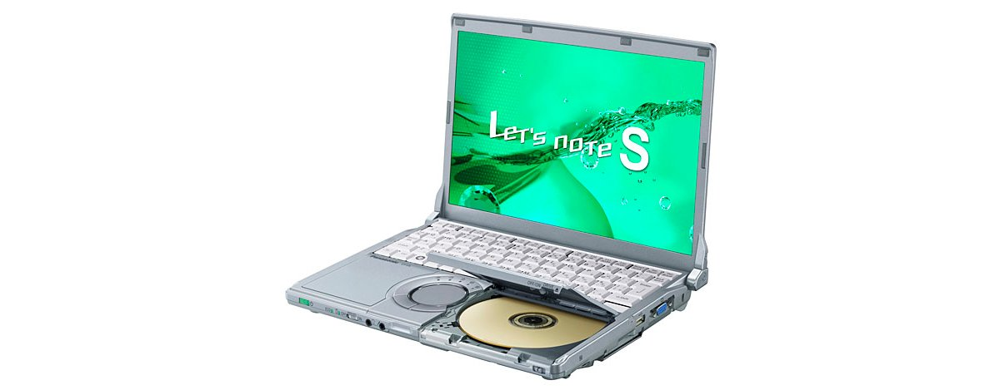
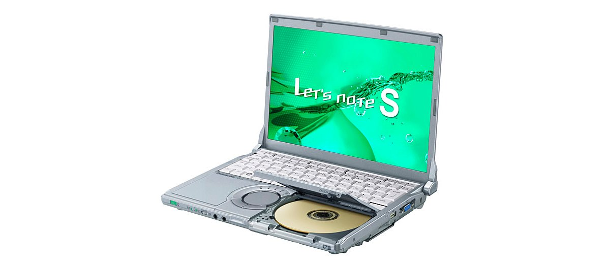
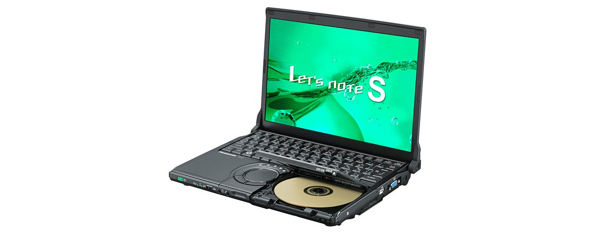
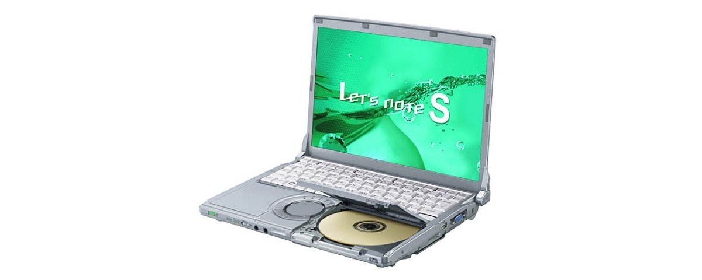
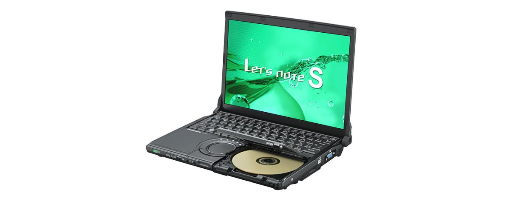
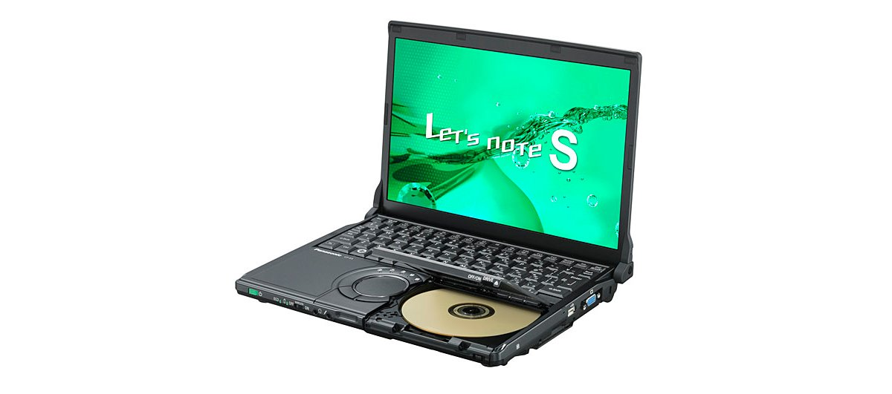

# 松下 Let's note CF-S9 规格参数

[English](../../en/CF-S9/) · [日本語](../../ja/CF-S9/) · **中文**

**CF-S9** 是松下 Let's note 笔记本电脑，属于 S9 系列，配备 12.1英寸 WXGA 屏幕。本页收录其全部 9 个型号（2010-02 – 2010-09 发售）的规格参数。每个型号均附官方规格表链接。

*松下 Let's note CF-S9（CF-S9LYFEDR, CF-S9LYFSDR）。图片 © Panasonic*

## 型号列表

| 型号（品番） | 发售 | 停产 | 主要规格 |
| :-- | :-- | :-- | :-- |
| [CF-S9LYFEDR](https://panasonic.jp/pc/p-db/CF-S9LYFEDR_spec.html) | 2010-09 | 2011-02 | Windows® 7 Professional 正規版 、インテル® CoreTM i5-560M（2.66GHz）、メモリー：標準4GB（拡張メモリースロットに2GBメモリーを増設済み）（最大6GB）、HDD：500GB、スーパーマルチドライブ、LAN、無線LAN 802.11a(W52/W53/W56)/b/g/n |
| [CF-S9LYFSDR](https://panasonic.jp/pc/p-db/CF-S9LYFSDR_spec.html) | 2010-09 | 2011-02 | Windows® 7 Professional 正規版 、インテル® CoreTM i5-560M（2.66GHz）、メモリー：標準4GB（拡張メモリースロットに2GBメモリーを増設済み）（最大6GB）、HDD：500GB、スーパーマルチドライブ、LAN、無線LAN 802.11a(W52/W53/W56)/b/g/n、Office Home and Business 2010 ＜台数限定＞ |
| [CF-S9LYFFDR](https://panasonic.jp/pc/p-db/CF-S9LYFFDR_spec.html) | 2010-09 | 2011-02 | ブラックモデル：Windows® 7 Professional 正規版 、インテル® CoreTM i5-560M（2.66GHz）、メモリー：標準4GB（拡張メモリースロットに2GBメモリーを増設済み）（最大6GB）、HDD：500GB、スーパーマルチドライブ、LAN、無線LAN 802.11a(W52/W53/W56)/b/g/n ＜台数限定＞ |
| [CF-S9KYFEDR](https://panasonic.jp/pc/p-db/CF-S9KYFEDR_spec.html) | 2010-05 | 2010-09 | Windows® 7 Professional 正規版 、インテル® CoreTM i5-520M（2.40GHz）、メモリー：標準4GB（拡張メモリースロットに2GBメモリーを増設済み）、HDD：320GB、スーパーマルチドライブ、LAN、無線LAN 802.11a(W52/W53/W56)/b/g/n |
| [CF-S9KYFSDR](https://panasonic.jp/pc/p-db/CF-S9KYFSDR_spec.html) | 2010-05 | 2010-09 | Windows® 7 Professional 正規版 、インテル® CoreTM i5-520M（2.40GHz）、メモリー：標準4GB（拡張メモリースロットに2GBメモリーを増設済み）、HDD：320GB、スーパーマルチドライブ、LAN、無線LAN 802.11a(W52/W53/W56)/b/g/n、Office Home and Business 2010 ＜台数限定＞ |
| [CF-S9KYFFDR](https://panasonic.jp/pc/p-db/CF-S9KYFFDR_spec.html) | 2010-05 | 2010-09 | ブラックモデル：Windows® 7 Professional 正規版 、インテル® CoreTM i5-520M（2.40GHz）、メモリー：標準4GB（拡張メモリースロットに2GBメモリーを増設済み）、HDD：320GB、スーパーマルチドライブ、LAN、無線LAN 802.11a(W52/W53/W56)/b/g/n ＜台数限定＞ |
| [CF-S9JYEADR](https://panasonic.jp/pc/p-db/CF-S9JYEADR_spec.html) | 2010-02 | 2010-05 | Windows®7 Professional 正規版、インテル® CoreTM i5-520M（2.40GHz）、メモリー：標準2GB（最大4GB）、HDD：250GB、スーパーマルチドライブ、LAN、無線LAN 802.11a(W52/W53/W56)/b/g/n |
| [CF-S9JYEPDR](https://panasonic.jp/pc/p-db/CF-S9JYEPDR_spec.html) | 2010-02 | 2010-05 | Windows®7 Professional 正規版、インテル® CoreTM i5-520M（2.40GHz）、メモリー：標準2GB（最大4GB）、HDD：250GB、スーパーマルチドライブ、LAN、無線LAN 802.11a(W52/W53/W56)/b/g/n、Office Personal 2007＜台数限定＞ |
| [CF-S9JYEBDR](https://panasonic.jp/pc/p-db/CF-S9JYEBDR_spec.html) | 2010-02 | 2010-05 | ブラックモデル：Windows®7 Professional 正規版、インテル® CoreTM i5-520M（2.40GHz）、メモリー：標準2GB（最大4GB）、HDD：250GB、スーパーマルチドライブ、LAN、無線LAN 802.11a(W52/W53/W56)/b/g/n＜台数限定＞ |

## 通用规格

| 项目 | 规格 |
| :-- | :-- |
| 芯片组 | モバイル インテル QM57 Express チップセット |
| 光驱速度 / 读取 | DVD-RAM最大5倍速[4.7GB]、DVD-R最大8倍速、DVD-R DL 最大8倍速、DVD-RW 最大8倍速、DVD-ROM 最大8倍速、+R 最大8倍速、+R DL 最大8倍速、+RW 最大8倍速、High Speed +RW 最大8倍速、CD-ROM 最大24倍速、CD-R 最大24倍速、CD-RW 最大24倍速、High-Speed CD-RW 最大24倍速、Ultra-Speed CD-RW 最大24倍速 |
| 光驱速度 / 写入 | DVD-RAM最大5倍速[4.7GB]、DVD-R 最大8倍速、DVD-RW 最大6倍速、+R 最大8倍速、+RW 最大4倍速、High Speed +RW 最大6倍速、CD-R 最大24倍速、CD-RW 4倍速、High Speed CD-RW 10倍速 |
| 支持光盘 / 写入 | DVD-RAM、DVD-R、DVD-RW、+R、+RW、CD-R、CD-RW、High Speed +RW、High-Speed CD-RW |
| 显示屏 | 12.1型TFTカラー液晶 WXGA (1280×800ドット) |
| 显示屏 / 色彩 | 1280×800ドット：約1677万色 |
| 显示屏 / 外接显示输出 | 1280×720、800×600、1024×768、1280×768、1280×1024、1400×1050、1680×1050、1600×1200、1920×1080、1920×1200ドット：約1677万色 |
| 无线网络 | IEEE802.11a（W52/W53/W56）/b/g/n準拠 |
| 有线网络 | 1000BASE-T / 100BASE-TX / 10BASE-T |
| 安全芯片 | TPM（TCG V1.2準拠） |
| 指点设备 | ホイールパッド |
| 功耗 | 最大約60W |

## 各型号差异

| 型号（品番） | 处理器 | 内存 | 存储 | 重量 | 续航 |
| :-- | :-- | :-- | :-- | :-- | :-- |
| CF-S9LYFEDR | Core i5-560M vPro | 4GB DDR3 SDRAM | 500GB | 1.34 kg | 14.5 h |
| CF-S9LYFSDR | Core i5-560M vPro | 4GB DDR3 SDRAM | 500GB | 1.34 kg | 14.5 h |
| CF-S9LYFFDR | Core i5-560M vPro | 4GB DDR3 SDRAM | 500GB | 1.34 kg | 14.5 h |
| CF-S9KYFEDR | Core i5-520M vPro | 4GB DDR3 SDRAM | 320GB | 1.34 kg | 13 h |
| CF-S9KYFSDR | Core i5-520M vPro | 4GB DDR3 SDRAM | 320GB | 1.34 kg | 13 h |
| CF-S9KYFFDR | Core i5-520M vPro | 4GB DDR3 SDRAM | 320GB | 1.34 kg | 13 h |
| CF-S9JYEADR | Core i5-520M vPro | 2GB DDR3 SDRAM | 250GB | 1.32 kg | — |
| CF-S9JYEPDR | Core i5-520M vPro | 2GB DDR3 SDRAM | 250GB | 1.32 kg | — |
| CF-S9JYEBDR | Core i5-520M vPro | 2GB DDR3 SDRAM | 250GB | 1.32 kg | — |

CF-S9LYFEDR 的全部差异规格

| 项目 | 规格 |
| :-- | :-- |
| 操作系统 | ▼ベースOS：Windows7 Professional 32ビット正規版/Windows7 Professional 64ビット正規版(WindowsXPMode搭載)▼インストールOS：Windows7 Professional 64ビット正規版(WindowsXP Mode搭載)※全て日本語版。 |
| 处理器 | インテルvProテクノロジー採用 / インテル Core i5-560M vPro プロセッサー / インテル スマートキャッシュ3MB、動作周波数2.66GHz / (インテル ターボ・ブースト・テクノロジー利用時は最大3.20GHz) |
| 内存 | 標準4GB DDR3 SDRAM(拡張メモリースロットに2GBのメモリー増設済み、空きスロット0) ※標準装着済みの2GBのメモリーを取り外して4GBのメモリーを取り付けた場合は最大6GB |
| 显存 | 最大1696MB (メインメモリーと共用) |
| 硬盘 | 500GB(Serial ATA、2.5型HDD 5400回転/分)上記容量のうち約12GBをリカバリー領域、約300MBをシステム領域として使用(ユーザー使用不可) |
| 光驱 | スーパーマルチドライブ内蔵 バッファアンダーランエラー防止機能（SmoothLink）搭載 |
| 支持光盘 / 读取 | DVD-RAM、DVD-ROM、DVD-Video、DVD-R、DVD-R DL、DVD-RW、+R、+R DL、+RW、High Speed +RW、CD-Audio、CD-R、CD-ROM (XA対応)、PhotoCD(マルチセッション対応)、VideoCD、CD EXTRA、CD-TEXT、CD-RW、High-Speed CD-RW、Ultra-Speed CD-RW |
| 显示屏 / 显卡 | インテル HD グラフィックス搭載 / (インテル Core i5-560M vPro プロセッサーに内蔵) |
| 显示屏 / 同时显示 | 800×600、1024×768、1280×720、1280×768、1280×800ドット：約1677万色 |
| 无线通信模块 | インテル Centrino Advanced-N + WiMAX 6250 |
| 移动 WiMAX | IEEE802.16e-2005準拠（受信最大20Mbps、送信最大6Mbps） |
| 音频 | PCM音源(24ビットステレオ)、インテル High Definition Audio準拠、モノラルスピーカー |
| 卡槽 / PC 卡 | PCカード（TYPEII）×1スロット(CardBus対応、許容電流3.3V：400mA、5V：400mA) |
| 卡槽 / SD 卡 | SDメモリーカード×1スロット(SDHCメモリーカード/SDXCメモリーカード対応/著作権保護技術対応) |
| 内存扩展槽 | DDR3 204ピンSO-DIMM専用スロット×1 (1.5V/PC3-6400/DDR3 SDRAM) （2GBのメモリーを増設済み、空きスロット0） |
| 接口 | LANコネクター(RJ-45)、外部ディスプレイコネクター（アナログRGB ミニDsub 15ピン）、HDMI出力端子、マイク入力（ステレオミニジャックM3（プラグインパワー対応））、オーディオ出力（ステレオミニジャックM3）、USBポート×3（USB2.0） |
| 键盘 | OADG準拠85キー、キーピッチ19mm(横)/16mm(縦)(一部キーを除く） |
| 电源 | ▼ACアダプター：入力：AC100V～240V、50Hz/60Hz、出力：DC16 V、3.75A、電源コードは100V専用 / ▼バッテリーパック：7.2V リチウムイオン・公称容量12.4Ah、定格容量11.6Ah |
| 能效 | 2011年度基準 N区分0.13 |
| 能效达成率（2011 年度标准） | — |
| 续航 / 充电时间 | 駆動時間：約14.5時間(別売の軽量バッテリーパック装着時：約7時間)／充電時間：約3.5時間（電源OFF時）、約6.5時間（電源ON時）、別売の軽量バッテリーパック装着時：約3.5時間（電源OFF時）、約6.5時間（電源ON時） |
| 尺寸（宽×深×高） | 幅282.8mm×奥行209.6mm×高さ23.4mm/38.7mm（前部/後部） / ※最厚部は41.4mm |
| 重量（含电池） | パソコン本体：約1.34kg（付属のバッテリーパック(約0.41kg)装着時）、パソコン本体：約1.18kg（別売の軽量バッテリーパック(約0.25kg)装着時） |
| 预装软件 | ズームビューアー、PC情報ビューアー、PC情報ポップアップ、NumLockお知らせ、Wireless Manager mobile edition5.5、無線切り替えユーティリティ、セキュリティ設定ユーティリティ、バッテリー残量表示補正ユーティリティ、Hotkey設定、ハードディスクデータ消去ユーティリティ、ホイールパッドユーティリティ、ネットセレクター2、USBキーボードヘルパー、USBマウスヘルパー、Fn Ctrl機能入れ換えユーティリティ、電源プラン拡張ユーティリティ、ディスプレイヘルパー、ぴったりビュー、Aptioセットアップユーティリティ、PC-Diagnosticユーティリティ 、プロジェクターヘルパー、オプティカルディスクドライブ文字変更ユーティリティ、リカバリーディスク作成ユーティリティ |
| 附件 | ACアダプター、バッテリーパック、取扱説明書 等 |

官方规格表: <https://panasonic.jp/pc/p-db/CF-S9LYFEDR_spec.html>

CF-S9LYFSDR 的全部差异规格

| 项目 | 规格 |
| :-- | :-- |
| 操作系统 | ▼ベースOS：Windows7 Professional 32ビット正規版/Windows7 Professional 64ビット正規版(WindowsXPMode搭載)▼インストールOS：Windows7 Professional 64ビット正規版(WindowsXP Mode搭載)※全て日本語版。 |
| 处理器 | インテルvProテクノロジー採用 / インテル Core i5-560M vPro プロセッサー / インテル スマートキャッシュ3MB、動作周波数2.66GHz / (インテル ターボ・ブースト・テクノロジー利用時は最大3.20GHz) |
| 内存 | 標準4GB DDR3 SDRAM(拡張メモリースロットに2GBのメモリー増設済み、空きスロット0) ※標準装着済みの2GBのメモリーを取り外して4GBのメモリーを取り付けた場合は最大6GB |
| 显存 | 最大1696MB (メインメモリーと共用) |
| 硬盘 | 500GB(Serial ATA、2.5型HDD 5400回転/分)上記容量のうち約12GBをリカバリー領域、約300MBをシステム領域として使用(ユーザー使用不可) |
| 光驱 | スーパーマルチドライブ内蔵 バッファアンダーランエラー防止機能（SmoothLink）搭載 |
| 支持光盘 / 读取 | DVD-RAM、DVD-ROM、DVD-Video、DVD-R、DVD-R DL、DVD-RW、+R、+R DL、+RW、High Speed +RW、CD-Audio、CD-R、CD-ROM (XA対応)、PhotoCD(マルチセッション対応)、VideoCD、CD EXTRA、CD-TEXT、CD-RW、High-Speed CD-RW、Ultra-Speed CD-RW |
| 显示屏 / 显卡 | インテル HD グラフィックス搭載 / (インテル Core i5-560M vPro プロセッサーに内蔵) |
| 显示屏 / 同时显示 | 800×600、1024×768、1280×720、1280×768、1280×800ドット：約1677万色 |
| 无线通信模块 | インテル Centrino Advanced-N + WiMAX 6250 |
| 移动 WiMAX | IEEE802.16e-2005準拠（受信最大20Mbps、送信最大6Mbps） |
| 音频 | PCM音源(24ビットステレオ)、インテル High Definition Audio準拠、モノラルスピーカー |
| 卡槽 / PC 卡 | PCカード（TYPEII）×1スロット(CardBus対応、許容電流3.3V：400mA、5V：400mA) |
| 卡槽 / SD 卡 | SDメモリーカード×1スロット(SDHCメモリーカード/SDXCメモリーカード対応/著作権保護技術対応) |
| 内存扩展槽 | DDR3 204ピンSO-DIMM専用スロット×1 (1.5V/PC3-6400/DDR3 SDRAM) （2GBのメモリーを増設済み、空きスロット0） |
| 接口 | LANコネクター(RJ-45)、外部ディスプレイコネクター（アナログRGB ミニDsub 15ピン）、HDMI出力端子、マイク入力（ステレオミニジャックM3（プラグインパワー対応））、オーディオ出力（ステレオミニジャックM3）、USBポート×3（USB2.0） |
| 键盘 | OADG準拠85キー、キーピッチ19mm(横)/16mm(縦)(一部キーを除く） |
| 电源 | ▼ACアダプター：入力：AC100V～240V、50Hz/60Hz、出力：DC16 V、3.75A、電源コードは100V専用 / ▼バッテリーパック：7.2V リチウムイオン・公称容量12.4Ah、定格容量11.6Ah |
| 能效 | 2011年度基準 N区分0.13 |
| 能效达成率（2011 年度标准） | — |
| 续航 / 充电时间 | 駆動時間：約14.5時間(別売の軽量バッテリーパック装着時：約7時間)／充電時間：約3.5時間（電源OFF時）、約6.5時間（電源ON時）、別売の軽量バッテリーパック装着時：約3.5時間（電源OFF時）、約6.5時間（電源ON時） |
| 尺寸（宽×深×高） | 幅282.8mm×奥行209.6mm×高さ23.4mm/38.7mm（前部/後部） / ※最厚部は41.4mm |
| 重量（含电池） | パソコン本体：約1.34kg（付属のバッテリーパック(約0.41kg)装着時）、パソコン本体：約1.18kg（別売の軽量バッテリーパック(約0.25kg)装着時） |
| 预装软件 | ズームビューアー、PC情報ビューアー、PC情報ポップアップ、NumLockお知らせ、Wireless Manager mobile edition5.5、無線切り替えユーティリティ、セキュリティ設定ユーティリティ、バッテリー残量表示補正ユーティリティ、Hotkey設定、ハードディスクデータ消去ユーティリティ、ホイールパッドユーティリティ、ネットセレクター2、USBキーボードヘルパー、USBマウスヘルパー、Fn Ctrl機能入れ換えユーティリティ、電源プラン拡張ユーティリティ、ディスプレイヘルパー、ぴったりビュー、Aptioセットアップユーティリティ、PC-Diagnosticユーティリティ 、プロジェクターヘルパー、オプティカルディスクドライブ文字変更ユーティリティ、リカバリーディスク作成ユーディリティ |
| 附件 | ACアダプター、バッテリーパック、取扱説明書 等 |
| Microsoft Office | Office Home and Business 2010(Word、Excel、PowerPoint、Outlook、OneNote) |

官方规格表: <https://panasonic.jp/pc/p-db/CF-S9LYFSDR_spec.html>

CF-S9LYFFDR 的全部差异规格

| 项目 | 规格 |
| :-- | :-- |
| 操作系统 | ▼ベースOS：Windows7 Professional 32ビット正規版/Windows7 Professional 64ビット正規版(WindowsXPMode搭載)▼インストールOS：Windows7 Professional 64ビット正規版(WindowsXP Mode搭載)※全て日本語版。 |
| 处理器 | インテルvProテクノロジー採用 / インテル Core i5-560M vPro プロセッサー / インテル スマートキャッシュ3MB、動作周波数2.66GHz / (インテル ターボ・ブースト・テクノロジー利用時は最大3.20GHz) |
| 内存 | 標準4GB DDR3 SDRAM(拡張メモリースロットに2GBのメモリー増設済み、空きスロット0) ※標準装着済みの2GBのメモリーを取り外して4GBのメモリーを取り付けた場合は最大6GB |
| 显存 | 最大1696MB (メインメモリーと共用) |
| 硬盘 | 500GB(Serial ATA、2.5型HDD 5400回転/分)上記容量のうち約12GBをリカバリー領域、約300MBをシステム領域として使用(ユーザー使用不可) |
| 光驱 | スーパーマルチドライブ内蔵 バッファアンダーランエラー防止機能（SmoothLink）搭載 |
| 支持光盘 / 读取 | DVD-RAM、DVD-ROM、DVD-Video、DVD-R、DVD-R DL、DVD-RW、+R、+R DL、+RW、High Speed +RW、CD-Audio、CD-R、CD-ROM (XA対応)、PhotoCD(マルチセッション対応)、VideoCD、CD EXTRA、CD-TEXT、CD-RW、High-Speed CD-RW、Ultra-Speed CD-RW |
| 显示屏 / 显卡 | インテル HD グラフィックス搭載 / (インテル Core i5-560M vPro プロセッサーに内蔵) |
| 显示屏 / 同时显示 | 800×600、1024×768、1280×720、1280×768、1280×800ドット：約1677万色 |
| 无线通信模块 | インテル Centrino Advanced-N + WiMAX 6250 |
| 移动 WiMAX | IEEE802.16e-2005準拠（受信最大20Mbps、送信最大6Mbps） |
| 音频 | PCM音源(24ビットステレオ)、インテル High Definition Audio準拠、モノラルスピーカー |
| 卡槽 / PC 卡 | PCカード（TYPEII）×1スロット(CardBus対応、許容電流3.3V：400mA、5V：400mA) |
| 卡槽 / SD 卡 | SDメモリーカード×1スロット(SDHCメモリーカード/SDXCメモリーカード対応/著作権保護技術対応) |
| 内存扩展槽 | DDR3 204ピンSO-DIMM専用スロット×1 (1.5V/PC3-6400/DDR3 SDRAM) （2GBのメモリーを増設済み、空きスロット0） |
| 接口 | LANコネクター(RJ-45)、外部ディスプレイコネクター（アナログRGB ミニDsub 15ピン）、HDMI出力端子、マイク入力（ステレオミニジャックM3（プラグインパワー対応））、オーディオ出力（ステレオミニジャックM3）、USBポート×3（USB2.0） |
| 键盘 | OADG準拠85キー、キーピッチ19mm(横)/16mm(縦)(一部キーを除く） |
| 电源 | ▼ACアダプター：入力：AC100V～240V、50Hz/60Hz、出力：DC16 V、3.75A、電源コードは100V専用 / ▼バッテリーパック：7.2V リチウムイオン・公称容量12.4Ah、定格容量11.6Ah |
| 能效 | 2011年度基準 N区分0.13 |
| 能效达成率（2011 年度标准） | — |
| 续航 / 充电时间 | 駆動時間：約14.5時間(別売の軽量バッテリーパック装着時：約7時間)／充電時間：約3.5時間（電源OFF時）、約6.5時間（電源ON時）、別売の軽量バッテリーパック装着時：約3.5時間（電源OFF時）、約6.5時間（電源ON時） |
| 尺寸（宽×深×高） | 幅282.8mm×奥行209.6mm×高さ23.4mm/38.7mm（前部/後部） / ※最厚部は41.4mm |
| 重量（含电池） | パソコン本体：約1.34kg（付属のバッテリーパック(約0.41kg)装着時）、パソコン本体：約1.18kg（別売の軽量バッテリーパック(約0.25kg)装着時） |
| 预装软件 | ズームビューアー、PC情報ビューアー、PC情報ポップアップ、NumLockお知らせ、Wireless Manager mobile edition5.5、無線切り替えユーティリティ、セキュリティ設定ユーティリティ、バッテリー残量表示補正ユーティリティ、Hotkey設定、ハードディスクデータ消去ユーティリティ、ホイールパッドユーティリティ、ネットセレクター2、USBキーボードヘルパー、USBマウスヘルパー、Fn Ctrl機能入れ換えユーティリティ、電源プラン拡張ユーティリティ、ディスプレイヘルパー、ぴったりビュー、Aptioセットアップユーティリティ、PC-Diagnosticユーティリティ 、プロジェクターヘルパー、オプティカルディスクドライブ文字変更ユーティリティ、リカバリーディスク作成ユーティリティ |
| 附件 | ACアダプター、バッテリーパック、取扱説明書 等 |

官方规格表: <https://panasonic.jp/pc/p-db/CF-S9LYFFDR_spec.html>

CF-S9KYFEDR 的全部差异规格

| 项目 | 规格 |
| :-- | :-- |
| 操作系统 | ▼ベースOS：Windows7 Professional 32ビット正規版/Windows7 Professional64ビット正規版(WindowsXPMode搭載)▼インストールOS：Windows7 Professional 32ビット正規版(WindowsXP Mode搭載)※全て日本語版。 |
| 处理器 | インテルvProテクノロジー採用 / インテル Core i5-520M vPro プロセッサー / インテル スマートキャッシュ3MB、動作周波数2.40GHz / インテル ターボ・ブースト・テクノロジー利用時は最大2.93GHz |
| 内存 | 標準4GB DDR3 SDRAM（拡張メモリースロットに2GBのメモリーを増設済み、空きスロット0） |
| 显存 | 最大1563MB (メインメモリーと共用) |
| 硬盘 | 320GB（Serial ATA、2.5型HDD 5400回転/分）※上記容量のうち約12GBをリカバリー領域、約300MBをシステム領域として使用（ユーザー使用不可） |
| 光驱 | スーパーマルチドライブ内蔵、バッファアンダーランエラー防止機能（SmoothLink）搭載 |
| 支持光盘 / 读取 | DVD-RAM、DVD-ROM、DVD-Video、DVD-R、DVD-R DL、DVD-RW、+R、+R DL、+RW、High Speed +RW、CD-Audio、CD-R、CD-ROM (XA対応)、PhotoCD(マルチセッション対応)、VideoCD、CD EXTRA、CD-TEXT、CD-RW、High-Speed CD-RW、Ultra-Speed CD-RW |
| 显示屏 / 显卡 | インテル HD グラフィックス搭載（インテル Core i5-520M vPro プロセッサーに内蔵） |
| 显示屏 / 同时显示 | 800×600、1024×768、1280×720、1280×768、1280×800ドット / ：約1677万色 |
| 无线通信模块 | インテル Centrino Advanced-N+WiMAX 6250 |
| 移动 WiMAX | IEEE802.16e-2005準拠（受信最大20Mbps、送信最大 6Mbps |
| 音频 | PCM音源（24ビットステレオ）、インテル High Definition Audio 準拠、モノラルスピーカー |
| 卡槽 / PC 卡 | PCカード（TYPEII）×1スロット(CardBus対応、許容電流3.3V：400mA、5V：400mA) |
| 卡槽 / SD 卡 | SDメモリーカード×1スロット（SDHCメモリーカード/SDXCメモリーカード対応/著作権保護技術対応） |
| 内存扩展槽 | DDR3 204ピンSO-DIMM専用スロット×1 (1.5V/PC3-6400/DDR3 SDRAM)（2GBのメモリーを増設済み、空きスロット0） |
| 接口 | LANコネクター（RJ-45）、外部ディスプレイコネクター（アナログRGB ミニDsub 15ピン）、HDMI出力端子、マイク入力（ステレオミニジャックM3（プラグインパワー対応））、オーディオ出力（ステレオミニジャックM3） |
| 键盘 | OADG準拠85キー、キーピッチ19mm(横)/16mm(縦)(一部キーを除く) |
| 电源 | ▼ACアダプター：入力：AC100V～240V、50Hz/60Hz、出力：DC16V、3.75A、電源コードは100V専用 / ▼バッテリーパック：7.2V リチウムイオン・公称容量12.4Ah、定格容量11.6Ah。 |
| 能效 | 2011年度基準R区分0.15／2007年度基準I区分0.00015 |
| 能效达成率（2011 年度标准） | — |
| 续航 / 充电时间 | 駆動時間：約13時間(別売の軽量バッテリーパック装着時：約6.5時間)／充電時間：約3.5時間（電源OFF時）、約6.5時間（電源ON時） |
| 尺寸（宽×深×高） | 幅282.8mm×奥行209.6mm×高さ23.4mm/38.7mm(前部/後部） / ※突起部除く。最厚部は41.4mm |
| 重量（含电池） | パソコン本体：約1.34kg（付属のバッテリーパック(約0.41kg)装着時）、パソコン本体：約1.18kg（別売の軽量バッテリーパック(約0.25kg)装着時） |
| 预装软件 | Microsoft Internet Explorer8.0、Adobe Reader、Microsoft Windows Media Player 12、Microsoft .NET Framework 3.5.1、WindowsLiveメール、WindowsLive Messenger、WindowsLiveフォトギャラリー、WindowsLive Writer、ズームビューアー、PC情報ビューアー、PC情報ポップアップ、NumLockお知らせ、Wireless Manager mobile edition5.5、無線切り替えユーティリティ、セキュリティ設定ユーティリティ、Infineon TPM Professional Package V3.6、バッテリー残量表示補正ユーティリティ、Hotkey設定、マカフィー・PCセキュリティセンター、緑のgooスティック、ハードディスクデータ消去ユーティリティ、ホイールパッドユーティリティ、ネットセレクター2、USBキーボードヘルパー、USBマウスヘルパー、Fn Ctrl機能入れ換えユーティリティ、i-フィルター5.0 (30日お試し版)、電源プラン拡張ユーティリティ、ディスプレイヘルパー、ぴったりビュー、Aptioセットアップユーティリティ、PC-Diagnosticユーティリティ 、プロジェクターヘルパー、Windows XP Mode、インテル PROSet/Wireless Software、オプティカルディスクドライブ文字変更ユーティリティ、Roxio Creator LJB、MyDVD、WinDVD8(OEM版)CPRM対応、リカバリーディスク作成ユーティリティ |
| 附件 | ACアダプター、バッテリーパック、取扱説明書 等 |
| 能效达成率 | — |

官方规格表: <https://panasonic.jp/pc/p-db/CF-S9KYFEDR_spec.html>

CF-S9KYFSDR 的全部差异规格

| 项目 | 规格 |
| :-- | :-- |
| 操作系统 | ▼ベースOS：Windows7 Professional 32ビット正規版/Windows7 Professional64ビット正規版(WindowsXPMode搭載)▼インストールOS：Windows7 Professional 32ビット正規版(WindowsXP Mode搭載)※全て日本語版。 |
| 处理器 | インテルvProテクノロジー採用 / インテル Core i5-520M vPro プロセッサー / インテル スマートキャッシュ3MB、動作周波数2.40GHz / インテル ターボ・ブースト・テクノロジー利用時は最大2.93GHz |
| 内存 | 標準4GB DDR3 SDRAM（拡張メモリースロットに2GBのメモリーを増設済み、空きスロット0） |
| 显存 | 最大1563MB (メインメモリーと共用) |
| 硬盘 | 320GB（Serial ATA、2.5型HDD 5400回転/分）※上記容量のうち約12GBをリカバリー領域、約300MBをシステム領域として使用（ユーザー使用不可） |
| 光驱 | スーパーマルチドライブ内蔵、バッファアンダーランエラー防止機能（SmoothLink）搭載 |
| 支持光盘 / 读取 | DVD-RAM、DVD-ROM、DVD-Video、DVD-R、DVD-R DL、DVD-RW、+R、+R DL、+RW、High Speed +RW、CD-Audio、CD-R、CD-ROM (XA対応)、PhotoCD(マルチセッション対応)、VideoCD、CD EXTRA、CD-TEXT、CD-RW、High-Speed CD-RW、Ultra-Speed CD-RW |
| 显示屏 / 显卡 | インテル HD グラフィックス搭載（インテル Core i5-520M vPro プロセッサーに内蔵） |
| 显示屏 / 同时显示 | 800×600、1024×768、1280×720、1280×768、1280×800ドット / ：約1677万色 |
| 无线通信模块 | インテル Centrino Advanced-N+WiMAX 6250 |
| 移动 WiMAX | IEEE802.16e-2005準拠（受信最大20Mbps、送信最大 6Mbps |
| 音频 | PCM音源（24ビットステレオ）、インテル High Definition Audio 準拠、モノラルスピーカー |
| 卡槽 / PC 卡 | PCカード（TYPEII）×1スロット(CardBus対応、許容電流3.3V：400mA、5V：400mA) |
| 卡槽 / SD 卡 | SDメモリーカード×1スロット（SDHCメモリーカード/SDXCメモリーカード対応/著作権保護技術対応） |
| 内存扩展槽 | DDR3 204ピンSO-DIMM専用スロット×1 (1.5V/PC3-6400/DDR3 SDRAM)（2GBのメモリーを増設済み、空きスロット0） |
| 接口 | LANコネクター（RJ-45）、外部ディスプレイコネクター（アナログRGB ミニDsub 15ピン）、HDMI出力端子、マイク入力（ステレオミニジャックM3（プラグインパワー対応））、オーディオ出力（ステレオミニジャックM3） |
| 键盘 | OADG準拠85キー、キーピッチ19mm(横)/16mm(縦)(一部キーを除く) |
| 电源 | ▼ACアダプター：入力：AC100V～240V、50Hz/60Hz、出力：DC16V、3.75A、電源コードは100V専用 / ▼バッテリーパック：7.2V リチウムイオン・公称容量12.4Ah、定格容量11.6Ah。 |
| 能效 | 2011年度基準R区分0.15／2007年度基準I区分0.00015 |
| 能效达成率（2011 年度标准） | — |
| 续航 / 充电时间 | 駆動時間：約13時間(別売の軽量バッテリーパック装着時：約6.5時間)／充電時間：約3.5時間（電源OFF時）、約6.5時間（電源ON時） |
| 尺寸（宽×深×高） | 幅282.8mm×奥行209.6mm×高さ23.4mm/38.7mm(前部/後部） / ※突起部除く。最厚部は41.4mm |
| 重量（含电池） | パソコン本体：約1.34kg（付属のバッテリーパック(約0.41kg)装着時）、パソコン本体：約1.18kg（別売の軽量バッテリーパック(約0.25kg)装着時） |
| 预装软件 | Microsoft Internet Explorer8.0、Adobe Reader、Microsoft Windows Media Player 12、Microsoft .NET Framework 3.5.1、WindowsLiveメール、WindowsLive Messenger、WindowsLiveフォトギャラリー、WindowsLive Writer、ズームビューアー、PC情報ビューアー、PC情報ポップアップ、NumLockお知らせ、Wireless Manager mobile edition5.5、無線切り替えユーティリティ、セキュリティ設定ユーティリティ、Infineon TPM Professional Package V3.6、バッテリー残量表示補正ユーティリティ、Hotkey設定、マカフィー・PCセキュリティセンター、緑のgooスティック、ハードディスクデータ消去ユーティリティ、ホイールパッドユーティリティ、ネットセレクター2、USBキーボードヘルパー、USBマウスヘルパー、Fn Ctrl機能入れ換えユーティリティ、i-フィルター5.0 (30日お試し版)、電源プラン拡張ユーティリティ、ディスプレイヘルパー、ぴったりビュー、Aptioセットアップユーティリティ、PC-Diagnosticユーティリティ 、プロジェクターヘルパー、Windows XP Mode、インテル PROSet/Wireless Software、オプティカルディスクドライブ文字変更ユーティリティ、Roxio Creator LJB、MyDVD、WinDVD8(OEM版)CPRM対応、リカバリーディスク作成ユーティリティ、Office Home and Business 2010搭載（Word、Excel、PowerPoint、Outlook、OneNote） |
| 附件 | ACアダプター、バッテリーパック、取扱説明書 等 |

官方规格表: <https://panasonic.jp/pc/p-db/CF-S9KYFSDR_spec.html>

CF-S9KYFFDR 的全部差异规格

| 项目 | 规格 |
| :-- | :-- |
| 操作系统 | ▼ベースOS：Windows7 Professional 32ビット正規版/Windows7 Professional64ビット正規版(WindowsXPMode搭載)▼インストールOS：Windows7 Professional 32ビット正規版(WindowsXP Mode搭載)※全て日本語版。 |
| 处理器 | インテルvProテクノロジー採用 / インテル Core i5-520M vPro プロセッサー / インテル スマートキャッシュ3MB、動作周波数2.40GHz / インテル ターボ・ブースト・テクノロジー利用時は最大2.93GHz |
| 内存 | 標準4GB DDR3 SDRAM（拡張メモリースロットに2GBのメモリーを増設済み、空きスロット0） |
| 显存 | 最大1563MB (メインメモリーと共用) |
| 硬盘 | 320GB（Serial ATA、2.5型HDD 5400回転/分）※上記容量のうち約12GBをリカバリー領域、約300MBをシステム領域として使用（ユーザー使用不可） |
| 光驱 | スーパーマルチドライブ内蔵、バッファアンダーランエラー防止機能（SmoothLink）搭載 |
| 支持光盘 / 读取 | DVD-RAM、DVD-ROM、DVD-Video、DVD-R、DVD-R DL、DVD-RW、+R、+R DL、+RW、High Speed +RW、CD-Audio、CD-R、CD-ROM (XA対応)、PhotoCD(マルチセッション対応)、VideoCD、CD EXTRA、CD-TEXT、CD-RW、High-Speed CD-RW、Ultra-Speed CD-RW |
| 显示屏 / 显卡 | インテル HD グラフィックス搭載（インテル Core i5-520M vPro プロセッサーに内蔵） |
| 显示屏 / 同时显示 | 800×600、1024×768、1280×720、1280×768、1280×800ドット / ：約1677万色 |
| 无线通信模块 | インテル Centrino Advanced-N+WiMAX 6250 |
| 移动 WiMAX | IEEE802.16e-2005準拠（受信最大20Mbps、送信最大 6Mbps |
| 音频 | PCM音源（24ビットステレオ）、インテル High Definition Audio 準拠、モノラルスピーカー |
| 卡槽 / PC 卡 | PCカード（TYPEII）×1スロット(CardBus対応、許容電流3.3V：400mA、5V：400mA) |
| 卡槽 / SD 卡 | SDメモリーカード×1スロット（SDHCメモリーカード/SDXCメモリーカード対応/著作権保護技術対応） |
| 内存扩展槽 | DDR3 204ピンSO-DIMM専用スロット×1 (1.5V/PC3-6400/DDR3 SDRAM)（2GBのメモリーを増設済み、空きスロット0） |
| 接口 | LANコネクター（RJ-45）、外部ディスプレイコネクター（アナログRGB ミニDsub 15ピン）、HDMI出力端子、マイク入力（ステレオミニジャックM3（プラグインパワー対応））、オーディオ出力（ステレオミニジャックM3））、USBポート×3（USB2.0） |
| 键盘 | OADG準拠85キー、キーピッチ19mm(横)/16mm(縦)(一部キーを除く) |
| 电源 | ▼ACアダプター：入力：AC100V～240V、50Hz/60Hz、出力：DC16V、3.75A、電源コードは100V専用 / ▼バッテリーパック：7.2V リチウムイオン・公称容量12.4Ah、定格容量11.6Ah。 |
| 能效 | 2011年度基準R区分0.15／2007年度基準I区分0.00015 |
| 能效达成率（2011 年度标准） | — |
| 续航 / 充电时间 | 駆動時間：約13時間(別売の軽量バッテリーパック装着時：約6.5時間)／充電時間：約3.5時間（電源OFF時）、約6.5時間（電源ON時） |
| 尺寸（宽×深×高） | 幅282.8mm×奥行209.6mm×高さ23.4mm/38.7mm(前部/後部） / ※突起部除く。最厚部は41.4mm |
| 重量（含电池） | パソコン本体：約1.34kg（付属のバッテリーパック(約0.41kg)装着時）、パソコン本体：約1.18kg（別売の軽量バッテリーパック(約0.25kg)装着時） |
| 预装软件 | Microsoft Internet Explorer8.0、Adobe Reader、Microsoft Windows Media Player 12、Microsoft .NET Framework 3.5.1、WindowsLiveメール、WindowsLive Messenger、WindowsLiveフォトギャラリー、WindowsLive Writer、ズームビューアー、PC情報ビューアー、PC情報ポップアップ、NumLockお知らせ、Wireless Manager mobile edition5.5、無線切り替えユーティリティ、セキュリティ設定ユーティリティ、Infineon TPM Professional Package V3.6、バッテリー残量表示補正ユーティリティ、Hotkey設定、マカフィー・PCセキュリティセンター、緑のgooスティック、ハードディスクデータ消去ユーティリティ、ホイールパッドユーティリティ、ネットセレクター2、USBキーボードヘルパー、USBマウスヘルパー、Fn Ctrl機能入れ換えユーティリティ、i-フィルター5.0 (30日お試し版)、電源プラン拡張ユーティリティ、ディスプレイヘルパー、ぴったりビュー、Aptioセットアップユーティリティ、PC-Diagnosticユーティリティ 、プロジェクターヘルパー、Windows XP Mode、インテル PROSet/Wireless Software、オプティカルディスクドライブ文字変更ユーティリティ、Roxio Creator LJB、MyDVD、WinDVD8(OEM版)CPRM対応、リカバリーディスク作成ユーティリティ |
| 附件 | ACアダプター、バッテリーパック、取扱説明書 等 |
| 能效达成率 | — |

官方规格表: <https://panasonic.jp/pc/p-db/CF-S9KYFFDR_spec.html>

CF-S9JYEADR 的全部差异规格

| 项目 | 规格 |
| :-- | :-- |
| 操作系统 | ▼ベースOS：Windows7 Professional 32ビット正規版/Windows7 Professional 64ビット正規版(WindowsXP Mode搭載) / ▼インストールOS：Windows7 Professional 32ビット正規版(WindowsXP Mode搭載)※全て日本語版 |
| 处理器 | インテルvProテクノロジー採用 / インテル Core i5-520M vPro プロセッサー / インテル スマートキャッシュ3MB、動作周波数2.40GHz / インテル ターボ・ブースト・テクノロジー利用時は最大2.93GHz |
| 内存 | 標準2GB DDR3 SDRAM（空きスロット1）/最大4GB |
| 显存 | 最大763MB 2GBメモリーを増設した場合は1563MB (メインメモリーと共用) |
| 硬盘 | 250GB（Serial ATA）※左記容量のうち約12GBをリカバリー領域、約300MBをシステム領域として使用（ユーザー使用不可） |
| 光驱 | スーパーマルチドライブ内蔵、バッファアンダーランエラー防止機能（SmoothLink）搭載 |
| 支持光盘 / 读取 | DVD-RAM、DVD-ROM、DVD-Video、DVD-R、DVD-R DL、DVD-RW、+R、+R DL、+RW、High Speed +RW、CD-Audio、CD-R、CD-ROM (XA対応)、PhotoCD(マルチセッション対応)、VideoCD、CD EXTRA、CD-TEXT、CD-RW、High-Speed CD-RW、 / Ultra-Speed CD-RW |
| 显示屏 / 同时显示 | 800×600、1024×768、1280×720、1280×768、1280×800ドット / ：約1677万色 |
| 无线通信模块 | インテル Centrino Advanced-N+WiMAX 6250 |
| 移动 WiMAX | IEEE802.16e-2005準拠（受信最大20Mbps、送信最大6Mbps） |
| 音频 | PCM音源（24ビットステレオ）、インテル High Definition Audio 準拠、モノラルスピーカー |
| 卡槽 / PC 卡 | PCカード（TYPEII）×1スロット(CardBus対応、許容電流3.3V：400Ma、5V：400mA) |
| 卡槽 / SD 卡 | SDメモリーカード×1スロット（SDHCメモリーカード/著作権保護技術対応） |
| 内存扩展槽 | DDR3 204ピンSO-DIMM専用スロット×1 (1.5V/PC3-6400/DDR3 SDRAM) |
| 接口 | LANコネクター（RJ-45）、外部ディスプレイコネクター（アナログRGB ミニDsub 15ピン）、HDMI出力端子、マイク入力（ステレオミニジャックM3（プラグインパワー対応））、オーディオ出力（ステレオミニジャックM3）、USBポート×3（USB2.0） |
| 键盘 | OADG準拠85キー、キーピッチ19mm(横)/16mm(縦)(一部キーを除く) |
| 电源 | ▼ACアダプター：入力：AC100V～240V、50Hz/60Hz、出力：DC16V、3.75A、電源コードは100V専用 / ▼バッテリーパック：7.2V リチウムイオン・公称容量12.4Ah、定格容量11.6Ah |
| 能效 | 2007年度基準l区分0.00015 |
| 尺寸（宽×深×高） | 幅282.8mm×奥行209.6mm×高さ23.4mm/38.7mm(前部/後部） / ※突起部除く。最厚部は41.4mm |
| 重量（含电池） | パソコン本体：約1.32kg（付属のバッテリーパック(約0.41kg)装着時）、パソコン本体：約1.16kg（別売の軽量バッテリーパック(約0.25kg)装着時） |
| 预装软件 | Microsoft Internet Explorer8.0、Adobe Reader、Microsoft Windows Media Player 12、DirectX 11、Microsoft .NET Framework 3.5.1、WindowsLiveメール、WindowsLive Messenger、WindowsLiveフォトギャラリー、WindowsLive Writer、ズームビューアー、PC情報ビューアー、PC情報ポップアップ、NumLockお知らせ、Wireless Manager mobile edition5.5、無線切り替えユーティリティ、セキュリティ設定ユーティリティ、Infineon TPM Professional Package V3.6、バッテリー残量表示補正ユーティリティ、Hotkey設定、マカフィー・PCセキュリティセンター、緑のgooスティック、ハードディスクデータ消去ユーティリティ、ホイールパッドユーティリティ、ネットセレクター2、USBキーボードヘルパー、USBマウスヘルパー、Fn Ctrl機能入れ換えユーティリティ、i-フィルター5.0 (30日お試し版) 、Panasonic電源プラン拡張ユーティリティ、ディスプレイヘルパー、ぴったりビュー、Aptioセットアップユーティリティ、PC-Diagnosticユーティリティ 、プロジェクターヘルパー、Windows XP Mode）、オプティカルディスクドライブ文字変更ユーティリティ、Roxio Creator LJB、MyDVD、WinDVD8(OEM版)CPRM対応 |
| 附件 | プロダクトリカバリーDVD-ROM1枚（Windows7用）、ACアダプター、バッテリーパック、取扱説明書 等 |
| 能效达成率 | — |
| 软驱（选配） | （別売）USB接続外付3.5型3モード対応（1.44MB/1.2MB/720KB） |

官方规格表: <https://panasonic.jp/pc/p-db/CF-S9JYEADR_spec.html>

CF-S9JYEPDR 的全部差异规格

| 项目 | 规格 |
| :-- | :-- |
| 操作系统 | ▼ベースOS：Windows7 Professional 32ビット正規版/Windows7 Professional 64ビット正規版(WindowsXP Mode搭載) / ▼インストールOS：Windows7 Professional 32ビット正規版(WindowsXP Mode搭載)※全て日本語版 |
| 处理器 | インテルvProテクノロジー採用 / インテル Core i5-520M vPro プロセッサー / インテル スマートキャッシュ3MB、動作周波数2.40GHz / インテル ターボ・ブースト・テクノロジー利用時は最大2.93GHz |
| 内存 | 標準2GB DDR3 SDRAM（空きスロット1）/最大4GB |
| 显存 | 最大763MB 2GBメモリーを増設した場合は1563MB (メインメモリーと共用) |
| 硬盘 | 250GB（Serial ATA）※左記容量のうち約12GBをリカバリー領域、約300MBをシステム領域として使用（ユーザー使用不可） |
| 光驱 | スーパーマルチドライブ内蔵、バッファアンダーランエラー防止機能（SmoothLink）搭載 |
| 支持光盘 / 读取 | DVD-RAM、DVD-ROM、DVD-Video、DVD-R、DVD-R DL、DVD-RW、+R、+R DL、+RW、High Speed +RW、CD-Audio、CD-R、CD-ROM (XA対応)、PhotoCD(マルチセッション対応)、VideoCD、CD EXTRA、CD-TEXT、CD-RW、High-Speed CD-RW、 / Ultra-Speed CD-RW |
| 显示屏 / 同时显示 | 800×600、1024×768、1280×720、1280×768、1280×800ドット / ：約1677万色 |
| 无线通信模块 | インテル Centrino Advanced-N+WiMAX 6250 |
| 移动 WiMAX | IEEE802.16e-2005準拠（受信最大20Mbps、送信最大6Mbps） |
| 音频 | PCM音源（24ビットステレオ）、インテル High Definition Audio 準拠、モノラルスピーカー |
| 卡槽 / PC 卡 | PCカード（TYPEII）×1スロット(CardBus対応、許容電流3.3V：400Ma、5V：400mA) |
| 卡槽 / SD 卡 | SDメモリーカード×1スロット（SDHCメモリーカード/著作権保護技術対応） |
| 内存扩展槽 | DDR3 204ピンSO-DIMM専用スロット×1 (1.5V/PC3-6400/DDR3 SDRAM) |
| 接口 | LANコネクター（RJ-45）、外部ディスプレイコネクター（アナログRGB ミニDsub 15ピン）、HDMI出力端子、マイク入力（ステレオミニジャックM3（プラグインパワー対応））、オーディオ出力（ステレオミニジャックM3）、USBポート×3（USB2.0） |
| 键盘 | OADG準拠85キー、キーピッチ19mm(横)/16mm(縦)(一部キーを除く) |
| 电源 | ▼ACアダプター：入力：AC100V～240V、50Hz/60Hz、出力：DC16V、3.75A、電源コードは100V専用 / ▼バッテリーパック：7.2V リチウムイオン・公称容量12.4Ah、定格容量11.6Ah |
| 能效 | 2007年度基準l区分0.00015 |
| 尺寸（宽×深×高） | 幅282.8mm×奥行209.6mm×高さ23.4mm/38.7mm(前部/後部） / ※突起部除く。最厚部は41.4mm |
| 重量（含电池） | パソコン本体：約1.32kg（付属のバッテリーパック(約0.41kg)装着時）、パソコン本体：約1.16kg（別売の軽量バッテリーパック(約0.25kg)装着時） |
| 预装软件 | Microsoft Internet Explorer8.0、Adobe Reader、Microsoft Windows Media Player 12、DirectX 11、Microsoft .NET Framework 3.5.1、WindowsLiveメール、WindowsLive Messenger、WindowsLiveフォトギャラリー、WindowsLive Writer、ズームビューアー、PC情報ビューアー、PC情報ポップアップ、NumLockお知らせ、Wireless Manager mobile edition5.5、無線切り替えユーティリティ、セキュリティ設定ユーティリティ、Infineon TPM Professional Package V3.6、バッテリー残量表示補正ユーティリティ、Hotkey設定、マカフィー・PCセキュリティセンター、緑のgooスティック、ハードディスクデータ消去ユーティリティ、ホイールパッドユーティリティ、ネットセレクター2、USBキーボードヘルパー、USBマウスヘルパー、Fn Ctrl機能入れ換えユーティリティ、i-フィルター5.0 (30日お試し版) 、Panasonic電源プラン拡張ユーティリティ、ディスプレイヘルパー、ぴったりビュー、Aptioセットアップユーティリティ、PC-Diagnosticユーティリティ 、プロジェクターヘルパー、Windows XP Mode）、オプティカルディスクドライブ文字変更ユーティリティ、Roxio Creator LJB、MyDVD、WinDVD8(OEM版)CPRM対応、Microsoft(R) Office Personal 2007 with Microsoft(R) Office PowerPoint(R) 2007(ServicePack2) |
| 附件 | プロダクトリカバリーDVD-ROM1枚（Windows7用）、ACアダプター、バッテリーパック、取扱説明書 等 |
| 能效达成率 | — |
| 软驱（选配） | （別売）USB接続外付3.5型3モード対応（1.44MB/1.2MB/720KB） |

官方规格表: <https://panasonic.jp/pc/p-db/CF-S9JYEPDR_spec.html>

CF-S9JYEBDR 的全部差异规格

| 项目 | 规格 |
| :-- | :-- |
| 操作系统 | ▼ベースOS：Windows7 Professional 32ビット正規版/Windows7 Professional 64ビット正規版(WindowsXP Mode搭載) / ▼インストールOS：Windows7 Professional 32ビット正規版(WindowsXP Mode搭載)※全て日本語版 |
| 处理器 | インテルvProテクノロジー採用 / インテル Core i5-520M vPro プロセッサー / インテル スマートキャッシュ3MB、動作周波数2.40GHz / インテル ターボ・ブースト・テクノロジー利用時は最大2.93GHz |
| 内存 | 標準2GB DDR3 SDRAM（空きスロット1）/最大4GB |
| 显存 | 最大763MB 2GBメモリーを増設した場合は1563MB (メインメモリーと共用) |
| 硬盘 | 250GB（Serial ATA）※左記容量のうち約12GBをリカバリー領域、約300MBをシステム領域として使用（ユーザー使用不可） |
| 光驱 | スーパーマルチドライブ内蔵、バッファアンダーランエラー防止機能（SmoothLink）搭載 |
| 支持光盘 / 读取 | DVD-RAM、DVD-ROM、DVD-Video、DVD-R、DVD-R DL、DVD-RW、+R、+R DL、+RW、High Speed +RW、CD-Audio、CD-R、CD-ROM (XA対応)、PhotoCD(マルチセッション対応)、VideoCD、CD EXTRA、CD-TEXT、CD-RW、High-Speed CD-RW、 / Ultra-Speed CD-RW |
| 显示屏 / 同时显示 | 800×600、1024×768、1280×720、1280×768、1280×800ドット / ：約1677万色 |
| 无线通信模块 | インテル Centrino Advanced-N+WiMAX 6250 |
| 移动 WiMAX | IEEE802.16e-2005準拠（受信最大20Mbps、送信最大6Mbps） |
| 音频 | PCM音源（24ビットステレオ）、インテル High Definition Audio 準拠、モノラルスピーカー |
| 卡槽 / PC 卡 | PCカード（TYPEII）×1スロット(CardBus対応、許容電流3.3V：400Ma、5V：400mA) |
| 卡槽 / SD 卡 | SDメモリーカード×1スロット（SDHCメモリーカード/著作権保護技術対応） |
| 内存扩展槽 | DDR3 204ピンSO-DIMM専用スロット×1 (1.5V/PC3-6400/DDR3 SDRAM) |
| 接口 | LANコネクター（RJ-45）、外部ディスプレイコネクター（アナログRGB ミニDsub 15ピン）、HDMI出力端子、マイク入力（ステレオミニジャックM3（プラグインパワー対応））、オーディオ出力（ステレオミニジャックM3）、USBポート×3（USB2.0） |
| 键盘 | OADG準拠85キー、キーピッチ19mm(横)/16mm(縦)(一部キーを除く) |
| 电源 | ▼ACアダプター：入力：AC100V～240V、50Hz/60Hz、出力：DC16V、3.75A、電源コードは100V専用 / ▼バッテリーパック：7.2V リチウムイオン・公称容量12.4Ah、定格容量11.6Ah |
| 能效 | 2007年度基準l区分0.00015 |
| 尺寸（宽×深×高） | 幅282.8mm×奥行209.6mm×高さ23.4mm/38.7mm(前部/後部） / ※突起部除く。最厚部は41.4mm |
| 重量（含电池） | パソコン本体：約1.32kg（付属のバッテリーパック(約0.41kg)装着時）、パソコン本体：約1.16kg（別売の軽量バッテリーパック(約0.25kg)装着時） |
| 预装软件 | Microsoft Internet Explorer8.0、Adobe Reader、Microsoft Windows Media Player 12、DirectX 11、Microsoft .NET Framework 3.5.1、WindowsLiveメール、WindowsLive Messenger、WindowsLiveフォトギャラリー、WindowsLive Writer、ズームビューアー、PC情報ビューアー、PC情報ポップアップ、NumLockお知らせ、Wireless Manager mobile edition5.5、無線切り替えユーティリティ、セキュリティ設定ユーティリティ、Infineon TPM Professional Package V3.6、バッテリー残量表示補正ユーティリティ、Hotkey設定、マカフィー・PCセキュリティセンター、緑のgooスティック、ハードディスクデータ消去ユーティリティ、ホイールパッドユーティリティ、ネットセレクター2、USBキーボードヘルパー、USBマウスヘルパー、Fn Ctrl機能入れ換えユーティリティ、i-フィルター5.0 (30日お試し版) 、Panasonic電源プラン拡張ユーティリティ、ディスプレイヘルパー、ぴったりビュー、Aptioセットアップユーティリティ、PC-Diagnosticユーティリティ 、プロジェクターヘルパー、Windows XP Mode）、オプティカルディスクドライブ文字変更ユーティリティ、Roxio Creator LJB、MyDVD、WinDVD8(OEM版)CPRM対応 |
| 附件 | プロダクトリカバリーDVD-ROM1枚（Windows7用）、ACアダプター、バッテリーパック、取扱説明書 等 |
| 能效达成率 | — |
| 软驱（选配） | （別売）USB接続外付3.5型3モード対応（1.44MB/1.2MB/720KB） |

官方规格表: <https://panasonic.jp/pc/p-db/CF-S9JYEBDR_spec.html>

## 图片

*松下 Let's note CF-S9（CF-S9JYEADR, CF-S9JYEPDR）。图片 © Panasonic*

*松下 Let's note CF-S9（CF-S9LYFFDR）。图片 © Panasonic*

*松下 Let's note CF-S9（CF-S9KYFEDR）。图片 © Panasonic*

*松下 Let's note CF-S9（CF-S9KYFSDR）。图片 © Panasonic*

*松下 Let's note CF-S9（CF-S9KYFFDR）。图片 © Panasonic*

*松下 Let's note CF-S9（CF-S9JYEBDR）。图片 © Panasonic*

## 相关机型

- [Let's note 全部机型](../)

---

来源：松下官方[停产产品列表](https://panasonic.jp/pc/support/products/)及各型号规格表（panasonic.jp）。规格数值保留官方日文原文。产品图片 © Panasonic。本页为非官方整理，与松下公司无关。
