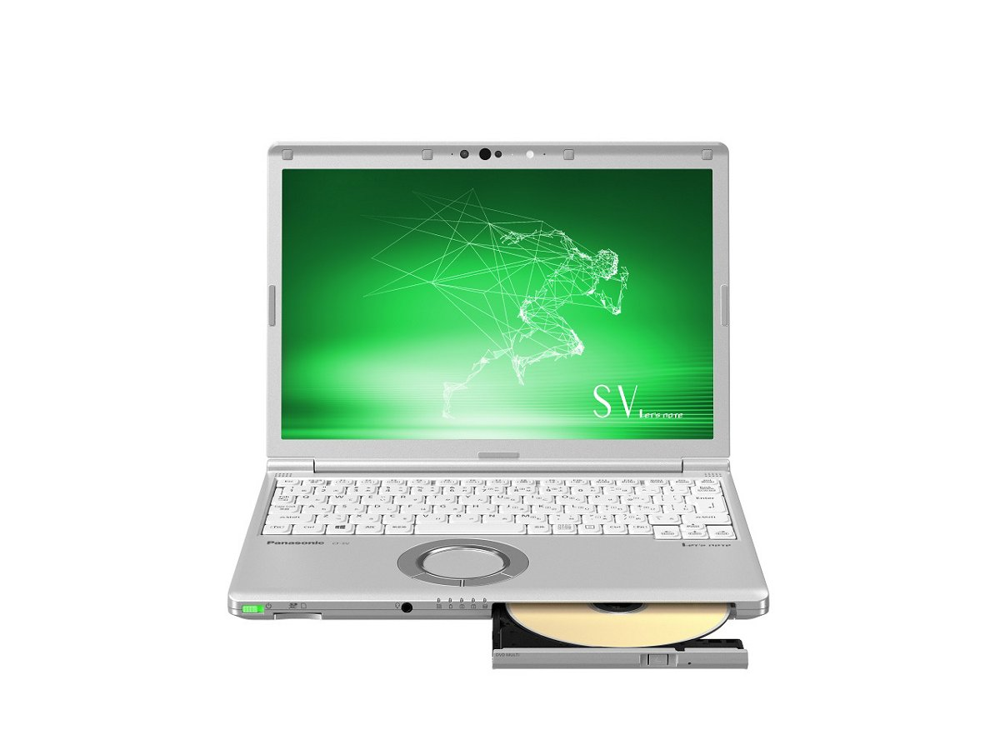
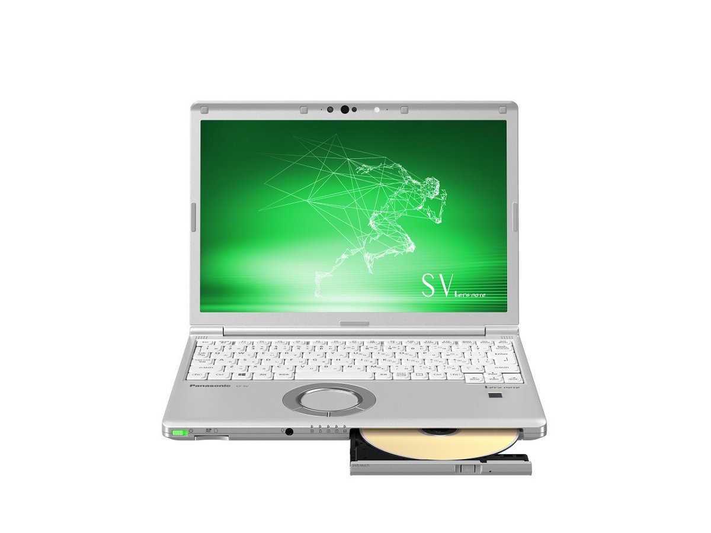
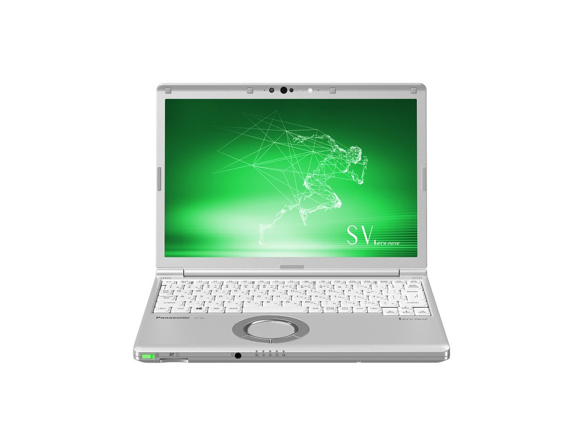
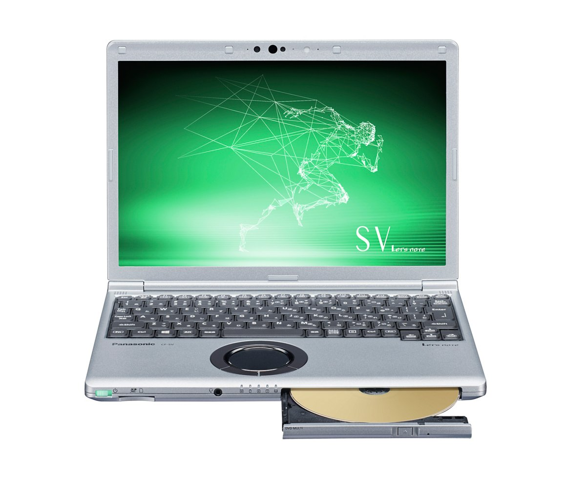
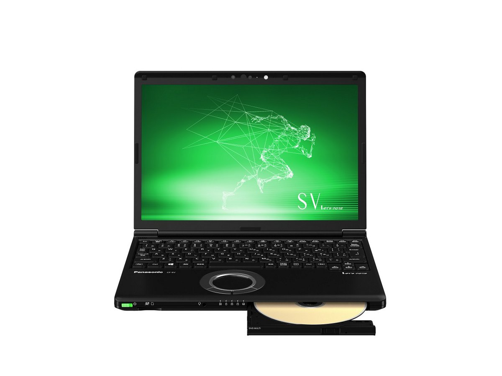
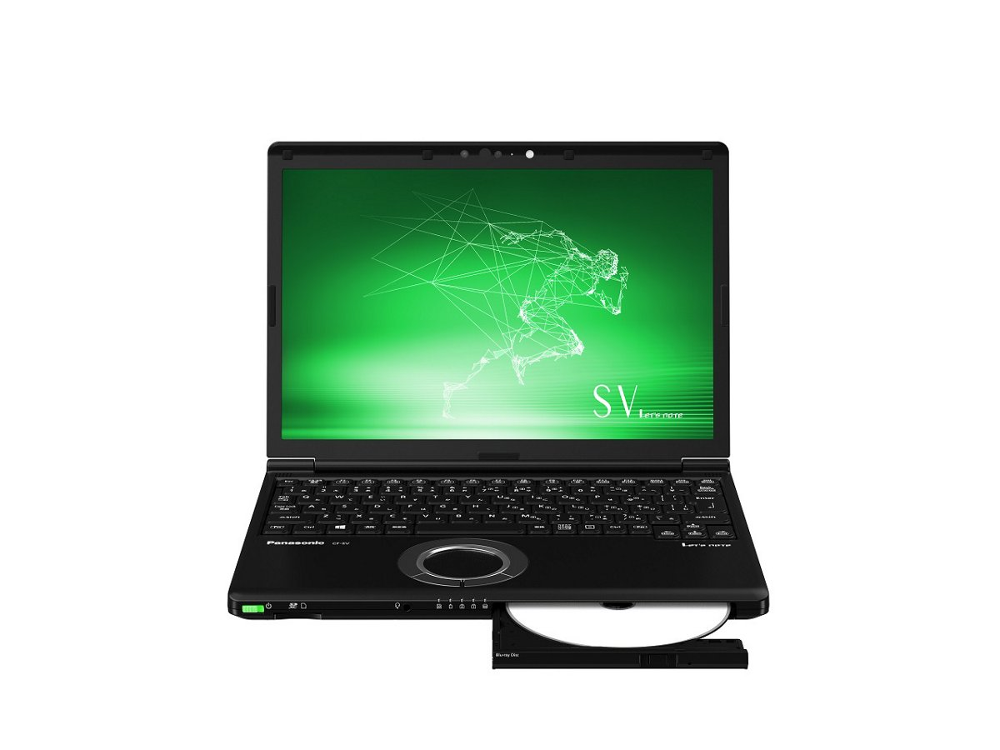

# 松下 Let's note CF-SV8 规格参数

[English](../../en/CF-SV8/) · [日本語](../../ja/CF-SV8/) · **中文**

🗄️ 在 [Let's note 陈列柜](https://letsnote-specs.github.io/zh/CF-SV8/)中查看此机型

**CF-SV8** 是松下 Let's note 笔记本电脑，属于 SV 系列，配备 12.1英寸 WUXGA 屏幕。本页收录其全部 19 个型号（2019-01 – 2019-10 发售）的规格参数。每个型号均附官方规格表链接。

*松下 Let's note CF-SV8（CF-SV8CDFPR, CF-SV8CDGQR, CF-SV8CFGQR, CF-SV8CFBQR），银色。图片 © Panasonic*

## 型号列表

| 型号（品番） | 发售 | 停产 | 主要规格 |
| :-- | :-- | :-- | :-- |
| [CF-SV8FDSQR](https://panasonic.jp/pc/p-db/CF-SV8FDSQR_spec.html) | 2019-10 | 2020-05 | Windows 10 Pro 64位、Intel® CoreTM i5-8265U 处理器、内存：8GB（无扩展插槽）、SSD：256GB、Super Multi Drive、LAN、无线LAN 802.11a（W52/W53/W56）/b/g/n/ac、Microsoft® Office Home and Business 2019 |
| [CF-SV8FDMQR](https://panasonic.jp/pc/p-db/CF-SV8FDMQR_spec.html) | 2019-10 | 2020-05 | Windows 10 Pro 64位、Intel® CoreTM i5-8265U 处理器、内存：16GB（无扩展插槽）、SSD：256GB、Super Multi Drive、LAN、无线LAN 802.11a（W52/W53/W56）/b/g/n/ac、Microsoft® Office Home and Business 2019 |
| [CF-SV8GDUQR](https://panasonic.jp/pc/p-db/CF-SV8GDUQR_spec.html) | 2019-10 | 2020-05 | Windows 10 Pro 64位、英特尔® CoreTM i7-8565U 处理器、内存：8GB（无扩展插槽）、SSD：256GB、DVD超级多用驱动器、LAN、无线LAN 802.11a（W52/W53/W56）/b/g/n/ac、Microsoft® Office Home and Business 2019 |
| [CF-SV8GFNQR](https://panasonic.jp/pc/p-db/CF-SV8GFNQR_spec.html) | 2019-10 | 2020-05 | Windows 10 Pro 64位、英特尔® CoreTM i7-8565U 处理器、内存：8GB（无扩展插槽）、SSD：512GB、蓝光光盘驱动器、LAN、无线LAN 802.11a（W52/W53/W56）/b/g/n/ac、支持LTE的无线WAN、Microsoft® Office Home and Business 2019 |
| [CF-SV8LDSQR](https://panasonic.jp/pc/p-db/CF-SV8LDSQR_spec.html) | 2019-06 | 2020-01 | Windows 10 Pro 64位、英特尔® CoreTM i7-8565U 处理器、内存：8GB（无扩展插槽）、SSD：256GB、DVD超级多用驱动器、LAN、无线LAN 802.11a（W52/W53/W56）/b/g/n/ac、Microsoft® Office Home and Business 2019 |
| [CF-SV8KDWQR](https://panasonic.jp/pc/p-db/CF-SV8KDWQR_spec.html) | 2019-06 | 2020-01 | Windows 10 Pro 64位、Intel® CoreTM i5-8265U 处理器、内存：8GB（无扩展插槽）、SSD：256GB、LAN、无线LAN 802.11a（W52/W53/W56）/b/g/n/ac、Microsoft® Office Home and Business 2019 |
| [CF-SV8KDGQR](https://panasonic.jp/pc/p-db/CF-SV8KDGQR_spec.html) | 2019-06 | 2020-01 | Windows 10 Pro 64位、Intel® CoreTM i5-8265U 处理器、内存：8GB（无扩展插槽）、SSD：256GB、Super Multi Drive、LAN、无线LAN 802.11a（W52/W53/W56）/b/g/n/ac、Microsoft® Office Home and Business 2019 |
| [CF-SV8KDRQR](https://panasonic.jp/pc/p-db/CF-SV8KDRQR_spec.html) | 2019-06 | 2020-01 | Windows 10 Pro 64位、Intel® CoreTM i5-8265U 处理器、内存：8GB（无扩展插槽）、SSD：512GB、Super Multi Drive、LAN、无线LAN 802.11a（W52/W53/W56）/b/g/n/ac、Microsoft® Office Home and Business 2019 |
| [CF-SV8KDPQR](https://panasonic.jp/pc/p-db/CF-SV8KDPQR_spec.html) | 2019-06 | 2020-01 | Windows 10 Pro 64位、Intel® CoreTM i5-8265U 处理器、内存：16GB（无扩展插槽）、SSD：256GB、Super Multi Drive、LAN、无线LAN 802.11a（W52/W53/W56）/b/g/n/ac、支持LTE的无线WAN、Microsoft® Office Home and Business 2019 |
| [CF-SV8KDMQR](https://panasonic.jp/pc/p-db/CF-SV8KDMQR_spec.html) | 2019-06 | 2020-01 | Windows 10 Pro 64位、Intel® CoreTM i5-8265U 处理器、内存：8GB（无扩展插槽）、SSD：256GB、Super Multi Drive、LAN、无线LAN 802.11a（W52/W53/W56）/b/g/n/ac、Microsoft® Office Home and Business 2019 |
| [CF-SV8LDUQR](https://panasonic.jp/pc/p-db/CF-SV8LDUQR_spec.html) | 2019-06 | 2020-01 | Windows 10 Pro 64位、英特尔® CoreTM i7-8565U 处理器、内存：8GB（无扩展插槽）、SSD：256GB、DVD超级多用驱动器、LAN、无线LAN 802.11a（W52/W53/W56）/b/g/n/ac、Microsoft® Office Home and Business 2019 |
| [CF-SV8LFNQR](https://panasonic.jp/pc/p-db/CF-SV8LFNQR_spec.html) | 2019-06 | 2020-01 | Windows 10 Pro 64位、英特尔® CoreTM i7-8565U 处理器、内存：8GB（无扩展插槽）、SSD：512GB、蓝光光盘驱动器、LAN、无线LAN 802.11a（W52/W53/W56）/b/g/n/ac、支持LTE的无线WAN、Microsoft® Office Home and Business 2019 |
| [CF-SV8CDWQR](https://panasonic.jp/pc/p-db/CF-SV8CDWQR_spec.html) | 2019-01 | 2019-10 | Windows 10 Pro 64位、Intel® CoreTM i5-8265U 处理器、内存：8GB（无扩展插槽）、SSD：256GB、LAN、无线LAN 802.11a（W52/W53/W56）/b/g/n/ac、Microsoft® Office Home and Business 2019 |
| [CF-SV8CDFPR](https://panasonic.jp/pc/p-db/CF-SV8CDFPR_spec.html) | 2019-01 | 2019-10 | Windows 10 Home 64位、Intel® CoreTM i5-8265U 处理器、内存：8GB（无扩展插槽）、SSD：128GB、超级多功能驱动器、LAN、无线LAN 802.11a（W52/W53/W56）/b/g/n/ac、Microsoft® Office Home and Business 2019 |
| [CF-SV8CDGQR](https://panasonic.jp/pc/p-db/CF-SV8CDGQR_spec.html) | 2019-01 | 2019-10 | Windows 10 Pro 64位、Intel® CoreTM i5-8265U 处理器、内存：8GB（无扩展插槽）、SSD：256GB、Super Multi Drive、LAN、无线LAN 802.11a（W52/W53/W56）/b/g/n/ac、Microsoft® Office Home and Business 2019 |
| [CF-SV8CFGQR](https://panasonic.jp/pc/p-db/CF-SV8CFGQR_spec.html) | 2019-01 | 2019-10 | Windows 10 Pro 64位、Intel® CoreTM i5-8265U 处理器、内存：8GB（无扩展插槽）、SSD：256GB、Super Multi Drive、LAN、无线LAN 802.11a（W52/W53/W56）/b/g/n/ac、支持LTE的无线WAN、Microsoft® Office Home and Business 2019 |
| [CF-SV8CFBQR](https://panasonic.jp/pc/p-db/CF-SV8CFBQR_spec.html) | 2019-01 | 2019-10 | Windows 10 Pro 64位、Intel® CoreTM i5-8265U 处理器、内存：16GB（无扩展插槽）、SSD：256GB、Super Multi Drive、LAN、无线LAN 802.11a（W52/W53/W56）/b/g/n/ac、支持LTE的无线WAN、Microsoft® Office Home and Business 2019 |
| [CF-SV8DDUQR](https://panasonic.jp/pc/p-db/CF-SV8DDUQR_spec.html) | 2019-01 | 2019-10 | Windows 10 Pro 64位、英特尔® CoreTM i7-8565U 处理器、内存：8GB（无扩展插槽）、SSD：256GB、DVD超级多用驱动器、LAN、无线LAN 802.11a（W52/W53/W56）/b/g/n/ac、Microsoft® Office Home and Business 2019 |
| [CF-SV8DFNQR](https://panasonic.jp/pc/p-db/CF-SV8DFNQR_spec.html) | 2019-01 | 2019-10 | Windows 10 Pro 64位、英特尔® CoreTM i7-8565U 处理器、内存：8GB（无扩展插槽）、SSD：512GB、蓝光光盘驱动器、LAN、无线LAN 802.11a（W52/W53/W56）/b/g/n/ac、支持LTE的无线WAN、Microsoft® Office Home and Business 2019 |

## 通用规格

| 项目 | 规格 |
| :-- | :-- |
| 芯片组 | 内置于CPU |
| 显示屏 | 12.1英寸(16:10)WUXGA TFT彩色液晶（1920 x 1200像素）、防眩光 |
| 显示屏 / 色彩 | 1920×1200像素：约1677万色 |
| 显示屏 / 同时显示 | 1024×768、1280×768、1280×1024、1360×768、1366×768、1400×1050、1600×900、1600×1200、1680×1050、1920×1080、1920×1200像素：约1677万色 |
| 无线网络 | 符合IEEE802.11a（W52/W53/W56）/b/g/n/ac（支持WPA2-AES/TKIP、符合Wi-Fi） |
| 有线网络 | 1000BASE-T/100BASE-TX/10BASE-T |
| 蓝牙 | Bluetooth v5.0 / ■支持配置文件 / 【Classic】 / ・A2DP（Source） / ・AVRCP（Target） / ・HCRP（Client） / ・HFP（AG） / ・HID（Host） / ・OPP（Client和Server） / ・PAN（User） / ・SPP（DevA和DevB） / 【Low Energy】 / ・HOGP（Host） |
| 安全芯片 | TPM（符合TCG V2.0） |
| 内存扩展槽 | 无 |
| 摄像头 | 支持人脸识别的摄像头，有效像素：最大 1920x1080像素（约207万像素） |
| 麦克风 | 阵列麦克风 |
| 传感器 | 照度传感器 |
| 键盘 | 符合OADG标准86键、键距19mm（横向）/16mm（纵向）（部分键除外） |
| 指点设备 | 滚轮触控板 |
| 功耗 | 最大约85W |
| 能效达成率（2011 年度标准） | — |
| Microsoft Office | Microsoft® Office Home and Business 2019 |

## 各型号差异

| 型号（品番） | 处理器 | 内存 | 存储 | 重量 | 续航 |
| :-- | :-- | :-- | :-- | :-- | :-- |
| CF-SV8FDSQR | Core i5-8265U | 8GB LPDDR3 SDRAM | 256GB | 1.009 kg | 13 h |
| CF-SV8FDMQR | Core i5-8265U | 16GB LPDDR3 SDRAM | 256GB | 1.009 kg | 12.5 h |
| CF-SV8GDUQR | Core i7-8565U | 8GB LPDDR3 SDRAM | 256GB | 1.109 kg | 20 h |
| CF-SV8GFNQR | Core i7-8565U | 8GB LPDDR3 SDRAM | 512GB | 1.169 kg | 20 h |
| CF-SV8LDSQR | Core i7-8565U | 8GB LPDDR3 SDRAM | 256GB | 1.009 kg | 14 h |
| CF-SV8KDWQR | Core i5-8265U | 8GB LPDDR3 SDRAM | 256GB | 0.919 kg | 14 h |
| CF-SV8KDGQR | Core i5-8265U | 8GB LPDDR3 SDRAM | 256GB | 0.999 kg | 14 h |
| CF-SV8KDRQR | Core i5-8265U | 8GB LPDDR3 SDRAM | 512GB | 0.999 kg | 14 h |
| CF-SV8KDPQR | Core i5-8265U | 16GB LPDDR3 SDRAM | 256GB | 0.999 kg | 13.5 h |
| CF-SV8KDMQR | Core i5-8265U | 8GB LPDDR3 SDRAM | 256GB | 0.999 kg | 14 h |
| CF-SV8LDUQR | Core i7-8565U | 8GB LPDDR3 SDRAM | 256GB | 1.099 kg | 21 h |
| CF-SV8LFNQR | Core i7-8565U | 8GB LPDDR3 SDRAM | 512GB | 1.159 kg | 21 h |
| CF-SV8CDWQR | Core i5-8265U | 8GB LPDDR3 SDRAM | 256GB | 0.919 kg | 14 h |
| CF-SV8CDFPR | Core i5-8265U | 8GB LPDDR3 SDRAM | 128GB | 0.999 kg | 14 h |
| CF-SV8CDGQR | Core i5-8265U | 8GB LPDDR3 SDRAM | 256GB | 0.999 kg | 14 h |
| CF-SV8CFGQR | Core i5-8265U | 8GB LPDDR3 SDRAM | 256GB | 1.024 kg | 14 h |
| CF-SV8CFBQR | Core i5-8265U | 16GB LPDDR3 SDRAM | 256GB | 1.124 kg | 20.5 h |
| CF-SV8DDUQR | Core i7-8565U | 8GB LPDDR3 SDRAM | 256GB | 1.099 kg | 21 h |
| CF-SV8DFNQR | Core i7-8565U | 8GB LPDDR3 SDRAM | 512GB | 1.159 kg | 21 h |

CF-SV8FDSQR 的全部差异规格

| 项目 | 规格 |
| :-- | :-- |
| 操作系统 | Windows 10 Pro 64位（日文版） |
| 处理器 | 英特尔® Core™ i5-8265U 处理器 / （英特尔®智能缓存6MB、运行频率1.60GHz、使用英特尔® 睿频加速技术2.0时最高3.90GHz） |
| 内存 | 8GB LPDDR3 SDRAM（无扩展插槽） |
| 显存 | 最大4130MB（与主内存共享） |
| 固态硬盘 | 闪存驱动器（SSD）256GB（PCIe）上述容量中约15GB用作恢复区域、约1GB用作系统区域（用户不可使用） |
| 光驱 | 内置超级多功能驱动器（DVD/CD） 配备缓冲区欠载错误防止功能 |
| 光驱速度 / 读取 | DVD-RAM：最大5倍速 / DVD-ROM：最大8倍速 / DVD-R：最大8倍速 / DVD-R DL：最大8倍速 / DVD-RW：最大8倍速 / +R：最大8倍速 / +R DL：最大8倍速 / +RW：最大8倍速 / High Speed +RW：最大8倍速 / CD-ROM：最大24倍速 / CD-R：最大24倍速 / CD-RW：最大24倍速 / High-Speed CD-RW：最大24倍速 / Ultra-Speed CD-RW：最大24倍速 |
| 光驱速度 / 写入 | DVD-RAM 改写：最高5倍速 / DVD-R 写入：最高8倍速 / DVD-R DL 写入：最高6倍速 / DVD-RW 改写：最高6倍速 / +R 写入：最高8倍速 / +R DL 写入：最高6倍速 / +RW 改写：最高4倍速 / High Speed +RW 改写：最高8倍速 / CD-R 写入：最高24倍速 / CD-RW 改写：4倍速 / High-Speed CD-RW 改写：10倍速 / Ultra-Speed CD-RW 改写：最高16倍速 |
| 支持光盘 / 读取 | DVD-RAM（ 1.4GB、2.8GB、4.7GB、9.4GB ） / DVD-ROM（单层、双层） / DVD-Video（单层、双层） / DVD-R（ 1.4GB、2.8GB、3.95GB、4.7GB ） / DVD-R DL（ 8.5GB ） / DVD-RW（ Ver.1.1/1.2 1.4GB、2.8GB、4.7GB、9.4GB ） / +R（ 4.7GB ） / +R DL（ 8.5GB ） / +RW（ 4.7GB ） / High Speed +RW（ 4.7GB ） / CD-Audio / CD-ROM（支持XA） / Photo CD（支持多区段） / Video CD / CD EXTRA / CD-TEXT / CD-R / CD-RW / High-Speed CD-RW / Ultra-Speed CD-RW |
| 支持光盘 / 写入 | DVD-RAM（ 1.4GB、2.8GB、4.7GB、9.4GB） / DVD-R（ 1.4GB、2.8 GB、4.7GB for General） / DVD-R DL（ 8.5GB ） / DVD-RW（ Ver.1.1/1.2 1.4GB、2.8GB、4.7GB、9.4GB） / +R（ 4.7GB ） / +R DL（ 8.5GB ） / +RW（ 4.7GB ） / High Speed +RW（ 4.7GB） / CD-R / CD-RW / High-Speed CD-RW / Ultra-Speed CD-RW |
| 显示屏 / 显卡 | 英特尔®UHD 显卡620（CPU内置） |
| 显示屏 / 外接显示输出 | 1024×768、1280×768、1280×1024、1360×768、1366×768、1400×1050、1600×900、1600×1200、1680×1050、1920×1080、1920×1200像素：约1677万色 / 仅HDMI输出：2560Ｘ1440、3840×2160（30 Hz/60 Hz）、4096×2160（30 Hz/60 Hz） |
| 无线通信模块 | 英特尔® Wireless-AC 9560 |
| LTE | 未配备 |
| 音频 | PCM音源（24位立体声）、英特尔® High Definition Audio标准、立体声扬声器 |
| 安全（Windows Hello） | 支持人脸识别的摄像头/指纹传感器（触摸式） |
| SD 卡槽 | SD存储卡×1插槽（支持SDHC存储卡/SDXC存储卡/支持版权保护技术/支持UHS-I・UHS-Ⅱ高速传输） |
| 接口 | ・USB3.1 Type-C端口（支持Thunderbolt™3、USB Power Delivery） / ・USB3.0 Type-A端口×3（其中1个兼作手机充电） / ・LAN接口（RJ-45） / ・外接显示器接口（模拟RGB 迷你D-sub 15针） / ・HDMI输出端子（支持4K60p输出） / ・耳麦端子（麦克风输入＋音频输出）（耳麦迷你插孔3.5mm、CTIA标准） |
| 电源 | ▼AC适配器 / 输入：AC100V～240V、50Hz/60Hz、输出：DC16V、5.3A、电源线仅限100V专用 / ▼电池组（S） / 7.2V锂离子・额定容量5900mAh |
| 能效 | 2011年度标准 N分类0.024 |
| 续航 / 充电时间 | ▼续航时间 / （JEITA Ver.2.0） / 约13小时 / ▼充电时间 / 约3小时（电源OFF时）、约3小时（电源ON时） |
| 尺寸（宽×深×高） | 宽283.5mm×深203.8mm×高24.5mm（不含突起部） |
| 颜色 | 银色 |
| 重量（含电池） | 电脑本体：约1.009kg（安装附带电池组(S)（约255g）时） / AC适配器：约260g（不含电源线（约60g）） |
| 预装软件 | ・Microsoft® Internet Explorer 11 / ・Microsoft® Edge / ・Microsoft® .NET Framework 4.8 / ・Microsoft® Windows Media Player 12 / ・McAfee LiveSafe（60天免费体验版） / ・i-Filter 6.0（30天免费试用版） / ・WinZip 20.5日语版（45天体验版） / ・Power2Go for Panasonic / ・PowerDirector for Panasonic / ・CyberLink PowerDVD14 / ・Aptio Setup实用程序 / ・PC-Diagnostic实用程序 / ・Panasonic PC设置实用程序 / ・硬盘数据擦除实用程序 / ・DirectX 12 / ・PC信息查看器 / ・Panasonic PC恢复光盘创建实用程序 / ・Panasonic PC Camera Utility |
| 附件 | 电池组(S)、AC适配器、使用说明书、Microsoft Office Home & Business 2019等 |

官方规格表: <https://panasonic.jp/pc/p-db/CF-SV8FDSQR_spec.html>

CF-SV8FDMQR 的全部差异规格

| 项目 | 规格 |
| :-- | :-- |
| 操作系统 | Windows 10 Pro 64位（日文版） |
| 处理器 | 英特尔® Core™ i5-8265U 处理器 / （英特尔®智能缓存6MB、运行频率1.60GHz、使用英特尔® 睿频加速技术2.0时最高3.90GHz） |
| 内存 | 16GB LPDDR3 SDRAM（无扩展插槽） |
| 显存 | 最大8242MB（与主内存共享） |
| 固态硬盘 | 闪存驱动器（SSD）256GB（PCIe）上述容量中约15GB用作恢复区域、约1GB用作系统区域（用户不可使用） |
| 光驱 | 内置超级多功能驱动器（DVD/CD） 配备缓冲区欠载错误防止功能 |
| 光驱速度 / 读取 | DVD-RAM：最大5倍速 / DVD-ROM：最大8倍速 / DVD-R：最大8倍速 / DVD-R DL：最大8倍速 / DVD-RW：最大8倍速 / +R：最大8倍速 / +R DL：最大8倍速 / +RW：最大8倍速 / High Speed +RW：最大8倍速 / CD-ROM：最大24倍速 / CD-R：最大24倍速 / CD-RW：最大24倍速 / High-Speed CD-RW：最大24倍速 / Ultra-Speed CD-RW：最大24倍速 |
| 光驱速度 / 写入 | DVD-RAM 改写：最高5倍速 / DVD-R 写入：最高8倍速 / DVD-R DL 写入：最高6倍速 / DVD-RW 改写：最高6倍速 / +R 写入：最高8倍速 / +R DL 写入：最高6倍速 / +RW 改写：最高4倍速 / High Speed +RW 改写：最高8倍速 / CD-R 写入：最高24倍速 / CD-RW 改写：4倍速 / High-Speed CD-RW 改写：10倍速 / Ultra-Speed CD-RW 改写：最高16倍速 |
| 支持光盘 / 读取 | DVD-RAM（ 1.4GB、2.8GB、4.7GB、9.4GB ） / DVD-ROM（单层、双层） / DVD-Video（单层、双层） / DVD-R（ 1.4GB、2.8GB、3.95GB、4.7GB ） / DVD-R DL（ 8.5GB ） / DVD-RW（ Ver.1.1/1.2 1.4GB、2.8GB、4.7GB、9.4GB ） / +R（ 4.7GB ） / +R DL（ 8.5GB ） / +RW（ 4.7GB ） / High Speed +RW（ 4.7GB ） / CD-Audio / CD-ROM（支持XA） / Photo CD（支持多区段） / Video CD / CD EXTRA / CD-TEXT / CD-R / CD-RW / High-Speed CD-RW / Ultra-Speed CD-RW |
| 支持光盘 / 写入 | DVD-RAM（ 1.4GB、2.8GB、4.7GB、9.4GB） / DVD-R（ 1.4GB、2.8 GB、4.7GB for General） / DVD-R DL（ 8.5GB ） / DVD-RW（ Ver.1.1/1.2 1.4GB、2.8GB、4.7GB、9.4GB） / +R（ 4.7GB ） / +R DL（ 8.5GB ） / +RW（ 4.7GB ） / High Speed +RW（ 4.7GB） / CD-R / CD-RW / High-Speed CD-RW / Ultra-Speed CD-RW |
| 显示屏 / 显卡 | 英特尔®UHD 显卡620（CPU内置） |
| 显示屏 / 外接显示输出 | 1024×768、1280×768、1280×1024、1360×768、1366×768、1400×1050、1600×900、1600×1200、1680×1050、1920×1080、1920×1200像素：约1677万色 / 仅HDMI输出：2560Ｘ1440、3840×2160（30 Hz/60 Hz）、4096×2160（30 Hz/60 Hz） |
| 无线通信模块 | 英特尔® Wireless-AC 9560 |
| LTE | 未配备 |
| 音频 | PCM音源（24位立体声）、英特尔® High Definition Audio标准、立体声扬声器 |
| 安全（Windows Hello） | 支持人脸识别的摄像头/指纹传感器（触摸式） |
| SD 卡槽 | SD存储卡×1插槽（支持SDHC存储卡/SDXC存储卡/支持版权保护技术/支持UHS-I・UHS-Ⅱ高速传输） |
| 接口 | ・USB3.1 Type-C端口（支持Thunderbolt™3、USB Power Delivery） / ・USB3.0 Type-A端口×3（其中1个兼作手机充电） / ・LAN接口（RJ-45） / ・外接显示器接口（模拟RGB 迷你D-sub 15针） / ・HDMI输出端子（支持4K60p输出） / ・耳麦端子（麦克风输入＋音频输出）（耳麦迷你插孔3.5mm、CTIA标准） |
| 电源 | ▼AC适配器 / 输入：AC100V～240V、50Hz/60Hz、输出：DC16V、5.3A、电源线仅限100V专用 / ▼电池组（S） / 7.2V锂离子・额定容量5900mAh |
| 能效 | 2011年度基准M区分0.024 |
| 续航 / 充电时间 | ▼续航时间 / （JEITA Ver.2.0） / 约12.5小时 / ▼充电时间 / 约3小时（电源OFF时）、约3小时（电源ON时） |
| 尺寸（宽×深×高） | 宽283.5mm×深203.8mm×高24.5mm（不含突起部） |
| 颜色 | 银色&黑色 |
| 重量（含电池） | 电脑本体：约1.009kg（安装附带电池组(S)（约255g）时） / AC适配器：约260g（不含电源线（约60g）） |
| 预装软件 | ・Microsoft® Internet Explorer 11 / ・Microsoft® Edge / ・Microsoft® .NET Framework 4.8 / ・Microsoft® Windows Media Player 12 / ・McAfee LiveSafe（60天免费体验版） / ・i-Filter 6.0（30天免费试用版） / ・WinZip 20.5日语版（45天体验版） / ・Power2Go for Panasonic / ・PowerDirector for Panasonic / ・CyberLink PowerDVD14 / ・Aptio Setup实用程序 / ・PC-Diagnostic实用程序 / ・Panasonic PC设置实用程序 / ・硬盘数据擦除实用程序 / ・DirectX 12 / ・PC信息查看器 / ・Panasonic PC恢复光盘创建实用程序 / ・Panasonic PC Camera Utility |
| 附件 | 电池组(S)、AC适配器、使用说明书、Microsoft Office Home & Business 2019等 |

官方规格表: <https://panasonic.jp/pc/p-db/CF-SV8FDMQR_spec.html>

CF-SV8GDUQR 的全部差异规格

| 项目 | 规格 |
| :-- | :-- |
| 操作系统 | Windows 10 Pro 64位（日文版） |
| 处理器 | 英特尔® Core™ i7-8565U 处理器 / （英特尔®智能缓存8MB、运行频率1.80GHz、使用英特尔® 睿频加速技术2.0时最高4.60GHz） |
| 内存 | 8GB LPDDR3 SDRAM（无扩展插槽） |
| 显存 | 最大4130MB（与主内存共享） |
| 固态硬盘 | 闪存驱动器（SSD）256GB（PCIe）上述容量中约15GB用作恢复区域、约1GB用作系统区域（用户不可使用） |
| 光驱 | 内置超级多功能驱动器（DVD/CD） 配备缓冲区欠载错误防止功能 |
| 光驱速度 / 读取 | DVD-RAM：最大5倍速 / DVD-ROM：最大8倍速 / DVD-R：最大8倍速 / DVD-R DL：最大8倍速 / DVD-RW：最大8倍速 / +R：最大8倍速 / +R DL：最大8倍速 / +RW：最大8倍速 / High Speed +RW：最大8倍速 / CD-ROM：最大24倍速 / CD-R：最大24倍速 / CD-RW：最大24倍速 / High-Speed CD-RW：最大24倍速 / Ultra-Speed CD-RW：最大24倍速 |
| 光驱速度 / 写入 | DVD-RAM 改写：最高5倍速 / DVD-R 写入：最高8倍速 / DVD-R DL 写入：最高6倍速 / DVD-RW 改写：最高6倍速 / +R 写入：最高8倍速 / +R DL 写入：最高6倍速 / +RW 改写：最高4倍速 / High Speed +RW 改写：最高8倍速 / CD-R 写入：最高24倍速 / CD-RW 改写：4倍速 / High-Speed CD-RW 改写：10倍速 / Ultra-Speed CD-RW 改写：最高16倍速 |
| 支持光盘 / 读取 | DVD-RAM（ 1.4GB、2.8GB、4.7GB、9.4GB ） / DVD-ROM（单层、双层） / DVD-Video（单层、双层） / DVD-R（ 1.4GB、2.8GB、3.95GB、4.7GB ） / DVD-R DL（ 8.5GB ） / DVD-RW（ Ver.1.1/1.2 1.4GB、2.8GB、4.7GB、9.4GB ） / +R（ 4.7GB ） / +R DL（ 8.5GB ） / +RW（ 4.7GB ） / High Speed +RW（ 4.7GB ） / CD-Audio / CD-ROM（支持XA） / Photo CD（支持多区段） / Video CD / CD EXTRA / CD-TEXT / CD-R / CD-RW / High-Speed CD-RW / Ultra-Speed CD-RW |
| 支持光盘 / 写入 | DVD-RAM（ 1.4GB、2.8GB、4.7GB、9.4GB） / DVD-R（ 1.4GB、2.8 GB、4.7GB for General） / DVD-R DL（ 8.5GB ） / DVD-RW（ Ver.1.1/1.2 1.4GB、2.8GB、4.7GB、9.4GB） / +R（ 4.7GB ） / +R DL（ 8.5GB ） / +RW（ 4.7GB ） / High Speed +RW（ 4.7GB） / CD-R / CD-RW / High-Speed CD-RW / Ultra-Speed CD-RW |
| 显示屏 / 显卡 | 英特尔®UHD 显卡620（CPU内置） |
| 显示屏 / 外接显示输出 | 1024×768、1280×768、1280×1024、1360×768、1366×768、1400×1050、1600×900、1600×1200、1680×1050、1920×1080、1920×1200像素：约1677万色 / 仅HDMI输出：2560Ｘ1440、3840×2160（30 Hz/60 Hz）、4096×2160（30 Hz/60 Hz） |
| 无线通信模块 | 英特尔® Wireless-AC 9560 |
| LTE | 未配备 |
| 音频 | PCM音源（24位立体声）、英特尔® High Definition Audio标准、立体声扬声器 |
| 安全（Windows Hello） | 支持人脸识别的摄像头/指纹传感器（触摸式） |
| SD 卡槽 | SD存储卡×1插槽（支持SDHC存储卡/SDXC存储卡/支持版权保护技术/支持UHS-I・UHS-Ⅱ高速传输） |
| 接口 | ・USB3.1 Type-C端口（支持Thunderbolt™3、USB Power Delivery） / ・USB3.0 Type-A端口×3（其中1个兼作手机充电） / ・LAN接口（RJ-45） / ・外接显示器接口（模拟RGB 迷你D-sub 15针） / ・HDMI输出端子（支持4K60p输出） / ・耳麦端子（麦克风输入＋音频输出）（耳麦迷你插孔3.5mm、CTIA标准） |
| 电源 | ▼AC适配器 / 输入：AC100V～240V、50Hz/60Hz、输出：DC16V、5.3A、电源线仅限100V专用 / ▼电池组（L） / 10.8V锂离子・额定容量6300mAh |
| 能效 | 2011年度标准 N分类0.021 |
| 续航 / 充电时间 | ▼续航时间 / （JEITA Ver.2.0） / 约20小时 / ▼充电时间 / 约3小时（电源OFF时）、约3小时（电源ON时） |
| 尺寸（宽×深×高） | 宽283.5mm×深203.8mm×高24.5mm（不含突起部） |
| 颜色 | 黑色 |
| 重量（含电池） | 电脑主机：约1.109kg（安装附带的电池组（L）（约355g）时） / AC适配器：约260g（不含电源线（约60g）） |
| 预装软件 | ・Microsoft® Internet Explorer 11 / ・Microsoft® Edge / ・Microsoft® .NET Framework 4.8 / ・Microsoft® Windows Media Player 12 / ・McAfee LiveSafe（60天免费体验版） / ・i-Filter 6.0（30天免费试用版） / ・WinZip 20.5日语版（45天体验版） / ・Power2Go for Panasonic / ・PowerDirector for Panasonic / ・CyberLink PowerDVD14 / ・Aptio Setup实用程序 / ・PC-Diagnostic实用程序 / ・Panasonic PC设置实用程序 / ・硬盘数据擦除实用程序 / ・DirectX 12 / ・PC信息查看器 / ・Panasonic PC恢复光盘创建实用程序 / ・Panasonic PC Camera Utility |
| 附件 | 电池组(L)、AC适配器、使用说明书、Microsoft Office Home & Business 2019等 |

官方规格表: <https://panasonic.jp/pc/p-db/CF-SV8GDUQR_spec.html>

CF-SV8GFNQR 的全部差异规格

| 项目 | 规格 |
| :-- | :-- |
| 操作系统 | Windows 10 Pro 64位（日文版） |
| 处理器 | 英特尔® Core™ i7-8565U 处理器 / （英特尔®智能缓存8MB、运行频率1.80GHz、使用英特尔® 睿频加速技术2.0时最高4.60GHz） |
| 内存 | 8GB LPDDR3 SDRAM（无扩展插槽） |
| 显存 | 最大4130MB（与主内存共享） |
| 固态硬盘 | 闪存驱动器（SSD）512GB（PCIe）上述容量中约15GB用作恢复区域、约1GB用作系统区域（用户不可使用） |
| 光驱 | 内置蓝光光盘驱动器 / DVD超级多功能光驱功能/配备缓冲欠载错误防止功能 |
| 光驱速度 / 读取 | BD-ROM：最大6倍速 / BD-R：最大6倍速 / BD-R DL：最大6倍速 / BD-R LTH：最大6倍速 / BD-R XL：最大6倍速 / BD-RE：最大6倍速 / BD-RE DL：最大6倍速 / BD-RE XL：最大4倍速 / DVD-RAM：最大5倍速 / DVD-ROM：最大8倍速 / DVD-R：最大8倍速 / DVD-R DL：最大8倍速 / DVD-RW：最大8倍速 / +R：最大8倍速 / +R DL：最大8倍速 / +RW：最大8倍速 / High Speed +RW：最大8倍速 / CD-ROM：最大24倍速 / CD-R：最大24倍速 / CD-RW：最大24倍速 / High-Speed CD-RW：最大24倍速 / Ultra-Speed CD-RW：最大24倍速 |
| 光驱速度 / 写入 | BD-R写入：最大6倍速 / BD-R DL写入：最大6倍速 / BD-R LTH 写入：最大4倍速 / BD-R XL写入：最大4倍速 / BD-RE改写：2倍速 / BD-RE DL改写：2倍速 / BD-RE XL 改写：2倍速 / DVD-RAM改写：最大5倍速 / DVD-R 写入：最大8倍速 / DVD-R DL写入：最大6倍速 / DVD-RW改写：最大6倍速 / +R 写入：最大8倍速 / +R DL写入：最大6倍速 / +RW 改写：最大4倍速 / High Speed +RW改写：最大8倍速 / CD-R 写入：最大24倍速 / CD-RW 改写：4倍速 / High-Speed CD-RW改写：10倍速 / Ultra-Speed CD-RW改写：最大16倍速 |
| 支持光盘 / 读取 | BD-ROM / BD-R（Ver.1.1/1.2/1.3、25GB） / BD-R DL（Ver.1.1/1.2/1.3、50GB） / BD-R LTH（Ver.1.2/1.3、25GB） / BD-R XL（Ver.2.0、100GB） / BD-RE（Ver. 2.1、25GB） / BD-RE DL（Ver.2.1、50GB） / BD-RE XL（Ver.3.0、100GB） / DVD-RAM（ 1.4GB、2.8GB、4.7GB、9.4GB ） / DVD-ROM（单层、双层） / DVD-Video（单层、双层） / DVD-R（1.4GB、2.8GB、3.95GB、4.7GB） / DVD-R DL（8.5GB） / DVD-RW（Ver.1.1/1.2 1.4GB、2.8GB、4.7GB、9.4GB） / +R（4.7GB） / +R DL（8.5GB） / +RW（4.7GB） / High Speed +RW（4.7GB） / CD-Audio / CD-ROM（支持XA） / Photo CD（支持多区段） / Video CD / CD EXTRA / CD-TEXT / CD-R / CD-RW / High-Speed CD-RW / Ultra-Speed CD-RW |
| 支持光盘 / 写入 | BD-R（25GB） / BD-R DL（50GB） / BD-R LTH（25GB） / BD-R XL（100GB） / BD-RE（25GB） / BD-RE DL（50GB） / BD-RE XL（100GB） / DVD-RAM（1.4GB、2.8GB、4.7GB、9.4GB） / DVD-R（1.4GB、2.8 GB、4.7GB for General） / DVD-R DL（8.5GB） / DVD-RW（Ver.1.1/1.2 1.4GB、2.8GB、4.7GB、9.4GB） / +R（ 4.7GB） / +R DL（8.5GB） / +RW（ 4.7GB） / High Speed +RW（ 4.7GB） / CD-R / CD-RW / High-Speed CD-RW / Ultra-Speed CD-RW |
| 显示屏 / 显卡 | 英特尔®UHD 显卡620（CPU内置） |
| 显示屏 / 外接显示输出 | 1024×768、1280×768、1280×1024、1360×768、1366×768、1400×1050、1600×900、1600×1200、1680×1050、1920×1080、1920×1200像素：约1677万色 / 仅HDMI输出：2560Ｘ1440、3840×2160（30 Hz/60 Hz）、4096×2160（30 Hz/60 Hz） |
| 无线通信模块 | 英特尔® Wireless-AC 9560 |
| LTE | 内置无线WAN模块（支持LTE） |
| 音频 | PCM音源（24位立体声）、英特尔® High Definition Audio标准、立体声扬声器 |
| 安全（Windows Hello） | 支持人脸识别的摄像头/指纹传感器（触摸式） |
| 接口 | ・USB3.1 Type-C端口（支持Thunderbolt™3、USB Power Delivery） / ・USB3.0 Type-A端口×3（其中1个兼作手机充电） / ・LAN接口（RJ-45） / ・外接显示器接口（模拟RGB 迷你D-sub 15针） / ・HDMI输出端子（支持4K60p输出） / ・耳麦端子（麦克风输入＋音频输出）（耳麦迷你插孔3.5mm、CTIA标准） |
| 电源 | ▼AC适配器 / 输入：AC100V～240V、50Hz/60Hz、输出：DC16V、5.3A、电源线仅限100V专用 / ▼电池组（L） / 10.8V锂离子・额定容量6300mAh |
| 能效 | 2011年度标准 N分类0.021 |
| 续航 / 充电时间 | ▼续航时间 / （JEITA Ver.2.0） / 约20小时 / ▼充电时间 / 约3小时（电源OFF时）、约3小时（电源ON时） |
| 尺寸（宽×深×高） | 宽283.5mm×深203.8mm×高24.5mm（不含突起部） |
| 颜色 | 黑色 |
| 重量（含电池） | 电脑主机：约1.169kg（安装附带的电池组（L）（约355g）时） / AC适配器：约260g（不含电源线（约60g）） |
| 预装软件 | ・Microsoft® Internet Explorer 11 / ・Microsoft® Edge / ・Microsoft® .NET Framework 4.8 / ・Microsoft® Windows Media Player 12 / ・McAfee LiveSafe（60天免费体验版） / ・i-Filter 6.0（30天免费试用版） / ・WinZip 20.5日语版（45天体验版） / ・Power2Go for Panasonic / ・PowerDirector BD for Panasonic / ・CyberLink PowerDVD14 / ・Aptio Setup实用程序 / ・PC-Diagnostic实用程序 / ・Panasonic PC设置实用程序 / ・硬盘数据擦除实用程序 / ・DirectX 12 / ・PC信息查看器 / ・Panasonic PC恢复光盘创建实用程序 / ・Panasonic PC Camera Utility |
| 附件 | 电池组(L)、AC适配器、使用说明书、Microsoft Office Home & Business 2019等 |
| 卡槽 / SD 卡 | SD存储卡×1插槽（支持SDHC存储卡/SDXC存储卡/支持版权保护技术/支持UHS-I・UHS-Ⅱ高速传输） |
| 卡槽 / 其他 | nano SIM卡插槽 |

官方规格表: <https://panasonic.jp/pc/p-db/CF-SV8GFNQR_spec.html>

CF-SV8LDSQR 的全部差异规格

| 项目 | 规格 |
| :-- | :-- |
| 操作系统 | Windows 10 Pro 64位（日文版） |
| 处理器 | 英特尔 Core i7-8565U处理器 / 英特尔智能缓存8MB、工作频率1.80GHz（使用英特尔睿频加速技术2.0时最高4.60GHz） |
| 内存 | 8GB LPDDR3 SDRAM（无扩展插槽） |
| 显存 | 最大4130MB（与主内存共享） |
| 固态硬盘 | 闪存驱动器（SSD）256GB（Serial ATA）上述容量中约15GB用作恢复区域、约1GB用作系统区域（用户不可使用） |
| 光驱 | 内置超级多功能驱动器（DVD/CD） 配备缓冲区欠载错误防止功能 |
| 光驱速度 / 读取 | DVD-RAM：最大5倍速 / DVD-ROM：最大8倍速 / DVD-R：最大8倍速 / DVD-R DL：最大8倍速 / DVD-RW：最大8倍速 / +R：最大8倍速 / +R DL：最大8倍速 / +RW：最大8倍速 / High Speed +RW：最大8倍速 / CD-ROM：最大24倍速 / CD-R：最大24倍速 / CD-RW：最大24倍速 / High-Speed CD-RW：最大24倍速 / Ultra-Speed CD-RW：最大24倍速 |
| 光驱速度 / 写入 | DVD-RAM 改写：最高5倍速 / DVD-R 写入：最高8倍速 / DVD-R DL 写入：最高6倍速 / DVD-RW 改写：最高6倍速 / +R 写入：最高8倍速 / +R DL 写入：最高6倍速 / +RW 改写：最高4倍速 / High Speed +RW 改写：最高8倍速 / CD-R 写入：最高24倍速 / CD-RW 改写：4倍速 / High-Speed CD-RW 改写：10倍速 / Ultra-Speed CD-RW 改写：最高16倍速 |
| 支持光盘 / 读取 | DVD-RAM（ 1.4GB、2.8GB、4.7GB、9.4GB ） / DVD-ROM（单层、双层） / DVD-Video（单层、双层） / DVD-R（ 1.4GB、2.8GB、3.95GB、4.7GB ） / DVD-R DL（ 8.5GB ） / DVD-RW（ Ver.1.1/1.2 1.4GB、2.8GB、4.7GB、9.4GB ） / +R（ 4.7GB ） / +R DL（ 8.5GB ） / +RW（ 4.7GB ） / High Speed +RW（ 4.7GB ） / CD-Audio / CD-ROM（支持XA） / Photo CD（支持多区段） / Video CD / CD EXTRA / CD-TEXT / CD-R / CD-RW / High-Speed CD-RW / Ultra-Speed CD-RW |
| 支持光盘 / 写入 | DVD-RAM（ 1.4GB、2.8GB、4.7GB、9.4GB） / DVD-R（ 1.4GB、2.8 GB、4.7GB for General） / DVD-R DL（ 8.5GB ） / DVD-RW（ Ver.1.1/1.2 1.4GB、2.8GB、4.7GB、9.4GB） / +R（ 4.7GB ） / +R DL（ 8.5GB ） / +RW（ 4.7GB ） / High Speed +RW（ 4.7GB） / CD-R / CD-RW / High-Speed CD-RW / Ultra-Speed CD-RW |
| 显示屏 / 显卡 | 英特尔UHD 显卡620（内置于CPU） |
| 显示屏 / 外接显示输出 | 1024×768、1280×768、1280×1024、1360×768、1366×768、1400×1050、1600×900、1600×1200、1680×1050、1920×1080、1920×1200像素：约1677万色 / 仅HDMI输出：2560Ｘ1440、3840×2160（30 Hz/60 Hz）、4096×2160（30 Hz/60 Hz） |
| 无线通信模块 | 英特尔 Wireless-AC 9560 |
| LTE | 未配备 |
| 音频 | PCM音源（24位立体声）、英特尔 High Definition Audio标准、立体声扬声器 |
| SD 卡槽 | SD存储卡×1插槽（支持SDHC存储卡/SDXC存储卡/支持版权保护技术/支持UHS-I・UHS-Ⅱ高速传输） |
| 接口 | ・USB3.1 Type-C端口（支持Thunderbolt™3、USB Power Delivery） / ・USB3.0 Type-A端口×3（其中1个兼作手机充电） / ・LAN接口（RJ-45） / ・外接显示器接口（模拟RGB 迷你D-sub 15针） / ・HDMI输出端子（支持4K60p输出） / ・耳麦端子（麦克风输入＋音频输出）（耳麦迷你插孔3.5mm（M3）、CTIA标准） |
| 电源 | ▼AC适配器 / 输入：AC100V～240V、50Hz/60Hz、输出：DC16V、5.3A、电源线仅限100V专用 / ▼电池组（S） / 7.2V锂离子・额定容量5900mAh |
| 能效 | 2011年度标准 N分类0.021 |
| 续航 / 充电时间 | ▼续航时间 / （JEITA Ver.2.0） / 约14小时 / ▼充电时间 / 约3小时（电源OFF时）、约3小时（电源ON时） |
| 尺寸（宽×深×高） | 宽283.5mm×深203.8mm×高24.5mm 不含突起部 |
| 颜色 | 银色 |
| 重量（含电池） | 电脑本体：约1.009kg（安装附带电池组（S）（约255g）时） / AC适配器：约260g（不含电源线（约60g）） |
| 预装软件 | ・Microsoft® Internet Explorer 11 / ・Microsoft® Edge / ・Microsoft® .NET Framework 4.7 / ・Microsoft® Windows Media Player 12 / ・迈克菲 LiveSafe（60天免费试用版） / ・i-Filter 6.0（30天免费试用版） / ・WinZip 20.5 日语版（45天试用版） / ・Power2Go for Panasonic / ・PowerDirector for Panasonic / ・CyberLink PowerDVD14 / ・Aptio 设置实用程序 / ・PC-Diagnostic 实用程序 / ・Panasonic PC 设置实用程序 / ・硬盘数据擦除实用程序 / ・DirectX 12 / ・英特尔 PROSet/Wireless Software / ・PC 信息查看器 / ・Panasonic PC 恢复光盘创建实用程序 / ・Panasonic PC Camera Utility |
| 附件 | AC适配器、电池组(S)、使用说明书、Microsoft Office Home & Business 2019等 |
| 指纹传感器 | 触摸式 |

官方规格表: <https://panasonic.jp/pc/p-db/CF-SV8LDSQR_spec.html>

CF-SV8KDWQR 的全部差异规格

| 项目 | 规格 |
| :-- | :-- |
| 操作系统 | Windows 10 Pro 64位（日文版） |
| 处理器 | 英特尔 Core i5-8265U 处理器 / 英特尔智能缓存6MB，运行频率1.60GHz（使用英特尔 睿频加速技术2.0时最高3.90GHz） |
| 内存 | 8GB LPDDR3 SDRAM（无扩展插槽） |
| 显存 | 最大4130MB（与主内存共享） |
| 固态硬盘 | 闪存驱动器（SSD）256GB（Serial ATA）上述容量中约15GB用作恢复区域、约1GB用作系统区域（用户不可使用） |
| 光驱 | 未配备 |
| 显示屏 / 显卡 | 英特尔UHD 显卡620（内置于CPU） |
| 显示屏 / 外接显示输出 | 1024×768、1280×768、1280×1024、1360×768、1366×768、1400×1050、1600×900、1600×1200、1680×1050、1920×1080、1920×1200像素：约1677万色 / 仅HDMI输出：2560×1440、3840×2160（30 Hz/60 Hz）、4096×2160（30 Hz/60 Hz） |
| 无线通信模块 | 英特尔 Wireless-AC 9560 |
| LTE | 未配备 |
| 音频 | PCM音源（24位立体声）、英特尔 High Definition Audio标准、立体声扬声器 |
| SD 卡槽 | SD存储卡×1插槽（支持SDHC存储卡/SDXC存储卡/支持版权保护技术/支持UHS-I・UHS-Ⅱ高速传输） |
| 接口 | ・USB3.1 Type-C端口（支持Thunderbolt™3、USB Power Delivery） / ・USB3.0 Type-A端口×3（其中1个兼作手机充电） / ・LAN接口（RJ-45） / ・外接显示器接口（模拟RGB 迷你D-sub 15针） / ・HDMI输出端子（支持4K60p输出） / ・耳麦端子（麦克风输入＋音频输出）（耳麦迷你插孔3.5mm（M3）、CTIA标准） |
| 电源 | ▼AC适配器 / 输入：AC100V～240V、50Hz/60Hz、输出：DC16V、5.3A、电源线仅限100V专用 / ▼电池组（S） / 7.2V锂离子・额定容量5900mAh |
| 能效 | 2011年度标准 N分类0.024 |
| 续航 / 充电时间 | ▼续航时间 / （JEITA Ver.2.0） / 约14小时 / ▼充电时间 / 约3小时（电源OFF时）、约3小时（电源ON时） |
| 尺寸（宽×深×高） | 宽283.5mm×深203.8mm×高24.5mm 不含突起部 |
| 颜色 | 银色 |
| 重量（含电池） | 电脑主机：约0.919kg（安装附带的电池组（S）（约255g）时） / AC适配器：约260g（不含电源线（约60g）） |
| 预装软件 | ・Microsoft® Internet Explorer 11 / ・Microsoft® Edge / ・Microsoft® .NET Framework 4.7 / ・Microsoft® Windows Media Player 12 / ・迈克菲 LiveSafe（60天免费试用版） / ・i-Filter 6.0（30天免费试用版） / ・WinZip 20.5 日语版（45天试用版） / ・Aptio 设置实用程序 / ・PC-Diagnostic 实用程序 / ・Panasonic PC 设置实用程序 / ・硬盘数据擦除实用程序 / ・DirectX 12 / ・英特尔 PROSet/Wireless Software / ・PC 信息查看器 / ・Panasonic PC 恢复光盘创建实用程序 / ・Panasonic PC Camera Utility |
| 附件 | AC适配器、电池组(S)、使用说明书、Microsoft Office Home & Business 2019等 |

官方规格表: <https://panasonic.jp/pc/p-db/CF-SV8KDWQR_spec.html>

CF-SV8KDGQR 的全部差异规格

| 项目 | 规格 |
| :-- | :-- |
| 操作系统 | Windows 10 Pro 64位（日文版） |
| 处理器 | 英特尔 Core i5-8265U 处理器 / 英特尔智能缓存6MB，运行频率1.60GHz（使用英特尔 睿频加速技术2.0时最高3.90GHz） |
| 内存 | 8GB LPDDR3 SDRAM（无扩展插槽） |
| 显存 | 最大4130MB（与主内存共享） |
| 固态硬盘 | 闪存驱动器（SSD）256GB（Serial ATA）上述容量中约15GB用作恢复区域、约1GB用作系统区域（用户不可使用） |
| 光驱 | 内置超级多功能驱动器（DVD/CD） 配备缓冲区欠载错误防止功能 |
| 光驱速度 / 读取 | DVD-RAM：最大5倍速 / DVD-ROM：最大8倍速 / DVD-R：最大8倍速 / DVD-R DL：最大8倍速 / DVD-RW：最大8倍速 / +R：最大8倍速 / +R DL：最大8倍速 / +RW：最大8倍速 / High Speed +RW：最大8倍速 / CD-ROM：最大24倍速 / CD-R：最大24倍速 / CD-RW：最大24倍速 / High-Speed CD-RW：最大24倍速 / Ultra-Speed CD-RW：最大24倍速 |
| 光驱速度 / 写入 | DVD-RAM 改写：最高5倍速 / DVD-R 写入：最高8倍速 / DVD-R DL 写入：最高6倍速 / DVD-RW 改写：最高6倍速 / +R 写入：最高8倍速 / +R DL 写入：最高6倍速 / +RW 改写：最高4倍速 / High Speed +RW 改写：最高8倍速 / CD-R 写入：最高24倍速 / CD-RW 改写：4倍速 / High-Speed CD-RW 改写：10倍速 / Ultra-Speed CD-RW 改写：最高16倍速 |
| 支持光盘 / 读取 | DVD-RAM（ 1.4GB、2.8GB、4.7GB、9.4GB ） / DVD-ROM（单层、双层） / DVD-Video（单层、双层） / DVD-R（ 1.4GB、2.8GB、3.95GB、4.7GB ） / DVD-R DL（ 8.5GB ） / DVD-RW（ Ver.1.1/1.2 1.4GB、2.8GB、4.7GB、9.4GB ） / +R（ 4.7GB ） / +R DL（ 8.5GB ） / +RW（ 4.7GB ） / High Speed +RW（ 4.7GB ） / CD-Audio / CD-ROM（支持XA） / Photo CD（支持多区段） / Video CD / CD EXTRA / CD-TEXT / CD-R / CD-RW / High-Speed CD-RW / Ultra-Speed CD-RW |
| 支持光盘 / 写入 | DVD-RAM（ 1.4GB、2.8GB、4.7GB、9.4GB） / DVD-R（ 1.4GB、2.8 GB、4.7GB for General） / DVD-R DL（ 8.5GB ） / DVD-RW（ Ver.1.1/1.2 1.4GB、2.8GB、4.7GB、9.4GB） / +R（ 4.7GB ） / +R DL（ 8.5GB ） / +RW（ 4.7GB ） / High Speed +RW（ 4.7GB） / CD-R / CD-RW / High-Speed CD-RW / Ultra-Speed CD-RW |
| 显示屏 / 显卡 | 英特尔UHD 显卡620（内置于CPU） |
| 显示屏 / 外接显示输出 | 1024×768、1280×768、1280×1024、1360×768、1366×768、1400×1050、1600×900、1600×1200、1680×1050、1920×1080、1920×1200像素：约1677万色 / 仅HDMI输出：2560Ｘ1440、3840×2160（30 Hz/60 Hz）、4096×2160（30 Hz/60 Hz） |
| 无线通信模块 | 英特尔 Wireless-AC 9560 |
| LTE | 未配备 |
| 音频 | PCM音源（24位立体声）、英特尔 High Definition Audio标准、立体声扬声器 |
| SD 卡槽 | SD存储卡×1插槽（支持SDHC存储卡/SDXC存储卡/支持版权保护技术/支持UHS-I・UHS-Ⅱ高速传输） |
| 接口 | ・USB3.1 Type-C端口（支持Thunderbolt™3、USB Power Delivery） / ・USB3.0 Type-A端口×3（其中1个兼作手机充电） / ・LAN接口（RJ-45） / ・外接显示器接口（模拟RGB 迷你D-sub 15针） / ・HDMI输出端子（支持4K60p输出） / ・耳麦端子（麦克风输入＋音频输出）（耳麦迷你插孔3.5mm（M3）、CTIA标准） |
| 电源 | ▼AC适配器 / 输入：AC100V～240V、50Hz/60Hz、输出：DC16V、5.3A、电源线仅限100V专用 / ▼电池组（S） / 7.2V锂离子・额定容量5900mAh |
| 能效 | 2011年度标准 N分类0.024 |
| 续航 / 充电时间 | ▼续航时间 / （JEITA Ver.2.0） / 约14小时 / ▼充电时间 / 约3小时（电源OFF时）、约3小时（电源ON时） |
| 尺寸（宽×深×高） | 宽283.5mm×深203.8mm×高24.5mm 不含突起部 |
| 颜色 | 银色 |
| 重量（含电池） | 电脑主机：约0.999kg（安装附带的电池组（S）（约255g）时） / AC适配器：约260g（不含电源线（约60g）） |
| 预装软件 | ・Microsoft® Internet Explorer 11 / ・Microsoft® Edge / ・Microsoft® .NET Framework 4.7 / ・Microsoft® Windows Media Player 12 / ・迈克菲 LiveSafe（60天免费试用版） / ・i-Filter 6.0（30天免费试用版） / ・WinZip 20.5 日语版（45天试用版） / ・Power2Go for Panasonic / ・PowerDirector for Panasonic / ・CyberLink PowerDVD14 / ・Aptio 设置实用程序 / ・PC-Diagnostic 实用程序 / ・Panasonic PC 设置实用程序 / ・硬盘数据擦除实用程序 / ・DirectX 12 / ・英特尔 PROSet/Wireless Software / ・PC 信息查看器 / ・Panasonic PC 恢复光盘创建实用程序 / ・Panasonic PC Camera Utility |
| 附件 | AC适配器、电池组(S)、使用说明书、Microsoft Office Home & Business 2019等 |

官方规格表: <https://panasonic.jp/pc/p-db/CF-SV8KDGQR_spec.html>

CF-SV8KDRQR 的全部差异规格

| 项目 | 规格 |
| :-- | :-- |
| 操作系统 | Windows 10 Pro 64位（日文版） |
| 处理器 | 英特尔 Core i5-8265U 处理器 / 英特尔智能缓存6MB，运行频率1.60GHz（使用英特尔 睿频加速技术2.0时最高3.90GHz） |
| 内存 | 8GB LPDDR3 SDRAM（无扩展插槽） |
| 显存 | 最大4130MB（与主内存共享） |
| 固态硬盘 | 闪存驱动器（SSD）512GB（Serial ATA）上述容量中约15GB用作恢复区域、约1GB用作系统区域（用户不可使用） |
| 光驱 | 内置超级多功能驱动器（DVD/CD） 配备缓冲区欠载错误防止功能 |
| 光驱速度 / 读取 | DVD-RAM：最大5倍速 / DVD-ROM：最大8倍速 / DVD-R：最大8倍速 / DVD-R DL：最大8倍速 / DVD-RW：最大8倍速 / +R：最大8倍速 / +R DL：最大8倍速 / +RW：最大8倍速 / High Speed +RW：最大8倍速 / CD-ROM：最大24倍速 / CD-R：最大24倍速 / CD-RW：最大24倍速 / High-Speed CD-RW：最大24倍速 / Ultra-Speed CD-RW：最大24倍速 |
| 光驱速度 / 写入 | DVD-RAM 改写：最高5倍速 / DVD-R 写入：最高8倍速 / DVD-R DL 写入：最高6倍速 / DVD-RW 改写：最高6倍速 / +R 写入：最高8倍速 / +R DL 写入：最高6倍速 / +RW 改写：最高4倍速 / High Speed +RW 改写：最高8倍速 / CD-R 写入：最高24倍速 / CD-RW 改写：4倍速 / High-Speed CD-RW 改写：10倍速 / Ultra-Speed CD-RW 改写：最高16倍速 |
| 支持光盘 / 读取 | DVD-RAM（ 1.4GB、2.8GB、4.7GB、9.4GB ） / DVD-ROM（单层、双层） / DVD-Video（单层、双层） / DVD-R（ 1.4GB、2.8GB、3.95GB、4.7GB ） / DVD-R DL（ 8.5GB ） / DVD-RW（ Ver.1.1/1.2 1.4GB、2.8GB、4.7GB、9.4GB ） / +R（ 4.7GB ） / +R DL（ 8.5GB ） / +RW（ 4.7GB ） / High Speed +RW（ 4.7GB ） / CD-Audio / CD-ROM（支持XA） / Photo CD（支持多区段） / Video CD / CD EXTRA / CD-TEXT / CD-R / CD-RW / High-Speed CD-RW / Ultra-Speed CD-RW |
| 支持光盘 / 写入 | DVD-RAM（ 1.4GB、2.8GB、4.7GB、9.4GB） / DVD-R（ 1.4GB、2.8 GB、4.7GB for General） / DVD-R DL（ 8.5GB ） / DVD-RW（ Ver.1.1/1.2 1.4GB、2.8GB、4.7GB、9.4GB） / +R（ 4.7GB ） / +R DL（ 8.5GB ） / +RW（ 4.7GB ） / High Speed +RW（ 4.7GB） / CD-R / CD-RW / High-Speed CD-RW / Ultra-Speed CD-RW |
| 显示屏 / 显卡 | 英特尔UHD 显卡620（内置于CPU） |
| 显示屏 / 外接显示输出 | 1024×768、1280×768、1280×1024、1360×768、1366×768、1400×1050、1600×900、1600×1200、1680×1050、1920×1080、1920×1200像素：约1677万色 / 仅HDMI输出：2560Ｘ1440、3840×2160（30 Hz/60 Hz）、4096×2160（30 Hz/60 Hz） |
| 无线通信模块 | 英特尔 Wireless-AC 9560 |
| LTE | 未配备 |
| 音频 | PCM音源（24位立体声）、英特尔 High Definition Audio标准、立体声扬声器 |
| SD 卡槽 | SD存储卡×1插槽（支持SDHC存储卡/SDXC存储卡/支持版权保护技术/支持UHS-I・UHS-Ⅱ高速传输） |
| 接口 | ・USB3.1 Type-C端口（支持Thunderbolt™3、USB Power Delivery） / ・USB3.0 Type-A端口×3（其中1个兼作手机充电） / ・LAN接口（RJ-45） / ・外接显示器接口（模拟RGB 迷你D-sub 15针） / ・HDMI输出端子（支持4K60p输出） / ・耳麦端子（麦克风输入＋音频输出）（耳麦迷你插孔3.5mm（M3）、CTIA标准） |
| 电源 | ▼AC适配器 / 输入：AC100V～240V、50Hz/60Hz、输出：DC16V、5.3A、电源线仅限100V专用 / ▼电池组（S） / 7.2V锂离子・额定容量5900mAh |
| 能效 | 2011年度标准 N分类0.024 |
| 续航 / 充电时间 | ▼续航时间 / （JEITA Ver.2.0） / 约14小时 / ▼充电时间 / 约3小时（电源OFF时）、约3小时（电源ON时） |
| 尺寸（宽×深×高） | 宽283.5mm×深203.8mm×高24.5mm 不含突起部 |
| 颜色 | 银色 |
| 重量（含电池） | 电脑主机：约0.999kg（安装附带的电池组（S）（约255g）时） / AC适配器：约260g（不含电源线（约60g）） |
| 预装软件 | ・Microsoft® Internet Explorer 11 / ・Microsoft® Edge / ・Microsoft® .NET Framework 4.7 / ・Microsoft® Windows Media Player 12 / ・迈克菲 LiveSafe（60天免费试用版） / ・i-Filter 6.0（30天免费试用版） / ・WinZip 20.5 日语版（45天试用版） / ・Power2Go for Panasonic / ・PowerDirector for Panasonic / ・CyberLink PowerDVD14 / ・Aptio 设置实用程序 / ・PC-Diagnostic 实用程序 / ・Panasonic PC 设置实用程序 / ・硬盘数据擦除实用程序 / ・DirectX 12 / ・英特尔 PROSet/Wireless Software / ・PC 信息查看器 / ・Panasonic PC 恢复光盘创建实用程序 / ・Panasonic PC Camera Utility |
| 附件 | AC适配器、电池组(S)、使用说明书、Microsoft Office Home & Business 2019等 |

官方规格表: <https://panasonic.jp/pc/p-db/CF-SV8KDRQR_spec.html>

CF-SV8KDPQR 的全部差异规格

| 项目 | 规格 |
| :-- | :-- |
| 操作系统 | Windows 10 Pro 64位（日文版） |
| 处理器 | 英特尔 Core i5-8265U 处理器 / 英特尔智能缓存6MB，运行频率1.60GHz（使用英特尔 睿频加速技术2.0时最高3.90GHz） |
| 内存 | 16GB LPDDR3 SDRAM（无扩展插槽） |
| 显存 | 最大8242MB（与主内存共享） |
| 固态硬盘 | 闪存驱动器（SSD）256GB（Serial ATA）上述容量中约15GB用作恢复区域、约1GB用作系统区域（用户不可使用） |
| 光驱 | 内置超级多功能驱动器（DVD/CD） 配备缓冲区欠载错误防止功能 |
| 光驱速度 / 读取 | DVD-RAM：最大5倍速 / DVD-ROM：最大8倍速 / DVD-R：最大8倍速 / DVD-R DL：最大8倍速 / DVD-RW：最大8倍速 / +R：最大8倍速 / +R DL：最大8倍速 / +RW：最大8倍速 / High Speed +RW：最大8倍速 / CD-ROM：最大24倍速 / CD-R：最大24倍速 / CD-RW：最大24倍速 / High-Speed CD-RW：最大24倍速 / Ultra-Speed CD-RW：最大24倍速 |
| 光驱速度 / 写入 | DVD-RAM 改写：最高5倍速 / DVD-R 写入：最高8倍速 / DVD-R DL 写入：最高6倍速 / DVD-RW 改写：最高6倍速 / +R 写入：最高8倍速 / +R DL 写入：最高6倍速 / +RW 改写：最高4倍速 / High Speed +RW 改写：最高8倍速 / CD-R 写入：最高24倍速 / CD-RW 改写：4倍速 / High-Speed CD-RW 改写：10倍速 / Ultra-Speed CD-RW 改写：最高16倍速 |
| 支持光盘 / 读取 | DVD-RAM（ 1.4GB、2.8GB、4.7GB、9.4GB ） / DVD-ROM（单层、双层） / DVD-Video（单层、双层） / DVD-R（ 1.4GB、2.8GB、3.95GB、4.7GB ） / DVD-R DL（ 8.5GB ） / DVD-RW（ Ver.1.1/1.2 1.4GB、2.8GB、4.7GB、9.4GB ） / +R（ 4.7GB ） / +R DL（ 8.5GB ） / +RW（ 4.7GB ） / High Speed +RW（ 4.7GB ） / CD-Audio / CD-ROM（支持XA） / Photo CD（支持多区段） / Video CD / CD EXTRA / CD-TEXT / CD-R / CD-RW / High-Speed CD-RW / Ultra-Speed CD-RW |
| 支持光盘 / 写入 | DVD-RAM（ 1.4GB、2.8GB、4.7GB、9.4GB） / DVD-R（ 1.4GB、2.8 GB、4.7GB for General） / DVD-R DL（ 8.5GB ） / DVD-RW（ Ver.1.1/1.2 1.4GB、2.8GB、4.7GB、9.4GB） / +R（ 4.7GB ） / +R DL（ 8.5GB ） / +RW（ 4.7GB ） / High Speed +RW（ 4.7GB） / CD-R / CD-RW / High-Speed CD-RW / Ultra-Speed CD-RW |
| 显示屏 / 显卡 | 英特尔UHD 显卡620（内置于CPU） |
| 显示屏 / 外接显示输出 | 1024×768、1280×768、1280×1024、1360×768、1366×768、1400×1050、1600×900、1600×1200、1680×1050、1920×1080、1920×1200像素：约1677万色 / 仅HDMI输出：2560Ｘ1440、3840×2160（30 Hz/60 Hz）、4096×2160（30 Hz/60 Hz） |
| 无线通信模块 | 英特尔 Wireless-AC 9560 |
| LTE | 未配备 |
| 音频 | PCM音源（24位立体声）、英特尔 High Definition Audio标准、立体声扬声器 |
| SD 卡槽 | SD存储卡×1插槽（支持SDHC存储卡/SDXC存储卡/支持版权保护技术/支持UHS-I・UHS-Ⅱ高速传输） |
| 接口 | ・USB3.1 Type-C端口（支持Thunderbolt™3、USB Power Delivery） / ・USB3.0 Type-A端口×3（其中1个兼作手机充电） / ・LAN接口（RJ-45） / ・外接显示器接口（模拟RGB 迷你D-sub 15针） / ・HDMI输出端子（支持4K60p输出） / ・耳麦端子（麦克风输入＋音频输出）（耳麦迷你插孔3.5mm（M3）、CTIA标准） |
| 电源 | ▼AC适配器 / 输入：AC100V～240V、50Hz/60Hz、输出：DC16V、5.3A、电源线仅限100V专用 / ▼电池组（S） / 7.2V锂离子・额定容量5900mAh |
| 能效 | 2011年度基准M区分0.024 |
| 续航 / 充电时间 | ▼续航时间 / （JEITA Ver.2.0） / 约13.5小时 / ▼充电时间 / 约3小时（电源OFF时）、约3小时（电源ON时） |
| 尺寸（宽×深×高） | 宽283.5mm×深203.8mm×高24.5mm 不含突起部 |
| 颜色 | 银色 |
| 重量（含电池） | 电脑主机：约0.999kg（安装附带的电池组（S）（约255g）时） / AC适配器：约260g（不含电源线（约60g）） |
| 预装软件 | ・Microsoft® Internet Explorer 11 / ・Microsoft® Edge / ・Microsoft® .NET Framework 4.7 / ・Microsoft® Windows Media Player 12 / ・迈克菲 LiveSafe（60天免费试用版） / ・i-Filter 6.0（30天免费试用版） / ・WinZip 20.5 日语版（45天试用版） / ・Power2Go for Panasonic / ・PowerDirector for Panasonic / ・CyberLink PowerDVD14 / ・Aptio 设置实用程序 / ・PC-Diagnostic 实用程序 / ・Panasonic PC 设置实用程序 / ・硬盘数据擦除实用程序 / ・DirectX 12 / ・英特尔 PROSet/Wireless Software / ・PC 信息查看器 / ・Panasonic PC 恢复光盘创建实用程序 / ・Panasonic PC Camera Utility |
| 附件 | AC适配器、电池组(S)、使用说明书、Microsoft Office Home & Business 2019等 |

官方规格表: <https://panasonic.jp/pc/p-db/CF-SV8KDPQR_spec.html>

CF-SV8KDMQR 的全部差异规格

| 项目 | 规格 |
| :-- | :-- |
| 操作系统 | Windows 10 Pro 64位（日文版） |
| 处理器 | 英特尔 Core i5-8265U 处理器 / 英特尔智能缓存6MB，运行频率1.60GHz（使用英特尔 睿频加速技术2.0时最高3.90GHz） |
| 内存 | 8GB LPDDR3 SDRAM（无扩展插槽） |
| 显存 | 最大4130MB（与主内存共享） |
| 固态硬盘 | 闪存驱动器（SSD）256GB（Serial ATA）上述容量中约15GB用作恢复区域、约1GB用作系统区域（用户不可使用） |
| 光驱 | 内置超级多功能驱动器（DVD/CD） 配备缓冲区欠载错误防止功能 |
| 光驱速度 / 读取 | DVD-RAM：最大5倍速 / DVD-ROM：最大8倍速 / DVD-R：最大8倍速 / DVD-R DL：最大8倍速 / DVD-RW：最大8倍速 / +R：最大8倍速 / +R DL：最大8倍速 / +RW：最大8倍速 / High Speed +RW：最大8倍速 / CD-ROM：最大24倍速 / CD-R：最大24倍速 / CD-RW：最大24倍速 / High-Speed CD-RW：最大24倍速 / Ultra-Speed CD-RW：最大24倍速 |
| 光驱速度 / 写入 | DVD-RAM 改写：最高5倍速 / DVD-R 写入：最高8倍速 / DVD-R DL 写入：最高6倍速 / DVD-RW 改写：最高6倍速 / +R 写入：最高8倍速 / +R DL 写入：最高6倍速 / +RW 改写：最高4倍速 / High Speed +RW 改写：最高8倍速 / CD-R 写入：最高24倍速 / CD-RW 改写：4倍速 / High-Speed CD-RW 改写：10倍速 / Ultra-Speed CD-RW 改写：最高16倍速 |
| 支持光盘 / 读取 | DVD-RAM（ 1.4GB、2.8GB、4.7GB、9.4GB ） / DVD-ROM（单层、双层） / DVD-Video（单层、双层） / DVD-R（ 1.4GB、2.8GB、3.95GB、4.7GB ） / DVD-R DL（ 8.5GB ） / DVD-RW（ Ver.1.1/1.2 1.4GB、2.8GB、4.7GB、9.4GB ） / +R（ 4.7GB ） / +R DL（ 8.5GB ） / +RW（ 4.7GB ） / High Speed +RW（ 4.7GB ） / CD-Audio / CD-ROM（支持XA） / Photo CD（支持多区段） / Video CD / CD EXTRA / CD-TEXT / CD-R / CD-RW / High-Speed CD-RW / Ultra-Speed CD-RW |
| 支持光盘 / 写入 | DVD-RAM（ 1.4GB、2.8GB、4.7GB、9.4GB） / DVD-R（ 1.4GB、2.8 GB、4.7GB for General） / DVD-R DL（ 8.5GB ） / DVD-RW（ Ver.1.1/1.2 1.4GB、2.8GB、4.7GB、9.4GB） / +R（ 4.7GB ） / +R DL（ 8.5GB ） / +RW（ 4.7GB ） / High Speed +RW（ 4.7GB） / CD-R / CD-RW / High-Speed CD-RW / Ultra-Speed CD-RW |
| 显示屏 / 显卡 | 英特尔UHD 显卡620（内置于CPU） |
| 显示屏 / 外接显示输出 | 1024×768、1280×768、1280×1024、1360×768、1366×768、1400×1050、1600×900、1600×1200、1680×1050、1920×1080、1920×1200像素：约1677万色 / 仅HDMI输出：2560Ｘ1440、3840×2160（30 Hz/60 Hz）、4096×2160（30 Hz/60 Hz） |
| 无线通信模块 | 英特尔 Wireless-AC 9560 |
| LTE | 未配备 |
| 音频 | PCM音源（24位立体声）、英特尔 High Definition Audio标准、立体声扬声器 |
| SD 卡槽 | SD存储卡×1插槽（支持SDHC存储卡/SDXC存储卡/支持版权保护技术/支持UHS-I・UHS-Ⅱ高速传输） |
| 接口 | ・USB3.1 Type-C端口（支持Thunderbolt™3、USB Power Delivery） / ・USB3.0 Type-A端口×3（其中1个兼作手机充电） / ・LAN接口（RJ-45） / ・外接显示器接口（模拟RGB 迷你D-sub 15针） / ・HDMI输出端子（支持4K60p输出） / ・耳麦端子（麦克风输入＋音频输出）（耳麦迷你插孔3.5mm（M3）、CTIA标准） |
| 电源 | ▼AC适配器 / 输入：AC100V～240V、50Hz/60Hz、输出：DC16V、5.3A、电源线仅限100V专用 / ▼电池组（S） / 7.2V锂离子・额定容量5900mAh |
| 能效 | 2011年度标准 N分类0.024 |
| 续航 / 充电时间 | ▼续航时间 / （JEITA Ver.2.0） / 约14小时 / ▼充电时间 / 约3小时（电源OFF时）、约3小时（电源ON时） |
| 尺寸（宽×深×高） | 宽283.5mm×深203.8mm×高24.5mm 不含突起部 |
| 颜色 | 银色&黑色 |
| 重量（含电池） | 电脑主机：约0.999kg（安装附带的电池组（S）（约255g）时） / AC适配器：约260g（不含电源线（约60g）） |
| 预装软件 | ・Microsoft® Internet Explorer 11 / ・Microsoft® Edge / ・Microsoft® .NET Framework 4.7 / ・Microsoft® Windows Media Player 12 / ・迈克菲 LiveSafe（60天免费试用版） / ・i-Filter 6.0（30天免费试用版） / ・WinZip 20.5 日语版（45天试用版） / ・Power2Go for Panasonic / ・PowerDirector for Panasonic / ・CyberLink PowerDVD14 / ・Aptio 设置实用程序 / ・PC-Diagnostic 实用程序 / ・Panasonic PC 设置实用程序 / ・硬盘数据擦除实用程序 / ・DirectX 12 / ・英特尔 PROSet/Wireless Software / ・PC 信息查看器 / ・Panasonic PC 恢复光盘创建实用程序 / ・Panasonic PC Camera Utility |
| 附件 | AC适配器、电池组(S)、使用说明书、Microsoft Office Home & Business 2019等 |

官方规格表: <https://panasonic.jp/pc/p-db/CF-SV8KDMQR_spec.html>

CF-SV8LDUQR 的全部差异规格

| 项目 | 规格 |
| :-- | :-- |
| 操作系统 | Windows 10 Pro 64位（日文版） |
| 处理器 | 英特尔 Core i7-8565U处理器 / 英特尔智能缓存8MB、工作频率1.80GHz（使用英特尔睿频加速技术2.0时最高4.60GHz） |
| 内存 | 8GB LPDDR3 SDRAM（无扩展插槽） |
| 显存 | 最大4130MB（与主内存共享） |
| 固态硬盘 | 闪存驱动器（SSD）256GB（Serial ATA）上述容量中约15GB用作恢复区域、约1GB用作系统区域（用户不可使用） |
| 光驱 | 内置超级多功能驱动器（DVD/CD） 配备缓冲区欠载错误防止功能 |
| 光驱速度 / 读取 | DVD-RAM：最大5倍速 / DVD-ROM：最大8倍速 / DVD-R：最大8倍速 / DVD-R DL：最大8倍速 / DVD-RW：最大8倍速 / +R：最大8倍速 / +R DL：最大8倍速 / +RW：最大8倍速 / High Speed +RW：最大8倍速 / CD-ROM：最大24倍速 / CD-R：最大24倍速 / CD-RW：最大24倍速 / High-Speed CD-RW：最大24倍速 / Ultra-Speed CD-RW：最大24倍速 |
| 光驱速度 / 写入 | DVD-RAM 改写：最高5倍速 / DVD-R 写入：最高8倍速 / DVD-R DL 写入：最高6倍速 / DVD-RW 改写：最高6倍速 / +R 写入：最高8倍速 / +R DL 写入：最高6倍速 / +RW 改写：最高4倍速 / High Speed +RW 改写：最高8倍速 / CD-R 写入：最高24倍速 / CD-RW 改写：4倍速 / High-Speed CD-RW 改写：10倍速 / Ultra-Speed CD-RW 改写：最高16倍速 |
| 支持光盘 / 读取 | DVD-RAM（ 1.4GB、2.8GB、4.7GB、9.4GB ） / DVD-ROM（单层、双层） / DVD-Video（单层、双层） / DVD-R（ 1.4GB、2.8GB、3.95GB、4.7GB ） / DVD-R DL（ 8.5GB ） / DVD-RW（ Ver.1.1/1.2 1.4GB、2.8GB、4.7GB、9.4GB ） / +R（ 4.7GB ） / +R DL（ 8.5GB ） / +RW（ 4.7GB ） / High Speed +RW（ 4.7GB ） / CD-Audio / CD-ROM（支持XA） / Photo CD（支持多区段） / Video CD / CD EXTRA / CD-TEXT / CD-R / CD-RW / High-Speed CD-RW / Ultra-Speed CD-RW |
| 支持光盘 / 写入 | DVD-RAM（ 1.4GB、2.8GB、4.7GB、9.4GB） / DVD-R（ 1.4GB、2.8 GB、4.7GB for General） / DVD-R DL（ 8.5GB ） / DVD-RW（ Ver.1.1/1.2 1.4GB、2.8GB、4.7GB、9.4GB） / +R（ 4.7GB ） / +R DL（ 8.5GB ） / +RW（ 4.7GB ） / High Speed +RW（ 4.7GB） / CD-R / CD-RW / High-Speed CD-RW / Ultra-Speed CD-RW |
| 显示屏 / 显卡 | 英特尔UHD 显卡620（内置于CPU） |
| 显示屏 / 外接显示输出 | 1024×768、1280×768、1280×1024、1360×768、1366×768、1400×1050、1600×900、1600×1200、1680×1050、1920×1080、1920×1200像素：约1677万色 / 仅HDMI输出：2560Ｘ1440、3840×2160（30 Hz/60 Hz）、4096×2160（30 Hz/60 Hz） |
| 无线通信模块 | 英特尔 Wireless-AC 9560 |
| LTE | 未配备 |
| 音频 | PCM音源（24位立体声）、英特尔 High Definition Audio标准、立体声扬声器 |
| SD 卡槽 | SD存储卡×1插槽（支持SDHC存储卡/SDXC存储卡/支持版权保护技术/支持UHS-I・UHS-Ⅱ高速传输） |
| 接口 | ・USB3.1 Type-C端口（支持Thunderbolt™3、USB Power Delivery） / ・USB3.0 Type-A端口×3（其中1个兼作手机充电） / ・LAN接口（RJ-45） / ・外接显示器接口（模拟RGB 迷你D-sub 15针） / ・HDMI输出端子（支持4K60p输出） / ・耳麦端子（麦克风输入＋音频输出）（耳麦迷你插孔3.5mm（M3）、CTIA标准） |
| 电源 | ▼AC适配器 / 输入：AC100V～240V、50Hz/60Hz、输出：DC16V、5.3A、电源线仅限100V专用 / ▼电池组（L） / 10.8V锂离子・额定容量6300mAh |
| 能效 | 2011年度标准 N分类0.021 |
| 续航 / 充电时间 | ▼续航时间 / （JEITA Ver.2.0） / 约21小时 / ▼充电时间 / 约3小时（电源OFF时）、约3小时（电源ON时） |
| 尺寸（宽×深×高） | 宽283.5mm×深203.8mm×高24.5mm 不含突起部 |
| 颜色 | 黑色 |
| 重量（含电池） | 电脑本体：约1.099kg（安装附带电池组（L）（约355g）时） / AC适配器：约260g（不含电源线（约60g）） |
| 预装软件 | ・Microsoft® Internet Explorer 11 / ・Microsoft® Edge / ・Microsoft® .NET Framework 4.7 / ・Microsoft® Windows Media Player 12 / ・迈克菲 LiveSafe（60天免费试用版） / ・i-Filter 6.0（30天免费试用版） / ・WinZip 20.5 日语版（45天试用版） / ・Power2Go for Panasonic / ・PowerDirector for Panasonic / ・CyberLink PowerDVD14 / ・Aptio 设置实用程序 / ・PC-Diagnostic 实用程序 / ・Panasonic PC 设置实用程序 / ・硬盘数据擦除实用程序 / ・DirectX 12 / ・英特尔 PROSet/Wireless Software / ・PC 信息查看器 / ・Panasonic PC 恢复光盘创建实用程序 / ・Panasonic PC Camera Utility |
| 附件 | AC适配器、电池组(L)、使用说明书、Microsoft Office Home & Business 2019等 |

官方规格表: <https://panasonic.jp/pc/p-db/CF-SV8LDUQR_spec.html>

CF-SV8LFNQR 的全部差异规格

| 项目 | 规格 |
| :-- | :-- |
| 操作系统 | Windows 10 Pro 64位（日文版） |
| 处理器 | 英特尔 Core i7-8565U处理器 / 英特尔智能缓存8MB、工作频率1.80GHz（使用英特尔睿频加速技术2.0时最高4.60GHz） |
| 内存 | 8GB LPDDR3 SDRAM（无扩展插槽） |
| 显存 | 最大4130MB（与主内存共享） |
| 固态硬盘 | 闪存驱动器（SSD）512GB（Serial ATA）上述容量中约15GB用作恢复区域、约1GB用作系统区域（用户不可使用） |
| 光驱 | 内置蓝光光盘驱动器 / DVD超级多功能光驱功能/配备缓冲欠载错误防止功能 |
| 光驱速度 / 读取 | BD-ROM：最大6倍速 / BD-R：最大6倍速 / BD-R DL：最大6倍速 / BD-R LTH：最大6倍速 / BD-R XL：最大6倍速 / BD-RE：最大6倍速 / BD-RE DL：最大6倍速 / BD-RE XL：最大4倍速 / DVD-RAM：最大5倍速 / DVD-ROM：最大8倍速 / DVD-R：最大8倍速 / DVD-R DL：最大8倍速 / DVD-RW：最大8倍速 / +R：最大8倍速 / +R DL：最大8倍速 / +RW：最大8倍速 / High Speed +RW：最大8倍速 / CD-ROM：最大24倍速 / CD-R：最大24倍速 / CD-RW：最大24倍速 / High-Speed CD-RW：最大24倍速 / Ultra-Speed CD-RW：最大24倍速 |
| 光驱速度 / 写入 | BD-R写入：最大6倍速 / BD-R DL写入：最大6倍速 / BD-R LTH 写入：最大4倍速 / BD-R XL写入：最大4倍速 / BD-RE改写：2倍速 / BD-RE DL改写：2倍速 / BD-RE XL 改写：2倍速 / DVD-RAM改写：最大5倍速 / DVD-R 写入：最大8倍速 / DVD-R DL写入：最大6倍速 / DVD-RW改写：最大6倍速 / +R 写入：最大8倍速 / +R DL写入：最大6倍速 / +RW 改写：最大4倍速 / High Speed +RW改写：最大8倍速 / CD-R 写入：最大24倍速 / CD-RW 改写：4倍速 / High-Speed CD-RW改写：10倍速 / Ultra-Speed CD-RW改写：最大16倍速 |
| 支持光盘 / 读取 | BD-ROM / BD-R（Ver.1.1/1.2/1.3、25GB） / BD-R DL（Ver.1.1/1.2/1.3、50GB） / BD-R LTH（Ver.1.2/1.3、25GB） / BD-R XL（Ver.2.0、100GB） / BD-RE（Ver. 2.1、25GB） / BD-RE DL（Ver.2.1、50GB） / BD-RE XL（Ver.3.0、100GB） / DVD-RAM（ 1.4GB、2.8GB、4.7GB、9.4GB ） / DVD-ROM（单层、双层） / DVD-Video（单层、双层） / DVD-R（1.4GB、2.8GB、3.95GB、4.7GB） / DVD-R DL（8.5GB） / DVD-RW（Ver.1.1/1.2 1.4GB、2.8GB、4.7GB、9.4GB） / +R（4.7GB） / +R DL（8.5GB） / +RW（4.7GB） / High Speed +RW（4.7GB） / CD-Audio / CD-ROM（支持XA） / Photo CD（支持多区段） / Video CD / CD EXTRA / CD-TEXT / CD-R / CD-RW / High-Speed CD-RW / Ultra-Speed CD-RW |
| 支持光盘 / 写入 | BD-R（25GB） / BD-R DL（50GB） / BD-R LTH（25GB） / BD-R XL（100GB） / BD-RE（25GB） / BD-RE DL（50GB） / BD-RE XL（100GB） / DVD-RAM（1.4GB、2.8GB、4.7GB、9.4GB） / DVD-R（1.4GB、2.8 GB、4.7GB for General） / DVD-R DL（8.5GB） / DVD-RW（Ver.1.1/1.2 1.4GB、2.8GB、4.7GB、9.4GB） / +R（ 4.7GB） / +R DL（8.5GB） / +RW（ 4.7GB） / High Speed +RW（ 4.7GB） / CD-R / CD-RW / High-Speed CD-RW / Ultra-Speed CD-RW |
| 显示屏 / 显卡 | 英特尔UHD 显卡620（内置于CPU） |
| 显示屏 / 外接显示输出 | 1024×768、1280×768、1280×1024、1360×768、1366×768、1400×1050、1600×900、1600×1200、1680×1050、1920×1080、1920×1200像素：约1677万色 / 仅HDMI输出：2560Ｘ1440、3840×2160（30 Hz/60 Hz）、4096×2160（30 Hz/60 Hz） |
| 无线通信模块 | 英特尔 Wireless-AC 9560 |
| LTE | 内置无线WAN模块（支持LTE） |
| 音频 | PCM音源（24位立体声）、英特尔 High Definition Audio标准、立体声扬声器 |
| 接口 | ・USB3.1 Type-C端口（支持Thunderbolt™3、USB Power Delivery） / ・USB3.0 Type-A端口×3（其中1个兼作手机充电） / ・LAN接口（RJ-45） / ・外接显示器接口（模拟RGB 迷你D-sub 15针） / ・HDMI输出端子（支持4K60p输出） / ・耳麦端子（麦克风输入＋音频输出）（耳麦迷你插孔3.5mm（M3）、CTIA标准） |
| 电源 | ▼AC适配器 / 输入：AC100V～240V、50Hz/60Hz、输出：DC16V、5.3A、电源线仅限100V专用 / ▼电池组（L） / 10.8V锂离子・额定容量6300mAh |
| 能效 | 2011年度标准 N分类0.021 |
| 续航 / 充电时间 | ▼续航时间 / （JEITA Ver.2.0） / 约21小时 / ▼充电时间 / 约3小时（电源OFF时）、约3小时（电源ON时） |
| 尺寸（宽×深×高） | 宽283.5mm×深203.8mm×高24.5mm 不含突起部 |
| 颜色 | 黑色 |
| 重量（含电池） | 电脑主机：约1.159kg（安装附带的电池组（L）（约355g）时） / AC适配器：约260g（不含电源线（约60g）） |
| 预装软件 | ・Microsoft® Internet Explorer 11 / ・Microsoft® Edge / ・Microsoft® .NET Framework 4.7 / ・Microsoft® Windows Media Player 12 / ・迈克菲 LiveSafe（60天免费试用版） / ・i-Filter 6.0（30天免费试用版） / ・WinZip 20.5 日语版（45天试用版） / ・Power2Go for Panasonic / ・PowerDirector BD for Panasonic / ・CyberLink PowerDVD14 / ・Aptio 设置实用程序 / ・PC-Diagnostic 实用程序 / ・Panasonic PC 设置实用程序 / ・硬盘数据擦除实用程序 / ・DirectX 12 / ・英特尔 PROSet/Wireless Software / ・PC 信息查看器 / ・Panasonic PC 恢复光盘创建实用程序 / ・Panasonic PC Camera Utility |
| 附件 | AC适配器、电池组(L)、使用说明书、Microsoft Office Home & Business 2019等 |
| 卡槽 / SD 卡 | SD存储卡×1插槽（支持SDHC存储卡/SDXC存储卡/支持版权保护技术/支持UHS-I・UHS-Ⅱ高速传输） |
| 卡槽 / 其他 | nano SIM卡插槽 |

官方规格表: <https://panasonic.jp/pc/p-db/CF-SV8LFNQR_spec.html>

CF-SV8CDWQR 的全部差异规格

| 项目 | 规格 |
| :-- | :-- |
| 操作系统 | Windows 10 Pro 64位（日文版） |
| 处理器 | 英特尔 Core i5-8265U 处理器 / 英特尔智能缓存6MB，运行频率1.60GHz（使用英特尔 睿频加速技术2.0时最高3.90GHz） |
| 内存 | 8GB LPDDR3 SDRAM（无扩展插槽） |
| 显存 | 最大4170MB（与主内存共享） |
| 固态硬盘 | 闪存驱动器（SSD）256GB（Serial ATA）上述容量中约15GB用作恢复区域、约1GB用作系统区域（用户不可使用） |
| 光驱 | 未配备 |
| 显示屏 / 显卡 | 英特尔UHD 显卡620（内置于CPU） |
| 显示屏 / 外接显示输出 | 1024×768、1280×768、1280×1024、1360×768、1366×768、1400×1050、1600×900、1600×1200、1680×1050、1920×1080、1920×1200像素：约1677万色 / 仅HDMI输出：2560×1440、3840×2160（30 Hz/60 Hz）、4096×2160（30 Hz/60 Hz） |
| 无线通信模块 | 英特尔 Wireless-AC 9560 |
| LTE | 未配备 |
| 音频 | PCM音源（24位立体声）、英特尔 High Definition Audio标准、立体声扬声器 |
| SD 卡槽 | SD存储卡×1插槽（支持SDHC存储卡/SDXC存储卡/支持版权保护技术/支持UHS-I・UHS-Ⅱ高速传输） |
| 接口 | ・USB3.1 Type-C端口（支持Thunderbolt™3、USB Power Delivery） / ・USB3.0 Type-A端口×3（其中1个兼作手机充电） / ・LAN接口（RJ-45） / ・外接显示器接口（模拟RGB 迷你D-sub 15针） / ・HDMI输出端子（支持4K60p输出） / ・耳麦端子（麦克风输入＋音频输出）（耳麦迷你插孔M3、CTIA标准） |
| 电源 | ▼AC适配器 / 输入：AC100V～240V、50Hz/60Hz、输出：DC16V、5.3A、电源线仅限100V专用 / ▼电池组（S） / 7.2V锂离子・额定容量5900mAh |
| 能效 | 2011年度标准 N分类0.024 |
| 续航 / 充电时间 | ▼续航时间 / （JEITA Ver.2.0） / 约14小时 / ▼充电时间 / 约3小时（电源OFF时）、约3小时（电源ON时） |
| 尺寸（宽×深×高） | 宽283.5mm×深203.8mm×高24.5mm 不含突起部 |
| 颜色 | 银色 |
| 重量（含电池） | 电脑主机：约0.919kg（安装附带的电池组（S）（约255g）时） / AC适配器：约260g（不含电源线（约60g）） |
| 预装软件 | ・Microsoft® Internet Explorer 11 / ・Microsoft® Edge / ・Microsoft® .NET Framework 4.7 / ・Microsoft® Windows Media Player 12 / ・迈克菲 LiveSafe（60天免费试用版） / ・i-Filter 6.0（30天免费试用版） / ・WinZip 20.5 日语版（45天试用版） / ・Wireless Manager mobile edition / ・Aptio 设置实用程序 / ・PC-Diagnostic 实用程序 / ・Panasonic PC 设置实用程序 / ・硬盘数据擦除实用程序 / ・DirectX 12 / ・英特尔 PROSet/Wireless Software / ・PC 信息查看器 / ・Panasonic PC 恢复光盘创建实用程序 / ・Panasonic PC Camera Utility |
| 附件 | AC适配器、电池组(S)、使用说明书、Microsoft Office Home & Business 2019等 |

官方规格表: <https://panasonic.jp/pc/p-db/CF-SV8CDWQR_spec.html>

CF-SV8CDFPR 的全部差异规格

| 项目 | 规格 |
| :-- | :-- |
| 操作系统 | Windows 10 Home 64位（日文版） / 松下推荐 Windows 10 Pro |
| 处理器 | 英特尔 Core i5-8265U 处理器 / 英特尔智能缓存6MB，运行频率1.60GHz（使用英特尔 睿频加速技术2.0时最高3.90GHz） |
| 内存 | 8GB LPDDR3 SDRAM（无扩展插槽） |
| 显存 | 最大4170MB（与主内存共享） |
| 固态硬盘 | 闪存驱动器（SSD）128GB（Serial ATA）上述容量中约15GB用作恢复区域、约1GB用作系统区域（用户不可使用） |
| 光驱 | 内置超级多功能驱动器（DVD/CD） 配备缓冲区欠载错误防止功能 |
| 光驱速度 / 读取 | DVD-RAM：最大5倍速 / DVD-ROM：最大8倍速 / DVD-R：最大8倍速 / DVD-R DL：最大8倍速 / DVD-RW：最大8倍速 / +R：最大8倍速 / +R DL：最大8倍速 / +RW：最大8倍速 / High Speed +RW：最大8倍速 / CD-ROM：最大24倍速 / CD-R：最大24倍速 / CD-RW：最大24倍速 / High-Speed CD-RW：最大24倍速 / Ultra-Speed CD-RW：最大24倍速 |
| 光驱速度 / 写入 | DVD-RAM 改写：最高5倍速 / DVD-R 写入：最高8倍速 / DVD-R DL 写入：最高6倍速 / DVD-RW 改写：最高6倍速 / +R 写入：最高8倍速 / +R DL 写入：最高6倍速 / +RW 改写：最高4倍速 / High Speed +RW 改写：最高8倍速 / CD-R 写入：最高24倍速 / CD-RW 改写：4倍速 / High-Speed CD-RW 改写：10倍速 / Ultra-Speed CD-RW 改写：最高16倍速 |
| 支持光盘 / 读取 | DVD-RAM（ 1.4GB、2.8GB、4.7GB、9.4GB ） / DVD-ROM（单层、双层） / DVD-Video（单层、双层） / DVD-R（ 1.4GB、2.8GB、3.95GB、4.7GB ） / DVD-R DL（ 8.5GB ） / DVD-RW（ Ver.1.1/1.2 1.4GB、2.8GB、4.7GB、9.4GB ） / +R（ 4.7GB ） / +R DL（ 8.5GB ） / +RW（ 4.7GB ） / High Speed +RW（ 4.7GB ） / CD-Audio / CD-ROM（支持XA） / Photo CD（支持多区段） / Video CD / CD EXTRA / CD-TEXT / CD-R / CD-RW / High-Speed CD-RW / Ultra-Speed CD-RW |
| 支持光盘 / 写入 | DVD-RAM（ 1.4GB、2.8GB、4.7GB、9.4GB） / DVD-R（ 1.4GB、2.8 GB、4.7GB for General） / DVD-R DL（ 8.5GB ） / DVD-RW（ Ver.1.1/1.2 1.4GB、2.8GB、4.7GB、9.4GB） / +R（ 4.7GB ） / +R DL（ 8.5GB ） / +RW（ 4.7GB ） / High Speed +RW（ 4.7GB） / CD-R / CD-RW / High-Speed CD-RW / Ultra-Speed CD-RW |
| 显示屏 / 显卡 | 英特尔UHD 显卡620（内置于CPU） |
| 显示屏 / 外接显示输出 | 1024×768、1280×768、1280×1024、1360×768、1366×768、1400×1050、1600×900、1600×1200、1680×1050、1920×1080、1920×1200像素：约1677万色 / 仅HDMI输出：2560×1440、3840×2160（30 Hz/60 Hz）、4096×2160（30 Hz/60 Hz） |
| 无线通信模块 | 英特尔 Wireless-AC 9560 |
| LTE | 未配备 |
| 音频 | PCM音源（24位立体声）、英特尔 High Definition Audio标准、立体声扬声器 |
| SD 卡槽 | SD存储卡×1插槽（支持SDHC存储卡/SDXC存储卡/支持版权保护技术/支持UHS-I・UHS-Ⅱ高速传输） |
| 接口 | ・USB3.1 Type-C端口（支持Thunderbolt™3、USB Power Delivery） / ・USB3.0 Type-A端口×3（其中1个兼作手机充电） / ・LAN接口（RJ-45） / ・外接显示器接口（模拟RGB 迷你D-sub 15针） / ・HDMI输出端子（支持4K60p输出） / ・耳麦端子（麦克风输入＋音频输出）（耳麦迷你插孔M3、CTIA标准） |
| 电源 | ▼AC适配器 / 输入：AC100V～240V、50Hz/60Hz、输出：DC16V、5.3A、电源线仅限100V专用 / ▼电池组（S） / 7.2V锂离子・额定容量5900mAh |
| 能效 | 2011年度标准 N分类0.024 |
| 续航 / 充电时间 | ▼续航时间 / （JEITA Ver.2.0） / 约14小时 / ▼充电时间 / 约3小时（电源OFF时）、约3小时（电源ON时） |
| 尺寸（宽×深×高） | 宽283.5mm×深203.8mm×高24.5mm 不含突起部 |
| 颜色 | 银色 |
| 重量（含电池） | 电脑主机：约0.999kg（安装附带的电池组（S）（约255g）时） / AC适配器：约260g（不含电源线（约60g）） |
| 预装软件 | ・Microsoft® Internet Explorer 11 / ・Microsoft® Edge / ・Microsoft® .NET Framework 4.7 / ・Microsoft® Windows Media Player 12 / ・迈克菲 LiveSafe（60天免费试用版） / ・i-Filter 6.0（30天免费试用版） / ・WinZip 20.5 日语版（45天试用版） / ・Power2Go for Panasonic / ・PowerDirector for Panasonic / ・CyberLink PowerDVD14 / ・Wireless Manager mobile edition / ・Aptio 设置实用程序 / ・PC-Diagnostic 实用程序 / ・Panasonic PC 设置实用程序 / ・硬盘数据擦除实用程序 / ・DirectX 12 / ・英特尔 PROSet/Wireless Software / ・PC 信息查看器 / ・Panasonic PC 恢复光盘创建实用程序 / ・Panasonic PC Camera Utility |
| 附件 | AC适配器、电池组(S)、使用说明书、Microsoft Office Home & Business 2019等 |

官方规格表: <https://panasonic.jp/pc/p-db/CF-SV8CDFPR_spec.html>

CF-SV8CDGQR 的全部差异规格

| 项目 | 规格 |
| :-- | :-- |
| 操作系统 | Windows 10 Pro 64位（日文版） |
| 处理器 | 英特尔 Core i5-8265U 处理器 / 英特尔智能缓存6MB，运行频率1.60GHz（使用英特尔 睿频加速技术2.0时最高3.90GHz） |
| 内存 | 8GB LPDDR3 SDRAM（无扩展插槽） |
| 显存 | 最大4170MB（与主内存共享） |
| 固态硬盘 | 闪存驱动器（SSD）256GB（Serial ATA）上述容量中约15GB用作恢复区域、约1GB用作系统区域（用户不可使用） |
| 光驱 | 内置超级多功能驱动器（DVD/CD） 配备缓冲区欠载错误防止功能 |
| 光驱速度 / 读取 | DVD-RAM：最大5倍速 / DVD-ROM：最大8倍速 / DVD-R：最大8倍速 / DVD-R DL：最大8倍速 / DVD-RW：最大8倍速 / +R：最大8倍速 / +R DL：最大8倍速 / +RW：最大8倍速 / High Speed +RW：最大8倍速 / CD-ROM：最大24倍速 / CD-R：最大24倍速 / CD-RW：最大24倍速 / High-Speed CD-RW：最大24倍速 / Ultra-Speed CD-RW：最大24倍速 |
| 光驱速度 / 写入 | DVD-RAM 改写：最高5倍速 / DVD-R 写入：最高8倍速 / DVD-R DL 写入：最高6倍速 / DVD-RW 改写：最高6倍速 / +R 写入：最高8倍速 / +R DL 写入：最高6倍速 / +RW 改写：最高4倍速 / High Speed +RW 改写：最高8倍速 / CD-R 写入：最高24倍速 / CD-RW 改写：4倍速 / High-Speed CD-RW 改写：10倍速 / Ultra-Speed CD-RW 改写：最高16倍速 |
| 支持光盘 / 读取 | DVD-RAM（ 1.4GB、2.8GB、4.7GB、9.4GB ） / DVD-ROM（单层、双层） / DVD-Video（单层、双层） / DVD-R（ 1.4GB、2.8GB、3.95GB、4.7GB ） / DVD-R DL（ 8.5GB ） / DVD-RW（ Ver.1.1/1.2 1.4GB、2.8GB、4.7GB、9.4GB ） / +R（ 4.7GB ） / +R DL（ 8.5GB ） / +RW（ 4.7GB ） / High Speed +RW（ 4.7GB ） / CD-Audio / CD-ROM（支持XA） / Photo CD（支持多区段） / Video CD / CD EXTRA / CD-TEXT / CD-R / CD-RW / High-Speed CD-RW / Ultra-Speed CD-RW |
| 支持光盘 / 写入 | DVD-RAM（ 1.4GB、2.8GB、4.7GB、9.4GB） / DVD-R（ 1.4GB、2.8 GB、4.7GB for General） / DVD-R DL（ 8.5GB ） / DVD-RW（ Ver.1.1/1.2 1.4GB、2.8GB、4.7GB、9.4GB） / +R（ 4.7GB ） / +R DL（ 8.5GB ） / +RW（ 4.7GB ） / High Speed +RW（ 4.7GB） / CD-R / CD-RW / High-Speed CD-RW / Ultra-Speed CD-RW |
| 显示屏 / 显卡 | 英特尔UHD 显卡620（内置于CPU） |
| 显示屏 / 外接显示输出 | 1024×768、1280×768、1280×1024、1360×768、1366×768、1400×1050、1600×900、1600×1200、1680×1050、1920×1080、1920×1200像素：约1677万色 / 仅HDMI输出：2560Ｘ1440、3840×2160（30 Hz/60 Hz）、4096×2160（30 Hz/60 Hz） |
| 无线通信模块 | 英特尔 Wireless-AC 9560 |
| LTE | 未配备 |
| 音频 | PCM音源（24位立体声）、英特尔 High Definition Audio标准、立体声扬声器 |
| SD 卡槽 | SD存储卡×1插槽（支持SDHC存储卡/SDXC存储卡/支持版权保护技术/支持UHS-I・UHS-Ⅱ高速传输） |
| 接口 | ・USB3.1 Type-C端口（支持Thunderbolt™3、USB Power Delivery） / ・USB3.0 Type-A端口×3（其中1个兼作手机充电） / ・LAN接口（RJ-45） / ・外接显示器接口（模拟RGB 迷你D-sub 15针） / ・HDMI输出端子（支持4K60p输出） / ・耳麦端子（麦克风输入＋音频输出）（耳麦迷你插孔M3、CTIA标准） |
| 电源 | ▼AC适配器 / 输入：AC100V～240V、50Hz/60Hz、输出：DC16V、5.3A、电源线仅限100V专用 / ▼电池组（S） / 7.2V锂离子・额定容量5900mAh |
| 能效 | 2011年度标准 N分类0.024 |
| 续航 / 充电时间 | ▼续航时间 / （JEITA Ver.2.0） / 约14小时 / ▼充电时间 / 约3小时（电源OFF时）、约3小时（电源ON时） |
| 尺寸（宽×深×高） | 宽283.5mm×深203.8mm×高24.5mm 不含突起部 |
| 颜色 | 银色 |
| 重量（含电池） | 电脑主机：约0.999kg（安装附带的电池组（S）（约255g）时） / AC适配器：约260g（不含电源线（约60g）） |
| 预装软件 | ・Microsoft® Internet Explorer 11 / ・Microsoft® Edge / ・Microsoft® .NET Framework 4.7 / ・Microsoft® Windows Media Player 12 / ・迈克菲 LiveSafe（60天免费试用版） / ・i-Filter 6.0（30天免费试用版） / ・WinZip 20.5 日语版（45天试用版） / ・Power2Go for Panasonic / ・PowerDirector for Panasonic / ・CyberLink PowerDVD14 / ・Wireless Manager mobile edition / ・Aptio 设置实用程序 / ・PC-Diagnostic 实用程序 / ・Panasonic PC 设置实用程序 / ・硬盘数据擦除实用程序 / ・DirectX 12 / ・英特尔 PROSet/Wireless Software / ・PC 信息查看器 / ・Panasonic PC 恢复光盘创建实用程序 / ・Panasonic PC Camera Utility |
| 附件 | AC适配器、电池组(S)、使用说明书、Microsoft Office Home & Business 2019等 |

官方规格表: <https://panasonic.jp/pc/p-db/CF-SV8CDGQR_spec.html>

CF-SV8CFGQR 的全部差异规格

| 项目 | 规格 |
| :-- | :-- |
| 操作系统 | Windows 10 Pro 64位（日文版） |
| 处理器 | 英特尔 Core i5-8265U 处理器 / 英特尔智能缓存6MB，运行频率1.60GHz（使用英特尔 睿频加速技术2.0时最高3.90GHz） |
| 内存 | 8GB LPDDR3 SDRAM（无扩展插槽） |
| 显存 | 最大4170MB（与主内存共享） |
| 固态硬盘 | 闪存驱动器（SSD）256GB（Serial ATA）上述容量中约15GB用作恢复区域、约1GB用作系统区域（用户不可使用） |
| 光驱 | 内置超级多功能驱动器（DVD/CD） 配备缓冲区欠载错误防止功能 |
| 光驱速度 / 读取 | DVD-RAM：最大5倍速 / DVD-ROM：最大8倍速 / DVD-R：最大8倍速 / DVD-R DL：最大8倍速 / DVD-RW：最大8倍速 / +R：最大8倍速 / +R DL：最大8倍速 / +RW：最大8倍速 / High Speed +RW：最大8倍速 / CD-ROM：最大24倍速 / CD-R：最大24倍速 / CD-RW：最大24倍速 / High-Speed CD-RW：最大24倍速 / Ultra-Speed CD-RW：最大24倍速 |
| 光驱速度 / 写入 | DVD-RAM 改写：最高5倍速 / DVD-R 写入：最高8倍速 / DVD-R DL 写入：最高6倍速 / DVD-RW 改写：最高6倍速 / +R 写入：最高8倍速 / +R DL 写入：最高6倍速 / +RW 改写：最高4倍速 / High Speed +RW 改写：最高8倍速 / CD-R 写入：最高24倍速 / CD-RW 改写：4倍速 / High-Speed CD-RW 改写：10倍速 / Ultra-Speed CD-RW 改写：最高16倍速 |
| 支持光盘 / 读取 | DVD-RAM（ 1.4GB、2.8GB、4.7GB、9.4GB ） / DVD-ROM（单层、双层） / DVD-Video（单层、双层） / DVD-R（ 1.4GB、2.8GB、3.95GB、4.7GB ） / DVD-R DL（ 8.5GB ） / DVD-RW（ Ver.1.1/1.2 1.4GB、2.8GB、4.7GB、9.4GB ） / +R（ 4.7GB ） / +R DL（ 8.5GB ） / +RW（ 4.7GB ） / High Speed +RW（ 4.7GB ） / CD-Audio / CD-ROM（支持XA） / Photo CD（支持多区段） / Video CD / CD EXTRA / CD-TEXT / CD-R / CD-RW / High-Speed CD-RW / Ultra-Speed CD-RW |
| 支持光盘 / 写入 | DVD-RAM（ 1.4GB、2.8GB、4.7GB、9.4GB） / DVD-R（ 1.4GB、2.8 GB、4.7GB for General） / DVD-R DL（ 8.5GB ） / DVD-RW（ Ver.1.1/1.2 1.4GB、2.8GB、4.7GB、9.4GB） / +R（ 4.7GB ） / +R DL（ 8.5GB ） / +RW（ 4.7GB ） / High Speed +RW（ 4.7GB） / CD-R / CD-RW / High-Speed CD-RW / Ultra-Speed CD-RW |
| 显示屏 / 显卡 | 英特尔UHD 显卡620（内置于CPU） |
| 显示屏 / 外接显示输出 | 1024×768、1280×768、1280×1024、1360×768、1366×768、1400×1050、1600×900、1600×1200、1680×1050、1920×1080、1920×1200像素：约1677万色 / 仅HDMI输出：2560Ｘ1440、3840×2160（30 Hz/60 Hz）、4096×2160（30 Hz/60 Hz） |
| 无线通信模块 | 英特尔 Wireless-AC 9560 |
| LTE | 内置无线WAN模块（支持LTE） |
| 音频 | PCM音源（24位立体声）、英特尔 High Definition Audio标准、立体声扬声器 |
| 接口 | ・USB3.1 Type-C端口（支持Thunderbolt™3、USB Power Delivery） / ・USB3.0 Type-A端口×3（其中1个兼作手机充电） / ・LAN接口（RJ-45） / ・外接显示器接口（模拟RGB 迷你D-sub 15针） / ・HDMI输出端子（支持4K60p输出） / ・耳麦端子（麦克风输入＋音频输出）（耳麦迷你插孔M3、CTIA标准） |
| 电源 | ▼AC适配器 / 输入：AC100V～240V、50Hz/60Hz、输出：DC16V、5.3A、电源线仅限100V专用 / ▼电池组（S） / 7.2V锂离子・额定容量5900mAh |
| 能效 | 2011年度标准 N分类0.024 |
| 续航 / 充电时间 | ▼续航时间 / （JEITA Ver.2.0） / 约14小时 / ▼充电时间 / 约3小时（电源OFF时）、约3小时（电源ON时） |
| 尺寸（宽×深×高） | 宽283.5mm×深203.8mm×高24.5mm 不含突起部 |
| 颜色 | 银色 |
| 重量（含电池） | 电脑本体：约1.024kg（安装附带电池组（S）（约255g）时） / AC适配器：约260g（不含电源线（约60g）） |
| 预装软件 | ・Microsoft® Internet Explorer 11 / ・Microsoft® Edge / ・Microsoft® .NET Framework 4.7 / ・Microsoft® Windows Media Player 12 / ・迈克菲 LiveSafe（60天免费试用版） / ・i-Filter 6.0（30天免费试用版） / ・WinZip 20.5 日语版（45天试用版） / ・Power2Go for Panasonic / ・PowerDirector for Panasonic / ・CyberLink PowerDVD14 / ・Wireless Manager mobile edition / ・Aptio 设置实用程序 / ・PC-Diagnostic 实用程序 / ・Panasonic PC 设置实用程序 / ・硬盘数据擦除实用程序 / ・DirectX 12 / ・英特尔 PROSet/Wireless Software / ・PC 信息查看器 / ・Panasonic PC 恢复光盘创建实用程序 / ・Panasonic PC Camera Utility |
| 附件 | AC适配器、电池组(S)、使用说明书、Microsoft Office Home & Business 2019等 |
| 卡槽 / SD 卡 | SD存储卡×1插槽（支持SDHC存储卡/SDXC存储卡/支持版权保护技术/支持UHS-I・UHS-Ⅱ高速传输） |
| 卡槽 / 其他 | nano SIM卡插槽 |

官方规格表: <https://panasonic.jp/pc/p-db/CF-SV8CFGQR_spec.html>

CF-SV8CFBQR 的全部差异规格

| 项目 | 规格 |
| :-- | :-- |
| 操作系统 | Windows 10 Pro 64位（日文版） |
| 处理器 | 英特尔 Core i5-8265U 处理器 / 英特尔智能缓存6MB，运行频率1.60GHz（使用英特尔 睿频加速技术2.0时最高3.90GHz） |
| 内存 | 16GB LPDDR3 SDRAM（无扩展插槽） |
| 显存 | 最大8266MB（与主内存共享） |
| 固态硬盘 | 闪存驱动器（SSD）256GB（Serial ATA）上述容量中约15GB用作恢复区域、约1GB用作系统区域（用户不可使用） |
| 光驱 | 内置超级多功能驱动器（DVD/CD） 配备缓冲区欠载错误防止功能 |
| 光驱速度 / 读取 | DVD-RAM：最大5倍速 / DVD-ROM：最大8倍速 / DVD-R：最大8倍速 / DVD-R DL：最大8倍速 / DVD-RW：最大8倍速 / +R：最大8倍速 / +R DL：最大8倍速 / +RW：最大8倍速 / High Speed +RW：最大8倍速 / CD-ROM：最大24倍速 / CD-R：最大24倍速 / CD-RW：最大24倍速 / High-Speed CD-RW：最大24倍速 / Ultra-Speed CD-RW：最大24倍速 |
| 光驱速度 / 写入 | DVD-RAM 改写：最高5倍速 / DVD-R 写入：最高8倍速 / DVD-R DL 写入：最高6倍速 / DVD-RW 改写：最高6倍速 / +R 写入：最高8倍速 / +R DL 写入：最高6倍速 / +RW 改写：最高4倍速 / High Speed +RW 改写：最高8倍速 / CD-R 写入：最高24倍速 / CD-RW 改写：4倍速 / High-Speed CD-RW 改写：10倍速 / Ultra-Speed CD-RW 改写：最高16倍速 |
| 支持光盘 / 读取 | DVD-RAM（ 1.4GB、2.8GB、4.7GB、9.4GB ） / DVD-ROM（单层、双层） / DVD-Video（单层、双层） / DVD-R（ 1.4GB、2.8GB、3.95GB、4.7GB ） / DVD-R DL（ 8.5GB ） / DVD-RW（ Ver.1.1/1.2 1.4GB、2.8GB、4.7GB、9.4GB ） / +R（ 4.7GB ） / +R DL（ 8.5GB ） / +RW（ 4.7GB ） / High Speed +RW（ 4.7GB ） / CD-Audio / CD-ROM（支持XA） / Photo CD（支持多区段） / Video CD / CD EXTRA / CD-TEXT / CD-R / CD-RW / High-Speed CD-RW / Ultra-Speed CD-RW |
| 支持光盘 / 写入 | DVD-RAM（ 1.4GB、2.8GB、4.7GB、9.4GB） / DVD-R（ 1.4GB、2.8 GB、4.7GB for General） / DVD-R DL（ 8.5GB ） / DVD-RW（ Ver.1.1/1.2 1.4GB、2.8GB、4.7GB、9.4GB） / +R（ 4.7GB ） / +R DL（ 8.5GB ） / +RW（ 4.7GB ） / High Speed +RW（ 4.7GB） / CD-R / CD-RW / High-Speed CD-RW / Ultra-Speed CD-RW |
| 显示屏 / 显卡 | 英特尔UHD 显卡620（内置于CPU） |
| 显示屏 / 外接显示输出 | 1024×768、1280×768、1280×1024、1360×768、1366×768、1400×1050、1600×900、1600×1200、1680×1050、1920×1080、1920×1200像素：约1677万色 / 仅HDMI输出：2560Ｘ1440、3840×2160（30 Hz/60 Hz）、4096×2160（30 Hz/60 Hz） |
| 无线通信模块 | 英特尔 Wireless-AC 9560 |
| LTE | 内置无线WAN模块（支持LTE） |
| 音频 | PCM音源（24位立体声）、英特尔 High Definition Audio标准、立体声扬声器 |
| 接口 | ・USB3.1 Type-C端口（支持Thunderbolt™3、USB Power Delivery） / ・USB3.0 Type-A端口×3（其中1个兼作手机充电） / ・LAN接口（RJ-45） / ・外接显示器接口（模拟RGB 迷你D-sub 15针） / ・HDMI输出端子（支持4K60p输出） / ・耳麦端子（麦克风输入＋音频输出）（耳麦迷你插孔M3、CTIA标准） |
| 电源 | ▼AC适配器 / 输入：AC100V～240V、50Hz/60Hz、输出：DC16V、5.3A、电源线仅限100V专用 / ▼电池组（L） / 10.8V锂离子・额定容量6300mAh |
| 能效 | 2011年度基准M区分0.024 |
| 续航 / 充电时间 | ▼续航时间 / （JEITA Ver.2.0） / 约20.5小时 / ▼充电时间 / 约3小时（电源OFF时）、约3小时（电源ON时） |
| 尺寸（宽×深×高） | 宽283.5mm×深203.8mm×高24.5mm 不含突起部 |
| 颜色 | 银色 |
| 重量（含电池） | 电脑主机：约1.124kg（安装附带的电池组（L）（约355g）时） / AC适配器：约260g（不含电源线（约60g）） |
| 预装软件 | ・Microsoft® Internet Explorer 11 / ・Microsoft® Edge / ・Microsoft® .NET Framework 4.7 / ・Microsoft® Windows Media Player 12 / ・迈克菲 LiveSafe（60天免费试用版） / ・i-Filter 6.0（30天免费试用版） / ・WinZip 20.5 日语版（45天试用版） / ・Power2Go for Panasonic / ・PowerDirector for Panasonic / ・CyberLink PowerDVD14 / ・Wireless Manager mobile edition / ・Aptio 设置实用程序 / ・PC-Diagnostic 实用程序 / ・Panasonic PC 设置实用程序 / ・硬盘数据擦除实用程序 / ・DirectX 12 / ・英特尔 PROSet/Wireless Software / ・PC 信息查看器 / ・Panasonic PC 恢复光盘创建实用程序 / ・Panasonic PC Camera Utility |
| 附件 | AC适配器、电池组(L)、使用说明书、Microsoft Office Home & Business 2019等 |
| 卡槽 / SD 卡 | SD存储卡×1插槽（支持SDHC存储卡/SDXC存储卡/支持版权保护技术/支持UHS-I・UHS-Ⅱ高速传输） |
| 卡槽 / 其他 | nano SIM卡插槽 |

官方规格表: <https://panasonic.jp/pc/p-db/CF-SV8CFBQR_spec.html>

CF-SV8DDUQR 的全部差异规格

| 项目 | 规格 |
| :-- | :-- |
| 操作系统 | Windows 10 Pro 64位（日文版） |
| 处理器 | 英特尔 Core i7-8565U处理器 / 英特尔智能缓存8MB、工作频率1.80GHz（使用英特尔睿频加速技术2.0时最高4.60GHz） |
| 内存 | 8GB LPDDR3 SDRAM（无扩展插槽） |
| 显存 | 最大4170MB（与主内存共享） |
| 固态硬盘 | 闪存驱动器（SSD）256GB（Serial ATA）上述容量中约15GB用作恢复区域、约1GB用作系统区域（用户不可使用） |
| 光驱 | 内置超级多功能驱动器（DVD/CD） 配备缓冲区欠载错误防止功能 |
| 光驱速度 / 读取 | DVD-RAM：最大5倍速 / DVD-ROM：最大8倍速 / DVD-R：最大8倍速 / DVD-R DL：最大8倍速 / DVD-RW：最大8倍速 / +R：最大8倍速 / +R DL：最大8倍速 / +RW：最大8倍速 / High Speed +RW：最大8倍速 / CD-ROM：最大24倍速 / CD-R：最大24倍速 / CD-RW：最大24倍速 / High-Speed CD-RW：最大24倍速 / Ultra-Speed CD-RW：最大24倍速 |
| 光驱速度 / 写入 | DVD-RAM 改写：最高5倍速 / DVD-R 写入：最高8倍速 / DVD-R DL 写入：最高6倍速 / DVD-RW 改写：最高6倍速 / +R 写入：最高8倍速 / +R DL 写入：最高6倍速 / +RW 改写：最高4倍速 / High Speed +RW 改写：最高8倍速 / CD-R 写入：最高24倍速 / CD-RW 改写：4倍速 / High-Speed CD-RW 改写：10倍速 / Ultra-Speed CD-RW 改写：最高16倍速 |
| 支持光盘 / 读取 | DVD-RAM（ 1.4GB、2.8GB、4.7GB、9.4GB ） / DVD-ROM（单层、双层） / DVD-Video（单层、双层） / DVD-R（ 1.4GB、2.8GB、3.95GB、4.7GB ） / DVD-R DL（ 8.5GB ） / DVD-RW（ Ver.1.1/1.2 1.4GB、2.8GB、4.7GB、9.4GB ） / +R（ 4.7GB ） / +R DL（ 8.5GB ） / +RW（ 4.7GB ） / High Speed +RW（ 4.7GB ） / CD-Audio / CD-ROM（支持XA） / Photo CD（支持多区段） / Video CD / CD EXTRA / CD-TEXT / CD-R / CD-RW / High-Speed CD-RW / Ultra-Speed CD-RW |
| 支持光盘 / 写入 | DVD-RAM（ 1.4GB、2.8GB、4.7GB、9.4GB） / DVD-R（ 1.4GB、2.8 GB、4.7GB for General） / DVD-R DL（ 8.5GB ） / DVD-RW（ Ver.1.1/1.2 1.4GB、2.8GB、4.7GB、9.4GB） / +R（ 4.7GB ） / +R DL（ 8.5GB ） / +RW（ 4.7GB ） / High Speed +RW（ 4.7GB） / CD-R / CD-RW / High-Speed CD-RW / Ultra-Speed CD-RW |
| 显示屏 / 显卡 | 英特尔UHD 显卡620（内置于CPU） |
| 显示屏 / 外接显示输出 | 1024×768、1280×768、1280×1024、1360×768、1366×768、1400×1050、1600×900、1600×1200、1680×1050、1920×1080、1920×1200像素：约1677万色 / 仅HDMI输出：2560Ｘ1440、3840×2160（30 Hz/60 Hz）、4096×2160（30 Hz/60 Hz） |
| 无线通信模块 | 英特尔 Wireless-AC 9560 |
| LTE | 未配备 |
| 音频 | PCM音源（24位立体声）、英特尔 High Definition Audio标准、立体声扬声器 |
| SD 卡槽 | SD存储卡×1插槽（支持SDHC存储卡/SDXC存储卡/支持版权保护技术/支持UHS-I・UHS-Ⅱ高速传输） |
| 接口 | ・USB3.1 Type-C端口（支持Thunderbolt™3、USB Power Delivery） / ・USB3.0 Type-A端口×3（其中1个兼作手机充电） / ・LAN接口（RJ-45） / ・外接显示器接口（模拟RGB 迷你D-sub 15针） / ・HDMI输出端子（支持4K60p输出） / ・耳麦端子（麦克风输入＋音频输出）（耳麦迷你插孔M3、CTIA标准） |
| 电源 | ▼AC适配器 / 输入：AC100V～240V、50Hz/60Hz、输出：DC16V、5.3A、电源线仅限100V专用 / ▼电池组（L） / 10.8V锂离子・额定容量6300mAh |
| 能效 | 2011年度标准 N分类0.021 |
| 续航 / 充电时间 | ▼续航时间 / （JEITA Ver.2.0） / 约21小时 / ▼充电时间 / 约3小时（电源OFF时）、约3小时（电源ON时） |
| 尺寸（宽×深×高） | 宽283.5mm×深203.8mm×高24.5mm 不含突起部 |
| 颜色 | 黑色 |
| 重量（含电池） | 电脑本体：约1.099kg（安装附带电池组（L）（约355g）时） / AC适配器：约260g（不含电源线（约60g）） |
| 预装软件 | ・Microsoft® Internet Explorer 11 / ・Microsoft® Edge / ・Microsoft® .NET Framework 4.7 / ・Microsoft® Windows Media Player 12 / ・迈克菲 LiveSafe（60天免费试用版） / ・i-Filter 6.0（30天免费试用版） / ・WinZip 20.5 日语版（45天试用版） / ・Power2Go for Panasonic / ・PowerDirector for Panasonic / ・CyberLink PowerDVD14 / ・Wireless Manager mobile edition / ・Aptio 设置实用程序 / ・PC-Diagnostic 实用程序 / ・Panasonic PC 设置实用程序 / ・硬盘数据擦除实用程序 / ・DirectX 12 / ・英特尔 PROSet/Wireless Software / ・PC 信息查看器 / ・Panasonic PC 恢复光盘创建实用程序 / ・Panasonic PC Camera Utility |
| 附件 | AC适配器、电池组(L)、使用说明书、Microsoft Office Home & Business 2019等 |

官方规格表: <https://panasonic.jp/pc/p-db/CF-SV8DDUQR_spec.html>

CF-SV8DFNQR 的全部差异规格

| 项目 | 规格 |
| :-- | :-- |
| 操作系统 | Windows 10 Pro 64位（日文版） |
| 处理器 | 英特尔 Core i7-8565U处理器 / 英特尔智能缓存8MB、工作频率1.80GHz（使用英特尔睿频加速技术2.0时最高4.60GHz） |
| 内存 | 8GB LPDDR3 SDRAM（无扩展插槽） |
| 显存 | 最大4170MB（与主内存共享） |
| 固态硬盘 | 闪存驱动器（SSD）512GB（Serial ATA）上述容量中约15GB用作恢复区域、约1GB用作系统区域（用户不可使用） |
| 光驱 | 内置蓝光光盘驱动器 / DVD超级多功能光驱功能/配备缓冲欠载错误防止功能 |
| 光驱速度 / 读取 | BD-ROM：最大6倍速 / BD-R：最大6倍速 / BD-R DL：最大6倍速 / BD-R LTH：最大6倍速 / BD-R XL：最大6倍速 / BD-RE：最大6倍速 / BD-RE DL：最大6倍速 / BD-RE XL：最大4倍速 / DVD-RAM：最大5倍速 / DVD-ROM：最大8倍速 / DVD-R：最大8倍速 / DVD-R DL：最大8倍速 / DVD-RW：最大8倍速 / +R：最大8倍速 / +R DL：最大8倍速 / +RW：最大8倍速 / High Speed +RW：最大8倍速 / CD-ROM：最大24倍速 / CD-R：最大24倍速 / CD-RW：最大24倍速 / High-Speed CD-RW：最大24倍速 / Ultra-Speed CD-RW：最大24倍速 |
| 光驱速度 / 写入 | BD-R写入：最大6倍速 / BD-R DL写入：最大6倍速 / BD-R LTH 写入：最大4倍速 / BD-R XL写入：最大4倍速 / BD-RE改写：2倍速 / BD-RE DL改写：2倍速 / BD-RE XL 改写：2倍速 / DVD-RAM改写：最大5倍速 / DVD-R 写入：最大8倍速 / DVD-R DL写入：最大6倍速 / DVD-RW改写：最大6倍速 / +R 写入：最大8倍速 / +R DL写入：最大6倍速 / +RW 改写：最大4倍速 / High Speed +RW改写：最大8倍速 / CD-R 写入：最大24倍速 / CD-RW 改写：4倍速 / High-Speed CD-RW改写：10倍速 / Ultra-Speed CD-RW改写：最大16倍速 |
| 支持光盘 / 读取 | BD-ROM / BD-R（Ver.1.1/1.2/1.3、25GB） / BD-R DL（Ver.1.1/1.2/1.3、50GB） / BD-R LTH（Ver.1.2/1.3、25GB） / BD-R XL（Ver.2.0、100GB） / BD-RE（Ver. 2.1、25GB） / BD-RE DL（Ver.2.1、50GB） / BD-RE XL（Ver.3.0、100GB） / DVD-RAM（ 1.4GB、2.8GB、4.7GB、9.4GB ） / DVD-ROM（单层、双层） / DVD-Video（单层、双层） / DVD-R（1.4GB、2.8GB、3.95GB、4.7GB） / DVD-R DL（8.5GB） / DVD-RW（Ver.1.1/1.2 1.4GB、2.8GB、4.7GB、9.4GB） / +R（4.7GB） / +R DL（8.5GB） / +RW（4.7GB） / High Speed +RW（4.7GB） / CD-Audio / CD-ROM（支持XA） / Photo CD（支持多区段） / Video CD / CD EXTRA / CD-TEXT / CD-R / CD-RW / High-Speed CD-RW / Ultra-Speed CD-RW |
| 支持光盘 / 写入 | BD-R（25GB） / BD-R DL（50GB） / BD-R LTH（25GB） / BD-R XL（100GB） / BD-RE（25GB） / BD-RE DL（50GB） / BD-RE XL（100GB） / DVD-RAM（1.4GB、2.8GB、4.7GB、9.4GB） / DVD-R（1.4GB、2.8 GB、4.7GB for General） / DVD-R DL（8.5GB） / DVD-RW（Ver.1.1/1.2 1.4GB、2.8GB、4.7GB、9.4GB） / +R（ 4.7GB） / +R DL（8.5GB） / +RW（ 4.7GB） / High Speed +RW（ 4.7GB） / CD-R / CD-RW / High-Speed CD-RW / Ultra-Speed CD-RW |
| 显示屏 / 显卡 | 英特尔UHD 显卡620（内置于CPU） |
| 显示屏 / 外接显示输出 | 1024×768、1280×768、1280×1024、1360×768、1366×768、1400×1050、1600×900、1600×1200、1680×1050、1920×1080、1920×1200像素：约1677万色 / 仅HDMI输出：2560Ｘ1440、3840×2160（30 Hz/60 Hz）、4096×2160（30 Hz/60 Hz） |
| 无线通信模块 | 英特尔 Wireless-AC 9560 |
| LTE | 内置无线WAN模块（支持LTE） |
| 音频 | PCM音源（24位立体声）、英特尔 High Definition Audio标准、立体声扬声器 |
| 接口 | ・USB3.1 Type-C端口（支持Thunderbolt™3、USB Power Delivery） / ・USB3.0 Type-A端口×3（其中1个兼作手机充电） / ・LAN接口（RJ-45） / ・外接显示器接口（模拟RGB 迷你D-sub 15针） / ・HDMI输出端子（支持4K60p输出） / ・耳麦端子（麦克风输入＋音频输出）（耳麦迷你插孔M3、CTIA标准） |
| 电源 | ▼AC适配器 / 输入：AC100V～240V、50Hz/60Hz、输出：DC16V、5.3A、电源线仅限100V专用 / ▼电池组（L） / 10.8V锂离子・额定容量6300mAh |
| 能效 | 2011年度标准 N分类0.021 |
| 续航 / 充电时间 | ▼续航时间 / （JEITA Ver.2.0） / 约21小时 / ▼充电时间 / 约3小时（电源OFF时）、约3小时（电源ON时） |
| 尺寸（宽×深×高） | 宽283.5mm×深203.8mm×高24.5mm 不含突起部 |
| 颜色 | 黑色 |
| 重量（含电池） | 电脑主机：约1.159kg（安装附带的电池组（L）（约355g）时） / AC适配器：约260g（不含电源线（约60g）） |
| 预装软件 | ・Microsoft® Internet Explorer 11 / ・Microsoft® Edge / ・Microsoft® .NET Framework 4.7 / ・Microsoft® Windows Media Player 12 / ・迈克菲 LiveSafe（60天免费试用版） / ・i-Filter 6.0（30天免费试用版） / ・WinZip 20.5 日语版（45天试用版） / ・Power2Go for Panasonic / ・PowerDirector BD for Panasonic / ・CyberLink PowerDVD14 / ・Wireless Manager mobile edition / ・Aptio 设置实用程序 / ・PC-Diagnostic 实用程序 / ・Panasonic PC 设置实用程序 / ・硬盘数据擦除实用程序 / ・DirectX 12 / ・英特尔 PROSet/Wireless Software / ・PC 信息查看器 / ・Panasonic PC 恢复光盘创建实用程序 / ・Panasonic PC Camera Utility |
| 附件 | AC适配器、电池组(L)、使用说明书、Microsoft Office Home & Business 2019等 |
| 卡槽 / SD 卡 | SD存储卡×1插槽（支持SDHC存储卡/SDXC存储卡/支持版权保护技术/支持UHS-I・UHS-Ⅱ高速传输） |
| 卡槽 / 其他 | nano SIM卡插槽 |

官方规格表: <https://panasonic.jp/pc/p-db/CF-SV8DFNQR_spec.html>

## 图片

*松下 Let's note CF-SV8（CF-SV8KDGQR, CF-SV8KDRQR, CF-SV8KDPQR），银色。图片 © Panasonic*

*松下 Let's note CF-SV8（CF-SV8LDSQR），银色。图片 © Panasonic*

*松下 Let's note CF-SV8（CF-SV8KDWQR），银色。图片 © Panasonic*

*松下 Let's note CF-SV8（CF-SV8KDMQR），银黑。图片 © Panasonic*

*松下 Let's note CF-SV8（CF-SV8LDUQR），黑色。图片 © Panasonic*

*松下 Let's note CF-SV8（CF-SV8LFNQR），黑色。图片 © Panasonic*

## 相关机型

- 同系列新一代: [CF-SV9](../CF-SV9/)
- 同系列上一代: [CF-SV7](../CF-SV7/)
- [Let's note 全部机型](../)

---

来源：松下官方[停产产品列表](https://panasonic.jp/pc/support/products/)及各型号规格表（panasonic.jp），由日文翻译，准确措辞以官方规格表为准。产品图片 © Panasonic。本页为非官方整理，与松下公司无关。
