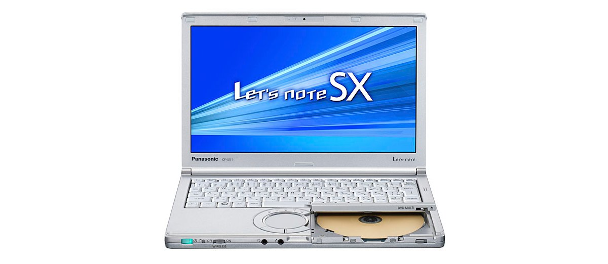
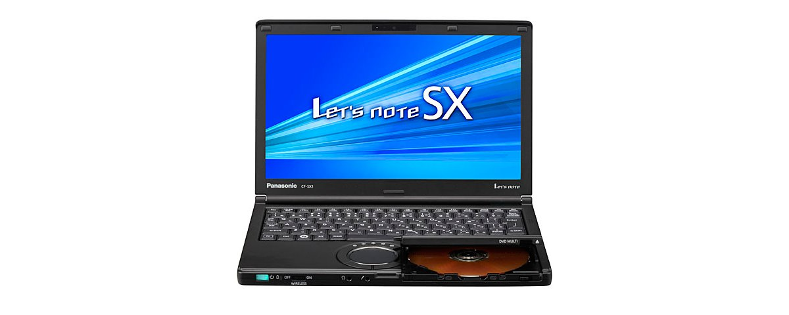
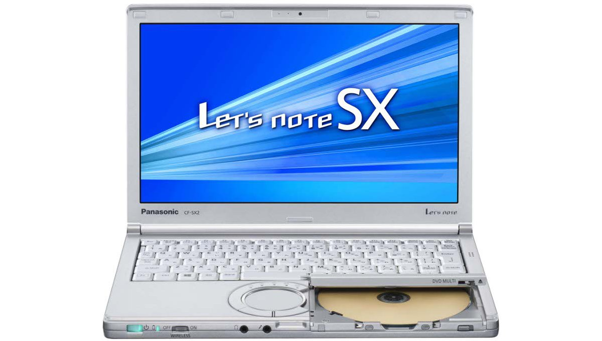

# 松下 Let's note CF-SX1 规格参数

[English](../../en/CF-SX1/) · [日本語](../../ja/CF-SX1/) · **中文**

**CF-SX1** 是松下 Let's note 笔记本电脑，属于 SX 系列，配备 12.1英寸 HD+ 屏幕。本页收录其全部 13 个型号（2012-02 – 2012-06 发售）的规格参数。每个型号均附官方规格表链接。

*松下 Let's note CF-SX1（CF-SX1GEADR, CF-SX1GEPDR, CF-SX1GETDR, CF-SX1WEUHR …）。图片 © Panasonic*

## 型号列表

| 型号（品番） | 发售 | 停产 | 主要规格 |
| :-- | :-- | :-- | :-- |
| [CF-SX1XEUHR](https://panasonic.jp/pc/p-db/CF-SX1XEUHR_spec.html) | 2012-06 | 2013-02 | Windows 7 Home Premium 64位 正版 （已应用 Service Pack 1）、英特尔® CoreTM i5-2450M vProTM（2.50GHz）、内存：标准4GB（空闲插槽1、最大8GB）、HDD：320GB、超级多功能驱动器、LAN、无线LAN 802.11a(W52/W53/W56)/b/g/n |
| [CF-SX1XEVHR](https://panasonic.jp/pc/p-db/CF-SX1XEVHR_spec.html) | 2012-06 | 2013-02 | Windows 7 Home Premium 64位 正版（已应用 Service Pack 1）、英特尔® CoreTM i5-2450M vProTM（2.50GHz）、内存：标配4GB（空闲插槽1个，最大8GB）、HDD：320GB、超级多功能驱动器、LAN、无线LAN 802.11a(W52/W53/W56)/b/g/n、Office Home and Business 2010 |
| [CF-SX1XEWHR](https://panasonic.jp/pc/p-db/CF-SX1XEWHR_spec.html) | 2012-06 | 2013-02 | Windows 7 Home Premium 64位 正版 （已应用 Service Pack 1）、英特尔® CoreTM i5-2450M vProTM（2.50GHz）、内存：标准4GB（空闲插槽1、最大8GB）、HDD：320GB、超级多功能驱动器、LAN、无线LAN 802.11a(W52/W53/W56)/b/g/n |
| [CF-SX1XEXHR](https://panasonic.jp/pc/p-db/CF-SX1XEXHR_spec.html) | 2012-06 | 2013-02 | Windows 7 Home Premium 64位 正版（已应用 Service Pack 1）、英特尔® CoreTM i5-2450M vProTM（2.50GHz）、内存：标配4GB（空闲插槽1个，最大8GB）、HDD：320GB、超级多功能驱动器、LAN、无线LAN 802.11a(W52/W53/W56)/b/g/n、Office Home and Business 2010 |
| [CF-SX1GEADR](https://panasonic.jp/pc/p-db/CF-SX1GEADR_spec.html) | 2012-02 | 2012-09 | Windows®7 Professional 64位 正版（已应用Service Pack 1）、英特尔® CoreTM i5-2540M（2.60GHz）、内存：标配4GB（空插槽1、最大8GB）、HDD：500GB、超级多功能驱动器、LAN、无线LAN 802.11a(W52/W53/W56)/b/g/n |
| [CF-SX1GEPDR](https://panasonic.jp/pc/p-db/CF-SX1GEPDR_spec.html) | 2012-02 | 2012-09 | Windows®7 Professional 64位 正版（已应用Service Pack 1）、英特尔® CoreTM i5-2540M（2.60GHz）、内存：标配4GB（空插槽1、最大8GB）、HDD：500GB、超级多功能驱动器、LAN、无线LAN 802.11a(W52/W53/W56)/b/g/n、Office Home and Business 2010 |
| [CF-SX1GEBDR](https://panasonic.jp/pc/p-db/CF-SX1GEBDR_spec.html) | 2012-02 | 2012-09 | 黑色机型：Windows®7 Professional 64位 正版（已应用 Service Pack 1）、英特尔® CoreTM i5-2540M（2.60GHz）、内存：标配4GB（空闲插槽1、最大8GB）、HDD：500GB、超级多功能光驱、LAN、无线LAN 802.11a(W52/W53/W56)/b/g/n |
| [CF-SX1GEQDR](https://panasonic.jp/pc/p-db/CF-SX1GEQDR_spec.html) | 2012-02 | 2012-09 | 黑色机型：Windows®7 Professional 64位 正版（已应用 Service Pack 1）、英特尔® CoreTM i5-2540M（2.60GHz）、内存：标配4GB（空闲插槽1、最大8GB）、HDD：500GB、超级多功能光驱、LAN、无线LAN 802.11a(W52/W53/W56)/b/g/n、Office Home and Business 2010 |
| [CF-SX1GETDR](https://panasonic.jp/pc/p-db/CF-SX1GETDR_spec.html) | 2012-02 | 2012-09 | Windows®7 Professional 64位 正版（已应用Service Pack 1）、英特尔® CoreTM i5-2540M（2.60GHz）、内存：标配4GB（空插槽1、最大8GB）、SSD：128GB -->、超级多功能驱动器、LAN、无线LAN 802.11a(W52/W53/W56)/b/g/n＜数量限定＞ |
| [CF-SX1WEUHR](https://panasonic.jp/pc/p-db/CF-SX1WEUHR_spec.html) | 2012-02 | 2012-09 | Windows®7 Home Premium 64位 正版（已应用Service Pack 1）、英特尔® CoreTM i5-2450M（2.50GHz）、内存：标配4GB（空插槽1、最大8GB）、HDD：250GB、超级多功能驱动器、LAN、无线LAN 802.11a(W52/W53/W56)/b/g/n＜数量限定＞ |
| [CF-SX1WEVHR](https://panasonic.jp/pc/p-db/CF-SX1WEVHR_spec.html) | 2012-02 | 2012-09 | Windows®7 Home Premium 64位 正版（已应用Service Pack 1）、英特尔® CoreTM i5-2450M（2.50GHz）、内存：标配4GB（空插槽1、最大8GB）、HDD：250GB、超级多功能驱动器、LAN、无线LAN 802.11a(W52/W53/W56)/b/g/nOffice Home and Business 2010＜数量限定＞ |
| [CF-SX1WEWHR](https://panasonic.jp/pc/p-db/CF-SX1WEWHR_spec.html) | 2012-02 | 2012-09 | 黑色机型：Windows®7 Home Premium 64位 正版（已应用 Service Pack 1）、英特尔® CoreTM i5-2450M（2.50GHz）、内存：标配4GB（空闲插槽1、最大8GB）、HDD：250GB、超级多功能光驱、LAN、无线LAN 802.11a(W52/W53/W56)/b/g/n＜数量限定＞ |
| [CF-SX1WEXHR](https://panasonic.jp/pc/p-db/CF-SX1WEXHR_spec.html) | 2012-02 | 2012-09 | 黑色机型：Windows®7 Home Premium 64位 正版（已应用 Service Pack 1）、英特尔® CoreTM i5-2450M（2.50GHz）、内存：标配4GB（空闲插槽1、最大8GB）、HDD：250GB、超级多功能光驱、LAN、无线LAN 802.11a(W52/W53/W56)/b/g/nOffice Home and Business 2010 ＜数量限定＞ |

## 通用规格

| 项目 | 规格 |
| :-- | :-- |
| 内存 | 标配4GB PC3-8500/DDR3 SDRAM 最大8GB （空闲插槽1） |
| 显存 | 最大1696MB（与主内存共用） |
| 光驱 | 内置Super Multi Drive 配备缓冲欠载错误防止功能(SmoothLink)、壳式驱动器(DVD Multi) |
| 显示屏 | 12.1英寸宽屏(16:9)HD+ TFT彩色液晶（1600 x 900像素） |
| 无线通信模块 | 英特尔 Centrino Advanced-N + WiMAX 6250 |
| 无线网络 | 符合IEEE802.11a（W52/W53/W56）/b/g/n |
| 音频 | PCM音源（24位立体声）、英特尔 High Definition Audio标准、单声道扬声器 |
| 卡槽 / PC 卡 | 未配备 |
| 卡槽 / SD 卡 | SD存储卡×1插槽（支持SDHC存储卡/SDXC存储卡/支持UHS-I高速传输/支持版权保护技术） |
| 摄像头 | 分辨率：HD（720p）、有效像素数：最大1280×720像素 |
| 键盘 | 符合OADG标准86键、键距19mm（横向）/16mm（纵向）（部分键除外） |
| 功耗 | 最大约65W |

## 各型号差异

| 型号（品番） | 处理器 | 内存 | 存储 | 重量 | 续航 |
| :-- | :-- | :-- | :-- | :-- | :-- |
| CF-SX1XEUHR | Core i5-2450M | 4GB PC3-8500 | 硬盘驱动器 | 1.18 kg | 8 h |
| CF-SX1XEVHR | Core i5-2450M | 4GB PC3-8500 | 硬盘驱动器 | 1.18 kg | 8 h |
| CF-SX1XEWHR | Core i5-2450M | 4GB PC3-8500 | 硬盘驱动器 | 1.18 kg | 8 h |
| CF-SX1XEXHR | Core i5-2450M | 4GB PC3-8500 | 硬盘驱动器 | 1.18 kg | 8 h |
| CF-SX1GEADR | Core i5-2540M vPro | 4GB PC3-8500 | 500GB | 1.39 kg | 16 h |
| CF-SX1GEPDR | Core i5-2540M vPro | 4GB PC3-8500 | 500GB | 1.39 kg | 16 h |
| CF-SX1GEBDR | Core i5-2540M vPro | 4GB PC3-8500 | 500GB | 1.39 kg | 16 h |
| CF-SX1GEQDR | Core i5-2540M vPro | 4GB PC3-8500 | 500GB | 1.39 kg | 16 h |
| CF-SX1GETDR | Core i5-2540M vPro | 4GB PC3-8500 | 128GB | 1.33 kg | 17 h |
| CF-SX1WEUHR | Core i5-2450M | 4GB PC3-8500 | 250GB | 1.18 kg | 8 h |
| CF-SX1WEVHR | Core i5-2450M | 4GB PC3-8500 | 250GB | 1.18 kg | 8 h |
| CF-SX1WEWHR | Core i5-2450M | 4GB PC3-8500 | 250GB | 1.18 kg | 8 h |
| CF-SX1WEXHR | Core i5-2450M | 4GB PC3-8500 | 250GB | 1.18 kg | 8 h |

CF-SX1XEUHR 的全部差异规格

| 项目 | 规格 |
| :-- | :-- |
| 操作系统 | ▼基础操作系统：Windows7 Home Premium 64位正版（已应用 Service Pack1）/Windows7 Home Premium 32位正版（已应用 Service Pack1） / ▼安装操作系统：Windows7 Home Premium 64位正版（已应用 Service Pack1） |
| 处理器 | 英特尔 Core i5-2450M 处理器 / 英特尔智能缓存3MB，运行频率2.50GHz（使用英特尔 睿频加速技术2.0时最高3.10GHz） |
| 芯片组 | 移动 英特尔 HM65 Express 芯片组 |
| 硬盘 | 硬盘驱动器（HDD）320GB（Serial ATA、5400rpm）上述容量中约15GB用作恢复区域、约300MB用作系统区域（用户不可使用） |
| 光驱速度 / 读取 | DVD-RAM 最大5倍速[4.7GB]、DVD-R、最大8倍速、DVD-RW 最大8倍速、DVD-R DL 最大8倍速、DVD-ROM 最大8倍速、+R 最大8倍速、+R DL 最大8倍速、+RW 最大8倍速、High Speed +RW 最大8倍速、CD-ROM 最大24倍速、CD-R 最大24倍速、CD-RW 最大24倍速、High-Speed CD-RW 最大24倍速、Ultra-Speed CD-RW 最大24倍速 |
| 光驱速度 / 写入 | DVD-RAM：最大5倍速、DVD-R：最大8倍速、DVD-R DL：最大6倍速、DVD-RW：最大6倍速、+R：最大8倍速、+R DL：最大6倍速、+RW：最大4倍速、High Speed +RW：最大8倍速、CD-R：最大24倍速、CD-RW：4倍速、High-Speed CD-RW：10倍速、Ultra-Speed CD-RW 最大16倍速 |
| 支持光盘 / 读取 | DVD-RAM 、DVD-ROM、DVD-Video、DVD-R 、DVD-R DL、DVD-RW、 +R、+R DL、+RW、High Speed +RW、CD-ROM（XA对应）、Photo CD（多区段对应）、Video CD、CD EXTRA、CD-TEXT、CD-Audio、CD-R、CD-RW、High-Speed CD-RW、Ultra-Speed CD-RW |
| 支持光盘 / 写入 | DVD-RAM、DVD-R、DVD-RW（Ver.1.1/1.2）、DVD-R DL、+R、+R DL、+RW、High Speed +RW、CD-R、CD-RW、High-Speed CD-RW、Ultra-Speed CD-RW |
| 显示屏 / 显卡 | 英特尔 HD 图形3000（内置于CPU） |
| 显示屏 / 色彩 | 1600×900像素：约1677万色 |
| 显示屏 / 外接显示输出 | 800×600像素、1024×768像素、1280×720像素、1280×768像素、1280×1024像素、1360×768像素、1366×768像素、1400×1050像素、1600×900像素、1600×1200像素、1680×1050像素、1920×1080像素、1920×1200像素：约1677万色 |
| 显示屏 / 同时显示 | 800×600像素、1024×768像素、1280×720像素、1280×768像素、1360×768像素、1366×768像素、1600×900像素：约1677万 |
| 移动 WiMAX | 符合IEEE802.16e-2005（接收最大28Mbps（尽力而为方式）、发送最大6Mbps（尽力而为方式）） |
| 有线网络 | 1000BASE-T/100BASE-TX/10BASE-T，未配备调制解调器。 |
| 蓝牙 | Bluetooth v2.1+EDR |
| 内存扩展槽 | DDR3 204针 SO-DIMM专用插槽×1（1.5V/PC3-8500/DDR3 SDRAM） |
| 麦克风 | 单声道 |
| 接口 | LAN 接口（RJ-45） / 外接显示器接口（模拟 RGB 迷你 Dsub 15 针） / HDMI 输出端子 / 麦克风输入端子（立体声迷你插孔 M3（支持插入式电源）） / 音频输出端子（立体声迷你插孔 M3） / USB3.0 端口×2（左侧面） / USB2.0 端口×1（右侧面） |
| 指点设备 | 滚轮触控板 |
| 电源 | ▼AC适配器 / 输入：AC100V～240V、50Hz/60Hz、输出：DC16V、4.06A、电源线仅限100V专用 / ▼轻量电池组（S） / 7.2 V锂离子 标称容量 6800 mAh / 额定容量 6400 mAh |
| 能效 | 2011年度基准 N类别0.087 |
| 能效达成率（2011 年度标准） | — |
| 续航 / 充电时间 | ▼续航时间：约8小时（安装另售的标准电池组（L）时：约16小时） / ▼充电时间： / ●使用标准AC适配器时 / 安装［标准电池组（L）］时：约5小时（电源开启状态）、约4小时（电源关闭状态） / 安装［轻量电池组（S）］时：约3小时（电源开启状态）、约2.5小时（电源关闭状态） / ●使用迷你AC适配器时 / 安装［标准电池组（L）］时：约8小时（电源关闭状态） / 安装［轻量电池组（S）］时：约4.5小时（电源关闭状态） |
| 尺寸（宽×深×高） | 宽295mm×深197.5mm×高25.4mm（最厚处为31.5mm 不含突起部） |
| 颜色 | 银色 |
| 重量（含电池） | 电脑主机：约1.18kg（安装附带的电池组（约0.22kg）时），电脑主机：约1.39kg（安装另售的标准电池组（约0.43kg）时），AC适配器：约0.2kg（不含电源线（约0.06 kg）） |
| 预装软件 | Microsoft Windows Media Player 12、投影仪助手、USB 键盘助手、显示助手）、Wireless Manager mobile edition 5.5、英特尔 WiDi 软件、USB 充电设置实用程序、摄像头实用程序、缩放查看器、贴合视图、窗口分隔器（画面分割实用程序）、快速启动管理器、PC 信息弹窗、PC 信息查看器、Dashboard for Panasonic PC、恢复光盘创建实用程序、DirextX 11、英特尔 PROSet/Wireless Software（扩展了无线LAN的认证方式）、英特尔 My WiFi 技术、VIP Access for Desktop（英特尔 IPT 用应用程序软件）、Windows Live 邮件、Windows Live 照片库、Windows Live Messenger、Windows Live Writer、Windows Live 影音制作、Windows Live Mesh、WinZip 15 日语版 45天体验版、Microsoft .NET Framework 4.0、Aptio 设置实用程序、硬盘数据擦除实用程序、PC-Diagnostic 实用程序、光盘驱动器盘符更改实用程序、Roxio Creator LJB（含 My DVD）、CyberLink PowerDVD 10 |
| 附件 | 标配AC适配器、轻量电池组(S)、使用说明书 |

官方规格表: <https://panasonic.jp/pc/p-db/CF-SX1XEUHR_spec.html>

CF-SX1XEVHR 的全部差异规格

| 项目 | 规格 |
| :-- | :-- |
| 操作系统 | ▼基础操作系统：Windows7 Home Premium 64位正版（已应用 Service Pack1）/Windows7 Home Premium 32位正版（已应用 Service Pack1） / ▼安装操作系统：Windows7 Home Premium 64位正版（已应用 Service Pack1） |
| 处理器 | 英特尔 Core i5-2450M 处理器 / 英特尔智能缓存3MB，运行频率2.50GHz（使用英特尔 睿频加速技术2.0时最高3.10GHz） |
| 芯片组 | 移动 英特尔 HM65 Express 芯片组 |
| 硬盘 | 硬盘驱动器（HDD）320GB（Serial ATA、5400rpm）上述容量中约15GB用作恢复区域、约300MB用作系统区域（用户不可使用） |
| 光驱速度 / 读取 | DVD-RAM 最大5倍速[4.7GB]、DVD-R 最大8倍速、DVD-RW 最大8倍速、DVD-R DL 最大8倍速、DVD-ROM 最大8倍速、+R 最大8倍速、+R DL 最大8倍速、+RW 最大8倍速、High Speed +RW 最大8倍速、CD-ROM 最大24倍速、CD-R 最大24倍速、CD-RW 最大24倍速、High-Speed CD-RW 最大24倍速、Ultra-Speed CD-RW 最大24倍速 |
| 光驱速度 / 写入 | DVD-RAM：最大5倍速、DVD-R：最大8倍速、DVD-R DL：最大6倍速、DVD-RW：最大6倍速、+R：最大8倍速、+R DL：最大6倍速、+RW：最大4倍速、High Speed +RW：最大8倍速、CD-R：最大24倍速、CD-RW：4倍速、High-Speed CD-RW：10倍速、Ultra-Speed CD-RW 最大16倍速 |
| 支持光盘 / 读取 | DVD-RAM 、DVD-ROM、DVD-Video、DVD-R 、DVD-R DL、DVD-RW、 +R、+R DL、+RW、High Speed +RW、CD-ROM（XA对应）、Photo CD（多区段对应）、Video CD、CD EXTRA、CD-TEXT、CD-Audio、CD-R、CD-RW、High-Speed CD-RW、Ultra-Speed CD-RW |
| 支持光盘 / 写入 | DVD-RAM、DVD-R、DVD-RW（Ver.1.1/1.2）、DVD-R DL、+R、+R DL、+RW、High Speed +RW、CD-R、CD-RW、High-Speed CD-RW、Ultra-Speed CD-RW |
| 显示屏 / 显卡 | 英特尔 HD 图形3000（内置于CPU） |
| 显示屏 / 色彩 | 1600×900像素：约1677万色 |
| 显示屏 / 外接显示输出 | 800×600像素、1024×768像素、1280×720像素、1280×768像素、1280×1024像素、1360×768像素、1366×768像素、1400×1050像素、1600×900像素、1600×1200像素、1680×1050像素、1920×1080像素、1920×1200像素：约1677万色 |
| 显示屏 / 同时显示 | 800×600像素、1024×768像素、1280×720像素、1280×768像素、1360×768像素、1366×768像素、1600×900像素：约1677万 |
| 移动 WiMAX | 符合IEEE802.16e-2005（接收最大28Mbps（尽力而为方式）、发送最大6Mbps（尽力而为方式）） |
| 有线网络 | 1000BASE-T/100BASE-TX/10BASE-T，未配备调制解调器。 |
| 蓝牙 | Bluetooth v2.1+EDR |
| 内存扩展槽 | DDR3 204针 SO-DIMM专用插槽×1（1.5V/PC3-8500/DDR3 SDRAM） |
| 麦克风 | 单声道 |
| 接口 | LAN 接口（RJ-45） / 外接显示器接口（模拟 RGB 迷你 Dsub 15 针） / HDMI 输出端子 / 麦克风输入端子（立体声迷你插孔 M3（支持插入式电源）） / 音频输出端子（立体声迷你插孔 M3） / USB3.0 端口×2（左侧面） / USB2.0 端口×1（右侧面） |
| 指点设备 | 滚轮触控板 |
| 电源 | ▼AC适配器 / 输入：AC100V～240V、50Hz/60Hz、输出：DC16V、4.06A、电源线仅限100V专用 / ▼轻量电池组（S） / 7.2 V锂离子 标称容量 6800 mAh / 额定容量 6400 mAh |
| 能效 | 2011年度基准 N类别0.087 |
| 能效达成率（2011 年度标准） | — |
| 续航 / 充电时间 | ▼续航时间：约8小时（安装另售的标准电池组（L）时：约16小时） / ▼充电时间： / ●使用标准AC适配器时 / 安装［标准电池组（L）］时：约5小时（电源开启状态）、约4小时（电源关闭状态） / 安装［轻量电池组（S）］时：约3小时（电源开启状态）、约2.5小时（电源关闭状态） / ●使用迷你AC适配器时 / 安装［标准电池组（L）］时：约8小时（电源关闭状态） / 安装［轻量电池组（S）］时：约4.5小时（电源关闭状态） |
| 尺寸（宽×深×高） | 宽295mm×深197.5mm×高25.4mm（最厚处为31.5mm 不含突起部） |
| 颜色 | 银色 |
| 重量（含电池） | 电脑主机：约1.18kg（安装附带的电池组（约0.22kg）时），电脑主机：约1.39kg（安装另售的标准电池组（约0.43kg）时），AC适配器：约0.2kg（不含电源线（约0.06 kg）） |
| 预装软件 | Microsoft Windows Media Player 12、投影仪助手、USB 键盘助手、显示助手）、Wireless Manager mobile edition 5.5、英特尔 WiDi 软件、USB 充电设置实用程序、摄像头实用程序、缩放查看器、贴合视图、窗口分隔器（画面分割实用程序）、快速启动管理器、PC 信息弹窗、PC 信息查看器、Dashboard for Panasonic PC、恢复光盘创建实用程序、DirextX 11、英特尔 PROSet/Wireless Software（扩展了无线LAN的认证方式）、英特尔 My WiFi 技术、VIP Access for Desktop（英特尔 IPT 用应用程序软件）、Windows Live 邮件、Windows Live 照片库、Windows Live Messenger、Windows Live Writer、Windows Live 影音制作、Windows Live Mesh、WinZip 15 日语版 45天体验版、Microsoft .NET Framework 4.0、Aptio 设置实用程序、硬盘数据擦除实用程序、PC-Diagnostic 实用程序、光盘驱动器盘符更改实用程序、Roxio Creator LJB（含 My DVD）、CyberLink PowerDVD 10 |
| 附件 | 标配AC适配器、轻量电池组(S)、使用说明书 / Microsoft Office Home and Business 2010 |
| Microsoft Office | Microsoft Office Home and Business 2010 |

官方规格表: <https://panasonic.jp/pc/p-db/CF-SX1XEVHR_spec.html>

CF-SX1XEWHR 的全部差异规格

| 项目 | 规格 |
| :-- | :-- |
| 操作系统 | ▼基础操作系统：Windows7 Home Premium 64位正版（已应用 Service Pack1）/Windows7 Home Premium 32位正版（已应用 Service Pack1） / ▼安装操作系统：Windows7 Home Premium 64位正版（已应用 Service Pack1） |
| 处理器 | 英特尔 Core i5-2450M 处理器 / 英特尔智能缓存3MB，运行频率2.50GHz（使用英特尔 睿频加速技术2.0时最高3.10GHz） |
| 芯片组 | 移动 英特尔 HM65 Express 芯片组 |
| 硬盘 | 硬盘驱动器（HDD）320GB（Serial ATA、5400rpm）上述容量中约15GB用作恢复区域、约300MB用作系统区域（用户不可使用） |
| 光驱速度 / 读取 | DVD-RAM 最大5倍速[4.7GB]、DVD-R 最大8倍速、DVD-RW 最大8倍速、DVD-R DL 最大8倍速、DVD-ROM 最大8倍速、+R 最大8倍速、+R DL 最大8倍速、+RW 最大8倍速、High Speed +RW 最大8倍速、CD-ROM 最大24倍速、CD-R 最大24倍速、CD-RW 最大24倍速、High-Speed CD-RW 最大24倍速、Ultra-Speed CD-RW 最大24倍速 |
| 光驱速度 / 写入 | DVD-RAM：最大5倍速、DVD-R：最大8倍速、DVD-R DL：最大6倍速、DVD-RW：最大6倍速、+R：最大8倍速、+R DL：最大6倍速、+RW：最大4倍速、High Speed +RW：最大8倍速、CD-R：最大24倍速、CD-RW：4倍速、High-Speed CD-RW：10倍速、Ultra-Speed CD-RW 最大16倍速 |
| 支持光盘 / 读取 | DVD-RAM 、DVD-ROM、DVD-Video、DVD-R 、DVD-R DL、DVD-RW、 +R、+R DL、+RW、High Speed +RW、CD-ROM（XA对应）、Photo CD（多区段对应）、Video CD、CD EXTRA、CD-TEXT、CD-Audio、CD-R、CD-RW、High-Speed CD-RW、Ultra-Speed CD-RW |
| 支持光盘 / 写入 | DVD-RAM、DVD-R、DVD-RW（Ver.1.1/1.2）、DVD-R DL、+R、+R DL、+RW、High Speed +RW、CD-R、CD-RW、High-Speed CD-RW、Ultra-Speed CD-RW |
| 显示屏 / 显卡 | 英特尔 HD 图形3000（内置于CPU） |
| 显示屏 / 色彩 | 1600×900像素：约1677万色 |
| 显示屏 / 外接显示输出 | 800×600像素、1024×768像素、1280×720像素、1280×768像素、1360×768像素、1366×768像素、1600×900像素：约1677万 |
| 显示屏 / 同时显示 | 800×600、1024×768、1280×720、1280×768、1360×768、1366×768、1600×900像素：约1677万色 |
| 移动 WiMAX | 符合IEEE802.16e-2005（接收最大28Mbps（尽力而为方式）、发送最大6Mbps（尽力而为方式）） |
| 有线网络 | 1000BASE-T/100BASE-TX/10BASE-T，未配备调制解调器。 |
| 蓝牙 | Bluetooth v2.1+EDR |
| 内存扩展槽 | DDR3 204针 SO-DIMM专用插槽×1（1.5V/PC3-8500/DDR3 SDRAM） |
| 麦克风 | 单声道 |
| 接口 | LAN 接口（RJ-45） / 外接显示器接口（模拟 RGB 迷你 Dsub 15 针） / HDMI 输出端子 / 麦克风输入端子（立体声迷你插孔 M3（支持插入式电源）） / 音频输出端子（立体声迷你插孔 M3） / USB3.0 端口×2（左侧面） / USB2.0 端口×1（右侧面） |
| 指点设备 | 滚轮触控板 |
| 电源 | ▼AC适配器 / 输入：AC100V～240V、50Hz/60Hz、输出：DC16V、4.06A、电源线仅限100V专用 / ▼轻量电池组（S） / 7.2 V锂离子 标称容量 6800 mAh / 额定容量 6400 mAh |
| 能效 | 2011年度基准 N类别0.087 |
| 能效达成率（2011 年度标准） | — |
| 续航 / 充电时间 | ▼续航时间：约8小时（安装另售的标准电池组（L）时：约16小时） / ▼充电时间： / ●使用标准AC适配器时 / 安装［标准电池组（L）］时：约5小时（电源开启状态）、约4小时（电源关闭状态） / 安装［轻量电池组（S）］时：约3小时（电源开启状态）、约2.5小时（电源关闭状态） / ●使用迷你AC适配器时 / 安装［标准电池组（L）］时：约8小时（电源关闭状态） / 安装［轻量电池组（S）］时：约4.5小时（电源关闭状态） |
| 尺寸（宽×深×高） | 宽295mm×深197.5mm×高25.4mm（最厚处为31.5mm 不含突起部） |
| 颜色 | 黑色 |
| 重量（含电池） | 电脑主机：约1.18kg（安装附带的电池组（约0.22kg）时），电脑主机：约1.39kg（安装另售的标准电池组（约0.43kg）时），AC适配器：约0.2kg（不含电源线（约0.06 kg）） |
| 预装软件 | Microsoft Windows Media Player 12、投影仪助手、USB 键盘助手、显示助手）、Wireless Manager mobile edition 5.5、英特尔 WiDi 软件、USB 充电设置实用程序、摄像头实用程序、缩放查看器、贴合视图、窗口分隔器（画面分割实用程序）、快速启动管理器、PC 信息弹窗、PC 信息查看器、Dashboard for Panasonic PC、恢复光盘创建实用程序、DirextX 11、英特尔 PROSet/Wireless Software（扩展了无线LAN的认证方式）、英特尔 My WiFi 技术、VIP Access for Desktop（英特尔 IPT 用应用程序软件）、Windows Live 邮件、Windows Live 照片库、Windows Live Messenger、Windows Live Writer、Windows Live 影音制作、Windows Live Mesh、WinZip 15 日语版 45天体验版、Microsoft .NET Framework 4.0、Aptio 设置实用程序、硬盘数据擦除实用程序、PC-Diagnostic 实用程序、光盘驱动器盘符更改实用程序、Roxio Creator LJB（含 My DVD）、CyberLink PowerDVD 10 |
| 附件 | 标配AC适配器、轻量电池组(S)、使用说明书 |

官方规格表: <https://panasonic.jp/pc/p-db/CF-SX1XEWHR_spec.html>

CF-SX1XEXHR 的全部差异规格

| 项目 | 规格 |
| :-- | :-- |
| 操作系统 | ▼基础操作系统：Windows7 Home Premium 64位正版（已应用 Service Pack1）/Windows7 Home Premium 32位正版（已应用 Service Pack1） / ▼安装操作系统：Windows7 Home Premium 64位正版（已应用 Service Pack1） |
| 处理器 | 英特尔 Core i5-2450M 处理器 / 英特尔智能缓存3MB，运行频率2.50GHz（使用英特尔 睿频加速技术2.0时最高3.10GHz） |
| 芯片组 | 移动 英特尔 HM65 Express 芯片组 |
| 硬盘 | 硬盘驱动器（HDD）320GB（Serial ATA、5400rpm）上述容量中约15GB用作恢复区域、约300MB用作系统区域（用户不可使用） |
| 光驱速度 / 读取 | DVD-RAM 最大5倍速[4.7GB]、DVD-R 最大8倍速、DVD-RW 最大8倍速、DVD-R DL 最大8倍速、DVD-ROM 最大8倍速、+R 最大8倍速、+R DL 最大8倍速、+RW 最大8倍速、High Speed +RW 最大8倍速、CD-ROM 最大24倍速、CD-R 最大24倍速、CD-RW 最大24倍速、High-Speed CD-RW 最大24倍速、Ultra-Speed CD-RW 最大24倍速 |
| 光驱速度 / 写入 | DVD-RAM：最大5倍速、DVD-R：最大8倍速、DVD-R DL：最大6倍速、DVD-RW：最大6倍速、+R：最大8倍速、+R DL：最大6倍速、+RW：最大4倍速、High Speed +RW：最大8倍速、CD-R：最大24倍速、CD-RW：4倍速、High-Speed CD-RW：10倍速、Ultra-Speed CD-RW 最大16倍速 |
| 支持光盘 / 读取 | DVD-RAM 、DVD-ROM、DVD-Video、DVD-R 、DVD-R DL、DVD-RW、 +R、+R DL、+RW、High Speed +RW、CD-ROM（XA对应）、Photo CD（多区段对应）、Video CD、CD EXTRA、CD-TEXT、CD-Audio、CD-R、CD-RW、High-Speed CD-RW、Ultra-Speed CD-RW |
| 支持光盘 / 写入 | DVD-RAM、DVD-R、DVD-RW（Ver.1.1/1.2）、DVD-R DL、+R、+R DL、+RW、High Speed +RW、CD-R、CD-RW、High-Speed CD-RW、Ultra-Speed CD-RW |
| 显示屏 / 显卡 | 英特尔 HD 图形3000（内置于CPU） |
| 显示屏 / 色彩 | 1600×900像素：约1677万色 |
| 显示屏 / 外接显示输出 | 800×600像素、1024×768像素、1280×720像素、1280×768像素、1280×1024像素、1360×768像素、1366×768像素、1400×1050像素、1600×900像素、1600×1200像素、1680×1050像素、1920×1080像素、1920×1200像素：约1677万色 |
| 显示屏 / 同时显示 | 800×600像素、1024×768像素、1280×720像素、1280×768像素、1360×768像素、1366×768像素、1600×900像素：约1677万 |
| 移动 WiMAX | 符合IEEE802.16e-2005（接收最大28Mbps（尽力而为方式）、发送最大6Mbps（尽力而为方式）） |
| 有线网络 | 1000BASE-T/100BASE-TX/10BASE-T，未配备调制解调器。 |
| 蓝牙 | Bluetooth v2.1+EDR |
| 内存扩展槽 | DDR3 204针 SO-DIMM专用插槽×1（1.5V/PC3-8500/DDR3 SDRAM） |
| 麦克风 | 单声道 |
| 接口 | LAN 接口（RJ-45） / 外接显示器接口（模拟 RGB 迷你 Dsub 15 针） / HDMI 输出端子 / 麦克风输入端子（立体声迷你插孔 M3（支持插入式电源）） / 音频输出端子（立体声迷你插孔 M3） / USB3.0 端口×2（左侧面） / USB2.0 端口×1（右侧面） |
| 指点设备 | 滚轮触控板 |
| 电源 | ▼AC适配器 / 输入：AC100V～240V、50Hz/60Hz、输出：DC16V、4.06A、电源线仅限100V专用 / ▼轻量电池组（S） / 7.2 V锂离子 标称容量 6800 mAh / 额定容量 6400 mAh |
| 能效 | 2011年度基准 N类别0.087 |
| 能效达成率（2011 年度标准） | — |
| 续航 / 充电时间 | ▼续航时间：约8小时（安装另售的标准电池组（L）时：约16小时） / ▼充电时间： / ●使用标准AC适配器时 / 安装［标准电池组（L）］时：约5小时（电源开启状态）、约4小时（电源关闭状态） / 安装［轻量电池组（S）］时：约3小时（电源开启状态）、约2.5小时（电源关闭状态） / ●使用迷你AC适配器时 / 安装［标准电池组（L）］时：约8小时（电源关闭状态） / 安装［轻量电池组（S）］时：约4.5小时（电源关闭状态） |
| 尺寸（宽×深×高） | 宽295mm×深197.5mm×高25.4mm（最厚处为31.5mm 不含突起部） |
| 颜色 | 黑色 |
| 重量（含电池） | 电脑主机：约1.18kg（安装附带的电池组（约0.22kg）时），电脑主机：约1.39kg（安装另售的标准电池组（约0.43kg）时），AC适配器：约0.2kg（不含电源线（约0.06 kg）） |
| 预装软件 | Microsoft Windows Media Player 12、投影仪助手、USB 键盘助手、显示助手）、Wireless Manager mobile edition 5.5、英特尔 WiDi 软件、USB 充电设置实用程序、摄像头实用程序、缩放查看器、贴合视图、窗口分隔器（画面分割实用程序）、快速启动管理器、PC 信息弹窗、PC 信息查看器、Dashboard for Panasonic PC、恢复光盘创建实用程序、DirextX 11、英特尔 PROSet/Wireless Software（扩展了无线LAN的认证方式）、英特尔 My WiFi 技术、VIP Access for Desktop（英特尔 IPT 用应用程序软件）、Windows Live 邮件、Windows Live 照片库、Windows Live Messenger、Windows Live Writer、Windows Live 影音制作、Windows Live Mesh、WinZip 15 日语版 45天体验版、Microsoft .NET Framework 4.0、Aptio 设置实用程序、硬盘数据擦除实用程序、PC-Diagnostic 实用程序、光盘驱动器盘符更改实用程序、Roxio Creator LJB（含 My DVD）、CyberLink PowerDVD 10 |
| 附件 | 标准AC适配器、轻量电池组(S)、使用说明书、Microsoft Office Home and Business 2010 |
| Microsoft Office | Microsoft Office Home and Business 2010 |

官方规格表: <https://panasonic.jp/pc/p-db/CF-SX1XEXHR_spec.html>

CF-SX1GEADR 的全部差异规格

| 项目 | 规格 |
| :-- | :-- |
| 操作系统 | ▼基础操作系统：Windows7 Professional32位正版/Windows7 Professional 64位正版（配备 WindowsXP Mode） / ▼安装操作系统：Windows7 Professional64位正版（配备 WindowsXP Mode）[已应用 Service Pack1] |
| 处理器 | 采用英特尔 vPro 技术 / 英特尔 Core i5-2540M vPro 处理器 / 英特尔智能缓存3MB、工作频率2.60GHz（使用英特尔 睿频加速技术2.0时最高3.30GHz） |
| 芯片组 | 移动 英特尔 QM67 Express 芯片组 |
| 硬盘 | 500GB（Serial ATA、2.5英寸HDD 5400转/分）上述容量中约15GB用作恢复区域、约300MB用作系统区域（用户不可使用） |
| 光驱速度 / 读取 | DVD-RAM 最大5倍速[4.7GB]、DVD-R、最大8倍速、DVD-RW 最大8倍速、DVD-R DL 最大8倍速、DVD-ROM 最大8倍速、+R 最大8倍速、+R DL 最大8倍速、+RW 最大8倍速、High Speed +RW 最大8倍速、CD-ROM 最大24倍速、CD-R 最大24倍速、CD-RW 最大24倍速、High-Speed CD-RW 最大24倍速、Ultra-Speed CD-RW 最大24倍速 |
| 光驱速度 / 写入 | DVD-RAM 最高5倍速[4.7GB]、DVD-R 最高8倍速、DVD-R DL 最高6倍速、DVD-RW 最高6倍速、+R 最高8倍速、+RW 最高4倍速、CD-R 最高24倍速、CD-RW 4倍速、High Speed CD-RW 10倍速、+R DL 最高6倍速、High Speed +RW 最高8倍速、Ultra Speed CD-RW 最高16倍速 |
| 支持光盘 / 读取 | DVD-ROM、DVD-Video、DVD-R、DVD-RW、DVD-R DL、DVD-RAM、+R、+R DL、+RW、High Speed +RW、CD-Audio、CD-ROM (支持XA)、CD-R、PhotoCD(支持多区段)、VideoCD、CD EXTRA、CD-RW、High-Speed CD-RW、Ultra-Speed CD-RW、CD-TEXT |
| 支持光盘 / 写入 | DVD-RAM、DVD-R、DVD-RW、+R、+RW、High Speed +RW、CD-R、CD-RW、High-Speed CD-RW、DVD-R DL、+R DL、Ultra-Speed CD-RW |
| 显示屏 / 显卡 | 配备英特尔 HD 图形3000（内置于英特尔 Core i5-2540M vPro处理器） |
| 显示屏 / 色彩 | 1600×900像素：约1677万色 |
| 显示屏 / 外接显示输出 | 800×600、1024×768、1280×720、1280×768、1280×1024、1360×768、1366×768、1400×1050、1600×900、1600×1200、1680×1050、1920×1080、1920×1200像素：约1677万色 |
| 显示屏 / 同时显示 | 800×600、1024×768、1280×720、1280×768、1360×768、1366×768、1600×900像素：约1677万色 |
| 有线网络 | 1000BASE-T/100BASE-TX/10BASE-T |
| 内存扩展槽 | DDR3 204针SO-DIMM×1插槽(1.5V/PC3-8500/DDR3 SDRAM) |
| 接口 | LAN接口（RJ-45）、外接显示器接口（模拟RGB 迷你Dsub 15针）、HDMI输出端子、麦克风输入端子（立体声迷你插孔M3（支持插入式电源））、音频输出端子（立体声迷你插孔M3）、USB3.0端口×2（左侧面）、USB2.0端口×1（右侧面） |
| 电源 | ▼AC适配器 / 输入：AC100V～240V、50Hz/60Hz，输出：DC16V、4.06A，电源线为100V专用 / ▼电池组 / 7.2V 锂离子・标称容量13.6Ah、额定容量12.8Ah，轻量电池组：7.2V 锂离子・标称容量6.8Ah、额定容量6.4Ah |
| 能效 | 2011年度标准 N分类0.083 |
| 能效达成率（2011 年度标准） | — |
| 续航 / 充电时间 | ▼续航时间：约16小时 （安装轻量电池组时：约8小时） / ▼充电时间：约4小时（电源OFF时）、约5小时（电源ON时） |
| 尺寸（宽×深×高） | 宽295mm×深197.5mm×高25.4mm※最厚处为31.5mm |
| 重量（含电池） | 电脑主机：约1.39kg（安装附带的电池组（约0.43kg）时）、电脑主机：约1.18kg（安装轻量电池组（约0.22kg）时）、AC适配器：约0.2kg（不含电源线（约0.06 kg）） |
| 预装软件 | Microsoft Internet Explorer 9.0、绿色goo棒、网络选择器3、无线切换实用程序、安全设置实用程序、迈克菲PC安全中心、i-过滤器6.0（30天试用版）、Infineon TPM Professional Package V3.7、Adobe Reader、WinZip 14.5日语版、电池余量显示校正实用程序、滚轮触控板实用程序、NumLock通知、Hotkey设置、Fn Ctrl功能互换实用程序、ATOK for Windows 免费试用版、金山词典、电源计划扩展实用程序、峰值转移控制实用程序、Microsoft Windows Media Player 12、投影仪助手、USB键盘助手、显示器助手、Wireless Manager mobile edition5.5、英特尔 WiDi软件、摄像头实用程序、缩放查看器、Windows XP Mode、画面分割实用程序、快速启动管理器、PC信息弹窗、PC信息查看器、Aptio设置实用程序、PC-Diagnostic实用程序、Dashboard for Panasonic PC、硬盘数据擦除实用程序、DirectX 11、Microsoft .NET Framework 3.5.1、英特尔 PROSet/Wireless Software、英特尔 My WiFi 技术、VIP Access for Desktop（英特尔 IPT 用应用程序）、英特尔身份保护技术、Windows Live邮件、Windows Live照片库、Windows Live Messenger、Windows Live Writer、Silverlight、贴合视图、光盘驱动器盘符更改实用程序、Roxio Creator LJB（含MyDVD）、恢复光盘创建实用程序、CyberLink PowerDVD 10、USB充电设置实用程序、Bluetooth Stack for Windows by TOSHIBA |
| 附件 | 标配AC适配器、标准电池组(L)、迷你AC适配器、轻量电池组(S)、使用说明书 |
| 安全芯片 | TPM（符合TCG V1.2） |

官方规格表: <https://panasonic.jp/pc/p-db/CF-SX1GEADR_spec.html>

CF-SX1GEPDR 的全部差异规格

| 项目 | 规格 |
| :-- | :-- |
| 操作系统 | ▼基础操作系统：Windows7 Professional32位正版/Windows7 Professional 64位正版（配备 WindowsXP Mode） / ▼安装操作系统：Windows7 Professional64位正版（配备 WindowsXP Mode）[已应用 Service Pack1] |
| 处理器 | 采用英特尔 vPro 技术 / 英特尔 Core i5-2540M vPro 处理器 / 英特尔智能缓存3MB、工作频率2.60GHz（使用英特尔 睿频加速技术2.0时最高3.30GHz） |
| 芯片组 | 移动 英特尔 QM67 Express 芯片组 |
| 硬盘 | 500GB（Serial ATA、2.5英寸HDD 5400转/分）上述容量中约15GB用作恢复区域、约300MB用作系统区域（用户不可使用） |
| 光驱速度 / 读取 | DVD-RAM 最大5倍速[4.7GB]、DVD-R、最大8倍速、DVD-RW 最大8倍速、DVD-R DL 最大8倍速、DVD-ROM 最大8倍速、+R 最大8倍速、+R DL 最大8倍速、+RW 最大8倍速、High Speed +RW 最大8倍速、CD-ROM 最大24倍速、CD-R 最大24倍速、CD-RW 最大24倍速、High-Speed CD-RW 最大24倍速、Ultra-Speed CD-RW 最大24倍速 |
| 光驱速度 / 写入 | DVD-RAM 最高5倍速[4.7GB]、DVD-R 最高8倍速、DVD-R DL 最高6倍速、DVD-RW 最高6倍速、+R 最高8倍速、+RW 最高4倍速、CD-R 最高24倍速、CD-RW 4倍速、High Speed CD-RW 10倍速、+R DL 最高6倍速、High Speed +RW 最高8倍速、Ultra Speed CD-RW 最高16倍速 |
| 支持光盘 / 读取 | DVD-ROM、DVD-Video、DVD-R、DVD-RW、DVD-R DL、DVD-RAM、+R、+R DL、+RW、High Speed +RW、CD-Audio、CD-ROM (支持XA)、CD-R、PhotoCD(支持多区段)、VideoCD、CD EXTRA、CD-RW、High-Speed CD-RW、Ultra-Speed CD-RW、CD-TEXT |
| 支持光盘 / 写入 | DVD-RAM、DVD-R、DVD-RW、+R、+RW、High Speed +RW、CD-R、CD-RW、High-Speed CD-RW、DVD-R DL、+R DL、Ultra-Speed CD-RW |
| 显示屏 / 显卡 | 配备英特尔 HD 图形3000（内置于英特尔 Core i5-2540M vPro处理器） |
| 显示屏 / 色彩 | 1600×900像素：约1677万色 |
| 显示屏 / 外接显示输出 | 800×600、1024×768、1280×720、1280×768、1280×1024、1360×768、1366×768、1400×1050、1600×900、1600×1200、1680×1050、1920×1080、1920×1200像素：约1677万色 |
| 显示屏 / 同时显示 | 800×600、1024×768、1280×720、1280×768、1360×768、1366×768、1600×900像素：约1677万色 |
| 移动 WiMAX | 符合IEEE802.16e-2005（接收最大28Mbps（尽力而为方式）、发送最大6Mbps（尽力而为方式）） |
| 有线网络 | 1000BASE-T/100BASE-TX/10BASE-T |
| 内存扩展槽 | DDR3 204针SO-DIMM×1插槽(1.5V/PC3-8500/DDR3 SDRAM) |
| 接口 | LAN接口（RJ-45）、外接显示器接口（模拟RGB 迷你Dsub 15针）、HDMI输出端子、麦克风输入端子（立体声迷你插孔M3（支持插入式电源））、音频输出端子（立体声迷你插孔M3）、USB3.0端口×2（左侧面）、USB2.0端口×1（右侧面） |
| 指点设备 | 滚轮触控板 |
| 电源 | ▼AC适配器 / 输入：AC100V～240V、50Hz/60Hz，输出：DC16V、4.06A，电源线为100V专用 / ▼电池组 / 7.2V 锂离子・标称容量13.6Ah、额定容量12.8Ah，轻量电池组：7.2V 锂离子・标称容量6.8Ah、额定容量6.4Ah |
| 能效 | 2011年度标准 N分类0.083 |
| 能效达成率（2011 年度标准） | — |
| 续航 / 充电时间 | ▼续航时间：约16小时 （安装轻量电池组时：约8小时） / ▼充电时间：约4小时（电源OFF时）、约5小时（电源ON时） |
| 尺寸（宽×深×高） | 宽295mm×深197.5mm×高25.4mm※最厚处为31.5mm |
| 重量（含电池） | 电脑主机：约1.39kg（安装附带的电池组（约0.43kg）时）、电脑主机：约1.18kg（安装轻量电池组（约0.22kg）时）、AC适配器：约0.2kg（不含电源线（约0.06 kg）） |
| 预装软件 | Microsoft Internet Explorer 9.0、绿色goo棒、网络选择器3、无线切换实用程序、安全设置实用程序、迈克菲PC安全中心、i-过滤器6.0（30天试用版）、Infineon TPM Professional Package V3.7、Adobe Reader、WinZip 14.5日语版、电池余量显示校正实用程序、滚轮触控板实用程序、NumLock通知、Hotkey设置、Fn Ctrl功能互换实用程序、ATOK for Windows 免费试用版、金山词典、电源计划扩展实用程序、峰值转移控制实用程序、Microsoft Windows Media Player 12、投影仪助手、USB键盘助手、显示器助手、Wireless Manager mobile edition5.5、英特尔 WiDi软件、摄像头实用程序、缩放查看器、Windows XP Mode、画面分割实用程序、快速启动管理器、PC信息弹窗、PC信息查看器、Aptio设置实用程序、PC-Diagnostic实用程序、Dashboard for Panasonic PC、硬盘数据擦除实用程序、DirectX 11、Microsoft .NET Framework 3.5.1、英特尔 PROSet/Wireless Software、英特尔 My WiFi 技术、VIP Access for Desktop（英特尔 IPT 用应用程序）、英特尔身份保护技术、Windows Live邮件、Windows Live照片库、Windows Live Messenger、Windows Live Writer、Silverlight、贴合视图、光盘驱动器盘符更改实用程序、Roxio Creator LJB（含MyDVD）、恢复光盘创建实用程序、CyberLink PowerDVD 10、USB充电设置实用程序、Bluetooth Stack for Windows by TOSHIBA |
| 附件 | 标配AC适配器、标准电池组(L)、迷你AC适配器、轻量电池组(S)、使用说明书 |
| Microsoft Office | Office Home and Business 2010 （Word、Excel、PowerPoint、Outlook、OneNote） |
| 安全芯片 | TPM（符合TCG V1.2） |

官方规格表: <https://panasonic.jp/pc/p-db/CF-SX1GEPDR_spec.html>

CF-SX1GEBDR 的全部差异规格

| 项目 | 规格 |
| :-- | :-- |
| 操作系统 | ▼基础操作系统：Windows7 Professional32位正版/Windows7 Professional 64位正版（配备 WindowsXP Mode） / ▼安装操作系统：Windows7 Professional64位正版（配备 WindowsXP Mode）[已应用 Service Pack1] |
| 处理器 | 采用英特尔 vPro 技术 / 英特尔 Core i5-2540M vPro 处理器 / 英特尔智能缓存3MB、工作频率2.60GHz（使用英特尔 睿频加速技术2.0时最高3.30GHz） |
| 芯片组 | 移动 英特尔 QM67 Express 芯片组 |
| 硬盘 | 500GB（Serial ATA、2.5英寸HDD 5400转/分）上述容量中约15GB用作恢复区域、约300MB用作系统区域（用户不可使用） |
| 光驱速度 / 读取 | DVD-RAM 最大5倍速[4.7GB]、DVD-R、最大8倍速、DVD-RW 最大8倍速、DVD-R DL 最大8倍速、DVD-ROM 最大8倍速、+R 最大8倍速、+R DL 最大8倍速、+RW 最大8倍速、High Speed +RW 最大8倍速、CD-ROM 最大24倍速、CD-R 最大24倍速、CD-RW 最大24倍速、High-Speed CD-RW 最大24倍速、Ultra-Speed CD-RW 最大24倍速 |
| 光驱速度 / 写入 | DVD-RAM 最高5倍速[4.7GB]、DVD-R 最高8倍速、DVD-R DL 最高6倍速、DVD-RW 最高6倍速、+R 最高8倍速、+RW 最高4倍速、CD-R 最高24倍速、CD-RW 4倍速、High Speed CD-RW 10倍速、+R DL 最高6倍速、High Speed +RW 最高8倍速、Ultra Speed CD-RW 最高16倍速 |
| 支持光盘 / 读取 | DVD-ROM、DVD-Video、DVD-R、DVD-RW、DVD-R DL、DVD-RAM、+R、+R DL、+RW、High Speed +RW、CD-Audio、CD-ROM (支持XA)、CD-R、PhotoCD(支持多区段)、VideoCD、CD EXTRA、CD-RW、High-Speed CD-RW、Ultra-Speed CD-RW、CD-TEXT |
| 支持光盘 / 写入 | DVD-RAM、DVD-R、DVD-RW、+R、+RW、High Speed +RW、CD-R、CD-RW、High-Speed CD-RW、DVD-R DL、+R DL、Ultra-Speed CD-RW |
| 显示屏 / 显卡 | 配备英特尔 HD 图形3000（内置于英特尔 Core i5-2540M vPro处理器） |
| 显示屏 / 色彩 | 1600×900像素：约1677万色 |
| 显示屏 / 外接显示输出 | 800×600、1024×768、1280×720、1280×768、1280×1024、1360×768、1366×768、1400×1050、1600×900、1600×1200、1680×1050、1920×1080、1920×1200像素：约1677万色 |
| 显示屏 / 同时显示 | 800×600、1024×768、1280×720、1280×768、1360×768、1366×768、1600×900像素：约1677万色 |
| 移动 WiMAX | 符合IEEE802.16e-2005（接收最大28Mbps（尽力而为方式）、发送最大6Mbps（尽力而为方式）） |
| 有线网络 | 1000BASE-T/100BASE-TX/10BASE-T |
| 内存扩展槽 | DDR3 204针SO-DIMM×1插槽(1.5V/PC3-8500/DDR3 SDRAM) |
| 接口 | LAN接口（RJ-45）、外接显示器接口（模拟RGB 迷你Dsub 15针）、HDMI输出端子、麦克风输入端子（立体声迷你插孔M3（支持插入式电源））、音频输出端子（立体声迷你插孔M3）、USB3.0端口×2（左侧面）、USB2.0端口×1（右侧面） |
| 指点设备 | 滚轮触控板 |
| 电源 | ▼AC适配器 / 输入：AC100V～240V、50Hz/60Hz，输出：DC16V、4.06A，电源线为100V专用 / ▼电池组 / 7.2V 锂离子・标称容量13.6Ah、额定容量12.8Ah，轻量电池组：7.2V 锂离子・标称容量6.8Ah、额定容量6.4Ah |
| 能效 | 2011年度标准 N分类0.083 |
| 能效达成率（2011 年度标准） | — |
| 续航 / 充电时间 | ▼续航时间：约16小时 （安装轻量电池组时：约8小时） / ▼充电时间：约4小时（电源OFF时）、约5小时（电源ON时） |
| 尺寸（宽×深×高） | 宽295mm×深197.5mm×高25.4mm※最厚处为31.5mm |
| 重量（含电池） | 电脑主机：约1.39kg（安装附带的电池组（约0.43kg）时）、电脑主机：约1.18kg（安装轻量电池组（约0.22kg）时）、AC适配器：约0.2kg（不含电源线（约0.06 kg）） |
| 预装软件 | Microsoft Internet Explorer 9.0、绿色goo棒、网络选择器3、无线切换实用程序、安全设置实用程序、迈克菲PC安全中心、i-过滤器6.0（30天试用版）、Infineon TPM Professional Package V3.7、Adobe Reader、WinZip 14.5日语版、电池余量显示校正实用程序、滚轮触控板实用程序、NumLock通知、Hotkey设置、Fn Ctrl功能互换实用程序、ATOK for Windows 免费试用版、金山词典、电源计划扩展实用程序、峰值转移控制实用程序、Microsoft Windows Media Player 12、投影仪助手、USB键盘助手、显示器助手、Wireless Manager mobile edition5.5、英特尔 WiDi软件、摄像头实用程序、缩放查看器、Windows XP Mode、画面分割实用程序、快速启动管理器、PC信息弹窗、PC信息查看器、Aptio设置实用程序、PC-Diagnostic实用程序、Dashboard for Panasonic PC、硬盘数据擦除实用程序、DirectX 11、Microsoft .NET Framework 3.5.1、英特尔 PROSet/Wireless Software、英特尔 My WiFi 技术、VIP Access for Desktop（英特尔 IPT 用应用程序）、英特尔身份保护技术、Windows Live邮件、Windows Live照片库、Windows Live Messenger、Windows Live Writer、Silverlight、贴合视图、光盘驱动器盘符更改实用程序、Roxio Creator LJB（含MyDVD）、恢复光盘创建实用程序、CyberLink PowerDVD 10、USB充电设置实用程序、Bluetooth Stack for Windows by TOSHIBA |
| 附件 | 标配AC适配器、标准电池组(L)、迷你AC适配器、轻量电池组(S)、使用说明书 |
| 安全芯片 | TPM（符合TCG V1.2） |

官方规格表: <https://panasonic.jp/pc/p-db/CF-SX1GEBDR_spec.html>

CF-SX1GEQDR 的全部差异规格

| 项目 | 规格 |
| :-- | :-- |
| 操作系统 | ▼基础操作系统：Windows7 Professional32位正版/Windows7 Professional 64位正版（配备 WindowsXP Mode） / ▼安装操作系统：Windows7 Professional64位正版（配备 WindowsXP Mode）[已应用 Service Pack1] |
| 处理器 | 采用英特尔 vPro 技术 / 英特尔 Core i5-2540M vPro 处理器 / 英特尔智能缓存3MB、工作频率2.60GHz（使用英特尔 睿频加速技术2.0时最高3.30GHz） |
| 芯片组 | 移动 英特尔 QM67 Express 芯片组 |
| 硬盘 | 500GB（Serial ATA、2.5英寸HDD 5400转/分）上述容量中约15GB用作恢复区域、约300MB用作系统区域（用户不可使用） |
| 光驱速度 / 读取 | DVD-RAM 最大5倍速[4.7GB]、DVD-R、最大8倍速、DVD-RW 最大8倍速、DVD-R DL 最大8倍速、DVD-ROM 最大8倍速、+R 最大8倍速、+R DL 最大8倍速、+RW 最大8倍速、High Speed +RW 最大8倍速、CD-ROM 最大24倍速、CD-R 最大24倍速、CD-RW 最大24倍速、High-Speed CD-RW 最大24倍速、Ultra-Speed CD-RW 最大24倍速 |
| 光驱速度 / 写入 | DVD-RAM 最高5倍速[4.7GB]、DVD-R 最高8倍速、DVD-R DL 最高6倍速、DVD-RW 最高6倍速、+R 最高8倍速、+RW 最高4倍速、CD-R 最高24倍速、CD-RW 4倍速、High Speed CD-RW 10倍速、+R DL 最高6倍速、High Speed +RW 最高8倍速、Ultra Speed CD-RW 最高16倍速 |
| 支持光盘 / 读取 | DVD-ROM、DVD-Video、DVD-R、DVD-RW、DVD-R DL、DVD-RAM、+R、+R DL、+RW、High Speed +RW、CD-Audio、CD-ROM (支持XA)、CD-R、PhotoCD(支持多区段)、VideoCD、CD EXTRA、CD-RW、High-Speed CD-RW、Ultra-Speed CD-RW、CD-TEXT |
| 支持光盘 / 写入 | DVD-RAM、DVD-R、DVD-RW、+R、+RW、High Speed +RW、CD-R、CD-RW、High-Speed CD-RW、DVD-R DL、+R DL、Ultra-Speed CD-RW |
| 显示屏 / 显卡 | 配备英特尔 HD 图形3000（内置于英特尔 Core i5-2540M vPro处理器） |
| 显示屏 / 色彩 | 1600×900像素：约1677万色 |
| 显示屏 / 外接显示输出 | 800×600、1024×768、1280×720、1280×768、1280×1024、1360×768、1366×768、1400×1050、1600×900、1600×1200、1680×1050、1920×1080、1920×1200像素：约1677万色 |
| 显示屏 / 同时显示 | 800×600、1024×768、1280×720、1280×768、1360×768、1366×768、1600×900像素：约1677万色 |
| 移动 WiMAX | 符合IEEE802.16e-2005（接收最大28Mbps（尽力而为方式）、发送最大6Mbps（尽力而为方式）） |
| 有线网络 | 1000BASE-T/100BASE-TX/10BASE-T |
| 内存扩展槽 | DDR3 204针SO-DIMM×1插槽(1.5V/PC3-8500/DDR3 SDRAM) |
| 接口 | LAN接口（RJ-45）、外接显示器接口（模拟RGB 迷你Dsub 15针）、HDMI输出端子、麦克风输入端子（立体声迷你插孔M3（支持插入式电源））、音频输出端子（立体声迷你插孔M3）、USB3.0端口×2（左侧面）、USB2.0端口×1（右侧面） |
| 指点设备 | 滚轮触控板 |
| 电源 | ▼AC适配器 / 输入：AC100V～240V、50Hz/60Hz，输出：DC16V、4.06A，电源线为100V专用 / ▼电池组 / 7.2V 锂离子・标称容量13.6Ah、额定容量12.8Ah，轻量电池组：7.2V 锂离子・标称容量6.8Ah、额定容量6.4Ah |
| 能效 | 2011年度标准 N分类0.083 |
| 能效达成率（2011 年度标准） | — |
| 续航 / 充电时间 | ▼续航时间：约16小时 （安装轻量电池组时：约8小时） / ▼充电时间：约4小时（电源OFF时）、约5小时（电源ON时） |
| 尺寸（宽×深×高） | 宽295mm×深197.5mm×高25.4mm※最厚处为31.5mm |
| 重量（含电池） | 电脑主机：约1.39kg（安装附带的电池组（约0.43kg）时）、电脑主机：约1.18kg（安装轻量电池组（约0.22kg）时）、AC适配器：约0.2kg（不含电源线（约0.06 kg）） |
| 预装软件 | Microsoft Internet Explorer 9.0、绿色goo棒、网络选择器3、无线切换实用程序、安全设置实用程序、迈克菲PC安全中心、i-过滤器6.0（30天试用版）、Infineon TPM Professional Package V3.7、Adobe Reader、WinZip 14.5日语版、电池余量显示校正实用程序、滚轮触控板实用程序、NumLock通知、Hotkey设置、Fn Ctrl功能互换实用程序、ATOK for Windows 免费试用版、金山词典、电源计划扩展实用程序、峰值转移控制实用程序、Microsoft Windows Media Player 12、投影仪助手、USB键盘助手、显示器助手、Wireless Manager mobile edition5.5、英特尔 WiDi软件、摄像头实用程序、缩放查看器、Windows XP Mode、画面分割实用程序、快速启动管理器、PC信息弹窗、PC信息查看器、Aptio设置实用程序、PC-Diagnostic实用程序、Dashboard for Panasonic PC、硬盘数据擦除实用程序、DirectX 11、Microsoft .NET Framework 3.5.1、英特尔 PROSet/Wireless Software、英特尔 My WiFi 技术、VIP Access for Desktop（英特尔 IPT 用应用程序）、英特尔身份保护技术、Windows Live邮件、Windows Live照片库、Windows Live Messenger、Windows Live Writer、Silverlight、贴合视图、光盘驱动器盘符更改实用程序、Roxio Creator LJB（含MyDVD）、恢复光盘创建实用程序、CyberLink PowerDVD 10、USB充电设置实用程序、Bluetooth Stack for Windows by TOSHIBA |
| 附件 | 标配AC适配器、标准电池组(L)、迷你AC适配器、轻量电池组(S)、使用说明书 |
| Microsoft Office | Office Home and Business 2010（Word、Excel、PowerPoint、Outlook、OneNote） |
| 安全芯片 | TPM（符合TCG V1.2） |

官方规格表: <https://panasonic.jp/pc/p-db/CF-SX1GEQDR_spec.html>

CF-SX1GETDR 的全部差异规格

| 项目 | 规格 |
| :-- | :-- |
| 操作系统 | ▼基础操作系统：Windows7 Professional32位正版/Windows7 Professional 64位正版（配备 WindowsXP Mode） / ▼安装操作系统：Windows7 Professional64位正版（配备 WindowsXP Mode）[已应用 Service Pack1] |
| 处理器 | 采用英特尔 vPro 技术 / 英特尔 Core i5-2540M vPro 处理器 / 英特尔智能缓存3MB、工作频率2.60GHz（使用英特尔 睿频加速技术2.0时最高3.30GHz） |
| 芯片组 | 移动 英特尔 QM67 Express 芯片组 |
| 硬盘 | 闪存驱动器（SSD）128GB（Serial ATA）上述容量中约15GB用作恢复区域、约300MB用作系统区域（用户不可使用） |
| 光驱速度 / 读取 | DVD-RAM 最大5倍速[4.7GB]、DVD-R、最大8倍速、DVD-RW 最大8倍速、DVD-R DL 最大8倍速、DVD-ROM 最大8倍速、+R 最大8倍速、+R DL 最大8倍速、+RW 最大8倍速、High Speed +RW 最大8倍速、CD-ROM 最大24倍速、CD-R 最大24倍速、CD-RW 最大24倍速、High-Speed CD-RW 最大24倍速、Ultra-Speed CD-RW 最大24倍速 |
| 光驱速度 / 写入 | DVD-RAM 最高5倍速[4.7GB]、DVD-R 最高8倍速、DVD-R DL 最高6倍速、DVD-RW 最高6倍速、+R 最高8倍速、+RW 最高4倍速、CD-R 最高24倍速、CD-RW 4倍速、High Speed CD-RW 10倍速、+R DL 最高6倍速、High Speed +RW 最高8倍速、Ultra Speed CD-RW 最高16倍速 |
| 支持光盘 / 读取 | DVD-ROM、DVD-Video、DVD-R、DVD-RW、DVD-R DL、DVD-RAM、+R、+R DL、+RW、High Speed +RW、CD-Audio、CD-ROM (支持XA)、CD-R、PhotoCD(支持多区段)、VideoCD、CD EXTRA、CD-RW、High-Speed CD-RW、Ultra-Speed CD-RW、CD-TEXT |
| 支持光盘 / 写入 | DVD-RAM、DVD-R、DVD-RW、+R、+RW、High Speed +RW、CD-R、CD-RW、High-Speed CD-RW、DVD-R DL、+R DL、Ultra-Speed CD-RW |
| 显示屏 / 显卡 | 英特尔 HD 图形3000（内置于英特尔 Core i5-2540M vPro处理器） |
| 显示屏 / 色彩 | 1600×900像素：约1677万色 |
| 显示屏 / 外接显示输出 | 800×600、1024×768、1280×720、1280×768、1280×1024、1360×768、1366×768、1400×1050、1600×900、1600×1200、1680×1050、1920×1080、1920×1200像素：约1677万色 |
| 显示屏 / 同时显示 | 800×600、1024×768、1280×720、1280×768、1360×768、1366×768、1600×900像素：约1677万色 |
| 移动 WiMAX | 符合IEEE802.16e-2005（接收最大28Mbps（尽力而为方式）、发送最大6Mbps（尽力而为方式）） |
| 有线网络 | 1000BASE-T/100BASE-TX/10BASE-T |
| 内存扩展槽 | DDR3 204针SO-DIMM×1插槽(1.5V/PC3-8500/DDR3 SDRAM) |
| 接口 | LAN接口（RJ-45）、外接显示器接口（模拟RGB 迷你Dsub 15针）、HDMI输出端子、麦克风输入端子（立体声迷你插孔M3（支持插入式电源））、音频输出端子（立体声迷你插孔M3）、USB3.0端口×2（左侧面）、USB2.0端口×1（右侧面） |
| 指点设备 | 滚轮触控板 |
| 电源 | ▼AC适配器 / 输入：AC100V～240V、50Hz/60Hz，输出：DC16V、4.06A，电源线为100V专用 / ▼电池组 / 7.2V 锂离子・标称容量13.6Ah、额定容量12.8Ah，轻量电池组：7.2V 锂离子・标称容量6.8Ah、额定容量6.4Ah |
| 能效 | 2011年度标准 N分类0.083 |
| 能效达成率（2011 年度标准） | — |
| 续航 / 充电时间 | ▼续航时间：约17小时 （安装轻量电池组时：约8.5小时） / ▼充电时间：约4小时（电源OFF时）、约5小时（电源ON时） |
| 尺寸（宽×深×高） | 宽295mm×深197.5mm×高25.4mm※最厚处为31.5mm |
| 重量（含电池） | 电脑主机：约1.33kg（安装附赠电池组（约0.43kg）时）、电脑主机：约1.12kg（安装轻量电池组（约0.22kg）时）、AC适配器：约0.2kg（不含电源线（约0.06kg）） |
| 预装软件 | Microsoft Internet Explorer 9.0、绿色goo棒、网络选择器3、无线切换实用程序、安全设置实用程序、迈克菲PC安全中心、i-过滤器6.0（30天试用版）、Infineon TPM Professional Package V3.7、Adobe Reader、WinZip 14.5日语版、电池余量显示校正实用程序、滚轮触控板实用程序、NumLock通知、Hotkey设置、Fn Ctrl功能互换实用程序、ATOK for Windows 免费试用版、金山词典、电源计划扩展实用程序、峰值转移控制实用程序、Microsoft Windows Media Player 12、投影仪助手、USB键盘助手、显示器助手、Wireless Manager mobile edition5.5、英特尔 WiDi软件、摄像头实用程序、缩放查看器、Windows XP Mode、画面分割实用程序、快速启动管理器、PC信息弹窗、PC信息查看器、Aptio设置实用程序、PC-Diagnostic实用程序、Dashboard for Panasonic PC、硬盘数据擦除实用程序、DirectX 11、Microsoft .NET Framework 3.5.1、英特尔 PROSet/Wireless Software、英特尔 My WiFi 技术、VIP Access for Desktop（英特尔 IPT 用应用程序）、英特尔身份保护技术、Windows Live邮件、Windows Live照片库、Windows Live Messenger、Windows Live Writer、Silverlight、贴合视图、光盘驱动器盘符更改实用程序、Roxio Creator LJB（含MyDVD）、恢复光盘创建实用程序、CyberLink PowerDVD 10、USB充电设置实用程序、Bluetooth Stack for Windows by TOSHIBA |
| 附件 | 标配AC适配器、标准电池组(L)、迷你AC适配器、轻量电池组(S)、使用说明书 |
| 安全芯片 | TPM（符合TCG V1.2） |

官方规格表: <https://panasonic.jp/pc/p-db/CF-SX1GETDR_spec.html>

CF-SX1WEUHR 的全部差异规格

| 项目 | 规格 |
| :-- | :-- |
| 操作系统 | ▼基础操作系统：Windows7 HomePremium 32位/64位正版[已应用 Service Pack1]（日语版） / ▼安装操作系统：Windows7 HomePremium 64位正版[已应用 Service Pack1]（日语版） |
| 处理器 | 英特尔 Core i5-2450M 处理器 / 英特尔智能缓存3MB，运行频率2.50GHz（使用英特尔 睿频加速技术2.0时最高3.10GHz） |
| 芯片组 | 移动 英特尔 HM65 Express 芯片组 |
| 硬盘 | 250GB（Serial ATA、2.5英寸HDD 5400转/分）在上述容量中，约15GB用作恢复区域，约300MB用作系统区域（用户不可使用） |
| 光驱速度 / 读取 | DVD-RAM 最大5倍速[4.7GB]、DVD-R、最大8倍速、DVD-RW 最大8倍速、DVD-R DL 最大8倍速、DVD-ROM 最大8倍速、+R 最大8倍速、+R DL 最大8倍速、+RW 最大8倍速、High Speed +RW 最大8倍速、CD-ROM 最大24倍速、CD-R 最大24倍速、CD-RW 最大24倍速、High-Speed CD-RW 最大24倍速、Ultra-Speed CD-RW 最大24倍速 |
| 光驱速度 / 写入 | DVD-RAM 最高5倍速[4.7GB]、DVD-R 最高8倍速、DVD-R DL 最高6倍速、DVD-RW 最高6倍速、+R 最高8倍速、+RW 最高4倍速、CD-R 最高24倍速、CD-RW 4倍速、High Speed CD-RW 10倍速、+R DL 最高6倍速、High Speed +RW 最高8倍速、Ultra Speed CD-RW 最高16倍速 |
| 支持光盘 / 读取 | DVD-ROM、DVD-Video、DVD-R、DVD-RW、DVD-R DL、DVD-RAM、+R、+R DL、+RW、High Speed +RW、CD-Audio、CD-ROM (支持XA)、CD-R、PhotoCD(支持多区段)、VideoCD、CD EXTRA、CD-RW、High-Speed CD-RW、Ultra-Speed CD-RW、CD-TEXT |
| 支持光盘 / 写入 | DVD-RAM、DVD-R、DVD-RW、+R、+RW、High Speed +RW、CD-R、CD-RW、High-Speed CD-RW、DVD-R DL、+R DL、Ultra-Speed CD-RW |
| 显示屏 / 显卡 | 配备英特尔 HD 图形3000（内置于英特尔 Core i5-2450M处理器） |
| 显示屏 / 色彩 | 1600×900像素：约1677万色 |
| 显示屏 / 外接显示输出 | 800×600、1024×768、1280×720、1280×768、1280×1024、1360×768、1366×768、1400×1050、1600×900、1600×1200、1680×1050、1920×1080、1920×1200像素：约1677万色 |
| 显示屏 / 同时显示 | 800×600、1024×768、1280×720、1280×768、1360×768、1366×768、1600×900像素：约1677万色 |
| 移动 WiMAX | 符合IEEE802.16e-2005（接收最大28Mbps（尽力而为方式）、发送最大6Mbps（尽力而为方式）） |
| 有线网络 | 1000BASE-T/100BASE-TX/10BASE-T |
| 内存扩展槽 | DDR3 204针SO-DIMM×1插槽(1.5V/PC3-8500/DDR3 SDRAM) |
| 接口 | LAN接口（RJ-45）、外接显示器接口（模拟RGB 迷你Dsub 15针）、HDMI输出端子、麦克风输入端子（立体声迷你插孔M3（支持插入式电源））、音频输出端子（立体声迷你插孔M3）、USB3.0端口×2（左侧面）、USB2.0端口×1（右侧面） |
| 指点设备 | 滚轮触控板 |
| 电源 | ▼AC适配器 / 输入：AC100V～240V、50Hz/60Hz，输出：DC16V、4.06A，电源线为100V专用 / ▼电池组 / 7.2V 锂离子・标称容量13.6Ah、额定容量12.8Ah，[另售]轻量电池组：7.2V 锂离子・标称容量6.8Ah、额定容量6.4Ah |
| 能效 | 2011年度基准 N类别0.087 |
| 续航 / 充电时间 | ▼续航时间：约8小时（安装另售的标准电池组时：约16小时） / ▼充电时间：约4小时（电源OFF时）、约5小时（电源ON时） |
| 尺寸（宽×深×高） | 宽295mm×深197.5mm×高25.4mm※最厚处为31.5mm |
| 重量（含电池） | 电脑主机：约1.18kg（安装附带的轻量电池组（S）（约0.22 kg）时），电脑主机：约1.39kg（安装另售的标准电池组（L）（约0.43 kg）时），AC适配器：约0.2kg（不含电源线（约0.06 kg）） |
| 预装软件 | Microsoft Internet Explorer 9.0、绿色goo棒、网络选择器3、无线切换实用程序、安全设置实用程序、迈克菲PC安全中心、i-过滤器6.0（30天试用版）、Adobe Reader、WinZip 14.5日语版、电池余量显示校正实用程序、滚轮触控板实用程序、NumLock通知、Hotkey设置、Fn Ctrl功能互换实用程序、ATOK for Windows 免费试用版、金山词典、电源计划扩展实用程序、峰值转移控制实用程序、Microsoft Windows Media Player 12、投影仪助手、USB键盘助手、显示器助手、Wireless Manager mobile edition5.5、英特尔 WiDi软件、摄像头实用程序、缩放查看器、画面分割实用程序、快速启动管理器、PC信息弹窗、PC信息查看器、Aptio设置实用程序、PC-Diagnostic实用程序、Dashboard for Panasonic PC、硬盘数据擦除实用程序、DirectX 11、Microsoft .NET Framework 3.5.1、英特尔 PROSet/Wireless Software、英特尔 My WiFi 技术、VIP Access for Desktop（英特尔 IPT 用应用程序）、英特尔身份保护技术、Windows Live邮件、Windows Live照片库、Windows Live Messenger、Windows Live Writer、Silverlight、贴合视图、光盘驱动器盘符更改实用程序、Roxio Creator LJB（含MyDVD）、恢复光盘创建实用程序、CyberLink PowerDVD 10、USB充电设置实用程序、Bluetooth Stack for Windows by TOSHIBA |
| 附件 | 标准AC适配器、轻量电池组(S)、使用说明书 等 |
| 安全芯片 | - |

官方规格表: <https://panasonic.jp/pc/p-db/CF-SX1WEUHR_spec.html>

CF-SX1WEVHR 的全部差异规格

| 项目 | 规格 |
| :-- | :-- |
| 操作系统 | ▼基础操作系统：Windows7 HomePremium 32位/64位正版[已应用 Service Pack1]（日语版） / ▼安装操作系统：Windows7 HomePremium 64位正版[已应用 Service Pack1]（日语版） |
| 处理器 | 英特尔 Core i5-2450M 处理器 / 英特尔智能缓存3MB，运行频率2.50GHz（使用英特尔 睿频加速技术2.0时最高3.10GHz） |
| 芯片组 | 移动 英特尔 HM65 Express 芯片组 |
| 硬盘 | 250GB（Serial ATA、2.5英寸HDD 5400转/分）在上述容量中，约15GB用作恢复区域，约300MB用作系统区域（用户不可使用） |
| 光驱速度 / 读取 | DVD-RAM 最大5倍速[4.7GB]、DVD-R、最大8倍速、DVD-RW 最大8倍速、DVD-R DL 最大8倍速、DVD-ROM 最大8倍速、+R 最大8倍速、+R DL 最大8倍速、+RW 最大8倍速、High Speed +RW 最大8倍速、CD-ROM 最大24倍速、CD-R 最大24倍速、CD-RW 最大24倍速、High-Speed CD-RW 最大24倍速、Ultra-Speed CD-RW 最大24倍速 |
| 光驱速度 / 写入 | DVD-RAM 最高5倍速[4.7GB]、DVD-R 最高8倍速、DVD-R DL 最高6倍速、DVD-RW 最高6倍速、+R 最高8倍速、+RW 最高4倍速、CD-R 最高24倍速、CD-RW 4倍速、High Speed CD-RW 10倍速、+R DL 最高6倍速、High Speed +RW 最高8倍速、Ultra Speed CD-RW 最高16倍速 |
| 支持光盘 / 读取 | DVD-ROM、DVD-Video、DVD-R、DVD-RW、DVD-R DL、DVD-RAM、+R、+R DL、+RW、High Speed +RW、CD-Audio、CD-ROM (支持XA)、CD-R、PhotoCD(支持多区段)、VideoCD、CD EXTRA、CD-RW、High-Speed CD-RW、Ultra-Speed CD-RW、CD-TEXT |
| 支持光盘 / 写入 | DVD-RAM、DVD-R、DVD-RW、+R、+RW、High Speed +RW、CD-R、CD-RW、High-Speed CD-RW、DVD-R DL、+R DL、Ultra-Speed CD-RW |
| 显示屏 / 显卡 | 配备英特尔 HD 图形3000（内置于英特尔 Core i5-2450M处理器） |
| 显示屏 / 色彩 | 1280×800像素：约1677万色 |
| 显示屏 / 外接显示输出 | 800×600、1024×768、1280×720、1280×768、1280×1024、1360×768、1366×768、1400×1050、1600×900、1600×1200、1680×1050、1920×1080、1920×1200像素：约1677万色 |
| 显示屏 / 同时显示 | 800×600、1024×768、1280×720、1280×768、1360×768、1366×768、1600×900像素：约1677万色 |
| 移动 WiMAX | 符合IEEE802.16e-2005（接收最大28Mbps（尽力而为方式）、发送最大6Mbps（尽力而为方式）） |
| 有线网络 | 1000BASE-T/100BASE-TX/10BASE-T |
| 内存扩展槽 | DDR3 204针SO-DIMM×1插槽(1.5V/PC3-8500/DDR3 SDRAM) |
| 接口 | LAN接口（RJ-45）、外接显示器接口（模拟RGB 迷你Dsub 15针）、HDMI输出端子、麦克风输入端子（立体声迷你插孔M3（支持插入式电源））、音频输出端子（立体声迷你插孔M3）、USB3.0端口×2（左侧面）、USB2.0端口×1（右侧面） |
| 指点设备 | 滚轮触控板 |
| 电源 | ▼AC适配器 / 输入：AC100V～240V、50Hz/60Hz，输出：DC16V、4.06A，电源线为100V专用 / ▼电池组 / 7.2V 锂离子・标称容量13.6Ah、额定容量12.8Ah，[另售]轻量电池组：7.2V 锂离子・标称容量6.8Ah、额定容量6.4Ah |
| 能效 | 2011年度基准 N类别0.087 |
| 能效达成率（2011 年度标准） | — |
| 续航 / 充电时间 | ▼续航时间：约8小时（安装另售的标准电池组时：约16小时） / ▼充电时间：约4小时（电源OFF时）、约5小时（电源ON时） |
| 尺寸（宽×深×高） | 宽295mm×深197.5mm×高25.4mm※最厚处为31.5mm |
| 重量（含电池） | 电脑主机：约1.18kg（安装附带的轻量电池组（S）（约0.22 kg）时），电脑主机：约1.39kg（安装另售的标准电池组（L）（约0.43 kg）时），AC适配器：约0.2kg（不含电源线（约0.06 kg）） |
| 预装软件 | Microsoft Internet Explorer 9.0、绿色goo棒、网络选择器3、无线切换实用程序、安全设置实用程序、迈克菲PC安全中心、i-过滤器6.0（30天试用版）、Adobe Reader、WinZip 14.5日语版、电池余量显示校正实用程序、滚轮触控板实用程序、NumLock通知、Hotkey设置、Fn Ctrl功能互换实用程序、ATOK for Windows 免费试用版、金山词典、电源计划扩展实用程序、峰值转移控制实用程序、Microsoft Windows Media Player 12、投影仪助手、USB键盘助手、显示器助手、Wireless Manager mobile edition5.5、英特尔 WiDi软件、摄像头实用程序、缩放查看器、画面分割实用程序、快速启动管理器、PC信息弹窗、PC信息查看器、Aptio设置实用程序、PC-Diagnostic实用程序、Dashboard for Panasonic PC、硬盘数据擦除实用程序、DirectX 11、Microsoft .NET Framework 3.5.1、英特尔 PROSet/Wireless Software、英特尔 My WiFi 技术、VIP Access for Desktop（英特尔 IPT 用应用程序）、英特尔身份保护技术、Windows Live邮件、Windows Live照片库、Windows Live Messenger、Windows Live Writer、Silverlight、贴合视图、光盘驱动器盘符更改实用程序、Roxio Creator LJB（含MyDVD）、恢复光盘创建实用程序、CyberLink PowerDVD 10、USB充电设置实用程序、Bluetooth Stack for Windows by TOSHIBA |
| 附件 | 标准AC适配器、轻量电池组(S)、使用说明书 等 |
| Microsoft Office | Office Home and Business 2010 （Word、Excel、PowerPoint、Outlook、OneNote） |
| 安全芯片 | - |

官方规格表: <https://panasonic.jp/pc/p-db/CF-SX1WEVHR_spec.html>

CF-SX1WEWHR 的全部差异规格

| 项目 | 规格 |
| :-- | :-- |
| 操作系统 | ▼基础操作系统：Windows7 HomePremium 32位/64位正版[已应用 Service Pack1]（日语版） / ▼安装操作系统：Windows7 HomePremium 64位正版[已应用 Service Pack1]（日语版） |
| 处理器 | 英特尔 Core i5-2450M 处理器 / 英特尔智能缓存3MB，运行频率2.50GHz（使用英特尔 睿频加速技术2.0时最高3.10GHz） |
| 芯片组 | 移动 英特尔 HM65 Express 芯片组 |
| 硬盘 | 250GB（Serial ATA、2.5英寸HDD 5400转/分）在上述容量中，约15GB用作恢复区域，约300MB用作系统区域（用户不可使用） |
| 光驱速度 / 读取 | DVD-RAM 最大5倍速[4.7GB]、DVD-R、最大8倍速、DVD-RW 最大8倍速、DVD-R DL 最大8倍速、DVD-ROM 最大8倍速、+R 最大8倍速、+R DL 最大8倍速、+RW 最大8倍速、High Speed +RW 最大8倍速、CD-ROM 最大24倍速、CD-R 最大24倍速、CD-RW 最大24倍速、High-Speed CD-RW 最大24倍速、Ultra-Speed CD-RW 最大24倍速 |
| 光驱速度 / 写入 | DVD-RAM 最高5倍速[4.7GB]、DVD-R 最高8倍速、DVD-R DL 最高6倍速、DVD-RW 最高6倍速、+R 最高8倍速、+RW 最高4倍速、CD-R 最高24倍速、CD-RW 4倍速、High Speed CD-RW 10倍速、+R DL 最高6倍速、High Speed +RW 最高8倍速、Ultra Speed CD-RW 最高16倍速 |
| 支持光盘 / 读取 | DVD-ROM、DVD-Video、DVD-R、DVD-RW、DVD-R DL、DVD-RAM、+R、+R DL、+RW、High Speed +RW、CD-Audio、CD-ROM (支持XA)、CD-R、PhotoCD(支持多区段)、VideoCD、CD EXTRA、CD-RW、High-Speed CD-RW、Ultra-Speed CD-RW、CD-TEXT |
| 支持光盘 / 写入 | DVD-RAM、DVD-R、DVD-RW、+R、+RW、High Speed +RW、CD-R、CD-RW、High-Speed CD-RW、DVD-R DL、+R DL、Ultra-Speed CD-RW |
| 显示屏 / 显卡 | 配备英特尔 HD 图形3000（内置于英特尔 Core i5-2450M处理器） |
| 显示屏 / 色彩 | 1600×900像素：约1677万色 |
| 显示屏 / 外接显示输出 | 800×600、1024×768、1280×720、1280×768、1280×1024、1360×768、1366×768、1400×1050、1600×900、1600×1200、1680×1050、1920×1080、1920×1200像素：约1677万色 |
| 显示屏 / 同时显示 | 800×600、1024×768、1280×720、1280×768、1360×768、1366×768、1600×900像素：约1677万色 |
| 移动 WiMAX | 符合IEEE802.16e-2005（接收最大28Mbps（尽力而为方式）、发送最大6Mbps（尽力而为方式）） |
| 有线网络 | 1000BASE-T/100BASE-TX/10BASE-T |
| 内存扩展槽 | DDR3 204针SO-DIMM×1插槽(1.5V/PC3-8500/DDR3 SDRAM) |
| 接口 | LAN接口（RJ-45）、外接显示器接口（模拟RGB 迷你Dsub 15针）、HDMI输出端子、麦克风输入端子（立体声迷你插孔M3（支持插入式电源））、音频输出端子（立体声迷你插孔M3）、USB3.0端口×2（左侧面）、USB2.0端口×1（右侧面） |
| 指点设备 | 滚轮触控板 |
| 电源 | ▼AC适配器 / 输入：AC100V～240V、50Hz/60Hz，输出：DC16V、4.06A，电源线为100V专用 / ▼电池组 / 7.2V 锂离子・标称容量13.6Ah、额定容量12.8Ah，[另售]轻量电池组：7.2V 锂离子・标称容量6.8Ah、额定容量6.4Ah |
| 能效 | 2011年度基准 N类别0.087 |
| 能效达成率（2011 年度标准） | — |
| 续航 / 充电时间 | ▼续航时间：约8小时（安装另售的标准电池组时：约16小时） / ▼充电时间：约4小时（电源OFF时）、约5小时（电源ON时） |
| 尺寸（宽×深×高） | 宽295mm×深197.5mm×高25.4mm※最厚处为31.5mm |
| 重量（含电池） | 电脑主机：约1.18kg（安装附带的轻量电池组（S）（约0.22 kg）时），电脑主机：约1.39kg（安装另售的标准电池组（L）（约0.43 kg）时），AC适配器：约0.2kg（不含电源线（约0.06 kg）） |
| 预装软件 | Microsoft Internet Explorer 9.0、绿色goo棒、网络选择器3、无线切换实用程序、安全设置实用程序、迈克菲PC安全中心、i-过滤器6.0（30天试用版）、Adobe Reader、WinZip 14.5日语版、电池余量显示校正实用程序、滚轮触控板实用程序、NumLock通知、Hotkey设置、Fn Ctrl功能互换实用程序、ATOK for Windows 免费试用版、金山词典、电源计划扩展实用程序、峰值转移控制实用程序、Microsoft Windows Media Player 12、投影仪助手、USB键盘助手、显示器助手、Wireless Manager mobile edition5.5、英特尔 WiDi软件、摄像头实用程序、缩放查看器、画面分割实用程序、快速启动管理器、PC信息弹窗、PC信息查看器、Aptio设置实用程序、PC-Diagnostic实用程序、Dashboard for Panasonic PC、硬盘数据擦除实用程序、DirectX 11、Microsoft .NET Framework 3.5.1、英特尔 PROSet/Wireless Software、英特尔 My WiFi 技术、VIP Access for Desktop（英特尔 IPT 用应用程序）、英特尔身份保护技术、Windows Live邮件、Windows Live照片库、Windows Live Messenger、Windows Live Writer、Silverlight、贴合视图、光盘驱动器盘符更改实用程序、Roxio Creator LJB（含MyDVD）、恢复光盘创建实用程序、CyberLink PowerDVD 10、USB充电设置实用程序、Bluetooth Stack for Windows by TOSHIBA |
| 附件 | 标准AC适配器、轻量电池组(S)、使用说明书 等 |
| 安全芯片 | - |

官方规格表: <https://panasonic.jp/pc/p-db/CF-SX1WEWHR_spec.html>

CF-SX1WEXHR 的全部差异规格

| 项目 | 规格 |
| :-- | :-- |
| 操作系统 | ▼基础操作系统：Windows7 HomePremium 32位/64位正版[已应用 Service Pack1]（日语版） / ▼安装操作系统：Windows7 HomePremium 64位正版[已应用 Service Pack1]（日语版） |
| 处理器 | 英特尔 Core i5-2450M 处理器 / 英特尔智能缓存3MB，运行频率2.50GHz（使用英特尔 睿频加速技术2.0时最高3.10GHz） |
| 芯片组 | 移动 英特尔 HM65 Express 芯片组 |
| 硬盘 | 250GB（Serial ATA、2.5英寸HDD 5400转/分）在上述容量中，约15GB用作恢复区域，约300MB用作系统区域（用户不可使用） |
| 光驱速度 / 读取 | DVD-RAM 最大5倍速[4.7GB]、DVD-R、最大8倍速、DVD-RW 最大8倍速、DVD-R DL 最大8倍速、DVD-ROM 最大8倍速、+R 最大8倍速、+R DL 最大8倍速、+RW 最大8倍速、High Speed +RW 最大8倍速、CD-ROM 最大24倍速、CD-R 最大24倍速、CD-RW 最大24倍速、High-Speed CD-RW 最大24倍速、Ultra-Speed CD-RW 最大24倍速 |
| 光驱速度 / 写入 | DVD-RAM 最高5倍速[4.7GB]、DVD-R 最高8倍速、DVD-R DL 最高6倍速、DVD-RW 最高6倍速、+R 最高8倍速、+RW 最高4倍速、CD-R 最高24倍速、CD-RW 4倍速、High Speed CD-RW 10倍速、+R DL 最高6倍速、High Speed +RW 最高8倍速、Ultra Speed CD-RW 最高16倍速 |
| 支持光盘 / 读取 | DVD-ROM、DVD-Video、DVD-R、DVD-RW、DVD-R DL、DVD-RAM、+R、+R DL、+RW、High Speed +RW、CD-Audio、CD-ROM (支持XA)、CD-R、PhotoCD(支持多区段)、VideoCD、CD EXTRA、CD-RW、High-Speed CD-RW、Ultra-Speed CD-RW、CD-TEXT |
| 支持光盘 / 写入 | DVD-RAM、DVD-R、DVD-RW、+R、+RW、High Speed +RW、CD-R、CD-RW、High-Speed CD-RW、DVD-R DL、+R DL、Ultra-Speed CD-RW |
| 显示屏 / 显卡 | 配备英特尔 HD 图形3000（内置于英特尔 Core i5-2450M处理器） |
| 显示屏 / 色彩 | 1280×800像素：约1677万色 |
| 显示屏 / 外接显示输出 | 800×600、1024×768、1280×720、1280×768、1280×1024、1360×768、1366×768、1400×1050、1600×900、1600×1200、1680×1050、1920×1080、1920×1200像素：约1677万色 |
| 显示屏 / 同时显示 | 800×600、1024×768、1280×720、1280×768、1360×768、1366×768、1600×900像素：约1677万色 |
| 移动 WiMAX | 符合IEEE802.16e-2005（接收最大28Mbps（尽力而为方式）、发送最大6Mbps（尽力而为方式）） |
| 有线网络 | 1000BASE-T/100BASE-TX/10BASE-T |
| 内存扩展槽 | DDR3 204针SO-DIMM×1插槽(1.5V/PC3-8500/DDR3 SDRAM) |
| 接口 | LAN接口（RJ-45）、外接显示器接口（模拟RGB 迷你Dsub 15针）、HDMI输出端子、麦克风输入端子（立体声迷你插孔M3（支持插入式电源））、音频输出端子（立体声迷你插孔M3）、USB3.0端口×2（左侧面）、USB2.0端口×1（右侧面） |
| 指点设备 | 滚轮触控板 |
| 电源 | ▼AC适配器 / 输入：AC100V～240V、50Hz/60Hz，输出：DC16V、4.06A，电源线为100V专用 / ▼电池组 / 7.2V 锂离子・标称容量13.6Ah、额定容量12.8Ah，[另售]轻量电池组：7.2V 锂离子・标称容量6.8Ah、额定容量6.4Ah |
| 能效 | 2011年度基准 N类别0.087 |
| 能效达成率（2011 年度标准） | — |
| 续航 / 充电时间 | ▼续航时间：约8小时（安装另售的标准电池组时：约16小时） / ▼充电时间：约4小时（电源OFF时）、约5小时（电源ON时） |
| 尺寸（宽×深×高） | 宽295mm×深197.5mm×高25.4mm※最厚处为31.5mm |
| 重量（含电池） | 电脑主机：约1.18kg（安装附带的轻量电池组（S）（约0.22 kg）时），电脑主机：约1.39kg（安装另售的标准电池组（L）（约0.43 kg）时），AC适配器：约0.2kg（不含电源线（约0.06 kg）） |
| 预装软件 | Microsoft Internet Explorer 9.0、绿色goo棒、网络选择器3、无线切换实用程序、安全设置实用程序、迈克菲PC安全中心、i-过滤器6.0（30天试用版）、Adobe Reader、WinZip 14.5日语版、电池余量显示校正实用程序、滚轮触控板实用程序、NumLock通知、Hotkey设置、Fn Ctrl功能互换实用程序、ATOK for Windows 免费试用版、金山词典、电源计划扩展实用程序、峰值转移控制实用程序、Microsoft Windows Media Player 12、投影仪助手、USB键盘助手、显示器助手、Wireless Manager mobile edition5.5、英特尔 WiDi软件、摄像头实用程序、缩放查看器、画面分割实用程序、快速启动管理器、PC信息弹窗、PC信息查看器、Aptio设置实用程序、PC-Diagnostic实用程序、Dashboard for Panasonic PC、硬盘数据擦除实用程序、DirectX 11、Microsoft .NET Framework 3.5.1、英特尔 PROSet/Wireless Software、英特尔 My WiFi 技术、VIP Access for Desktop（英特尔 IPT 用应用程序）、英特尔身份保护技术、Windows Live邮件、Windows Live照片库、Windows Live Messenger、Windows Live Writer、Silverlight、贴合视图、光盘驱动器盘符更改实用程序、Roxio Creator LJB（含MyDVD）、恢复光盘创建实用程序、CyberLink PowerDVD 10、USB充电设置实用程序、Bluetooth Stack for Windows by TOSHIBA |
| 附件 | 标准AC适配器、轻量电池组(S)、使用说明书 等 |
| Microsoft Office | Office Home and Business 2010 （Word、Excel、PowerPoint、Outlook、OneNote） |
| 安全芯片 | - |

官方规格表: <https://panasonic.jp/pc/p-db/CF-SX1WEXHR_spec.html>

## 图片

*松下 Let's note CF-SX1（CF-SX1GEBDR, CF-SX1GEQDR, CF-SX1WEWHR, CF-SX1WEXHR）。图片 © Panasonic*

*松下 Let's note CF-SX1（CF-SX1XEWHR, CF-SX1XEXHR），黑色。图片 © Panasonic*

*松下 Let's note CF-SX1（CF-SX1XEUHR, CF-SX1XEVHR），银色。图片 © Panasonic*

## 相关机型

- 同系列新一代: [CF-SX2](../CF-SX2/)
- [Let's note 全部机型](../)

---

来源：松下官方[停产产品列表](https://panasonic.jp/pc/support/products/)及各型号规格表（panasonic.jp），由日文翻译，准确措辞以官方规格表为准。产品图片 © Panasonic。本页为非官方整理，与松下公司无关。
