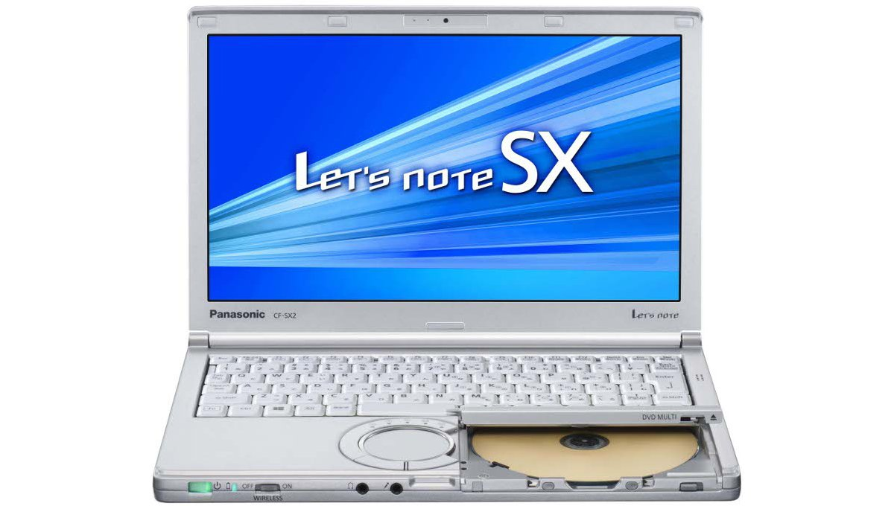
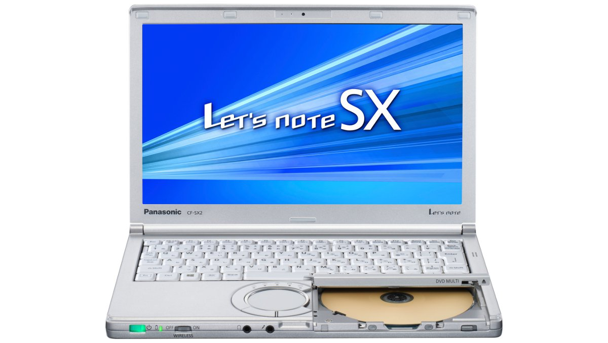
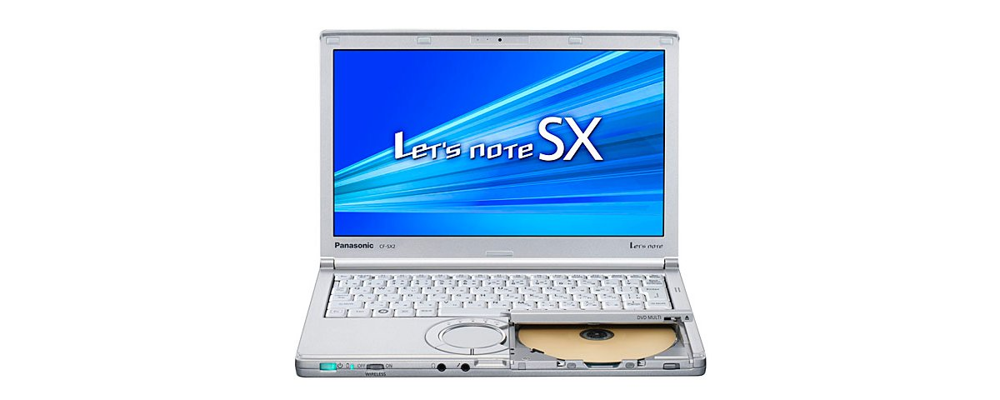
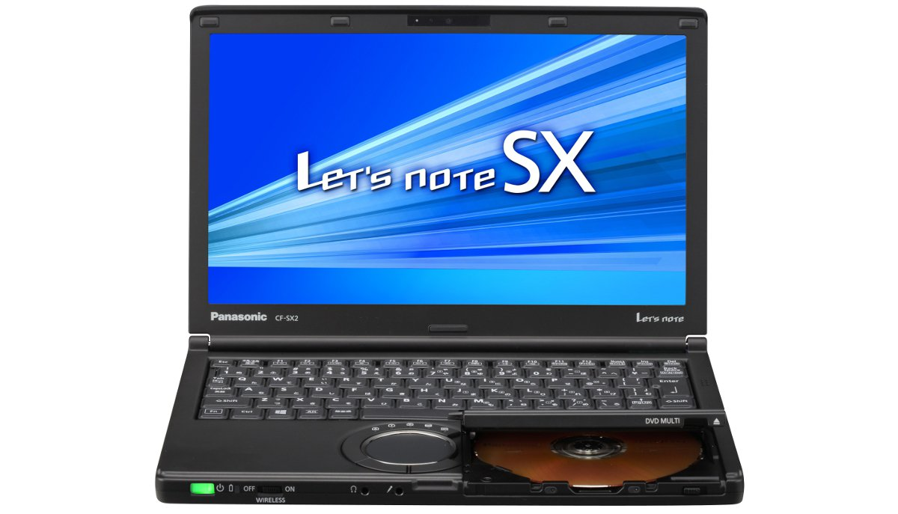
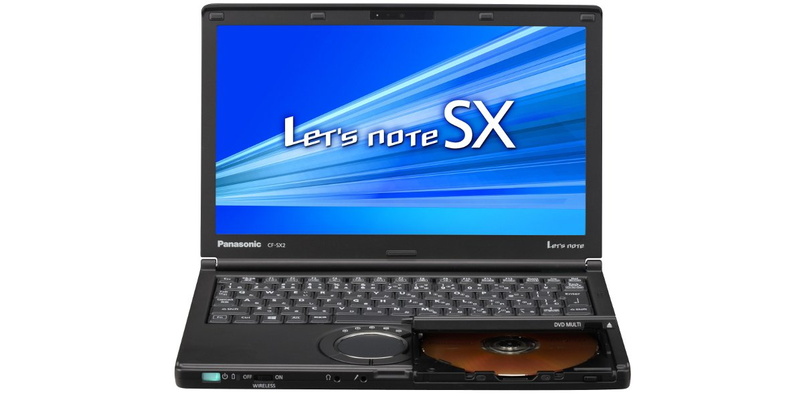
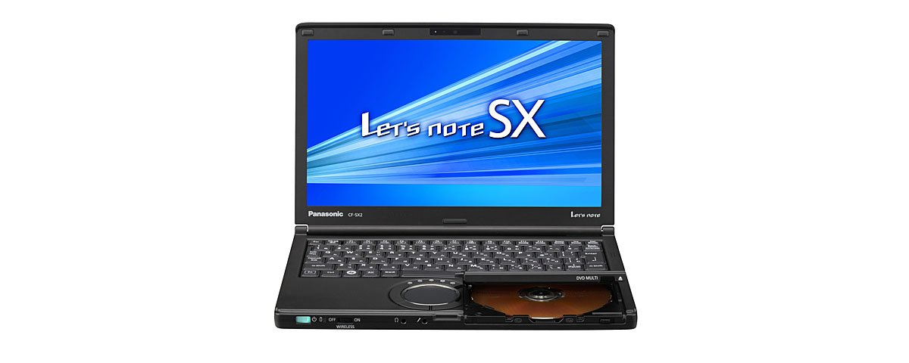

# 松下 Let's note CF-SX2 规格参数

[English](../../en/CF-SX2/) · [日本語](../../ja/CF-SX2/) · **中文**

**CF-SX2** 是松下 Let's note 笔记本电脑，属于 SX 系列，配备 12.1英寸 HD+ 屏幕。本页收录其全部 25 个型号（2012-06 – 2013-05 发售）的规格参数。每个型号均附官方规格表链接。

*松下 Let's note CF-SX2（CF-SX2BEABR, CF-SX2BEPBR, CF-SX2AETBR, CF-SX2AEYBR …），银色。图片 © Panasonic*

## 型号列表

| 型号（品番） | 发售 | 停产 | 主要规格 |
| :-- | :-- | :-- | :-- |
| [CF-SX2DETBR](https://panasonic.jp/pc/p-db/CF-SX2DETBR_spec.html) | 2013-05 | 2013-11 | Windows 8 Pro 64ビット、インテル® CoreTM i7-3540M vProTM（3.0GHz）、メモリー：標準4GB（空きスロット1、最大8GB）、SSD：128GB、スーパーマルチドライブ、LAN、無線LAN 802.11a(W52/W53/W56)/b/g/n |
| [CF-SX2DEYBR](https://panasonic.jp/pc/p-db/CF-SX2DEYBR_spec.html) | 2013-05 | 2013-11 | Windows 8 Pro 64ビット、インテル® CoreTM i7-3540M vProTM（3.0GHz）、メモリー：標準4GB（空きスロット1、最大8GB）、SSD：128GB、スーパーマルチドライブ、LAN、無線LAN 802.11a(W52/W53/W56)/b/g/n、Office Home and Business 2013 |
| [CF-SX2CEABR](https://panasonic.jp/pc/p-db/CF-SX2CEABR_spec.html) | 2013-05 | 2013-11 | Windows 8 Pro 64ビット、インテル® CoreTM i5-3340M vProTM（2.70GHz）、メモリー：標準4GB（空きスロット1、最大8GB）、HDD：750GB、スーパーマルチドライブ、LAN、無線LAN 802.11a(W52/W53/W56)/b/g/n |
| [CF-SX2CEPBR](https://panasonic.jp/pc/p-db/CF-SX2CEPBR_spec.html) | 2013-05 | 2013-11 | Windows 8 Pro 64ビット、インテル® CoreTM i5-3340M vProTM（2.70GHz）、メモリー：標準4GB（空きスロット1、最大8GB）、HDD：750GB、スーパーマルチドライブ、LAN、無線LAN 802.11a(W52/W53/W56)/b/g/n、Office Home and Business 2013 |
| [CF-SX2CEBBR](https://panasonic.jp/pc/p-db/CF-SX2CEBBR_spec.html) | 2013-05 | 2013-11 | Windows 8 Pro 64ビット、インテル® CoreTM i5-3340M vProTM（2.70GHz）、メモリー：標準4GB（空きスロット1、最大8GB）、HDD：750GB、スーパーマルチドライブ、LAN、無線LAN 802.11a(W52/W53/W56)/b/g/n |
| [CF-SX2CEQBR](https://panasonic.jp/pc/p-db/CF-SX2CEQBR_spec.html) | 2013-05 | 2013-11 | Windows 8 Pro 64ビット、インテル® CoreTM i5-3340M vProTM（2.70GHz）、メモリー：標準4GB（空きスロット1、最大8GB）、HDD：750GB、スーパーマルチドライブ、LAN、無線LAN 802.11a(W52/W53/W56)/b/g/n、Office Home and Business 2013 |
| [CF-SX2BEABR](https://panasonic.jp/pc/p-db/CF-SX2BEABR_spec.html) | 2013-02 | 2013-08 | Windows 8 Pro 64ビット、インテル® CoreTM i7-3540M vProTM（3.0GHz）、メモリー：標準4GB（空きスロット1、最大8GB）、HDD：640GB、スーパーマルチドライブ、LAN、無線LAN 802.11a(W52/W53/W56)/b/g/n |
| [CF-SX2BEPBR](https://panasonic.jp/pc/p-db/CF-SX2BEPBR_spec.html) | 2013-02 | 2013-08 | Windows 8 Pro 64ビット、インテル® CoreTM i7-3540M vProTM（3.0GHz）、メモリー：標準4GB（空きスロット1、最大8GB）、HDD：640GB、スーパーマルチドライブ、LAN、無線LAN 802.11a(W52/W53/W56)/b/g/n、Office Home and Business 2013 |
| [CF-SX2AETBR](https://panasonic.jp/pc/p-db/CF-SX2AETBR_spec.html) | 2013-02 | 2013-08 | Windows 8 Pro 64ビット、インテル® CoreTM i5-3340M vProTM（2.70GHz）、メモリー：標準4GB（空きスロット1、最大8GB）、SSD：128GB、スーパーマルチドライブ、LAN、無線LAN 802.11a(W52/W53/W56)/b/g/n |
| [CF-SX2AEYBR](https://panasonic.jp/pc/p-db/CF-SX2AEYBR_spec.html) | 2013-02 | 2013-08 | Windows 8 Pro 64ビット、インテル® CoreTM i5-3340M vProTM（2.70GHz）、メモリー：標準4GB（空きスロット1、最大8GB）、SSD：128GB、スーパーマルチドライブ、LAN、無線LAN 802.11a(W52/W53/W56)/b/g/n、Office Home and Business 2013 |
| [CF-SX2AEABR](https://panasonic.jp/pc/p-db/CF-SX2AEABR_spec.html) | 2013-02 | 2013-08 | Windows 8 Pro 64ビット、インテル® CoreTM i5-3340M vProTM（2.70GHz）、メモリー：標準4GB（空きスロット1、最大8GB）、HDD：640GB、スーパーマルチドライブ、LAN、無線LAN 802.11a(W52/W53/W56)/b/g/n |
| [CF-SX2AEPBR](https://panasonic.jp/pc/p-db/CF-SX2AEPBR_spec.html) | 2013-02 | 2013-08 | Windows 8 Pro 64ビット、インテル® CoreTM i5-3340M vProTM（2.70GHz）、メモリー：標準4GB（空きスロット1、最大8GB）、HDD：640GB、スーパーマルチドライブ、LAN、無線LAN 802.11a(W52/W53/W56)/b/g/n、Office Home and Business 2013 |
| [CF-SX2AEBBR](https://panasonic.jp/pc/p-db/CF-SX2AEBBR_spec.html) | 2013-02 | 2013-08 | Windows 8 Pro 64ビット、インテル® CoreTM i5-3340M vProTM（2.70GHz）、メモリー：標準4GB（空きスロット1、最大8GB）、HDD：640GB、スーパーマルチドライブ、LAN、無線LAN 802.11a(W52/W53/W56)/b/g/n |
| [CF-SX2AEQBR](https://panasonic.jp/pc/p-db/CF-SX2AEQBR_spec.html) | 2013-02 | 2013-08 | Windows 8 Pro 64ビット、インテル® CoreTM i5-3340M vProTM（2.70GHz）、メモリー：標準4GB（空きスロット1、最大8GB）、HDD：640GB、スーパーマルチドライブ、LAN、無線LAN 802.11a(W52/W53/W56)/b/g/n、Office Home and Business 2013 |
| [CF-SX2LEABR](https://panasonic.jp/pc/p-db/CF-SX2LEABR_spec.html) | 2012-10 | 2013-05 | Windows 8 Pro 64ビット、インテル® CoreTM i5-3320M vProTM（2.60GHz）、メモリー：標準4GB（空きスロット1、最大8GB）、HDD：640GB、スーパーマルチドライブ、LAN、無線LAN 802.11a(W52/W53/W56)/b/g/n |
| [CF-SX2LEPBR](https://panasonic.jp/pc/p-db/CF-SX2LEPBR_spec.html) | 2012-10 | 2013-05 | Windows 8 Pro 64ビット、インテル® CoreTM i5-3320M vProTM（2.60GHz）、メモリー：標準4GB（空きスロット1、最大8GB）、HDD：640GB、スーパーマルチドライブ、LAN、無線LAN 802.11a(W52/W53/W56)/b/g/n、Office Home and Business 2010 |
| [CF-SX2LEBBR](https://panasonic.jp/pc/p-db/CF-SX2LEBBR_spec.html) | 2012-10 | 2013-05 | Windows 8 Pro 64ビット、インテル® CoreTM i5-3320M vProTM（2.60GHz）、メモリー：標準4GB（空きスロット1、最大8GB）、HDD：640GB、スーパーマルチドライブ、LAN、無線LAN 802.11a(W52/W53/W56)/b/g/n |
| [CF-SX2LEQBR](https://panasonic.jp/pc/p-db/CF-SX2LEQBR_spec.html) | 2012-10 | 2013-05 | Windows 8 Pro 64ビット、インテル® CoreTM i5-3320M vProTM（2.60GHz）、メモリー：標準4GB（空きスロット1、最大8GB）、HDD：640GB、スーパーマルチドライブ、LAN、無線LAN 802.11a(W52/W53/W56)/b/g/n、Office Home and Business 2010 |
| [CF-SX2LETBR](https://panasonic.jp/pc/p-db/CF-SX2LETBR_spec.html) | 2012-10 | 2013-05 | Windows 8 Pro 64ビット、インテル® CoreTM i5-3320M vProTM（2.60GHz）、メモリー：標準4GB（空きスロット1、最大8GB）、SSD：128GB、スーパーマルチドライブ、LAN、無線LAN 802.11a(W52/W53/W56)/b/g/n |
| [CF-SX2LEYBR](https://panasonic.jp/pc/p-db/CF-SX2LEYBR_spec.html) | 2012-10 | 2013-05 | Windows 8 Pro 64ビット、インテル® CoreTM i5-3320M vProTM（2.60GHz）、メモリー：標準4GB（空きスロット1、最大8GB）、SSD：128GB、スーパーマルチドライブ、LAN、無線LAN 802.11a(W52/W53/W56)/b/g/n、Office Home and Business 2010 |
| [CF-SX2JEADR](https://panasonic.jp/pc/p-db/CF-SX2JEADR_spec.html) | 2012-06 | 2013-02 | Windows 7 Professional 64ビット 正規版 （Service Pack 1 適用済み）、インテル® CoreTM i5-3320M vProTM（2.60GHz）、メモリー：標準4GB（空きスロット1、最大8GB）、HDD：500GB、スーパーマルチドライブ、LAN、無線LAN 802.11a(W52/W53/W56)/b/g/n |
| [CF-SX2JEPDR](https://panasonic.jp/pc/p-db/CF-SX2JEPDR_spec.html) | 2012-06 | 2013-02 | Windows 7 Professional 64ビット 正規版 （Service Pack 1 適用済み）、インテル® CoreTM i5-3320M vProTM（2.60GHz）、メモリー：標準4GB（空きスロット1、最大8GB）、HDD：500GB、スーパーマルチドライブ、LAN、無線LAN 802.11a(W52/W53/W56)/b/g/n、Office Home and Business 2010 |
| [CF-SX2JEBDR](https://panasonic.jp/pc/p-db/CF-SX2JEBDR_spec.html) | 2012-06 | 2013-02 | Windows 7 Professional 64ビット 正規版 （Service Pack 1 適用済み）、インテル® CoreTM i5-3320M vProTM（2.60GHz）、メモリー：標準4GB（空きスロット1、最大8GB）、HDD：500GB、スーパーマルチドライブ、LAN、無線LAN 802.11a(W52/W53/W56)/b/g/n |
| [CF-SX2JEQDR](https://panasonic.jp/pc/p-db/CF-SX2JEQDR_spec.html) | 2012-06 | 2013-02 | Windows 7 Professional 64ビット 正規版 （Service Pack 1 適用済み）、インテル® CoreTM i5-3320M vProTM（2.60GHz）、メモリー：標準4GB（空きスロット1、最大8GB）、HDD：500GB、スーパーマルチドライブ、LAN、無線LAN 802.11a(W52/W53/W56)/b/g/n、Office Home and Business 2010 |
| [CF-SX2JETDR](https://panasonic.jp/pc/p-db/CF-SX2JETDR_spec.html) | 2012-06 | 2013-02 | Windows 7 Professional 64ビット 正規版 （Service Pack 1 適用済み）、インテル® CoreTM i5-3320M vProTM（2.60GHz）、メモリー：標準4GB（空きスロット1、最大8GB）、SSD：128GB、スーパーマルチドライブ、LAN、無線LAN 802.11a(W52/W53/W56)/b/g/n、Office Home and Business 2010 |

## 通用规格

| 项目 | 规格 |
| :-- | :-- |
| 芯片组 | モバイル インテル QM77 Express チップセット |
| 内存 | 標準4GB PC3-10600/DDR3L SDRAM 最大8GB （空きスロット1） |
| 光驱 | スーパーマルチドライブ内蔵 バッファアンダーランエラー防止機能(SmoothLink)搭載、シェルドライブ(DVDマルチ) |
| 显示屏 | 12.1型ワイド(16:9)HD+ TFTカラー液晶 （1600 x 900ドット） |
| 显示屏 / 显卡 | インテル HD グラフィックス4000（CPUに内蔵） |
| 显示屏 / 色彩 | 1600×900ドット：約1677万色 |
| 无线通信模块 | インテル Centrino Advanced-N + WiMAX 6250 |
| 无线网络 | IEEE802.11a（W52/W53/W56）/b/g/n準拠 |
| 蓝牙 | Bluetooth v4.0 |
| 音频 | PCM音源（24ビットステレオ）、インテル High Definition Audio準拠、モノラルスピーカー |
| 安全芯片 | TPM（TCG V1.2準拠） |
| 卡槽 / SD 卡 | SDメモリーカード×1スロット（SDHCメモリーカード/SDXCメモリーカード対応/UHS-I高速転送対応/著作権保護技術対応） |
| 内存扩展槽 | DDR3L 204ピン SO-DIMM専用スロット×1（1.35V/PC3-10600/DDR3L SDRAM） |
| 摄像头 | 解像度：HD（720p）、有効画素数：最大1280×720ピクセル |
| 麦克风 | モノラル |
| 键盘 | OADG準拠86キー、キーピッチ19mm(横)/16mm(縦)(一部キーを除く） |
| 指点设备 | ホイールパッド |
| 功耗 | 最大約65W |

## 各型号差异

| 型号（品番） | 处理器 | 内存 | 存储 | 重量 | 续航 |
| :-- | :-- | :-- | :-- | :-- | :-- |
| CF-SX2DETBR | Core i7-3540M vPro | 4GB PC3-10600 | 128GB | 1.36 kg | 18.5 h |
| CF-SX2DEYBR | Core i7-3540M vPro | 4GB PC3-10600 | 128GB | 1.36 kg | 18.5 h |
| CF-SX2CEABR | Core i5-3340M vPro | 4GB PC3-10600 | ハードディスクドライブ | 1.40 kg | 18 h |
| CF-SX2CEPBR | Core i5-3340M vPro | 4GB PC3-10600 | ハードディスクドライブ | 1.40 kg | 18 h |
| CF-SX2CEBBR | Core i5-3340M vPro | 4GB PC3-10600 | ハードディスクドライブ | 1.40 kg | 18 h |
| CF-SX2CEQBR | Core i5-3340M vPro | 4GB PC3-10600 | ハードディスクドライブ | 1.40 kg | 18 h |
| CF-SX2BEABR | Core i7-3540M vPro | 4GB PC3-10600 | ハードディスクドライブ | 1.40 kg | 17.5 h |
| CF-SX2BEPBR | Core i7-3540M vPro | 4GB PC3-10600 | ハードディスクドライブ | 1.40 kg | 17.5 h |
| CF-SX2AETBR | Core i5-3340M vPro | 4GB PC3-10600 | 128GB | 1.36 kg | 19 h |
| CF-SX2AEYBR | Core i5-3340M vPro | 4GB PC3-10600 | 128GB | 1.36 kg | 19 h |
| CF-SX2AEABR | Core i5-3340M vPro | 4GB PC3-10600 | ハードディスクドライブ | 1.40 kg | 18 h |
| CF-SX2AEPBR | Core i5-3340M vPro | 4GB PC3-10600 | ハードディスクドライブ | 1.40 kg | 18 h |
| CF-SX2AEBBR | Core i5-3340M vPro | 4GB PC3-10600 | ハードディスクドライブ | 1.40 kg | 18 h |
| CF-SX2AEQBR | Core i5-3340M vPro | 4GB PC3-10600 | ハードディスクドライブ | 1.40 kg | 18 h |
| CF-SX2LEABR | Core i5-3320M vPro | 4GB PC3-10600 | ハードディスクドライブ | 1.40 kg | 18 h |
| CF-SX2LEPBR | Core i5-3320M vPro | 4GB PC3-10600 | ハードディスクドライブ | 1.40 kg | 18 h |
| CF-SX2LEBBR | Core i5-3320M vPro | 4GB PC3-10600 | ハードディスクドライブ | 1.40 kg | 18 h |
| CF-SX2LEQBR | Core i5-3320M vPro | 4GB PC3-10600 | ハードディスクドライブ | 1.40 kg | 18 h |
| CF-SX2LETBR | Core i5-3320M vPro | 4GB PC3-10600 | 128GB | 1.36 kg | 19 h |
| CF-SX2LEYBR | Core i5-3320M vPro | 4GB PC3-10600 | 128GB | 1.36 kg | 19 h |
| CF-SX2JEADR | Core i5-3320M vPro | 4GB PC3-10600 | ハードディスクドライブ | 1.39 kg | 18 h |
| CF-SX2JEPDR | Core i5-3320M vPro | 4GB PC3-10600 | ハードディスクドライブ | 1.39 kg | 18 h |
| CF-SX2JEBDR | Core i5-3320M vPro | 4GB PC3-10600 | ハードディスクドライブ | 1.39 kg | 18 h |
| CF-SX2JEQDR | Core i5-3320M vPro | 4GB PC3-10600 | ハードディスクドライブ | 1.39 kg | 18 h |
| CF-SX2JETDR | Core i5-3320M vPro | 4GB PC3-10600 | 128GB | 1.33 kg | 19 h |

CF-SX2DETBR 的全部差异规格

| 项目 | 规格 |
| :-- | :-- |
| 操作系统 | Windows8 Pro 64ビット正規版 |
| 处理器 | インテル vPro テクノロジー採用 / インテル Core i7-3540M vPro プロセッサー / インテルスマートキャッシュ4MB、動作周波数3.0GHz（インテル ターボ・ブースト・テクノロジー2.0利用時は最大3.70GHz） |
| 显存 | 最大1664MB (メインメモリーと共用) |
| 固态硬盘 | フラッシュメモリードライブ（SSD）128GB（Serial ATA）上記容量のうち約14GBをリカバリー領域、約1GBをシステム領域として使用（ユーザー使用不可） |
| 光驱速度 / 读取 | DVD-RAM：最大5倍速、DVD-R：最大8倍速、DVD-RW：最大8倍速、DVD-R DL:最大8倍速、DVD-ROM：最大8倍速、+R：最大8倍速、+R DL：最大8倍速、+RW：最大8倍速、HighSpeed +RW：最大8倍速、CD-ROM：最大24倍速、CD-R：最大24倍速、CD-RW：最大24倍速、High-Speed CD-RW：最大24倍速、Ultra-Speed CD-RW：最大24倍速 |
| 光驱速度 / 写入 | DVD-RAM書き換え：最大5倍速、DVD-R 書き込み：最大8倍速、DVD-R DL 書き込み：最大6倍速、DVD-RW 書き換え：最大6倍速、+R 書き込み：最大8倍速、+R DL 書き込み：最大6倍速、+RW 書き換え：最大4倍速、High Speed +RW 書き換え：最大8倍速、CD-R 書き込み：最大24倍速、CD-RW 書き換え：4倍速、High-Speed CD-RW 書き換え：10倍速、Ultra-Speed CD-RW 書き換え：最大16倍速 |
| 支持光盘 / 读取 | DVD-ROM（ 1 層、2層）、DVD-Video、DVD-R（ 1.4GB、2.8GB、4.7GB）、DVD-RW（ Ver.1.1/1.2 1.4GB、2.8GB、4.7GB、9.4GB）、DVD-R DL（ 8.5GB ）、DVD-RAM（ 1.4GB、2.8GB、4.7GB、9.4GB ）、+R（ 4.7GB ）、+R DL（ 8.5GB ）、+RW（ 4.7GB ）、HighSpeed +RW（ 4.7GB ）、CD-Audio、CD-ROM（XA対応）、CD-R、Photo CD（マルチセッション対応）、Video CD、CD EXTRA、CD-RW、High-Speed CD-RW、Ultra-Speed CD-RW、CD-TEXT |
| 支持光盘 / 写入 | DVD-RAM（ 1.4GB、2.8GB、4.7GB、9.4GB）、DVD-R（ 1.4GB、2.8 GB、4.7GB for General）、DVD-RW（ Ver.1.1/1.2 1.4GB、2.8GB、4.7GB、9.4GB）、DVD-R DL（ 8.5GB ）、+R（ 4.7GB ）、+R DL（ 8.5GB ）、+RW（ 4.7GB ）、High Speed+RW（ 4.7GB）、CD-R、CD-RW、High-Speed CD-RW、Ultra-Speed CD-RW |
| 显示屏 / 外接显示输出 | 1024×768、1280×768、1280×1024、1360×768、1366×768、1400×1050、1600×900、1600×1200、1680×1050 、1920×1080、1920×1200ドット：約1677万色 |
| 显示屏 / 同时显示 | 1024×768、1280×768、1360×768、1366×768、1600×900ドット：約1677万色 |
| 移动 WiMAX | IEEE802.16e-2005準拠（受信最大28Mbps（ベストエフォート方式）、送信最大8Mbps（ベストエフォート方式）） |
| 有线网络 | 1000BASE-T/100BASE-TX/10BASE-T |
| 卡槽 / PC 卡 | － |
| 接口 | LANコネクター（RJ-45） / 外部ディスプレイコネクター（アナログRGB ミニD-sub 15ピン） / HDMI出力端子 / マイク入力端子（ステレオミニジャックM3（プラグインパワー対応）） / オーディオ出力端子（ステレオミニジャックM3） / USB3.0ポート×2(左側面) / USB2.0ポート×1(右側面) |
| 电源 | ▼ACアダプター / 入力：AC100V～240V、50Hz/60Hz、出力：DC16V、4.06A、電源コードは100V専用 / ▼バッテリーパック / 7.2V リチウムイオン・公称容量13600mAh、定格容量12800mAh、軽量バッテリーパック：7.2V リチウムイオン・公称容量6800mAh、定格容量6400mAh |
| 能效 | 2011年度基準 N区分0.073 |
| 能效达成率（2011 年度标准） | — |
| 续航 / 充电时间 | ▼駆動時間：約18.5時間 （軽量バッテリーパック装着時：約9時間） / ▼充電時間：約4時間（電源OFF時）、約5時間（電源ON時） |
| 尺寸（宽×深×高） | 標準バッテリーパック(L)搭載時 / 幅295mm×奥行216.2mm×高さ25.4mm 最厚部は31.5mm 突起部除く / 軽量バッテリーパック(S)搭載時 / 幅295mm×奥行197.5mm×高さ25.4mm 最厚部は31.5mm 突起部除く |
| 颜色 | シルバー |
| 重量（含电池） | パソコン本体：約1.36kg（付属のバッテリーパック(約0.43kg)装着時）、パソコン本体：約1.15kg（軽量バッテリーパック（約0.22kg）装着時）、ACアダプター：約0.2kg（電源コード（約0.06 kg）除く） |
| 预装软件 | Microsoft Internet Explorer 10 / ネットセレクター3 / 無線ツールボックス / Bluetooth Stack for Windows by TOSHIBA / セキュリティ設定ユーティリティ / マカフィー・PCセキュリティセンター / マカフィー・アンチセフト / i-フィルター6.0 (30日お試し版) / Infineon TPM Professional Package / Adobe Reader / WinZip 16.5日本語版（45日体験版） / バッテリー残量表示補正ユーティリティ / ホイールパッドユーティリティ / NumLockお知らせ / Hotkey設定 / Fn Ctrl入れ替えユーティリティ / 電源プラン拡張ユーティリティ / ピークシフト制御ユーティリティ / Total Media Backup & Record / ArcSoft ShowBiz / Microsoft Windows Media Player 12 / CyberLink PowerDVD10 / プロジェクターヘルパー / USBキーボードヘルパー / ディスプレイヘルパー / Wireless Manager mobile edition6.0 / USB充電設定ユーティリティ / カメラユーティリティ / Camera for Panasonic PC / スマートアーチ / 画面分割ユーティリティ / 解像度切り替えユーティリティ / PC情報ポップアップ / PC情報ビューアー / Aptioセットアップユーティリティ / PC-Diagnosticユーティリティ / Dashboard for Panasonic PC / リカバリーディスク作成ユーティリティ / ハードディスクデータ消去ユーティリティ / DirectX 11 / Microsoft .NET Framework 4.5 / インテル PROSet/Wireless Software / VIP Access for Desktop（インテルIPT用アプリケーションソフト） |
| 附件 | 標準ACアダプター、標準バッテリーパック(L)、ミニACアダプター、軽量バッテリーパック(S)、取扱説明書 |

官方规格表: <https://panasonic.jp/pc/p-db/CF-SX2DETBR_spec.html>

CF-SX2DEYBR 的全部差异规格

| 项目 | 规格 |
| :-- | :-- |
| 操作系统 | Windows8 Pro 64ビット正規版 |
| 处理器 | インテル vPro テクノロジー採用 / インテル Core i7-3540M vPro プロセッサー / インテルスマートキャッシュ4MB、動作周波数3.0GHz（インテル ターボ・ブースト・テクノロジー2.0利用時は最大3.70GHz） |
| 显存 | 最大1664MB (メインメモリーと共用) |
| 固态硬盘 | フラッシュメモリードライブ（SSD）128GB（Serial ATA）上記容量のうち約14GBをリカバリー領域、約1GBをシステム領域として使用（ユーザー使用不可） |
| 光驱速度 / 读取 | DVD-RAM：最大5倍速、DVD-R：最大8倍速、DVD-RW：最大8倍速、DVD-R DL:最大8倍速、DVD-ROM：最大8倍速、+R：最大8倍速、+R DL：最大8倍速、+RW：最大8倍速、HighSpeed +RW：最大8倍速、CD-ROM：最大24倍速、CD-R：最大24倍速、CD-RW：最大24倍速、High-Speed CD-RW：最大24倍速、Ultra-Speed CD-RW：最大24倍速 |
| 光驱速度 / 写入 | DVD-RAM書き換え：最大5倍速、DVD-R 書き込み：最大8倍速、DVD-R DL 書き込み：最大6倍速、DVD-RW 書き換え：最大6倍速、+R 書き込み：最大8倍速、+R DL 書き込み：最大6倍速、+RW 書き換え：最大4倍速、High Speed +RW 書き換え：最大8倍速、CD-R 書き込み：最大24倍速、CD-RW 書き換え：4倍速、High-Speed CD-RW 書き換え：10倍速、Ultra-Speed CD-RW 書き換え：最大16倍速 |
| 支持光盘 / 读取 | DVD-ROM（ 1 層、2層）、DVD-Video、DVD-R（ 1.4GB、2.8GB、4.7GB）、DVD-RW（ Ver.1.1/1.2 1.4GB、2.8GB、4.7GB、9.4GB）、DVD-R DL（ 8.5GB ）、DVD-RAM（ 1.4GB、2.8GB、4.7GB、9.4GB ）、+R（ 4.7GB ）、+R DL（ 8.5GB ）、+RW（ 4.7GB ）、HighSpeed +RW（ 4.7GB ）、CD-Audio、CD-ROM（XA対応）、CD-R、Photo CD（マルチセッション対応）、Video CD、CD EXTRA、CD-RW、High-Speed CD-RW、Ultra-Speed CD-RW、CD-TEXT |
| 支持光盘 / 写入 | DVD-RAM（ 1.4GB、2.8GB、4.7GB、9.4GB）、DVD-R（ 1.4GB、2.8 GB、4.7GB for General）、DVD-RW（ Ver.1.1/1.2 1.4GB、2.8GB、4.7GB、9.4GB）、DVD-R DL（ 8.5GB ）、+R（ 4.7GB ）、+R DL（ 8.5GB ）、+RW（ 4.7GB ）、High Speed+RW（ 4.7GB）、CD-R、CD-RW、High-Speed CD-RW、Ultra-Speed CD-RW |
| 显示屏 / 外接显示输出 | 1024×768、1280×768、1280×1024、1360×768、1366×768、1400×1050、1600×900、1600×1200、1680×1050 、1920×1080、1920×1200ドット：約1677万色 |
| 显示屏 / 同时显示 | 1024×768、1280×768、1360×768、1366×768、1600×900ドット：約1677万色 |
| 移动 WiMAX | IEEE802.16e-2005準拠（受信最大28Mbps（ベストエフォート方式）、送信最大8Mbps（ベストエフォート方式）） |
| 有线网络 | 1000BASE-T/100BASE-TX/10BASE-T |
| 卡槽 / PC 卡 | － |
| 接口 | LANコネクター（RJ-45） / 外部ディスプレイコネクター（アナログRGB ミニD-sub 15ピン） / HDMI出力端子 / マイク入力端子（ステレオミニジャックM3（プラグインパワー対応）） / オーディオ出力端子（ステレオミニジャックM3） / USB3.0ポート×2(左側面) / USB2.0ポート×1(右側面) |
| 电源 | ▼ACアダプター / 入力：AC100V～240V、50Hz/60Hz、出力：DC16V、4.06A、電源コードは100V専用 / ▼バッテリーパック / 7.2V リチウムイオン・公称容量13600mAh、定格容量12800mAh、軽量バッテリーパック：7.2V リチウムイオン・公称容量6800mAh、定格容量6400mAh |
| 能效 | 2011年度基準 N区分0.073 |
| 能效达成率（2011 年度标准） | — |
| 续航 / 充电时间 | ▼駆動時間：約18.5時間 （軽量バッテリーパック装着時：約9時間） / ▼充電時間：約4時間（電源OFF時）、約5時間（電源ON時） |
| 尺寸（宽×深×高） | 標準バッテリーパック(L)搭載時 / 幅295mm×奥行216.2mm×高さ25.4mm 最厚部は31.5mm 突起部除く / 軽量バッテリーパック(S)搭載時 / 幅295mm×奥行197.5mm×高さ25.4mm 最厚部は31.5mm 突起部除く |
| 颜色 | シルバー |
| 重量（含电池） | パソコン本体：約1.36kg（付属のバッテリーパック(約0.43kg)装着時）、パソコン本体：約1.15kg（軽量バッテリーパック（約0.22kg）装着時）、ACアダプター：約0.2kg（電源コード（約0.06 kg）除く） |
| 预装软件 | Microsoft Internet Explorer 10 / ネットセレクター3 / 無線ツールボックス / Bluetooth Stack for Windows by TOSHIBA / セキュリティ設定ユーティリティ / マカフィー・PCセキュリティセンター / マカフィー・アンチセフト / i-フィルター6.0 (30日お試し版) / Infineon TPM Professional Package / Adobe Reader / WinZip 16.5日本語版（45日体験版） / バッテリー残量表示補正ユーティリティ / ホイールパッドユーティリティ / NumLockお知らせ / Hotkey設定 / Fn Ctrl入れ替えユーティリティ / 電源プラン拡張ユーティリティ / ピークシフト制御ユーティリティ / Total Media Backup & Record / ArcSoft ShowBiz / Microsoft Windows Media Player 12 / CyberLink PowerDVD10 / プロジェクターヘルパー / USBキーボードヘルパー / ディスプレイヘルパー / Wireless Manager mobile edition6.0 / USB充電設定ユーティリティ / カメラユーティリティ / Camera for Panasonic PC / スマートアーチ / 画面分割ユーティリティ / 解像度切り替えユーティリティ / PC情報ポップアップ / PC情報ビューアー / Aptioセットアップユーティリティ / PC-Diagnosticユーティリティ / Dashboard for Panasonic PC / リカバリーディスク作成ユーティリティ / ハードディスクデータ消去ユーティリティ / DirectX 11 / Microsoft .NET Framework 4.5 / インテル PROSet/Wireless Software / VIP Access for Desktop（インテルIPT用アプリケーションソフト） |
| 附件 | 標準ACアダプター、標準バッテリーパック(L)、ミニACアダプター、軽量バッテリーパック(S)、取扱説明書、Microsoft Office Home and Business 2013 |
| Microsoft Office | Microsoft Office Home and Business 2013 |

官方规格表: <https://panasonic.jp/pc/p-db/CF-SX2DEYBR_spec.html>

CF-SX2CEABR 的全部差异规格

| 项目 | 规格 |
| :-- | :-- |
| 操作系统 | Windows8 Pro 64ビット正規版 |
| 处理器 | インテル vPro テクノロジー採用 / インテル Core i5-3340M vPro プロセッサー / インテルスマートキャッシュ3MB、動作周波数2.70GHz（インテル ターボ・ブースト・テクノロジー2.0利用時は最大3.40GHz） |
| 显存 | 最大1664MB (メインメモリーと共用) |
| 光驱速度 / 读取 | DVD-RAM：最大5倍速、DVD-R：最大8倍速、DVD-RW：最大8倍速、DVD-R DL:最大8倍速、DVD-ROM：最大8倍速、+R：最大8倍速、+R DL：最大8倍速、+RW：最大8倍速、HighSpeed +RW：最大8倍速、CD-ROM：最大24倍速、CD-R：最大24倍速、CD-RW：最大24倍速、High-Speed CD-RW：最大24倍速、Ultra-Speed CD-RW：最大24倍速 |
| 光驱速度 / 写入 | DVD-RAM書き換え：最大5倍速、DVD-R 書き込み：最大8倍速、DVD-R DL 書き込み：最大6倍速、DVD-RW 書き換え：最大6倍速、+R 書き込み：最大8倍速、+R DL 書き込み：最大6倍速、+RW 書き換え：最大4倍速、High Speed +RW 書き換え：最大8倍速、CD-R 書き込み：最大24倍速、CD-RW 書き換え：4倍速、High-Speed CD-RW 書き換え：10倍速、Ultra-Speed CD-RW 書き換え：最大16倍速 |
| 支持光盘 / 读取 | DVD-ROM（ 1 層、2層）、DVD-Video、DVD-R（ 1.4GB、2.8GB、4.7GB）、DVD-RW（ Ver.1.1/1.2 1.4GB、2.8GB、4.7GB、9.4GB）、DVD-R DL（ 8.5GB ）、DVD-RAM（ 1.4GB、2.8GB、4.7GB、9.4GB ）、+R（ 4.7GB ）、+R DL（ 8.5GB ）、+RW（ 4.7GB ）、HighSpeed +RW（ 4.7GB ）、CD-Audio、CD-ROM（XA対応）、CD-R、Photo CD（マルチセッション対応）、Video CD、CD EXTRA、CD-RW、High-Speed CD-RW、Ultra-Speed CD-RW、CD-TEXT |
| 支持光盘 / 写入 | DVD-RAM（ 1.4GB、2.8GB、4.7GB、9.4GB）、DVD-R（ 1.4GB、2.8 GB、4.7GB for General）、DVD-RW（ Ver.1.1/1.2 1.4GB、2.8GB、4.7GB、9.4GB）、DVD-R DL（ 8.5GB ）、+R（ 4.7GB ）、+R DL（ 8.5GB ）、+RW（ 4.7GB ）、High Speed+RW（ 4.7GB）、CD-R、CD-RW、High-Speed CD-RW、Ultra-Speed CD-RW |
| 显示屏 / 外接显示输出 | 1024×768、1280×768、1280×1024、1360×768、1366×768、1400×1050、1600×900、1600×1200、1680×1050 、1920×1080、1920×1200ドット：約1677万色 |
| 显示屏 / 同时显示 | 1024×768、1280×768、1360×768、1366×768、1600×900ドット：約1677万色 |
| 移动 WiMAX | IEEE802.16e-2005準拠（受信最大28Mbps（ベストエフォート方式）、送信最大8Mbps（ベストエフォート方式）） |
| 有线网络 | 1000BASE-T/100BASE-TX/10BASE-T |
| 卡槽 / PC 卡 | － |
| 接口 | LANコネクター（RJ-45） / 外部ディスプレイコネクター（アナログRGB ミニD-sub 15ピン） / HDMI出力端子 / マイク入力端子（ステレオミニジャックM3（プラグインパワー対応）） / オーディオ出力端子（ステレオミニジャックM3） / USB3.0ポート×2(左側面) / USB2.0ポート×1(右側面) |
| 电源 | ▼ACアダプター / 入力：AC100V～240V、50Hz/60Hz、出力：DC16V、4.06A、電源コードは100V専用 / ▼バッテリーパック / 7.2V リチウムイオン・公称容量13600mAh、定格容量12800mAh、軽量バッテリーパック：7.2V リチウムイオン・公称容量6800mAh、定格容量6400mAh |
| 能效 | 2011年度基準 N区分0.079 |
| 能效达成率（2011 年度标准） | — |
| 续航 / 充电时间 | ▼駆動時間：約18時間 （軽量バッテリーパック装着時：約9時間） / ▼充電時間：約4時間（電源OFF時）、約5時間（電源ON時） |
| 尺寸（宽×深×高） | 標準バッテリーパック(L)搭載時 / 幅295mm×奥行216.2mm×高さ25.4mm 最厚部は31.5mm 突起部除く / 軽量バッテリーパック(S)搭載時 / 幅295mm×奥行197.5mm×高さ25.4mm 最厚部は31.5mm 突起部除く |
| 颜色 | シルバー |
| 重量（含电池） | パソコン本体：約1.40kg（付属のバッテリーパック(約0.43kg)装着時）、パソコン本体：約1.19kg（軽量バッテリーパック（約0.22kg）装着時）、ACアダプター：約0.2kg（電源コード（約0.06 kg）除く） |
| 预装软件 | Microsoft Internet Explorer 10 / ネットセレクター3 / 無線ツールボックス / Bluetooth Stack for Windows by TOSHIBA / セキュリティ設定ユーティリティ / マカフィー・PCセキュリティセンター / マカフィー・アンチセフト / i-フィルター6.0 (30日お試し版) / Infineon TPM Professional Package / Adobe Reader / WinZip 16.5日本語版（45日体験版） / バッテリー残量表示補正ユーティリティ / ホイールパッドユーティリティ / NumLockお知らせ / Hotkey設定 / Fn Ctrl入れ替えユーティリティ / 電源プラン拡張ユーティリティ / ピークシフト制御ユーティリティ / Total Media Backup & Record / ArcSoft ShowBiz / Microsoft Windows Media Player 12 / CyberLink PowerDVD10 / プロジェクターヘルパー / USBキーボードヘルパー / ディスプレイヘルパー / Wireless Manager mobile edition6.0 / USB充電設定ユーティリティ / カメラユーティリティ / Camera for Panasonic PC / スマートアーチ / 画面分割ユーティリティ / 解像度切り替えユーティリティ / PC情報ポップアップ / PC情報ビューアー / Aptioセットアップユーティリティ / PC-Diagnosticユーティリティ / Dashboard for Panasonic PC / リカバリーディスク作成ユーティリティ / ハードディスクデータ消去ユーティリティ / DirectX 11 / Microsoft .NET Framework 4.5 / インテル PROSet/Wireless Software / VIP Access for Desktop（インテルIPT用アプリケーションソフト） |
| 附件 | 標準ACアダプター、標準バッテリーパック(L)、ミニACアダプター、軽量バッテリーパック(S)、取扱説明書 |
| 硬盘 | ハードディスクドライブ（HDD）750GB（Serial ATA、5400rpm）上記容量のうち約14GBをリカバリー領域、約1GBをシステム領域として使用（ユーザー使用不可） |

官方规格表: <https://panasonic.jp/pc/p-db/CF-SX2CEABR_spec.html>

CF-SX2CEPBR 的全部差异规格

| 项目 | 规格 |
| :-- | :-- |
| 操作系统 | Windows8 Pro 64ビット正規版 |
| 处理器 | インテル vPro テクノロジー採用 / インテル Core i5-3340M vPro プロセッサー / インテルスマートキャッシュ3MB、動作周波数2.70GHz（インテル ターボ・ブースト・テクノロジー2.0利用時は最大3.40GHz） |
| 显存 | 最大1664MB (メインメモリーと共用) |
| 光驱速度 / 读取 | DVD-RAM：最大5倍速、DVD-R：最大8倍速、DVD-RW：最大8倍速、DVD-R DL:最大8倍速、DVD-ROM：最大8倍速、+R：最大8倍速、+R DL：最大8倍速、+RW：最大8倍速、HighSpeed +RW：最大8倍速、CD-ROM：最大24倍速、CD-R：最大24倍速、CD-RW：最大24倍速、High-Speed CD-RW：最大24倍速、Ultra-Speed CD-RW：最大24倍速 |
| 光驱速度 / 写入 | DVD-RAM書き換え：最大5倍速、DVD-R 書き込み：最大8倍速、DVD-R DL 書き込み：最大6倍速、DVD-RW 書き換え：最大6倍速、+R 書き込み：最大8倍速、+R DL 書き込み：最大6倍速、+RW 書き換え：最大4倍速、High Speed +RW 書き換え：最大8倍速、CD-R 書き込み：最大24倍速、CD-RW 書き換え：4倍速、High-Speed CD-RW 書き換え：10倍速、Ultra-Speed CD-RW 書き換え：最大16倍速 |
| 支持光盘 / 读取 | DVD-ROM（ 1 層、2層）、DVD-Video、DVD-R（ 1.4GB、2.8GB、4.7GB）、DVD-RW（ Ver.1.1/1.2 1.4GB、2.8GB、4.7GB、9.4GB）、DVD-R DL（ 8.5GB ）、DVD-RAM（ 1.4GB、2.8GB、4.7GB、9.4GB ）、+R（ 4.7GB ）、+R DL（ 8.5GB ）、+RW（ 4.7GB ）、HighSpeed +RW（ 4.7GB ）、CD-Audio、CD-ROM（XA対応）、CD-R、Photo CD（マルチセッション対応）、Video CD、CD EXTRA、CD-RW、High-Speed CD-RW、Ultra-Speed CD-RW、CD-TEXT |
| 支持光盘 / 写入 | DVD-RAM（ 1.4GB、2.8GB、4.7GB、9.4GB）、DVD-R（ 1.4GB、2.8 GB、4.7GB for General）、DVD-RW（ Ver.1.1/1.2 1.4GB、2.8GB、4.7GB、9.4GB）、DVD-R DL（ 8.5GB ）、+R（ 4.7GB ）、+R DL（ 8.5GB ）、+RW（ 4.7GB ）、High Speed+RW（ 4.7GB）、CD-R、CD-RW、High-Speed CD-RW、Ultra-Speed CD-RW |
| 显示屏 / 外接显示输出 | 1024×768、1280×768、1280×1024、1360×768、1366×768、1400×1050、1600×900、1600×1200、1680×1050 、1920×1080、1920×1200ドット：約1677万色 |
| 显示屏 / 同时显示 | 1024×768、1280×768、1360×768、1366×768、1600×900ドット：約1677万色 |
| 移动 WiMAX | IEEE802.16e-2005準拠（受信最大28Mbps（ベストエフォート方式）、送信最大8Mbps（ベストエフォート方式）） |
| 有线网络 | 1000BASE-T/100BASE-TX/10BASE-T |
| 卡槽 / PC 卡 | － |
| 接口 | LANコネクター（RJ-45） / 外部ディスプレイコネクター（アナログRGB ミニD-sub 15ピン） / HDMI出力端子 / マイク入力端子（ステレオミニジャックM3（プラグインパワー対応）） / オーディオ出力端子（ステレオミニジャックM3） / USB3.0ポート×2(左側面) / USB2.0ポート×1(右側面) |
| 电源 | ▼ACアダプター / 入力：AC100V～240V、50Hz/60Hz、出力：DC16V、4.06A、電源コードは100V専用 / ▼バッテリーパック / 7.2V リチウムイオン・公称容量13600mAh、定格容量12800mAh、軽量バッテリーパック：7.2V リチウムイオン・公称容量6800mAh、定格容量6400mAh |
| 能效 | 2011年度基準 N区分0.079 |
| 能效达成率（2011 年度标准） | — |
| 续航 / 充电时间 | ▼駆動時間：約18時間 （軽量バッテリーパック装着時：約9時間） / ▼充電時間：約4時間（電源OFF時）、約5時間（電源ON時） |
| 尺寸（宽×深×高） | 標準バッテリーパック(L)搭載時 / 幅295mm×奥行216.2mm×高さ25.4mm 最厚部は31.5mm 突起部除く / 軽量バッテリーパック(S)搭載時 / 幅295mm×奥行197.5mm×高さ25.4mm 最厚部は31.5mm 突起部除く |
| 颜色 | シルバー |
| 重量（含电池） | パソコン本体：約1.40kg（付属のバッテリーパック(約0.43kg)装着時）、パソコン本体：約1.19kg（軽量バッテリーパック（約0.22kg）装着時）、ACアダプター：約0.2kg（電源コード（約0.06 kg）除く） |
| 预装软件 | Microsoft Internet Explorer 10 / ネットセレクター3 / 無線ツールボックス / Bluetooth Stack for Windows by TOSHIBA / セキュリティ設定ユーティリティ / マカフィー・PCセキュリティセンター / マカフィー・アンチセフト / i-フィルター6.0 (30日お試し版) / Infineon TPM Professional Package / Adobe Reader / WinZip 16.5日本語版（45日体験版） / バッテリー残量表示補正ユーティリティ / ホイールパッドユーティリティ / NumLockお知らせ / Hotkey設定 / Fn Ctrl入れ替えユーティリティ / 電源プラン拡張ユーティリティ / ピークシフト制御ユーティリティ / Total Media Backup & Record / ArcSoft ShowBiz / Microsoft Windows Media Player 12 / CyberLink PowerDVD10 / プロジェクターヘルパー / USBキーボードヘルパー / ディスプレイヘルパー / Wireless Manager mobile edition6.0 / USB充電設定ユーティリティ / カメラユーティリティ / Camera for Panasonic PC / スマートアーチ / 画面分割ユーティリティ / 解像度切り替えユーティリティ / PC情報ポップアップ / PC情報ビューアー / Aptioセットアップユーティリティ / PC-Diagnosticユーティリティ / Dashboard for Panasonic PC / リカバリーディスク作成ユーティリティ / ハードディスクデータ消去ユーティリティ / DirectX 11 / Microsoft .NET Framework 4.5 / インテル PROSet/Wireless Software / VIP Access for Desktop（インテルIPT用アプリケーションソフト） |
| 附件 | 標準ACアダプター、標準バッテリーパック(L)、ミニACアダプター、軽量バッテリーパック(S)、取扱説明書、Microsoft Office Home and Business 2013 |
| Microsoft Office | Microsoft Office Home and Business 2013 |
| 硬盘 | ハードディスクドライブ（HDD）750GB（Serial ATA、5400rpm）上記容量のうち約14GBをリカバリー領域、約1GBをシステム領域として使用（ユーザー使用不可） |

官方规格表: <https://panasonic.jp/pc/p-db/CF-SX2CEPBR_spec.html>

CF-SX2CEBBR 的全部差异规格

| 项目 | 规格 |
| :-- | :-- |
| 操作系统 | Windows8 Pro 64ビット正規版 |
| 处理器 | インテル vPro テクノロジー採用 / インテル Core i5-3340M vPro プロセッサー / インテルスマートキャッシュ3MB、動作周波数2.70GHz（インテル ターボ・ブースト・テクノロジー2.0利用時は最大3.40GHz） |
| 显存 | 最大1664MB (メインメモリーと共用) |
| 光驱速度 / 读取 | DVD-RAM：最大5倍速、DVD-R：最大8倍速、DVD-RW：最大8倍速、DVD-R DL:最大8倍速、DVD-ROM：最大8倍速、+R：最大8倍速、+R DL：最大8倍速、+RW：最大8倍速、HighSpeed +RW：最大8倍速、CD-ROM：最大24倍速、CD-R：最大24倍速、CD-RW：最大24倍速、High-Speed CD-RW：最大24倍速、Ultra-Speed CD-RW：最大24倍速 |
| 光驱速度 / 写入 | DVD-RAM書き換え：最大5倍速、DVD-R 書き込み：最大8倍速、DVD-R DL 書き込み：最大6倍速、DVD-RW 書き換え：最大6倍速、+R 書き込み：最大8倍速、+R DL 書き込み：最大6倍速、+RW 書き換え：最大4倍速、High Speed +RW 書き換え：最大8倍速、CD-R 書き込み：最大24倍速、CD-RW 書き換え：4倍速、High-Speed CD-RW 書き換え：10倍速、Ultra-Speed CD-RW 書き換え：最大16倍速 |
| 支持光盘 / 读取 | DVD-ROM（ 1 層、2層）、DVD-Video、DVD-R（ 1.4GB、2.8GB、4.7GB）、DVD-RW（ Ver.1.1/1.2 1.4GB、2.8GB、4.7GB、9.4GB）、DVD-R DL（ 8.5GB ）、DVD-RAM（ 1.4GB、2.8GB、4.7GB、9.4GB ）、+R（ 4.7GB ）、+R DL（ 8.5GB ）、+RW（ 4.7GB ）、HighSpeed +RW（ 4.7GB ）、CD-Audio、CD-ROM（XA対応）、CD-R、Photo CD（マルチセッション対応）、Video CD、CD EXTRA、CD-RW、High-Speed CD-RW、Ultra-Speed CD-RW、CD-TEXT |
| 支持光盘 / 写入 | DVD-RAM（ 1.4GB、2.8GB、4.7GB、9.4GB）、DVD-R（ 1.4GB、2.8 GB、4.7GB for General）、DVD-RW（ Ver.1.1/1.2 1.4GB、2.8GB、4.7GB、9.4GB）、DVD-R DL（ 8.5GB ）、+R（ 4.7GB ）、+R DL（ 8.5GB ）、+RW（ 4.7GB ）、High Speed+RW（ 4.7GB）、CD-R、CD-RW、High-Speed CD-RW、Ultra-Speed CD-RW |
| 显示屏 / 外接显示输出 | 1024×768、1280×768、1280×1024、1360×768、1366×768、1400×1050、1600×900、1600×1200、1680×1050 、1920×1080、1920×1200ドット：約1677万色 |
| 显示屏 / 同时显示 | 1024×768、1280×768、1360×768、1366×768、1600×900ドット：約1677万色 |
| 移动 WiMAX | IEEE802.16e-2005準拠（受信最大28Mbps（ベストエフォート方式）、送信最大8Mbps（ベストエフォート方式）） |
| 有线网络 | 1000BASE-T/100BASE-TX/10BASE-T |
| 卡槽 / PC 卡 | － |
| 接口 | LANコネクター（RJ-45） / 外部ディスプレイコネクター（アナログRGB ミニD-sub 15ピン） / HDMI出力端子 / マイク入力端子（ステレオミニジャックM3（プラグインパワー対応）） / オーディオ出力端子（ステレオミニジャックM3） / USB3.0ポート×2(左側面) / USB2.0ポート×1(右側面) |
| 电源 | ▼ACアダプター / 入力：AC100V～240V、50Hz/60Hz、出力：DC16V、4.06A、電源コードは100V専用 / ▼バッテリーパック / 7.2V リチウムイオン・公称容量13600mAh、定格容量12800mAh、軽量バッテリーパック：7.2V リチウムイオン・公称容量6800mAh、定格容量6400mAh |
| 能效 | 2011年度基準 N区分0.079 |
| 能效达成率（2011 年度标准） | — |
| 续航 / 充电时间 | ▼駆動時間：約18時間 （軽量バッテリーパック装着時：約9時間） / ▼充電時間：約4時間（電源OFF時）、約5時間（電源ON時） |
| 尺寸（宽×深×高） | 標準バッテリーパック(L)搭載時 / 幅295mm×奥行216.2mm×高さ25.4mm 最厚部は31.5mm 突起部除く / 軽量バッテリーパック(S)搭載時 / 幅295mm×奥行197.5mm×高さ25.4mm 最厚部は31.5mm 突起部除く |
| 颜色 | ブラック |
| 重量（含电池） | パソコン本体：約1.40kg（付属のバッテリーパック(約0.43kg)装着時）、パソコン本体：約1.19kg（軽量バッテリーパック（約0.22kg）装着時）、ACアダプター：約0.2kg（電源コード（約0.06 kg）除く） |
| 预装软件 | Microsoft Internet Explorer 10 / ネットセレクター3 / 無線ツールボックス / Bluetooth Stack for Windows by TOSHIBA / セキュリティ設定ユーティリティ / マカフィー・PCセキュリティセンター / マカフィー・アンチセフト / i-フィルター6.0 (30日お試し版) / Infineon TPM Professional Package / Adobe Reader / WinZip 16.5日本語版（45日体験版） / バッテリー残量表示補正ユーティリティ / ホイールパッドユーティリティ / NumLockお知らせ / Hotkey設定 / Fn Ctrl入れ替えユーティリティ / 電源プラン拡張ユーティリティ / ピークシフト制御ユーティリティ / Total Media Backup & Record / ArcSoft ShowBiz / Microsoft Windows Media Player 12 / CyberLink PowerDVD10 / プロジェクターヘルパー / USBキーボードヘルパー / ディスプレイヘルパー / Wireless Manager mobile edition6.0 / USB充電設定ユーティリティ / カメラユーティリティ / Camera for Panasonic PC / スマートアーチ / 画面分割ユーティリティ / 解像度切り替えユーティリティ / PC情報ポップアップ / PC情報ビューアー / Aptioセットアップユーティリティ / PC-Diagnosticユーティリティ / Dashboard for Panasonic PC / リカバリーディスク作成ユーティリティ / ハードディスクデータ消去ユーティリティ / DirectX 11 / Microsoft .NET Framework 4.5 / インテル PROSet/Wireless Software / VIP Access for Desktop（インテルIPT用アプリケーションソフト） |
| 附件 | 標準ACアダプター、標準バッテリーパック(L)、ミニACアダプター、軽量バッテリーパック(S)、取扱説明書 |
| 硬盘 | ハードディスクドライブ（HDD）750GB（Serial ATA、5400rpm）上記容量のうち約14GBをリカバリー領域、約1GBをシステム領域として使用（ユーザー使用不可） |

官方规格表: <https://panasonic.jp/pc/p-db/CF-SX2CEBBR_spec.html>

CF-SX2CEQBR 的全部差异规格

| 项目 | 规格 |
| :-- | :-- |
| 操作系统 | Windows8 Pro 64ビット正規版 |
| 处理器 | インテル vPro テクノロジー採用 / インテル Core i5-3340M vPro プロセッサー / インテルスマートキャッシュ3MB、動作周波数2.70GHz（インテル ターボ・ブースト・テクノロジー2.0利用時は最大3.40GHz） |
| 显存 | 最大1664MB (メインメモリーと共用) |
| 光驱速度 / 读取 | DVD-RAM：最大5倍速、DVD-R：最大8倍速、DVD-RW：最大8倍速、DVD-R DL:最大8倍速、DVD-ROM：最大8倍速、+R：最大8倍速、+R DL：最大8倍速、+RW：最大8倍速、HighSpeed +RW：最大8倍速、CD-ROM：最大24倍速、CD-R：最大24倍速、CD-RW：最大24倍速、High-Speed CD-RW：最大24倍速、Ultra-Speed CD-RW：最大24倍速 |
| 光驱速度 / 写入 | DVD-RAM書き換え：最大5倍速、DVD-R 書き込み：最大8倍速、DVD-R DL 書き込み：最大6倍速、DVD-RW 書き換え：最大6倍速、+R 書き込み：最大8倍速、+R DL 書き込み：最大6倍速、+RW 書き換え：最大4倍速、High Speed +RW 書き換え：最大8倍速、CD-R 書き込み：最大24倍速、CD-RW 書き換え：4倍速、High-Speed CD-RW 書き換え：10倍速、Ultra-Speed CD-RW 書き換え：最大16倍速 |
| 支持光盘 / 读取 | DVD-ROM（ 1 層、2層）、DVD-Video、DVD-R（ 1.4GB、2.8GB、4.7GB）、DVD-RW（ Ver.1.1/1.2 1.4GB、2.8GB、4.7GB、9.4GB）、DVD-R DL（ 8.5GB ）、DVD-RAM（ 1.4GB、2.8GB、4.7GB、9.4GB ）、+R（ 4.7GB ）、+R DL（ 8.5GB ）、+RW（ 4.7GB ）、HighSpeed +RW（ 4.7GB ）、CD-Audio、CD-ROM（XA対応）、CD-R、Photo CD（マルチセッション対応）、Video CD、CD EXTRA、CD-RW、High-Speed CD-RW、Ultra-Speed CD-RW、CD-TEXT |
| 支持光盘 / 写入 | DVD-RAM（ 1.4GB、2.8GB、4.7GB、9.4GB）、DVD-R（ 1.4GB、2.8 GB、4.7GB for General）、DVD-RW（ Ver.1.1/1.2 1.4GB、2.8GB、4.7GB、9.4GB）、DVD-R DL（ 8.5GB ）、+R（ 4.7GB ）、+R DL（ 8.5GB ）、+RW（ 4.7GB ）、High Speed+RW（ 4.7GB）、CD-R、CD-RW、High-Speed CD-RW、Ultra-Speed CD-RW |
| 显示屏 / 外接显示输出 | 1024×768、1280×768、1280×1024、1360×768、1366×768、1400×1050、1600×900、1600×1200、1680×1050 、1920×1080、1920×1200ドット：約1677万色 |
| 显示屏 / 同时显示 | 1024×768、1280×768、1360×768、1366×768、1600×900ドット：約1677万色 |
| 移动 WiMAX | IEEE802.16e-2005準拠（受信最大28Mbps（ベストエフォート方式）、送信最大8Mbps（ベストエフォート方式）） |
| 有线网络 | 1000BASE-T/100BASE-TX/10BASE-T |
| 卡槽 / PC 卡 | － |
| 接口 | LANコネクター（RJ-45） / 外部ディスプレイコネクター（アナログRGB ミニD-sub 15ピン） / HDMI出力端子 / マイク入力端子（ステレオミニジャックM3（プラグインパワー対応）） / オーディオ出力端子（ステレオミニジャックM3） / USB3.0ポート×2(左側面) / USB2.0ポート×1(右側面) |
| 电源 | ▼ACアダプター / 入力：AC100V～240V、50Hz/60Hz、出力：DC16V、4.06A、電源コードは100V専用 / ▼バッテリーパック / 7.2V リチウムイオン・公称容量13600mAh、定格容量12800mAh、軽量バッテリーパック：7.2V リチウムイオン・公称容量6800mAh、定格容量6400mAh |
| 能效 | 2011年度基準 N区分0.079 |
| 能效达成率（2011 年度标准） | — |
| 续航 / 充电时间 | ▼駆動時間：TBD約18時間 （軽量バッテリーパック装着時：約9時間） / ▼充電時間：約4時間（電源OFF時）、約5時間（電源ON時） |
| 尺寸（宽×深×高） | 標準バッテリーパック(L)搭載時 / 幅295mm×奥行216.2mm×高さ25.4mm 最厚部は31.5mm 突起部除く / 軽量バッテリーパック(S)搭載時 / 幅295mm×奥行197.5mm×高さ25.4mm 最厚部は31.5mm 突起部除く |
| 颜色 | ブラック |
| 重量（含电池） | パソコン本体：約1.40kg（付属のバッテリーパック(約0.43kg)装着時）、パソコン本体：約1.19kg（軽量バッテリーパック（約0.22kg）装着時）、ACアダプター：約0.2kg（電源コード（約0.06 kg）除く） |
| 预装软件 | Microsoft Internet Explorer 10 / ネットセレクター3 / 無線ツールボックス / Bluetooth Stack for Windows by TOSHIBA / セキュリティ設定ユーティリティ / マカフィー・PCセキュリティセンター / マカフィー・アンチセフト / i-フィルター6.0 (30日お試し版) / Infineon TPM Professional Package / Adobe Reader / WinZip 16.5日本語版（45日体験版） / バッテリー残量表示補正ユーティリティ / ホイールパッドユーティリティ / NumLockお知らせ / Hotkey設定 / Fn Ctrl入れ替えユーティリティ / 電源プラン拡張ユーティリティ / ピークシフト制御ユーティリティ / Total Media Backup & Record / ArcSoft ShowBiz / Microsoft Windows Media Player 12 / CyberLink PowerDVD10 / プロジェクターヘルパー / USBキーボードヘルパー / ディスプレイヘルパー / Wireless Manager mobile edition6.0 / USB充電設定ユーティリティ / カメラユーティリティ / Camera for Panasonic PC / スマートアーチ / 画面分割ユーティリティ / 解像度切り替えユーティリティ / PC情報ポップアップ / PC情報ビューアー / Aptioセットアップユーティリティ / PC-Diagnosticユーティリティ / Dashboard for Panasonic PC / リカバリーディスク作成ユーティリティ / ハードディスクデータ消去ユーティリティ / DirectX 11 / Microsoft .NET Framework 4.5 / インテル PROSet/Wireless Software / VIP Access for Desktop（インテルIPT用アプリケーションソフト） |
| 附件 | 標準ACアダプター、標準バッテリーパック(L)、ミニACアダプター、軽量バッテリーパック(S)、取扱説明書、Microsoft Office Home and Business 2013 |
| Microsoft Office | Microsoft Office Home and Business 2013 |
| 硬盘 | ハードディスクドライブ（HDD）750GB（Serial ATA、5400rpm）上記容量のうち約14GBをリカバリー領域、約1GBをシステム領域として使用（ユーザー使用不可） |

官方规格表: <https://panasonic.jp/pc/p-db/CF-SX2CEQBR_spec.html>

CF-SX2BEABR 的全部差异规格

| 项目 | 规格 |
| :-- | :-- |
| 操作系统 | Windows8 Pro 64ビット正規版 |
| 处理器 | インテル vPro テクノロジー採用 / インテル Core i7-3540M vPro プロセッサー / インテルスマートキャッシュ4MB、動作周波数3.0GHz（インテル ターボ・ブースト・テクノロジー2.0利用時は最大3.70GHz） |
| 显存 | 最大1664MB (メインメモリーと共用) |
| 光驱速度 / 读取 | DVD-RAM：最大5倍速、DVD-R：最大8倍速、DVD-RW：最大8倍速、DVD-R DL:最大8倍速、DVD-ROM：最大8倍速、+R：最大8倍速、+R DL：最大8倍速、+RW：最大8倍速、HighSpeed +RW：最大8倍速、CD-ROM：最大24倍速、CD-R：最大24倍速、CD-RW：最大24倍速、High-Speed CD-RW：最大24倍速、Ultra-Speed CD-RW：最大24倍速 |
| 光驱速度 / 写入 | DVD-RAM書き換え：最大5倍速、DVD-R 書き込み：最大8倍速、DVD-R DL 書き込み：最大6倍速、DVD-RW 書き換え：最大6倍速、+R 書き込み：最大8倍速、+R DL 書き込み：最大6倍速、+RW 書き換え：最大4倍速、High Speed +RW 書き換え：最大8倍速、CD-R 書き込み：最大24倍速、CD-RW 書き換え：4倍速、High-Speed CD-RW 書き換え：10倍速、Ultra-Speed CD-RW 書き換え：最大16倍速 |
| 支持光盘 / 读取 | DVD-ROM（ 1 層、2層）、DVD-Video、DVD-R（ 1.4GB、2.8GB、4.7GB）、DVD-RW（ Ver.1.1/1.2 1.4GB、2.8GB、4.7GB、9.4GB）、DVD-R DL（ 8.5GB ）、DVD-RAM（ 1.4GB、2.8GB、4.7GB、9.4GB ）、+R（ 4.7GB ）、+R DL（ 8.5GB ）、+RW（ 4.7GB ）、HighSpeed +RW（ 4.7GB ）、CD-Audio、CD-ROM（XA対応）、CD-R、Photo CD（マルチセッション対応）、Video CD、CD EXTRA、CD-RW、High-Speed CD-RW、Ultra-Speed CD-RW、CD-TEXT |
| 支持光盘 / 写入 | DVD-RAM（ 1.4GB、2.8GB、4.7GB、9.4GB）、DVD-R（ 1.4GB、2.8 GB、4.7GB for General）、DVD-RW（ Ver.1.1/1.2 1.4GB、2.8GB、4.7GB、9.4GB）、DVD-R DL（ 8.5GB ）、+R（ 4.7GB ）、+R DL（ 8.5GB ）、+RW（ 4.7GB ）、High Speed+RW（ 4.7GB）、CD-R、CD-RW、High-Speed CD-RW、Ultra-Speed CD-RW |
| 显示屏 / 外接显示输出 | 1024×768、1280×768、1280×1024、1360×768、1366×768、1400×1050、1600×900、1600×1200、1680×1050 、1920×1080、1920×1200ドット：約1677万色 |
| 显示屏 / 同时显示 | 1024×768、1280×768、1360×768、1366×768、1600×900ドット：約1677万色 |
| 移动 WiMAX | IEEE802.16e-2005準拠（受信最大28Mbps（ベストエフォート方式）、送信最大8Mbps（ベストエフォート方式）） |
| 有线网络 | 1000BASE-T/100BASE-TX/10BASE-T |
| 卡槽 / PC 卡 | － |
| 接口 | LANコネクター（RJ-45） / 外部ディスプレイコネクター（アナログRGB ミニD-sub 15ピン） / HDMI出力端子 / マイク入力端子（ステレオミニジャックM3（プラグインパワー対応）） / オーディオ出力端子（ステレオミニジャックM3） / USB3.0ポート×2(左側面) / USB2.0ポート×1(右側面) |
| 电源 | ▼ACアダプター / 入力：AC100V～240V、50Hz/60Hz、出力：DC16V、4.06A、電源コードは100V専用 / ▼バッテリーパック / 7.2V リチウムイオン・公称容量13600mAh、定格容量12800mAh、軽量バッテリーパック：7.2V リチウムイオン・公称容量6800mAh、定格容量6400mAh |
| 能效 | 2011年度基準 N区分0.073 |
| 续航 / 充电时间 | ▼駆動時間：約17.5時間 （軽量バッテリーパック装着時：約8.5時間） / ▼充電時間：約4時間（電源OFF時）、約5時間（電源ON時） |
| 尺寸（宽×深×高） | 標準バッテリーパック(L)搭載時 / 幅295mm×奥行216.2mm×高さ25.4mm 最厚部は31.5mm 突起部除く / 軽量バッテリーパック(S)搭載時 / 幅295mm×奥行197.5mm×高さ25.4mm 最厚部は31.5mm 突起部除く |
| 颜色 | シルバー |
| 重量（含电池） | パソコン本体：約1.40kg（付属のバッテリーパック(約0.43kg)装着時）、パソコン本体：約1.19kg（軽量バッテリーパック（約0.22kg）装着時）、ACアダプター：約0.2kg（電源コード（約0.06 kg）除く） |
| 预装软件 | Microsoft Internet Explorer 10 / 緑のgooスティック / ネットセレクター3 / 無線ツールボックス / Bluetooth Stack for Windows by TOSHIBA / セキュリティ設定ユーティリティ / マカフィー・PCセキュリティセンター / マカフィー・アンチセフト / i-フィルター6.0 (30日お試し版) / Infineon TPM Professional Package / Adobe Reader / WinZip 16.5日本語版（45日体験版） / バッテリー残量表示補正ユーティリティ / ホイールパッドユーティリティ / NumLockお知らせ / Hotkey設定 / Fn Ctrl入れ替えユーティリティ / 電源プラン拡張ユーティリティ / ピークシフト制御ユーティリティ / Total Media Backup & Record / ArcSoft ShowBiz / Microsoft Windows Media Player 12 / CyberLink PowerDVD10 / プロジェクターヘルパー / USBキーボードヘルパー / ディスプレイヘルパー / Wireless Manager mobile edition6.0 / USB充電設定ユーティリティ / カメラユーティリティ / Camera for Panasonic PC / スマートアーチ / 画面分割ユーティリティ / 解像度切り替えユーティリティ / PC情報ポップアップ / PC情報ビューアー / Aptioセットアップユーティリティ / PC-Diagnosticユーティリティ / Dashboard for Panasonic PC / リカバリーディスク作成ユーティリティ / ハードディスクデータ消去ユーティリティ / DirectX 11 / Microsoft .NET Framework 4.5 / インテル PROSet/Wireless Software / VIP Access for Desktop（インテルIPT用アプリケーションソフト） |
| 附件 | 標準ACアダプター、標準バッテリーパック(L)、ミニACアダプター、軽量バッテリーパック(S)、取扱説明書 |
| 硬盘 | ハードディスクドライブ（HDD）640GB（Serial ATA、5400rpm）上記容量のうち約10GBをリカバリー領域、約1GBをシステム領域として使用（ユーザー使用不可） |
| 能效达成率（2011 年度标准） | — |

官方规格表: <https://panasonic.jp/pc/p-db/CF-SX2BEABR_spec.html>

CF-SX2BEPBR 的全部差异规格

| 项目 | 规格 |
| :-- | :-- |
| 操作系统 | Windows8 Pro 64ビット正規版 |
| 处理器 | インテル vPro テクノロジー採用 / インテル Core i7-3540M vPro プロセッサー / インテルスマートキャッシュ4MB、動作周波数3.0GHz（インテル ターボ・ブースト・テクノロジー2.0利用時は最大3.70GHz） |
| 显存 | 最大1664MB (メインメモリーと共用) |
| 光驱速度 / 读取 | DVD-RAM：最大5倍速、DVD-R：最大8倍速、DVD-RW：最大8倍速、DVD-R DL:最大8倍速、DVD-ROM：最大8倍速、+R：最大8倍速、+R DL：最大8倍速、+RW：最大8倍速、HighSpeed +RW：最大8倍速、CD-ROM：最大24倍速、CD-R：最大24倍速、CD-RW：最大24倍速、High-Speed CD-RW：最大24倍速、Ultra-Speed CD-RW：最大24倍速 |
| 光驱速度 / 写入 | DVD-RAM書き換え：最大5倍速、DVD-R 書き込み：最大8倍速、DVD-R DL 書き込み：最大6倍速、DVD-RW 書き換え：最大6倍速、+R 書き込み：最大8倍速、+R DL 書き込み：最大6倍速、+RW 書き換え：最大4倍速、High Speed +RW 書き換え：最大8倍速、CD-R 書き込み：最大24倍速、CD-RW 書き換え：4倍速、High-Speed CD-RW 書き換え：10倍速、Ultra-Speed CD-RW 書き換え：最大16倍速 |
| 支持光盘 / 读取 | DVD-ROM（ 1 層、2層）、DVD-Video、DVD-R（ 1.4GB、2.8GB、4.7GB）、DVD-RW（ Ver.1.1/1.2 1.4GB、2.8GB、4.7GB、9.4GB）、DVD-R DL（ 8.5GB ）、DVD-RAM（ 1.4GB、2.8GB、4.7GB、9.4GB ）、+R（ 4.7GB ）、+R DL（ 8.5GB ）、+RW（ 4.7GB ）、HighSpeed +RW（ 4.7GB ）、CD-Audio、CD-ROM（XA対応）、CD-R、Photo CD（マルチセッション対応）、Video CD、CD EXTRA、CD-RW、High-Speed CD-RW、Ultra-Speed CD-RW、CD-TEXT |
| 支持光盘 / 写入 | DVD-RAM（ 1.4GB、2.8GB、4.7GB、9.4GB）、DVD-R（ 1.4GB、2.8 GB、4.7GB for General）、DVD-RW（ Ver.1.1/1.2 1.4GB、2.8GB、4.7GB、9.4GB）、DVD-R DL（ 8.5GB ）、+R（ 4.7GB ）、+R DL（ 8.5GB ）、+RW（ 4.7GB ）、High Speed+RW（ 4.7GB）、CD-R、CD-RW、High-Speed CD-RW、Ultra-Speed CD-RW |
| 显示屏 / 外接显示输出 | 1024×768、1280×768、1280×1024、1360×768、1366×768、1400×1050、1600×900、1600×1200、1680×1050 、1920×1080、1920×1200ドット：約1677万色 |
| 显示屏 / 同时显示 | 1024×768、1280×768、1360×768、1366×768、1600×900ドット：約1677万色 |
| 移动 WiMAX | IEEE802.16e-2005準拠（受信最大28Mbps（ベストエフォート方式）、送信最大8Mbps（ベストエフォート方式）） |
| 有线网络 | 1000BASE-T/100BASE-TX/10BASE-T |
| 卡槽 / PC 卡 | － |
| 接口 | LANコネクター（RJ-45） / 外部ディスプレイコネクター（アナログRGB ミニD-sub 15ピン） / HDMI出力端子 / マイク入力端子（ステレオミニジャックM3（プラグインパワー対応）） / オーディオ出力端子（ステレオミニジャックM3） / USB3.0ポート×2(左側面) / USB2.0ポート×1(右側面) |
| 电源 | ▼ACアダプター / 入力：AC100V～240V、50Hz/60Hz、出力：DC16V、4.06A、電源コードは100V専用 / ▼バッテリーパック / 7.2V リチウムイオン・公称容量13600mAh、定格容量12800mAh、軽量バッテリーパック：7.2V リチウムイオン・公称容量6800mAh、定格容量6400mAh |
| 能效 | 2011年度基準 N区分0.073 |
| 续航 / 充电时间 | ▼駆動時間：約17.5時間 （軽量バッテリーパック装着時：約8.5時間） / ▼充電時間：約4時間（電源OFF時）、約5時間（電源ON時） |
| 尺寸（宽×深×高） | 標準バッテリーパック(L)搭載時 / 幅295mm×奥行216.2mm×高さ25.4mm 最厚部は31.5mm 突起部除く / 軽量バッテリーパック(S)搭載時 / 幅295mm×奥行197.5mm×高さ25.4mm 最厚部は31.5mm 突起部除く |
| 颜色 | シルバー |
| 重量（含电池） | パソコン本体：約1.40kg（付属のバッテリーパック(約0.43kg)装着時）、パソコン本体：約1.19kg（軽量バッテリーパック（約0.22kg）装着時）、ACアダプター：約0.2kg（電源コード（約0.06 kg）除く） |
| 预装软件 | Microsoft Internet Explorer 10 / 緑のgooスティック / ネットセレクター3 / 無線ツールボックス / Bluetooth Stack for Windows by TOSHIBA / セキュリティ設定ユーティリティ / マカフィー・PCセキュリティセンター / マカフィー・アンチセフト / i-フィルター6.0 (30日お試し版) / Infineon TPM Professional Package / Adobe Reader / WinZip 16.5日本語版（45日体験版） / バッテリー残量表示補正ユーティリティ / ホイールパッドユーティリティ / NumLockお知らせ / Hotkey設定 / Fn Ctrl入れ替えユーティリティ / 電源プラン拡張ユーティリティ / ピークシフト制御ユーティリティ / Total Media Backup & Record / ArcSoft ShowBiz / Microsoft Windows Media Player 12 / CyberLink PowerDVD10 / プロジェクターヘルパー / USBキーボードヘルパー / ディスプレイヘルパー / Wireless Manager mobile edition6.0 / USB充電設定ユーティリティ / カメラユーティリティ / Camera for Panasonic PC / スマートアーチ / 画面分割ユーティリティ / 解像度切り替えユーティリティ / PC情報ポップアップ / PC情報ビューアー / Aptioセットアップユーティリティ / PC-Diagnosticユーティリティ / Dashboard for Panasonic PC / リカバリーディスク作成ユーティリティ / ハードディスクデータ消去ユーティリティ / DirectX 11 / Microsoft .NET Framework 4.5 / インテル PROSet/Wireless Software / VIP Access for Desktop（インテルIPT用アプリケーションソフト） |
| 附件 | 標準ACアダプター、標準バッテリーパック(L)、ミニACアダプター、軽量バッテリーパック(S)、取扱説明書、Microsoft Office Home and Business 2013 |
| Microsoft Office | Microsoft Office Home and Business 2013 |
| 硬盘 | ハードディスクドライブ（HDD）640GB（Serial ATA、5400rpm）上記容量のうち約12GBをリカバリー領域、約1GBをシステム領域として使用（ユーザー使用不可） |
| 能效达成率（2011 年度标准） | — |

官方规格表: <https://panasonic.jp/pc/p-db/CF-SX2BEPBR_spec.html>

CF-SX2AETBR 的全部差异规格

| 项目 | 规格 |
| :-- | :-- |
| 操作系统 | Windows8 Pro 64ビット正規版 |
| 处理器 | インテル vPro テクノロジー採用 / インテル Core i5-3340M vPro プロセッサー / インテルスマートキャッシュ3MB、動作周波数2.70GHz（インテル ターボ・ブースト・テクノロジー2.0利用時は最大3.40GHz） |
| 显存 | 最大1664MB (メインメモリーと共用) |
| 固态硬盘 | フラッシュメモリードライブ（SSD）128GB（Serial ATA）上記容量のうち約10GBをリカバリー領域、約1GBをシステム領域として使用（ユーザー使用不可） |
| 光驱速度 / 读取 | DVD-RAM：最大5倍速、DVD-R：最大8倍速、DVD-RW：最大8倍速、DVD-R DL:最大8倍速、DVD-ROM：最大8倍速、+R：最大8倍速、+R DL：最大8倍速、+RW：最大8倍速、HighSpeed +RW：最大8倍速、CD-ROM：最大24倍速、CD-R：最大24倍速、CD-RW：最大24倍速、High-Speed CD-RW：最大24倍速、Ultra-Speed CD-RW：最大24倍速 |
| 光驱速度 / 写入 | DVD-RAM書き換え：最大5倍速、DVD-R 書き込み：最大8倍速、DVD-R DL 書き込み：最大6倍速、DVD-RW 書き換え：最大6倍速、+R 書き込み：最大8倍速、+R DL 書き込み：最大6倍速、+RW 書き換え：最大4倍速、High Speed +RW 書き換え：最大8倍速、CD-R 書き込み：最大24倍速、CD-RW 書き換え：4倍速、High-Speed CD-RW 書き換え：10倍速、Ultra-Speed CD-RW 書き換え：最大16倍速 |
| 支持光盘 / 读取 | DVD-ROM（ 1 層、2層）、DVD-Video、DVD-R（ 1.4GB、2.8GB、4.7GB）、DVD-RW（ Ver.1.1/1.2 1.4GB、2.8GB、4.7GB、9.4GB）、DVD-R DL（ 8.5GB ）、DVD-RAM（ 1.4GB、2.8GB、4.7GB、9.4GB ）、+R（ 4.7GB ）、+R DL（ 8.5GB ）、+RW（ 4.7GB ）、HighSpeed +RW（ 4.7GB ）、CD-Audio、CD-ROM（XA対応）、CD-R、Photo CD（マルチセッション対応）、Video CD、CD EXTRA、CD-RW、High-Speed CD-RW、Ultra-Speed CD-RW、CD-TEXT |
| 支持光盘 / 写入 | DVD-RAM（ 1.4GB、2.8GB、4.7GB、9.4GB）、DVD-R（ 1.4GB、2.8 GB、4.7GB for General）、DVD-RW（ Ver.1.1/1.2 1.4GB、2.8GB、4.7GB、9.4GB）、DVD-R DL（ 8.5GB ）、+R（ 4.7GB ）、+R DL（ 8.5GB ）、+RW（ 4.7GB ）、High Speed+RW（ 4.7GB）、CD-R、CD-RW、High-Speed CD-RW、Ultra-Speed CD-RW |
| 显示屏 / 外接显示输出 | 1024×768、1280×768、1280×1024、1360×768、1366×768、1400×1050、1600×900、1600×1200、1680×1050 、1920×1080、1920×1200ドット：約1677万色 |
| 显示屏 / 同时显示 | 1024×768、1280×768、1360×768、1366×768、1600×900ドット：約1677万色 |
| 移动 WiMAX | IEEE802.16e-2005準拠（受信最大28Mbps（ベストエフォート方式）、送信最大8Mbps（ベストエフォート方式）） |
| 有线网络 | 1000BASE-T/100BASE-TX/10BASE-T |
| 卡槽 / PC 卡 | － |
| 接口 | LANコネクター（RJ-45） / 外部ディスプレイコネクター（アナログRGB ミニD-sub 15ピン） / HDMI出力端子 / マイク入力端子（ステレオミニジャックM3（プラグインパワー対応）） / オーディオ出力端子（ステレオミニジャックM3） / USB3.0ポート×2(左側面) / USB2.0ポート×1(右側面) |
| 电源 | ▼ACアダプター / 入力：AC100V～240V、50Hz/60Hz、出力：DC16V、4.06A、電源コードは100V専用 / ▼バッテリーパック / 7.2V リチウムイオン・公称容量13600mAh、定格容量12800mAh、軽量バッテリーパック：7.2V リチウムイオン・公称容量6800mAh、定格容量6400mAh |
| 能效 | 2011年度基準 N区分0.079 |
| 能效达成率（2011 年度标准） | — |
| 续航 / 充电时间 | ▼駆動時間：約19時間 （軽量バッテリーパック装着時：約9.5時間） / ▼充電時間：約4時間（電源OFF時）、約5時間（電源ON時） |
| 尺寸（宽×深×高） | 標準バッテリーパック(L)搭載時 / 幅295mm×奥行216.2mm×高さ25.4mm 最厚部は31.5mm 突起部除く / 軽量バッテリーパック(S)搭載時 / 幅295mm×奥行197.5mm×高さ25.4mm 最厚部は31.5mm 突起部除く |
| 颜色 | シルバー |
| 重量（含电池） | パソコン本体：約1.36kg（付属のバッテリーパック(約0.43kg)装着時）、パソコン本体：約1.15kg（軽量バッテリーパック（約0.22kg）装着時）、ACアダプター：約0.2kg（電源コード（約0.06 kg）除く） |
| 预装软件 | Microsoft Internet Explorer 10 / 緑のgooスティック / ネットセレクター3 / 無線ツールボックス / Bluetooth Stack for Windows by TOSHIBA / セキュリティ設定ユーティリティ / マカフィー・PCセキュリティセンター / マカフィー・アンチセフト / i-フィルター6.0 (30日お試し版) / Infineon TPM Professional Package / Adobe Reader / WinZip 16.5日本語版（45日体験版） / バッテリー残量表示補正ユーティリティ / ホイールパッドユーティリティ / NumLockお知らせ / Hotkey設定 / Fn Ctrl入れ替えユーティリティ / 電源プラン拡張ユーティリティ / ピークシフト制御ユーティリティ / Total Media Backup & Record / ArcSoft ShowBiz / Microsoft Windows Media Player 12 / CyberLink PowerDVD10 / プロジェクターヘルパー / USBキーボードヘルパー / ディスプレイヘルパー / Wireless Manager mobile edition6.0 / USB充電設定ユーティリティ / カメラユーティリティ / Camera for Panasonic PC / スマートアーチ / 画面分割ユーティリティ / 解像度切り替えユーティリティ / PC情報ポップアップ / PC情報ビューアー / Aptioセットアップユーティリティ / PC-Diagnosticユーティリティ / Dashboard for Panasonic PC / リカバリーディスク作成ユーティリティ / ハードディスクデータ消去ユーティリティ / DirectX 11 / Microsoft .NET Framework 4.5 / インテル PROSet/Wireless Software / VIP Access for Desktop（インテルIPT用アプリケーションソフト） |
| 附件 | 標準ACアダプター、標準バッテリーパック(L)、ミニACアダプター、軽量バッテリーパック(S)、取扱説明書 |

官方规格表: <https://panasonic.jp/pc/p-db/CF-SX2AETBR_spec.html>

CF-SX2AEYBR 的全部差异规格

| 项目 | 规格 |
| :-- | :-- |
| 操作系统 | Windows8 Pro 64ビット正規版 |
| 处理器 | インテル vPro テクノロジー採用 / インテル Core i5-3340M vPro プロセッサー / インテルスマートキャッシュ3MB、動作周波数2.70GHz（インテル ターボ・ブースト・テクノロジー2.0利用時は最大3.40GHz） |
| 显存 | 最大1664MB (メインメモリーと共用) |
| 固态硬盘 | フラッシュメモリードライブ（SSD）128GB（Serial ATA）上記容量のうち約12GBをリカバリー領域、約1GBをシステム領域として使用（ユーザー使用不可） |
| 光驱速度 / 读取 | DVD-RAM：最大5倍速、DVD-R：最大8倍速、DVD-RW：最大8倍速、DVD-R DL:最大8倍速、DVD-ROM：最大8倍速、+R：最大8倍速、+R DL：最大8倍速、+RW：最大8倍速、HighSpeed +RW：最大8倍速、CD-ROM：最大24倍速、CD-R：最大24倍速、CD-RW：最大24倍速、High-Speed CD-RW：最大24倍速、Ultra-Speed CD-RW：最大24倍速 |
| 光驱速度 / 写入 | DVD-RAM書き換え：最大5倍速、DVD-R 書き込み：最大8倍速、DVD-R DL 書き込み：最大6倍速、DVD-RW 書き換え：最大6倍速、+R 書き込み：最大8倍速、+R DL 書き込み：最大6倍速、+RW 書き換え：最大4倍速、High Speed +RW 書き換え：最大8倍速、CD-R 書き込み：最大24倍速、CD-RW 書き換え：4倍速、High-Speed CD-RW 書き換え：10倍速、Ultra-Speed CD-RW 書き換え：最大16倍速 |
| 支持光盘 / 读取 | DVD-ROM（ 1 層、2層）、DVD-Video、DVD-R（ 1.4GB、2.8GB、4.7GB）、DVD-RW（ Ver.1.1/1.2 1.4GB、2.8GB、4.7GB、9.4GB）、DVD-R DL（ 8.5GB ）、DVD-RAM（ 1.4GB、2.8GB、4.7GB、9.4GB ）、+R（ 4.7GB ）、+R DL（ 8.5GB ）、+RW（ 4.7GB ）、HighSpeed +RW（ 4.7GB ）、CD-Audio、CD-ROM（XA対応）、CD-R、Photo CD（マルチセッション対応）、Video CD、CD EXTRA、CD-RW、High-Speed CD-RW、Ultra-Speed CD-RW、CD-TEXT |
| 支持光盘 / 写入 | DVD-RAM（ 1.4GB、2.8GB、4.7GB、9.4GB）、DVD-R（ 1.4GB、2.8 GB、4.7GB for General）、DVD-RW（ Ver.1.1/1.2 1.4GB、2.8GB、4.7GB、9.4GB）、DVD-R DL（ 8.5GB ）、+R（ 4.7GB ）、+R DL（ 8.5GB ）、+RW（ 4.7GB ）、High Speed+RW（ 4.7GB）、CD-R、CD-RW、High-Speed CD-RW、Ultra-Speed CD-RW |
| 显示屏 / 外接显示输出 | 1024×768、1280×768、1280×1024、1360×768、1366×768、1400×1050、1600×900、1600×1200、1680×1050 、1920×1080、1920×1200ドット：約1677万色 |
| 显示屏 / 同时显示 | 1024×768、1280×768、1360×768、1366×768、1600×900ドット：約1677万色 |
| 移动 WiMAX | IEEE802.16e-2005準拠（受信最大28Mbps（ベストエフォート方式）、送信最大8Mbps（ベストエフォート方式）） |
| 有线网络 | 1000BASE-T/100BASE-TX/10BASE-T |
| 卡槽 / PC 卡 | － |
| 接口 | LANコネクター（RJ-45） / 外部ディスプレイコネクター（アナログRGB ミニD-sub 15ピン） / HDMI出力端子 / マイク入力端子（ステレオミニジャックM3（プラグインパワー対応）） / オーディオ出力端子（ステレオミニジャックM3） / USB3.0ポート×2(左側面) / USB2.0ポート×1(右側面) |
| 电源 | ▼ACアダプター / 入力：AC100V～240V、50Hz/60Hz、出力：DC16V、4.06A、電源コードは100V専用 / ▼バッテリーパック / 7.2V リチウムイオン・公称容量13600mAh、定格容量12800mAh、軽量バッテリーパック：7.2V リチウムイオン・公称容量6800mAh、定格容量6400mAh |
| 能效 | 2011年度基準 N区分0.079 |
| 能效达成率（2011 年度标准） | — |
| 续航 / 充电时间 | ▼駆動時間：約19時間 （軽量バッテリーパック装着時：約9.5時間） / ▼充電時間：約4時間（電源OFF時）、約5時間（電源ON時） |
| 尺寸（宽×深×高） | 標準バッテリーパック(L)搭載時 / 幅295mm×奥行216.2mm×高さ25.4mm 最厚部は31.5mm 突起部除く / 軽量バッテリーパック(S)搭載時 / 幅295mm×奥行197.5mm×高さ25.4mm 最厚部は31.5mm 突起部除く |
| 颜色 | シルバー |
| 重量（含电池） | パソコン本体：約1.36kg（付属のバッテリーパック(約0.43kg)装着時）、パソコン本体：約1.15kg（軽量バッテリーパック（約0.22kg）装着時）、ACアダプター：約0.2kg（電源コード（約0.06 kg）除く） |
| 预装软件 | Microsoft Internet Explorer 10 / 緑のgooスティック / ネットセレクター3 / 無線ツールボックス / Bluetooth Stack for Windows by TOSHIBA / セキュリティ設定ユーティリティ / マカフィー・PCセキュリティセンター / マカフィー・アンチセフト / i-フィルター6.0 (30日お試し版) / Infineon TPM Professional Package / Adobe Reader / WinZip 16.5日本語版（45日体験版） / バッテリー残量表示補正ユーティリティ / ホイールパッドユーティリティ / NumLockお知らせ / Hotkey設定 / Fn Ctrl入れ替えユーティリティ / 電源プラン拡張ユーティリティ / ピークシフト制御ユーティリティ / Total Media Backup & Record / ArcSoft ShowBiz / Microsoft Windows Media Player 12 / CyberLink PowerDVD10 / プロジェクターヘルパー / USBキーボードヘルパー / ディスプレイヘルパー / Wireless Manager mobile edition6.0 / USB充電設定ユーティリティ / カメラユーティリティ / Camera for Panasonic PC / スマートアーチ / 画面分割ユーティリティ / 解像度切り替えユーティリティ / PC情報ポップアップ / PC情報ビューアー / Aptioセットアップユーティリティ / PC-Diagnosticユーティリティ / Dashboard for Panasonic PC / リカバリーディスク作成ユーティリティ / ハードディスクデータ消去ユーティリティ / DirectX 11 / Microsoft .NET Framework 4.5 / インテル PROSet/Wireless Software / VIP Access for Desktop（インテルIPT用アプリケーションソフト） |
| 附件 | 標準ACアダプター、標準バッテリーパック(L)、ミニACアダプター、軽量バッテリーパック(S)、取扱説明書、Microsoft Office Home and Business 2013 |
| Microsoft Office | Microsoft Office Home and Business 2013 |

官方规格表: <https://panasonic.jp/pc/p-db/CF-SX2AEYBR_spec.html>

CF-SX2AEABR 的全部差异规格

| 项目 | 规格 |
| :-- | :-- |
| 操作系统 | Windows8 Pro 64ビット正規版 |
| 处理器 | インテル vPro テクノロジー採用 / インテル Core i5-3340M vPro プロセッサー / インテルスマートキャッシュ3MB、動作周波数2.70GHz（インテル ターボ・ブースト・テクノロジー2.0利用時は最大3.40GHz） |
| 显存 | 最大1664MB (メインメモリーと共用) |
| 光驱速度 / 读取 | DVD-RAM：最大5倍速、DVD-R：最大8倍速、DVD-RW：最大8倍速、DVD-R DL:最大8倍速、DVD-ROM：最大8倍速、+R：最大8倍速、+R DL：最大8倍速、+RW：最大8倍速、HighSpeed +RW：最大8倍速、CD-ROM：最大24倍速、CD-R：最大24倍速、CD-RW：最大24倍速、High-Speed CD-RW：最大24倍速、Ultra-Speed CD-RW：最大24倍速 |
| 光驱速度 / 写入 | DVD-RAM書き換え：最大5倍速、DVD-R 書き込み：最大8倍速、DVD-R DL 書き込み：最大6倍速、DVD-RW 書き換え：最大6倍速、+R 書き込み：最大8倍速、+R DL 書き込み：最大6倍速、+RW 書き換え：最大4倍速、High Speed +RW 書き換え：最大8倍速、CD-R 書き込み：最大24倍速、CD-RW 書き換え：4倍速、High-Speed CD-RW 書き換え：10倍速、Ultra-Speed CD-RW 書き換え：最大16倍速 |
| 支持光盘 / 读取 | DVD-ROM（ 1 層、2層）、DVD-Video、DVD-R（ 1.4GB、2.8GB、4.7GB）、DVD-RW（ Ver.1.1/1.2 1.4GB、2.8GB、4.7GB、9.4GB）、DVD-R DL（ 8.5GB ）、DVD-RAM（ 1.4GB、2.8GB、4.7GB、9.4GB ）、+R（ 4.7GB ）、+R DL（ 8.5GB ）、+RW（ 4.7GB ）、HighSpeed +RW（ 4.7GB ）、CD-Audio、CD-ROM（XA対応）、CD-R、Photo CD（マルチセッション対応）、Video CD、CD EXTRA、CD-RW、High-Speed CD-RW、Ultra-Speed CD-RW、CD-TEXT |
| 支持光盘 / 写入 | DVD-RAM（ 1.4GB、2.8GB、4.7GB、9.4GB）、DVD-R（ 1.4GB、2.8 GB、4.7GB for General）、DVD-RW（ Ver.1.1/1.2 1.4GB、2.8GB、4.7GB、9.4GB）、DVD-R DL（ 8.5GB ）、+R（ 4.7GB ）、+R DL（ 8.5GB ）、+RW（ 4.7GB ）、High Speed+RW（ 4.7GB）、CD-R、CD-RW、High-Speed CD-RW、Ultra-Speed CD-RW |
| 显示屏 / 外接显示输出 | 1024×768、1280×768、1280×1024、1360×768、1366×768、1400×1050、1600×900、1600×1200、1680×1050 、1920×1080、1920×1200ドット：約1677万色 |
| 显示屏 / 同时显示 | 1024×768、1280×768、1360×768、1366×768、1600×900ドット：約1677万色 |
| 移动 WiMAX | IEEE802.16e-2005準拠（受信最大28Mbps（ベストエフォート方式）、送信最大8Mbps（ベストエフォート方式）） |
| 有线网络 | 1000BASE-T/100BASE-TX/10BASE-T |
| 卡槽 / PC 卡 | － |
| 接口 | LANコネクター（RJ-45） / 外部ディスプレイコネクター（アナログRGB ミニD-sub 15ピン） / HDMI出力端子 / マイク入力端子（ステレオミニジャックM3（プラグインパワー対応）） / オーディオ出力端子（ステレオミニジャックM3） / USB3.0ポート×2(左側面) / USB2.0ポート×1(右側面) |
| 电源 | ▼ACアダプター / 入力：AC100V～240V、50Hz/60Hz、出力：DC16V、4.06A、電源コードは100V専用 / ▼バッテリーパック / 7.2V リチウムイオン・公称容量13600mAh、定格容量12800mAh、軽量バッテリーパック：7.2V リチウムイオン・公称容量6800mAh、定格容量6400mAh |
| 能效 | 2011年度基準 N区分0.079 |
| 能效达成率（2011 年度标准） | — |
| 续航 / 充电时间 | ▼駆動時間：約18時間 （軽量バッテリーパック装着時：約9時間） / ▼充電時間：約4時間（電源OFF時）、約5時間（電源ON時） |
| 尺寸（宽×深×高） | 標準バッテリーパック(L)搭載時 / 幅295mm×奥行216.2mm×高さ25.4mm 最厚部は31.5mm 突起部除く / 軽量バッテリーパック(S)搭載時 / 幅295mm×奥行197.5mm×高さ25.4mm 最厚部は31.5mm 突起部除く |
| 颜色 | シルバー |
| 重量（含电池） | パソコン本体：約1.40kg（付属のバッテリーパック(約0.43kg)装着時）、パソコン本体：約1.19kg（軽量バッテリーパック（約0.22kg）装着時）、ACアダプター：約0.2kg（電源コード（約0.06 kg）除く） |
| 预装软件 | Microsoft Internet Explorer 10 / 緑のgooスティック / ネットセレクター3 / 無線ツールボックス / Bluetooth Stack for Windows by TOSHIBA / セキュリティ設定ユーティリティ / マカフィー・PCセキュリティセンター / マカフィー・アンチセフト / i-フィルター6.0 (30日お試し版) / Infineon TPM Professional Package / Adobe Reader / WinZip 16.5日本語版（45日体験版） / バッテリー残量表示補正ユーティリティ / ホイールパッドユーティリティ / NumLockお知らせ / Hotkey設定 / Fn Ctrl入れ替えユーティリティ / 電源プラン拡張ユーティリティ / ピークシフト制御ユーティリティ / Total Media Backup & Record / ArcSoft ShowBiz / Microsoft Windows Media Player 12 / CyberLink PowerDVD10 / プロジェクターヘルパー / USBキーボードヘルパー / ディスプレイヘルパー / Wireless Manager mobile edition6.0 / USB充電設定ユーティリティ / カメラユーティリティ / Camera for Panasonic PC / スマートアーチ / 画面分割ユーティリティ / 解像度切り替えユーティリティ / PC情報ポップアップ / PC情報ビューアー / Aptioセットアップユーティリティ / PC-Diagnosticユーティリティ / Dashboard for Panasonic PC / リカバリーディスク作成ユーティリティ / ハードディスクデータ消去ユーティリティ / DirectX 11 / Microsoft .NET Framework 4.5 / インテル PROSet/Wireless Software / VIP Access for Desktop（インテルIPT用アプリケーションソフト） |
| 附件 | 標準ACアダプター、標準バッテリーパック(L)、ミニACアダプター、軽量バッテリーパック(S)、取扱説明書 |
| 硬盘 | ハードディスクドライブ（HDD）640GB（Serial ATA、5400rpm）上記容量のうち約10GBをリカバリー領域、約1GBをシステム領域として使用（ユーザー使用不可） |

官方规格表: <https://panasonic.jp/pc/p-db/CF-SX2AEABR_spec.html>

CF-SX2AEPBR 的全部差异规格

| 项目 | 规格 |
| :-- | :-- |
| 操作系统 | Windows8 Pro 64ビット正規版 |
| 处理器 | インテル vPro テクノロジー採用 / インテル Core i5-3340M vPro プロセッサー / インテルスマートキャッシュ3MB、動作周波数2.70GHz（インテル ターボ・ブースト・テクノロジー2.0利用時は最大3.40GHz） |
| 显存 | 最大1664MB (メインメモリーと共用) |
| 光驱速度 / 读取 | DVD-RAM：最大5倍速、DVD-R：最大8倍速、DVD-RW：最大8倍速、DVD-R DL:最大8倍速、DVD-ROM：最大8倍速、+R：最大8倍速、+R DL：最大8倍速、+RW：最大8倍速、HighSpeed +RW：最大8倍速、CD-ROM：最大24倍速、CD-R：最大24倍速、CD-RW：最大24倍速、High-Speed CD-RW：最大24倍速、Ultra-Speed CD-RW：最大24倍速 |
| 光驱速度 / 写入 | DVD-RAM書き換え：最大5倍速、DVD-R 書き込み：最大8倍速、DVD-R DL 書き込み：最大6倍速、DVD-RW 書き換え：最大6倍速、+R 書き込み：最大8倍速、+R DL 書き込み：最大6倍速、+RW 書き換え：最大4倍速、High Speed +RW 書き換え：最大8倍速、CD-R 書き込み：最大24倍速、CD-RW 書き換え：4倍速、High-Speed CD-RW 書き換え：10倍速、Ultra-Speed CD-RW 書き換え：最大16倍速 |
| 支持光盘 / 读取 | DVD-ROM（ 1 層、2層）、DVD-Video、DVD-R（ 1.4GB、2.8GB、4.7GB）、DVD-RW（ Ver.1.1/1.2 1.4GB、2.8GB、4.7GB、9.4GB）、DVD-R DL（ 8.5GB ）、DVD-RAM（ 1.4GB、2.8GB、4.7GB、9.4GB ）、+R（ 4.7GB ）、+R DL（ 8.5GB ）、+RW（ 4.7GB ）、HighSpeed +RW（ 4.7GB ）、CD-Audio、CD-ROM（XA対応）、CD-R、Photo CD（マルチセッション対応）、Video CD、CD EXTRA、CD-RW、High-Speed CD-RW、Ultra-Speed CD-RW、CD-TEXT |
| 支持光盘 / 写入 | DVD-RAM（ 1.4GB、2.8GB、4.7GB、9.4GB）、DVD-R（ 1.4GB、2.8 GB、4.7GB for General）、DVD-RW（ Ver.1.1/1.2 1.4GB、2.8GB、4.7GB、9.4GB）、DVD-R DL（ 8.5GB ）、+R（ 4.7GB ）、+R DL（ 8.5GB ）、+RW（ 4.7GB ）、High Speed+RW（ 4.7GB）、CD-R、CD-RW、High-Speed CD-RW、Ultra-Speed CD-RW |
| 显示屏 / 外接显示输出 | 1024×768、1280×768、1280×1024、1360×768、1366×768、1400×1050、1600×900、1600×1200、1680×1050 、1920×1080、1920×1200ドット：約1677万色 |
| 显示屏 / 同时显示 | 1024×768、1280×768、1360×768、1366×768、1600×900ドット：約1677万色 |
| 移动 WiMAX | IEEE802.16e-2005準拠（受信最大28Mbps（ベストエフォート方式）、送信最大8Mbps（ベストエフォート方式）） |
| 有线网络 | 1000BASE-T/100BASE-TX/10BASE-T |
| 卡槽 / PC 卡 | － |
| 接口 | LANコネクター（RJ-45） / 外部ディスプレイコネクター（アナログRGB ミニD-sub 15ピン） / HDMI出力端子 / マイク入力端子（ステレオミニジャックM3（プラグインパワー対応）） / オーディオ出力端子（ステレオミニジャックM3） / USB3.0ポート×2(左側面) / USB2.0ポート×1(右側面) |
| 电源 | ▼ACアダプター / 入力：AC100V～240V、50Hz/60Hz、出力：DC16V、4.06A、電源コードは100V専用 / ▼バッテリーパック / 7.2V リチウムイオン・公称容量13600mAh、定格容量12800mAh、軽量バッテリーパック：7.2V リチウムイオン・公称容量6800mAh、定格容量6400mAh |
| 能效 | 2011年度基準 N区分0.079 |
| 能效达成率（2011 年度标准） | — |
| 续航 / 充电时间 | ▼駆動時間：約18時間 （軽量バッテリーパック装着時：約9時間） / ▼充電時間：約4時間（電源OFF時）、約5時間（電源ON時） |
| 尺寸（宽×深×高） | 標準バッテリーパック(L)搭載時 / 幅295mm×奥行216.2mm×高さ25.4mm 最厚部は31.5mm 突起部除く / 軽量バッテリーパック(S)搭載時 / 幅295mm×奥行197.5mm×高さ25.4mm 最厚部は31.5mm 突起部除く |
| 颜色 | シルバー |
| 重量（含电池） | パソコン本体：約1.40kg（付属のバッテリーパック(約0.43kg)装着時）、パソコン本体：約1.19kg（軽量バッテリーパック（約0.22kg）装着時）、ACアダプター：約0.2kg（電源コード（約0.06 kg）除く） |
| 预装软件 | Microsoft Internet Explorer 10 / 緑のgooスティック / ネットセレクター3 / 無線ツールボックス / Bluetooth Stack for Windows by TOSHIBA / セキュリティ設定ユーティリティ / マカフィー・PCセキュリティセンター / マカフィー・アンチセフト / i-フィルター6.0 (30日お試し版) / Infineon TPM Professional Package / Adobe Reader / WinZip 16.5日本語版（45日体験版） / バッテリー残量表示補正ユーティリティ / ホイールパッドユーティリティ / NumLockお知らせ / Hotkey設定 / Fn Ctrl入れ替えユーティリティ / 電源プラン拡張ユーティリティ / ピークシフト制御ユーティリティ / Total Media Backup & Record / ArcSoft ShowBiz / Microsoft Windows Media Player 12 / CyberLink PowerDVD10 / プロジェクターヘルパー / USBキーボードヘルパー / ディスプレイヘルパー / Wireless Manager mobile edition6.0 / USB充電設定ユーティリティ / カメラユーティリティ / Camera for Panasonic PC / スマートアーチ / 画面分割ユーティリティ / 解像度切り替えユーティリティ / PC情報ポップアップ / PC情報ビューアー / Aptioセットアップユーティリティ / PC-Diagnosticユーティリティ / Dashboard for Panasonic PC / リカバリーディスク作成ユーティリティ / ハードディスクデータ消去ユーティリティ / DirectX 11 / Microsoft .NET Framework 4.5 / インテル PROSet/Wireless Software / VIP Access for Desktop（インテルIPT用アプリケーションソフト） |
| 附件 | 標準ACアダプター、標準バッテリーパック(L)、ミニACアダプター、軽量バッテリーパック(S)、取扱説明書、Microsoft Office Home and Business 2013 |
| Microsoft Office | Microsoft Office Home and Business 2013 |
| 硬盘 | ハードディスクドライブ（HDD）640GB（Serial ATA、5400rpm）上記容量のうち約12GBをリカバリー領域、約1GBをシステム領域として使用（ユーザー使用不可） |

官方规格表: <https://panasonic.jp/pc/p-db/CF-SX2AEPBR_spec.html>

CF-SX2AEBBR 的全部差异规格

| 项目 | 规格 |
| :-- | :-- |
| 操作系统 | Windows8 Pro 64ビット正規版 |
| 处理器 | インテル vPro テクノロジー採用 / インテル Core i5-3340M vPro プロセッサー / インテルスマートキャッシュ3MB、動作周波数2.70GHz（インテル ターボ・ブースト・テクノロジー2.0利用時は最大3.40GHz） |
| 显存 | 最大1664MB (メインメモリーと共用) |
| 光驱速度 / 读取 | DVD-RAM：最大5倍速、DVD-R：最大8倍速、DVD-RW：最大8倍速、DVD-R DL:最大8倍速、DVD-ROM：最大8倍速、+R：最大8倍速、+R DL：最大8倍速、+RW：最大8倍速、HighSpeed +RW：最大8倍速、CD-ROM：最大24倍速、CD-R：最大24倍速、CD-RW：最大24倍速、High-Speed CD-RW：最大24倍速、Ultra-Speed CD-RW：最大24倍速 |
| 光驱速度 / 写入 | DVD-RAM書き換え：最大5倍速、DVD-R 書き込み：最大8倍速、DVD-R DL 書き込み：最大6倍速、DVD-RW 書き換え：最大6倍速、+R 書き込み：最大8倍速、+R DL 書き込み：最大6倍速、+RW 書き換え：最大4倍速、High Speed +RW 書き換え：最大8倍速、CD-R 書き込み：最大24倍速、CD-RW 書き換え：4倍速、High-Speed CD-RW 書き換え：10倍速、Ultra-Speed CD-RW 書き換え：最大16倍速 |
| 支持光盘 / 读取 | DVD-ROM（ 1 層、2層）、DVD-Video、DVD-R（ 1.4GB、2.8GB、4.7GB）、DVD-RW（ Ver.1.1/1.2 1.4GB、2.8GB、4.7GB、9.4GB）、DVD-R DL（ 8.5GB ）、DVD-RAM（ 1.4GB、2.8GB、4.7GB、9.4GB ）、+R（ 4.7GB ）、+R DL（ 8.5GB ）、+RW（ 4.7GB ）、HighSpeed +RW（ 4.7GB ）、CD-Audio、CD-ROM（XA対応）、CD-R、Photo CD（マルチセッション対応）、Video CD、CD EXTRA、CD-RW、High-Speed CD-RW、Ultra-Speed CD-RW、CD-TEXT |
| 支持光盘 / 写入 | DVD-RAM（ 1.4GB、2.8GB、4.7GB、9.4GB）、DVD-R（ 1.4GB、2.8 GB、4.7GB for General）、DVD-RW（ Ver.1.1/1.2 1.4GB、2.8GB、4.7GB、9.4GB）、DVD-R DL（ 8.5GB ）、+R（ 4.7GB ）、+R DL（ 8.5GB ）、+RW（ 4.7GB ）、High Speed+RW（ 4.7GB）、CD-R、CD-RW、High-Speed CD-RW、Ultra-Speed CD-RW |
| 显示屏 / 外接显示输出 | 1024×768、1280×768、1280×1024、1360×768、1366×768、1400×1050、1600×900、1600×1200、1680×1050 、1920×1080、1920×1200ドット：約1677万色 |
| 显示屏 / 同时显示 | 1024×768、1280×768、1360×768、1366×768、1600×900ドット：約1677万色 |
| 移动 WiMAX | IEEE802.16e-2005準拠（受信最大28Mbps（ベストエフォート方式）、送信最大8Mbps（ベストエフォート方式）） |
| 有线网络 | 1000BASE-T/100BASE-TX/10BASE-T |
| 卡槽 / PC 卡 | － |
| 接口 | LANコネクター（RJ-45） / 外部ディスプレイコネクター（アナログRGB ミニD-sub 15ピン） / HDMI出力端子 / マイク入力端子（ステレオミニジャックM3（プラグインパワー対応）） / オーディオ出力端子（ステレオミニジャックM3） / USB3.0ポート×2(左側面) / USB2.0ポート×1(右側面) |
| 电源 | ▼ACアダプター / 入力：AC100V～240V、50Hz/60Hz、出力：DC16V、4.06A、電源コードは100V専用 / ▼バッテリーパック / 7.2V リチウムイオン・公称容量13600mAh、定格容量12800mAh、軽量バッテリーパック：7.2V リチウムイオン・公称容量6800mAh、定格容量6400mAh |
| 能效 | 2011年度基準 N区分0.079 |
| 能效达成率（2011 年度标准） | — |
| 续航 / 充电时间 | ▼駆動時間：約18時間 （軽量バッテリーパック装着時：約9時間） / ▼充電時間：約4時間（電源OFF時）、約5時間（電源ON時） |
| 尺寸（宽×深×高） | 標準バッテリーパック(L)搭載時 / 幅295mm×奥行216.2mm×高さ25.4mm 最厚部は31.5mm 突起部除く / 軽量バッテリーパック(S)搭載時 / 幅295mm×奥行197.5mm×高さ25.4mm 最厚部は31.5mm 突起部除く |
| 颜色 | ブラック |
| 重量（含电池） | パソコン本体：約1.40kg（付属のバッテリーパック(約0.43kg)装着時）、パソコン本体：約1.19kg（軽量バッテリーパック（約0.22kg）装着時）、ACアダプター：約0.2kg（電源コード（約0.06 kg）除く） |
| 预装软件 | Microsoft Internet Explorer 10 / 緑のgooスティック / ネットセレクター3 / 無線ツールボックス / Bluetooth Stack for Windows by TOSHIBA / セキュリティ設定ユーティリティ / マカフィー・PCセキュリティセンター / マカフィー・アンチセフト / i-フィルター6.0 (30日お試し版) / Infineon TPM Professional Package / Adobe Reader / WinZip 16.5日本語版（45日体験版） / バッテリー残量表示補正ユーティリティ / ホイールパッドユーティリティ / NumLockお知らせ / Hotkey設定 / Fn Ctrl入れ替えユーティリティ / 電源プラン拡張ユーティリティ / ピークシフト制御ユーティリティ / Total Media Backup & Record / ArcSoft ShowBiz / Microsoft Windows Media Player 12 / CyberLink PowerDVD10 / プロジェクターヘルパー / USBキーボードヘルパー / ディスプレイヘルパー / Wireless Manager mobile edition6.0 / USB充電設定ユーティリティ / カメラユーティリティ / Camera for Panasonic PC / スマートアーチ / 画面分割ユーティリティ / 解像度切り替えユーティリティ / PC情報ポップアップ / PC情報ビューアー / Aptioセットアップユーティリティ / PC-Diagnosticユーティリティ / Dashboard for Panasonic PC / リカバリーディスク作成ユーティリティ / ハードディスクデータ消去ユーティリティ / DirectX 11 / Microsoft .NET Framework 4.5 / インテル PROSet/Wireless Software / VIP Access for Desktop（インテルIPT用アプリケーションソフト） |
| 附件 | 標準ACアダプター、標準バッテリーパック(L)、ミニACアダプター、軽量バッテリーパック(S)、取扱説明書 |
| 硬盘 | ハードディスクドライブ（HDD）640GB（Serial ATA、5400rpm）上記容量のうち約10GBをリカバリー領域、約1GBをシステム領域として使用（ユーザー使用不可） |

官方规格表: <https://panasonic.jp/pc/p-db/CF-SX2AEBBR_spec.html>

CF-SX2AEQBR 的全部差异规格

| 项目 | 规格 |
| :-- | :-- |
| 操作系统 | Windows8 Pro 64ビット正規版 |
| 处理器 | インテル vPro テクノロジー採用 / インテル Core i5-3340M vPro プロセッサー / インテルスマートキャッシュ3MB、動作周波数2.70GHz（インテル ターボ・ブースト・テクノロジー2.0利用時は最大3.40GHz） |
| 显存 | 最大1664MB (メインメモリーと共用) |
| 光驱速度 / 读取 | DVD-RAM：最大5倍速、DVD-R：最大8倍速、DVD-RW：最大8倍速、DVD-R DL:最大8倍速、DVD-ROM：最大8倍速、+R：最大8倍速、+R DL：最大8倍速、+RW：最大8倍速、HighSpeed +RW：最大8倍速、CD-ROM：最大24倍速、CD-R：最大24倍速、CD-RW：最大24倍速、High-Speed CD-RW：最大24倍速、Ultra-Speed CD-RW：最大24倍速 |
| 光驱速度 / 写入 | DVD-RAM書き換え：最大5倍速、DVD-R 書き込み：最大8倍速、DVD-R DL 書き込み：最大6倍速、DVD-RW 書き換え：最大6倍速、+R 書き込み：最大8倍速、+R DL 書き込み：最大6倍速、+RW 書き換え：最大4倍速、High Speed +RW 書き換え：最大8倍速、CD-R 書き込み：最大24倍速、CD-RW 書き換え：4倍速、High-Speed CD-RW 書き換え：10倍速、Ultra-Speed CD-RW 書き換え：最大16倍速 |
| 支持光盘 / 读取 | DVD-ROM（ 1 層、2層）、DVD-Video、DVD-R（ 1.4GB、2.8GB、4.7GB）、DVD-RW（ Ver.1.1/1.2 1.4GB、2.8GB、4.7GB、9.4GB）、DVD-R DL（ 8.5GB ）、DVD-RAM（ 1.4GB、2.8GB、4.7GB、9.4GB ）、+R（ 4.7GB ）、+R DL（ 8.5GB ）、+RW（ 4.7GB ）、HighSpeed +RW（ 4.7GB ）、CD-Audio、CD-ROM（XA対応）、CD-R、Photo CD（マルチセッション対応）、Video CD、CD EXTRA、CD-RW、High-Speed CD-RW、Ultra-Speed CD-RW、CD-TEXT |
| 支持光盘 / 写入 | DVD-RAM（ 1.4GB、2.8GB、4.7GB、9.4GB）、DVD-R（ 1.4GB、2.8 GB、4.7GB for General）、DVD-RW（ Ver.1.1/1.2 1.4GB、2.8GB、4.7GB、9.4GB）、DVD-R DL（ 8.5GB ）、+R（ 4.7GB ）、+R DL（ 8.5GB ）、+RW（ 4.7GB ）、High Speed+RW（ 4.7GB）、CD-R、CD-RW、High-Speed CD-RW、Ultra-Speed CD-RW |
| 显示屏 / 外接显示输出 | 1024×768、1280×768、1280×1024、1360×768、1366×768、1400×1050、1600×900、1600×1200、1680×1050 、1920×1080、1920×1200ドット：約1677万色 |
| 显示屏 / 同时显示 | 1024×768、1280×768、1360×768、1366×768、1600×900ドット：約1677万色 |
| 移动 WiMAX | IEEE802.16e-2005準拠（受信最大28Mbps（ベストエフォート方式）、送信最大8Mbps（ベストエフォート方式）） |
| 有线网络 | 1000BASE-T/100BASE-TX/10BASE-T |
| 卡槽 / PC 卡 | － |
| 接口 | LANコネクター（RJ-45） / 外部ディスプレイコネクター（アナログRGB ミニD-sub 15ピン） / HDMI出力端子 / マイク入力端子（ステレオミニジャックM3（プラグインパワー対応）） / オーディオ出力端子（ステレオミニジャックM3） / USB3.0ポート×2(左側面) / USB2.0ポート×1(右側面) |
| 电源 | ▼ACアダプター / 入力：AC100V～240V、50Hz/60Hz、出力：DC16V、4.06A、電源コードは100V専用 / ▼バッテリーパック / 7.2V リチウムイオン・公称容量13600mAh、定格容量12800mAh、軽量バッテリーパック：7.2V リチウムイオン・公称容量6800mAh、定格容量6400mAh |
| 能效 | 2011年度基準 N区分0.079 |
| 能效达成率（2011 年度标准） | — |
| 续航 / 充电时间 | ▼駆動時間：TBD約18時間 （軽量バッテリーパック装着時：約9時間） / ▼充電時間：約4時間（電源OFF時）、約5時間（電源ON時） |
| 尺寸（宽×深×高） | 標準バッテリーパック(L)搭載時 / 幅295mm×奥行216.2mm×高さ25.4mm 最厚部は31.5mm 突起部除く / 軽量バッテリーパック(S)搭載時 / 幅295mm×奥行197.5mm×高さ25.4mm 最厚部は31.5mm 突起部除く |
| 颜色 | ブラック |
| 重量（含电池） | パソコン本体：約1.40kg（付属のバッテリーパック(約0.43kg)装着時）、パソコン本体：約1.19kg（軽量バッテリーパック（約0.22kg）装着時）、ACアダプター：約0.2kg（電源コード（約0.06 kg）除く） |
| 预装软件 | Microsoft Internet Explorer 10 / 緑のgooスティック / ネットセレクター3 / 無線ツールボックス / Bluetooth Stack for Windows by TOSHIBA / セキュリティ設定ユーティリティ / マカフィー・PCセキュリティセンター / マカフィー・アンチセフト / i-フィルター6.0 (30日お試し版) / Infineon TPM Professional Package / Adobe Reader / WinZip 16.5日本語版（45日体験版） / バッテリー残量表示補正ユーティリティ / ホイールパッドユーティリティ / NumLockお知らせ / Hotkey設定 / Fn Ctrl入れ替えユーティリティ / 電源プラン拡張ユーティリティ / ピークシフト制御ユーティリティ / Total Media Backup & Record / ArcSoft ShowBiz / Microsoft Windows Media Player 12 / CyberLink PowerDVD10 / プロジェクターヘルパー / USBキーボードヘルパー / ディスプレイヘルパー / Wireless Manager mobile edition6.0 / USB充電設定ユーティリティ / カメラユーティリティ / Camera for Panasonic PC / スマートアーチ / 画面分割ユーティリティ / 解像度切り替えユーティリティ / PC情報ポップアップ / PC情報ビューアー / Aptioセットアップユーティリティ / PC-Diagnosticユーティリティ / Dashboard for Panasonic PC / リカバリーディスク作成ユーティリティ / ハードディスクデータ消去ユーティリティ / DirectX 11 / Microsoft .NET Framework 4.5 / インテル PROSet/Wireless Software / VIP Access for Desktop（インテルIPT用アプリケーションソフト） |
| 附件 | 標準ACアダプター、標準バッテリーパック(L)、ミニACアダプター、軽量バッテリーパック(S)、取扱説明書、Microsoft Office Home and Business 2013 |
| Microsoft Office | Microsoft Office Home and Business 2013 |
| 硬盘 | ハードディスクドライブ（HDD）640GB（Serial ATA、5400rpm）上記容量のうち約12GBをリカバリー領域、約1GBをシステム領域として使用（ユーザー使用不可） |

官方规格表: <https://panasonic.jp/pc/p-db/CF-SX2AEQBR_spec.html>

CF-SX2LEABR 的全部差异规格

| 项目 | 规格 |
| :-- | :-- |
| 操作系统 | Windows8 Pro 64ビット正規版 |
| 处理器 | インテル vPro テクノロジー採用 / インテル Core i5-3320M vPro プロセッサー / インテルスマートキャッシュ3MB、動作周波数2.60GHz（インテル ターボ・ブースト・テクノロジー2.0利用時は最大3.30GHz） |
| 显存 | 最大1664MB (メインメモリーと共用) |
| 光驱速度 / 读取 | DVD-RAM最大5倍速[4.7GB]、DVD-R、最大8倍速、DVD-RW 最大8倍速、DVD-R DL 最大8倍速、DVD-ROM 最大8倍速、+R 最大8倍速、+R DL 最大8倍速、+RW 最大8倍速、High Speed +RW 最大8倍速、CD-ROM 最大24倍速、CD-R 最大24倍速、CD-RW 最大24倍速、High-Speed CD-RW 最大24倍速、Ultra-Speed CD-RW 最大24倍速 |
| 光驱速度 / 写入 | DVD-RAM最大5倍速[4.7GB]、DVD-R 最大8倍速、DVD-R DL 最大6倍速、DVD-RW 最大6倍速、+R 最大8倍速、+RW 最大4倍速、CD-R 最大24倍速、CD-RW 4倍速、High Speed CD-RW 10倍速、+R DL 最大6倍速、High Speed +RW 最大8倍速、Ultra Speed CD-RW 最大16倍速 |
| 显示屏 / 外接显示输出 | 800×600、1024×768、1280×720、1280×768、1280×1024、1360×768、1366×768、1400×1050、1600×900、1600×1200、1680×1050、1920×1080、1920×1200ドット：約1677万色 |
| 显示屏 / 同时显示 | 800×600、1024×768、1280×720、1280×768、1360×768、1366×768、1600×900ドット：約1677万色 |
| 移动 WiMAX | IEEE802.16e-2005準拠（受信最大28Mbps（ベストエフォート方式）、送信最大8Mbps（ベストエフォート方式）） |
| 有线网络 | 1000BASE-T/100BASE-TX/10BASE-T |
| 卡槽 / PC 卡 | － |
| 接口 | LANコネクター（RJ-45） / 外部ディスプレイコネクター（アナログRGB ミニDsub 15ピン） / HDMI出力端子 / マイク入力端子（ステレオミニジャックM3（プラグインパワー対応）） / オーディオ出力端子（ステレオミニジャックM3） / USB3.0ポート×2(左側面) / USB2.0ポート×1(右側面) |
| 电源 | ▼ACアダプター / 入力：AC100V～240V、50Hz/60Hz、出力：DC16V、4.06A、電源コードは100V専用 / ▼バッテリーパック / 7.2V リチウムイオン・公称容量13.6Ah、定格容量12.8Ah、軽量バッテリーパック：7.2V リチウムイオン・公称容量6.8Ah、定格容量6.4Ah |
| 能效 | 2011年度基準 N区分0.081 |
| 能效达成率（2011 年度标准） | — |
| 续航 / 充电时间 | ▼駆動時間：約18時間 （軽量バッテリーパック装着時：約9時間） / ▼充電時間：約4時間（電源OFF時）、約5時間（電源ON時） |
| 尺寸（宽×深×高） | 標準バッテリーパック(L)搭載時 / 幅295mm×奥行き216.2mm×高さ25.4mm 最厚部は31.5mm 突起部除く / 軽量バッテリーパック(S)搭載時 / 幅295mm×奥行き197.5mm×高さ25.4mm 最厚部は31.5mm 突起部除く |
| 颜色 | シルバー |
| 重量（含电池） | パソコン本体：約1.40kg（付属のバッテリーパック(約0.43kg)装着時）、パソコン本体：約1.19kg（軽量バッテリーパック（約0.22kg）装着時）、ACアダプター：約0.2kg（電源コード（約0.06 kg）除く） |
| 预装软件 | Microsoft Internet Explorer 10、Adobe Reader 10、Microsoft Windows Media Player 12、DirectX 11、Microsoft .NET Framework 4.5、インテル PROSet/Wireless Software、Bluetooth Stack for Windows&reg; by TOSHIBA、VIP Access for Desktop(インテルIPT用アプリ)、Infineon TPM Professional Package、「iフィルター6.0」30日間無料お試し版、ネットセレクター3、無線ツールボックス、バッテリー残量表示補正ユーティリティ、ホイールパッドユーティリティ、Hotkey 設定、電源プラン拡張ユーティリティ、ピークシフト制御ユーティリティ、プロジェクターヘルパー、PC情報ポップアップ、PC情報ビューアー、Aptioセットアップユーティリティ、PC-Diagnostic ユーティリティ、ハードディスクデータ消去ユーティリティ、セキュリティ設定ユーティリティ、NumLockお知らせ、Fn Ctrl機能入れ換えユーティリティ、USBキーボードヘルパー、ディスプレイヘルパー、Wireless Manager mobile edition 6.0、Dashboard for Panasonic PC、ウィンドウ・セパレーター（画面分割ユーティリティ）、リカバリーディスク作成ユーティリティ、Camera for Panasonic PC、USB充電設定ユーティリティ、スマートアーチ、CyberLink PowerDVD 10、緑のgooスティック、マカフィー・PCセキュリティセンター、キングソフト辞書、WinZip 16.5 日本語版 45日体験版、TotalMedia Backup & Record、ShowBiz |
| 附件 | 標準ACアダプター、標準バッテリーパック(L)、ミニACアダプター、軽量バッテリーパック(S)、取扱説明書 |
| 硬盘 | ハードディスクドライブ（HDD）640GB（Serial ATA、5400rpm）上記容量のうち約10GBをリカバリー領域、約1GBをシステム領域として使用（ユーザー使用不可） |
| 支持光盘 / 读取 | DVD-ROM、DVD-Video、DVD-R、DVD-RW、DVD-R DL、DVD-RAM、+R、+R DL、+RW、High Speed +RW、CD-Audio、CD-ROM (XA対応)、CD-R、PhotoCD(マルチセッション対応)、VideoCD、CD EXTRA、CD-RW、High-Speed CD-RW、Ultra-Speed CD-RW、CD-TEXT |
| 支持光盘 / 写入 | DVD-RAM、DVD-R、DVD-RW、+R、+RW、High Speed +RW、CD-R、CD-RW、High-Speed CD-RW、DVD-R DL、+R DL、Ultra-Speed CD-RW |

官方规格表: <https://panasonic.jp/pc/p-db/CF-SX2LEABR_spec.html>

CF-SX2LEPBR 的全部差异规格

| 项目 | 规格 |
| :-- | :-- |
| 操作系统 | Windows8 Pro 64ビット正規版 |
| 处理器 | インテル vPro テクノロジー採用 / インテル Core i5-3320M vPro プロセッサー / インテルスマートキャッシュ3MB、動作周波数2.60GHz（インテル ターボ・ブースト・テクノロジー2.0利用時は最大3.30GHz） |
| 显存 | 最大1664MB (メインメモリーと共用) |
| 光驱速度 / 读取 | DVD-RAM最大5倍速[4.7GB]、DVD-R、最大8倍速、DVD-RW 最大8倍速、DVD-R DL 最大8倍速、DVD-ROM 最大8倍速、+R 最大8倍速、+R DL 最大8倍速、+RW 最大8倍速、High Speed +RW 最大8倍速、CD-ROM 最大24倍速、CD-R 最大24倍速、CD-RW 最大24倍速、High-Speed CD-RW 最大24倍速、Ultra-Speed CD-RW 最大24倍速 |
| 光驱速度 / 写入 | DVD-RAM最大5倍速[4.7GB]、DVD-R 最大8倍速、DVD-R DL 最大6倍速、DVD-RW 最大6倍速、+R 最大8倍速、+RW 最大4倍速、CD-R 最大24倍速、CD-RW 4倍速、High Speed CD-RW 10倍速、+R DL 最大6倍速、High Speed +RW 最大8倍速、Ultra Speed CD-RW 最大16倍速 |
| 显示屏 / 外接显示输出 | 800×600、1024×768、1280×720、1280×768、1280×1024、1360×768、1366×768、1400×1050、1600×900、1600×1200、1680×1050、1920×1080、1920×1200ドット：約1677万色 |
| 显示屏 / 同时显示 | 800×600、1024×768、1280×720、1280×768、1360×768、1366×768、1600×900ドット：約1677万色 |
| 移动 WiMAX | IEEE802.16e-2005準拠（受信最大28Mbps（ベストエフォート方式）、送信最大8Mbps（ベストエフォート方式）） |
| 有线网络 | 1000BASE-T/100BASE-TX/10BASE-T |
| 卡槽 / PC 卡 | － |
| 接口 | LANコネクター（RJ-45） / 外部ディスプレイコネクター（アナログRGB ミニDsub 15ピン） / HDMI出力端子 / マイク入力端子（ステレオミニジャックM3（プラグインパワー対応）） / オーディオ出力端子（ステレオミニジャックM3） / USB3.0ポート×2(左側面) / USB2.0ポート×1(右側面) |
| 电源 | ▼ACアダプター / 入力：AC100V～240V、50Hz/60Hz、出力：DC16V、4.06A、電源コードは100V専用 / ▼バッテリーパック / 7.2V リチウムイオン・公称容量13.6Ah、定格容量12.8Ah、軽量バッテリーパック：7.2V リチウムイオン・公称容量6.8Ah、定格容量6.4Ah |
| 能效 | 2011年度基準 N区分0.081 |
| 能效达成率（2011 年度标准） | — |
| 续航 / 充电时间 | ▼駆動時間：約18時間 （軽量バッテリーパック装着時：約9時間） / ▼充電時間：約4時間（電源OFF時）、約5時間（電源ON時） |
| 尺寸（宽×深×高） | 標準バッテリーパック(L)搭載時 / 幅295mm×奥行き216.2mm×高さ25.4mm 最厚部は31.5mm 突起部除く / 軽量バッテリーパック(S)搭載時 / 幅295mm×奥行き197.5mm×高さ25.4mm 最厚部は31.5mm 突起部除く |
| 颜色 | シルバー |
| 重量（含电池） | パソコン本体：約1.40kg（付属のバッテリーパック(約0.43kg)装着時）、パソコン本体：約1.19kg（軽量バッテリーパック（約0.22kg）装着時）、ACアダプター：約0.2kg（電源コード（約0.06 kg）除く） |
| 预装软件 | Microsoft Internet Explorer 10、Adobe Reader 10、Microsoft Windows Media Player 12、DirectX 11、Microsoft .NET Framework 4.5、インテル PROSet/Wireless Software、Bluetooth Stack for Windows&reg; by TOSHIBA、VIP Access for Desktop(インテルIPT用アプリ)、Infineon TPM Professional Package、「iフィルター6.0」30日間無料お試し版、ネットセレクター3、無線ツールボックス、バッテリー残量表示補正ユーティリティ、ホイールパッドユーティリティ、Hotkey 設定、電源プラン拡張ユーティリティ、ピークシフト制御ユーティリティ、プロジェクターヘルパー、PC情報ポップアップ、PC情報ビューアー、Aptioセットアップユーティリティ、PC-Diagnostic ユーティリティ、ハードディスクデータ消去ユーティリティ、セキュリティ設定ユーティリティ、NumLockお知らせ、Fn Ctrl機能入れ換えユーティリティ、USBキーボードヘルパー、ディスプレイヘルパー、Wireless Manager mobile edition 6.0、Dashboard for Panasonic PC、ウィンドウ・セパレーター（画面分割ユーティリティ）、リカバリーディスク作成ユーティリティ、Camera for Panasonic PC、USB充電設定ユーティリティ、スマートアーチ、CyberLink PowerDVD 10、緑のgooスティック、マカフィー・PCセキュリティセンター、キングソフト辞書、WinZip 16.5 日本語版 45日体験版、TotalMedia Backup & Record、ShowBiz |
| 附件 | 標準ACアダプター、標準バッテリーパック(L)、ミニACアダプター、軽量バッテリーパック(S)、取扱説明書、Microsoft Office Home and Business 2010 |
| Microsoft Office | Microsoft Office Home and Business 2010 |
| 硬盘 | ハードディスクドライブ（HDD）640GB（Serial ATA、5400rpm）上記容量のうち約10GBをリカバリー領域、約1GBをシステム領域として使用（ユーザー使用不可） |
| 支持光盘 / 读取 | DVD-ROM、DVD-Video、DVD-R、DVD-RW、DVD-R DL、DVD-RAM、+R、+R DL、+RW、High Speed +RW、CD-Audio、CD-ROM (XA対応)、CD-R、PhotoCD(マルチセッション対応)、VideoCD、CD EXTRA、CD-RW、High-Speed CD-RW、Ultra-Speed CD-RW、CD-TEXT |
| 支持光盘 / 写入 | DVD-RAM、DVD-R、DVD-RW、+R、+RW、High Speed +RW、CD-R、CD-RW、High-Speed CD-RW、DVD-R DL、+R DL、Ultra-Speed CD-RW |

官方规格表: <https://panasonic.jp/pc/p-db/CF-SX2LEPBR_spec.html>

CF-SX2LEBBR 的全部差异规格

| 项目 | 规格 |
| :-- | :-- |
| 操作系统 | Windows8 Pro 64ビット正規版 |
| 处理器 | インテル vPro テクノロジー採用 / インテル Core i5-3320M vPro プロセッサー / インテルスマートキャッシュ3MB、動作周波数2.60GHz（インテル ターボ・ブースト・テクノロジー2.0利用時は最大3.30GHz） |
| 显存 | 最大1664MB (メインメモリーと共用) |
| 光驱速度 / 读取 | DVD-RAM最大5倍速[4.7GB]、DVD-R、最大8倍速、DVD-RW 最大8倍速、DVD-R DL 最大8倍速、DVD-ROM 最大8倍速、+R 最大8倍速、+R DL 最大8倍速、+RW 最大8倍速、High Speed +RW 最大8倍速、CD-ROM 最大24倍速、CD-R 最大24倍速、CD-RW 最大24倍速、High-Speed CD-RW 最大24倍速、Ultra-Speed CD-RW 最大24倍速 |
| 光驱速度 / 写入 | DVD-RAM最大5倍速[4.7GB]、DVD-R 最大8倍速、DVD-R DL 最大6倍速、DVD-RW 最大6倍速、+R 最大8倍速、+RW 最大4倍速、CD-R 最大24倍速、CD-RW 4倍速、High Speed CD-RW 10倍速、+R DL 最大6倍速、High Speed +RW 最大8倍速、Ultra Speed CD-RW 最大16倍速 |
| 显示屏 / 外接显示输出 | 800×600、1024×768、1280×720、1280×768、1280×1024、1360×768、1366×768、1400×1050、1600×900、1600×1200、1680×1050、1920×1080、1920×1200ドット：約1677万色 |
| 显示屏 / 同时显示 | 800×600、1024×768、1280×720、1280×768、1360×768、1366×768、1600×900ドット：約1677万色 |
| 移动 WiMAX | IEEE802.16e-2005準拠（受信最大28Mbps（ベストエフォート方式）、送信最大8Mbps（ベストエフォート方式）） |
| 有线网络 | 1000BASE-T/100BASE-TX/10BASE-T |
| 卡槽 / PC 卡 | － |
| 接口 | LANコネクター（RJ-45） / 外部ディスプレイコネクター（アナログRGB ミニDsub 15ピン） / HDMI出力端子 / マイク入力端子（ステレオミニジャックM3（プラグインパワー対応）） / オーディオ出力端子（ステレオミニジャックM3） / USB3.0ポート×2(左側面) / USB2.0ポート×1(右側面) |
| 电源 | ▼ACアダプター / 入力：AC100V～240V、50Hz/60Hz、出力：DC16V、4.06A、電源コードは100V専用 / ▼バッテリーパック / 7.2V リチウムイオン・公称容量13.6Ah、定格容量12.8Ah、軽量バッテリーパック：7.2V リチウムイオン・公称容量6.8Ah、定格容量6.4Ah |
| 能效 | 2011年度基準 N区分0.081 |
| 能效达成率（2011 年度标准） | — |
| 续航 / 充电时间 | ▼駆動時間：約18時間 （軽量バッテリーパック装着時：約9時間） / ▼充電時間：約4時間（電源OFF時）、約5時間（電源ON時） |
| 尺寸（宽×深×高） | 標準バッテリーパック(L)搭載時 / 幅295mm×奥行き216.2mm×高さ25.4mm 最厚部は31.5mm 突起部除く / 軽量バッテリーパック(S)搭載時 / 幅295mm×奥行き197.5mm×高さ25.4mm 最厚部は31.5mm 突起部除く |
| 颜色 | ブラック |
| 重量（含电池） | パソコン本体：約1.40kg（付属のバッテリーパック(約0.43kg)装着時）、パソコン本体：約1.19kg（軽量バッテリーパック（約0.22kg）装着時）、ACアダプター：約0.2kg（電源コード（約0.06 kg）除く） |
| 预装软件 | Microsoft Internet Explorer 10、Adobe Reader 10、Microsoft Windows Media Player 12、DirectX 11、Microsoft .NET Framework 4.5、インテル PROSet/Wireless Software、Bluetooth Stack for Windows&reg; by TOSHIBA、VIP Access for Desktop(インテルIPT用アプリ)、Infineon TPM Professional Package、「iフィルター6.0」30日間無料お試し版、ネットセレクター3、無線ツールボックス、バッテリー残量表示補正ユーティリティ、ホイールパッドユーティリティ、Hotkey 設定、電源プラン拡張ユーティリティ、ピークシフト制御ユーティリティ、プロジェクターヘルパー、PC情報ポップアップ、PC情報ビューアー、Aptioセットアップユーティリティ、PC-Diagnostic ユーティリティ、ハードディスクデータ消去ユーティリティ、セキュリティ設定ユーティリティ、NumLockお知らせ、Fn Ctrl機能入れ換えユーティリティ、USBキーボードヘルパー、ディスプレイヘルパー、Wireless Manager mobile edition 6.0、Dashboard for Panasonic PC、ウィンドウ・セパレーター（画面分割ユーティリティ）、リカバリーディスク作成ユーティリティ、Camera for Panasonic PC、USB充電設定ユーティリティ、スマートアーチ、CyberLink PowerDVD 10、緑のgooスティック、マカフィー・PCセキュリティセンター、キングソフト辞書、WinZip 16.5 日本語版 45日体験版、TotalMedia Backup & Record、ShowBiz |
| 附件 | 標準ACアダプター、標準バッテリーパック(L)、ミニACアダプター、軽量バッテリーパック(S)、取扱説明書 |
| 硬盘 | ハードディスクドライブ（HDD）640GB（Serial ATA、5400rpm）上記容量のうち約10GBをリカバリー領域、約1GBをシステム領域として使用（ユーザー使用不可） |
| 支持光盘 / 读取 | DVD-ROM、DVD-Video、DVD-R、DVD-RW、DVD-R DL、DVD-RAM、+R、+R DL、+RW、High Speed +RW、CD-Audio、CD-ROM (XA対応)、CD-R、PhotoCD(マルチセッション対応)、VideoCD、CD EXTRA、CD-RW、High-Speed CD-RW、Ultra-Speed CD-RW、CD-TEXT |
| 支持光盘 / 写入 | DVD-RAM、DVD-R、DVD-RW、+R、+RW、High Speed +RW、CD-R、CD-RW、High-Speed CD-RW、DVD-R DL、+R DL、Ultra-Speed CD-RW |

官方规格表: <https://panasonic.jp/pc/p-db/CF-SX2LEBBR_spec.html>

CF-SX2LEQBR 的全部差异规格

| 项目 | 规格 |
| :-- | :-- |
| 操作系统 | Windows8 Pro 64ビット正規版 |
| 处理器 | インテル vPro テクノロジー採用 / インテル Core i5-3320M vPro プロセッサー / インテルスマートキャッシュ3MB、動作周波数2.60GHz（インテル ターボ・ブースト・テクノロジー2.0利用時は最大3.30GHz） |
| 显存 | 最大1664MB (メインメモリーと共用) |
| 光驱速度 / 读取 | DVD-RAM最大5倍速[4.7GB]、DVD-R、最大8倍速、DVD-RW 最大8倍速、DVD-R DL 最大8倍速、DVD-ROM 最大8倍速、+R 最大8倍速、+R DL 最大8倍速、+RW 最大8倍速、High Speed +RW 最大8倍速、CD-ROM 最大24倍速、CD-R 最大24倍速、CD-RW 最大24倍速、High-Speed CD-RW 最大24倍速、Ultra-Speed CD-RW 最大24倍速 |
| 光驱速度 / 写入 | DVD-RAM最大5倍速[4.7GB]、DVD-R 最大8倍速、DVD-R DL 最大6倍速、DVD-RW 最大6倍速、+R 最大8倍速、+RW 最大4倍速、CD-R 最大24倍速、CD-RW 4倍速、High Speed CD-RW 10倍速、+R DL 最大6倍速、High Speed +RW 最大8倍速、Ultra Speed CD-RW 最大16倍速 |
| 显示屏 / 外接显示输出 | 800×600、1024×768、1280×720、1280×768、1280×1024、1360×768、1366×768、1400×1050、1600×900、1600×1200、1680×1050、1920×1080、1920×1200ドット：約1677万色 |
| 显示屏 / 同时显示 | 800×600、1024×768、1280×720、1280×768、1360×768、1366×768、1600×900ドット：約1677万色 |
| 移动 WiMAX | IEEE802.16e-2005準拠（受信最大28Mbps（ベストエフォート方式）、送信最大8Mbps（ベストエフォート方式）） |
| 有线网络 | 1000BASE-T/100BASE-TX/10BASE-T |
| 卡槽 / PC 卡 | － |
| 接口 | LANコネクター（RJ-45） / 外部ディスプレイコネクター（アナログRGB ミニDsub 15ピン） / HDMI出力端子 / マイク入力端子（ステレオミニジャックM3（プラグインパワー対応）） / オーディオ出力端子（ステレオミニジャックM3） / USB3.0ポート×2(左側面) / USB2.0ポート×1(右側面) |
| 电源 | ▼ACアダプター / 入力：AC100V～240V、50Hz/60Hz、出力：DC16V、4.06A、電源コードは100V専用 / ▼バッテリーパック / 7.2V リチウムイオン・公称容量13.6Ah、定格容量12.8Ah、軽量バッテリーパック：7.2V リチウムイオン・公称容量6.8Ah、定格容量6.4Ah |
| 能效 | 2011年度基準 N区分0.081 |
| 能效达成率（2011 年度标准） | — |
| 续航 / 充电时间 | ▼駆動時間：約18時間 （軽量バッテリーパック装着時：約9時間） / ▼充電時間：約4時間（電源OFF時）、約5時間（電源ON時） |
| 尺寸（宽×深×高） | 標準バッテリーパック(L)搭載時 / 幅295mm×奥行き216.2mm×高さ25.4mm 最厚部は31.5mm 突起部除く / 軽量バッテリーパック(S)搭載時 / 幅295mm×奥行き197.5mm×高さ25.4mm 最厚部は31.5mm 突起部除く |
| 颜色 | ブラック |
| 重量（含电池） | パソコン本体：約1.40kg（付属のバッテリーパック(約0.43kg)装着時）、パソコン本体：約1.19kg（軽量バッテリーパック（約0.22kg）装着時）、ACアダプター：約0.2kg（電源コード（約0.06 kg）除く） |
| 预装软件 | Microsoft Internet Explorer 10、Adobe Reader 10、Microsoft Windows Media Player 12、DirectX 11、Microsoft .NET Framework 4.5、インテル PROSet/Wireless Software、Bluetooth Stack for Windows&reg; by TOSHIBA、VIP Access for Desktop(インテルIPT用アプリ)、Infineon TPM Professional Package、「iフィルター6.0」30日間無料お試し版、ネットセレクター3、無線ツールボックス、バッテリー残量表示補正ユーティリティ、ホイールパッドユーティリティ、Hotkey 設定、電源プラン拡張ユーティリティ、ピークシフト制御ユーティリティ、プロジェクターヘルパー、PC情報ポップアップ、PC情報ビューアー、Aptioセットアップユーティリティ、PC-Diagnostic ユーティリティ、ハードディスクデータ消去ユーティリティ、セキュリティ設定ユーティリティ、NumLockお知らせ、Fn Ctrl機能入れ換えユーティリティ、USBキーボードヘルパー、ディスプレイヘルパー、Wireless Manager mobile edition 6.0、Dashboard for Panasonic PC、ウィンドウ・セパレーター（画面分割ユーティリティ）、リカバリーディスク作成ユーティリティ、Camera for Panasonic PC、USB充電設定ユーティリティ、スマートアーチ、CyberLink PowerDVD 10、緑のgooスティック、マカフィー・PCセキュリティセンター、キングソフト辞書、WinZip 16.5 日本語版 45日体験版、TotalMedia Backup & Record、ShowBiz |
| 附件 | 標準ACアダプター、標準バッテリーパック(L)、ミニACアダプター、軽量バッテリーパック(S)、取扱説明書、Microsoft Office Home and Business 2010 |
| Microsoft Office | Microsoft Office Home and Business 2010 |
| 硬盘 | ハードディスクドライブ（HDD）640GB（Serial ATA、5400rpm）上記容量のうち約10GBをリカバリー領域、約1GBをシステム領域として使用（ユーザー使用不可） |
| 支持光盘 / 读取 | DVD-ROM、DVD-Video、DVD-R、DVD-RW、DVD-R DL、DVD-RAM、+R、+R DL、+RW、High Speed +RW、CD-Audio、CD-ROM (XA対応)、CD-R、PhotoCD(マルチセッション対応)、VideoCD、CD EXTRA、CD-RW、High-Speed CD-RW、Ultra-Speed CD-RW、CD-TEXT |
| 支持光盘 / 写入 | DVD-RAM、DVD-R、DVD-RW、+R、+RW、High Speed +RW、CD-R、CD-RW、High-Speed CD-RW、DVD-R DL、+R DL、Ultra-Speed CD-RW |

官方规格表: <https://panasonic.jp/pc/p-db/CF-SX2LEQBR_spec.html>

CF-SX2LETBR 的全部差异规格

| 项目 | 规格 |
| :-- | :-- |
| 操作系统 | Windows8 Pro 64ビット正規版 |
| 处理器 | インテル vPro テクノロジー採用 / インテル Core i5-3320M vPro プロセッサー / インテルスマートキャッシュ3MB、動作周波数2.60GHz（インテル ターボ・ブースト・テクノロジー2.0利用時は最大3.30GHz） |
| 显存 | 最大1664MB (メインメモリーと共用) |
| 固态硬盘 | フラッシュメモリードライブ（SSD）128GB（Serial ATA）上記容量のうち約10GBをリカバリー領域、約1GBをシステム領域として使用（ユーザー使用不可） |
| 光驱速度 / 读取 | DVD-RAM最大5倍速[4.7GB]、DVD-R、最大8倍速、DVD-RW 最大8倍速、DVD-R DL 最大8倍速、DVD-ROM 最大8倍速、+R 最大8倍速、+R DL 最大8倍速、+RW 最大8倍速、High Speed +RW 最大8倍速、CD-ROM 最大24倍速、CD-R 最大24倍速、CD-RW 最大24倍速、High-Speed CD-RW 最大24倍速、Ultra-Speed CD-RW 最大24倍速 |
| 光驱速度 / 写入 | DVD-RAM最大5倍速[4.7GB]、DVD-R 最大8倍速、DVD-R DL 最大6倍速、DVD-RW 最大6倍速、+R 最大8倍速、+RW 最大4倍速、CD-R 最大24倍速、CD-RW 4倍速、High Speed CD-RW 10倍速、+R DL 最大6倍速、High Speed +RW 最大8倍速、Ultra Speed CD-RW 最大16倍速 |
| 显示屏 / 外接显示输出 | 800×600、1024×768、1280×720、1280×768、1280×1024、1360×768、1366×768、1400×1050、1600×900、1600×1200、1680×1050、1920×1080、1920×1200ドット：約1677万色 |
| 显示屏 / 同时显示 | 800×600、1024×768、1280×720、1280×768、1360×768、1366×768、1600×900ドット：約1677万色 |
| 移动 WiMAX | IEEE802.16e-2005準拠（受信最大28Mbps（ベストエフォート方式）、送信最大8Mbps（ベストエフォート方式）） |
| 有线网络 | 1000BASE-T/100BASE-TX/10BASE-T |
| 卡槽 / PC 卡 | － |
| 接口 | LANコネクター（RJ-45） / 外部ディスプレイコネクター（アナログRGB ミニDsub 15ピン） / HDMI出力端子 / マイク入力端子（ステレオミニジャックM3（プラグインパワー対応）） / オーディオ出力端子（ステレオミニジャックM3） / USB3.0ポート×2(左側面) / USB2.0ポート×1(右側面) |
| 电源 | ▼ACアダプター / 入力：AC100V～240V、50Hz/60Hz、出力：DC16V、4.06A、電源コードは100V専用 / ▼バッテリーパック / 7.2V リチウムイオン・公称容量13.6Ah、定格容量12.8Ah、軽量バッテリーパック：7.2V リチウムイオン・公称容量6.8Ah、定格容量6.4Ah |
| 能效 | 2011年度基準 N区分0.081 |
| 能效达成率（2011 年度标准） | — |
| 续航 / 充电时间 | ▼駆動時間：約19時間 （軽量バッテリーパック装着時：約9.5時間） / ▼充電時間：約4時間（電源OFF時）、約5時間（電源ON時） |
| 尺寸（宽×深×高） | 標準バッテリーパック(L)搭載時 / 幅295mm×奥行き216.2mm×高さ25.4mm 最厚部は31.5mm 突起部除く / 軽量バッテリーパック(S)搭載時 / 幅295mm×奥行き197.5mm×高さ25.4mm 最厚部は31.5mm 突起部除く |
| 颜色 | シルバー |
| 重量（含电池） | パソコン本体：約1.36kg（付属のバッテリーパック(約0.43kg)装着時）、パソコン本体：約1.15kg（軽量バッテリーパック（約0.22kg）装着時）、ACアダプター：約0.2kg（電源コード（約0.06 kg）除く） |
| 预装软件 | Microsoft Internet Explorer 10、Adobe Reader 10、Microsoft Windows Media Player 12、DirectX 11、Microsoft .NET Framework 4.5、インテル PROSet/Wireless Software、Bluetooth Stack for Windows&reg; by TOSHIBA、VIP Access for Desktop(インテルIPT用アプリ)、Infineon TPM Professional Package、「iフィルター6.0」30日間無料お試し版、ネットセレクター3、無線ツールボックス、バッテリー残量表示補正ユーティリティ、ホイールパッドユーティリティ、Hotkey 設定、電源プラン拡張ユーティリティ、ピークシフト制御ユーティリティ、プロジェクターヘルパー、PC情報ポップアップ、PC情報ビューアー、Aptioセットアップユーティリティ、PC-Diagnostic ユーティリティ、ハードディスクデータ消去ユーティリティ、セキュリティ設定ユーティリティ、NumLockお知らせ、Fn Ctrl機能入れ換えユーティリティ、USBキーボードヘルパー、ディスプレイヘルパー、Wireless Manager mobile edition 6.0、Dashboard for Panasonic PC、ウィンドウ・セパレーター（画面分割ユーティリティ）、リカバリーディスク作成ユーティリティ、Camera for Panasonic PC、USB充電設定ユーティリティ、スマートアーチ、CyberLink PowerDVD 10、緑のgooスティック、マカフィー・PCセキュリティセンター、キングソフト辞書、WinZip 16.5 日本語版 45日体験版、TotalMedia Backup & Record、ShowBiz |
| 附件 | 標準ACアダプター、標準バッテリーパック(L)、ミニACアダプター、軽量バッテリーパック(S)、取扱説明書 |
| 支持光盘 / 读取 | DVD-ROM、DVD-Video、DVD-R、DVD-RW、DVD-R DL、DVD-RAM、+R、+R DL、+RW、High Speed +RW、CD-Audio、CD-ROM (XA対応)、CD-R、PhotoCD(マルチセッション対応)、VideoCD、CD EXTRA、CD-RW、High-Speed CD-RW、Ultra-Speed CD-RW、CD-TEXT |
| 支持光盘 / 写入 | DVD-RAM、DVD-R、DVD-RW、+R、+RW、High Speed +RW、CD-R、CD-RW、High-Speed CD-RW、DVD-R DL、+R DL、Ultra-Speed CD-RW |

官方规格表: <https://panasonic.jp/pc/p-db/CF-SX2LETBR_spec.html>

CF-SX2LEYBR 的全部差异规格

| 项目 | 规格 |
| :-- | :-- |
| 操作系统 | Windows8 Pro 64ビット正規版 |
| 处理器 | インテル vPro テクノロジー採用 / インテル Core i5-3320M vPro プロセッサー / インテルスマートキャッシュ3MB、動作周波数2.60GHz（インテル ターボ・ブースト・テクノロジー2.0利用時は最大3.30GHz） |
| 显存 | 最大1664MB (メインメモリーと共用) |
| 固态硬盘 | フラッシュメモリードライブ（SSD）128GB（Serial ATA）上記容量のうち約10GBをリカバリー領域、約1GBをシステム領域として使用（ユーザー使用不可） |
| 光驱速度 / 读取 | DVD-RAM最大5倍速[4.7GB]、DVD-R、最大8倍速、DVD-RW 最大8倍速、DVD-R DL 最大8倍速、DVD-ROM 最大8倍速、+R 最大8倍速、+R DL 最大8倍速、+RW 最大8倍速、High Speed +RW 最大8倍速、CD-ROM 最大24倍速、CD-R 最大24倍速、CD-RW 最大24倍速、High-Speed CD-RW 最大24倍速、Ultra-Speed CD-RW 最大24倍速 |
| 光驱速度 / 写入 | DVD-RAM最大5倍速[4.7GB]、DVD-R 最大8倍速、DVD-R DL 最大6倍速、DVD-RW 最大6倍速、+R 最大8倍速、+RW 最大4倍速、CD-R 最大24倍速、CD-RW 4倍速、High Speed CD-RW 10倍速、+R DL 最大6倍速、High Speed +RW 最大8倍速、Ultra Speed CD-RW 最大16倍速 |
| 显示屏 / 外接显示输出 | 800×600、1024×768、1280×720、1280×768、1280×1024、1360×768、1366×768、1400×1050、1600×900、1600×1200、1680×1050、1920×1080、1920×1200ドット：約1677万色 |
| 显示屏 / 同时显示 | 800×600、1024×768、1280×720、1280×768、1360×768、1366×768、1600×900ドット：約1677万色 |
| 移动 WiMAX | IEEE802.16e-2005準拠（受信最大28Mbps（ベストエフォート方式）、送信最大8Mbps（ベストエフォート方式）） |
| 有线网络 | 1000BASE-T/100BASE-TX/10BASE-T |
| 卡槽 / PC 卡 | － |
| 接口 | LANコネクター（RJ-45） / 外部ディスプレイコネクター（アナログRGB ミニDsub 15ピン） / HDMI出力端子 / マイク入力端子（ステレオミニジャックM3（プラグインパワー対応）） / オーディオ出力端子（ステレオミニジャックM3） / USB3.0ポート×2(左側面) / USB2.0ポート×1(右側面) |
| 电源 | ▼ACアダプター / 入力：AC100V～240V、50Hz/60Hz、出力：DC16V、4.06A、電源コードは100V専用 / ▼バッテリーパック / 7.2V リチウムイオン・公称容量13.6Ah、定格容量12.8Ah、軽量バッテリーパック：7.2V リチウムイオン・公称容量6.8Ah、定格容量6.4Ah |
| 能效 | 2011年度基準 N区分0.081 |
| 能效达成率（2011 年度标准） | — |
| 续航 / 充电时间 | ▼駆動時間：約19時間 （軽量バッテリーパック装着時：約9.5時間） / ▼充電時間：約4時間（電源OFF時）、約5時間（電源ON時） |
| 尺寸（宽×深×高） | 標準バッテリーパック(L)搭載時 / 幅295mm×奥行き216.2mm×高さ25.4mm 最厚部は31.5mm 突起部除く / 軽量バッテリーパック(S)搭載時 / 幅295mm×奥行き197.5mm×高さ25.4mm 最厚部は31.5mm 突起部除く |
| 颜色 | シルバー |
| 重量（含电池） | パソコン本体：約1.36kg（付属のバッテリーパック(約0.43kg)装着時）、パソコン本体：約1.15kg（軽量バッテリーパック（約0.22kg）装着時）、ACアダプター：約0.2kg（電源コード（約0.06 kg）除く） |
| 预装软件 | Microsoft Internet Explorer 10、Adobe Reader 10、Microsoft Windows Media Player 12、DirectX 11、Microsoft .NET Framework 4.5、インテル PROSet/Wireless Software、Bluetooth Stack for Windows&reg; by TOSHIBA、VIP Access for Desktop(インテルIPT用アプリ)、Infineon TPM Professional Package、「iフィルター6.0」30日間無料お試し版、ネットセレクター3、無線ツールボックス、バッテリー残量表示補正ユーティリティ、ホイールパッドユーティリティ、Hotkey 設定、電源プラン拡張ユーティリティ、ピークシフト制御ユーティリティ、プロジェクターヘルパー、PC情報ポップアップ、PC情報ビューアー、Aptioセットアップユーティリティ、PC-Diagnostic ユーティリティ、ハードディスクデータ消去ユーティリティ、セキュリティ設定ユーティリティ、NumLockお知らせ、Fn Ctrl機能入れ換えユーティリティ、USBキーボードヘルパー、ディスプレイヘルパー、Wireless Manager mobile edition 6.0、Dashboard for Panasonic PC、ウィンドウ・セパレーター（画面分割ユーティリティ）、リカバリーディスク作成ユーティリティ、Camera for Panasonic PC、USB充電設定ユーティリティ、スマートアーチ、CyberLink PowerDVD 10、緑のgooスティック、マカフィー・PCセキュリティセンター、キングソフト辞書、WinZip 16.5 日本語版 45日体験版、TotalMedia Backup & Record、ShowBiz |
| 附件 | 標準ACアダプター、標準バッテリーパック(L)、ミニACアダプター、軽量バッテリーパック(S)、取扱説明書、Microsoft Office Home and Business 2010 |
| Microsoft Office | Microsoft Office Home and Business 2010 |
| 支持光盘 / 读取 | DVD-ROM、DVD-Video、DVD-R、DVD-RW、DVD-R DL、DVD-RAM、+R、+R DL、+RW、High Speed +RW、CD-Audio、CD-ROM (XA対応)、CD-R、PhotoCD(マルチセッション対応)、VideoCD、CD EXTRA、CD-RW、High-Speed CD-RW、Ultra-Speed CD-RW、CD-TEXT |
| 支持光盘 / 写入 | DVD-RAM、DVD-R、DVD-RW、+R、+RW、High Speed +RW、CD-R、CD-RW、High-Speed CD-RW、DVD-R DL、+R DL、Ultra-Speed CD-RW |

官方规格表: <https://panasonic.jp/pc/p-db/CF-SX2LEYBR_spec.html>

CF-SX2JEADR 的全部差异规格

| 项目 | 规格 |
| :-- | :-- |
| 处理器 | インテル vPro テクノロジー採用 / インテル Core i5-3320M vPro プロセッサー / インテルスマートキャッシュ3MB、動作周波数2.60GHz（インテル ターボ・ブースト・テクノロジー2.0利用時は最大3.30GHz） |
| 显存 | 最大1696MB (メインメモリーと共用) |
| 光驱速度 / 读取 | DVD-RAM最大5倍速[4.7GB]、DVD-R最大8倍速、DVD-RW 最大8倍速、DVD-R DL 最大8倍速、DVD-ROM 最大8倍速、+R 最大8倍速、+R DL 最大8倍速、+RW 最大8倍速、High Speed +RW 最大8倍速、CD-ROM 最大24倍速、CD-R 最大24倍速、CD-RW 最大24倍速、High-Speed CD-RW 最大24倍速、Ultra-Speed CD-RW 最大24倍速 |
| 光驱速度 / 写入 | DVD-RAM：最大5倍速、DVD-R：最大8倍速、DVD-R DL：最大6倍速、DVD-RW：最大6倍速、+R ：最大8倍速、+R DL：最大6倍速、+RW：最大4倍速、High Speed +RW：最大8倍速、CD-R：最大24倍速、CD-RW：4倍速、High-Speed CD-RW ：10倍速、Ultra-Speed CD-RW 最大16倍速 |
| 显示屏 / 外接显示输出 | 800×600ドット、1024×768ドット、1280×720ドット、1280×768ドット、1280×1024ドット、1360×768ドット、1366×768ドット、1400×1050ドット、1600×900ドット、1600×1200ドット、1680×1050ドット、1920×1080ドット、1920×1200ドット：約1677万色 |
| 显示屏 / 同时显示 | 800×600ドット、1024×768ドット、1280×720ドット、1280×768ドット、1360×768ドット、1366×768ドット、1600×900ドット：約1677万 |
| 移动 WiMAX | IEEE802.16e-2005準拠（受信最大28Mbps（ベストエフォート方式）、送信最大6Mbps（ベストエフォート方式）） |
| 有线网络 | 1000BASE-T/100BASE-TX/10BASE-T、モデムは搭載されていません。 |
| 卡槽 / PC 卡 | 搭載されていません |
| 接口 | LANコネクター（RJ-45） / 外部ディスプレイコネクター（アナログRGB ミニDsub 15ピン） / HDMI出力端子 / マイク入力端子（ステレオミニジャックM3（プラグインパワー対応）） / オーディオ出力端子（ステレオミニジャックM3） / USB3.0ポート×2(左側面) / USB2.0ポート×1(右側面) |
| 电源 | ▼ACアダプター / 入力：AC100V～240V、50Hz/60Hz、出力：DC16V、4.06A、電源コードは100V専用 / ▼ミニACアダプター / 入力：AC100 V～240 V（50 Hz/60 Hz）、出力：DC16V、1.5A、電源コードは100 V専用 / ▼標準バッテリーパック（L） / 7.2 Vリチウムイオン 公称容量 13600 mAh / 定格容量 12800 mAh / ▼軽量バッテリーパック（S） / 7.2 Vリチウムイオン 公称容量 6800 mAh / 定格容量 6400 mAh |
| 能效 | 2011年度基準 N区分0.081 |
| 能效达成率（2011 年度标准） | — |
| 续航 / 充电时间 | ▼駆動時間： / 約18時間 （軽量バッテリーパック装着時：約9時間） / ▼充電時間： / ●標準ACアダプターを使用した場合 / ［標準バッテリーパック（L）］装着時：約5時間（電源オン状態）、約4時間（電源オフ状態） / ［軽量バッテリーパック（S）］装着時：約3時間（電源オン状態）、約2.5時間（電源オフ状態） / ●ミニACアダプターを使用した場合 / ［標準バッテリーパック（L）］装着時：約8時間（電源オフ状態） / ［軽量バッテリーパック（S）］装着時：約4.5時間（電源オフ状態） |
| 尺寸（宽×深×高） | 標準バッテリーパック(L)搭載時 / 幅295mm×奥行き216.2mm×高さ25.4mm(最厚部は31.5mm 突起部除く) / 軽量バッテリーパック(S)搭載時 / 幅295mm×奥行き197.5mm×高さ25.4mm(最厚部は31.5mm 突起部除く) |
| 颜色 | シルバー |
| 重量（含电池） | パソコン本体：約1.39kg（付属のバッテリーパック(約0.43kg)装着時）、パソコン本体：約1.18kg（軽量バッテリーパック（約0.22kg）装着時）、ACアダプター：約0.2kg（電源コード（約0.06 kg）除く） |
| 预装软件 | Microsoft Windows Media Player 12、プロジェクターヘルパー、USBキーボードヘルパー、ディスプレイヘルパー）、Wireless Manager mobile edition 5.5、インテル WiDi ソフトウェア、USB充電設定ユーティリティ、カメラユーティリティ、ズームビューアー、ぴったりビュー、ウィンドウ・セパレーター（画面分割ユーティリティ）、クイックブートマネージャー、PC情報ポップアップ、PC情報ビューア―、Dashboard for Panasonic PC、リカバリーディスク作成ユーティリティ、DirextX 11、インテル PROSet/Wireless Software（無線LANの認証方式を拡張しています）、インテル My WiFi テクノロジー、VIP Access for Desktop（インテル IPT用アプリケーションソフト）、Windows Liveメール、Windows Liveフォトギャラリー、Windows Live Messenger、Windows Live Writer、Windows Live ムービーメーカー、Windows Live Mesh、Bluetooth Stack for Windows by TOSHIBA、Infineon TPM Professional Package V3.7、WinZip 15 日本語版 45日体験版、スマートアーチ、Windows XP Mode、Microsoft .NET Framework 4.0、Aptioセットアップユーティリティ、ハードディスクデータ消去ユーティリティ、PC-Diagnosticユーティリティ、オプティカルディスクドライブ文字変更ユーティリティ、Roxio Creator LJB（My DVD含む）、CyberLink PowerDVD 10 |
| 附件 | 標準ACアダプター、標準バッテリーパック(L)、ミニACアダプター、軽量バッテリーパック(S)、取扱説明書 |
| 硬盘 | ハードディスクドライブ（HDD）500GB（Serial ATA、5400rpm）上記容量のうち約15GBをリカバリー領域、約300MBをシステム領域として使用（ユーザー使用不可） |
| 支持光盘 / 读取 | DVD-RAM 、DVD-ROM、DVD-Video、DVD-R 、DVD-R DL、DVD-RW、 +R、+R DL、+RW、High Speed +RW、CD-ROM（XA対応）、Photo CD（マルチセッション対応）、Video CD、CD EXTRA、CD-TEXT、CD-Audio、CD-R、CD-RW、High-Speed CD-RW、Ultra-Speed CD-RW |
| 支持光盘 / 写入 | DVD-RAM、DVD-R、DVD-RW（Ver.1.1/1.2）、DVD-R DL、+R、+R DL、+RW、High Speed +RW、CD-R、CD-RW、High-Speed CD-RW、Ultra-Speed CD-RW |
| 操作系统 | ▼ベースOS：Windows7 Professional 64ビット正規版（Service Pack1適用済）/Windows7 Professional 32ビット正規版（Service Pack1適用済） / ▼インストールOS：Windows7 Professional 64ビット正規版（Service Pack1適用済） |

官方规格表: <https://panasonic.jp/pc/p-db/CF-SX2JEADR_spec.html>

CF-SX2JEPDR 的全部差异规格

| 项目 | 规格 |
| :-- | :-- |
| 处理器 | インテル vPro テクノロジー採用 / インテル Core i5-3320M vPro プロセッサー / インテルスマートキャッシュ3MB、動作周波数2.60GHz（インテル ターボ・ブースト・テクノロジー2.0利用時は最大3.30GHz） |
| 显存 | 最大1696MB (メインメモリーと共用) |
| 光驱速度 / 读取 | DVD-RAM最大5倍速[4.7GB]、DVD-R最大8倍速、DVD-RW 最大8倍速、DVD-R DL 最大8倍速、DVD-ROM 最大8倍速、+R 最大8倍速、+R DL 最大8倍速、+RW 最大8倍速、High Speed +RW 最大8倍速、CD-ROM 最大24倍速、CD-R 最大24倍速、CD-RW 最大24倍速、High-Speed CD-RW 最大24倍速、Ultra-Speed CD-RW 最大24倍速 |
| 光驱速度 / 写入 | DVD-RAM：最大5倍速、DVD-R：最大8倍速、DVD-R DL：最大6倍速、DVD-RW：最大6倍速、+R ：最大8倍速、+R DL：最大6倍速、+RW：最大4倍速、High Speed +RW：最大8倍速、CD-R：最大24倍速、CD-RW：4倍速、High-Speed CD-RW ：10倍速、Ultra-Speed CD-RW 最大16倍速 |
| 显示屏 / 外接显示输出 | 800×600ドット、1024×768ドット、1280×720ドット、1280×768ドット、1280×1024ドット、1360×768ドット、1366×768ドット、1400×1050ドット、1600×900ドット、1600×1200ドット、1680×1050ドット、1920×1080ドット、1920×1200ドット：約1677万色 |
| 显示屏 / 同时显示 | 800×600ドット、1024×768ドット、1280×720ドット、1280×768ドット、1360×768ドット、1366×768ドット、1600×900ドット：約1677万 |
| 移动 WiMAX | IEEE802.16e-2005準拠（受信最大28Mbps（ベストエフォート方式）、送信最大6Mbps（ベストエフォート方式）） |
| 有线网络 | 1000BASE-T/100BASE-TX/10BASE-T、モデムは搭載されていません。 |
| 卡槽 / PC 卡 | 搭載されていません |
| 接口 | LANコネクター（RJ-45） / 外部ディスプレイコネクター（アナログRGB ミニDsub 15ピン） / HDMI出力端子 / マイク入力端子（ステレオミニジャックM3（プラグインパワー対応）） / オーディオ出力端子（ステレオミニジャックM3） / USB3.0ポート×2(左側面) / USB2.0ポート×1(右側面) |
| 电源 | ▼ACアダプター / 入力：AC100V～240V、50Hz/60Hz、出力：DC16V、4.06A、電源コードは100V専用 / ▼ミニACアダプター / 入力：AC100 V～240 V（50 Hz/60 Hz）、出力：DC16V、1.5A、電源コードは100 V専用 / ▼標準バッテリーパック（L） / 7.2 Vリチウムイオン 公称容量 13600 mAh / 定格容量 12800 mAh / ▼軽量バッテリーパック（S） / 7.2 Vリチウムイオン 公称容量 6800 mAh / 定格容量 6400 mAh |
| 能效 | 2011年度基準 N区分0.081 |
| 能效达成率（2011 年度标准） | — |
| 续航 / 充电时间 | ▼駆動時間：約18時間 （軽量バッテリーパック装着時：約9時間） / ▼充電時間： / ●標準ACアダプターを使用した場合 / ［標準バッテリーパック（L）］装着時：約5時間（電源オン状態）、約4時間（電源オフ状態） / ［軽量バッテリーパック（S）］装着時：約3時間（電源オン状態）、約2.5時間（電源オフ状態） / ●ミニACアダプターを使用した場合 / ［標準バッテリーパック（L）］装着時：約8時間（電源オフ状態） / ［軽量バッテリーパック（S）］装着時：約4.5時間（電源オフ状態） |
| 尺寸（宽×深×高） | 標準バッテリーパック(L)搭載時 / 幅295mm×奥行き216.2mm×高さ25.4mm(最厚部は31.5mm 突起部除く) / 軽量バッテリーパック(S)搭載時 / 幅295mm×奥行き197.5mm×高さ25.4mm(最厚部は31.5mm 突起部除く) |
| 颜色 | シルバー |
| 重量（含电池） | パソコン本体：約1.39kg（付属のバッテリーパック(約0.43kg)装着時）、パソコン本体：約1.18kg（軽量バッテリーパック（約0.22kg）装着時）、ACアダプター：約0.2kg（電源コード（約0.06 kg）除く） |
| 预装软件 | Microsoft Windows Media Player 12、プロジェクターヘルパー、USBキーボードヘルパー、ディスプレイヘルパー）、Wireless Manager mobile edition 5.5、インテル WiDi ソフトウェア、USB充電設定ユーティリティ、カメラユーティリティ、ズームビューアー、ぴったりビュー、ウィンドウ・セパレーター（画面分割ユーティリティ）、クイックブートマネージャー、PC情報ポップアップ、PC情報ビューア―、Dashboard for Panasonic PC、リカバリーディスク作成ユーティリティ、DirextX 11、インテル PROSet/Wireless Software（無線LANの認証方式を拡張しています）、インテル My WiFi テクノロジー、VIP Access for Desktop（インテル IPT用アプリケーションソフト）、Windows Liveメール、Windows Liveフォトギャラリー、Windows Live Messenger、Windows Live Writer、Windows Live ムービーメーカー、Windows Live Mesh、Bluetooth Stack for Windows by TOSHIBA、Infineon TPM Professional Package V3.7、WinZip 15 日本語版 45日体験版、スマートアーチ、Windows XP Mode、Microsoft .NET Framework 4.0、Aptioセットアップユーティリティ、ハードディスクデータ消去ユーティリティ、PC-Diagnosticユーティリティ、オプティカルディスクドライブ文字変更ユーティリティ、Roxio Creator LJB（My DVD含む）、CyberLink PowerDVD 10 |
| 附件 | 標準ACアダプター、標準バッテリーパック(L)、ミニACアダプター、軽量バッテリーパック(S)、取扱説明書、Microsoft Office Home and Business 2010 |
| Microsoft Office | Microsoft Office Home and Business 2010 |
| 硬盘 | ハードディスクドライブ（HDD）500GB（Serial ATA、5400rpm）上記容量のうち約15GBをリカバリー領域、約300MBをシステム領域として使用（ユーザー使用不可） |
| 支持光盘 / 读取 | DVD-RAM 、DVD-ROM、DVD-Video、DVD-R 、DVD-R DL、DVD-RW、 +R、+R DL、+RW、High Speed +RW、CD-ROM（XA対応）、Photo CD（マルチセッション対応）、Video CD、CD EXTRA、CD-TEXT、CD-Audio、CD-R、CD-RW、High-Speed CD-RW、Ultra-Speed CD-RW |
| 支持光盘 / 写入 | DVD-RAM、DVD-R、DVD-RW（Ver.1.1/1.2）、DVD-R DL、+R、+R DL、+RW、High Speed +RW、CD-R、CD-RW、High-Speed CD-RW、Ultra-Speed CD-RW |
| 操作系统 | ▼ベースOS：Windows7 Professional 64ビット正規版（Service Pack1適用済）/Windows7 Professional 32ビット正規版（Service Pack1適用済） / ▼インストールOS：Windows7 Professional 64ビット正規版（Service Pack1適用済） |

官方规格表: <https://panasonic.jp/pc/p-db/CF-SX2JEPDR_spec.html>

CF-SX2JEBDR 的全部差异规格

| 项目 | 规格 |
| :-- | :-- |
| 处理器 | インテル vPro テクノロジー採用 / インテル Core i5-3320M vPro プロセッサー / インテルスマートキャッシュ3MB、動作周波数2.60GHz（インテル ターボ・ブースト・テクノロジー2.0利用時は最大3.30GHz） |
| 显存 | 最大1696MB (メインメモリーと共用) |
| 光驱速度 / 读取 | DVD-RAM最大5倍速[4.7GB]、DVD-R最大8倍速、DVD-RW 最大8倍速、DVD-R DL 最大8倍速、DVD-ROM 最大8倍速、+R 最大8倍速、+R DL 最大8倍速、+RW 最大8倍速、High Speed +RW 最大8倍速、CD-ROM 最大24倍速、CD-R 最大24倍速、CD-RW 最大24倍速、High-Speed CD-RW 最大24倍速、Ultra-Speed CD-RW 最大24倍速 |
| 光驱速度 / 写入 | DVD-RAM：最大5倍速、DVD-R：最大8倍速、DVD-R DL：最大6倍速、DVD-RW：最大6倍速、+R ：最大8倍速、+R DL：最大6倍速、+RW：最大4倍速、High Speed +RW：最大8倍速、CD-R：最大24倍速、CD-RW：4倍速、High-Speed CD-RW ：10倍速、Ultra-Speed CD-RW 最大16倍速 |
| 显示屏 / 外接显示输出 | 800×600ドット、1024×768ドット、1280×720ドット、1280×768ドット、1280×1024ドット、1360×768ドット、1366×768ドット、1400×1050ドット、1600×900ドット、1600×1200ドット、1680×1050ドット、1920×1080ドット、1920×1200ドット：約1677万色 |
| 显示屏 / 同时显示 | 800×600ドット、1024×768ドット、1280×720ドット、1280×768ドット、1360×768ドット、1366×768ドット、1600×900ドット：約1677万 |
| 移动 WiMAX | IEEE802.16e-2005準拠（受信最大28Mbps（ベストエフォート方式）、送信最大6Mbps（ベストエフォート方式）） |
| 有线网络 | 1000BASE-T/100BASE-TX/10BASE-T、モデムは搭載されていません。 |
| 卡槽 / PC 卡 | 搭載されていません |
| 接口 | LANコネクター（RJ-45） / 外部ディスプレイコネクター（アナログRGB ミニDsub 15ピン） / HDMI出力端子 / マイク入力端子（ステレオミニジャックM3（プラグインパワー対応）） / オーディオ出力端子（ステレオミニジャックM3） / USB3.0ポート×2(左側面) / USB2.0ポート×1(右側面) |
| 电源 | ▼ACアダプター / 入力：AC100V～240V、50Hz/60Hz、出力：DC16V、4.06A、電源コードは100V専用 / ▼ミニACアダプター / 入力：AC100 V～240 V（50 Hz/60 Hz）、出力：DC16V、1.5A、電源コードは100 V専用 / ▼標準バッテリーパック（L） / 7.2 Vリチウムイオン 公称容量 13600 mAh / 定格容量 12800 mAh / ▼軽量バッテリーパック（S） / 7.2 Vリチウムイオン 公称容量 6800 mAh / 定格容量 6400 mAh |
| 能效 | 2011年度基準 N区分0.081 |
| 能效达成率（2011 年度标准） | — |
| 续航 / 充电时间 | ▼駆動時間：約18時間 （軽量バッテリーパック装着時：約9時間） / ▼充電時間： / ●標準ACアダプターを使用した場合 / ［標準バッテリーパック（L）］装着時：約5時間（電源オン状態）、約4時間（電源オフ状態） / ［軽量バッテリーパック（S）］装着時：約3時間（電源オン状態）、約2.5時間（電源オフ状態） / ●ミニACアダプターを使用した場合 / ［標準バッテリーパック（L）］装着時：約8時間（電源オフ状態） / ［軽量バッテリーパック（S）］装着時：約4.5時間（電源オフ状態） |
| 尺寸（宽×深×高） | 標準バッテリーパック(L)搭載時 / 幅295mm×奥行き216.2mm×高さ25.4mm(最厚部は31.5mm 突起部除く) / 軽量バッテリーパック(S)搭載時) / 幅295mm×奥行き197.5mm×高さ25.4mm(最厚部は31.5mm 突起部除く) |
| 颜色 | ブラック |
| 重量（含电池） | パソコン本体：約1.39kg（付属のバッテリーパック(約0.43kg)装着時）、パソコン本体：約1.18kg（軽量バッテリーパック（約0.22kg）装着時）、ACアダプター：約0.2kg（電源コード（約0.06 kg）除く） |
| 预装软件 | Microsoft Windows Media Player 12、プロジェクターヘルパー、USBキーボードヘルパー、ディスプレイヘルパー）、Wireless Manager mobile edition 5.5、インテル WiDi ソフトウェア、USB充電設定ユーティリティ、カメラユーティリティ、ズームビューアー、ぴったりビュー、ウィンドウ・セパレーター（画面分割ユーティリティ）、クイックブートマネージャー、PC情報ポップアップ、PC情報ビューア―、Dashboard for Panasonic PC、リカバリーディスク作成ユーティリティ、DirextX 11、インテル PROSet/Wireless Software（無線LANの認証方式を拡張しています）、インテル My WiFi テクノロジー、VIP Access for Desktop（インテル IPT用アプリケーションソフト）、Windows Liveメール、Windows Liveフォトギャラリー、Windows Live Messenger、Windows Live Writer、Windows Live ムービーメーカー、Windows Live Mesh、Bluetooth Stack for Windows by TOSHIBA、Infineon TPM Professional Package V3.7、WinZip 15 日本語版 45日体験版、スマートアーチ、Windows XP Mode、Microsoft .NET Framework 4.0、Aptioセットアップユーティリティ、ハードディスクデータ消去ユーティリティ、PC-Diagnosticユーティリティ、オプティカルディスクドライブ文字変更ユーティリティ、Roxio Creator LJB（My DVD含む）、CyberLink PowerDVD 10 |
| 附件 | 標準ACアダプター、標準バッテリーパック(L)、ミニACアダプター、軽量バッテリーパック(S)、取扱説明書 |
| 硬盘 | ハードディスクドライブ（HDD）500GB（Serial ATA、5400rpm）上記容量のうち約15GBをリカバリー領域、約300MBをシステム領域として使用（ユーザー使用不可） |
| 支持光盘 / 读取 | DVD-RAM、DVD-R、DVD-RW（Ver.1.1/1.2）、DVD-R DL、+R、+R DL、+RW、High Speed +RW、CD-R、CD-RW、High-Speed CD-RW、Ultra-Speed CD-RW |
| 支持光盘 / 写入 | DVD-RAM、DVD-R、DVD-RW、+R、+RW、High Speed +RW、CD-R、CD-RW、High-Speed CD-RW、DVD-R DL、+R DL、Ultra-Speed CD-RW |
| 操作系统 | ▼ベースOS：Windows7 Professional 64ビット正規版（Service Pack1適用済）/Windows7 Professional 32ビット正規版（Service Pack1適用済） / ▼インストールOS：Windows7 Professional 64ビット正規版（Service Pack1適用済） |

官方规格表: <https://panasonic.jp/pc/p-db/CF-SX2JEBDR_spec.html>

CF-SX2JEQDR 的全部差异规格

| 项目 | 规格 |
| :-- | :-- |
| 处理器 | インテル vPro テクノロジー採用 / インテル Core i5-3320M vPro プロセッサー / インテルスマートキャッシュ3MB、動作周波数2.60GHz（インテル ターボ・ブースト・テクノロジー2.0利用時は最大3.30GHz） |
| 显存 | 最大1696MB (メインメモリーと共用) |
| 光驱速度 / 读取 | DVD-RAM最大5倍速[4.7GB]、DVD-R最大8倍速、DVD-RW 最大8倍速、DVD-R DL 最大8倍速、DVD-ROM 最大8倍速、+R 最大8倍速、+R DL 最大8倍速、+RW 最大8倍速、High Speed +RW 最大8倍速、CD-ROM 最大24倍速、CD-R 最大24倍速、CD-RW 最大24倍速、High-Speed CD-RW 最大24倍速、Ultra-Speed CD-RW 最大24倍速 |
| 光驱速度 / 写入 | DVD-RAM：最大5倍速、DVD-R：最大8倍速、DVD-R DL：最大6倍速、DVD-RW：最大6倍速、+R ：最大8倍速、+R DL：最大6倍速、+RW：最大4倍速、High Speed +RW：最大8倍速、CD-R：最大24倍速、CD-RW：4倍速、High-Speed CD-RW ：10倍速、Ultra-Speed CD-RW 最大16倍速 |
| 显示屏 / 外接显示输出 | 800×600ドット、1024×768ドット、1280×720ドット、1280×768ドット、1280×1024ドット、1360×768ドット、1366×768ドット、1400×1050ドット、1600×900ドット、1600×1200ドット、1680×1050ドット、1920×1080ドット、1920×1200ドット：約1677万色 |
| 显示屏 / 同时显示 | 800×600ドット、1024×768ドット、1280×720ドット、1280×768ドット、1360×768ドット、1366×768ドット、1600×900ドット：約1677万 |
| 移动 WiMAX | IEEE802.16e-2005準拠（受信最大28Mbps（ベストエフォート方式）、送信最大6Mbps（ベストエフォート方式）） |
| 有线网络 | 1000BASE-T/100BASE-TX/10BASE-T、モデムは搭載されていません。 |
| 卡槽 / PC 卡 | 搭載されていません |
| 接口 | LANコネクター（RJ-45） / 外部ディスプレイコネクター（アナログRGB ミニDsub 15ピン） / HDMI出力端子 / マイク入力端子（ステレオミニジャックM3（プラグインパワー対応）） / オーディオ出力端子（ステレオミニジャックM3） / USB3.0ポート×2(左側面) / USB2.0ポート×1(右側面) |
| 电源 | ▼ACアダプター / 入力：AC100V～240V、50Hz/60Hz、出力：DC16V、4.06A、電源コードは100V専用 / ▼ミニACアダプター / 入力：AC100 V～240 V（50 Hz/60 Hz）、出力：DC16V、1.5A、電源コードは100 V専用 / ▼標準バッテリーパック（L） / 7.2 Vリチウムイオン 公称容量 13600 mAh / 定格容量 12800 mAh / ▼軽量バッテリーパック（S） / 7.2 Vリチウムイオン 公称容量 6800 mAh / 定格容量 6400 mAh |
| 能效 | 2011年度基準 N区分0.081 |
| 能效达成率（2011 年度标准） | — |
| 续航 / 充电时间 | ▼駆動時間：約18時間 （軽量バッテリーパック装着時：約9時間） / ▼充電時間： / ●標準ACアダプターを使用した場合 / ［標準バッテリーパック（L）］装着時：約5時間（電源オン状態）、約4時間（電源オフ状態） / ［軽量バッテリーパック（S）］装着時：約3時間（電源オン状態）、約2.5時間（電源オフ状態） / ●ミニACアダプターを使用した場合 / ［標準バッテリーパック（L）］装着時：約8時間（電源オフ状態） / ［軽量バッテリーパック（S）］装着時：約4.5時間（電源オフ状態） |
| 尺寸（宽×深×高） | 標準バッテリーパック(L)搭載時 / 幅295mm×奥行き216.2mm×高さ25.4mm(最厚部は31.5mm 突起部除く) / 軽量バッテリーパック(S)搭載時 / 幅295mm×奥行き197.5mm×高さ25.4mm(最厚部は31.5mm 突起部除く) |
| 颜色 | ブラック |
| 重量（含电池） | パソコン本体：約1.39kg（付属のバッテリーパック(約0.43kg)装着時）、パソコン本体：約1.18kg（軽量バッテリーパック（約0.22kg）装着時）、ACアダプター：約0.2kg（電源コード（約0.06 kg）除く） |
| 预装软件 | Microsoft Windows Media Player 12、プロジェクターヘルパー、USBキーボードヘルパー、ディスプレイヘルパー）、Wireless Manager mobile edition 5.5、インテル WiDi ソフトウェア、USB充電設定ユーティリティ、カメラユーティリティ、ズームビューアー、ぴったりビュー、ウィンドウ・セパレーター（画面分割ユーティリティ）、クイックブートマネージャー、PC情報ポップアップ、PC情報ビューア―、Dashboard for Panasonic PC、リカバリーディスク作成ユーティリティ、DirextX 11、インテル PROSet/Wireless Software（無線LANの認証方式を拡張しています）、インテル My WiFi テクノロジー、VIP Access for Desktop（インテル IPT用アプリケーションソフト）、Windows Liveメール、Windows Liveフォトギャラリー、Windows Live Messenger、Windows Live Writer、Windows Live ムービーメーカー、Windows Live Mesh、Bluetooth Stack for Windows by TOSHIBA、Infineon TPM Professional Package V3.7、WinZip 15 日本語版 45日体験版、スマートアーチ、Windows XP Mode、Microsoft .NET Framework 4.0、Aptioセットアップユーティリティ、ハードディスクデータ消去ユーティリティ、PC-Diagnosticユーティリティ、オプティカルディスクドライブ文字変更ユーティリティ、Roxio Creator LJB（My DVD含む）、CyberLink PowerDVD 10 |
| 附件 | 標準ACアダプター、標準バッテリーパック(L)、ミニACアダプター、軽量バッテリーパック(S)、取扱説明書、Microsoft Office Home and Business 2010 |
| Microsoft Office | Microsoft Office Home and Business 2010 |
| 硬盘 | ハードディスクドライブ（HDD）500GB（Serial ATA、5400rpm）上記容量のうち約15GBをリカバリー領域、約300MBをシステム領域として使用（ユーザー使用不可） |
| 支持光盘 / 读取 | DVD-RAM 、DVD-ROM、DVD-Video、DVD-R 、DVD-R DL、DVD-RW、 +R、+R DL、+RW、High Speed +RW、CD-ROM（XA対応）、Photo CD（マルチセッション対応）、Video CD、CD EXTRA、CD-TEXT、CD-Audio、CD-R、CD-RW、High-Speed CD-RW、Ultra-Speed CD-RW |
| 支持光盘 / 写入 | DVD-RAM、DVD-R、DVD-RW（Ver.1.1/1.2）、DVD-R DL、+R、+R DL、+RW、High Speed +RW、CD-R、CD-RW、High-Speed CD-RW、Ultra-Speed CD-RW |
| 操作系统 | ▼ベースOS：Windows7 Professional 64ビット正規版（Service Pack1適用済）/Windows7 Professional 32ビット正規版（Service Pack1適用済） / ▼インストールOS：Windows7 Professional 64ビット正規版（Service Pack1適用済） |

官方规格表: <https://panasonic.jp/pc/p-db/CF-SX2JEQDR_spec.html>

CF-SX2JETDR 的全部差异规格

| 项目 | 规格 |
| :-- | :-- |
| 处理器 | インテル vPro テクノロジー採用 / インテル Core i5-3320M vPro プロセッサー / インテルスマートキャッシュ3MB、動作周波数2.60GHz（インテル ターボ・ブースト・テクノロジー2.0利用時は最大3.30GHz） |
| 显存 | 最大1696MB (メインメモリーと共用) |
| 固态硬盘 | フラッシュメモリードライブ（SSD）128GB（Serial ATA）上記容量のうち約15GBをリカバリー領域、約300MBをシステム領域として使用（ユーザー使用不可） |
| 光驱速度 / 读取 | DVD-RAM最大5倍速[4.7GB]、DVD-R最大8倍速、DVD-RW 最大8倍速、DVD-R DL 最大8倍速、DVD-ROM 最大8倍速、+R 最大8倍速、+R DL 最大8倍速、+RW 最大8倍速、High Speed +RW 最大8倍速、CD-ROM 最大24倍速、CD-R 最大24倍速、CD-RW 最大24倍速、High-Speed CD-RW 最大24倍速、Ultra-Speed CD-RW 最大24倍速 |
| 光驱速度 / 写入 | DVD-RAM：最大5倍速、DVD-R：最大8倍速、DVD-R DL：最大6倍速、DVD-RW：最大6倍速、+R ：最大8倍速、+R DL：最大6倍速、+RW：最大4倍速、High Speed +RW：最大8倍速、CD-R：最大24倍速、CD-RW：4倍速、High-Speed CD-RW ：10倍速、Ultra-Speed CD-RW 最大16倍速 |
| 显示屏 / 外接显示输出 | 800×600ドット、1024×768ドット、1280×720ドット、1280×768ドット、1280×1024ドット、1360×768ドット、1366×768ドット、1400×1050ドット、1600×900ドット、1600×1200ドット、1680×1050ドット、1920×1080ドット、1920×1200ドット：約1677万色 |
| 显示屏 / 同时显示 | 800×600ドット、1024×768ドット、1280×720ドット、1280×768ドット、1360×768ドット、1366×768ドット、1600×900ドット：約1677万 |
| 移动 WiMAX | IEEE802.16e-2005準拠（受信最大28Mbps（ベストエフォート方式）、送信最大6Mbps（ベストエフォート方式）） |
| 有线网络 | 1000BASE-T/100BASE-TX/10BASE-T、モデムは搭載されていません。 |
| 卡槽 / PC 卡 | 搭載されていません |
| 接口 | LANコネクター（RJ-45） / 外部ディスプレイコネクター（アナログRGB ミニDsub 15ピン） / HDMI出力端子 / マイク入力端子（ステレオミニジャックM3（プラグインパワー対応）） / オーディオ出力端子（ステレオミニジャックM3） / USB3.0ポート×2(左側面) / USB2.0ポート×1(右側面) |
| 电源 | ▼ACアダプター / 入力：AC100V～240V、50Hz/60Hz、出力：DC16V、4.06A、電源コードは100V専用 / ▼ミニACアダプター / 入力：AC100 V～240 V（50 Hz/60 Hz）、出力：DC16V、1.5A、電源コードは100 V専用 / ▼標準バッテリーパック（L） / 7.2 Vリチウムイオン 公称容量 13600 mAh / 定格容量 12800 mAh / ▼軽量バッテリーパック（S） / 7.2 Vリチウムイオン 公称容量 6800 mAh / 定格容量 6400 mAh |
| 能效 | 2011年度基準 N区分0.081 |
| 能效达成率（2011 年度标准） | — |
| 续航 / 充电时间 | ▼駆動時間：約19時間 （軽量バッテリーパック装着時：約9.5時間） / ▼充電時間： / ●標準ACアダプターを使用した場合 / ［標準バッテリーパック（L）］装着時：約5時間（電源オン状態）、約4時間（電源オフ状態） / ［軽量バッテリーパック（S）］装着時：約3時間（電源オン状態）、約2.5時間（電源オフ状態） / ●ミニACアダプターを使用した場合 / ［標準バッテリーパック（L）］装着時：約8時間（電源オフ状態） / ［軽量バッテリーパック（S）］装着時：約4.5時間（電源オフ状態） |
| 尺寸（宽×深×高） | 標準バッテリーパック(L)搭載時 / 幅295mm×奥行き216.2mm×高さ25.4mm(最厚部は31.5mm 突起部除く) / 軽量バッテリーパック(S)搭載時 / 幅295mm×奥行き197.5mm×高さ25.4mm(最厚部は31.5mm 突起部除く) |
| 颜色 | シルバー |
| 重量（含电池） | パソコン本体：約1.33kg（付属のバッテリーパック(約0.43kg)装着時）、パソコン本体：約1.12kg（軽量バッテリーパック（約0.22kg）装着時）、ACアダプター：約0.2kg（電源コード（約0.06 kg）除く） |
| 预装软件 | Microsoft Windows Media Player 12、プロジェクターヘルパー、USBキーボードヘルパー、ディスプレイヘルパー）、Wireless Manager mobile edition 5.5、インテル WiDi ソフトウェア、USB充電設定ユーティリティ、カメラユーティリティ、ズームビューアー、ぴったりビュー、ウィンドウ・セパレーター（画面分割ユーティリティ）、クイックブートマネージャー、PC情報ポップアップ、PC情報ビューア―、Dashboard for Panasonic PC、リカバリーディスク作成ユーティリティ、DirextX 11、インテル PROSet/Wireless Software（無線LANの認証方式を拡張しています）、インテル My WiFi テクノロジー、VIP Access for Desktop（インテル IPT用アプリケーションソフト）、Windows Liveメール、Windows Liveフォトギャラリー、Windows Live Messenger、Windows Live Writer、Windows Live ムービーメーカー、Windows Live Mesh、Bluetooth Stack for Windows by TOSHIBA、Infineon TPM Professional Package V3.7、WinZip 15 日本語版 45日体験版、スマートアーチ、Windows XP Mode、Microsoft .NET Framework 4.0、Aptioセットアップユーティリティ、ハードディスクデータ消去ユーティリティ、PC-Diagnosticユーティリティ、オプティカルディスクドライブ文字変更ユーティリティ、Roxio Creator LJB（My DVD含む）、CyberLink PowerDVD 10 |
| 附件 | 標準ACアダプター、標準バッテリーパック(L)、ミニACアダプター、軽量バッテリーパック(S)、取扱説明書 |
| 支持光盘 / 读取 | DVD-RAM 、DVD-ROM、DVD-Video、DVD-R 、DVD-R DL、DVD-RW、 +R、+R DL、+RW、High Speed +RW、CD-ROM（XA対応）、Photo CD（マルチセッション対応）、Video CD、CD EXTRA、CD-TEXT、CD-Audio、CD-R、CD-RW、High-Speed CD-RW、Ultra-Speed CD-RW |
| 支持光盘 / 写入 | DVD-RAM、DVD-R、DVD-RW（Ver.1.1/1.2）、DVD-R DL、+R、+R DL、+RW、High Speed +RW、CD-R、CD-RW、High-Speed CD-RW、Ultra-Speed CD-RW |
| 操作系统 | ▼ベースOS：Windows7 Professional 64ビット正規版（Service Pack1適用済）/Windows7 Professional 32ビット正規版（Service Pack1適用済） / ▼インストールOS：Windows7 Professional 64ビット正規版（Service Pack1適用済） |

官方规格表: <https://panasonic.jp/pc/p-db/CF-SX2JETDR_spec.html>

## 图片

*松下 Let's note CF-SX2（CF-SX2DETBR, CF-SX2DEYBR, CF-SX2CEABR, CF-SX2CEPBR），银色。图片 © Panasonic*

*松下 Let's note CF-SX2（CF-SX2JEADR, CF-SX2JEPDR, CF-SX2JETDR），银色。图片 © Panasonic*

*松下 Let's note CF-SX2（CF-SX2CEBBR, CF-SX2CEQBR），黑色。图片 © Panasonic*

*松下 Let's note CF-SX2（CF-SX2AEBBR, CF-SX2AEQBR），黑色。图片 © Panasonic*

*松下 Let's note CF-SX2（CF-SX2LEBBR, CF-SX2LEQBR），黑色。图片 © Panasonic*

*松下 Let's note CF-SX2（CF-SX2JEBDR, CF-SX2JEQDR），黑色。图片 © Panasonic*

## 相关机型

- 同系列新一代: [CF-SX3](../CF-SX3/)
- 同系列上一代: [CF-SX1](../CF-SX1/)
- [Let's note 全部机型](../)

---

来源：松下官方[停产产品列表](https://panasonic.jp/pc/support/products/)及各型号规格表（panasonic.jp）。规格数值保留官方日文原文。产品图片 © Panasonic。本页为非官方整理，与松下公司无关。
