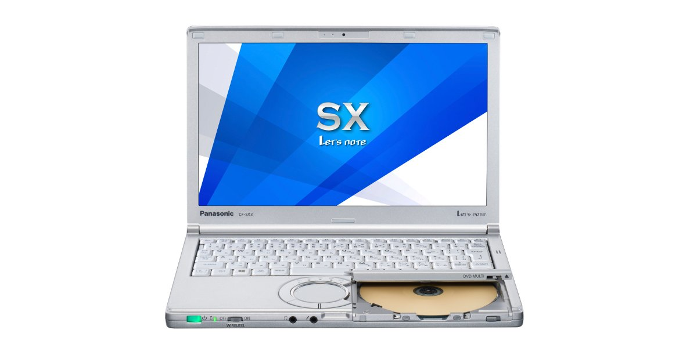
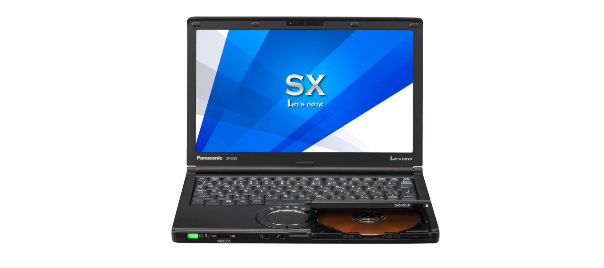
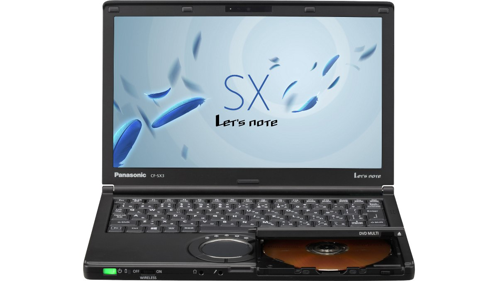
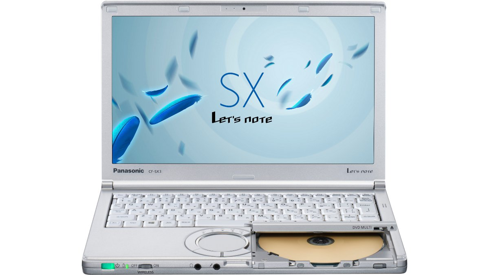

# 松下 Let's note CF-SX3 规格参数

[English](../../en/CF-SX3/) · [日本語](../../ja/CF-SX3/) · **中文**

**CF-SX3** 是松下 Let's note 笔记本电脑，属于 SX 系列，配备 12.1英寸 HD+ 屏幕。本页收录其全部 23 个型号（2013-09 – 2014-10 发售）的规格参数。每个型号均附官方规格表链接。

*松下 Let's note CF-SX3（CF-SX3JEAJR, CF-SX3JEPBR, CF-SX3JEPWR, CF-SX3SEABR …），银色。图片 © Panasonic*

## 型号列表

| 型号（品番） | 发售 | 停产 | 主要规格 |
| :-- | :-- | :-- | :-- |
| [CF-SX3DDPBR](https://panasonic.jp/pc/p-db/CF-SX3DDPBR_spec.html) | 2014-10 | 2015-06 | Windows 8.1 Pro Update 64位、Intel® CoreTM i5-4210U 处理器、内存：8GB（无空余插槽）、HDD：750GB、Super Multi Drive、LAN、无线LAN 802.11a(W52/W53/W56)/b/g/n/ac、Microsoft® Office Home and Business Premium |
| [CF-SX3ZDTBR](https://panasonic.jp/pc/p-db/CF-SX3ZDTBR_spec.html) | 2014-10 | 2015-06 | Windows 8.1 Pro Update 64位、Intel® CoreTM i7-4510U 处理器、内存：8GB（无空余插槽）、SSD：256GB、Super Multi Drive、LAN、无线LAN 802.11a(W52/W53/W56)/b/g/n/ac |
| [CF-SX3ZDYBR](https://panasonic.jp/pc/p-db/CF-SX3ZDYBR_spec.html) | 2014-10 | 2015-06 | Windows 8.1 Pro Update 64位、Intel® CoreTM i7-4510U 处理器、内存：8GB（无空余插槽）、SSD：256GB、Super Multi Drive、LAN、无线LAN 802.11a(W52/W53/W56)/b/g/n/ac、Microsoft® Office Home and Business Premium |
| [CF-SX3DDPWR](https://panasonic.jp/pc/p-db/CF-SX3DDPWR_spec.html) | 2014-10 | 2015-06 | Windows 7 Professional 64位、Intel® CoreTM i5-4210U 处理器、内存：8GB（无空闲插槽）、HDD：750GB、超级多功能驱动器、LAN、无线LAN 802.11a(W52/W53/W56)/b/g/n/ac、Microsoft® Office Home and Business Premium |
| [CF-SX3ZDYWR](https://panasonic.jp/pc/p-db/CF-SX3ZDYWR_spec.html) | 2014-10 | 2015-06 | Windows 7 Professional 64位、Intel® CoreTM i7-4510U 处理器、内存：8GB（无空闲插槽）、SSD：256GB、超级多功能驱动器、LAN、无线LAN 802.11a(W52/W53/W56)/b/g/n/ac、Microsoft® Office Home and Business Premium |
| [CF-SX3JEAJR](https://panasonic.jp/pc/p-db/CF-SX3JEAJR_spec.html) | 2014-05 | 2015-02 | Windows 8.1 Update 64位、英特尔® CoreTM i5-4310U（2.00GHz）、内存：4GB（最大8GB）、HDD：750GB、超级多驱动器、LAN、无线LAN 802.11a(W52/W53/W56)/b/g/n/ac |
| [CF-SX3JEPBR](https://panasonic.jp/pc/p-db/CF-SX3JEPBR_spec.html) | 2014-05 | 2015-02 | Windows 8.1 Pro Update 64位、英特尔® CoreTM i5-4310U（2.00GHz）、内存：4GB（最大8GB）、HDD：750GB、Super Multi Drive、LAN、无线LAN 802.11a(W52/W53/W56)/b/g/n/ac、Office Home and Business 2013 |
| [CF-SX3VETBR](https://panasonic.jp/pc/p-db/CF-SX3VETBR_spec.html) | 2014-05 | 2015-02 | Windows 8.1 Pro Update 64位、英特尔® CoreTM i7-4500U（1.80GHz）、内存：8GB（无空余插槽）、SSD：256GB、Super Multi Drive、LAN、无线LAN 802.11a(W52/W53/W56)/b/g/n/ac |
| [CF-SX3VEYBR](https://panasonic.jp/pc/p-db/CF-SX3VEYBR_spec.html) | 2014-05 | 2015-02 | Windows 8.1 Pro Update 64位、英特尔® CoreTM i7-4500U（1.80GHz）、内存：8GB（无空余插槽）、SSD：256GB、Super Multi Drive、LAN、无线LAN 802.11a(W52/W53/W56)/b/g/n/ac、Office Home and Business 2013 |
| [CF-SX3JEPWR](https://panasonic.jp/pc/p-db/CF-SX3JEPWR_spec.html) | 2014-05 | 2015-02 | Windows 7 Professional 64位、英特尔® CoreTM i5-4310U（2.00GHz）、内存：4GB（最大8GB）、HDD：750GB、超级多功能驱动器、LAN、无线LAN 802.11a(W52/W53/W56)/b/g/n/ac、Office Home and Business 2013 |
| [CF-SX3VEYWR](https://panasonic.jp/pc/p-db/CF-SX3VEYWR_spec.html) | 2014-05 | 2015-02 | Windows 7 Professional 64位、英特尔® CoreTM i7-4500U（1.80GHz）、内存：8GB（无空闲插槽）、SSD：256GB、超级多功能驱动器、LAN、无线LAN 802.11a(W52/W53/W56)/b/g/n/ac、Office Home and Business 2013 |
| [CF-SX3SEABR](https://panasonic.jp/pc/p-db/CF-SX3SEABR_spec.html) | 2014-01 | 2014-05 | Windows 8.1 Pro 64位、英特尔® CoreTM i5-4200U（1.60GHz）、内存：标准4GB（空余插槽1，最大8GB）、HDD：750GB、超级多功能光驱、LAN、无线LAN 802.11a(W52/W53/W56)/b/g/n/ac |
| [CF-SX3SEPBR](https://panasonic.jp/pc/p-db/CF-SX3SEPBR_spec.html) | 2014-01 | 2014-05 | Windows 8.1 Pro 64位、英特尔® CoreTM i5-4200U（1.60GHz）、内存：标准4GB（空余插槽1，最大8GB）、HDD：750GB、超级多功能光驱、LAN、无线LAN 802.11a(W52/W53/W56)/b/g/n/ac、Office Home and Business 2013 |
| [CF-SX3SEPWR](https://panasonic.jp/pc/p-db/CF-SX3SEPWR_spec.html) | 2014-01 | 2014-05 | Windows 7 Professional 64位、英特尔® CoreTM i5-4200U（1.60GHz）、内存：标配4GB（空闲插槽1个，最大8GB）、HDD：750GB、超级多功能驱动器、LAN、无线LAN 802.11a(W52/W53/W56)/b/g/n/ac、Office Home and Business 2013 |
| [CF-SX3TETBR](https://panasonic.jp/pc/p-db/CF-SX3TETBR_spec.html) | 2014-01 | 2014-05 | Windows 8.1 Pro 64位、英特尔® CoreTM i7-4500U（1.80GHz）、内存：标准4GB（空余插槽1，最大8GB）、SSD：256GB、超级多功能光驱、LAN、无线LAN 802.11a(W52/W53/W56)/b/g/n/ac |
| [CF-SX3TEYBR](https://panasonic.jp/pc/p-db/CF-SX3TEYBR_spec.html) | 2014-01 | 2014-05 | Windows 8.1 Pro 64位、英特尔® CoreTM i7-4500U（1.80GHz）、内存：标准4GB（空余插槽1，最大8GB）、SSD：256GB、超级多功能光驱、LAN、无线LAN 802.11a(W52/W53/W56)/b/g/n/ac、Office Home and Business 2013 |
| [CF-SX3TEYWR](https://panasonic.jp/pc/p-db/CF-SX3TEYWR_spec.html) | 2014-01 | 2014-05 | Windows 7 Professional 64位、英特尔® CoreTM i7-4500U（1.80GHz）、内存：标配4GB（空闲插槽1个，最大8GB）、SSD：256GB、超级多功能驱动器、LAN、无线LAN 802.11a(W52/W53/W56)/b/g/n/ac、Office Home and Business 2013 |
| [CF-SX3NETBR](https://panasonic.jp/pc/p-db/CF-SX3NETBR_spec.html) | 2013-09 | 2014-01 | Windows 8 Pro 64位、英特尔® CoreTM i7-4500U（1.80GHz）、内存：标准4GB（空余插槽1，最大8GB）、SSD：256GB、超级多功能光驱、LAN、无线LAN 802.11a(W52/W53/W56)/b/g/n |
| [CF-SX3NEYBR](https://panasonic.jp/pc/p-db/CF-SX3NEYBR_spec.html) | 2013-09 | 2014-01 | Windows 8 Pro 64位、英特尔® CoreTM i7-4500U（1.80GHz）、内存：标准4GB（空余插槽1，最大8GB）、SSD：256GB、超级多功能光驱、LAN、无线LAN 802.11a(W52/W53/W56)/b/g/n、Office Home and Business 2013 |
| [CF-SX3YEABR](https://panasonic.jp/pc/p-db/CF-SX3YEABR_spec.html) | 2013-09 | 2014-01 | Windows 8 Pro 64位、Intel® CoreTM i5-4200U（1.60GHz）、内存：标准4GB（空闲插槽1、最大8GB）、HDD：750GB、Super Multi Drive、LAN、无线LAN 802.11a(W52/W53/W56)/b/g/n |
| [CF-SX3YEPBR](https://panasonic.jp/pc/p-db/CF-SX3YEPBR_spec.html) | 2013-09 | 2014-01 | Windows 8 Pro 64位、Intel® CoreTM i5-4200U（1.60GHz）、内存：标准4GB（空闲插槽1、最大8GB）、HDD：750GB、Super Multi Drive、LAN、无线LAN 802.11a(W52/W53/W56)/b/g/n、Office Home and Business 2013 |
| [CF-SX3YEBBR](https://panasonic.jp/pc/p-db/CF-SX3YEBBR_spec.html) | 2013-09 | 2014-01 | Windows 8 Pro 64位、Intel® CoreTM i5-4200U（1.60GHz）、内存：标准4GB（空闲插槽1、最大8GB）、HDD：750GB、Super Multi Drive、LAN、无线LAN 802.11a(W52/W53/W56)/b/g/n |
| [CF-SX3YEQBR](https://panasonic.jp/pc/p-db/CF-SX3YEQBR_spec.html) | 2013-09 | 2014-01 | Windows 8 Pro 64位、Intel® CoreTM i5-4200U（1.60GHz）、内存：标准4GB（空闲插槽1、最大8GB）、HDD：750GB、Super Multi Drive、LAN、无线LAN 802.11a(W52/W53/W56)/b/g/n、Office Home and Business 2013 |

## 通用规格

| 项目 | 规格 |
| :-- | :-- |
| 显示屏 | 12.1英寸宽屏(16:9)HD+ TFT彩色液晶（1600 x 900像素） |
| 显示屏 / 显卡 | 英特尔 HD 图形4400（内置于CPU） |
| 显示屏 / 色彩 | 1600×900像素：约1677万色 |
| 显示屏 / 外接显示输出 | 1024×768、1280×768、1280×1024、1360×768、1366×768、1400×1050、1600×900、1600×1200、1680×1050 、1920×1080、1920×1200像素：约1677万色 |
| 显示屏 / 同时显示 | 1024×768、1280×768、1360×768、1366×768、1600×900像素：约1677万色 |
| 有线网络 | 1000BASE-T/100BASE-TX/10BASE-T |
| 音频 | PCM音源（24位立体声）、英特尔 High Definition Audio标准、单声道扬声器 |
| SD 卡槽 | SD存储卡×1插槽（支持SDHC存储卡/SDXC存储卡/支持UHS-I高速传输/支持版权保护技术） |
| 内存扩展槽 | DDR3L 204针 SO-DIMM专用插槽×1（1.35V/PC3L-12800/DDR3L SDRAM） |
| 键盘 | 符合OADG标准86键、键距19mm（横向）/16mm（纵向）（部分键除外） |
| 指点设备 | 滚轮触控板 |
| 功耗 | 最大约65W |
| 能效达成率（2011 年度标准） | — |

## 各型号差异

| 型号（品番） | 处理器 | 内存 | 存储 | 重量 | 续航 |
| :-- | :-- | :-- | :-- | :-- | :-- |
| CF-SX3DDPBR | Core i5-4210U | 8GB | 硬盘驱动器 | 1.19 kg | 8 h |
| CF-SX3ZDTBR | Core i7-4510U | 8GB | 256GB | 1.38 kg | 18 h |
| CF-SX3ZDYBR | Core i7-4510U | 8GB | 256GB | 1.38 kg | 18 h |
| CF-SX3DDPWR | Core i5-4210U | 8GB | 硬盘驱动器 | 1.19 kg | 8 h |
| CF-SX3ZDYWR | Core i7-4510U | 8GB | 256GB | 1.38 kg | 18 h |
| CF-SX3JEAJR | Core i5-4310U | 4GB DDR3L SDRAM 最大8GB | 硬盘驱动器 | 1.19 kg | 8.5 h |
| CF-SX3JEPBR | Core i5-4310U | 4GB DDR3L SDRAM 最大8GB | 硬盘驱动器 | 1.19 kg | 8.5 h |
| CF-SX3VETBR | Core i7-4500U | 8GB | 256GB | 1.38 kg | 18 h |
| CF-SX3VEYBR | Core i7-4500U | 8GB | 256GB | 1.38 kg | 18 h |
| CF-SX3JEPWR | Core i5-4310U | 4GB DDR3L SDRAM 最大8GB | 硬盘驱动器 | 1.19 kg | 8.5 h |
| CF-SX3VEYWR | Core i7-4500U | 8GB | 256GB | 1.38 kg | 18 h |
| CF-SX3SEABR | Core i5-4200U | 4GB DDR3L SDRAM 最大8GB | 硬盘驱动器 | 1.19 kg | 13 h |
| CF-SX3SEPBR | Core i5-4200U | 4GB DDR3L SDRAM 最大8GB | 硬盘驱动器 | 1.19 kg | 13 h |
| CF-SX3SEPWR | Core i5-4200U | 4GB DDR3L SDRAM 最大8GB | 硬盘驱动器 | 1.19 kg | 13 h |
| CF-SX3TETBR | Core i7-4500U | 4GB DDR3L SDRAM 最大8GB | 256GB | 1.37 kg | 30 h |
| CF-SX3TEYBR | Core i7-4500U | 4GB DDR3L SDRAM 最大8GB | 256GB | 1.37 kg | 30 h |
| CF-SX3TEYWR | Core i7-4500U | 4GB DDR3L SDRAM 最大8GB | 256GB | 1.37 kg | 30 h |
| CF-SX3NETBR | 第四代Core i7-4500U | 4GB PC3L-12800 | 256GB | 1.37 kg | 30 h |
| CF-SX3NEYBR | 第四代Core i7-4500U | 4GB PC3L-12800 | 256GB | 1.37 kg | 30 h |
| CF-SX3YEABR | 第四代Core i5-4200U | 4GB PC3L-12800 | 硬盘驱动器 | 1.19 kg | 13 h |
| CF-SX3YEPBR | 第四代Core i5-4200U | 4GB PC3L-12800 | 硬盘驱动器 | 1.19 kg | 13 h |
| CF-SX3YEBBR | 第四代Core i5-4200U | 4GB PC3L-12800 | 硬盘驱动器 | 1.19 kg | 13 h |
| CF-SX3YEQBR | 第四代Core i5-4200U | 4GB PC3L-12800 | 硬盘驱动器 | 1.19 kg | 13 h |

CF-SX3DDPBR 的全部差异规格

| 项目 | 规格 |
| :-- | :-- |
| 操作系统 | Windows 8.1 Pro Update 64位（日语版） |
| 处理器 | 英特尔 Core i5-4210U处理器 / 英特尔智能缓存3MB，运行频率1.7GHz（使用英特尔 睿频加速技术2.0时最高2.7GHz） |
| 内存 | 8GB（4GB+4GB） DDR3L SDRAM 最大8GB（空余插槽0） |
| 显存 | 最大1792MB（与主内存共享） |
| 硬盘 | 硬盘驱动器（HDD）750GB（Serial ATA、5400rpm）上述容量中约16GB用作恢复区域、约1GB用作系统区域（用户不可使用） |
| 光驱 | 内置超级多功能驱动器（DVD/CD） 配备缓冲区欠载错误防止功能、外壳驱动器 |
| 光驱速度 / 读取 | DVD-RAM：最大5倍速 / DVD-ROM：最大8倍速 / DVD-R：最大8倍速 / DVD-R DL：最大8倍速 / DVD-RW：最大8倍速 / +R：最大8倍速 / +R DL：最大8倍速 / +RW：最大8倍速 / HighSpeed +RW：最大8倍速 / CD-ROM：最大24倍速 / CD-R：最大24倍速 / CD-RW：最大24倍速 / High-Speed CD-RW：最大24倍速 / Ultra-Speed CD-RW：最大24倍速 |
| 光驱速度 / 写入 | DVD-RAM 改写：最高5倍速 / DVD-R 写入：最高8倍速 / DVD-R DL 写入：最高6倍速 / DVD-RW 改写：最高6倍速 / +R 写入：最高8倍速 / +R DL 写入：最高6倍速 / +RW 改写：最高4倍速 / High Speed +RW 改写：最高8倍速 / CD-R 写入：最高24倍速 / CD-RW 改写：4倍速 / High-Speed CD-RW 改写：10倍速 / Ultra-Speed CD-RW 改写：最高16倍速 |
| 支持光盘 / 读取 | DVD-RAM（ 1.4GB、2.8GB、4.7GB、9.4GB ） / DVD-ROM（单层、双层） / DVD-Video（单层、双层） / DVD-R（ 1.4GB、2.8GB、4.7GB ） / DVD-R DL（ 8.5GB ） / DVD-RW（ Ver.1.1/1.2 1.4GB、2.8GB、4.7GB、9.4GB ） / +R（ 4.7GB ） / +R DL（ 8.5GB ） / +RW（ 4.7GB ） / HighSpeed +RW（ 4.7GB ） / CD-Audio / CD-ROM（支持XA） / Photo CD（支持多区段） / Video CD / CD EXTRA / CD-TEXT / CD-R / CD-RW / High-Speed CD-RW / Ultra-Speed CD-RW |
| 支持光盘 / 写入 | DVD-RAM（ 1.4GB、2.8GB、4.7GB、9.4GB） / DVD-R（ 1.4GB、2.8 GB、4.7GB for General） / DVD-R DL（ 8.5GB ） / DVD-RW（ Ver.1.1/1.2 1.4GB、2.8GB、4.7GB、9.4GB） / +R（ 4.7GB ） / +R DL（ 8.5GB ） / +RW（ 4.7GB ） / High Speed +RW（ 4.7GB） / CD-R / CD-RW / High-Speed CD-RW / Ultra-Speed CD-RW |
| 无线通信模块 | 英特尔 Dual Band Wireless-AC 7260 |
| 无线网络 | 符合IEEE802.11a（W52/W53/W56）/b/g/n/ac |
| 蓝牙 | Bluetooth v4.0 / ■支持配置文件 / 【Classic】 / ・A2DP（Source） / ・AVRCP（Target） / ・BIP（Client） / ・BPP（Sender） / ・FTP（Client和Server） / ・HCRP（Client） / ・HFP（AG） / ・HID（Host） / ・HSP（AG） / ・OPP（Client和Server） / ・PAN（User） / ・PBAP（PCE） / ・SPP（DevA和DevB） / ・SYNC（Client） / 【Low Energy】 / ・HOGP（Host） |
| 摄像头 | 有效像素：最大1280×960像素 |
| 麦克风 | 单声道麦克风 |
| 接口 | LAN 接口（RJ-45） / 外接显示器接口（模拟 RGB 迷你 D-sub 15 针） / HDMI 输出端子 / 麦克风输入端子（立体声迷你插孔 M3（支持插入式电源）） / 音频输出端子（立体声迷你插孔 M3） / USB3.0 端口×2（其中 1 个兼作 USB 充电端口） / USB2.0 端口×1 |
| 电源 | ▼AC适配器 / 输入：AC100V～240V、50Hz/60Hz、输出：DC16V、4.06A、电源线仅限100V专用 / ▼电池组 / 7.2V锂离子・标称容量6800mAh、额定容量6400mAh |
| 能效 | 2011年度标准 N分类0.035 |
| 续航 / 充电时间 | ▼续航时间： / （JEITA Ver.2.0）约8小时/（JEITA Ver.1.0）约12.5小时 / ▼充电时间： / 约2.5小时（电源OFF时）、约3小时（电源ON时） |
| 尺寸（宽×深×高） | 宽295mm×深197.5mm×高25.4mm 不含突起部 |
| 颜色 | 银色 |
| 重量（含电池） | 电脑主机：约1.19kg（安装附带的轻量电池组（S）（约0.22kg）时），AC适配器：约0.23kg（不含电源线（约0.06 kg）） |
| 预装软件 | ・Microsoft Internet Explorer 11 / ・网络选择器 Lite / ・无线工具箱 / ・Intel PROSet/Wireless Software for Bluetooth Technology / ・安全设置实用程序 / ・McAfee PC 安全中心 / ・i-Filter 6.0（30天试用版） / ・Adobe Reader / ・WinZip 17.0 日语版（45天体验版） / ・电池剩余电量显示校正实用程序 / ・滚轮触控板实用程序 / ・NumLock 通知 / ・热键设置 / ・Fn Ctrl 互换实用程序 / ・电源计划扩展实用程序 / ・峰值转移控制实用程序 / ・Total Media Backup & Record / ・ArcSoft ShowBiz / ・Microsoft Windows Media Player 12 / ・CyberLink PowerDVD10 / ・投影仪助手 / ・USB 键盘助手 / ・显示器助手 / ・Wireless Manager mobile edition / ・USB 充电设置实用程序 / ・摄像头实用程序（桌面屏幕用） / ・Camera for Panasonic PC（开始屏幕用） / ・画面分割实用程序 / ・PC 信息弹窗 / ・PC 信息查看器 / ・Aptio 设置实用程序 / ・PC-Diagnostic 实用程序 / ・Dashboard for Panasonic PC / ・恢复光盘创建实用程序 / ・硬盘数据擦除实用程序 / ・DirectX 11.2 / ・Microsoft .NET Framework 4.5 / ・英特尔 PROSet/Wireless Software / ・VIP Access for Desktop / ・英特尔 智能连接技术 / ・Skype（开始屏幕用） / ・NAVITIME（开始屏幕用） / ・Adobe Reader Touch（开始屏幕用） / ・Bing 翻译（开始屏幕用） |
| Microsoft Office | Microsoft Office Home & Business Premium |
| 附件 | 标准AC适配器、轻量电池组(S)、使用说明书、Microsoft Office Home & Business Premium |

官方规格表: <https://panasonic.jp/pc/p-db/CF-SX3DDPBR_spec.html>

CF-SX3ZDTBR 的全部差异规格

| 项目 | 规格 |
| :-- | :-- |
| 操作系统 | Windows 8.1 Pro Update 64位（日语版） |
| 处理器 | 英特尔 Core i7-4510U处理器 / 英特尔智能缓存4MB、工作频率2.0GHz（使用英特尔睿频加速技术2.0时最高3.1GHz） |
| 内存 | 8GB（4GB+4GB） DDR3L SDRAM 最大8GB（空余插槽0） |
| 显存 | 最大1792MB（与主内存共享） |
| 光驱 | 内置超级多功能驱动器（DVD/CD） 配备缓冲区欠载错误防止功能、外壳驱动器 |
| 光驱速度 / 读取 | DVD-RAM：最大5倍速 / DVD-ROM：最大8倍速 / DVD-R：最大8倍速 / DVD-R DL：最大8倍速 / DVD-RW：最大8倍速 / +R：最大8倍速 / +R DL：最大8倍速 / +RW：最大8倍速 / HighSpeed +RW：最大8倍速 / CD-ROM：最大24倍速 / CD-R：最大24倍速 / CD-RW：最大24倍速 / High-Speed CD-RW：最大24倍速 / Ultra-Speed CD-RW：最大24倍速 |
| 光驱速度 / 写入 | DVD-RAM 改写：最高5倍速 / DVD-R 写入：最高8倍速 / DVD-R DL 写入：最高6倍速 / DVD-RW 改写：最高6倍速 / +R 写入：最高8倍速 / +R DL 写入：最高6倍速 / +RW 改写：最高4倍速 / High Speed +RW 改写：最高8倍速 / CD-R 写入：最高24倍速 / CD-RW 改写：4倍速 / High-Speed CD-RW 改写：10倍速 / Ultra-Speed CD-RW 改写：最高16倍速 |
| 支持光盘 / 读取 | DVD-RAM（ 1.4GB、2.8GB、4.7GB、9.4GB ） / DVD-ROM（单层、双层） / DVD-Video（单层、双层） / DVD-R（ 1.4GB、2.8GB、4.7GB ） / DVD-R DL（ 8.5GB ） / DVD-RW（ Ver.1.1/1.2 1.4GB、2.8GB、4.7GB、9.4GB ） / +R（ 4.7GB ） / +R DL（ 8.5GB ） / +RW（ 4.7GB ） / HighSpeed +RW（ 4.7GB ） / CD-Audio / CD-ROM（支持XA） / Photo CD（支持多区段） / Video CD / CD EXTRA / CD-TEXT / CD-R / CD-RW / High-Speed CD-RW / Ultra-Speed CD-RW |
| 支持光盘 / 写入 | DVD-RAM（ 1.4GB、2.8GB、4.7GB、9.4GB） / DVD-R（ 1.4GB、2.8 GB、4.7GB for General） / DVD-R DL（ 8.5GB ） / DVD-RW（ Ver.1.1/1.2 1.4GB、2.8GB、4.7GB、9.4GB） / +R（ 4.7GB ） / +R DL（ 8.5GB ） / +RW（ 4.7GB ） / High Speed +RW（ 4.7GB） / CD-R / CD-RW / High-Speed CD-RW / Ultra-Speed CD-RW |
| 无线通信模块 | 英特尔 Dual Band Wireless-AC 7260 |
| 无线网络 | 符合IEEE802.11a（W52/W53/W56）/b/g/n/ac |
| 蓝牙 | Bluetooth v4.0 / ■支持配置文件 / 【Classic】 / ・A2DP（Source） / ・AVRCP（Target） / ・BIP（Client） / ・BPP（Sender） / ・FTP（Client和Server） / ・HCRP（Client） / ・HFP（AG） / ・HID（Host） / ・HSP（AG） / ・OPP（Client和Server） / ・PAN（User） / ・PBAP（PCE） / ・SPP（DevA和DevB） / ・SYNC（Client） / 【Low Energy】 / ・HOGP（Host） |
| 摄像头 | 有效像素：最大1280×960像素 |
| 麦克风 | 单声道麦克风 |
| 接口 | LAN 接口（RJ-45） / 外接显示器接口（模拟 RGB 迷你 D-sub 15 针） / HDMI 输出端子 / 麦克风输入端子（立体声迷你插孔 M3（支持插入式电源）） / 音频输出端子（立体声迷你插孔 M3） / USB3.0 端口×2（其中 1 个兼作 USB 充电端口） / USB2.0 端口×1 |
| 电源 | ▼AC适配器 / 输入：AC100V～240V、50Hz/60Hz，输出：DC16V、4.06A，电源线为100V专用 / ▼电池组 / 7.2V 锂离子・标称容量13600mAh、额定容量12800mAh，轻量电池组：7.2V 锂离子・标称容量6800mAh、额定容量6400mAh |
| 能效 | 2011年度标准 N分类0.031 |
| 续航 / 充电时间 | ▼续航时间: / 安装电池组（L）时：（JEITA Ver.2.0）约18小时/（JEITA Ver.1.0）约29小时 / 安装电池组（S）时：（JEITA Ver.2.0）约9小时/（JEITA Ver.1.0）约14.5小时 / ▼充电时间 / 安装标准电池组（L）时： / 约4小时（电源OFF时）、约5小时（电源ON时） / 安装轻量电池组（S）时： / 约2.5小时（电源OFF时）、约3小时（电源ON时） |
| 尺寸（宽×深×高） | 搭载标准电池组(L)时 / 宽295mm×深216.2mm×高25.4mm 不含突出部分 / 搭载轻量电池组(S)时 / 宽295mm×深197.5mm×高25.4mm 不含突出部分 |
| 颜色 | 黑色 |
| 重量（含电池） | 电脑主机：约1.38kg（安装标准电池组（L）（约0.43kg）时） / 电脑主机：约1.17kg（安装轻量电池组（S）（约0.22kg）时） / AC适配器：约0.23kg（不含电源线（约0.06 kg）） |
| 预装软件 | ・Microsoft Internet Explorer 11 / ・网络选择器 Lite / ・无线工具箱 / ・Intel PROSet/Wireless Software for Bluetooth Technology / ・安全设置实用程序 / ・McAfee PC 安全中心 / ・i-Filter 6.0（30天试用版） / ・Adobe Reader / ・WinZip 17.0 日语版（45天体验版） / ・电池剩余电量显示校正实用程序 / ・滚轮触控板实用程序 / ・NumLock 通知 / ・热键设置 / ・Fn Ctrl 互换实用程序 / ・电源计划扩展实用程序 / ・峰值转移控制实用程序 / ・Total Media Backup & Record / ・ArcSoft ShowBiz / ・Microsoft Windows Media Player 12 / ・CyberLink PowerDVD10 / ・投影仪助手 / ・USB 键盘助手 / ・显示器助手 / ・Wireless Manager mobile edition / ・USB 充电设置实用程序 / ・摄像头实用程序（桌面屏幕用） / ・Camera for Panasonic PC（开始屏幕用） / ・画面分割实用程序 / ・PC 信息弹窗 / ・PC 信息查看器 / ・Aptio 设置实用程序 / ・PC-Diagnostic 实用程序 / ・Dashboard for Panasonic PC / ・恢复光盘创建实用程序 / ・硬盘数据擦除实用程序 / ・DirectX 11.2 / ・Microsoft .NET Framework 4.5 / ・英特尔 PROSet/Wireless Software / ・VIP Access for Desktop / ・英特尔 智能连接技术 / ・Skype（开始屏幕用） / ・NAVITIME（开始屏幕用） / ・Adobe Reader Touch（开始屏幕用） / ・Bing 翻译（开始屏幕用） |
| 附件 | 标配AC适配器、标准电池组(L)、轻量电池组(S)、使用说明书 |
| 固态硬盘 | 闪存驱动器（SSD）256GB（Serial ATA）上述容量中约16GB用作恢复区域、约1GB用作系统区域（用户不可使用） |

官方规格表: <https://panasonic.jp/pc/p-db/CF-SX3ZDTBR_spec.html>

CF-SX3ZDYBR 的全部差异规格

| 项目 | 规格 |
| :-- | :-- |
| 操作系统 | Windows 8.1 Pro Update 64位（日语版） |
| 处理器 | 英特尔 Core i7-4510U处理器 / 英特尔智能缓存4MB、工作频率2.0GHz（使用英特尔睿频加速技术2.0时最高3.1GHz） |
| 内存 | 8GB（4GB+4GB） DDR3L SDRAM 最大8GB（空余插槽0） |
| 显存 | 最大1792MB（与主内存共享） |
| 光驱 | 内置超级多功能驱动器（DVD/CD） 配备缓冲区欠载错误防止功能、外壳驱动器 |
| 光驱速度 / 读取 | DVD-RAM：最大5倍速 / DVD-ROM：最大8倍速 / DVD-R：最大8倍速 / DVD-R DL：最大8倍速 / DVD-RW：最大8倍速 / +R：最大8倍速 / +R DL：最大8倍速 / +RW：最大8倍速 / HighSpeed +RW：最大8倍速 / CD-ROM：最大24倍速 / CD-R：最大24倍速 / CD-RW：最大24倍速 / High-Speed CD-RW：最大24倍速 / Ultra-Speed CD-RW：最大24倍速 |
| 光驱速度 / 写入 | DVD-RAM 改写：最高5倍速 / DVD-R 写入：最高8倍速 / DVD-R DL 写入：最高6倍速 / DVD-RW 改写：最高6倍速 / +R 写入：最高8倍速 / +R DL 写入：最高6倍速 / +RW 改写：最高4倍速 / High Speed +RW 改写：最高8倍速 / CD-R 写入：最高24倍速 / CD-RW 改写：4倍速 / High-Speed CD-RW 改写：10倍速 / Ultra-Speed CD-RW 改写：最高16倍速 |
| 支持光盘 / 读取 | DVD-RAM（ 1.4GB、2.8GB、4.7GB、9.4GB ） / DVD-ROM（单层、双层） / DVD-Video（单层、双层） / DVD-R（ 1.4GB、2.8GB、4.7GB ） / DVD-R DL（ 8.5GB ） / DVD-RW（ Ver.1.1/1.2 1.4GB、2.8GB、4.7GB、9.4GB ） / +R（ 4.7GB ） / +R DL（ 8.5GB ） / +RW（ 4.7GB ） / HighSpeed +RW（ 4.7GB ） / CD-Audio / CD-ROM（支持XA） / Photo CD（支持多区段） / Video CD / CD EXTRA / CD-TEXT / CD-R / CD-RW / High-Speed CD-RW / Ultra-Speed CD-RW |
| 支持光盘 / 写入 | DVD-RAM（ 1.4GB、2.8GB、4.7GB、9.4GB） / DVD-R（ 1.4GB、2.8 GB、4.7GB for General） / DVD-R DL（ 8.5GB ） / DVD-RW（ Ver.1.1/1.2 1.4GB、2.8GB、4.7GB、9.4GB） / +R（ 4.7GB ） / +R DL（ 8.5GB ） / +RW（ 4.7GB ） / High Speed +RW（ 4.7GB） / CD-R / CD-RW / High-Speed CD-RW / Ultra-Speed CD-RW |
| 无线通信模块 | 英特尔 Dual Band Wireless-AC 7260 |
| 无线网络 | 符合IEEE802.11a（W52/W53/W56）/b/g/n/ac |
| 蓝牙 | Bluetooth v4.0 / ■支持配置文件 / 【Classic】 / ・A2DP（Source） / ・AVRCP（Target） / ・BIP（Client） / ・BPP（Sender） / ・FTP（Client和Server） / ・HCRP（Client） / ・HFP（AG） / ・HID（Host） / ・HSP（AG） / ・OPP（Client和Server） / ・PAN（User） / ・PBAP（PCE） / ・SPP（DevA和DevB） / ・SYNC（Client） / 【Low Energy】 / ・HOGP（Host） |
| 摄像头 | 有效像素：最大1280×960像素 |
| 麦克风 | 单声道麦克风 |
| 接口 | LAN 接口（RJ-45） / 外接显示器接口（模拟 RGB 迷你 D-sub 15 针） / HDMI 输出端子 / 麦克风输入端子（立体声迷你插孔 M3（支持插入式电源）） / 音频输出端子（立体声迷你插孔 M3） / USB3.0 端口×2（其中 1 个兼作 USB 充电端口） / USB2.0 端口×1 |
| 电源 | ▼AC适配器 / 输入：AC100V～240V、50Hz/60Hz，输出：DC16V、4.06A，电源线为100V专用 / ▼电池组 / 7.2V 锂离子・标称容量13600mAh、额定容量12800mAh，轻量电池组：7.2V 锂离子・标称容量6800mAh、额定容量6400mAh |
| 能效 | 2011年度标准 N分类0.031 |
| 续航 / 充电时间 | ▼续航时间: / 安装电池组（L）时：（JEITA Ver.2.0）约18小时/（JEITA Ver.1.0）约29小时 / 安装电池组（S）时：（JEITA Ver.2.0）约9小时/（JEITA Ver.1.0）约14.5小时 / ▼充电时间 / 安装标准电池组（L）时： / 约4小时（电源OFF时）、约5小时（电源ON时） / 安装轻量电池组（S）时： / 约2.5小时（电源OFF时）、约3小时（电源ON时） |
| 尺寸（宽×深×高） | 搭载标准电池组(L)时 / 宽295mm×深216.2mm×高25.4mm 不含突出部分 / 搭载轻量电池组(S)时 / 宽295mm×深197.5mm×高25.4mm 不含突出部分 |
| 颜色 | 黑色 |
| 重量（含电池） | 电脑主机：约1.38kg（安装标准电池组（L）（约0.43kg）时） / 电脑主机：约1.17kg（安装轻量电池组（S）（约0.22kg）时） / AC适配器：约0.23kg（不含电源线（约0.06 kg）） |
| 预装软件 | ・Microsoft Internet Explorer 11 / ・网络选择器 Lite / ・无线工具箱 / ・Intel PROSet/Wireless Software for Bluetooth Technology / ・安全设置实用程序 / ・McAfee PC 安全中心 / ・i-Filter 6.0（30天试用版） / ・Adobe Reader / ・WinZip 17.0 日语版（45天体验版） / ・电池剩余电量显示校正实用程序 / ・滚轮触控板实用程序 / ・NumLock 通知 / ・热键设置 / ・Fn Ctrl 互换实用程序 / ・电源计划扩展实用程序 / ・峰值转移控制实用程序 / ・Total Media Backup & Record / ・ArcSoft ShowBiz / ・Microsoft Windows Media Player 12 / ・CyberLink PowerDVD10 / ・投影仪助手 / ・USB 键盘助手 / ・显示器助手 / ・Wireless Manager mobile edition / ・USB 充电设置实用程序 / ・摄像头实用程序（桌面屏幕用） / ・Camera for Panasonic PC（开始屏幕用） / ・画面分割实用程序 / ・PC 信息弹窗 / ・PC 信息查看器 / ・Aptio 设置实用程序 / ・PC-Diagnostic 实用程序 / ・Dashboard for Panasonic PC / ・恢复光盘创建实用程序 / ・硬盘数据擦除实用程序 / ・DirectX 11.2 / ・Microsoft .NET Framework 4.5 / ・英特尔 PROSet/Wireless Software / ・VIP Access for Desktop / ・英特尔 智能连接技术 / ・Skype（开始屏幕用） / ・NAVITIME（开始屏幕用） / ・Adobe Reader Touch（开始屏幕用） / ・Bing 翻译（开始屏幕用） |
| Microsoft Office | Microsoft Office Home & Business Premium |
| 附件 | 标配AC适配器、标准电池组(L)、轻量电池组(S)、使用说明书、Microsoft Office Home & Business Premium |
| 固态硬盘 | 闪存驱动器（SSD）256GB（Serial ATA）上述容量中约16GB用作恢复区域、约1GB用作系统区域（用户不可使用） |

官方规格表: <https://panasonic.jp/pc/p-db/CF-SX3ZDYBR_spec.html>

CF-SX3DDPWR 的全部差异规格

| 项目 | 规格 |
| :-- | :-- |
| 操作系统 | ▼安装OS： / Windows 7 Professional 64位（日语版）（行使Windows 8.1 Pro降级权） / ▼基础OS： / Windows 8.1 Pro Update 64位（日语版）/ / Windows 7 Professional 64位（日语版）/Windows 7 Professional 32位（日语版） |
| 处理器 | 英特尔 Core i5-4210U处理器 / 英特尔智能缓存3MB，运行频率1.7GHz（使用英特尔 睿频加速技术2.0时最高2.7GHz） |
| 内存 | 8GB（4GB+4GB） DDR3L SDRAM 最大8GB（空余插槽0） |
| 显存 | 最大1696MB（与主内存共用） |
| 硬盘 | 硬盘驱动器（HDD）750GB（Serial ATA、5400rpm）上述容量中约30GB用作恢复区域、约300MB用作系统区域（用户不可使用） |
| 光驱 | 内置超级多功能驱动器（DVD/CD） 配备缓冲区欠载错误防止功能、外壳驱动器 |
| 光驱速度 / 读取 | DVD-RAM：最大5倍速 / DVD-ROM：最大8倍速 / DVD-R：最大8倍速 / DVD-R DL：最大8倍速 / DVD-RW：最大8倍速 / +R：最大8倍速 / +R DL：最大8倍速 / +RW：最大8倍速 / HighSpeed +RW：最大8倍速 / CD-ROM：最大24倍速 / CD-R：最大24倍速 / CD-RW：最大24倍速 / High-Speed CD-RW：最大24倍速 / Ultra-Speed CD-RW：最大24倍速 |
| 光驱速度 / 写入 | DVD-RAM 改写：最高5倍速 / DVD-R 写入：最高8倍速 / DVD-R DL 写入：最高6倍速 / DVD-RW 改写：最高6倍速 / +R 写入：最高8倍速 / +R DL 写入：最高6倍速 / +RW 改写：最高4倍速 / High Speed +RW 改写：最高8倍速 / CD-R 写入：最高24倍速 / CD-RW 改写：4倍速 / High-Speed CD-RW 改写：10倍速 / Ultra-Speed CD-RW 改写：最高16倍速 |
| 支持光盘 / 读取 | DVD-RAM（ 1.4GB、2.8GB、4.7GB、9.4GB ） / DVD-ROM（单层、双层） / DVD-Video（单层、双层） / DVD-R（ 1.4GB、2.8GB、4.7GB ） / DVD-R DL（ 8.5GB ） / DVD-RW（ Ver.1.1/1.2 1.4GB、2.8GB、4.7GB、9.4GB ） / +R（ 4.7GB ） / +R DL（ 8.5GB ） / +RW（ 4.7GB ） / HighSpeed +RW（ 4.7GB ） / CD-Audio / CD-ROM（支持XA） / Photo CD（支持多区段） / Video CD / CD EXTRA / CD-TEXT / CD-R / CD-RW / High-Speed CD-RW / Ultra-Speed CD-RW |
| 支持光盘 / 写入 | DVD-RAM（ 1.4GB、2.8GB、4.7GB、9.4GB） / DVD-R（ 1.4GB、2.8 GB、4.7GB for General） / DVD-R DL（ 8.5GB ） / DVD-RW（ Ver.1.1/1.2 1.4GB、2.8GB、4.7GB、9.4GB） / +R（ 4.7GB ） / +R DL（ 8.5GB ） / +RW（ 4.7GB ） / High Speed +RW（ 4.7GB） / CD-R / CD-RW / High-Speed CD-RW / Ultra-Speed CD-RW |
| 无线通信模块 | 英特尔 Dual Band Wireless-AC 7260 |
| 无线网络 | 符合IEEE802.11a（W52/W53/W56）/b/g/n/ac |
| 蓝牙 | Bluetooth v4.0 / ■支持配置文件 / 【Classic】 / ・A2DP（Source） / ・AVRCP（Target） / ・BIP（Client） / ・BPP（Sender） / ・FTP（Client和Server） / ・HCRP（Client） / ・HFP（AG） / ・HID（Host） / ・HSP（AG） / ・OPP（Client和Server） / ・PAN（User） / ・PBAP（PCE） / ・SPP（DevA和DevB） / ・SYNC（Client） / 【Low Energy】 / ・HOGP（Host） |
| 摄像头 | 有效像素：最大1280×960像素 |
| 麦克风 | 单声道麦克风 |
| 接口 | LAN 接口（RJ-45） / 外接显示器接口（模拟 RGB 迷你 D-sub 15 针） / HDMI 输出端子 / 麦克风输入端子（立体声迷你插孔 M3（支持插入式电源）） / 音频输出端子（立体声迷你插孔 M3） / USB3.0 端口×2（其中 1 个兼作 USB 充电端口） / USB2.0 端口×1 |
| 电源 | ▼AC适配器 / 输入：AC100V～240V、50Hz/60Hz、输出：DC16V、4.06A、电源线仅限100V专用 / ▼电池组 / 7.2V锂离子・标称容量6800mAh、额定容量6400mAh |
| 能效 | 2011年度标准 N分类0.035 |
| 续航 / 充电时间 | ▼续航时间： / （JEITA Ver.2.0）约8小时/（JEITA Ver.1.0）约12.5小时 / ▼充电时间： / 约2.5小时（电源OFF时）、约3小时（电源ON时） |
| 尺寸（宽×深×高） | 宽295mm×深197.5mm×高25.4mm 不含突起部 |
| 颜色 | 银色 |
| 重量（含电池） | 电脑主机：约1.19kg（安装附带的轻量电池组（S）（约0.22kg）时），AC适配器：约0.23kg（不含电源线（约0.06 kg）） |
| 预装软件 | ・Microsoft Internet Explorer 11 / ・网络选择器 Lite / ・无线切换实用程序 / ・Intel PROSet/Wireless Software for Bluetooth Technology / ・安全设置实用程序 / ・McAfee PC 安全中心 / ・i-Filter 6.0（30天试用版） / ・Adobe Reader / ・WinZip 17.0 日语版（45天体验版） / ・电池剩余电量显示校正实用程序 / ・滚轮触控板实用程序 / ・NumLock 通知 / ・热键设置 / ・Fn Ctrl 互换实用程序 / ・电源计划扩展实用程序 / ・峰值转移控制实用程序 / ・Total Media Backup & Record / ・ArcSoft ShowBiz / ・Microsoft Windows Media Player 12 / ・CyberLink PowerDVD10 / ・投影仪助手 / ・USB 键盘助手 / ・显示器助手 / ・Wireless Manager mobile edition / ・USB 充电设置实用程序 / ・摄像头实用程序 / ・英特尔 My WiFi 技术 / ・Intel WiDi / ・缩放查看器 / ・画面分割实用程序 / ・分辨率切换实用程序 / ・快速启动管理器 / ・光盘驱动器盘符更改实用程序 / ・PC 信息弹窗 / ・PC 信息查看器 / ・Aptio 设置实用程序 / ・PC-Diagnostic 实用程序 / ・Dashboard for Panasonic PC / ・恢复光盘创建实用程序 / ・硬盘数据擦除实用程序 / ・DirectX 11.1 / ・Microsoft .NET Framework 4.0 / ・英特尔 PROSet/Wireless Software / ・VIP Access for Desktop / ・英特尔 智能连接技术 |
| Microsoft Office | Microsoft Office Home & Business Premium |
| 附件 | 标准AC适配器、轻量电池组(S)、使用说明书、Microsoft Office Home & Business Premium |
| 通知 | 本页所记载的规格为 Windows 7 Professional 64位环境下的数据。 |

官方规格表: <https://panasonic.jp/pc/p-db/CF-SX3DDPWR_spec.html>

CF-SX3ZDYWR 的全部差异规格

| 项目 | 规格 |
| :-- | :-- |
| 操作系统 | ▼安装OS： / Windows 7 Professional 64位（日语版）（行使Windows 8.1 Pro降级权） / ▼基础OS： / Windows 8.1 Pro Update 64位（日语版）/ / Windows 7 Professional 64位（日语版）/Windows 7 Professional 32位（日语版） |
| 处理器 | 英特尔 Core i7-4510U处理器 / 英特尔智能缓存4MB、工作频率2.0GHz（使用英特尔睿频加速技术2.0时最高3.1GHz） |
| 内存 | 8GB（4GB+4GB） DDR3L SDRAM 最大8GB（空余插槽0） |
| 显存 | 最大1696MB（与主内存共用） |
| 光驱 | 内置超级多功能驱动器（DVD/CD） 配备缓冲区欠载错误防止功能、外壳驱动器 |
| 光驱速度 / 读取 | DVD-RAM：最大5倍速 / DVD-ROM：最大8倍速 / DVD-R：最大8倍速 / DVD-R DL：最大8倍速 / DVD-RW：最大8倍速 / +R：最大8倍速 / +R DL：最大8倍速 / +RW：最大8倍速 / HighSpeed +RW：最大8倍速 / CD-ROM：最大24倍速 / CD-R：最大24倍速 / CD-RW：最大24倍速 / High-Speed CD-RW：最大24倍速 / Ultra-Speed CD-RW：最大24倍速 |
| 光驱速度 / 写入 | DVD-RAM 改写：最高5倍速 / DVD-R 写入：最高8倍速 / DVD-R DL 写入：最高6倍速 / DVD-RW 改写：最高6倍速 / +R 写入：最高8倍速 / +R DL 写入：最高6倍速 / +RW 改写：最高4倍速 / High Speed +RW 改写：最高8倍速 / CD-R 写入：最高24倍速 / CD-RW 改写：4倍速 / High-Speed CD-RW 改写：10倍速 / Ultra-Speed CD-RW 改写：最高16倍速 |
| 支持光盘 / 读取 | DVD-RAM（ 1.4GB、2.8GB、4.7GB、9.4GB ） / DVD-ROM（单层、双层） / DVD-Video（单层、双层） / DVD-R（ 1.4GB、2.8GB、4.7GB ） / DVD-R DL（ 8.5GB ） / DVD-RW（ Ver.1.1/1.2 1.4GB、2.8GB、4.7GB、9.4GB ） / +R（ 4.7GB ） / +R DL（ 8.5GB ） / +RW（ 4.7GB ） / HighSpeed +RW（ 4.7GB ） / CD-Audio / CD-ROM（支持XA） / Photo CD（支持多区段） / Video CD / CD EXTRA / CD-TEXT / CD-R / CD-RW / High-Speed CD-RW / Ultra-Speed CD-RW |
| 支持光盘 / 写入 | DVD-RAM（ 1.4GB、2.8GB、4.7GB、9.4GB） / DVD-R（ 1.4GB、2.8 GB、4.7GB for General） / DVD-R DL（ 8.5GB ） / DVD-RW（ Ver.1.1/1.2 1.4GB、2.8GB、4.7GB、9.4GB） / +R（ 4.7GB ） / +R DL（ 8.5GB ） / +RW（ 4.7GB ） / High Speed +RW（ 4.7GB） / CD-R / CD-RW / High-Speed CD-RW / Ultra-Speed CD-RW |
| 无线通信模块 | 英特尔 Dual Band Wireless-AC 7260 |
| 无线网络 | 符合IEEE802.11a（W52/W53/W56）/b/g/n/ac |
| 蓝牙 | Bluetooth v4.0 / ■支持配置文件 / 【Classic】 / ・A2DP（Source） / ・AVRCP（Target） / ・BIP（Client） / ・BPP（Sender） / ・FTP（Client和Server） / ・HCRP（Client） / ・HFP（AG） / ・HID（Host） / ・HSP（AG） / ・OPP（Client和Server） / ・PAN（User） / ・PBAP（PCE） / ・SPP（DevA和DevB） / ・SYNC（Client） / 【Low Energy】 / ・HOGP（Host） |
| 摄像头 | 有效像素：最大1280×960像素 |
| 麦克风 | 单声道麦克风 |
| 接口 | LAN 接口（RJ-45） / 外接显示器接口（模拟 RGB 迷你 D-sub 15 针） / HDMI 输出端子 / 麦克风输入端子（立体声迷你插孔 M3（支持插入式电源）） / 音频输出端子（立体声迷你插孔 M3） / USB3.0 端口×2（其中 1 个兼作 USB 充电端口） / USB2.0 端口×1 |
| 电源 | ▼AC适配器 / 输入：AC100V～240V、50Hz/60Hz，输出：DC16V、4.06A，电源线为100V专用 / ▼电池组 / 7.2V 锂离子・标称容量13600mAh、额定容量12800mAh，轻量电池组：7.2V 锂离子・标称容量6800mAh、额定容量6400mAh |
| 能效 | 2011年度标准 N分类0.031 |
| 续航 / 充电时间 | ▼续航时间: / 安装电池组（L）时：（JEITA Ver.2.0）约18小时/（JEITA Ver.1.0）约29小时 / 安装电池组（S）时：（JEITA Ver.2.0）约9小时/（JEITA Ver.1.0）约14.5小时 / ▼充电时间 / 安装标准电池组（L）时： / 约4小时（电源OFF时）、约5小时（电源ON时） / 安装轻量电池组（S）时： / 约2.5小时（电源OFF时）、约3小时（电源ON时） |
| 尺寸（宽×深×高） | 搭载标准电池组(L)时 / 宽295mm×深216.2mm×高25.4mm 不含突出部分 / 搭载轻量电池组(S)时 / 宽295mm×深197.5mm×高25.4mm 不含突出部分 |
| 颜色 | 黑色 |
| 重量（含电池） | 电脑主机：约1.38kg（安装标准电池组（L）（约0.43kg）时） / 电脑主机：约1.17kg（安装轻量电池组（S）（约0.22kg）时） / AC适配器：约0.23kg（不含电源线（约0.06 kg）） |
| 预装软件 | ・Microsoft Internet Explorer 11 / ・网络选择器 Lite / ・无线切换实用程序 / ・Intel PROSet/Wireless Software for Bluetooth Technology / ・安全设置实用程序 / ・McAfee PC 安全中心 / ・i-Filter 6.0（30天试用版） / ・Adobe Reader / ・WinZip 17.0 日语版（45天体验版） / ・电池剩余电量显示校正实用程序 / ・滚轮触控板实用程序 / ・NumLock 通知 / ・热键设置 / ・Fn Ctrl 互换实用程序 / ・电源计划扩展实用程序 / ・峰值转移控制实用程序 / ・Total Media Backup & Record / ・ArcSoft ShowBiz / ・Microsoft Windows Media Player 12 / ・CyberLink PowerDVD10 / ・投影仪助手 / ・USB 键盘助手 / ・显示器助手 / ・Wireless Manager mobile edition / ・USB 充电设置实用程序 / ・摄像头实用程序 / ・英特尔 My WiFi 技术 / ・Intel WiDi / ・缩放查看器 / ・画面分割实用程序 / ・分辨率切换实用程序 / ・快速启动管理器 / ・光盘驱动器盘符更改实用程序 / ・PC 信息弹窗 / ・PC 信息查看器 / ・Aptio 设置实用程序 / ・PC-Diagnostic 实用程序 / ・Dashboard for Panasonic PC / ・恢复光盘创建实用程序 / ・硬盘数据擦除实用程序 / ・DirectX 11.1 / ・Microsoft .NET Framework 4.0 / ・英特尔 PROSet/Wireless Software / ・VIP Access for Desktop / ・英特尔 智能连接技术 |
| Microsoft Office | Microsoft Office Home & Business Premium |
| 附件 | 标配AC适配器、标准电池组(L)、轻量电池组(S)、使用说明书、Microsoft Office Home & Business Premium |
| 固态硬盘 | 闪存驱动器（SSD）256GB（Serial ATA）上述容量中约30GB用作恢复区域、约300MB用作系统区域（用户不可使用） |
| 通知 | 本页所记载的规格为 Windows 7 Professional 64位环境下的数据。 |

官方规格表: <https://panasonic.jp/pc/p-db/CF-SX3ZDYWR_spec.html>

CF-SX3JEAJR 的全部差异规格

| 项目 | 规格 |
| :-- | :-- |
| 操作系统 | Windows 8.1 Update 64位（日语版） |
| 处理器 | 英特尔 Core i5-4310U处理器 / 英特尔智能缓存3MB，运行频率2.0GHz（使用英特尔 睿频加速技术2.0时最高3.0GHz） |
| 内存 | 4GB DDR3L SDRAM 最大8GB（空余插槽1） |
| 显存 | 最大1792MB（与主内存共享） |
| 硬盘 | 硬盘驱动器（HDD）750GB（Serial ATA、5400rpm）上述容量中约16GB用作恢复区域、约1GB用作系统区域（用户不可使用） |
| 光驱 | 内置超级多功能驱动器（DVD/CD） 配备缓冲区欠载错误防止功能、外壳驱动器 |
| 光驱速度 / 读取 | DVD-RAM：最大5倍速 / DVD-ROM：最大8倍速 / DVD-R：最大8倍速 / DVD-R DL：最大8倍速 / DVD-RW：最大8倍速 / +R：最大8倍速 / +R DL：最大8倍速 / +RW：最大8倍速 / HighSpeed +RW：最大8倍速 / CD-ROM：最大24倍速 / CD-R：最大24倍速 / CD-RW：最大24倍速 / High-Speed CD-RW：最大24倍速 / Ultra-Speed CD-RW：最大24倍速 |
| 光驱速度 / 写入 | DVD-RAM 改写：最高5倍速 / DVD-R 写入：最高8倍速 / DVD-R DL 写入：最高6倍速 / DVD-RW 改写：最高6倍速 / +R 写入：最高8倍速 / +R DL 写入：最高6倍速 / +RW 改写：最高4倍速 / High Speed +RW 改写：最高8倍速 / CD-R 写入：最高24倍速 / CD-RW 改写：4倍速 / High-Speed CD-RW 改写：10倍速 / Ultra-Speed CD-RW 改写：最高16倍速 |
| 支持光盘 / 读取 | DVD-RAM（ 1.4GB、2.8GB、4.7GB、9.4GB ） / DVD-ROM（单层、双层） / DVD-Video（单层、双层） / DVD-R（ 1.4GB、2.8GB、4.7GB ） / DVD-R DL（ 8.5GB ） / DVD-RW（ Ver.1.1/1.2 1.4GB、2.8GB、4.7GB、9.4GB ） / +R（ 4.7GB ） / +R DL（ 8.5GB ） / +RW（ 4.7GB ） / HighSpeed +RW（ 4.7GB ） / CD-Audio / CD-ROM（支持XA） / Photo CD（支持多区段） / Video CD / CD EXTRA / CD-TEXT / CD-R / CD-RW / High-Speed CD-RW / Ultra-Speed CD-RW |
| 支持光盘 / 写入 | DVD-RAM（ 1.4GB、2.8GB、4.7GB、9.4GB） / DVD-R（ 1.4GB、2.8 GB、4.7GB for General） / DVD-R DL（ 8.5GB ） / DVD-RW（ Ver.1.1/1.2 1.4GB、2.8GB、4.7GB、9.4GB） / +R（ 4.7GB ） / +R DL（ 8.5GB ） / +RW（ 4.7GB ） / High Speed +RW（ 4.7GB） / CD-R / CD-RW / High-Speed CD-RW / Ultra-Speed CD-RW |
| 无线通信模块 | 英特尔 Dual Band Wireless-AC 7260 |
| 无线网络 | 符合IEEE802.11a（W52/W53/W56）/b/g/n/ac |
| 蓝牙 | Bluetooth v4.0 / ■支持配置文件 / 【Classic】 / ・A2DP（Source） / ・AVRCP（Target） / ・BIP（Client） / ・BPP（Sender） / ・FTP（Client和Server） / ・HCRP（Client） / ・HFP（AG） / ・HID（Host） / ・HSP（AG） / ・OPP（Client和Server） / ・PAN（User） / ・PBAP（PCE） / ・SPP（DevA和DevB） / ・SYNC（Client） / 【Low Energy】 / ・HOGP（Host） |
| 摄像头 | 有效像素：最大1280×960像素 |
| 麦克风 | 单声道麦克风 |
| 接口 | LAN 接口（RJ-45） / 外接显示器接口（模拟 RGB 迷你 D-sub 15 针） / HDMI 输出端子 / 麦克风输入端子（立体声迷你插孔 M3（支持插入式电源）） / 音频输出端子（立体声迷你插孔 M3） / USB3.0 端口×2（其中 1 个兼作 USB 充电端口） / USB2.0 端口×1 |
| 电源 | ▼AC适配器 / 输入：AC100V～240V、50Hz/60Hz、输出：DC16V、4.06A、电源线仅限100V专用 / ▼电池组 / 7.2V锂离子・标称容量6800mAh、额定容量6400mAh |
| 能效 | 2011年度标准 N分类0.032 |
| 续航 / 充电时间 | ▼续航时间： / （JEITA Ver.2.0）约8.5小时/（JEITA Ver.1.0）约13小时 / ▼充电时间： / 约2.5小时（电源OFF时）、约3小时（电源ON时） |
| 尺寸（宽×深×高） | 宽295mm×深197.5mm×高25.4mm 不含突起部 |
| 颜色 | 银色 |
| 重量（含电池） | 电脑主机：约1.19kg（安装附带的轻量电池组（S）（约0.22kg）时），AC适配器：约0.23kg（不含电源线（约0.06 kg）） |
| 预装软件 | Microsoft Internet Explorer 11 / NetSelector Lite / 无线工具箱 / Intel PROSet/Wireless Software for Bluetooth Technology / WiMAX Connection Utility / 安全设置实用程序 / McAfee PC安全中心 / i-Filter 6.0（30天试用版） / Adobe Reader / WinZip 17.0 日语版（45天体验版） / 电池余量显示校正实用程序 / 圆形触摸板实用程序 / NumLock 通知 / Hotkey 设置 / Fn Ctrl 互换实用程序 / 电源计划扩展实用程序 / 峰值偏移控制实用程序 / Total Media Backup & Record / ArcSoft ShowBiz / Microsoft Windows Media Player 12 / CyberLink PowerDVD10 / 投影仪助手 / USB 键盘助手 / 显示器助手 / Wireless Manager mobile edition6.0 / USB 充电设置实用程序 / 摄像头实用程序（桌面画面用） / 画面分割实用程序 / PC 信息弹窗 / PC 信息查看器 / Aptio 设置实用程序 / PC-Diagnostic 实用程序 / Dashboard for Panasonic PC / 恢复光盘创建实用程序 / 硬盘数据擦除实用程序 / DirectX 11.2 / Microsoft .NET Framework 4.5 / 英特尔 PROSet/Wireless Software / VIP Access for Desktop（英特尔 IPT 用应用程序软件） / 英特尔 智能连接技术 / Skype / NAVITIME |
| 附件 | 标配AC适配器、轻量电池组(S)、使用说明书 |
| 移动 WiMAX | 符合IEEE802.16e-2005（接收最大28Mbps（尽力而为方式）、发送最大8Mbps（尽力而为方式）） |

官方规格表: <https://panasonic.jp/pc/p-db/CF-SX3JEAJR_spec.html>

CF-SX3JEPBR 的全部差异规格

| 项目 | 规格 |
| :-- | :-- |
| 操作系统 | Windows 8.1 Pro Update 64位（日语版） |
| 处理器 | 英特尔 Core i5-4310U处理器 / 英特尔智能缓存3MB，运行频率2.0GHz（使用英特尔 睿频加速技术2.0时最高3.0GHz） |
| 内存 | 4GB DDR3L SDRAM 最大8GB（空余插槽1） |
| 显存 | 最大1792MB（与主内存共享） |
| 硬盘 | 硬盘驱动器（HDD）750GB（Serial ATA、5400rpm）上述容量中约16GB用作恢复区域、约1GB用作系统区域（用户不可使用） |
| 光驱 | 内置超级多功能驱动器（DVD/CD） 配备缓冲区欠载错误防止功能、外壳驱动器 |
| 光驱速度 / 读取 | DVD-RAM：最大5倍速 / DVD-ROM：最大8倍速 / DVD-R：最大8倍速 / DVD-R DL：最大8倍速 / DVD-RW：最大8倍速 / +R：最大8倍速 / +R DL：最大8倍速 / +RW：最大8倍速 / HighSpeed +RW：最大8倍速 / CD-ROM：最大24倍速 / CD-R：最大24倍速 / CD-RW：最大24倍速 / High-Speed CD-RW：最大24倍速 / Ultra-Speed CD-RW：最大24倍速 |
| 光驱速度 / 写入 | DVD-RAM 改写：最高5倍速 / DVD-R 写入：最高8倍速 / DVD-R DL 写入：最高6倍速 / DVD-RW 改写：最高6倍速 / +R 写入：最高8倍速 / +R DL 写入：最高6倍速 / +RW 改写：最高4倍速 / High Speed +RW 改写：最高8倍速 / CD-R 写入：最高24倍速 / CD-RW 改写：4倍速 / High-Speed CD-RW 改写：10倍速 / Ultra-Speed CD-RW 改写：最高16倍速 |
| 支持光盘 / 读取 | DVD-RAM（ 1.4GB、2.8GB、4.7GB、9.4GB ） / DVD-ROM（单层、双层） / DVD-Video（单层、双层） / DVD-R（ 1.4GB、2.8GB、4.7GB ） / DVD-R DL（ 8.5GB ） / DVD-RW（ Ver.1.1/1.2 1.4GB、2.8GB、4.7GB、9.4GB ） / +R（ 4.7GB ） / +R DL（ 8.5GB ） / +RW（ 4.7GB ） / HighSpeed +RW（ 4.7GB ） / CD-Audio / CD-ROM（支持XA） / Photo CD（支持多区段） / Video CD / CD EXTRA / CD-TEXT / CD-R / CD-RW / High-Speed CD-RW / Ultra-Speed CD-RW |
| 支持光盘 / 写入 | DVD-RAM（ 1.4GB、2.8GB、4.7GB、9.4GB） / DVD-R（ 1.4GB、2.8 GB、4.7GB for General） / DVD-R DL（ 8.5GB ） / DVD-RW（ Ver.1.1/1.2 1.4GB、2.8GB、4.7GB、9.4GB） / +R（ 4.7GB ） / +R DL（ 8.5GB ） / +RW（ 4.7GB ） / High Speed +RW（ 4.7GB） / CD-R / CD-RW / High-Speed CD-RW / Ultra-Speed CD-RW |
| 无线通信模块 | 英特尔 Dual Band Wireless-AC 7260 |
| 无线网络 | 符合IEEE802.11a（W52/W53/W56）/b/g/n/ac |
| 蓝牙 | Bluetooth v4.0 / ■支持配置文件 / 【Classic】 / ・A2DP（Source） / ・AVRCP（Target） / ・BIP（Client） / ・BPP（Sender） / ・FTP（Client和Server） / ・HCRP（Client） / ・HFP（AG） / ・HID（Host） / ・HSP（AG） / ・OPP（Client和Server） / ・PAN（User） / ・PBAP（PCE） / ・SPP（DevA和DevB） / ・SYNC（Client） / 【Low Energy】 / ・HOGP（Host） |
| 摄像头 | 有效像素：最大1280×960像素 |
| 麦克风 | 单声道麦克风 |
| 接口 | LAN 接口（RJ-45） / 外接显示器接口（模拟 RGB 迷你 D-sub 15 针） / HDMI 输出端子 / 麦克风输入端子（立体声迷你插孔 M3（支持插入式电源）） / 音频输出端子（立体声迷你插孔 M3） / USB3.0 端口×2（其中 1 个兼作 USB 充电端口） / USB2.0 端口×1 |
| 电源 | ▼AC适配器 / 输入：AC100V～240V、50Hz/60Hz、输出：DC16V、4.06A、电源线仅限100V专用 / ▼电池组 / 7.2V锂离子・标称容量6800mAh、额定容量6400mAh |
| 能效 | 2011年度标准 N分类0.032 |
| 续航 / 充电时间 | ▼续航时间： / （JEITA Ver.2.0）约8.5小时/（JEITA Ver.1.0）约13小时 / ▼充电时间： / 约2.5小时（电源OFF时）、约3小时（电源ON时） |
| 尺寸（宽×深×高） | 宽295mm×深197.5mm×高25.4mm 不含突起部 |
| 颜色 | 银色 |
| 重量（含电池） | 电脑主机：约1.19kg（安装附带的轻量电池组（S）（约0.22kg）时），AC适配器：约0.23kg（不含电源线（约0.06 kg）） |
| 预装软件 | Microsoft Internet Explorer 11 / NetSelector Lite / 无线工具箱 / Intel PROSet/Wireless Software for Bluetooth Technology / WiMAX Connection Utility / 安全设置实用程序 / McAfee PC安全中心 / i-Filter 6.0（30天试用版） / Adobe Reader / WinZip 17.0 日语版（45天体验版） / 电池余量显示校正实用程序 / 圆形触摸板实用程序 / NumLock 通知 / Hotkey 设置 / Fn Ctrl 互换实用程序 / 电源计划扩展实用程序 / 峰值偏移控制实用程序 / Total Media Backup & Record / ArcSoft ShowBiz / Microsoft Windows Media Player 12 / CyberLink PowerDVD10 / 投影仪助手 / USB 键盘助手 / 显示器助手 / Wireless Manager mobile edition6.0 / USB 充电设置实用程序 / 摄像头实用程序（桌面画面用） / 画面分割实用程序 / PC 信息弹窗 / PC 信息查看器 / Aptio 设置实用程序 / PC-Diagnostic 实用程序 / Dashboard for Panasonic PC / 恢复光盘创建实用程序 / 硬盘数据擦除实用程序 / DirectX 11.2 / Microsoft .NET Framework 4.5 / 英特尔 PROSet/Wireless Software / VIP Access for Desktop（英特尔 IPT 用应用程序软件） / 英特尔 智能连接技术 / Skype / NAVITIME |
| Microsoft Office | Microsoft Office Home and Business 2013 ServicePack1 |
| 附件 | 标准AC适配器、轻量电池组(S)、使用说明书、Microsoft Office Home and Business 2013 ServicePack1 |
| 移动 WiMAX | 符合IEEE802.16e-2005（接收最大28Mbps（尽力而为方式）、发送最大8Mbps（尽力而为方式）） |

官方规格表: <https://panasonic.jp/pc/p-db/CF-SX3JEPBR_spec.html>

CF-SX3VETBR 的全部差异规格

| 项目 | 规格 |
| :-- | :-- |
| 操作系统 | Windows 8.1 Pro Update 64位（日语版） |
| 处理器 | 英特尔 Core i7-4500U处理器 / 英特尔智能缓存4MB、工作频率1.80GHz（使用英特尔睿频加速技术2.0时最高3.0GHz） |
| 内存 | 8GB（4GB+4GB） DDR3L SDRAM 最大8GB（空余插槽0） |
| 显存 | 最大1792MB（与主内存共享） |
| 光驱 | 内置超级多功能驱动器（DVD/CD） 配备缓冲区欠载错误防止功能、外壳驱动器 |
| 光驱速度 / 读取 | DVD-RAM：最大5倍速 / DVD-ROM：最大8倍速 / DVD-R：最大8倍速 / DVD-R DL：最大8倍速 / DVD-RW：最大8倍速 / +R：最大8倍速 / +R DL：最大8倍速 / +RW：最大8倍速 / HighSpeed +RW：最大8倍速 / CD-ROM：最大24倍速 / CD-R：最大24倍速 / CD-RW：最大24倍速 / High-Speed CD-RW：最大24倍速 / Ultra-Speed CD-RW：最大24倍速 |
| 光驱速度 / 写入 | DVD-RAM 改写：最高5倍速 / DVD-R 写入：最高8倍速 / DVD-R DL 写入：最高6倍速 / DVD-RW 改写：最高6倍速 / +R 写入：最高8倍速 / +R DL 写入：最高6倍速 / +RW 改写：最高4倍速 / High Speed +RW 改写：最高8倍速 / CD-R 写入：最高24倍速 / CD-RW 改写：4倍速 / High-Speed CD-RW 改写：10倍速 / Ultra-Speed CD-RW 改写：最高16倍速 |
| 支持光盘 / 读取 | DVD-RAM（ 1.4GB、2.8GB、4.7GB、9.4GB ） / DVD-ROM（单层、双层） / DVD-Video（单层、双层） / DVD-R（ 1.4GB、2.8GB、4.7GB ） / DVD-R DL（ 8.5GB ） / DVD-RW（ Ver.1.1/1.2 1.4GB、2.8GB、4.7GB、9.4GB ） / +R（ 4.7GB ） / +R DL（ 8.5GB ） / +RW（ 4.7GB ） / HighSpeed +RW（ 4.7GB ） / CD-Audio / CD-ROM（支持XA） / Photo CD（支持多区段） / Video CD / CD EXTRA / CD-TEXT / CD-R / CD-RW / High-Speed CD-RW / Ultra-Speed CD-RW |
| 支持光盘 / 写入 | DVD-RAM（ 1.4GB、2.8GB、4.7GB、9.4GB） / DVD-R（ 1.4GB、2.8 GB、4.7GB for General） / DVD-R DL（ 8.5GB ） / DVD-RW（ Ver.1.1/1.2 1.4GB、2.8GB、4.7GB、9.4GB） / +R（ 4.7GB ） / +R DL（ 8.5GB ） / +RW（ 4.7GB ） / High Speed +RW（ 4.7GB） / CD-R / CD-RW / High-Speed CD-RW / Ultra-Speed CD-RW |
| 无线通信模块 | 英特尔 Dual Band Wireless-AC 7260 |
| 无线网络 | 符合IEEE802.11a（W52/W53/W56）/b/g/n/ac |
| 蓝牙 | Bluetooth v4.0 / ■支持配置文件 / 【Classic】 / ・A2DP（Source） / ・AVRCP（Target） / ・BIP（Client） / ・BPP（Sender） / ・FTP（Client和Server） / ・HCRP（Client） / ・HFP（AG） / ・HID（Host） / ・HSP（AG） / ・OPP（Client和Server） / ・PAN（User） / ・PBAP（PCE） / ・SPP（DevA和DevB） / ・SYNC（Client） / 【Low Energy】 / ・HOGP（Host） |
| 摄像头 | 有效像素：最大1280×960像素 |
| 麦克风 | 单声道麦克风 |
| 接口 | LAN 接口（RJ-45） / 外接显示器接口（模拟 RGB 迷你 D-sub 15 针） / HDMI 输出端子 / 麦克风输入端子（立体声迷你插孔 M3（支持插入式电源）） / 音频输出端子（立体声迷你插孔 M3） / USB3.0 端口×2（其中 1 个兼作 USB 充电端口） / USB2.0 端口×1 |
| 电源 | ▼AC适配器 / 输入：AC100V～240V、50Hz/60Hz，输出：DC16V、4.06A，电源线为100V专用 / ▼电池组 / 7.2V 锂离子・标称容量13600mAh、额定容量12800mAh，轻量电池组：7.2V 锂离子・标称容量6800mAh、额定容量6400mAh |
| 能效 | 2011年度标准 N分类0.032 |
| 续航 / 充电时间 | ▼续航时间: / 安装电池组（L）时：（JEITA Ver.2.0）约18小时/（JEITA Ver.1.0）约29小时 / 安装电池组（S）时：（JEITA Ver.2.0）约9小时/（JEITA Ver.1.0）约14.5小时 / ▼充电时间 / 安装标准电池组（L）时： / 约4小时（电源OFF时）、约5小时（电源ON时） / 安装轻量电池组（S）时： / 约2.5小时（电源OFF时）、约3小时（电源ON时） |
| 尺寸（宽×深×高） | 搭载标准电池组(L)时 / 宽295mm×深216.2mm×高25.4mm 不含突出部分 / 搭载轻量电池组(S)时 / 宽295mm×深197.5mm×高25.4mm 不含突出部分 |
| 颜色 | 黑色 |
| 重量（含电池） | 电脑主机：约1.38kg（安装标准电池组（L）（约0.43kg）时） / 电脑主机：约1.17kg（安装轻量电池组（S）（约0.22kg）时） / AC适配器：约0.23kg（不含电源线（约0.06 kg）） |
| 预装软件 | Microsoft Internet Explorer 11 / NetSelector Lite / 无线工具箱 / Intel PROSet/Wireless Software for Bluetooth Technology / WiMAX Connection Utility / 安全设置实用程序 / McAfee PC安全中心 / i-Filter 6.0（30天试用版） / Adobe Reader / WinZip 17.0 日语版（45天体验版） / 电池余量显示校正实用程序 / 圆形触摸板实用程序 / NumLock 通知 / Hotkey 设置 / Fn Ctrl 互换实用程序 / 电源计划扩展实用程序 / 峰值偏移控制实用程序 / Total Media Backup & Record / ArcSoft ShowBiz / Microsoft Windows Media Player 12 / CyberLink PowerDVD10 / 投影仪助手 / USB 键盘助手 / 显示器助手 / Wireless Manager mobile edition6.0 / USB 充电设置实用程序 / 摄像头实用程序（桌面画面用） / 画面分割实用程序 / PC 信息弹窗 / PC 信息查看器 / Aptio 设置实用程序 / PC-Diagnostic 实用程序 / Dashboard for Panasonic PC / 恢复光盘创建实用程序 / 硬盘数据擦除实用程序 / DirectX 11.2 / Microsoft .NET Framework 4.5 / 英特尔 PROSet/Wireless Software / VIP Access for Desktop（英特尔 IPT 用应用程序软件） / 英特尔 智能连接技术 / Skype / NAVITIME |
| 附件 | 标配AC适配器、标准电池组(L)、轻量电池组(S)、使用说明书 |
| 固态硬盘 | 闪存驱动器（SSD）256GB（Serial ATA）上述容量中约16GB用作恢复区域、约1GB用作系统区域（用户不可使用） |
| 移动 WiMAX | 符合IEEE802.16e-2005（接收最大28Mbps（尽力而为方式）、发送最大8Mbps（尽力而为方式）） |

官方规格表: <https://panasonic.jp/pc/p-db/CF-SX3VETBR_spec.html>

CF-SX3VEYBR 的全部差异规格

| 项目 | 规格 |
| :-- | :-- |
| 操作系统 | Windows 8.1 Pro Update 64位（日语版） |
| 处理器 | 英特尔 Core i7-4500U处理器 / 英特尔智能缓存4MB、工作频率1.80GHz（使用英特尔睿频加速技术2.0时最高3.0GHz） |
| 内存 | 8GB（4GB+4GB） DDR3L SDRAM 最大8GB（空余插槽0） |
| 显存 | 最大1792MB（与主内存共享） |
| 光驱 | 内置超级多功能驱动器（DVD/CD） 配备缓冲区欠载错误防止功能、外壳驱动器 |
| 光驱速度 / 读取 | DVD-RAM：最大5倍速 / DVD-ROM：最大8倍速 / DVD-R：最大8倍速 / DVD-R DL：最大8倍速 / DVD-RW：最大8倍速 / +R：最大8倍速 / +R DL：最大8倍速 / +RW：最大8倍速 / HighSpeed +RW：最大8倍速 / CD-ROM：最大24倍速 / CD-R：最大24倍速 / CD-RW：最大24倍速 / High-Speed CD-RW：最大24倍速 / Ultra-Speed CD-RW：最大24倍速 |
| 光驱速度 / 写入 | DVD-RAM 改写：最高5倍速 / DVD-R 写入：最高8倍速 / DVD-R DL 写入：最高6倍速 / DVD-RW 改写：最高6倍速 / +R 写入：最高8倍速 / +R DL 写入：最高6倍速 / +RW 改写：最高4倍速 / High Speed +RW 改写：最高8倍速 / CD-R 写入：最高24倍速 / CD-RW 改写：4倍速 / High-Speed CD-RW 改写：10倍速 / Ultra-Speed CD-RW 改写：最高16倍速 |
| 支持光盘 / 读取 | DVD-RAM（ 1.4GB、2.8GB、4.7GB、9.4GB ） / DVD-ROM（单层、双层） / DVD-Video（单层、双层） / DVD-R（ 1.4GB、2.8GB、4.7GB ） / DVD-R DL（ 8.5GB ） / DVD-RW（ Ver.1.1/1.2 1.4GB、2.8GB、4.7GB、9.4GB ） / +R（ 4.7GB ） / +R DL（ 8.5GB ） / +RW（ 4.7GB ） / HighSpeed +RW（ 4.7GB ） / CD-Audio / CD-ROM（支持XA） / Photo CD（支持多区段） / Video CD / CD EXTRA / CD-TEXT / CD-R / CD-RW / High-Speed CD-RW / Ultra-Speed CD-RW |
| 支持光盘 / 写入 | DVD-RAM（ 1.4GB、2.8GB、4.7GB、9.4GB） / DVD-R（ 1.4GB、2.8 GB、4.7GB for General） / DVD-R DL（ 8.5GB ） / DVD-RW（ Ver.1.1/1.2 1.4GB、2.8GB、4.7GB、9.4GB） / +R（ 4.7GB ） / +R DL（ 8.5GB ） / +RW（ 4.7GB ） / High Speed +RW（ 4.7GB） / CD-R / CD-RW / High-Speed CD-RW / Ultra-Speed CD-RW |
| 无线通信模块 | 英特尔 Dual Band Wireless-AC 7260 |
| 无线网络 | 符合IEEE802.11a（W52/W53/W56）/b/g/n/ac |
| 蓝牙 | Bluetooth v4.0 / ■支持配置文件 / 【Classic】 / ・A2DP（Source） / ・AVRCP（Target） / ・BIP（Client） / ・BPP（Sender） / ・FTP（Client和Server） / ・HCRP（Client） / ・HFP（AG） / ・HID（Host） / ・HSP（AG） / ・OPP（Client和Server） / ・PAN（User） / ・PBAP（PCE） / ・SPP（DevA和DevB） / ・SYNC（Client） / 【Low Energy】 / ・HOGP（Host） |
| 摄像头 | 有效像素：最大1280×960像素 |
| 麦克风 | 单声道麦克风 |
| 接口 | LAN 接口（RJ-45） / 外接显示器接口（模拟 RGB 迷你 D-sub 15 针） / HDMI 输出端子 / 麦克风输入端子（立体声迷你插孔 M3（支持插入式电源）） / 音频输出端子（立体声迷你插孔 M3） / USB3.0 端口×2（其中 1 个兼作 USB 充电端口） / USB2.0 端口×1 |
| 电源 | ▼AC适配器 / 输入：AC100V～240V、50Hz/60Hz，输出：DC16V、4.06A，电源线为100V专用 / ▼电池组 / 7.2V 锂离子・标称容量13600mAh、额定容量12800mAh，轻量电池组：7.2V 锂离子・标称容量6800mAh、额定容量6400mAh |
| 能效 | 2011年度标准 N分类0.032 |
| 续航 / 充电时间 | ▼续航时间: / 安装电池组（L）时：（JEITA Ver.2.0）约18小时/（JEITA Ver.1.0）约29小时 / 安装电池组（S）时：（JEITA Ver.2.0）约9小时/（JEITA Ver.1.0）约14.5小时 / ▼充电时间 / 安装标准电池组（L）时： / 约4小时（电源OFF时）、约5小时（电源ON时） / 安装轻量电池组（S）时： / 约2.5小时（电源OFF时）、约3小时（电源ON时） |
| 尺寸（宽×深×高） | 搭载标准电池组(L)时 / 宽295mm×深216.2mm×高25.4mm 不含突出部分 / 搭载轻量电池组(S)时 / 宽295mm×深197.5mm×高25.4mm 不含突出部分 |
| 颜色 | 黑色 |
| 重量（含电池） | 电脑主机：约1.38kg（安装标准电池组（L）（约0.43kg）时） / 电脑主机：约1.17kg（安装轻量电池组（S）（约0.22kg）时） / AC适配器：约0.23kg（不含电源线（约0.06 kg）） |
| 预装软件 | Microsoft Internet Explorer 11 / NetSelector Lite / 无线工具箱 / Intel PROSet/Wireless Software for Bluetooth Technology / WiMAX Connection Utility / 安全设置实用程序 / McAfee PC安全中心 / i-Filter 6.0（30天试用版） / Adobe Reader / WinZip 17.0 日语版（45天体验版） / 电池余量显示校正实用程序 / 圆形触摸板实用程序 / NumLock 通知 / Hotkey 设置 / Fn Ctrl 互换实用程序 / 电源计划扩展实用程序 / 峰值偏移控制实用程序 / Total Media Backup & Record / ArcSoft ShowBiz / Microsoft Windows Media Player 12 / CyberLink PowerDVD10 / 投影仪助手 / USB 键盘助手 / 显示器助手 / Wireless Manager mobile edition6.0 / USB 充电设置实用程序 / 摄像头实用程序（桌面画面用） / 画面分割实用程序 / PC 信息弹窗 / PC 信息查看器 / Aptio 设置实用程序 / PC-Diagnostic 实用程序 / Dashboard for Panasonic PC / 恢复光盘创建实用程序 / 硬盘数据擦除实用程序 / DirectX 11.2 / Microsoft .NET Framework 4.5 / 英特尔 PROSet/Wireless Software / VIP Access for Desktop（英特尔 IPT 用应用程序软件） / 英特尔 智能连接技术 / Skype / NAVITIME |
| Microsoft Office | Microsoft Office Home and Business 2013 ServicePack1 |
| 附件 | 标配AC适配器、标准电池组(L)、轻量电池组(S)、使用说明书、Microsoft Office Home and Business 2013 ServicePack1 |
| 固态硬盘 | 闪存驱动器（SSD）256GB（Serial ATA）上述容量中约16GB用作恢复区域、约1GB用作系统区域（用户不可使用） |
| 移动 WiMAX | 符合IEEE802.16e-2005（接收最大28Mbps（尽力而为方式）、发送最大8Mbps（尽力而为方式）） |

官方规格表: <https://panasonic.jp/pc/p-db/CF-SX3VEYBR_spec.html>

CF-SX3JEPWR 的全部差异规格

| 项目 | 规格 |
| :-- | :-- |
| 操作系统 | ▼安装OS： / Windows 7 Professional 64位（日语版）（行使Windows 8.1 Pro降级权） / ▼基础OS： / Windows 8.1 Pro Update 64位（日语版）/ / Windows 7 Professional 64位（日语版）/Windows 7 Professional 32位（日语版） |
| 处理器 | 英特尔 Core i5-4310U处理器 / 英特尔智能缓存3MB，运行频率2.0GHz（使用英特尔 睿频加速技术2.0时最高3.0GHz） |
| 内存 | 4GB DDR3L SDRAM 最大8GB（空余插槽1） |
| 显存 | 最大1696MB（与主内存共用） |
| 硬盘 | 硬盘驱动器（HDD）750GB（Serial ATA、5400rpm）上述容量中约30GB用作恢复区域、约300MB用作系统区域（用户不可使用） |
| 光驱 | 内置超级多功能驱动器（DVD/CD） 配备缓冲区欠载错误防止功能、外壳驱动器 |
| 光驱速度 / 读取 | DVD-RAM：最大5倍速 / DVD-ROM：最大8倍速 / DVD-R：最大8倍速 / DVD-R DL：最大8倍速 / DVD-RW：最大8倍速 / +R：最大8倍速 / +R DL：最大8倍速 / +RW：最大8倍速 / HighSpeed +RW：最大8倍速 / CD-ROM：最大24倍速 / CD-R：最大24倍速 / CD-RW：最大24倍速 / High-Speed CD-RW：最大24倍速 / Ultra-Speed CD-RW：最大24倍速 |
| 光驱速度 / 写入 | DVD-RAM 改写：最高5倍速 / DVD-R 写入：最高8倍速 / DVD-R DL 写入：最高6倍速 / DVD-RW 改写：最高6倍速 / +R 写入：最高8倍速 / +R DL 写入：最高6倍速 / +RW 改写：最高4倍速 / High Speed +RW 改写：最高8倍速 / CD-R 写入：最高24倍速 / CD-RW 改写：4倍速 / High-Speed CD-RW 改写：10倍速 / Ultra-Speed CD-RW 改写：最高16倍速 |
| 支持光盘 / 读取 | DVD-RAM（ 1.4GB、2.8GB、4.7GB、9.4GB ） / DVD-ROM（单层、双层） / DVD-Video（单层、双层） / DVD-R（ 1.4GB、2.8GB、4.7GB ） / DVD-R DL（ 8.5GB ） / DVD-RW（ Ver.1.1/1.2 1.4GB、2.8GB、4.7GB、9.4GB ） / +R（ 4.7GB ） / +R DL（ 8.5GB ） / +RW（ 4.7GB ） / HighSpeed +RW（ 4.7GB ） / CD-Audio / CD-ROM（支持XA） / Photo CD（支持多区段） / Video CD / CD EXTRA / CD-TEXT / CD-R / CD-RW / High-Speed CD-RW / Ultra-Speed CD-RW |
| 支持光盘 / 写入 | DVD-RAM（ 1.4GB、2.8GB、4.7GB、9.4GB） / DVD-R（ 1.4GB、2.8 GB、4.7GB for General） / DVD-R DL（ 8.5GB ） / DVD-RW（ Ver.1.1/1.2 1.4GB、2.8GB、4.7GB、9.4GB） / +R（ 4.7GB ） / +R DL（ 8.5GB ） / +RW（ 4.7GB ） / High Speed +RW（ 4.7GB） / CD-R / CD-RW / High-Speed CD-RW / Ultra-Speed CD-RW |
| 无线通信模块 | 英特尔 Dual Band Wireless-AC 7260 |
| 无线网络 | 符合IEEE802.11a（W52/W53/W56）/b/g/n/ac |
| 蓝牙 | Bluetooth v4.0 / ■支持配置文件 / 【Classic】 / ・A2DP（Source） / ・AVRCP（Target） / ・BIP（Client） / ・BPP（Sender） / ・FTP（Client和Server） / ・HCRP（Client） / ・HFP（AG） / ・HID（Host） / ・HSP（AG） / ・OPP（Client和Server） / ・PAN（User） / ・PBAP（PCE） / ・SPP（DevA和DevB） / ・SYNC（Client） / 【Low Energy】 / ・HOGP（Host） |
| 摄像头 | 有效像素：最大1280×960像素 |
| 麦克风 | 单声道麦克风 |
| 接口 | LAN 接口（RJ-45） / 外接显示器接口（模拟 RGB 迷你 D-sub 15 针） / HDMI 输出端子 / 麦克风输入端子（立体声迷你插孔 M3（支持插入式电源）） / 音频输出端子（立体声迷你插孔 M3） / USB3.0 端口×2（其中 1 个兼作 USB 充电端口） / USB2.0 端口×1 |
| 电源 | ▼AC适配器 / 输入：AC100V～240V、50Hz/60Hz、输出：DC16V、4.06A、电源线仅限100V专用 / ▼电池组 / 7.2V锂离子・标称容量6800mAh、额定容量6400mAh |
| 能效 | 2011年度标准 N分类0.032 |
| 续航 / 充电时间 | ▼续航时间： / （JEITA Ver.2.0）约8.5小时/（JEITA Ver.1.0）约13小时 / ▼充电时间： / 约2.5小时（电源OFF时）、约3小时（电源ON时） |
| 尺寸（宽×深×高） | 宽295mm×深197.5mm×高25.4mm 不含突起部 |
| 颜色 | 银色 |
| 重量（含电池） | 电脑主机：约1.19kg（安装附带的轻量电池组（S）（约0.22kg）时），AC适配器：约0.23kg（不含电源线（约0.06 kg）） |
| 预装软件 | Microsoft Internet Explorer 11 / NetSelector Lite / 无线切换实用程序 / Intel PROSet/Wireless Software for Bluetooth Technology / WiMAX Connection Utility / 安全设置实用程序 / McAfee PC安全中心 / i-Filter 6.0（30天试用版） / Adobe Reader / WinZip 17.0 日语版（45天体验版） / 电池余量显示校正实用程序 / 圆形触摸板实用程序 / NumLock 通知 / Hotkey 设置 / Fn Ctrl 互换实用程序 / 电源计划扩展实用程序 / 峰值偏移控制实用程序 / Total Media Backup & Record / ArcSoft ShowBiz / Microsoft Windows Media Player 12 / CyberLink PowerDVD10 / 投影仪助手 / USB 键盘助手 / 显示器助手 / Wireless Manager mobile edition6.0 / USB 充电设置实用程序 / 摄像头实用程序 / 英特尔 My WiFi 技术 / Intel WiDi / 缩放查看器 / 画面分割实用程序 / 分辨率切换实用程序 / 快速启动管理器 / 光盘驱动器盘符更改实用程序 / PC 信息弹窗 / PC 信息查看器 / Aptio 设置实用程序 / PC-Diagnostic 实用程序 / Dashboard for Panasonic PC / 恢复光盘创建实用程序 / 硬盘数据擦除实用程序 / DirectX 11.1 / Microsoft .NET Framework 4.0 / 英特尔 PROSet/Wireless Software / VIP Access for Desktop（英特尔 IPT 用应用程序软件） / 英特尔 智能连接技术 |
| Microsoft Office | Microsoft Office Home and Business 2013 ServicePack1 |
| 附件 | 标准AC适配器、轻量电池组(S)、使用说明书、Microsoft Office Home and Business 2013 ServicePack1 |
| 通知 | 本页所记载的规格为 Windows 7 Professional 64位环境下的数据。 |
| 移动 WiMAX | 符合IEEE802.16e-2005（接收最大28Mbps（尽力而为方式）、发送最大8Mbps（尽力而为方式）） |

官方规格表: <https://panasonic.jp/pc/p-db/CF-SX3JEPWR_spec.html>

CF-SX3VEYWR 的全部差异规格

| 项目 | 规格 |
| :-- | :-- |
| 操作系统 | ▼安装OS： / Windows 7 Professional 64位（日语版）（行使Windows 8.1 Pro降级权） / ▼基础OS： / Windows 8.1 Pro Update 64位（日语版）/ / Windows 7 Professional 64位（日语版）/Windows 7 Professional 32位（日语版） |
| 处理器 | 英特尔 Core i7-4500U处理器 / 英特尔智能缓存4MB、工作频率1.80GHz（使用英特尔睿频加速技术2.0时最高3.0GHz） |
| 内存 | 8GB（4GB+4GB） DDR3L SDRAM 最大8GB（空余插槽0） |
| 显存 | 最大1696MB（与主内存共用） |
| 光驱 | 内置超级多功能驱动器（DVD/CD） 配备缓冲区欠载错误防止功能、外壳驱动器 |
| 光驱速度 / 读取 | DVD-RAM：最大5倍速 / DVD-ROM：最大8倍速 / DVD-R：最大8倍速 / DVD-R DL：最大8倍速 / DVD-RW：最大8倍速 / +R：最大8倍速 / +R DL：最大8倍速 / +RW：最大8倍速 / HighSpeed +RW：最大8倍速 / CD-ROM：最大24倍速 / CD-R：最大24倍速 / CD-RW：最大24倍速 / High-Speed CD-RW：最大24倍速 / Ultra-Speed CD-RW：最大24倍速 |
| 光驱速度 / 写入 | DVD-RAM 改写：最高5倍速 / DVD-R 写入：最高8倍速 / DVD-R DL 写入：最高6倍速 / DVD-RW 改写：最高6倍速 / +R 写入：最高8倍速 / +R DL 写入：最高6倍速 / +RW 改写：最高4倍速 / High Speed +RW 改写：最高8倍速 / CD-R 写入：最高24倍速 / CD-RW 改写：4倍速 / High-Speed CD-RW 改写：10倍速 / Ultra-Speed CD-RW 改写：最高16倍速 |
| 支持光盘 / 读取 | DVD-RAM（ 1.4GB、2.8GB、4.7GB、9.4GB ） / DVD-ROM（单层、双层） / DVD-Video（单层、双层） / DVD-R（ 1.4GB、2.8GB、4.7GB ） / DVD-R DL（ 8.5GB ） / DVD-RW（ Ver.1.1/1.2 1.4GB、2.8GB、4.7GB、9.4GB ） / +R（ 4.7GB ） / +R DL（ 8.5GB ） / +RW（ 4.7GB ） / HighSpeed +RW（ 4.7GB ） / CD-Audio / CD-ROM（支持XA） / Photo CD（支持多区段） / Video CD / CD EXTRA / CD-TEXT / CD-R / CD-RW / High-Speed CD-RW / Ultra-Speed CD-RW |
| 支持光盘 / 写入 | DVD-RAM（ 1.4GB、2.8GB、4.7GB、9.4GB） / DVD-R（ 1.4GB、2.8 GB、4.7GB for General） / DVD-R DL（ 8.5GB ） / DVD-RW（ Ver.1.1/1.2 1.4GB、2.8GB、4.7GB、9.4GB） / +R（ 4.7GB ） / +R DL（ 8.5GB ） / +RW（ 4.7GB ） / High Speed +RW（ 4.7GB） / CD-R / CD-RW / High-Speed CD-RW / Ultra-Speed CD-RW |
| 无线通信模块 | 英特尔 Dual Band Wireless-AC 7260 |
| 无线网络 | 符合IEEE802.11a（W52/W53/W56）/b/g/n/ac |
| 蓝牙 | Bluetooth v4.0 / ■支持配置文件 / 【Classic】 / ・A2DP（Source） / ・AVRCP（Target） / ・BIP（Client） / ・BPP（Sender） / ・FTP（Client和Server） / ・HCRP（Client） / ・HFP（AG） / ・HID（Host） / ・HSP（AG） / ・OPP（Client和Server） / ・PAN（User） / ・PBAP（PCE） / ・SPP（DevA和DevB） / ・SYNC（Client） / 【Low Energy】 / ・HOGP（Host） |
| 摄像头 | 有效像素：最大1280×960像素 |
| 麦克风 | 单声道麦克风 |
| 接口 | LAN 接口（RJ-45） / 外接显示器接口（模拟 RGB 迷你 D-sub 15 针） / HDMI 输出端子 / 麦克风输入端子（立体声迷你插孔 M3（支持插入式电源）） / 音频输出端子（立体声迷你插孔 M3） / USB3.0 端口×2（其中 1 个兼作 USB 充电端口） / USB2.0 端口×1 |
| 电源 | ▼AC适配器 / 输入：AC100V～240V、50Hz/60Hz，输出：DC16V、4.06A，电源线为100V专用 / ▼电池组 / 7.2V 锂离子・标称容量13600mAh、额定容量12800mAh，轻量电池组：7.2V 锂离子・标称容量6800mAh、额定容量6400mAh |
| 能效 | 2011年度标准 N分类0.032 |
| 续航 / 充电时间 | ▼续航时间: / 安装电池组（L）时：（JEITA Ver.2.0）约18小时/（JEITA Ver.1.0）约29小时 / 安装电池组（S）时：（JEITA Ver.2.0）约9小时/（JEITA Ver.1.0）约14.5小时 / ▼充电时间 / 安装标准电池组（L）时： / 约4小时（电源OFF时）、约5小时（电源ON时） / 安装轻量电池组（S）时： / 约2.5小时（电源OFF时）、约3小时（电源ON时） |
| 尺寸（宽×深×高） | 搭载标准电池组(L)时 / 宽295mm×深216.2mm×高25.4mm 不含突出部分 / 搭载轻量电池组(S)时 / 宽295mm×深197.5mm×高25.4mm 不含突出部分 |
| 颜色 | 黑色 |
| 重量（含电池） | 电脑主机：约1.38kg（安装标准电池组（L）（约0.43kg）时） / 电脑主机：约1.17kg（安装轻量电池组（S）（约0.22kg）时） / AC适配器：约0.23kg（不含电源线（约0.06 kg）） |
| 预装软件 | Microsoft Internet Explorer 11 / NetSelector Lite / 无线切换实用程序 / Intel PROSet/Wireless Software for Bluetooth Technology / WiMAX Connection Utility / 安全设置实用程序 / McAfee PC安全中心 / i-Filter 6.0（30天试用版） / Adobe Reader / WinZip 17.0 日语版（45天体验版） / 电池余量显示校正实用程序 / 圆形触摸板实用程序 / NumLock 通知 / Hotkey 设置 / Fn Ctrl 互换实用程序 / 电源计划扩展实用程序 / 峰值偏移控制实用程序 / Total Media Backup & Record / ArcSoft ShowBiz / Microsoft Windows Media Player 12 / CyberLink PowerDVD10 / 投影仪助手 / USB 键盘助手 / 显示器助手 / Wireless Manager mobile edition6.0 / USB 充电设置实用程序 / 摄像头实用程序 / 英特尔 My WiFi 技术 / Intel WiDi / 缩放查看器 / 画面分割实用程序 / 分辨率切换实用程序 / 快速启动管理器 / 光盘驱动器盘符更改实用程序 / PC 信息弹窗 / PC 信息查看器 / Aptio 设置实用程序 / PC-Diagnostic 实用程序 / Dashboard for Panasonic PC / 恢复光盘创建实用程序 / 硬盘数据擦除实用程序 / DirectX 11.1 / Microsoft .NET Framework 4.0 / 英特尔 PROSet/Wireless Software / VIP Access for Desktop（英特尔 IPT 用应用程序软件） / 英特尔 智能连接技术 |
| Microsoft Office | Microsoft Office Home and Business 2013 ServicePack1 |
| 附件 | 标配AC适配器、标准电池组(L)、轻量电池组(S)、使用说明书、Microsoft Office Home and Business 2013 ServicePack1 |
| 固态硬盘 | 闪存驱动器（SSD）256GB（Serial ATA）上述容量中约30GB用作恢复区域、约300MB用作系统区域（用户不可使用） |
| 通知 | 本页所记载的规格为 Windows 7 Professional 64位环境下的数据。 |
| 移动 WiMAX | 符合IEEE802.16e-2005（接收最大28Mbps（尽力而为方式）、发送最大8Mbps（尽力而为方式）） |

官方规格表: <https://panasonic.jp/pc/p-db/CF-SX3VEYWR_spec.html>

CF-SX3SEABR 的全部差异规格

| 项目 | 规格 |
| :-- | :-- |
| 操作系统 | Windows 8.1 Pro 64位（日文版） |
| 处理器 | 英特尔 Core i5-4200U处理器 / 英特尔智能缓存3MB，运行频率1.60GHz（使用英特尔 睿频加速技术2.0时最高2.60GHz） |
| 内存 | 标准4GB DDR3L SDRAM 最大8GB （空插槽1） |
| 显存 | 最大1792MB（与主内存共享） |
| 硬盘 | 硬盘驱动器（HDD）750GB（Serial ATA、5400rpm）上述容量中约16GB用作恢复区域、约1GB用作系统区域（用户不可使用） |
| 光驱 | 内置DVD超级多功能驱动器 配备缓冲欠载错误防止功能、外壳式驱动器 |
| 光驱速度 / 读取 | DVD-RAM：最大5倍速 / DVD-ROM：最大8倍速 / DVD-R：最大8倍速 / DVD-R DL：最大8倍速 / DVD-RW：最大8倍速 / DVD+R：最大8倍速 / DVD+R DL：最大8倍速 / DVD+RW：最大8倍速 / HighSpeed DVD+RW：最大8倍速 / CD-ROM：最大24倍速 / CD-R：最大24倍速 / CD-RW：最大24倍速 / High-Speed CD-RW：最大24倍速 / Ultra-Speed CD-RW：最大24倍速 |
| 光驱速度 / 写入 | DVD-RAM 改写：最高5倍速 / DVD-R 写入：最高8倍速 / DVD-R DL 写入：最高6倍速 / DVD-RW 改写：最高6倍速 / DVD+R 写入：最高8倍速 / DVD+R DL 写入：最高6倍速 / DVD+RW 改写：最高4倍速 / High Speed DVD+RW 改写：最高8倍速 / CD-R 写入：最高24倍速 / CD-RW 改写：4倍速 / High-Speed CD-RW 改写：10倍速 / Ultra-Speed CD-RW 改写：最高16倍速 |
| 支持光盘 / 读取 | DVD-RAM（ 1.4GB、2.8GB、4.7GB、9.4GB ） / DVD-ROM（ 单层、双层 ） / DVD-Video / DVD-R（ 1.4GB、2.8GB、4.7GB ） / DVD-R DL（ 8.5GB ） / DVD-RW（ Ver.1.1/1.2 1.4GB、2.8GB、4.7GB、9.4GB ） / DVD+R（ 4.7GB ） / DVD+R DL（ 8.5GB ） / DVD+RW（ 4.7GB ） / HighSpeed DVD+RW（ 4.7GB ） / CD-Audio / CD-ROM（支持XA） / Photo CD（支持多区段） / Video CD / CD EXTRA / CD-TEXT / CD-R / CD-RW / High-Speed CD-RW / Ultra-Speed CD-RW |
| 支持光盘 / 写入 | DVD-RAM（ 1.4GB、2.8GB、4.7GB、9.4GB） / DVD-R（ 1.4GB、2.8 GB、4.7GB for General） / DVD-R DL（ 8.5GB ） / DVD-RW（ Ver.1.1/1.2 1.4GB、2.8GB、4.7GB、9.4GB） / DVD+R（ 4.7GB ） / DVD+R DL（ 8.5GB ） / DVD+RW（ 4.7GB ） / High Speed DVD+RW（ 4.7GB） / CD-R / CD-RW / High-Speed CD-RW / Ultra-Speed CD-RW |
| 无线通信模块 | 英特尔 Dual Band Wireless-AC 7260 |
| 无线网络 | 符合IEEE802.11a（W52/W53/W56）/b/g/n/ac |
| 蓝牙 | Bluetooth v4.0 |
| 摄像头 | 有效像素：最大1280×960像素 |
| 麦克风 | 单声道麦克风 |
| 接口 | LAN 接口（RJ-45） / 外接显示器接口（模拟 RGB 迷你 D-sub 15 针） / HDMI 输出端子 / 麦克风输入端子（立体声迷你插孔 M3（支持插入式电源）） / 音频输出端子（立体声迷你插孔 M3） / USB3.0 端口×2（其中 1 个兼作 USB 充电端口） / USB2.0 端口×1 |
| 电源 | ▼AC适配器 / 输入：AC100V～240V、50Hz/60Hz、输出：DC16V、4.06A、电源线仅限100V专用 / ▼电池组 / 7.2V锂离子・标称容量6800mAh、额定容量6400mAh |
| 能效 | 2011年度标准 N分类0.036 |
| 续航 / 充电时间 | ▼续航时间：约13小时 / ▼充电时间：约2.5小时（电源OFF时）、约3小时（电源ON时） |
| 尺寸（宽×深×高） | 宽295mm×深197.5mm×高25.4mm 不含突起部 |
| 颜色 | 银色 |
| 重量（含电池） | 电脑主机：约1.19kg（安装附带的轻量电池组（S）（约0.22kg）时），AC适配器：约0.23kg（不含电源线（约0.06 kg）） |
| 预装软件 | Microsoft Internet Explorer 11 / NetSelector Lite / 无线工具箱 / Intel PROSet/Wireless Software for Bluetooth Technology / WiMAX Connection Utility / 安全设置实用程序 / McAfee PC安全中心 / i-Filter 6.0（30天试用版） / Adobe Reader / WinZip 17.0 日语版（45天体验版） / 电池余量显示校正实用程序 / 圆形触摸板实用程序 / NumLock 通知 / Hotkey 设置 / Fn Ctrl 互换实用程序 / 电源计划扩展实用程序 / 峰值偏移控制实用程序 / Total Media Backup & Record / ArcSoft ShowBiz / Microsoft Windows Media Player 12 / CyberLink PowerDVD10 / 投影仪助手 / USB 键盘助手 / 显示器助手 / Wireless Manager mobile edition6.0 / USB 充电设置实用程序 / 摄像头实用程序（桌面画面用） / 画面分割实用程序 / PC 信息弹窗 / PC 信息查看器 / Aptio 设置实用程序 / PC-Diagnostic 实用程序 / Dashboard for Panasonic PC / 恢复光盘创建实用程序 / 硬盘数据擦除实用程序 / DirectX 11.2 / Microsoft .NET Framework 4.5 / 英特尔 PROSet/Wireless Software / VIP Access for Desktop（英特尔 IPT 用应用程序软件） / 英特尔 智能连接技术 / Skype / NAVITIME |
| 附件 | 标配AC适配器、轻量电池组(S)、使用说明书 |
| 移动 WiMAX | 符合IEEE802.16e-2005（接收最大28Mbps（尽力而为方式）、发送最大8Mbps（尽力而为方式）） |

官方规格表: <https://panasonic.jp/pc/p-db/CF-SX3SEABR_spec.html>

CF-SX3SEPBR 的全部差异规格

| 项目 | 规格 |
| :-- | :-- |
| 操作系统 | Windows 8.1 Pro 64位（日文版） |
| 处理器 | 英特尔 Core i5-4200U处理器 / 英特尔智能缓存3MB，运行频率1.60GHz（使用英特尔 睿频加速技术2.0时最高2.60GHz） |
| 内存 | 标准4GB DDR3L SDRAM 最大8GB （空插槽1） |
| 显存 | 最大1792MB（与主内存共享） |
| 硬盘 | 硬盘驱动器（HDD）750GB（Serial ATA、5400rpm）上述容量中约16GB用作恢复区域、约1GB用作系统区域（用户不可使用） |
| 光驱 | 内置DVD超级多功能驱动器 配备缓冲欠载错误防止功能、外壳式驱动器 |
| 光驱速度 / 读取 | DVD-RAM：最大5倍速 / DVD-ROM：最大8倍速 / DVD-R：最大8倍速 / DVD-R DL：最大8倍速 / DVD-RW：最大8倍速 / DVD+R：最大8倍速 / DVD+R DL：最大8倍速 / DVD+RW：最大8倍速 / HighSpeed DVD+RW：最大8倍速 / CD-ROM：最大24倍速 / CD-R：最大24倍速 / CD-RW：最大24倍速 / High-Speed CD-RW：最大24倍速 / Ultra-Speed CD-RW：最大24倍速 |
| 光驱速度 / 写入 | DVD-RAM 改写：最高5倍速 / DVD-R 写入：最高8倍速 / DVD-R DL 写入：最高6倍速 / DVD-RW 改写：最高6倍速 / DVD+R 写入：最高8倍速 / DVD+R DL 写入：最高6倍速 / DVD+RW 改写：最高4倍速 / High Speed DVD+RW 改写：最高8倍速 / CD-R 写入：最高24倍速 / CD-RW 改写：4倍速 / High-Speed CD-RW 改写：10倍速 / Ultra-Speed CD-RW 改写：最高16倍速 |
| 支持光盘 / 读取 | DVD-RAM（ 1.4GB、2.8GB、4.7GB、9.4GB ） / DVD-ROM（ 单层、双层 ） / DVD-Video / DVD-R（ 1.4GB、2.8GB、4.7GB ） / DVD-R DL（ 8.5GB ） / DVD-RW（ Ver.1.1/1.2 1.4GB、2.8GB、4.7GB、9.4GB ） / DVD+R（ 4.7GB ） / DVD+R DL（ 8.5GB ） / DVD+RW（ 4.7GB ） / HighSpeed DVD+RW（ 4.7GB ） / CD-Audio / CD-ROM（支持XA） / Photo CD（支持多区段） / Video CD / CD EXTRA / CD-TEXT / CD-R / CD-RW / High-Speed CD-RW / Ultra-Speed CD-RW |
| 支持光盘 / 写入 | DVD-RAM（ 1.4GB、2.8GB、4.7GB、9.4GB） / DVD-R（ 1.4GB、2.8 GB、4.7GB for General） / DVD-R DL（ 8.5GB ） / DVD-RW（ Ver.1.1/1.2 1.4GB、2.8GB、4.7GB、9.4GB） / DVD+R（ 4.7GB ） / DVD+R DL（ 8.5GB ） / DVD+RW（ 4.7GB ） / High Speed DVD+RW（ 4.7GB） / CD-R / CD-RW / High-Speed CD-RW / Ultra-Speed CD-RW |
| 无线通信模块 | 英特尔 Dual Band Wireless-AC 7260 |
| 无线网络 | 符合IEEE802.11a（W52/W53/W56）/b/g/n/ac |
| 蓝牙 | Bluetooth v4.0 |
| 摄像头 | 有效像素：最大1280×960像素 |
| 麦克风 | 单声道麦克风 |
| 接口 | LAN 接口（RJ-45） / 外接显示器接口（模拟 RGB 迷你 D-sub 15 针） / HDMI 输出端子 / 麦克风输入端子（立体声迷你插孔 M3（支持插入式电源）） / 音频输出端子（立体声迷你插孔 M3） / USB3.0 端口×2（其中 1 个兼作 USB 充电端口） / USB2.0 端口×1 |
| 电源 | ▼AC适配器 / 输入：AC100V～240V、50Hz/60Hz、输出：DC16V、4.06A、电源线仅限100V专用 / ▼电池组 / 7.2V锂离子・标称容量6800mAh、额定容量6400mAh |
| 能效 | 2011年度标准 N分类0.036 |
| 续航 / 充电时间 | ▼续航时间：约13小时 / ▼充电时间：约2.5小时（电源OFF时）、约3小时（电源ON时） |
| 尺寸（宽×深×高） | 宽295mm×深197.5mm×高25.4mm 不含突起部 |
| 颜色 | 银色 |
| 重量（含电池） | 电脑主机：约1.19kg（安装附带的轻量电池组（S）（约0.22kg）时），AC适配器：约0.23kg（不含电源线（约0.06 kg）） |
| 预装软件 | Microsoft Internet Explorer 11 / NetSelector Lite / 无线工具箱 / Intel PROSet/Wireless Software for Bluetooth Technology / WiMAX Connection Utility / 安全设置实用程序 / McAfee PC安全中心 / i-Filter 6.0（30天试用版） / Adobe Reader / WinZip 17.0 日语版（45天体验版） / 电池余量显示校正实用程序 / 圆形触摸板实用程序 / NumLock 通知 / Hotkey 设置 / Fn Ctrl 互换实用程序 / 电源计划扩展实用程序 / 峰值偏移控制实用程序 / Total Media Backup & Record / ArcSoft ShowBiz / Microsoft Windows Media Player 12 / CyberLink PowerDVD10 / 投影仪助手 / USB 键盘助手 / 显示器助手 / Wireless Manager mobile edition6.0 / USB 充电设置实用程序 / 摄像头实用程序（桌面画面用） / 画面分割实用程序 / PC 信息弹窗 / PC 信息查看器 / Aptio 设置实用程序 / PC-Diagnostic 实用程序 / Dashboard for Panasonic PC / 恢复光盘创建实用程序 / 硬盘数据擦除实用程序 / DirectX 11.2 / Microsoft .NET Framework 4.5 / 英特尔 PROSet/Wireless Software / VIP Access for Desktop（英特尔 IPT 用应用程序软件） / 英特尔 智能连接技术 / Skype / NAVITIME |
| Microsoft Office | Microsoft Office Home and Business 2013 |
| 附件 | 标准AC适配器、轻量电池组(S)、使用说明书、Microsoft Office Home and Business 2013 |
| 移动 WiMAX | 符合IEEE802.16e-2005（接收最大28Mbps（尽力而为方式）、发送最大8Mbps（尽力而为方式）） |

官方规格表: <https://panasonic.jp/pc/p-db/CF-SX3SEPBR_spec.html>

CF-SX3SEPWR 的全部差异规格

| 项目 | 规格 |
| :-- | :-- |
| 操作系统 | ▼安装OS： / Windows 7 Professional 64位（日语版）（行使Windows 8.1 Pro降级权） / ▼基础OS： / Windows 8.1 Pro 64位（日语版）/ / Windows 7 Professional 64位（日语版）/Windows 7 Professional 32位（日语版） |
| 处理器 | 英特尔 Core i5-4200U处理器 / 英特尔智能缓存3MB，运行频率1.60GHz（使用英特尔 睿频加速技术2.0时最高2.60GHz） |
| 内存 | 标准4GB DDR3L SDRAM 最大8GB （空插槽1） |
| 显存 | 最大1696MB（与主内存共用） |
| 硬盘 | 硬盘驱动器（HDD）750GB（Serial ATA、5400rpm）上述容量中约30GB用作恢复区域、约300MB用作系统区域（用户不可使用） |
| 光驱 | 内置DVD超级多功能驱动器 配备缓冲欠载错误防止功能、外壳式驱动器 |
| 光驱速度 / 读取 | DVD-RAM：最大5倍速 / DVD-ROM：最大8倍速 / DVD-R：最大8倍速 / DVD-R DL：最大8倍速 / DVD-RW：最大8倍速 / DVD+R：最大8倍速 / DVD+R DL：最大8倍速 / DVD+RW：最大8倍速 / HighSpeed DVD+RW：最大8倍速 / CD-ROM：最大24倍速 / CD-R：最大24倍速 / CD-RW：最大24倍速 / High-Speed CD-RW：最大24倍速 / Ultra-Speed CD-RW：最大24倍速 |
| 光驱速度 / 写入 | DVD-RAM 改写：最高5倍速 / DVD-R 写入：最高8倍速 / DVD-R DL 写入：最高6倍速 / DVD-RW 改写：最高6倍速 / DVD+R 写入：最高8倍速 / DVD+R DL 写入：最高6倍速 / DVD+RW 改写：最高4倍速 / High Speed DVD+RW 改写：最高8倍速 / CD-R 写入：最高24倍速 / CD-RW 改写：4倍速 / High-Speed CD-RW 改写：10倍速 / Ultra-Speed CD-RW 改写：最高16倍速 |
| 支持光盘 / 读取 | DVD-RAM（ 1.4GB、2.8GB、4.7GB、9.4GB ） / DVD-ROM（ 单层、双层 ） / DVD-Video / DVD-R（ 1.4GB、2.8GB、4.7GB ） / DVD-R DL（ 8.5GB ） / DVD-RW（ Ver.1.1/1.2 1.4GB、2.8GB、4.7GB、9.4GB ） / DVD+R（ 4.7GB ） / DVD+R DL（ 8.5GB ） / DVD+RW（ 4.7GB ） / HighSpeed DVD+RW（ 4.7GB ） / CD-Audio / CD-ROM（支持XA） / Photo CD（支持多区段） / Video CD / CD EXTRA / CD-TEXT / CD-R / CD-RW / High-Speed CD-RW / Ultra-Speed CD-RW |
| 支持光盘 / 写入 | DVD-RAM（ 1.4GB、2.8GB、4.7GB、9.4GB） / DVD-R（ 1.4GB、2.8 GB、4.7GB for General） / DVD-R DL（ 8.5GB ） / DVD-RW（ Ver.1.1/1.2 1.4GB、2.8GB、4.7GB、9.4GB） / DVD+R（ 4.7GB ） / DVD+R DL（ 8.5GB ） / DVD+RW（ 4.7GB ） / High Speed DVD+RW（ 4.7GB） / CD-R / CD-RW / High-Speed CD-RW / Ultra-Speed CD-RW |
| 无线通信模块 | 英特尔 Dual Band Wireless-AC 7260 |
| 无线网络 | 符合IEEE802.11a（W52/W53/W56）/b/g/n/ac |
| 蓝牙 | Bluetooth v4.0 |
| 摄像头 | 有效像素：最大1280×960像素 |
| 麦克风 | 单声道麦克风 |
| 接口 | LAN 接口（RJ-45） / 外接显示器接口（模拟 RGB 迷你 D-sub 15 针） / HDMI 输出端子 / 麦克风输入端子（立体声迷你插孔 M3（支持插入式电源）） / 音频输出端子（立体声迷你插孔 M3） / USB3.0 端口×2（其中 1 个兼作 USB 充电端口） / USB2.0 端口×1 |
| 电源 | ▼AC适配器 / 输入：AC100V～240V、50Hz/60Hz、输出：DC16V、4.06A、电源线仅限100V专用 / ▼电池组 / 7.2V锂离子・标称容量6800mAh、额定容量6400mAh |
| 能效 | 2011年度标准 N分类0.036 |
| 续航 / 充电时间 | ▼续航时间：约13小时 / ▼充电时间：约2.5小时（电源OFF时）、约3小时（电源ON时） |
| 尺寸（宽×深×高） | 宽295mm×深197.5mm×高25.4mm 不含突起部 |
| 颜色 | 银色 |
| 重量（含电池） | 电脑主机：约1.19kg（安装附带的轻量电池组（S）（约0.22kg）时），AC适配器：约0.23kg（不含电源线（约0.06 kg）） |
| 预装软件 | Microsoft Internet Explorer 11 / NetSelector Lite / 无线切换实用程序 / Intel PROSet/Wireless Software for Bluetooth Technology / WiMAX Connection Utility / 安全设置实用程序 / McAfee PC安全中心 / i-Filter 6.0（30天试用版） / Adobe Reader / WinZip 17.0 日语版（45天体验版） / 电池余量显示校正实用程序 / 圆形触摸板实用程序 / NumLock 通知 / Hotkey 设置 / Fn Ctrl 互换实用程序 / 电源计划扩展实用程序 / 峰值偏移控制实用程序 / Total Media Backup & Record / ArcSoft ShowBiz / Microsoft Windows Media Player 12 / CyberLink PowerDVD10 / 投影仪助手 / USB 键盘助手 / 显示器助手 / Wireless Manager mobile edition6.0 / USB 充电设置实用程序 / 摄像头实用程序 / 英特尔 My WiFi 技术 / Intel WiDi / 缩放查看器 / 画面分割实用程序 / 分辨率切换实用程序 / 快速启动管理器 / 光盘驱动器盘符更改实用程序 / PC 信息弹窗 / PC 信息查看器 / Aptio 设置实用程序 / PC-Diagnostic 实用程序 / Dashboard for Panasonic PC / 恢复光盘创建实用程序 / 硬盘数据擦除实用程序 / DirectX 11.1 / Microsoft .NET Framework 4.0 / 英特尔 PROSet/Wireless Software / VIP Access for Desktop（英特尔 IPT 用应用程序软件） / 英特尔 智能连接技术 |
| Microsoft Office | Microsoft Office Home and Business 2013 |
| 附件 | 标准AC适配器、轻量电池组(S)、使用说明书、Microsoft Office Home and Business 2013 |
| 通知 | 本页所记载的规格为 Windows7 Professional 64位环境下的数据。 |
| 移动 WiMAX | 符合IEEE802.16e-2005（接收最大28Mbps（尽力而为方式）、发送最大8Mbps（尽力而为方式）） |

官方规格表: <https://panasonic.jp/pc/p-db/CF-SX3SEPWR_spec.html>

CF-SX3TETBR 的全部差异规格

| 项目 | 规格 |
| :-- | :-- |
| 操作系统 | Windows 8.1 Pro 64位（日文版） |
| 处理器 | 英特尔 Core i7-4500U处理器 / 英特尔智能缓存4MB、工作频率1.80GHz（使用英特尔睿频加速技术2.0时最高3.0GHz） |
| 内存 | 标准4GB DDR3L SDRAM 最大8GB （空插槽1） |
| 显存 | 最大1792MB（与主内存共享） |
| 光驱 | 内置DVD超级多功能驱动器 配备缓冲欠载错误防止功能、外壳式驱动器 |
| 光驱速度 / 读取 | DVD-RAM：最大5倍速 / DVD-ROM：最大8倍速 / DVD-R：最大8倍速 / DVD-R DL：最大8倍速 / DVD-RW：最大8倍速 / DVD+R：最大8倍速 / DVD+R DL：最大8倍速 / DVD+RW：最大8倍速 / HighSpeed DVD+RW：最大8倍速 / CD-ROM：最大24倍速 / CD-R：最大24倍速 / CD-RW：最大24倍速 / High-Speed CD-RW：最大24倍速 / Ultra-Speed CD-RW：最大24倍速 |
| 光驱速度 / 写入 | DVD-RAM 改写：最高5倍速 / DVD-R 写入：最高8倍速 / DVD-R DL 写入：最高6倍速 / DVD-RW 改写：最高6倍速 / DVD+R 写入：最高8倍速 / DVD+R DL 写入：最高6倍速 / DVD+RW 改写：最高4倍速 / High Speed DVD+RW 改写：最高8倍速 / CD-R 写入：最高24倍速 / CD-RW 改写：4倍速 / High-Speed CD-RW 改写：10倍速 / Ultra-Speed CD-RW 改写：最高16倍速 |
| 支持光盘 / 读取 | DVD-RAM（ 1.4GB、2.8GB、4.7GB、9.4GB ） / DVD-ROM（ 单层、双层 ） / DVD-Video / DVD-R（ 1.4GB、2.8GB、4.7GB ） / DVD-R DL（ 8.5GB ） / DVD-RW（ Ver.1.1/1.2 1.4GB、2.8GB、4.7GB、9.4GB ） / DVD+R（ 4.7GB ） / DVD+R DL（ 8.5GB ） / DVD+RW（ 4.7GB ） / HighSpeed DVD+RW（ 4.7GB ） / CD-Audio / CD-ROM（支持XA） / Photo CD（支持多区段） / Video CD / CD EXTRA / CD-TEXT / CD-R / CD-RW / High-Speed CD-RW / Ultra-Speed CD-RW |
| 支持光盘 / 写入 | DVD-RAM（ 1.4GB、2.8GB、4.7GB、9.4GB） / DVD-R（ 1.4GB、2.8 GB、4.7GB for General） / DVD-R DL（ 8.5GB ） / DVD-RW（ Ver.1.1/1.2 1.4GB、2.8GB、4.7GB、9.4GB） / DVD+R（ 4.7GB ） / DVD+R DL（ 8.5GB ） / DVD+RW（ 4.7GB ） / High Speed DVD+RW（ 4.7GB） / CD-R / CD-RW / High-Speed CD-RW / Ultra-Speed CD-RW |
| 无线通信模块 | 英特尔 Dual Band Wireless-AC 7260 |
| 无线网络 | 符合IEEE802.11a（W52/W53/W56）/b/g/n/ac |
| 蓝牙 | Bluetooth v4.0 |
| 摄像头 | 有效像素：最大1280×960像素 |
| 麦克风 | 单声道麦克风 |
| 接口 | LAN 接口（RJ-45） / 外接显示器接口（模拟 RGB 迷你 D-sub 15 针） / HDMI 输出端子 / 麦克风输入端子（立体声迷你插孔 M3（支持插入式电源）） / 音频输出端子（立体声迷你插孔 M3） / USB3.0 端口×2（其中 1 个兼作 USB 充电端口） / USB2.0 端口×1 |
| 电源 | ▼AC适配器 / 输入：AC100V～240V、50Hz/60Hz，输出：DC16V、4.06A，电源线为100V专用 / ▼电池组 / 7.2V 锂离子・标称容量13600mAh、额定容量12800mAh，轻量电池组：7.2V 锂离子・标称容量6800mAh、额定容量6400mAh |
| 能效 | 2011年度标准 N分类0.032 |
| 续航 / 充电时间 | ▼续航时间：约30小时（安装轻量电池组（S）时：约15小时） / ▼充电时间 / 安装标准电池组（L）时：约4小时（电源OFF时）、约5小时（电源ON时） / 安装轻量电池组（S）时：约2.5小时（电源OFF时）、约3小时（电源ON时） |
| 尺寸（宽×深×高） | 搭载标准电池组(L)时 / 宽295mm×深216.2mm×高25.4mm 不含突出部分 / 搭载轻量电池组(S)时 / 宽295mm×深197.5mm×高25.4mm 不含突出部分 |
| 颜色 | 黑色 |
| 重量（含电池） | 电脑主机：约1.37kg（安装标准电池组（L）（约0.43kg）时） / 电脑主机：约1.16kg（安装轻量电池组（S）（约0.22kg）时） / AC适配器：约0.23kg（不含电源线（约0.06 kg）） |
| 预装软件 | Microsoft Internet Explorer 11 / NetSelector Lite / 无线工具箱 / Intel PROSet/Wireless Software for Bluetooth Technology / WiMAX Connection Utility / 安全设置实用程序 / McAfee PC安全中心 / i-Filter 6.0（30天试用版） / Adobe Reader / WinZip 17.0 日语版（45天体验版） / 电池余量显示校正实用程序 / 圆形触摸板实用程序 / NumLock 通知 / Hotkey 设置 / Fn Ctrl 互换实用程序 / 电源计划扩展实用程序 / 峰值偏移控制实用程序 / Total Media Backup & Record / ArcSoft ShowBiz / Microsoft Windows Media Player 12 / CyberLink PowerDVD10 / 投影仪助手 / USB 键盘助手 / 显示器助手 / Wireless Manager mobile edition6.0 / USB 充电设置实用程序 / 摄像头实用程序（桌面画面用） / 画面分割实用程序 / PC 信息弹窗 / PC 信息查看器 / Aptio 设置实用程序 / PC-Diagnostic 实用程序 / Dashboard for Panasonic PC / 恢复光盘创建实用程序 / 硬盘数据擦除实用程序 / DirectX 11.2 / Microsoft .NET Framework 4.5 / 英特尔 PROSet/Wireless Software / VIP Access for Desktop（英特尔 IPT 用应用程序软件） / 英特尔 智能连接技术 / Skype / NAVITIME |
| 附件 | 标配AC适配器、标准电池组(L)、轻量电池组(S)、使用说明书 |
| 固态硬盘 | 闪存驱动器（SSD）256GB（Serial ATA）上述容量中约16GB用作恢复区域、约1GB用作系统区域（用户不可使用） |
| 移动 WiMAX | 符合IEEE802.16e-2005（接收最大28Mbps（尽力而为方式）、发送最大8Mbps（尽力而为方式）） |

官方规格表: <https://panasonic.jp/pc/p-db/CF-SX3TETBR_spec.html>

CF-SX3TEYBR 的全部差异规格

| 项目 | 规格 |
| :-- | :-- |
| 操作系统 | Windows 8.1 Pro 64位（日文版） |
| 处理器 | 英特尔 Core i7-4500U处理器 / 英特尔智能缓存4MB、工作频率1.80GHz（使用英特尔睿频加速技术2.0时最高3.0GHz） |
| 内存 | 标准4GB DDR3L SDRAM 最大8GB （空插槽1） |
| 显存 | 最大1792MB（与主内存共享） |
| 光驱 | 内置DVD超级多功能驱动器 配备缓冲欠载错误防止功能、外壳式驱动器 |
| 光驱速度 / 读取 | DVD-RAM：最大5倍速 / DVD-ROM：最大8倍速 / DVD-R：最大8倍速 / DVD-R DL：最大8倍速 / DVD-RW：最大8倍速 / DVD+R：最大8倍速 / DVD+R DL：最大8倍速 / DVD+RW：最大8倍速 / HighSpeed DVD+RW：最大8倍速 / CD-ROM：最大24倍速 / CD-R：最大24倍速 / CD-RW：最大24倍速 / High-Speed CD-RW：最大24倍速 / Ultra-Speed CD-RW：最大24倍速 |
| 光驱速度 / 写入 | DVD-RAM 改写：最高5倍速 / DVD-R 写入：最高8倍速 / DVD-R DL 写入：最高6倍速 / DVD-RW 改写：最高6倍速 / DVD+R 写入：最高8倍速 / DVD+R DL 写入：最高6倍速 / DVD+RW 改写：最高4倍速 / High Speed DVD+RW 改写：最高8倍速 / CD-R 写入：最高24倍速 / CD-RW 改写：4倍速 / High-Speed CD-RW 改写：10倍速 / Ultra-Speed CD-RW 改写：最高16倍速 |
| 支持光盘 / 读取 | DVD-RAM（ 1.4GB、2.8GB、4.7GB、9.4GB ） / DVD-ROM（ 单层、双层 ） / DVD-Video / DVD-R（ 1.4GB、2.8GB、4.7GB ） / DVD-R DL（ 8.5GB ） / DVD-RW（ Ver.1.1/1.2 1.4GB、2.8GB、4.7GB、9.4GB ） / DVD+R（ 4.7GB ） / DVD+R DL（ 8.5GB ） / DVD+RW（ 4.7GB ） / HighSpeed DVD+RW（ 4.7GB ） / CD-Audio / CD-ROM（支持XA） / Photo CD（支持多区段） / Video CD / CD EXTRA / CD-TEXT / CD-R / CD-RW / High-Speed CD-RW / Ultra-Speed CD-RW |
| 支持光盘 / 写入 | DVD-RAM（ 1.4GB、2.8GB、4.7GB、9.4GB） / DVD-R（ 1.4GB、2.8 GB、4.7GB for General） / DVD-R DL（ 8.5GB ） / DVD-RW（ Ver.1.1/1.2 1.4GB、2.8GB、4.7GB、9.4GB） / DVD+R（ 4.7GB ） / DVD+R DL（ 8.5GB ） / DVD+RW（ 4.7GB ） / High Speed DVD+RW（ 4.7GB） / CD-R / CD-RW / High-Speed CD-RW / Ultra-Speed CD-RW |
| 无线通信模块 | 英特尔 Dual Band Wireless-AC 7260 |
| 无线网络 | 符合IEEE802.11a（W52/W53/W56）/b/g/n/ac |
| 蓝牙 | Bluetooth v4.0 |
| 摄像头 | 有效像素：最大1280×960像素 |
| 麦克风 | 单声道麦克风 |
| 接口 | LAN 接口（RJ-45） / 外接显示器接口（模拟 RGB 迷你 D-sub 15 针） / HDMI 输出端子 / 麦克风输入端子（立体声迷你插孔 M3（支持插入式电源）） / 音频输出端子（立体声迷你插孔 M3） / USB3.0 端口×2（其中 1 个兼作 USB 充电端口） / USB2.0 端口×1 |
| 电源 | ▼AC适配器 / 输入：AC100V～240V、50Hz/60Hz，输出：DC16V、4.06A，电源线为100V专用 / ▼电池组 / 7.2V 锂离子・标称容量13600mAh、额定容量12800mAh，轻量电池组：7.2V 锂离子・标称容量6800mAh、额定容量6400mAh |
| 能效 | 2011年度标准 N分类0.032 |
| 续航 / 充电时间 | ▼续航时间：约30小时（安装轻量电池组（S）时：约15小时） / ▼充电时间 / 安装标准电池组（L）时：约4小时（电源OFF时）、约5小时（电源ON时） / 安装轻量电池组（S）时：约2.5小时（电源OFF时）、约3小时（电源ON时） |
| 尺寸（宽×深×高） | 搭载标准电池组(L)时 / 宽295mm×深216.2mm×高25.4mm 不含突出部分 / 搭载轻量电池组(S)时 / 宽295mm×深197.5mm×高25.4mm 不含突出部分 |
| 颜色 | 黑色 |
| 重量（含电池） | 电脑主机：约1.37kg（安装标准电池组（L）（约0.43kg）时） / 电脑主机：约1.16kg（安装轻量电池组（S）（约0.22kg）时） / AC适配器：约0.23kg（不含电源线（约0.06 kg）） |
| 预装软件 | Microsoft Internet Explorer 11 / NetSelector Lite / 无线工具箱 / Intel PROSet/Wireless Software for Bluetooth Technology / WiMAX Connection Utility / 安全设置实用程序 / McAfee PC安全中心 / i-Filter 6.0（30天试用版） / Adobe Reader / WinZip 17.0 日语版（45天体验版） / 电池余量显示校正实用程序 / 圆形触摸板实用程序 / NumLock 通知 / Hotkey 设置 / Fn Ctrl 互换实用程序 / 电源计划扩展实用程序 / 峰值偏移控制实用程序 / Total Media Backup & Record / ArcSoft ShowBiz / Microsoft Windows Media Player 12 / CyberLink PowerDVD10 / 投影仪助手 / USB 键盘助手 / 显示器助手 / Wireless Manager mobile edition6.0 / USB 充电设置实用程序 / 摄像头实用程序（桌面画面用） / 画面分割实用程序 / PC 信息弹窗 / PC 信息查看器 / Aptio 设置实用程序 / PC-Diagnostic 实用程序 / Dashboard for Panasonic PC / 恢复光盘创建实用程序 / 硬盘数据擦除实用程序 / DirectX 11.2 / Microsoft .NET Framework 4.5 / 英特尔 PROSet/Wireless Software / VIP Access for Desktop（英特尔 IPT 用应用程序软件） / 英特尔 智能连接技术 / Skype / NAVITIME |
| Microsoft Office | Microsoft Office Home and Business 2013 |
| 附件 | 标配AC适配器、标准电池组(L)、轻量电池组(S)、使用说明书、Microsoft Office Home and Business 2013 |
| 固态硬盘 | 闪存驱动器（SSD）256GB（Serial ATA）上述容量中约16GB用作恢复区域、约1GB用作系统区域（用户不可使用） |
| 移动 WiMAX | 符合IEEE802.16e-2005（接收最大28Mbps（尽力而为方式）、发送最大8Mbps（尽力而为方式）） |

官方规格表: <https://panasonic.jp/pc/p-db/CF-SX3TEYBR_spec.html>

CF-SX3TEYWR 的全部差异规格

| 项目 | 规格 |
| :-- | :-- |
| 操作系统 | ▼安装OS： / Windows 7 Professional 64位（日语版）（行使Windows 8.1 Pro降级权） / ▼基础OS： / Windows 8.1 Pro 64位（日语版）/ / Windows 7 Professional 64位（日语版）/Windows 7 Professional 32位（日语版） |
| 处理器 | 英特尔 Core i7-4500U处理器 / 英特尔智能缓存4MB、工作频率1.80GHz（使用英特尔睿频加速技术2.0时最高3.0GHz） |
| 内存 | 标准4GB DDR3L SDRAM 最大8GB （空插槽1） |
| 显存 | 最大1696MB（与主内存共用） |
| 光驱 | 内置DVD超级多功能驱动器 配备缓冲欠载错误防止功能、外壳式驱动器 |
| 光驱速度 / 读取 | DVD-RAM：最大5倍速 / DVD-ROM：最大8倍速 / DVD-R：最大8倍速 / DVD-R DL：最大8倍速 / DVD-RW：最大8倍速 / DVD+R：最大8倍速 / DVD+R DL：最大8倍速 / DVD+RW：最大8倍速 / HighSpeed DVD+RW：最大8倍速 / CD-ROM：最大24倍速 / CD-R：最大24倍速 / CD-RW：最大24倍速 / High-Speed CD-RW：最大24倍速 / Ultra-Speed CD-RW：最大24倍速 |
| 光驱速度 / 写入 | DVD-RAM 改写：最高5倍速 / DVD-R 写入：最高8倍速 / DVD-R DL 写入：最高6倍速 / DVD-RW 改写：最高6倍速 / DVD+R 写入：最高8倍速 / DVD+R DL 写入：最高6倍速 / DVD+RW 改写：最高4倍速 / High Speed DVD+RW 改写：最高8倍速 / CD-R 写入：最高24倍速 / CD-RW 改写：4倍速 / High-Speed CD-RW 改写：10倍速 / Ultra-Speed CD-RW 改写：最高16倍速 |
| 支持光盘 / 读取 | DVD-RAM（ 1.4GB、2.8GB、4.7GB、9.4GB ） / DVD-ROM（ 单层、双层 ） / DVD-Video / DVD-R（ 1.4GB、2.8GB、4.7GB ） / DVD-R DL（ 8.5GB ） / DVD-RW（ Ver.1.1/1.2 1.4GB、2.8GB、4.7GB、9.4GB ） / DVD+R（ 4.7GB ） / DVD+R DL（ 8.5GB ） / DVD+RW（ 4.7GB ） / HighSpeed DVD+RW（ 4.7GB ） / CD-Audio / CD-ROM（支持XA） / Photo CD（支持多区段） / Video CD / CD EXTRA / CD-TEXT / CD-R / CD-RW / High-Speed CD-RW / Ultra-Speed CD-RW |
| 支持光盘 / 写入 | DVD-RAM（ 1.4GB、2.8GB、4.7GB、9.4GB） / DVD-R（ 1.4GB、2.8 GB、4.7GB for General） / DVD-R DL（ 8.5GB ） / DVD-RW（ Ver.1.1/1.2 1.4GB、2.8GB、4.7GB、9.4GB） / DVD+R（ 4.7GB ） / DVD+R DL（ 8.5GB ） / DVD+RW（ 4.7GB ） / High Speed DVD+RW（ 4.7GB） / CD-R / CD-RW / High-Speed CD-RW / Ultra-Speed CD-RW |
| 无线通信模块 | 英特尔 Dual Band Wireless-AC 7260 |
| 无线网络 | 符合IEEE802.11a（W52/W53/W56）/b/g/n/ac |
| 蓝牙 | Bluetooth v4.0 |
| 摄像头 | 有效像素：最大1280×960像素 |
| 麦克风 | 单声道麦克风 |
| 接口 | LAN 接口（RJ-45） / 外接显示器接口（模拟 RGB 迷你 D-sub 15 针） / HDMI 输出端子 / 麦克风输入端子（立体声迷你插孔 M3（支持插入式电源）） / 音频输出端子（立体声迷你插孔 M3） / USB3.0 端口×2（其中 1 个兼作 USB 充电端口） / USB2.0 端口×1 |
| 电源 | ▼AC适配器 / 输入：AC100V～240V、50Hz/60Hz，输出：DC16V、4.06A，电源线为100V专用 / ▼电池组 / 7.2V 锂离子・标称容量13600mAh、额定容量12800mAh，轻量电池组：7.2V 锂离子・标称容量6800mAh、额定容量6400mAh |
| 能效 | 2011年度标准 N分类0.032 |
| 续航 / 充电时间 | ▼续航时间：约30小时（安装轻量电池组（S）时：约15小时） / ▼充电时间 / 安装标准电池组（L）时：约4小时（电源OFF时）、约5小时（电源ON时） / 安装轻量电池组（S）时：约2.5小时（电源OFF时）、约3小时（电源ON时） |
| 尺寸（宽×深×高） | 搭载标准电池组(L)时 / 宽295mm×深216.2mm×高25.4mm 不含突出部分 / 搭载轻量电池组(S)时 / 宽295mm×深197.5mm×高25.4mm 不含突出部分 |
| 颜色 | 黑色 |
| 重量（含电池） | 电脑主机：约1.37kg（安装标准电池组（L）（约0.43kg）时） / 电脑主机：约1.16kg（安装轻量电池组（S）（约0.22kg）时） / AC适配器：约0.23kg（不含电源线（约0.06 kg）） |
| 预装软件 | Microsoft Internet Explorer 11 / NetSelector Lite / 无线切换实用程序 / Intel PROSet/Wireless Software for Bluetooth Technology / WiMAX Connection Utility / 安全设置实用程序 / McAfee PC安全中心 / i-Filter 6.0（30天试用版） / Adobe Reader / WinZip 17.0 日语版（45天体验版） / 电池余量显示校正实用程序 / 圆形触摸板实用程序 / NumLock 通知 / Hotkey 设置 / Fn Ctrl 互换实用程序 / 电源计划扩展实用程序 / 峰值偏移控制实用程序 / Total Media Backup & Record / ArcSoft ShowBiz / Microsoft Windows Media Player 12 / CyberLink PowerDVD10 / 投影仪助手 / USB 键盘助手 / 显示器助手 / Wireless Manager mobile edition6.0 / USB 充电设置实用程序 / 摄像头实用程序 / 英特尔 My WiFi 技术 / Intel WiDi / 缩放查看器 / 画面分割实用程序 / 分辨率切换实用程序 / 快速启动管理器 / 光盘驱动器盘符更改实用程序 / PC 信息弹窗 / PC 信息查看器 / Aptio 设置实用程序 / PC-Diagnostic 实用程序 / Dashboard for Panasonic PC / 恢复光盘创建实用程序 / 硬盘数据擦除实用程序 / DirectX 11.1 / Microsoft .NET Framework 4.0 / 英特尔 PROSet/Wireless Software / VIP Access for Desktop（英特尔 IPT 用应用程序软件） / 英特尔 智能连接技术 |
| Microsoft Office | Microsoft Office Home and Business 2013 |
| 附件 | 标配AC适配器、标准电池组(L)、轻量电池组(S)、使用说明书、Microsoft Office Home and Business 2013 |
| 固态硬盘 | 闪存驱动器（SSD）256GB（Serial ATA）上述容量中约30GB用作恢复区域、约300MB用作系统区域（用户不可使用） |
| 通知 | 本页所记载的规格为 Windows7 Professional 64位环境下的数据。 |
| 移动 WiMAX | 符合IEEE802.16e-2005（接收最大28Mbps（尽力而为方式）、发送最大8Mbps（尽力而为方式）） |

官方规格表: <https://panasonic.jp/pc/p-db/CF-SX3TEYWR_spec.html>

CF-SX3NETBR 的全部差异规格

| 项目 | 规格 |
| :-- | :-- |
| 操作系统 | Windows 8 Pro 64位正版 |
| 处理器 | 第四代英特尔 Core i7-4500U处理器 / 英特尔智能缓存4MB、工作频率1.80GHz（使用英特尔 睿频加速技术2.0时最高3.0GHz） |
| 内存 | 标配4GB PC3L-12800/DDR3L SDRAM 最大8GB （空闲插槽1） |
| 显存 | 最大1745MB（与主内存共享） |
| 光驱 | 内置DVD超级多功能驱动器 配备防止缓冲区欠载错误功能(SmoothLink)、壳式驱动器 |
| 光驱速度 / 读取 | DVD-RAM：最大5倍速、DVD-R：最大8倍速、DVD-RW：最大8倍速、DVD-R DL：最大8倍速、DVD-ROM：最大8倍速、+R：最大8倍速、+R DL：最大8倍速、+RW：最大8倍速、HighSpeed +RW：最大8倍速、CD-ROM：最大24倍速、CD-R：最大24倍速、CD-RW：最大24倍速、High-Speed CD-RW：最大24倍速、Ultra-Speed CD-RW：最大24倍速 |
| 光驱速度 / 写入 | DVD-RAM 改写：最高5倍速、DVD-R 写入：最高8倍速、DVD-R DL 写入：最高6倍速、DVD-RW 改写：最高6倍速、+R 写入：最高8倍速、+R DL 写入：最高6倍速、+RW 改写：最高4倍速、High Speed +RW 改写：最高8倍速、CD-R 写入：最高24倍速、CD-RW 改写：4倍速、High-Speed CD-RW 改写：10倍速、Ultra-Speed CD-RW 改写：最高16倍速 |
| 支持光盘 / 读取 | DVD-ROM（ 单层、双层 ）、DVD-Video、DVD-R（ 1.4GB、2.8GB、4.7GB ）、DVD-RW（ Ver.1.1/1.2 1.4GB、2.8GB、4.7GB、9.4GB ）、DVD-R DL（ 8.5GB ）、DVD-RAM（ 1.4GB、2.8GB、4.7GB、9.4GB ）、+R（ 4.7GB ）、+R DL（ 8.5GB ）、+RW（ 4.7GB ）、HighSpeed +RW（ 4.7GB ）、CD-Audio、CD-ROM（支持XA）、CD-R、Photo CD（支持多区段）、Video CD、CD EXTRA、CD-RW、High-Speed CD-RW、Ultra-Speed CD-RW、CD-TEXT |
| 支持光盘 / 写入 | DVD-RAM（ 1.4GB、2.8GB、4.7GB、9.4GB）、DVD-R（ 1.4GB、2.8 GB、4.7GB for General）、DVD-RW（ Ver.1.1/1.2 1.4GB、2.8GB、4.7GB、9.4GB）、DVD-R DL（ 8.5GB ）、+R（ 4.7GB ）、+R DL（ 8.5GB ）、+RW（ 4.7GB ）、High Speed+RW（ 4.7GB）、CD-R、CD-RW、High-Speed CD-RW、Ultra-Speed CD-RW |
| 无线通信模块 | 英特尔 Dual Band Wireless-N 7260 |
| 无线网络 | 符合IEEE802.11a（W52/W53/W56）/b/g/n |
| 蓝牙 | Bluetooth v4.0 |
| 摄像头 | 分辨率：HD（720p）、有效像素数：最大1280×720像素 |
| 麦克风 | 单声道 |
| 接口 | LAN 接口（RJ-45） / 外接显示器接口（模拟 RGB 迷你 D-sub 15 针） / HDMI 输出端子 / 麦克风输入端子（立体声迷你插孔 M3（支持插入式电源）） / 音频输出端子（立体声迷你插孔 M3） / USB3.0 端口×2（左侧面） / USB2.0 端口×1（右侧面） |
| 电源 | ▼AC适配器 / 输入：AC100V～240V、50Hz/60Hz，输出：DC16V、4.06A，电源线为100V专用 / ▼电池组 / 7.2V 锂离子・标称容量13600mAh、额定容量12800mAh，轻量电池组：7.2V 锂离子・标称容量6800mAh、额定容量6400mAh |
| 能效 | 2011年度标准 N分类0.032 |
| 续航 / 充电时间 | ▼续航时间：约30小时（安装轻量电池组（S）时：约15小时） / ▼充电时间 / 安装标准电池组（L）时：约4小时（电源OFF时）、约5小时（电源ON时） / 安装轻量电池组（S）时：约2.5小时（电源OFF时）、约3小时（电源ON时） |
| 尺寸（宽×深×高） | 搭载标准电池组(L)时 / 宽295mm×深216.2mm×高25.4mm 不含突出部分 / 搭载轻量电池组(S)时 / 宽295mm×深197.5mm×高25.4mm 不含突出部分 |
| 颜色 | 银色 |
| 重量（含电池） | 电脑主机：约1.37kg（安装标准电池组（L）（约0.43kg）时） / 电脑主机：约1.16kg（安装轻量电池组（S）（约0.22kg）时） / AC适配器：约0.2kg（不含电源线（约0.06 kg）） |
| 预装软件 | Microsoft Internet Explorer 10 / 网络选择器Lite / 无线工具箱 / Intel PROSet/Wireless Software for Bluetooth Technology / WiMAX Connection Utility / 安全设置实用程序 / 迈克菲PC安全中心 / 迈克菲防盗 / i-过滤器6.0（30天试用版） / Adobe Reader / WinZip 17.0日文版（45天体验版） / 电池余量显示校正实用程序 / 滚轮触控板实用程序 / NumLock通知 / Hotkey设置 / Fn Ctrl互换实用程序 / ATOK2013体验版 / 电源计划扩展实用程序 / 峰值转移控制实用程序 / Total Media Backup & Record / ArcSoft ShowBiz / Microsoft Windows Media Player 12 / CyberLink PowerDVD10 / 投影仪助手 / USB键盘助手 / 显示器助手 / Wireless Manager mobile edition6.0 / USB充电设置实用程序 / 摄像头实用程序 / Camera for Panasonic PC / Intel WiDi / 画面分割实用程序 / 分辨率切换实用程序 / PC信息弹窗 / PC信息查看器 / Aptio设置实用程序 / PC-Diagnostic实用程序 / Dashboard for Panasonic PC / 恢复光盘创建实用程序 / 硬盘数据擦除实用程序 / DirectX 11.1 / Microsoft .NET Framework 4.5 / 英特尔 PROSet/Wireless Software / VIP Access for Desktop（英特尔IPT用应用程序软件） / 英特尔智能连接技术 / Skype / NAVITIME |
| 附件 | 标配AC适配器、标准电池组(L)、轻量电池组(S)、使用说明书 |
| 固态硬盘 | 闪存驱动器（SSD）256GB（Serial ATA）上述容量中约16GB用作恢复区域、约1GB用作系统区域（用户不可使用） |
| 移动 WiMAX | 符合IEEE802.16e-2005（接收最大28Mbps（尽力而为方式）、发送最大8Mbps（尽力而为方式）） |

官方规格表: <https://panasonic.jp/pc/p-db/CF-SX3NETBR_spec.html>

CF-SX3NEYBR 的全部差异规格

| 项目 | 规格 |
| :-- | :-- |
| 操作系统 | Windows 8 Pro 64位正版 |
| 处理器 | 第四代英特尔 Core i7-4500U处理器 / 英特尔智能缓存4MB、工作频率1.80GHz（使用英特尔 睿频加速技术2.0时最高3.0GHz） |
| 内存 | 标配4GB PC3L-12800/DDR3L SDRAM 最大8GB （空闲插槽1） |
| 显存 | 最大1745MB（与主内存共享） |
| 光驱 | 内置DVD超级多功能驱动器 配备防止缓冲区欠载错误功能(SmoothLink)、壳式驱动器 |
| 光驱速度 / 读取 | DVD-RAM：最大5倍速、DVD-R：最大8倍速、DVD-RW：最大8倍速、DVD-R DL：最大8倍速、DVD-ROM：最大8倍速、+R：最大8倍速、+R DL：最大8倍速、+RW：最大8倍速、HighSpeed +RW：最大8倍速、CD-ROM：最大24倍速、CD-R：最大24倍速、CD-RW：最大24倍速、High-Speed CD-RW：最大24倍速、Ultra-Speed CD-RW：最大24倍速 |
| 光驱速度 / 写入 | DVD-RAM 改写：最高5倍速、DVD-R 写入：最高8倍速、DVD-R DL 写入：最高6倍速、DVD-RW 改写：最高6倍速、+R 写入：最高8倍速、+R DL 写入：最高6倍速、+RW 改写：最高4倍速、High Speed +RW 改写：最高8倍速、CD-R 写入：最高24倍速、CD-RW 改写：4倍速、High-Speed CD-RW 改写：10倍速、Ultra-Speed CD-RW 改写：最高16倍速 |
| 支持光盘 / 读取 | DVD-ROM（ 单层、双层 ）、DVD-Video、DVD-R（ 1.4GB、2.8GB、4.7GB ）、DVD-RW（ Ver.1.1/1.2 1.4GB、2.8GB、4.7GB、9.4GB ）、DVD-R DL（ 8.5GB ）、DVD-RAM（ 1.4GB、2.8GB、4.7GB、9.4GB ）、+R（ 4.7GB ）、+R DL（ 8.5GB ）、+RW（ 4.7GB ）、HighSpeed +RW（ 4.7GB ）、CD-Audio、CD-ROM（支持XA）、CD-R、Photo CD（支持多区段）、Video CD、CD EXTRA、CD-RW、High-Speed CD-RW、Ultra-Speed CD-RW、CD-TEXT |
| 支持光盘 / 写入 | DVD-RAM（ 1.4GB、2.8GB、4.7GB、9.4GB）、DVD-R（ 1.4GB、2.8 GB、4.7GB for General）、DVD-RW（ Ver.1.1/1.2 1.4GB、2.8GB、4.7GB、9.4GB）、DVD-R DL（ 8.5GB ）、+R（ 4.7GB ）、+R DL（ 8.5GB ）、+RW（ 4.7GB ）、High Speed+RW（ 4.7GB）、CD-R、CD-RW、High-Speed CD-RW、Ultra-Speed CD-RW |
| 无线通信模块 | 英特尔 Dual Band Wireless-N 7260 |
| 无线网络 | 符合IEEE802.11a（W52/W53/W56）/b/g/n |
| 蓝牙 | Bluetooth v4.0 |
| 摄像头 | 分辨率：HD（720p）、有效像素数：最大1280×720像素 |
| 麦克风 | 单声道 |
| 接口 | LAN 接口（RJ-45） / 外接显示器接口（模拟 RGB 迷你 D-sub 15 针） / HDMI 输出端子 / 麦克风输入端子（立体声迷你插孔 M3（支持插入式电源）） / 音频输出端子（立体声迷你插孔 M3） / USB3.0 端口×2（左侧面） / USB2.0 端口×1（右侧面） |
| 电源 | ▼AC适配器 / 输入：AC100V～240V、50Hz/60Hz，输出：DC16V、4.06A，电源线为100V专用 / ▼电池组 / 7.2V 锂离子・标称容量13600mAh、额定容量12800mAh，轻量电池组：7.2V 锂离子・标称容量6800mAh、额定容量6400mAh |
| 能效 | 2011年度标准 N分类0.032 |
| 续航 / 充电时间 | ▼续航时间：约30小时（安装轻量电池组（S）时：约15小时） / ▼充电时间 / 安装标准电池组（L）时：约4小时（电源OFF时）、约5小时（电源ON时） / 安装轻量电池组（S）时：约2.5小时（电源OFF时）、约3小时（电源ON时） |
| 尺寸（宽×深×高） | 搭载标准电池组(L)时 / 宽295mm×深216.2mm×高25.4mm 不含突出部分 / 搭载轻量电池组(S)时 / 宽295mm×深197.5mm×高25.4mm 不含突出部分 |
| 颜色 | 银色 |
| 重量（含电池） | 电脑主机：约1.37kg（安装标准电池组（L）（约0.43kg）时） / 电脑主机：约1.16kg（安装轻量电池组（S）（约0.22kg）时） / AC适配器：约0.2kg（不含电源线（约0.06 kg）） |
| 预装软件 | Microsoft Internet Explorer 10 / 网络选择器Lite / 无线工具箱 / Intel PROSet/Wireless Software for Bluetooth Technology / WiMAX Connection Utility / 安全设置实用程序 / 迈克菲PC安全中心 / 迈克菲防盗 / i-过滤器6.0（30天试用版） / Adobe Reader / WinZip 17.0日文版（45天体验版） / 电池余量显示校正实用程序 / 滚轮触控板实用程序 / NumLock通知 / Hotkey设置 / Fn Ctrl互换实用程序 / ATOK2013体验版 / 电源计划扩展实用程序 / 峰值转移控制实用程序 / Total Media Backup & Record / ArcSoft ShowBiz / Microsoft Windows Media Player 12 / CyberLink PowerDVD10 / 投影仪助手 / USB键盘助手 / 显示器助手 / Wireless Manager mobile edition6.0 / USB充电设置实用程序 / 摄像头实用程序 / Camera for Panasonic PC / Intel WiDi / 画面分割实用程序 / 分辨率切换实用程序 / PC信息弹窗 / PC信息查看器 / Aptio设置实用程序 / PC-Diagnostic实用程序 / Dashboard for Panasonic PC / 恢复光盘创建实用程序 / 硬盘数据擦除实用程序 / DirectX 11.1 / Microsoft .NET Framework 4.5 / 英特尔 PROSet/Wireless Software / VIP Access for Desktop（英特尔IPT用应用程序软件） / 英特尔智能连接技术 / Skype / NAVITIME |
| Microsoft Office | Microsoft Office Home and Business 2013 |
| 附件 | 标配AC适配器、标准电池组(L)、轻量电池组(S)、使用说明书、Microsoft Office Home and Business 2013 |
| 固态硬盘 | 闪存驱动器（SSD）256GB（Serial ATA）上述容量中约16GB用作恢复区域、约1GB用作系统区域（用户不可使用） |
| 移动 WiMAX | 符合IEEE802.16e-2005（接收最大28Mbps（尽力而为方式）、发送最大8Mbps（尽力而为方式）） |

官方规格表: <https://panasonic.jp/pc/p-db/CF-SX3NEYBR_spec.html>

CF-SX3YEABR 的全部差异规格

| 项目 | 规格 |
| :-- | :-- |
| 操作系统 | Windows 8 Pro 64位正版 |
| 处理器 | 第四代英特尔 Core i5-4200U处理器 / 英特尔智能缓存3MB、工作频率1.60GHz（使用英特尔 睿频加速技术2.0时最高2.60GHz） |
| 内存 | 标配4GB PC3L-12800/DDR3L SDRAM 最大8GB （空闲插槽1） |
| 显存 | 最大1745MB（与主内存共享） |
| 硬盘 | 硬盘驱动器（HDD）750GB（Serial ATA、5400rpm）上述容量中约16GB用作恢复区域、约1GB用作系统区域（用户不可使用） |
| 光驱 | 内置DVD超级多功能驱动器 配备防止缓冲区欠载错误功能(SmoothLink)、壳式驱动器 |
| 光驱速度 / 读取 | DVD-RAM：最大5倍速、DVD-R：最大8倍速、DVD-RW：最大8倍速、DVD-R DL：最大8倍速、DVD-ROM：最大8倍速、+R：最大8倍速、+R DL：最大8倍速、+RW：最大8倍速、HighSpeed +RW：最大8倍速、CD-ROM：最大24倍速、CD-R：最大24倍速、CD-RW：最大24倍速、High-Speed CD-RW：最大24倍速、Ultra-Speed CD-RW：最大24倍速 |
| 光驱速度 / 写入 | DVD-RAM 改写：最高5倍速、DVD-R 写入：最高8倍速、DVD-R DL 写入：最高6倍速、DVD-RW 改写：最高6倍速、+R 写入：最高8倍速、+R DL 写入：最高6倍速、+RW 改写：最高4倍速、High Speed +RW 改写：最高8倍速、CD-R 写入：最高24倍速、CD-RW 改写：4倍速、High-Speed CD-RW 改写：10倍速、Ultra-Speed CD-RW 改写：最高16倍速 |
| 支持光盘 / 读取 | DVD-ROM（ 单层、双层 ）、DVD-Video、DVD-R（ 1.4GB、2.8GB、4.7GB ）、DVD-RW（ Ver.1.1/1.2 1.4GB、2.8GB、4.7GB、9.4GB ）、DVD-R DL（ 8.5GB ）、DVD-RAM（ 1.4GB、2.8GB、4.7GB、9.4GB ）、+R（ 4.7GB ）、+R DL（ 8.5GB ）、+RW（ 4.7GB ）、HighSpeed +RW（ 4.7GB ）、CD-Audio、CD-ROM（支持XA）、CD-R、Photo CD（支持多区段）、Video CD、CD EXTRA、CD-RW、High-Speed CD-RW、Ultra-Speed CD-RW、CD-TEXT |
| 支持光盘 / 写入 | DVD-RAM（ 1.4GB、2.8GB、4.7GB、9.4GB）、DVD-R（ 1.4GB、2.8 GB、4.7GB for General）、DVD-RW（ Ver.1.1/1.2 1.4GB、2.8GB、4.7GB、9.4GB）、DVD-R DL（ 8.5GB ）、+R（ 4.7GB ）、+R DL（ 8.5GB ）、+RW（ 4.7GB ）、High Speed+RW（ 4.7GB）、CD-R、CD-RW、High-Speed CD-RW、Ultra-Speed CD-RW |
| 无线通信模块 | 英特尔 Dual Band Wireless-N 7260 |
| 无线网络 | 符合IEEE802.11a（W52/W53/W56）/b/g/n |
| 蓝牙 | Bluetooth v4.0 |
| 摄像头 | 分辨率：HD（720p）、有效像素数：最大1280×720像素 |
| 麦克风 | 单声道 |
| 接口 | LAN 接口（RJ-45） / 外接显示器接口（模拟 RGB 迷你 D-sub 15 针） / HDMI 输出端子 / 麦克风输入端子（立体声迷你插孔 M3（支持插入式电源）） / 音频输出端子（立体声迷你插孔 M3） / USB3.0 端口×2（左侧面） / USB2.0 端口×1（右侧面） |
| 电源 | ▼AC适配器 / 输入：AC100V～240V、50Hz/60Hz、输出：DC16V、4.06A、电源线仅限100V专用 / ▼电池组 / 7.2V锂离子・标称容量6800mAh、额定容量6400mAh |
| 能效 | 2011年度标准 N分类0.036 |
| 续航 / 充电时间 | ▼续航时间：约13小时 / ▼充电时间：约2.5小时（电源OFF时）、约3小时（电源ON时） |
| 尺寸（宽×深×高） | 宽295mm×深197.5mm×高25.4mm 不含突起部 |
| 颜色 | 银色 |
| 重量（含电池） | 电脑主机：约1.19kg（安装附带的轻量电池组（S）（约0.22kg）时），AC适配器：约0.2kg（不含电源线（约0.06 kg）） |
| 预装软件 | Microsoft Internet Explorer 10 / 网络选择器Lite / 无线工具箱 / Intel PROSet/Wireless Software for Bluetooth Technology / WiMAX Connection Utility / 安全设置实用程序 / 迈克菲PC安全中心 / 迈克菲防盗 / i-过滤器6.0（30天试用版） / Adobe Reader / WinZip 17.0日文版（45天体验版） / 电池余量显示校正实用程序 / 滚轮触控板实用程序 / NumLock通知 / Hotkey设置 / Fn Ctrl互换实用程序 / ATOK2013体验版 / 电源计划扩展实用程序 / 峰值转移控制实用程序 / Total Media Backup & Record / ArcSoft ShowBiz / Microsoft Windows Media Player 12 / CyberLink PowerDVD10 / 投影仪助手 / USB键盘助手 / 显示器助手 / Wireless Manager mobile edition6.0 / USB充电设置实用程序 / 摄像头实用程序 / Camera for Panasonic PC / Intel WiDi / 画面分割实用程序 / 分辨率切换实用程序 / PC信息弹窗 / PC信息查看器 / Aptio设置实用程序 / PC-Diagnostic实用程序 / Dashboard for Panasonic PC / 恢复光盘创建实用程序 / 硬盘数据擦除实用程序 / DirectX 11.1 / Microsoft .NET Framework 4.5 / 英特尔 PROSet/Wireless Software / VIP Access for Desktop（英特尔IPT用应用程序软件） / 英特尔智能连接技术 / Skype / NAVITIME |
| 附件 | 标配AC适配器、轻量电池组(S)、使用说明书 |
| 移动 WiMAX | 符合IEEE802.16e-2005（接收最大28Mbps（尽力而为方式）、发送最大8Mbps（尽力而为方式）） |

官方规格表: <https://panasonic.jp/pc/p-db/CF-SX3YEABR_spec.html>

CF-SX3YEPBR 的全部差异规格

| 项目 | 规格 |
| :-- | :-- |
| 操作系统 | Windows 8 Pro 64位正版 |
| 处理器 | 第四代英特尔 Core i5-4200U处理器 / 英特尔智能缓存3MB、工作频率1.60GHz（使用英特尔 睿频加速技术2.0时最高2.60GHz） |
| 内存 | 标配4GB PC3L-12800/DDR3L SDRAM 最大8GB （空闲插槽1） |
| 显存 | 最大1745MB（与主内存共享） |
| 硬盘 | 硬盘驱动器（HDD）750GB（Serial ATA、5400rpm）上述容量中约16GB用作恢复区域、约1GB用作系统区域（用户不可使用） |
| 光驱 | 内置DVD超级多功能驱动器 配备防止缓冲区欠载错误功能(SmoothLink)、壳式驱动器 |
| 光驱速度 / 读取 | DVD-RAM：最大5倍速、DVD-R：最大8倍速、DVD-RW：最大8倍速、DVD-R DL：最大8倍速、DVD-ROM：最大8倍速、+R：最大8倍速、+R DL：最大8倍速、+RW：最大8倍速、HighSpeed +RW：最大8倍速、CD-ROM：最大24倍速、CD-R：最大24倍速、CD-RW：最大24倍速、High-Speed CD-RW：最大24倍速、Ultra-Speed CD-RW：最大24倍速 |
| 光驱速度 / 写入 | DVD-RAM 改写：最高5倍速、DVD-R 写入：最高8倍速、DVD-R DL 写入：最高6倍速、DVD-RW 改写：最高6倍速、+R 写入：最高8倍速、+R DL 写入：最高6倍速、+RW 改写：最高4倍速、High Speed +RW 改写：最高8倍速、CD-R 写入：最高24倍速、CD-RW 改写：4倍速、High-Speed CD-RW 改写：10倍速、Ultra-Speed CD-RW 改写：最高16倍速 |
| 支持光盘 / 读取 | DVD-ROM（ 单层、双层 ）、DVD-Video、DVD-R（ 1.4GB、2.8GB、4.7GB ）、DVD-RW（ Ver.1.1/1.2 1.4GB、2.8GB、4.7GB、9.4GB ）、DVD-R DL（ 8.5GB ）、DVD-RAM（ 1.4GB、2.8GB、4.7GB、9.4GB ）、+R（ 4.7GB ）、+R DL（ 8.5GB ）、+RW（ 4.7GB ）、HighSpeed +RW（ 4.7GB ）、CD-Audio、CD-ROM（支持XA）、CD-R、Photo CD（支持多区段）、Video CD、CD EXTRA、CD-RW、High-Speed CD-RW、Ultra-Speed CD-RW、CD-TEXT |
| 支持光盘 / 写入 | DVD-RAM（ 1.4GB、2.8GB、4.7GB、9.4GB）、DVD-R（ 1.4GB、2.8 GB、4.7GB for General）、DVD-RW（ Ver.1.1/1.2 1.4GB、2.8GB、4.7GB、9.4GB）、DVD-R DL（ 8.5GB ）、+R（ 4.7GB ）、+R DL（ 8.5GB ）、+RW（ 4.7GB ）、High Speed+RW（ 4.7GB）、CD-R、CD-RW、High-Speed CD-RW、Ultra-Speed CD-RW |
| 无线通信模块 | 英特尔 Dual Band Wireless-N 7260 |
| 无线网络 | 符合IEEE802.11a（W52/W53/W56）/b/g/n |
| 蓝牙 | Bluetooth v4.0 |
| 摄像头 | 分辨率：HD（720p）、有效像素数：最大1280×720像素 |
| 麦克风 | 单声道 |
| 接口 | LAN 接口（RJ-45） / 外接显示器接口（模拟 RGB 迷你 D-sub 15 针） / HDMI 输出端子 / 麦克风输入端子（立体声迷你插孔 M3（支持插入式电源）） / 音频输出端子（立体声迷你插孔 M3） / USB3.0 端口×2（左侧面） / USB2.0 端口×1（右侧面） |
| 电源 | ▼AC适配器 / 输入：AC100V～240V、50Hz/60Hz、输出：DC16V、4.06A、电源线仅限100V专用 / ▼电池组 / 7.2V锂离子・标称容量6800mAh、额定容量6400mAh |
| 能效 | 2011年度标准 N分类0.036 |
| 续航 / 充电时间 | ▼续航时间：约13小时 / ▼充电时间：约2.5小时（电源OFF时）、约3小时（电源ON时） |
| 尺寸（宽×深×高） | 宽295mm×深197.5mm×高25.4mm 不含突起部 |
| 颜色 | 银色 |
| 重量（含电池） | 电脑主机：约1.19kg（安装附带的轻量电池组（S）（约0.22kg）时），AC适配器：约0.2kg（不含电源线（约0.06 kg）） |
| 预装软件 | Microsoft Internet Explorer 10 / 网络选择器Lite / 无线工具箱 / Intel PROSet/Wireless Software for Bluetooth Technology / WiMAX Connection Utility / 安全设置实用程序 / 迈克菲PC安全中心 / 迈克菲防盗 / i-过滤器6.0（30天试用版） / Adobe Reader / WinZip 17.0日文版（45天体验版） / 电池余量显示校正实用程序 / 滚轮触控板实用程序 / NumLock通知 / Hotkey设置 / Fn Ctrl互换实用程序 / ATOK2013体验版 / 电源计划扩展实用程序 / 峰值转移控制实用程序 / Total Media Backup & Record / ArcSoft ShowBiz / Microsoft Windows Media Player 12 / CyberLink PowerDVD10 / 投影仪助手 / USB键盘助手 / 显示器助手 / Wireless Manager mobile edition6.0 / USB充电设置实用程序 / 摄像头实用程序 / Camera for Panasonic PC / Intel WiDi / 画面分割实用程序 / 分辨率切换实用程序 / PC信息弹窗 / PC信息查看器 / Aptio设置实用程序 / PC-Diagnostic实用程序 / Dashboard for Panasonic PC / 恢复光盘创建实用程序 / 硬盘数据擦除实用程序 / DirectX 11.1 / Microsoft .NET Framework 4.5 / 英特尔 PROSet/Wireless Software / VIP Access for Desktop（英特尔IPT用应用程序软件） / 英特尔智能连接技术 / Skype / NAVITIME |
| Microsoft Office | Microsoft Office Home and Business 2013 |
| 附件 | 标准AC适配器、轻量电池组(S)、使用说明书、Microsoft Office Home and Business 2013 |
| 移动 WiMAX | 符合IEEE802.16e-2005（接收最大28Mbps（尽力而为方式）、发送最大8Mbps（尽力而为方式）） |

官方规格表: <https://panasonic.jp/pc/p-db/CF-SX3YEPBR_spec.html>

CF-SX3YEBBR 的全部差异规格

| 项目 | 规格 |
| :-- | :-- |
| 操作系统 | Windows 8 Pro 64位正版 |
| 处理器 | 第四代英特尔 Core i5-4200U处理器 / 英特尔智能缓存3MB、工作频率1.60GHz（使用英特尔 睿频加速技术2.0时最高2.60GHz） |
| 内存 | 标配4GB PC3L-12800/DDR3L SDRAM 最大8GB （空闲插槽1） |
| 显存 | 最大1745MB（与主内存共享） |
| 硬盘 | 硬盘驱动器（HDD）750GB（Serial ATA、5400rpm）上述容量中约16GB用作恢复区域、约1GB用作系统区域（用户不可使用） |
| 光驱 | 内置DVD超级多功能驱动器 配备防止缓冲区欠载错误功能(SmoothLink)、壳式驱动器 |
| 光驱速度 / 读取 | DVD-RAM：最大5倍速、DVD-R：最大8倍速、DVD-RW：最大8倍速、DVD-R DL：最大8倍速、DVD-ROM：最大8倍速、+R：最大8倍速、+R DL：最大8倍速、+RW：最大8倍速、HighSpeed +RW：最大8倍速、CD-ROM：最大24倍速、CD-R：最大24倍速、CD-RW：最大24倍速、High-Speed CD-RW：最大24倍速、Ultra-Speed CD-RW：最大24倍速 |
| 光驱速度 / 写入 | DVD-RAM 改写：最高5倍速、DVD-R 写入：最高8倍速、DVD-R DL 写入：最高6倍速、DVD-RW 改写：最高6倍速、+R 写入：最高8倍速、+R DL 写入：最高6倍速、+RW 改写：最高4倍速、High Speed +RW 改写：最高8倍速、CD-R 写入：最高24倍速、CD-RW 改写：4倍速、High-Speed CD-RW 改写：10倍速、Ultra-Speed CD-RW 改写：最高16倍速 |
| 支持光盘 / 读取 | DVD-ROM（ 单层、双层 ）、DVD-Video、DVD-R（ 1.4GB、2.8GB、4.7GB ）、DVD-RW（ Ver.1.1/1.2 1.4GB、2.8GB、4.7GB、9.4GB ）、DVD-R DL（ 8.5GB ）、DVD-RAM（ 1.4GB、2.8GB、4.7GB、9.4GB ）、+R（ 4.7GB ）、+R DL（ 8.5GB ）、+RW（ 4.7GB ）、HighSpeed +RW（ 4.7GB ）、CD-Audio、CD-ROM（支持XA）、CD-R、Photo CD（支持多区段）、Video CD、CD EXTRA、CD-RW、High-Speed CD-RW、Ultra-Speed CD-RW、CD-TEXT |
| 支持光盘 / 写入 | DVD-RAM（ 1.4GB、2.8GB、4.7GB、9.4GB）、DVD-R（ 1.4GB、2.8 GB、4.7GB for General）、DVD-RW（ Ver.1.1/1.2 1.4GB、2.8GB、4.7GB、9.4GB）、DVD-R DL（ 8.5GB ）、+R（ 4.7GB ）、+R DL（ 8.5GB ）、+RW（ 4.7GB ）、High Speed+RW（ 4.7GB）、CD-R、CD-RW、High-Speed CD-RW、Ultra-Speed CD-RW |
| 无线通信模块 | 英特尔 Dual Band Wireless-N 7260 |
| 无线网络 | 符合IEEE802.11a（W52/W53/W56）/b/g/n |
| 蓝牙 | Bluetooth v4.0 |
| 摄像头 | 分辨率：HD（720p）、有效像素数：最大1280×720像素 |
| 麦克风 | 单声道 |
| 接口 | LAN 接口（RJ-45） / 外接显示器接口（模拟 RGB 迷你 D-sub 15 针） / HDMI 输出端子 / 麦克风输入端子（立体声迷你插孔 M3（支持插入式电源）） / 音频输出端子（立体声迷你插孔 M3） / USB3.0 端口×2（左侧面） / USB2.0 端口×1（右侧面） |
| 电源 | ▼AC适配器 / 输入：AC100V～240V、50Hz/60Hz、输出：DC16V、4.06A、电源线仅限100V专用 / ▼电池组 / 7.2V锂离子・标称容量6800mAh、额定容量6400mAh |
| 能效 | 2011年度标准 N分类0.036 |
| 续航 / 充电时间 | ▼续航时间：约13小时 / ▼充电时间：约2.5小时（电源OFF时）、约3小时（电源ON时） |
| 尺寸（宽×深×高） | 宽295mm×深197.5mm×高25.4mm 不含突起部 |
| 颜色 | 黑色 |
| 重量（含电池） | 电脑主机：约1.19kg（安装附带的轻量电池组（S）（约0.22kg）时），AC适配器：约0.2kg（不含电源线（约0.06 kg）） |
| 预装软件 | Microsoft Internet Explorer 10 / 网络选择器Lite / 无线工具箱 / Intel PROSet/Wireless Software for Bluetooth Technology / WiMAX Connection Utility / 安全设置实用程序 / 迈克菲PC安全中心 / 迈克菲防盗 / i-过滤器6.0（30天试用版） / Adobe Reader / WinZip 17.0日文版（45天体验版） / 电池余量显示校正实用程序 / 滚轮触控板实用程序 / NumLock通知 / Hotkey设置 / Fn Ctrl互换实用程序 / ATOK2013体验版 / 电源计划扩展实用程序 / 峰值转移控制实用程序 / Total Media Backup & Record / ArcSoft ShowBiz / Microsoft Windows Media Player 12 / CyberLink PowerDVD10 / 投影仪助手 / USB键盘助手 / 显示器助手 / Wireless Manager mobile edition6.0 / USB充电设置实用程序 / 摄像头实用程序 / Camera for Panasonic PC / Intel WiDi / 画面分割实用程序 / 分辨率切换实用程序 / PC信息弹窗 / PC信息查看器 / Aptio设置实用程序 / PC-Diagnostic实用程序 / Dashboard for Panasonic PC / 恢复光盘创建实用程序 / 硬盘数据擦除实用程序 / DirectX 11.1 / Microsoft .NET Framework 4.5 / 英特尔 PROSet/Wireless Software / VIP Access for Desktop（英特尔IPT用应用程序软件） / 英特尔智能连接技术 / Skype / NAVITIME |
| 附件 | 标配AC适配器、轻量电池组(S)、使用说明书 |
| 移动 WiMAX | 符合IEEE802.16e-2005（接收最大28Mbps（尽力而为方式）、发送最大8Mbps（尽力而为方式）） |

官方规格表: <https://panasonic.jp/pc/p-db/CF-SX3YEBBR_spec.html>

CF-SX3YEQBR 的全部差异规格

| 项目 | 规格 |
| :-- | :-- |
| 操作系统 | Windows 8 Pro 64位正版 |
| 处理器 | 第四代英特尔 Core i5-4200U处理器 / 英特尔智能缓存3MB、工作频率1.60GHz（使用英特尔 睿频加速技术2.0时最高2.60GHz） |
| 内存 | 标配4GB PC3L-12800/DDR3L SDRAM 最大8GB （空闲插槽1） |
| 显存 | 最大1745MB（与主内存共享） |
| 硬盘 | 硬盘驱动器（HDD）750GB（Serial ATA、5400rpm）上述容量中约16GB用作恢复区域、约1GB用作系统区域（用户不可使用） |
| 光驱 | 内置DVD超级多功能驱动器 配备防止缓冲区欠载错误功能(SmoothLink)、壳式驱动器 |
| 光驱速度 / 读取 | DVD-RAM：最大5倍速、DVD-R：最大8倍速、DVD-RW：最大8倍速、DVD-R DL：最大8倍速、DVD-ROM：最大8倍速、+R：最大8倍速、+R DL：最大8倍速、+RW：最大8倍速、HighSpeed +RW：最大8倍速、CD-ROM：最大24倍速、CD-R：最大24倍速、CD-RW：最大24倍速、High-Speed CD-RW：最大24倍速、Ultra-Speed CD-RW：最大24倍速 |
| 光驱速度 / 写入 | DVD-RAM 改写：最高5倍速、DVD-R 写入：最高8倍速、DVD-R DL 写入：最高6倍速、DVD-RW 改写：最高6倍速、+R 写入：最高8倍速、+R DL 写入：最高6倍速、+RW 改写：最高4倍速、High Speed +RW 改写：最高8倍速、CD-R 写入：最高24倍速、CD-RW 改写：4倍速、High-Speed CD-RW 改写：10倍速、Ultra-Speed CD-RW 改写：最高16倍速 |
| 支持光盘 / 读取 | DVD-ROM（ 单层、双层 ）、DVD-Video、DVD-R（ 1.4GB、2.8GB、4.7GB ）、DVD-RW（ Ver.1.1/1.2 1.4GB、2.8GB、4.7GB、9.4GB ）、DVD-R DL（ 8.5GB ）、DVD-RAM（ 1.4GB、2.8GB、4.7GB、9.4GB ）、+R（ 4.7GB ）、+R DL（ 8.5GB ）、+RW（ 4.7GB ）、HighSpeed +RW（ 4.7GB ）、CD-Audio、CD-ROM（支持XA）、CD-R、Photo CD（支持多区段）、Video CD、CD EXTRA、CD-RW、High-Speed CD-RW、Ultra-Speed CD-RW、CD-TEXT |
| 支持光盘 / 写入 | DVD-RAM（ 1.4GB、2.8GB、4.7GB、9.4GB）、DVD-R（ 1.4GB、2.8 GB、4.7GB for General）、DVD-RW（ Ver.1.1/1.2 1.4GB、2.8GB、4.7GB、9.4GB）、DVD-R DL（ 8.5GB ）、+R（ 4.7GB ）、+R DL（ 8.5GB ）、+RW（ 4.7GB ）、High Speed+RW（ 4.7GB）、CD-R、CD-RW、High-Speed CD-RW、Ultra-Speed CD-RW |
| 无线通信模块 | 英特尔 Dual Band Wireless-N 7260 |
| 无线网络 | 符合IEEE802.11a（W52/W53/W56）/b/g/n |
| 蓝牙 | Bluetooth v4.0 |
| 摄像头 | 分辨率：HD（720p）、有效像素数：最大1280×720像素 |
| 麦克风 | 单声道 |
| 接口 | LAN 接口（RJ-45） / 外接显示器接口（模拟 RGB 迷你 D-sub 15 针） / HDMI 输出端子 / 麦克风输入端子（立体声迷你插孔 M3（支持插入式电源）） / 音频输出端子（立体声迷你插孔 M3） / USB3.0 端口×2（左侧面） / USB2.0 端口×1（右侧面） |
| 电源 | ▼AC适配器 / 输入：AC100V～240V、50Hz/60Hz、输出：DC16V、4.06A、电源线仅限100V专用 / ▼电池组 / 7.2V锂离子・标称容量6800mAh、额定容量6400mAh |
| 能效 | 2011年度标准 N分类0.036 |
| 续航 / 充电时间 | ▼续航时间：约13小时 / ▼充电时间：约2.5小时（电源OFF时）、约3小时（电源ON时） |
| 尺寸（宽×深×高） | 宽295mm×深197.5mm×高25.4mm 不含突起部 |
| 颜色 | 黑色 |
| 重量（含电池） | 电脑主机：约1.19kg（安装附带的轻量电池组（S）（约0.22kg）时），AC适配器：约0.2kg（不含电源线（约0.06 kg）） |
| 预装软件 | Microsoft Internet Explorer 10 / 网络选择器Lite / 无线工具箱 / Intel PROSet/Wireless Software for Bluetooth Technology / WiMAX Connection Utility / 安全设置实用程序 / 迈克菲PC安全中心 / 迈克菲防盗 / i-过滤器6.0（30天试用版） / Adobe Reader / WinZip 17.0日文版（45天体验版） / 电池余量显示校正实用程序 / 滚轮触控板实用程序 / NumLock通知 / Hotkey设置 / Fn Ctrl互换实用程序 / ATOK2013体验版 / 电源计划扩展实用程序 / 峰值转移控制实用程序 / Total Media Backup & Record / ArcSoft ShowBiz / Microsoft Windows Media Player 12 / CyberLink PowerDVD10 / 投影仪助手 / USB键盘助手 / 显示器助手 / Wireless Manager mobile edition6.0 / USB充电设置实用程序 / 摄像头实用程序 / Camera for Panasonic PC / Intel WiDi / 画面分割实用程序 / 分辨率切换实用程序 / PC信息弹窗 / PC信息查看器 / Aptio设置实用程序 / PC-Diagnostic实用程序 / Dashboard for Panasonic PC / 恢复光盘创建实用程序 / 硬盘数据擦除实用程序 / DirectX 11.1 / Microsoft .NET Framework 4.5 / 英特尔 PROSet/Wireless Software / VIP Access for Desktop（英特尔IPT用应用程序软件） / 英特尔智能连接技术 / Skype / NAVITIME |
| Microsoft Office | Microsoft Office Home and Business 2013 |
| 附件 | 标准AC适配器、轻量电池组(S)、使用说明书、Microsoft Office Home and Business 2013 |
| 移动 WiMAX | 符合IEEE802.16e-2005（接收最大28Mbps（尽力而为方式）、发送最大8Mbps（尽力而为方式）） |

官方规格表: <https://panasonic.jp/pc/p-db/CF-SX3YEQBR_spec.html>

## 图片

*松下 Let's note CF-SX3（CF-SX3VETBR, CF-SX3VEYBR, CF-SX3VEYWR, CF-SX3TETBR …），黑色。图片 © Panasonic*

*松下 Let's note CF-SX3（CF-SX3ZDTBR, CF-SX3ZDYBR, CF-SX3ZDYWR），黑色。图片 © Panasonic*

*松下 Let's note CF-SX3（CF-SX3DDPBR, CF-SX3DDPWR），银色。图片 © Panasonic*

## 相关机型

- 同系列新一代: [CF-SX4](../CF-SX4/)
- 同系列上一代: [CF-SX2](../CF-SX2/)
- [Let's note 全部机型](../)

---

来源：松下官方[停产产品列表](https://panasonic.jp/pc/support/products/)及各型号规格表（panasonic.jp），由日文翻译，准确措辞以官方规格表为准。产品图片 © Panasonic。本页为非官方整理，与松下公司无关。
