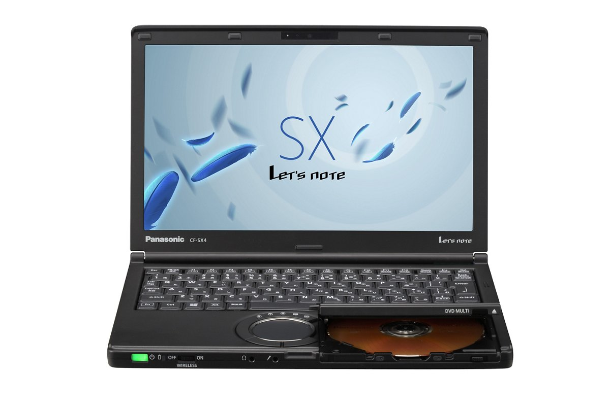
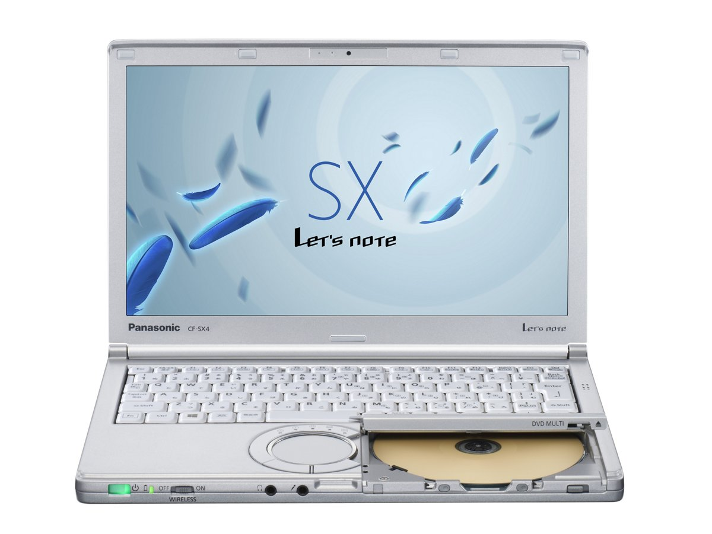

# 松下 Let's note CF-SX4 规格参数

[English](../../en/CF-SX4/) · [日本語](../../ja/CF-SX4/) · **中文**

**CF-SX4** 是松下 Let's note 笔记本电脑，属于 SX 系列，配备 12.1英寸 HD+ 屏幕。本页收录其全部 10 个型号（2015-01 – 2015-06 发售）的规格参数。每个型号均附官方规格表链接。

*松下 Let's note CF-SX4（CF-SX4KFTBR, CF-SX4KFYBR, CF-SX4KDYWR, CF-SX4JDTBR …），黑色。图片 © Panasonic*

## 型号列表

| 型号（品番） | 发售 | 停产 | 主要规格 |
| :-- | :-- | :-- | :-- |
| [CF-SX4MDPBR](https://panasonic.jp/pc/p-db/CF-SX4MDPBR_spec.html) | 2015-06 | 2016-02 | Windows 8.1 Pro Update 64ビット、Intel® CoreTM i5-5200U プロセッサー、メモリー：8GB（空きスロットなし）、HDD：1TB、スーパーマルチドライブ、LAN、無線LAN 802.11a（W52/W53/W56）/b/g/n/ac、Microsoft® Office Home and Business Premium |
| [CF-SX4KFTBR](https://panasonic.jp/pc/p-db/CF-SX4KFTBR_spec.html) | 2015-06 | 2016-02 | Windows 8.1 Pro Update 64ビット、Intel® CoreTM i7-5600U vProTM プロセッサー、メモリー：8GB（空きスロットなし）、SSD：256GB、スーパーマルチドライブ、LAN、無線LAN 802.11a（W52/W53/W56）/b/g/n/ac、Xi（LTE）対応ワイヤレスWAN |
| [CF-SX4KFYBR](https://panasonic.jp/pc/p-db/CF-SX4KFYBR_spec.html) | 2015-06 | 2016-02 | Windows 8.1 Pro Update 64ビット、Intel® CoreTM i7-5600U vProTM プロセッサー、メモリー：8GB（空きスロットなし）、SSD：256GB、スーパーマルチドライブ、LAN、無線LAN 802.11a（W52/W53/W56）/b/g/n/ac、Xi（LTE）対応ワイヤレスWAN、Microsoft® Office Home and Business Premium |
| [CF-SX4MDPWR](https://panasonic.jp/pc/p-db/CF-SX4MDPWR_spec.html) | 2015-06 | 2016-02 | Windows 7 Professional 64ビット、Intel® CoreTM i5-5200U プロセッサー、メモリー：8GB（空きスロットなし）、HDD：1TB、スーパーマルチドライブ、LAN、無線LAN 802.11a（W52/W53/W56）/b/g/n/ac、Microsoft® Office Home and Business Premium |
| [CF-SX4KDYWR](https://panasonic.jp/pc/p-db/CF-SX4KDYWR_spec.html) | 2015-06 | 2016-02 | Windows 7 Professional 64ビット、Intel® CoreTM i7-5600U vProTM プロセッサー、メモリー：8GB（空きスロットなし）、SSD：256GB、スーパーマルチドライブ、LAN、無線LAN 802.11a（W52/W53/W56）/b/g/n/ac、Microsoft® Office Home and Business Premium |
| [CF-SX4HDPBR](https://panasonic.jp/pc/p-db/CF-SX4HDPBR_spec.html) | 2015-01 | 2015-11 | Windows 8.1 Pro Update 64ビット、Intel® CoreTM i5-5200U プロセッサー、メモリー：8GB（空きスロットなし）、HDD：750GB、スーパーマルチドライブ、LAN、無線LAN 802.11a（W52/W53/W56）/b/g/n/ac、Microsoft® Office Home and Business Premium |
| [CF-SX4JDTBR](https://panasonic.jp/pc/p-db/CF-SX4JDTBR_spec.html) | 2015-01 | 2015-11 | Windows 8.1 Pro Update 64ビット、Intel® CoreTM i7-5500U プロセッサー、メモリー：8GB（空きスロットなし）、SSD：256GB、スーパーマルチドライブ、LAN、無線LAN 802.11a（W52/W53/W56）/b/g/n/ac |
| [CF-SX4JDYBR](https://panasonic.jp/pc/p-db/CF-SX4JDYBR_spec.html) | 2015-01 | 2015-11 | Windows 8.1 Pro Update 64ビット、Intel® CoreTM i7-5500U プロセッサー、メモリー：8GB（空きスロットなし）、SSD：256GB、スーパーマルチドライブ、LAN、無線LAN 802.11a（W52/W53/W56）/b/g/n/ac、Microsoft® Office Home and Business Premium |
| [CF-SX4HDPWR](https://panasonic.jp/pc/p-db/CF-SX4HDPWR_spec.html) | 2015-01 | 2015-11 | Windows 7 Professional 64ビット、Intel® CoreTM i5-5200U プロセッサー、メモリー：8GB（空きスロットなし）、HDD：750GB、スーパーマルチドライブ、LAN、無線LAN 802.11a（W52/W53/W56）/b/g/n/ac、Microsoft® Office Home and Business Premium |
| [CF-SX4JDYWR](https://panasonic.jp/pc/p-db/CF-SX4JDYWR_spec.html) | 2015-01 | 2015-11 | Windows 7 Professional 64ビット、Intel® CoreTM i7-5500U プロセッサー、メモリー：8GB（空きスロットなし）、SSD：256GB、スーパーマルチドライブ、LAN、無線LAN 802.11a（W52/W53/W56）/b/g/n/ac、Microsoft® Office Home and Business Premium |

## 通用规格

| 项目 | 规格 |
| :-- | :-- |
| 光驱 | スーパーマルチドライブ（DVD/CD）内蔵 バッファアンダーランエラー防止機能搭載、シェルドライブ |
| 光驱速度 / 读取 | DVD-RAM：最大5倍速 / DVD-ROM：最大8倍速 / DVD-R：最大8倍速 / DVD-R DL:最大8倍速 / DVD-RW：最大8倍速 / +R：最大8倍速 / +R DL：最大8倍速 / +RW：最大8倍速 / HighSpeed +RW：最大8倍速 / CD-ROM：最大24倍速 / CD-R：最大24倍速 / CD-RW：最大24倍速 / High-Speed CD-RW：最大24倍速 / Ultra-Speed CD-RW：最大24倍速 |
| 光驱速度 / 写入 | DVD-RAM書き換え：最大5倍速 / DVD-R 書き込み：最大8倍速 / DVD-R DL 書き込み：最大6倍速 / DVD-RW 書き換え：最大6倍速 / +R 書き込み：最大8倍速 / +R DL 書き込み：最大6倍速 / +RW 書き換え：最大4倍速 / High Speed +RW 書き換え：最大8倍速 / CD-R 書き込み：最大24倍速 / CD-RW 書き換え：4倍速 / High-Speed CD-RW 書き換え：10倍速 / Ultra-Speed CD-RW 書き換え：最大16倍速 |
| 支持光盘 / 读取 | DVD-RAM（ 1.4GB、2.8GB、4.7GB、9.4GB ） / DVD-ROM（1層、2層） / DVD-Video（1層、2層） / DVD-R（ 1.4GB、2.8GB、4.7GB） / DVD-R DL（ 8.5GB ） / DVD-RW（ Ver.1.1/1.2 1.4GB、2.8GB、4.7GB、9.4GB） / +R（ 4.7GB ） / +R DL（ 8.5GB ） / +RW（ 4.7GB ） / HighSpeed +RW（ 4.7GB ） / CD-Audio / CD-ROM（XA対応） / Photo CD（マルチセッション対応） / Video CD / CD EXTRA / CD-TEXT / CD-R / CD-RW / High-Speed CD-RW / Ultra-Speed CD-RW |
| 支持光盘 / 写入 | DVD-RAM（ 1.4GB、2.8GB、4.7GB、9.4GB） / DVD-R（ 1.4GB、2.8 GB、4.7GB for General） / DVD-R DL（ 8.5GB ） / DVD-RW（ Ver.1.1/1.2 1.4GB、2.8GB、4.7GB、9.4GB） / +R（ 4.7GB ） / +R DL（ 8.5GB ） / +RW（ 4.7GB ） / High Speed +RW（ 4.7GB） / CD-R / CD-RW / High-Speed CD-RW / Ultra-Speed CD-RW |
| 显示屏 | 12.1型ワイド(16:9)HD+ TFTカラー液晶 （1600 x 900ドット） |
| 显示屏 / 显卡 | インテル HD グラフィックス5500（CPUに内蔵） |
| 显示屏 / 色彩 | 1600×900ドット：約1677万色 |
| 显示屏 / 外接显示输出 | 1024×768、1280×768、1280×1024、1360×768、1366×768、1400×1050、1600×900、1600×1200、1680×1050 、1920×1080、1920×1200ドット：約1677万色 |
| 显示屏 / 同时显示 | 1024×768、1280×768、1360×768、1366×768、1600×900ドット：約1677万色 |
| 无线通信模块 | インテル Dual Band Wireless-AC 7265 |
| 无线网络 | IEEE802.11a（W52/W53/W56）/b/g/n/ac 準拠 |
| 有线网络 | 1000BASE-T/100BASE-TX/10BASE-T |
| 音频 | PCM音源（24ビットステレオ）、インテル High Definition Audio準拠、モノラルスピーカー |
| 内存扩展槽 | DDR3L 204ピン SO-DIMM専用スロット×1（1.35V/PC3L-12800/DDR3L SDRAM） |
| 麦克风 | モノラルマイク |
| 键盘 | OADG準拠86キー、キーピッチ19mm(横)/16mm(縦)(一部キーを除く） |
| 指点设备 | ホイールパッド |
| 功耗 | 最大約65W |
| 能效达成率（2011 年度标准） | — |

## 各型号差异

| 型号（品番） | 处理器 | 内存 | 存储 | 重量 | 续航 |
| :-- | :-- | :-- | :-- | :-- | :-- |
| CF-SX4MDPBR | Core i5-5200U | 8GB | ハードディスクドライブ | 1.19 kg | 9 h |
| CF-SX4KFTBR | Core i7-5600U vPro | 8GB | 256GB | 1.39 kg | 10 h |
| CF-SX4KFYBR | Core i7-5600U vPro | 8GB | 256GB | 1.39 kg | 10 h |
| CF-SX4MDPWR | Core i5-5200U | 8GB | ハードディスクドライブ | 1.19 kg | 8.5 h |
| CF-SX4KDYWR | Core i7-5600U vPro | 8GB | 256GB | 1.38 kg | 9.5 h |
| CF-SX4HDPBR | Core i5-5200U | 8GB | ハードディスクドライブ | 1.19 kg | 9 h |
| CF-SX4JDTBR | Core i7-5500U | 8GB | 256GB | 1.38 kg | 10 h |
| CF-SX4JDYBR | Core i7-5500U | 8GB | 256GB | 1.38 kg | 10 h |
| CF-SX4HDPWR | Core i5-5200U | 8GB | ハードディスクドライブ | 1.19 kg | 8.5 h |
| CF-SX4JDYWR | Core i7-5500U | 8GB | 256GB | 1.38 kg | 9.5 h |

CF-SX4MDPBR 的全部差异规格

| 项目 | 规格 |
| :-- | :-- |
| 操作系统 | Windows 8.1 Pro Update 64ビット（日本語版） |
| 处理器 | インテル Core i5-5200Uプロセッサー / インテルスマートキャッシュ3MB、動作周波数2.20GHz（インテル ターボ・ブースト・テクノロジー2.0利用時は最大2.70GHz） |
| 芯片组 | CPUに内蔵 |
| 内存 | 8GB（4GB+4GB） DDR3L SDRAM 最大8GB （空きスロット0） |
| 显存 | 最大3839MB (メインメモリーと共用) |
| 硬盘 | ハードディスクドライブ（HDD）1TB（Serial ATA、5400rpm）上記容量のうち約16GBをリカバリー領域、約1GBをシステム領域として使用（ユーザー使用不可） |
| 蓝牙 | Bluetooth v4.0 / ■対応プロファイル / 【Classic】 / ・A2DP（Source） / ・AVRCP（Target） / ・HCRP（Client） / ・HFP（AG） / ・HID（Host） / ・OPP（ClientおよびServer） / ・PAN（User） / ・SPP（DevAおよびDevB） / 【Low Energy】 / ・HOGP（Host） |
| SD 卡槽 | SDメモリーカード×1スロット（SDHCメモリーカード/SDXCメモリーカード対応/UHS-I高速転送対応/著作権保護技術対応） |
| 摄像头 | 有効画素数：最大1280×960ピクセル(約122万画素) |
| 接口 | LANコネクター（RJ-45） / 外部ディスプレイコネクター（アナログRGB ミニD-sub 15ピン） / HDMI出力端子 / マイク入力端子（ステレオミニジャックM3（プラグインパワー対応）） / オーディオ出力端子（ステレオミニジャックM3） / USB3.0ポート×2(うち1つはUSB充電ポートも兼ねる) / USB2.0ポート×1 |
| 电源 | ▼ACアダプター / 入力：AC100V～240V、50Hz/60Hz、出力：DC16V、4.06A、電源コードは100V専用 / ▼バッテリーパック / 7.2V リチウムイオン・公称容量6800mAh、定格容量6400mAh |
| 能效 | 2011年度基準 N区分0.031 |
| 续航 / 充电时间 | ▼駆動時間： / （JEITA Ver.2.0）付属バッテリーパック（S）装着時：約9時間 / ▼充電時間： / 約2.5時間（電源OFF時）、約3時間（電源ON時） |
| 尺寸（宽×深×高） | 幅295mm×奥行197.5mm×高さ25.4mm 突起部除く |
| 颜色 | シルバー |
| 重量（含电池） | パソコン本体：約1.19kg（付属の軽量バッテリーパック(S)（約0.22kg）装着時）、ACアダプター：約0.20kg（電源コード（約0.06kg）除く） |
| 预装软件 | ・Microsoft Internet Explorer 11 / ・ネットセレクターLite / ・Intel PROSet/Wireless Software for Bluetooth Technology / ・セキュリティ設定ユーティリティ / ・マカフィーリブセーフ / ・i-フィルター6.0 (30日間無料お試し版) / ・Adobe Reader / ・WinZip 18.5日本語版（45日体験版） / ・電源プラン拡張ユーティリティ / ・ピークシフト制御ユーティリティ / ・Power2Go with DVD authoring / ・CyberLink PowerDVD10 / ・Wireless Manager mobile edition / ・Intel WiDi / ・USB充電設定ユーティリティ / ・カメラユーティリティ / ・Camera for Panasonic PC / ・Aptioセットアップユーティリティ / ・PC-Diagnosticユーティリティ / ・Dashboard for Panasonic PC / ・無線診断ユーティリティ / ・リカバリーディスク作成ユーティリティ / ・ハードディスクデータ消去ユーティリティ / ・DirectX 11.2 / ・インテル PROSet/Wireless Software / ・インテル My WiFiテクノロジー / ・Skype / ・NAVITIME / ・Bing翻訳 / ・画面共有アシストユーティリティー / ・ホイールパッドユーティリティ |
| Microsoft Office | Microsoft Office Home & Business Premium |
| 附件 | 標準ACアダプター、軽量バッテリーパック(S)、取扱説明書、Microsoft Office Home & Business Premium |

官方规格表: <https://panasonic.jp/pc/p-db/CF-SX4MDPBR_spec.html>

CF-SX4KFTBR 的全部差异规格

| 项目 | 规格 |
| :-- | :-- |
| 操作系统 | Windows 8.1 Pro Update 64ビット（日本語版） |
| 处理器 | インテル Core i7-5600U vProプロセッサー / インテルスマートキャッシュ4MB、動作周波数2.60GHz（インテル ターボ・ブースト・テクノロジー2.0利用時は最大3.20GHz） |
| 芯片组 | CPUに内蔵 |
| 内存 | 8GB（4GB＋4GB） DDR3L SDRAM 最大8GB （空きスロット0） |
| 显存 | 最大3839MB (メインメモリーと共用) |
| 蓝牙 | Bluetooth v4.0 / ■対応プロファイル / 【Classic】 / ・A2DP（Source） / ・AVRCP（Target） / ・HCRP（Client） / ・HFP（AG） / ・HID（Host） / ・OPP（ClientおよびServer） / ・PAN（User） / ・SPP（DevAおよびDevB） / 【Low Energy】 / ・HOGP（Host） |
| 摄像头 | 有効画素数：最大1280×960ピクセル(約122万画素) |
| 接口 | LANコネクター（RJ-45） / 外部ディスプレイコネクター（アナログRGB ミニD-sub 15ピン） / HDMI出力端子 / マイク入力端子（ステレオミニジャックM3（プラグインパワー対応）） / オーディオ出力端子（ステレオミニジャックM3） / USB3.0ポート×2(うち1つはUSB充電ポートも兼ねる) / USB2.0ポート×1 |
| 电源 | ▼ACアダプター / 入力：AC100V～240V、50Hz/60Hz、出力：DC16V、4.06A、電源コードは100V専用 / ▼バッテリーパック / 7.2V リチウムイオン・公称容量13600mAh、定格容量12800mAh、軽量バッテリーパック：7.2V リチウムイオン・公称容量6800mAh、定格容量6400mAh |
| 能效 | 2011年度基準 N区分0.026 |
| 续航 / 充电时间 | ▼駆動時間： / （JEITA Ver.2.0）付属バッテリーパック（S）装着時：約10時間 / 、付属バッテリーパック（L）装着時：約20時間 / ▼充電時間： / 付属バッテリーパック（S）装着時：約2.5時間（電源OFF時）、約3時間（電源ON時） / 付属バッテリーパック（L）装着時：約4時間（電源OFF時）、約5時間（電源ON時） |
| 尺寸（宽×深×高） | 標準バッテリーパック(L)搭載時 / 幅295mm×奥行216.2mm×高さ25.4mm 突起部除く / 軽量バッテリーパック(S)搭載時 / 幅295mm×奥行197.5mm×高さ25.4mm 突起部除く |
| 颜色 | ブラック |
| 重量（含电池） | パソコン本体：約1.39kg（標準バッテリーパック（L）(約0.43kg)装着時） / パソコン本体：約1.18kg（軽量バッテリーパック（S）(約0.22kg）装着時） / ACアダプター：約0.20kg（電源コード（約0.06kg）除く） |
| 预装软件 | ・Microsoft Internet Explorer 11 / ・ネットセレクターLite / ・Intel PROSet/Wireless Software for Bluetooth Technology / ・セキュリティ設定ユーティリティ / ・マカフィーリブセーフ / ・i-フィルター6.0 (30日間無料お試し版) / ・Adobe Reader / ・WinZip 18.5日本語版（45日体験版） / ・電源プラン拡張ユーティリティ / ・ピークシフト制御ユーティリティ / ・Power2Go with DVD authoring / ・CyberLink PowerDVD10 / ・Wireless Manager mobile edition / ・Intel WiDi / ・USB充電設定ユーティリティ / ・カメラユーティリティ / ・Camera for Panasonic PC / ・Aptioセットアップユーティリティ / ・PC-Diagnosticユーティリティ / ・Dashboard for Panasonic PC / ・無線診断ユーティリティ / ・リカバリーディスク作成ユーティリティ / ・ハードディスクデータ消去ユーティリティ / ・DirectX 11.2 / ・インテル PROSet/Wireless Software / ・インテル My WiFiテクノロジー / ・Skype / ・NAVITIME / ・Bing翻訳 / ・画面共有アシストユーティリティー / ・ホイールパッドユーティリティ |
| 附件 | 標準ACアダプター、標準バッテリーパック(L)、軽量バッテリーパック(S)、取扱説明書 |
| 固态硬盘 | フラッシュメモリードライブ（SSD）256GB（Serial ATA）上記容量のうち約16GBをリカバリー領域、約1GBをシステム領域として使用（ユーザー使用不可） |
| LTE | ワイヤレスWANモジュール内蔵(Xi(LTE)対応) |
| 安全芯片 | TPM（ TCG V1.2 準拠） |
| 卡槽 / SD 卡 | SDメモリーカード×1スロット（SDHCメモリーカード/SDXCメモリーカード対応/UHS-I高速転送対応/著作権保護技術対応） |
| 卡槽 / 其他 | ドコモUIMカード(標準サイズ) |

官方规格表: <https://panasonic.jp/pc/p-db/CF-SX4KFTBR_spec.html>

CF-SX4KFYBR 的全部差异规格

| 项目 | 规格 |
| :-- | :-- |
| 操作系统 | Windows 8.1 Pro Update 64ビット（日本語版） |
| 处理器 | インテル Core i7-5600U vProプロセッサー / インテルスマートキャッシュ4MB、動作周波数2.60GHz（インテル ターボ・ブースト・テクノロジー2.0利用時は最大3.20GHz） |
| 芯片组 | CPUに内蔵 |
| 内存 | 8GB（4GB＋4GB） DDR3L SDRAM 最大8GB （空きスロット0） |
| 显存 | 最大3839MB (メインメモリーと共用) |
| 蓝牙 | Bluetooth v4.0 / ■対応プロファイル / 【Classic】 / ・A2DP（Source） / ・AVRCP（Target） / ・HCRP（Client） / ・HFP（AG） / ・HID（Host） / ・OPP（ClientおよびServer） / ・PAN（User） / ・SPP（DevAおよびDevB） / 【Low Energy】 / ・HOGP（Host） |
| 摄像头 | 有効画素数：最大1280×960ピクセル(約122万画素) |
| 接口 | LANコネクター（RJ-45） / 外部ディスプレイコネクター（アナログRGB ミニD-sub 15ピン） / HDMI出力端子 / マイク入力端子（ステレオミニジャックM3（プラグインパワー対応）） / オーディオ出力端子（ステレオミニジャックM3） / USB3.0ポート×2(うち1つはUSB充電ポートも兼ねる) / USB2.0ポート×1 |
| 电源 | ▼ACアダプター / 入力：AC100V～240V、50Hz/60Hz、出力：DC16V、4.06A、電源コードは100V専用 / ▼バッテリーパック / 7.2V リチウムイオン・公称容量13600mAh、定格容量12800mAh、軽量バッテリーパック：7.2V リチウムイオン・公称容量6800mAh、定格容量6400mAh |
| 能效 | 2011年度基準 N区分0.026 |
| 续航 / 充电时间 | ▼駆動時間： / （JEITA Ver.2.0）付属バッテリーパック（S）装着時：約10時間 / 、付属バッテリーパック（L）装着時：約20時間 / ▼充電時間： / 付属バッテリーパック（S）装着時：約2.5時間（電源OFF時）、約3時間（電源ON時） / 付属バッテリーパック（L）装着時：約4時間（電源OFF時）、約5時間（電源ON時） |
| 尺寸（宽×深×高） | 標準バッテリーパック(L)搭載時 / 幅295mm×奥行216.2mm×高さ25.4mm 突起部除く / 軽量バッテリーパック(S)搭載時 / 幅295mm×奥行197.5mm×高さ25.4mm 突起部除く |
| 颜色 | ブラック |
| 重量（含电池） | パソコン本体：約1.39kg（標準バッテリーパック（L）(約0.43kg)装着時） / パソコン本体：約1.18kg（軽量バッテリーパック（S）(約0.22kg）装着時） / ACアダプター：約0.20kg（電源コード（約0.06kg）除く） |
| 预装软件 | ・Microsoft Internet Explorer 11 / ・ネットセレクターLite / ・Intel PROSet/Wireless Software for Bluetooth Technology / ・セキュリティ設定ユーティリティ / ・マカフィーリブセーフ / ・i-フィルター6.0 (30日間無料お試し版) / ・Adobe Reader / ・WinZip 18.5日本語版（45日体験版） / ・電源プラン拡張ユーティリティ / ・ピークシフト制御ユーティリティ / ・Power2Go with DVD authoring / ・CyberLink PowerDVD10 / ・Wireless Manager mobile edition / ・Intel WiDi / ・USB充電設定ユーティリティ / ・カメラユーティリティ / ・Camera for Panasonic PC / ・Aptioセットアップユーティリティ / ・PC-Diagnosticユーティリティ / ・Dashboard for Panasonic PC / ・無線診断ユーティリティ / ・リカバリーディスク作成ユーティリティ / ・ハードディスクデータ消去ユーティリティ / ・DirectX 11.2 / ・インテル PROSet/Wireless Software / ・インテル My WiFiテクノロジー / ・Skype / ・NAVITIME / ・Bing翻訳 / ・画面共有アシストユーティリティー / ・ホイールパッドユーティリティ |
| Microsoft Office | Microsoft Office Home & Business Premium |
| 附件 | 標準ACアダプター、標準バッテリーパック(L)、軽量バッテリーパック(S)、取扱説明書、Microsoft Office Home & Business Premium |
| 固态硬盘 | フラッシュメモリードライブ（SSD）256GB（Serial ATA）上記容量のうち約16GBをリカバリー領域、約1GBをシステム領域として使用（ユーザー使用不可） |
| LTE | ワイヤレスWANモジュール内蔵(Xi(LTE)対応) |
| 安全芯片 | TPM（ TCG V1.2 準拠） |
| 卡槽 / SD 卡 | SDメモリーカード×1スロット（SDHCメモリーカード/SDXCメモリーカード対応/UHS-I高速転送対応/著作権保護技術対応） |
| 卡槽 / 其他 | ドコモUIMカード(標準サイズ) |

官方规格表: <https://panasonic.jp/pc/p-db/CF-SX4KFYBR_spec.html>

CF-SX4MDPWR 的全部差异规格

| 项目 | 规格 |
| :-- | :-- |
| 操作系统 | ▼インストールOS： / Windows 7 Professional 64ビット（日本語版）（Windows 8.1 Pro ダウングレード権行使） / ▼ベースOS： / Windows 8.1 Pro Update 64ビット（日本語版）/ / Windows 7 Professional 64ビット（日本語版）/Windows 7 Professional 32ビット（日本語版） |
| 处理器 | インテル Core i5-5200Uプロセッサー / インテルスマートキャッシュ3MB、動作周波数2.20GHz（インテル ターボ・ブースト・テクノロジー2.0利用時は最大2.70GHz） |
| 芯片组 | CPUに内蔵 |
| 内存 | 8GB（4GB+4GB） DDR3L SDRAM 最大8GB （空きスロット0） |
| 显存 | 最大1696MB (メインメモリーと共用) |
| 硬盘 | ハードディスクドライブ（HDD）1TB（Serial ATA、5400rpm）上記容量のうち約30GBをリカバリー領域、約300MBをシステム領域として使用（ユーザー使用不可） |
| 蓝牙 | Bluetooth v4.0 / ■対応プロファイル / 【Classic】 / ・A2DP（Source） / ・AVRCP（Target） / ・BIP（Client） / ・BPP（Sender） / ・FTP（ClientおよびServer） / ・HCRP（Client） / ・HFP（AG） / ・HID（Host） / ・HSP（AG） / ・OPP（ClientおよびServer） / ・PAN（User） / ・PBAP（PCE） / ・SPP（DevAおよびDevB） / ・SYNC（Client） / 【Low Energy】 / ・HOGP（Host） |
| SD 卡槽 | SDメモリーカード×1スロット（SDHCメモリーカード/SDXCメモリーカード対応/UHS-I高速転送対応/著作権保護技術対応） |
| 摄像头 | 有効画素数：最大1280×960ピクセル(約122万画素) |
| 接口 | LANコネクター（RJ-45） / 外部ディスプレイコネクター（アナログRGB ミニD-sub 15ピン） / HDMI出力端子 / マイク入力端子（ステレオミニジャックM3（プラグインパワー対応）） / オーディオ出力端子（ステレオミニジャックM3） / USB3.0ポート×2(うち1つはUSB充電ポートも兼ねる) / USB2.0ポート×1 |
| 电源 | ▼ACアダプター / 入力：AC100V～240V、50Hz/60Hz、出力：DC16V、4.06A、電源コードは100V専用 / ▼バッテリーパック / 7.2V リチウムイオン・公称容量6800mAh、定格容量6400mAh |
| 能效 | 2011年度基準 N区分0.031 |
| 续航 / 充电时间 | ▼駆動時間： / （JEITA Ver.2.0）付属バッテリーパック（S）装着時：約8.5時間 / ▼充電時間： / 約2.5時間（電源OFF時）、約3時間（電源ON時） |
| 尺寸（宽×深×高） | 幅295mm×奥行197.5mm×高さ25.4mm 突起部除く |
| 颜色 | シルバー |
| 重量（含电池） | パソコン本体：約1.19kg（付属の軽量バッテリーパック(S)（約0.22kg）装着時）、ACアダプター：約0.20kg（電源コード（約0.06kg）除く） |
| 预装软件 | ・Microsoft Internet Explorer 11 / ・ネットセレクターLite / ・Intel PROSet/Wireless Software for Bluetooth Technology / ・セキュリティ設定ユーティリティ / ・マカフィーリブセーフ / ・i-フィルター6.0 (30日間無料お試し版) / ・Adobe Reader / ・WinZip 18.5日本語版（45日体験版） / ・電源プラン拡張ユーティリティ / ・ピークシフト制御ユーティリティ / ・Power2Go with DVD authoring / ・CyberLink PowerDVD10 / ・Wireless Manager mobile edition / ・Intel WiDi / ・USB充電設定ユーティリティ / ・カメラユーティリティ / ・解像度切り替えユーティリティ / ・ズームビューアー / ・クイックブートマネージャー / ・オプティカルディスクドライブ文字変更ユーティリティ / ・Aptioセットアップユーティリティ / ・PC-Diagnosticユーティリティ / ・Dashboard for Panasonic PC / ・無線診断ユーティリティ / ・リカバリーディスク作成ユーティリティ / ・ハードディスクデータ消去ユーティリティ / ・DirectX 11.1 / ・インテル PROSet/Wireless Software / ・インテル My WiFiテクノロジー / ・画面共有アシストユーティリティー / ・ホイールパッドユーティリティ |
| Microsoft Office | Microsoft Office Home & Business Premium |
| 附件 | 標準ACアダプター、軽量バッテリーパック(S)、取扱説明書、Microsoft Office Home & Business Premium |
| 通知 | 本ページに記載されている仕様は、Windows 7 Professional 64ビット環境でのデータになります。 |

官方规格表: <https://panasonic.jp/pc/p-db/CF-SX4MDPWR_spec.html>

CF-SX4KDYWR 的全部差异规格

| 项目 | 规格 |
| :-- | :-- |
| 操作系统 | ▼インストールOS： / Windows 7 Professional 64ビット（日本語版）（Windows 8.1 Pro ダウングレード権行使） / ▼ベースOS： / Windows 8.1 Pro Update 64ビット（日本語版）/ / Windows 7 Professional 64ビット（日本語版）/Windows 7 Professional 32ビット（日本語版） |
| 处理器 | インテル Core i7-5600U vProプロセッサー / インテルスマートキャッシュ4MB、動作周波数2.60GHz（インテル ターボ・ブースト・テクノロジー2.0利用時は最大3.20GHz） |
| 芯片组 | CPUに内蔵 |
| 内存 | 8GB（4GB＋4GB） DDR3L SDRAM 最大8GB （空きスロット0） |
| 显存 | 最大1696MB (メインメモリーと共用) |
| 蓝牙 | Bluetooth v4.0 / ■対応プロファイル / 【Classic】 / ・A2DP（Source） / ・AVRCP（Target） / ・BIP（Client） / ・BPP（Sender） / ・FTP（ClientおよびServer） / ・HCRP（Client） / ・HFP（AG） / ・HID（Host） / ・HSP（AG） / ・OPP（ClientおよびServer） / ・PAN（User） / ・PBAP（PCE） / ・SPP（DevAおよびDevB） / ・SYNC（Client） / 【Low Energy】 / ・HOGP（Host） |
| SD 卡槽 | SDメモリーカード×1スロット（SDHCメモリーカード/SDXCメモリーカード対応/UHS-I高速転送対応/著作権保護技術対応） |
| 摄像头 | 有効画素数：最大1280×960ピクセル(約122万画素) |
| 接口 | LANコネクター（RJ-45） / 外部ディスプレイコネクター（アナログRGB ミニD-sub 15ピン） / HDMI出力端子 / マイク入力端子（ステレオミニジャックM3（プラグインパワー対応）） / オーディオ出力端子（ステレオミニジャックM3） / USB3.0ポート×2（うち1つはUSB充電ポートも兼ねる) / USB2.0ポート×1 |
| 电源 | ▼ACアダプター / 入力：AC100V～240V、50Hz/60Hz、出力：DC16V、4.06A、電源コードは100V専用 / ▼バッテリーパック / 7.2V リチウムイオン・公称容量13600mAh、定格容量12800mAh、軽量バッテリーパック：7.2V リチウムイオン・公称容量6800mAh、定格容量6400mAh |
| 能效 | 2011年度基準 N区分0.026 |
| 续航 / 充电时间 | ▼駆動時間： / （JEITA Ver.2.0）付属バッテリーパック（S）装着時：約9.5時間 / 、付属バッテリー（L）装着時：約19時間 / ▼充電時間： / 付属バッテリーパック（S）装着時：約2.5時間（電源OFF時）、約3時間（電源ON時） / 付属バッテリーパック（L）装着時：約4時間（電源OFF時）、約5時間（電源ON時） |
| 尺寸（宽×深×高） | 標準バッテリーパック(L)搭載時 / 幅295mm×奥行216.2mm×高さ25.4mm 突起部除く / 軽量バッテリーパック(S)搭載時 / 幅295mm×奥行197.5mm×高さ25.4mm 突起部除く |
| 颜色 | ブラック |
| 重量（含电池） | パソコン本体：約1.38kg（標準バッテリーパック（L）(約0.43kg)装着時） / パソコン本体：約1.17kg（軽量バッテリーパック（S）(約0.22kg）装着時） / ACアダプター：約0.20kg（電源コード（約0.06kg）除く） |
| 预装软件 | ・Microsoft Internet Explorer 11 / ・ネットセレクターLite / ・Intel PROSet/Wireless Software for Bluetooth Technology / ・セキュリティ設定ユーティリティ / ・マカフィーリブセーフ / ・i-フィルター6.0 (30日間無料お試し版) / ・Adobe Reader / ・WinZip 18.5日本語版（45日体験版） / ・電源プラン拡張ユーティリティ / ・ピークシフト制御ユーティリティ / ・Power2Go with DVD authoring / ・CyberLink PowerDVD10 / ・Wireless Manager mobile edition / ・Intel WiDi / ・USB充電設定ユーティリティ / ・カメラユーティリティ / ・解像度切り替えユーティリティ / ・ズームビューアー / ・クイックブートマネージャー / ・オプティカルディスクドライブ文字変更ユーティリティ / ・Aptioセットアップユーティリティ / ・PC-Diagnosticユーティリティ / ・Dashboard for Panasonic PC / ・無線診断ユーティリティ / ・リカバリーディスク作成ユーティリティ / ・ハードディスクデータ消去ユーティリティ / ・DirectX 11.1 / ・インテル PROSet/Wireless Software / ・インテル My WiFiテクノロジー / ・画面共有アシストユーティリティー / ・ホイールパッドユーティリティ |
| Microsoft Office | Microsoft Office Home & Business Premium |
| 附件 | 標準ACアダプター、標準バッテリーパック(L)、軽量バッテリーパック(S)、取扱説明書、Microsoft Office Home & Business Premium |
| 固态硬盘 | フラッシュメモリードライブ（SSD）256GB（Serial ATA）上記容量のうち約30GBをリカバリー領域、約300MBをシステム領域として使用（ユーザー使用不可） |
| 安全芯片 | TPM（ TCG V1.2 準拠） |
| 通知 | 本ページに記載されている仕様は、Windows 7 Professional 64ビット環境でのデータになります。 |

官方规格表: <https://panasonic.jp/pc/p-db/CF-SX4KDYWR_spec.html>

CF-SX4HDPBR 的全部差异规格

| 项目 | 规格 |
| :-- | :-- |
| 操作系统 | Windows 8.1 Pro Update 64ビット（日本語版） |
| 处理器 | インテル Core i5-5200Uプロセッサー / インテルスマートキャッシュ3MB、動作周波数2.2GHz（インテル ターボ・ブースト・テクノロジー2.0利用時は最大2.7GHz） |
| 内存 | 8GB（4GB+4GB） DDR3L SDRAM 最大8GB （空きスロット0） |
| 显存 | 最大3839MB (メインメモリーと共用) |
| 硬盘 | ハードディスクドライブ（HDD）750GB（Serial ATA、5400rpm）上記容量のうち約16GBをリカバリー領域、約1GBをシステム領域として使用（ユーザー使用不可） |
| 蓝牙 | Bluetooth v4.0 / ■対応プロファイル / 【Classic】 / ・A2DP（Source） / ・AVRCP（Target） / ・HCRP（Client） / ・HFP（AG） / ・HID（Host） / ・OPP（ClientおよびServer） / ・PAN（User） / ・SPP（DevAおよびDevB） / 【Low Energy】 / ・HOGP（Host） |
| SD 卡槽 | SDメモリーカード×1スロット（SDHCメモリーカード/SDXCメモリーカード対応/UHS-I高速転送対応/著作権保護技術対応） |
| 摄像头 | 有効画素数：最大1280×960ピクセル |
| 接口 | LANコネクター（RJ-45） / 外部ディスプレイコネクター（アナログRGB ミニD-sub 15ピン） / HDMI出力端子 / マイク入力端子（ステレオミニジャックM3（プラグインパワー対応）） / オーディオ出力端子（ステレオミニジャックM3） / USB3.0ポート×2(うち1つはUSB充電ポートも兼ねる) / USB2.0ポート×1 |
| 电源 | ▼ACアダプター / 入力：AC100V～240V、50Hz/60Hz、出力：DC16V、4.06A、電源コードは100V専用 / ▼バッテリーパック / 7.2V リチウムイオン・公称容量6800mAh、定格容量6400mAh |
| 能效 | 2011年度基準 N区分0.031 |
| 续航 / 充电时间 | ▼駆動時間： / （JEITA Ver.2.0）付属バッテリーパック（S）装着時：約9時間/（JEITA Ver.1.0）約13時間 / ▼充電時間： / 約2.5時間（電源OFF時）、約3時間（電源ON時） |
| 尺寸（宽×深×高） | 幅295mm×奥行197.5mm×高さ25.4mm 突起部除く |
| 颜色 | シルバー |
| 重量（含电池） | パソコン本体：約1.19kg（付属の軽量バッテリーパック(S)（約0.22kg）装着時）、ACアダプター：約200g（電源コード（約60g）除く） |
| 预装软件 | ・Microsoft Internet Explorer 11 / ・ネットセレクターLite / ・Intel PROSet/Wireless Software for Bluetooth Technology / ・セキュリティ設定ユーティリティ / ・マカフィーリブセーフ / ・i-フィルター6.0 (30日間無料お試し版)) / ・Adobe Reader / ・WinZip 18.5日本語版（45日体験版） / ・電源プラン拡張ユーティリティ / ・ピークシフト制御ユーティリティ / ・Power2Go with DVD authoring / ・CyberLink PowerDVD10 / ・Wireless Manager mobile edition / ・Intel WiDi / ・USB充電設定ユーティリティ / ・カメラユーティリティ / ・Camera for Panasonic PC / ・Aptioセットアップユーティリティ / ・PC-Diagnosticユーティリティ / ・Dashboard for Panasonic PC / ・無線診断ユーティリティ / ・リカバリーディスク作成ユーティリティ / ・ハードディスクデータ消去ユーティリティ / ・DirectX 11.2 / ・インテル PROSet/Wireless Software / ・インテル My WiFiテクノロジー / ・Skype / ・NAVITIME / ・Bing翻訳 / ・画面共有アシストユーティリティー / ・ホイールパッドユーティリティ |
| Microsoft Office | Microsoft Office Home & Business Premium |
| 附件 | 標準ACアダプター、軽量バッテリーパック(S)、取扱説明書、Microsoft Office Home & Business Premium |

官方规格表: <https://panasonic.jp/pc/p-db/CF-SX4HDPBR_spec.html>

CF-SX4JDTBR 的全部差异规格

| 项目 | 规格 |
| :-- | :-- |
| 操作系统 | Windows 8.1 Pro Update 64ビット（日本語版） |
| 处理器 | インテル Core i7-5500Uプロセッサー / インテルスマートキャッシュ4MB、動作周波数2.4GHz（インテル ターボ・ブースト・テクノロジー2.0利用時は最大3.0GHz） |
| 内存 | 8GB（4GB＋4GB） DDR3L SDRAM 最大8GB （空きスロット0） |
| 显存 | 最大3839MB (メインメモリーと共用) |
| 蓝牙 | Bluetooth v4.0 / ■対応プロファイル / 【Classic】 / ・A2DP（Source） / ・AVRCP（Target） / ・HCRP（Client） / ・HFP（AG） / ・HID（Host） / ・OPP（ClientおよびServer） / ・PAN（User） / ・SPP（DevAおよびDevB） / 【Low Energy】 / ・HOGP（Host） |
| SD 卡槽 | SDメモリーカード×1スロット（SDHCメモリーカード/SDXCメモリーカード対応/UHS-I高速転送対応/著作権保護技術対応） |
| 摄像头 | 有効画素数：最大1280×960ピクセル |
| 接口 | LANコネクター（RJ-45） / 外部ディスプレイコネクター（アナログRGB ミニD-sub 15ピン） / HDMI出力端子 / マイク入力端子（ステレオミニジャックM3（プラグインパワー対応）） / オーディオ出力端子（ステレオミニジャックM3） / USB3.0ポート×2(うち1つはUSB充電ポートも兼ねる) / USB2.0ポート×1 |
| 电源 | ▼ACアダプター / 入力：AC100V～240V、50Hz/60Hz、出力：DC16V、4.06A、電源コードは100V専用 / ▼バッテリーパック / 7.2V リチウムイオン・公称容量13600mAh、定格容量12800mAh、軽量バッテリーパック：7.2V リチウムイオン・公称容量6800mAh、定格容量6400mAh |
| 能效 | 2011年度基準 N区分0.028 |
| 续航 / 充电时间 | ▼駆動時間： / （JEITA Ver.2.0）付属バッテリーパック（S）装着時：約10時間/（JEITA Ver.1.0）約15時間 / ▼充電時間： / 約2.5時間（電源OFF時）、約3時間（電源ON時） |
| 尺寸（宽×深×高） | 標準バッテリーパック(L)搭載時 / 幅295mm×奥行216.2mm×高さ25.4mm 突起部除く / 軽量バッテリーパック(S)搭載時 / 幅295mm×奥行197.5mm×高さ25.4mm 突起部除く |
| 颜色 | ブラック |
| 重量（含电池） | パソコン本体：約1.38kg（標準バッテリーパック（L）(約0.43kg)装着時） / パソコン本体：約1.17kg（軽量バッテリーパック（S）(約0.22kg）装着時） / ACアダプター：約200g（電源コード（約60g）除く） |
| 预装软件 | ・Microsoft Internet Explorer 11 / ・ネットセレクターLite / ・Intel PROSet/Wireless Software for Bluetooth Technology / ・セキュリティ設定ユーティリティ / ・マカフィーリブセーフ / ・i-フィルター6.0 (30日間無料お試し版) / ・Adobe Reader / ・WinZip 18.5日本語版（45日体験版） / ・電源プラン拡張ユーティリティ / ・ピークシフト制御ユーティリティ / ・Power2Go with DVD authoring / ・CyberLink PowerDVD10 / ・Wireless Manager mobile edition / ・Intel WiDi / ・USB充電設定ユーティリティ / ・カメラユーティリティ / ・Camera for Panasonic PC / ・Aptioセットアップユーティリティ / ・PC-Diagnosticユーティリティ / ・Dashboard for Panasonic PC / ・無線診断ユーティリティ / ・リカバリーディスク作成ユーティリティ / ・ハードディスクデータ消去ユーティリティ / ・DirectX 11.2 / ・インテル PROSet/Wireless Software / ・インテル My WiFiテクノロジー / ・Skype / ・NAVITIME / ・Bing翻訳 / ・画面共有アシストユーティリティー / ・ホイールパッドユーティリティ |
| 附件 | 標準ACアダプター、標準バッテリーパック(L)、軽量バッテリーパック(S)、取扱説明書 |
| 固态硬盘 | フラッシュメモリードライブ（SSD）256GB（Serial ATA）上記容量のうち約16GBをリカバリー領域、約1GBをシステム領域として使用（ユーザー使用不可） |

官方规格表: <https://panasonic.jp/pc/p-db/CF-SX4JDTBR_spec.html>

CF-SX4JDYBR 的全部差异规格

| 项目 | 规格 |
| :-- | :-- |
| 操作系统 | Windows 8.1 Pro Update 64ビット（日本語版） |
| 处理器 | インテル Core i7-5500Uプロセッサー / インテルスマートキャッシュ4MB、動作周波数2.4GHz（インテル ターボ・ブースト・テクノロジー2.0利用時は最大3.0GHz） |
| 内存 | 8GB（4GB＋4GB） DDR3L SDRAM 最大8GB （空きスロット0） |
| 显存 | 最大3839MB (メインメモリーと共用) |
| 蓝牙 | Bluetooth v4.0 / ■対応プロファイル / 【Classic】 / ・A2DP（Source） / ・AVRCP（Target） / ・HCRP（Client） / ・HFP（AG） / ・HID（Host） / ・OPP（ClientおよびServer） / ・PAN（User） / ・SPP（DevAおよびDevB） / 【Low Energy】 / ・HOGP（Host） |
| SD 卡槽 | SDメモリーカード×1スロット（SDHCメモリーカード/SDXCメモリーカード対応/UHS-I高速転送対応/著作権保護技術対応） |
| 摄像头 | 有効画素数：最大1280×960ピクセル |
| 接口 | LANコネクター（RJ-45） / 外部ディスプレイコネクター（アナログRGB ミニD-sub 15ピン） / HDMI出力端子 / マイク入力端子（ステレオミニジャックM3（プラグインパワー対応）） / オーディオ出力端子（ステレオミニジャックM3） / USB3.0ポート×2(うち1つはUSB充電ポートも兼ねる) / USB2.0ポート×1 |
| 电源 | ▼ACアダプター / 入力：AC100V～240V、50Hz/60Hz、出力：DC16V、4.06A、電源コードは100V専用 / ▼バッテリーパック / 7.2V リチウムイオン・公称容量13600mAh、定格容量12800mAh、軽量バッテリーパック：7.2V リチウムイオン・公称容量6800mAh、定格容量6400mAh |
| 能效 | 2011年度基準 N区分0.028 |
| 续航 / 充电时间 | ▼駆動時間： / （JEITA Ver.2.0）付属バッテリーパック（S）装着時：約10時間/（JEITA Ver.1.0）約15時間 / ▼充電時間： / 約2.5時間（電源OFF時）、約3時間（電源ON時） |
| 尺寸（宽×深×高） | 標準バッテリーパック(L)搭載時 / 幅295mm×奥行216.2mm×高さ25.4mm 突起部除く / 軽量バッテリーパック(S)搭載時 / 幅295mm×奥行197.5mm×高さ25.4mm 突起部除く |
| 颜色 | ブラック |
| 重量（含电池） | パソコン本体：約1.38kg（標準バッテリーパック（L）(約0.43kg)装着時） / パソコン本体：約1.17kg（軽量バッテリーパック（S）(約0.22kg）装着時） / ACアダプター：約200g（電源コード（約60g）除く） |
| 预装软件 | ・Microsoft Internet Explorer 11 / ・ネットセレクターLite / ・Intel PROSet/Wireless Software for Bluetooth Technology / ・セキュリティ設定ユーティリティ / ・マカフィーリブセーフ / ・i-フィルター6.0 (30日間無料お試し版) / ・Adobe Reader / ・WinZip 18.5日本語版（45日体験版） / ・電源プラン拡張ユーティリティ / ・ピークシフト制御ユーティリティ / ・Power2Go with DVD authoring / ・CyberLink PowerDVD10 / ・Wireless Manager mobile edition / ・Intel WiDi / ・USB充電設定ユーティリティ / ・カメラユーティリティ / ・Camera for Panasonic PC / ・Aptioセットアップユーティリティ / ・PC-Diagnosticユーティリティ / ・Dashboard for Panasonic PC / ・無線診断ユーティリティ / ・リカバリーディスク作成ユーティリティ / ・ハードディスクデータ消去ユーティリティ / ・DirectX 11.2 / ・インテル PROSet/Wireless Software / ・インテル My WiFiテクノロジー / ・Skype / ・NAVITIME / ・Bing翻訳 / ・画面共有アシストユーティリティー / ・ホイールパッドユーティリティ |
| Microsoft Office | Microsoft Office Home & Business Premium |
| 附件 | 標準ACアダプター、標準バッテリーパック(L)、軽量バッテリーパック(S)、取扱説明書、Microsoft Office Home & Business Premium |
| 固态硬盘 | フラッシュメモリードライブ（SSD）256GB（Serial ATA）上記容量のうち約16GBをリカバリー領域、約1GBをシステム領域として使用（ユーザー使用不可） |

官方规格表: <https://panasonic.jp/pc/p-db/CF-SX4JDYBR_spec.html>

CF-SX4HDPWR 的全部差异规格

| 项目 | 规格 |
| :-- | :-- |
| 操作系统 | ▼インストールOS： / Windows 7 Professional 64ビット（日本語版）（Windows 8.1 Pro ダウングレード権行使） / ▼ベースOS： / Windows 8.1 Pro Update 64ビット（日本語版）/ / Windows 7 Professional 64ビット（日本語版）/Windows 7 Professional 32ビット（日本語版） |
| 处理器 | インテル Core i5-5200Uプロセッサー / インテルスマートキャッシュ3MB、動作周波数2.2GHz（インテル ターボ・ブースト・テクノロジー2.0利用時は最大2.7GHz） |
| 内存 | 8GB（4GB+4GB） DDR3L SDRAM 最大8GB （空きスロット0） |
| 显存 | 最大1696MB (メインメモリーと共用) |
| 硬盘 | ハードディスクドライブ（HDD）750GB（Serial ATA、5400rpm）上記容量のうち約30GBをリカバリー領域、約300MBをシステム領域として使用（ユーザー使用不可） |
| 蓝牙 | Bluetooth v4.0 / ■対応プロファイル / 【Classic】 / ・A2DP（Source） / ・AVRCP（Target） / ・BIP（Client） / ・BPP（Sender） / ・FTP（ClientおよびServer） / ・HCRP（Client） / ・HFP（AG） / ・HID（Host） / ・HSP（AG） / ・OPP（ClientおよびServer） / ・PAN（User） / ・PBAP（PCE） / ・SPP（DevAおよびDevB） / ・SYNC（Client） / 【Low Energy】 / ・HOGP（Host） |
| SD 卡槽 | SDメモリーカード×1スロット（SDHCメモリーカード/SDXCメモリーカード対応/UHS-I高速転送対応/著作権保護技術対応） |
| 摄像头 | 有効画素数：最大1280×960ピクセル |
| 接口 | LANコネクター（RJ-45） / 外部ディスプレイコネクター（アナログRGB ミニD-sub 15ピン） / HDMI出力端子 / マイク入力端子（ステレオミニジャックM3（プラグインパワー対応）） / オーディオ出力端子（ステレオミニジャックM3） / USB3.0ポート×2(うち1つはUSB充電ポートも兼ねる) / USB2.0ポート×1 |
| 电源 | ▼ACアダプター / 入力：AC100V～240V、50Hz/60Hz、出力：DC16V、4.06A、電源コードは100V専用 / ▼バッテリーパック / 7.2V リチウムイオン・公称容量6800mAh、定格容量6400mAh |
| 能效 | 2011年度基準 N区分0.031 |
| 续航 / 充电时间 | ▼駆動時間： / （JEITA Ver.2.0）付属バッテリーパック（S）装着時：約8.5時間/（JEITA Ver.1.0）約13時間 / ▼充電時間： / 約2.5時間（電源OFF時）、約3時間（電源ON時） |
| 尺寸（宽×深×高） | 幅295mm×奥行197.5mm×高さ25.4mm 突起部除く |
| 颜色 | シルバー |
| 重量（含电池） | パソコン本体：約1.19kg（付属の軽量バッテリーパック(S)（約0.22kg）装着時）、ACアダプター：約200g（電源コード（約60g）除く） |
| 预装软件 | ・Microsoft Internet Explorer 11 / ・ネットセレクターLite / ・Intel PROSet/Wireless Software for Bluetooth Technology / ・セキュリティ設定ユーティリティ / ・マカフィーリブセーフ / ・i-フィルター6.0 (30日間無料お試し版) / ・Adobe Reader / ・WinZip 18.5日本語版（45日体験版） / ・電源プラン拡張ユーティリティ / ・ピークシフト制御ユーティリティ / ・Power2Go with DVD authoring / ・CyberLink PowerDVD10 / ・Wireless Manager mobile edition / ・Intel WiDi / ・USB充電設定ユーティリティ / ・カメラユーティリティ / ・解像度切り替えユーティリティ / ・ズームビューアー / ・クイックブートマネージャー / ・オプティカルディスクドライブ文字変更ユーティリティ / ・Aptioセットアップユーティリティ / ・PC-Diagnosticユーティリティ / ・Dashboard for Panasonic PC / ・無線診断ユーティリティ / ・リカバリーディスク作成ユーティリティ / ・ハードディスクデータ消去ユーティリティ / ・DirectX 11.1 / ・インテル PROSet/Wireless Software / ・インテル My WiFiテクノロジー / ・画面共有アシストユーティリティー / ・ホイールパッドユーティリティ |
| Microsoft Office | Microsoft Office Home & Business Premium |
| 附件 | 標準ACアダプター、軽量バッテリーパック(S)、取扱説明書、Microsoft Office Home & Business Premium |
| 通知 | 本ページに記載されている仕様は、Windows 7 Professional 64ビット環境でのデータになります。 |

官方规格表: <https://panasonic.jp/pc/p-db/CF-SX4HDPWR_spec.html>

CF-SX4JDYWR 的全部差异规格

| 项目 | 规格 |
| :-- | :-- |
| 操作系统 | ▼インストールOS： / Windows 7 Professional 64ビット（日本語版）（Windows 8.1 Pro ダウングレード権行使） / ▼ベースOS： / Windows 8.1 Pro Update 64ビット（日本語版）/ / Windows 7 Professional 64ビット（日本語版）/Windows 7 Professional 32ビット（日本語版） |
| 处理器 | インテル Core i7-5500Uプロセッサー / インテルスマートキャッシュ4MB、動作周波数2.4GHz（インテル ターボ・ブースト・テクノロジー2.0利用時は最大3.0GHz） |
| 内存 | 8GB（4GB＋4GB） DDR3L SDRAM 最大8GB （空きスロット0） |
| 显存 | 最大1696MB (メインメモリーと共用) |
| 蓝牙 | Bluetooth v4.0 / ■対応プロファイル / 【Classic】 / ・A2DP（Source） / ・AVRCP（Target） / ・BIP（Client） / ・BPP（Sender） / ・FTP（ClientおよびServer） / ・HCRP（Client） / ・HFP（AG） / ・HID（Host） / ・HSP（AG） / ・OPP（ClientおよびServer） / ・PAN（User） / ・PBAP（PCE） / ・SPP（DevAおよびDevB） / ・SYNC（Client） / 【Low Energy】 / ・HOGP（Host） |
| SD 卡槽 | SDメモリーカード×1スロット（SDHCメモリーカード/SDXCメモリーカード対応/UHS-I高速転送対応/著作権保護技術対応） |
| 摄像头 | 有効画素数：最大1280×960ピクセル |
| 接口 | LANコネクター（RJ-45） / 外部ディスプレイコネクター（アナログRGB ミニD-sub 15ピン） / HDMI出力端子 / マイク入力端子（ステレオミニジャックM3（プラグインパワー対応）） / オーディオ出力端子（ステレオミニジャックM3） / USB3.0ポート×2（うち1つはUSB充電ポートも兼ねる) / USB2.0ポート×1 |
| 电源 | ▼ACアダプター / 入力：AC100V～240V、50Hz/60Hz、出力：DC16V、4.06A、電源コードは100V専用 / ▼バッテリーパック / 7.2V リチウムイオン・公称容量13600mAh、定格容量12800mAh、軽量バッテリーパック：7.2V リチウムイオン・公称容量6800mAh、定格容量6400mAh |
| 能效 | 2011年度基準 N区分0.028 |
| 续航 / 充电时间 | ▼駆動時間： / （JEITA Ver.2.0）付属バッテリーパック（S）装着時：約9.5時間/（JEITA Ver.1.0）約15時間 / ▼充電時間： / 約2.5時間（電源OFF時）、約3時間（電源ON時） |
| 尺寸（宽×深×高） | 標準バッテリーパック(L)搭載時 / 幅295mm×奥行216.2mm×高さ25.4mm 突起部除く / 軽量バッテリーパック(S)搭載時 / 幅295mm×奥行197.5mm×高さ25.4mm 突起部除く |
| 颜色 | ブラック |
| 重量（含电池） | パソコン本体：約1.38kg（標準バッテリーパック（L）(約0.43kg)装着時） / パソコン本体：約1.17kg（軽量バッテリーパック（S）(約0.22kg）装着時） / ACアダプター：約200g（電源コード（約60g）除く） |
| 预装软件 | ・Microsoft Internet Explorer 11 / ・ネットセレクターLite / ・Intel PROSet/Wireless Software for Bluetooth Technology / ・セキュリティ設定ユーティリティ / ・マカフィーリブセーフ / ・i-フィルター6.0 (30日間無料お試し版) / ・Adobe Reader / ・WinZip 18.5日本語版（45日体験版） / ・電源プラン拡張ユーティリティ / ・ピークシフト制御ユーティリティ / ・Power2Go with DVD authoring / ・CyberLink PowerDVD10 / ・Wireless Manager mobile edition / ・Intel WiDi / ・USB充電設定ユーティリティ / ・カメラユーティリティ / ・解像度切り替えユーティリティ / ・ズームビューアー / ・クイックブートマネージャー / ・オプティカルディスクドライブ文字変更ユーティリティ / ・Aptioセットアップユーティリティ / ・PC-Diagnosticユーティリティ / ・Dashboard for Panasonic PC / ・無線診断ユーティリティ / ・リカバリーディスク作成ユーティリティ / ・ハードディスクデータ消去ユーティリティ / ・DirectX 11.1 / ・インテル PROSet/Wireless Software / ・インテル My WiFiテクノロジー / ・画面共有アシストユーティリティー / ・ホイールパッドユーティリティ |
| Microsoft Office | Microsoft Office Home & Business Premium |
| 附件 | 標準ACアダプター、標準バッテリーパック(L)、軽量バッテリーパック(S)、取扱説明書、Microsoft Office Home & Business Premium |
| 固态硬盘 | フラッシュメモリードライブ（SSD）256GB（Serial ATA）上記容量のうち約30GBをリカバリー領域、約300MBをシステム領域として使用（ユーザー使用不可） |
| 通知 | 本ページに記載されている仕様は、Windows 7 Professional 64ビット環境でのデータになります。 |

官方规格表: <https://panasonic.jp/pc/p-db/CF-SX4JDYWR_spec.html>

## 图片

*松下 Let's note CF-SX4（CF-SX4MDPBR, CF-SX4MDPWR, CF-SX4HDPBR, CF-SX4HDPWR），银色。图片 © Panasonic*

## 相关机型

- 同系列上一代: [CF-SX3](../CF-SX3/)
- [Let's note 全部机型](../)

---

来源：松下官方[停产产品列表](https://panasonic.jp/pc/support/products/)及各型号规格表（panasonic.jp）。规格数值保留官方日文原文。产品图片 © Panasonic。本页为非官方整理，与松下公司无关。
