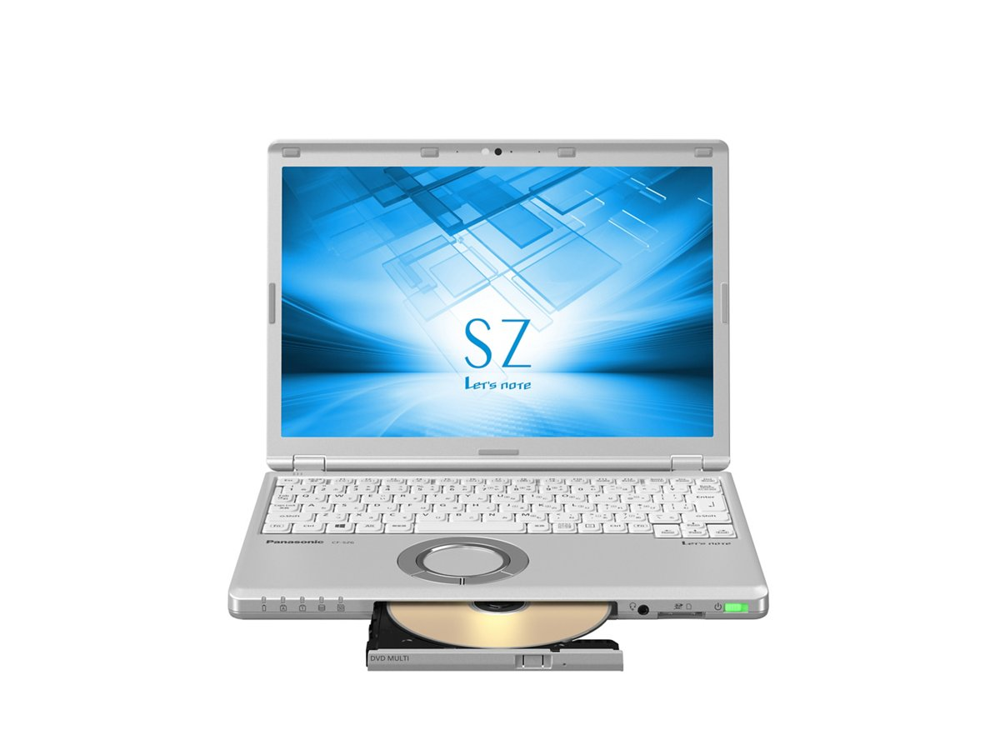
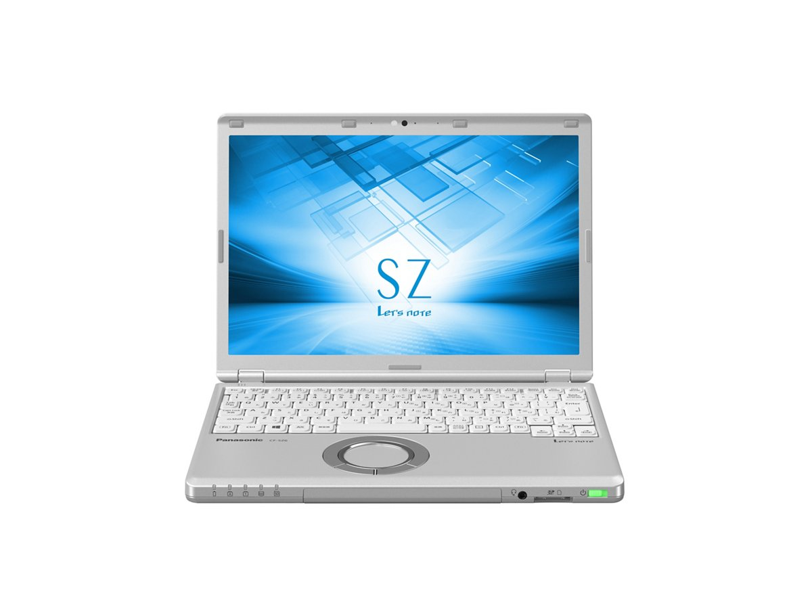
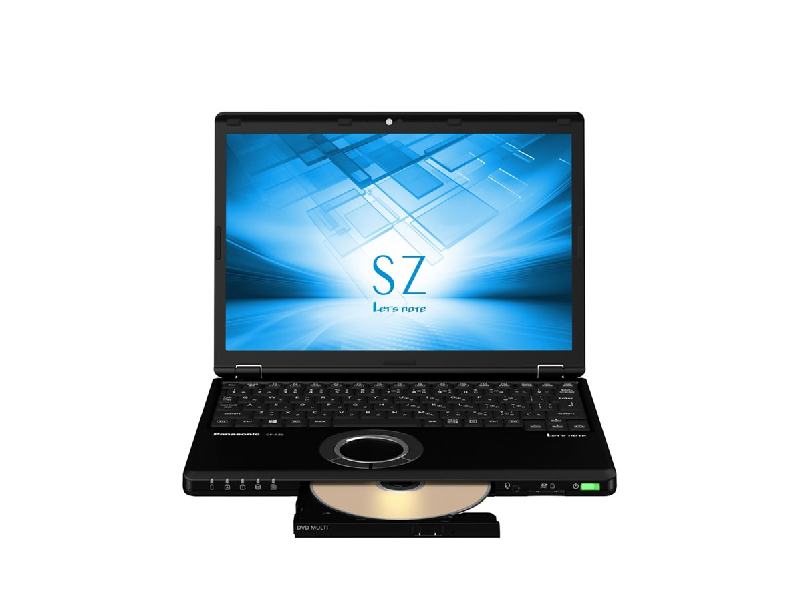
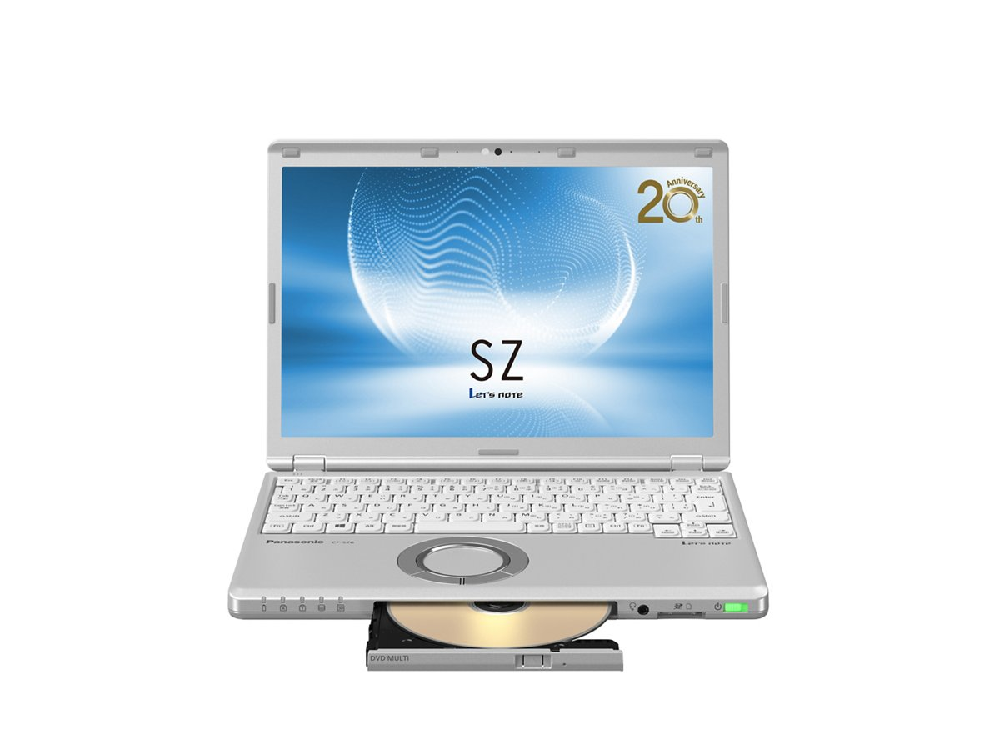
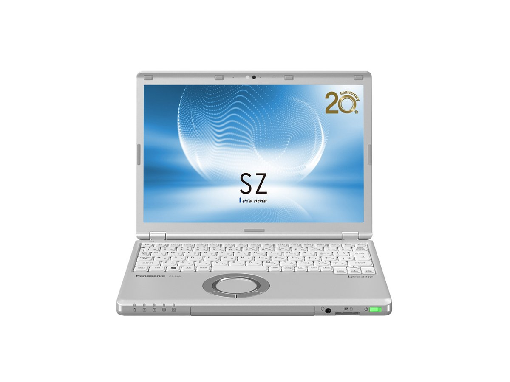
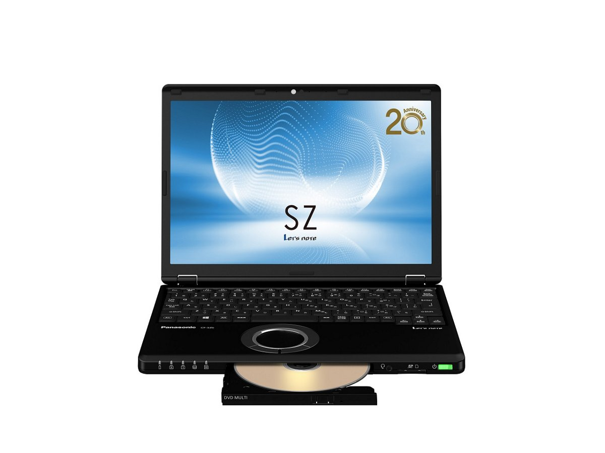

# 松下 Let's note CF-SZ6 规格参数

[English](../../en/CF-SZ6/) · [日本語](../../ja/CF-SZ6/) · **中文**

🗄️ 在 [Let's note 陈列柜](https://letsnote-specs.github.io/zh/CF-SZ6/)中查看此机型

**CF-SZ6** 是松下 Let's note 笔记本电脑，属于 SZ 系列，配备 12.1英寸 WUXGA 屏幕。本页收录其全部 20 个型号（2016-10 – 2017-10 发售）的规格参数。每个型号均附官方规格表链接。

*松下 Let's note CF-SZ6（CF-SZ6PDKPR, CF-SZ6PDLQR, CF-SZ6QDAQR, CF-SZ6BDKPR …），银色。图片 © Panasonic*

## 型号列表

| 型号（品番） | 发售 | 停产 | 主要规格 |
| :-- | :-- | :-- | :-- |
| [CF-SZ6PDYQR](https://panasonic.jp/pc/p-db/CF-SZ6PDYQR_spec.html) | 2017-10 | 2018-09 | Windows 10 Pro 64位、Intel® CoreTM i5-7200U 处理器、内存：8GB（无扩展插槽）、SSD：256GB、LAN、无线LAN 802.11a（W52/W53/W56）/b/g/n/ac、Microsoft® Office Home and Business Premium |
| [CF-SZ6PDKPR](https://panasonic.jp/pc/p-db/CF-SZ6PDKPR_spec.html) | 2017-10 | 2018-09 | Windows 10 Home 64位、Intel® CoreTM i5-7200U 处理器、内存：8GB（无扩展插槽）、HDD：1TB、超级多功能驱动器、LAN、无线LAN 802.11a（W52/W53/W56）/b/g/n/ac、Microsoft® Office Home and Business Premium |
| [CF-SZ6PDLQR](https://panasonic.jp/pc/p-db/CF-SZ6PDLQR_spec.html) | 2017-10 | 2018-09 | Windows 10 Pro 64位、Intel® CoreTM i5-7200U 处理器、内存：8GB（无扩展插槽）、SSD：128GB、Super Multi Drive、LAN、无线LAN 802.11a（W52/W53/W56）/b/g/n/ac、Microsoft® Office Home and Business Premium |
| [CF-SZ6QDAQR](https://panasonic.jp/pc/p-db/CF-SZ6QDAQR_spec.html) | 2017-10 | 2018-09 | Windows 10 Pro 64位、Intel® CoreTM i7-7500U 处理器、内存：8GB（无扩展插槽）、SSD：128GB＋HDD：1TB、Super Multi Drive、LAN、无线LAN 802.11a（W52/W53/W56）/b/g/n/ac、Microsoft® Office Home and Business Premium |
| [CF-SZ6QFMQR](https://panasonic.jp/pc/p-db/CF-SZ6QFMQR_spec.html) | 2017-10 | 2018-09 | Windows 10 Pro 64位、Intel® CoreTM i7-7500U 处理器、内存：8GB（无扩展插槽）、SSD：256GB、Super Multi Drive、LAN、无线LAN 802.11a（W52/W53/W56）/b/g/n/ac、支持LTE的无线WAN、Microsoft® Office Home and Business Premium |
| [CF-SZ6BDYQR](https://panasonic.jp/pc/p-db/CF-SZ6BDYQR_spec.html) | 2017-06 | 2018-01 | Windows 10 Pro 64位、Intel® CoreTM i5-7200U 处理器、内存：8GB（无扩展插槽）、SSD：256GB、LAN、无线LAN 802.11a（W52/W53/W56）/b/g/n/ac、Microsoft® Office Home and Business Premium |
| [CF-SZ6BDKPR](https://panasonic.jp/pc/p-db/CF-SZ6BDKPR_spec.html) | 2017-06 | 2018-01 | Windows 10 Home 64位、Intel® CoreTM i5-7200U 处理器、内存：8GB（无扩展插槽）、HDD：1TB、超级多功能驱动器、LAN、无线LAN 802.11a（W52/W53/W56）/b/g/n/ac、Microsoft® Office Home and Business Premium |
| [CF-SZ6BDLQR](https://panasonic.jp/pc/p-db/CF-SZ6BDLQR_spec.html) | 2017-06 | 2018-01 | Windows 10 Pro 64位、Intel® CoreTM i5-7200U 处理器、内存：8GB（无扩展插槽）、SSD：128GB、Super Multi Drive、LAN、无线LAN 802.11a（W52/W53/W56）/b/g/n/ac、Microsoft® Office Home and Business Premium |
| [CF-SZ6CDAQR](https://panasonic.jp/pc/p-db/CF-SZ6CDAQR_spec.html) | 2017-06 | 2018-01 | Windows 10 Pro 64位、Intel® CoreTM i7-7500U 处理器、内存：8GB（无扩展插槽）、SSD：128GB＋HDD：1TB、Super Multi Drive、LAN、无线LAN 802.11a（W52/W53/W56）/b/g/n/ac、Microsoft® Office Home and Business Premium |
| [CF-SZ6CFMQR](https://panasonic.jp/pc/p-db/CF-SZ6CFMQR_spec.html) | 2017-06 | 2018-01 | Windows 10 Pro 64位、Intel® CoreTM i7-7500U 处理器、内存：8GB（无扩展插槽）、SSD：256GB、Super Multi Drive、LAN、无线LAN 802.11a（W52/W53/W56）/b/g/n/ac、支持LTE的无线WAN、Microsoft® Office Home and Business Premium |
| [CF-SZ6HDYPR](https://panasonic.jp/pc/p-db/CF-SZ6HDYPR_spec.html) | 2017-01 | 2017-09 | Windows 10 Home 64位、Intel® CoreTM i5-7200U 处理器、内存：8GB（无扩展插槽）、SSD：256GB、LAN、无线LAN 802.11a（W52/W53/W56）/b/g/n/ac、Microsoft® Office Home and Business Premium |
| [CF-SZ6HDKPR](https://panasonic.jp/pc/p-db/CF-SZ6HDKPR_spec.html) | 2017-01 | 2017-09 | Windows 10 Home 64位、Intel® CoreTM i5-7200U 处理器、内存：8GB（无扩展插槽）、HDD：1TB、超级多功能驱动器、LAN、无线LAN 802.11a（W52/W53/W56）/b/g/n/ac、Microsoft® Office Home and Business Premium |
| [CF-SZ6HDLQR](https://panasonic.jp/pc/p-db/CF-SZ6HDLQR_spec.html) | 2017-01 | 2017-09 | Windows 10 Pro 64位、Intel® CoreTM i5-7200U 处理器、内存：8GB（无扩展插槽）、SSD：128GB、Super Multi Drive、LAN、无线LAN 802.11a（W52/W53/W56）/b/g/n/ac、Microsoft® Office Home and Business Premium |
| [CF-SZ6JD3QR](https://panasonic.jp/pc/p-db/CF-SZ6JD3QR_spec.html) | 2017-01 | 2017-09 | Windows 10 Pro 64位、Intel® CoreTM i7-7500U 处理器、内存：8GB（无扩展插槽）、SSD：256GB、Super Multi Drive、LAN、无线LAN 802.11a（W52/W53/W56）/b/g/n/ac、Microsoft® Office Home and Business Premium |
| [CF-SZ6JFMQR](https://panasonic.jp/pc/p-db/CF-SZ6JFMQR_spec.html) | 2017-01 | 2017-09 | Windows 10 Pro 64位、Intel® CoreTM i7-7500U 处理器、内存：8GB（无扩展插槽）、SSD：256GB、Super Multi Drive、LAN、无线LAN 802.11a（W52/W53/W56）/b/g/n/ac、支持LTE的无线WAN、Microsoft® Office Home and Business Premium |
| [CF-SZ6EDYPR](https://panasonic.jp/pc/p-db/CF-SZ6EDYPR_spec.html) | 2016-10 | 2017-02 | Windows 10 Home 64位、Intel® CoreTM i5-7200U 处理器、内存：8GB（无扩展插槽）、SSD：256GB、超级多功能驱动器、LAN、无线LAN 802.11a（W52/W53/W56）/b/g/n/ac、Microsoft® Office Home and Business Premium |
| [CF-SZ6EDKPR](https://panasonic.jp/pc/p-db/CF-SZ6EDKPR_spec.html) | 2016-10 | 2017-02 | Windows 10 Home 64位、Intel® CoreTM i5-7200U 处理器、内存：8GB（无扩展插槽）、HDD：1TB、超级多功能驱动器、LAN、无线LAN 802.11a（W52/W53/W56）/b/g/n/ac、Microsoft® Office Home and Business Premium |
| [CF-SZ6EDLQR](https://panasonic.jp/pc/p-db/CF-SZ6EDLQR_spec.html) | 2016-10 | 2017-02 | Windows 10 Pro 64位、Intel® CoreTM i5-7200U 处理器、内存：8GB（无扩展插槽）、SSD：128GB、Super Multi Drive、LAN、无线LAN 802.11a（W52/W53/W56）/b/g/n/ac、Microsoft® Office Home and Business Premium |
| [CF-SZ6FD3QR](https://panasonic.jp/pc/p-db/CF-SZ6FD3QR_spec.html) | 2016-10 | 2017-02 | Windows 10 Pro 64位、Intel® CoreTM i7-7500U 处理器、内存：8GB（无扩展插槽）、SSD：256GB、Super Multi Drive、LAN、无线LAN 802.11a（W52/W53/W56）/b/g/n/ac、Microsoft® Office Home and Business Premium |
| [CF-SZ6FFMQR](https://panasonic.jp/pc/p-db/CF-SZ6FFMQR_spec.html) | 2016-10 | 2017-02 | Windows 10 Pro 64位、Intel® CoreTM i7-7500U 处理器、内存：8GB（无扩展插槽）、SSD：256GB、Super Multi Drive、LAN、无线LAN 802.11a（W52/W53/W56）/b/g/n/ac、支持LTE的无线WAN、Microsoft® Office Home and Business Premium |

## 通用规格

| 项目 | 规格 |
| :-- | :-- |
| 芯片组 | 内置于CPU |
| 内存 | 8GB LPDDR3 SDRAM（无扩展插槽） |
| 显示屏 | 12.1英寸(16:10)WUXGA TFT彩色液晶（1920 x 1200像素）、防眩光 |
| 显示屏 / 显卡 | 英特尔 HD 显卡 620（集成于CPU） |
| 显示屏 / 色彩 | 1920×1200像素：约1677万色 |
| 显示屏 / 同时显示 | 1024×768、1280×768、1280×1024、1360×768、1366×768、1400×1050、1600×900、1600×1200、1680×1050、1920×1080、1920×1200像素：约1677万色 |
| 无线通信模块 | 英特尔 Dual Band Wireless-AC 8265 |
| 无线网络 | 符合IEEE802.11a（W52/W53/W56）/b/g/n/ac |
| 有线网络 | 1000BASE-T/100BASE-TX/10BASE-T |
| 蓝牙 | Bluetooth v4.1 / ■支持配置文件 / 【Classic】 / ・A2DP（Source） / ・AVRCP（Target） / ・HCRP（Client） / ・HFP（AG） / ・HID（Host） / ・OPP（Client和Server） / ・PAN（User） / ・SPP（DevA和DevB） / 【Low Energy】 / ・HOGP（Host） |
| 音频 | PCM音源（24位立体声）、英特尔 High Definition Audio标准、单声道扬声器 |
| 安全芯片 | TPM（符合TCG V2.0） |
| 内存扩展槽 | 无 |
| 摄像头 | 有效像素：最大1920×1080像素（约207万像素） |
| 麦克风 | 阵列麦克风 |
| 传感器 | 照度传感器 |
| 接口 | ・LAN接口（RJ-45） / ・外接显示器接口（模拟RGB 迷你D-sub 15针） / ・HDMI输出端子 / ・耳麦端子（麦克风输入＋音频输出（耳麦迷你插孔M3） / ・USB3.0端口×3(其中1个兼作USB充电端口) |
| 键盘 | 符合OADG标准86键、键距19mm（横向）/16mm（纵向）（部分键除外） |
| 指点设备 | 滚轮触控板 |
| 功耗 | 最大约65W |
| 能效达成率（2011 年度标准） | — |
| 尺寸（宽×深×高） | 宽283.5mm×深203.8mm×高25.3mm 不含突起部 |
| Microsoft Office | Microsoft® Office Home and Business Premium |

## 各型号差异

| 型号（品番） | 处理器 | 内存 | 存储 | 重量 | 续航 |
| :-- | :-- | :-- | :-- | :-- | :-- |
| CF-SZ6PDYQR | Core i5-7200U | 8GB LPDDR3 SDRAM | 256GB | 0.849 kg | 14.5 h |
| CF-SZ6PDKPR | Core i5-7200U | 8GB LPDDR3 SDRAM | 硬盘驱动器 | 1.02 kg | 12 h |
| CF-SZ6PDLQR | Core i5-7200U | 8GB LPDDR3 SDRAM | 128GB | 0.929 kg | 14.5 h |
| CF-SZ6QDAQR | Core i7-7500U | 8GB LPDDR3 SDRAM | 硬盘驱动器 | 1.125 kg | 18 h |
| CF-SZ6QFMQR | Core i7-7500U | 8GB LPDDR3 SDRAM | 256GB | 1.05 kg | 22 h |
| CF-SZ6BDYQR | Core i5-7200U | 8GB LPDDR3 SDRAM | 256GB | 0.849 kg | 14.5 h |
| CF-SZ6BDKPR | Core i5-7200U | 8GB LPDDR3 SDRAM | 硬盘驱动器 | 1.02 kg | 12 h |
| CF-SZ6BDLQR | Core i5-7200U | 8GB LPDDR3 SDRAM | 128GB | 0.929 kg | 14.5 h |
| CF-SZ6CDAQR | Core i7-7500U | 8GB LPDDR3 SDRAM | 硬盘驱动器 | 1.125 kg | 18 h |
| CF-SZ6CFMQR | Core i7-7500U | 8GB LPDDR3 SDRAM | 256GB | 1.05 kg | 22 h |
| CF-SZ6HDYPR | Core i5-7200U | 8GB LPDDR3 SDRAM | 256GB | 0.849 kg | 14.5 h |
| CF-SZ6HDKPR | Core i5-7200U | 8GB LPDDR3 SDRAM | 硬盘驱动器 | 1.02 kg | 12 h |
| CF-SZ6HDLQR | Core i5-7200U | 8GB LPDDR3 SDRAM | 128GB | 0.929 kg | 14.5 h |
| CF-SZ6JD3QR | Core i7-7500U | 8GB LPDDR3 SDRAM | 256GB | 1.025 kg | 22 h |
| CF-SZ6JFMQR | Core i7-7500U | 8GB LPDDR3 SDRAM | 256GB | 1.05 kg | 22 h |
| CF-SZ6EDYPR | Core i5-7200U | 8GB LPDDR3 SDRAM | 256GB | 0.849 kg | 14.5 h |
| CF-SZ6EDKPR | Core i5-7200U | 8GB LPDDR3 SDRAM | 硬盘驱动器 | 1.02 kg | 12 h |
| CF-SZ6EDLQR | Core i5-7200U | 8GB LPDDR3 SDRAM | 128GB | 0.929 kg | 14.5 h |
| CF-SZ6FD3QR | Core i7-7500U | 8GB LPDDR3 SDRAM | 256GB | 1.025 kg | 22 h |
| CF-SZ6FFMQR | Core i7-7500U | 8GB LPDDR3 SDRAM | 256GB | 1.05 kg | 22 h |

CF-SZ6PDYQR 的全部差异规格

| 项目 | 规格 |
| :-- | :-- |
| 操作系统 | Windows 10 Pro 64位（日文版） |
| 处理器 | 英特尔 Core i5-7200U 处理器 / 英特尔智能缓存3MB，运行频率2.50GHz（使用英特尔 睿频加速技术2.0时最高3.10GHz） |
| 显存 | 最大4170MB（与主内存共享） |
| 固态硬盘 | 闪存驱动器（SSD）256GB（Serial ATA）上述容量中约15GB用作恢复区域、约1GB用作系统区域（用户不可使用） |
| 光驱 | 未配备。 |
| 显示屏 / 外接显示输出 | 1024×768、1280×768、1280×1024、1360×768、1366×768、1400×1050、1600×900、1600×1200、1680×1050、1920×1080、1920×1200像素：约1677万色 / 仅HDMI输出：3840×2160（30 Hz/60 Hz）、4096×2160（30 Hz/60 Hz） |
| LTE | 无 |
| SD 卡槽 | SD存储卡×1插槽（支持SDHC存储卡/SDXC存储卡/支持UHS-I・UHS-Ⅱ高速传输/支持版权保护技术） |
| 电源 | ▼AC适配器 / 输入：AC100V～240V、50Hz/60Hz，输出：DC16V、4.06A，电源线为100V专用 / ▼电池组 / 7.2V 锂离子・标称容量6700mAh、额定容量6400mAh |
| 能效 | 2011年度标准 N分类0.021 |
| 续航 / 充电时间 | ▼续航时间 / （JEITA Ver.2.0）安装附赠电池组（S）时：约14.5小时 / ▼充电时间 / 约3小时（电源OFF时）、约3小时（电源ON时） |
| 颜色 | 银色 |
| 重量（含电池） | 电脑主机：约0.849kg（安装附带的电池组（S）（约225g）时） / AC适配器：约220g（不含电源线（约60g）） |
| 预装软件 | ・Microsoft® Internet Explorer 11 / ・Microsoft® Edge / ・Microsoft® .NET Framework 4.7 / ・Microsoft® Windows Media Player 12 / ・网络选择器 Lite / ・英特尔® 无线 Bluetooth® / ・迈克菲 LiveSafe（60天免费试用版） / ・i-Filter 6.0（30天免费试用版） / ・WinZip 20.5 日语版（45天试用版） / ・Wireless Manager mobile edition / ・Aptio 设置实用程序 / ・PC-Diagnostic 实用程序 / ・Panasonic PC 设置实用程序 / ・硬盘数据擦除实用程序 / ・DirectX 12 / ・英特尔 PROSet/Wireless Software / ・Panasonic PC 屏幕共享辅助实用程序 / ・PC 信息查看器 / ・Panasonic PC 恢复光盘创建实用程序 |
| 附件 | 标配AC适配器、电池组(S)、使用说明书、Microsoft Office Home & Business Premium |

官方规格表: <https://panasonic.jp/pc/p-db/CF-SZ6PDYQR_spec.html>

CF-SZ6PDKPR 的全部差异规格

| 项目 | 规格 |
| :-- | :-- |
| 操作系统 | Windows 10 Home 64位（日文版） / 松下推荐 Windows 10 Pro |
| 处理器 | 英特尔 Core i5-7200U 处理器 / 英特尔智能缓存3MB，运行频率2.50GHz（使用英特尔 睿频加速技术2.0时最高3.10GHz） |
| 显存 | 最大4170MB（与主内存共享） |
| 光驱 | 内置超级多功能驱动器（DVD/CD） 配备缓冲区欠载错误防止功能 |
| 显示屏 / 外接显示输出 | 1024×768、1280×768、1280×1024、1360×768、1366×768、1400×1050、1600×900、1600×1200、1680×1050、1920×1080、1920×1200像素：约1677万色 / 仅HDMI输出：3840×2160（30 Hz/60 Hz）、4096×2160（30 Hz/60 Hz） |
| LTE | 无 |
| SD 卡槽 | SD存储卡×1插槽（支持SDHC存储卡/SDXC存储卡/支持UHS-I・UHS-Ⅱ高速传输/支持版权保护技术） |
| 电源 | ▼AC适配器 / 输入：AC100V～240V、50Hz/60Hz，输出：DC16V、4.06A，电源线为100V专用 / ▼电池组 / 7.2V 锂离子・标称容量6700mAh、额定容量6400mAh |
| 能效 | 2011年度标准 N分类0.021 |
| 续航 / 充电时间 | ▼续航时间 / （JEITA Ver.2.0）安装附赠电池组（S）时：约12小时 / ▼充电时间 / 约3小时（电源OFF时）、约3小时（电源ON时） |
| 颜色 | 银色 |
| 重量（含电池） | 电脑本体：约1.02kg（安装附带电池组(S)（约225g）时） / AC适配器：约220g（不含电源线（约60g）） |
| 预装软件 | ・Microsoft® Internet Explorer 11 / ・Microsoft® Edge / ・Microsoft® .NET Framework 4.7 / ・Microsoft® Windows Media Player 12 / ・网络选择器 Lite / ・英特尔® 无线 Bluetooth® / ・迈克菲 LiveSafe（60天免费试用版） / ・i-Filter 6.0（30天免费试用版） / ・WinZip 20.5 日语版（45天试用版） / ・Power2Go with DVD authoring / ・CyberLink PowerDVD14 / ・Wireless Manager mobile edition / ・Aptio 设置实用程序 / ・PC-Diagnostic 实用程序 / ・Panasonic PC 设置实用程序 / ・硬盘数据擦除实用程序 / ・DirectX 12 / ・英特尔 PROSet/Wireless Software / ・Panasonic PC 屏幕共享辅助实用程序 / ・PC 信息查看器 / ・Panasonic PC 恢复光盘创建实用程序 |
| 附件 | 标配AC适配器、电池组(S)、使用说明书、Microsoft Office Home & Business Premium |
| 硬盘 | 硬盘驱动器（HDD）1TB（Serial ATA）上述容量中约15GB用作恢复区域、约1GB用作系统区域（用户不可使用） |
| 光驱速度 / 读取 | DVD-RAM：最大5倍速 / DVD-ROM：最大8倍速 / DVD-R：最大8倍速 / DVD-R DL：最大8倍速 / DVD-RW：最大8倍速 / +R：最大8倍速 / +R DL：最大8倍速 / +RW：最大8倍速 / High Speed +RW：最大8倍速 / CD-ROM：最大24倍速 / CD-R：最大24倍速 / CD-RW：最大24倍速 / High-Speed CD-RW：最大24倍速 / Ultra-Speed CD-RW：最大24倍速 |
| 光驱速度 / 写入 | DVD-RAM 改写：最高5倍速 / DVD-R 写入：最高8倍速 / DVD-R DL 写入：最高6倍速 / DVD-RW 改写：最高6倍速 / +R 写入：最高8倍速 / +R DL 写入：最高6倍速 / +RW 改写：最高4倍速 / High Speed +RW 改写：最高8倍速 / CD-R 写入：最高24倍速 / CD-RW 改写：4倍速 / High-Speed CD-RW 改写：10倍速 / Ultra-Speed CD-RW 改写：最高16倍速 |
| 支持光盘 / 读取 | DVD-RAM（ 1.4GB、2.8GB、4.7GB、9.4GB ） / DVD-ROM（单层、双层） / DVD-Video（单层、双层） / DVD-R（ 1.4GB、2.8GB、4.7GB ） / DVD-R DL（ 8.5GB ） / DVD-RW（ Ver.1.1/1.2 1.4GB、2.8GB、4.7GB、9.4GB ） / +R（ 4.7GB ） / +R DL（ 8.5GB ） / +RW（ 4.7GB ） / High Speed +RW（ 4.7GB ） / CD-Audio / CD-ROM（支持XA） / Photo CD（支持多区段） / Video CD / CD EXTRA / CD-TEXT / CD-R / CD-RW / High-Speed CD-RW / Ultra-Speed CD-RW |
| 支持光盘 / 写入 | DVD-RAM（ 1.4GB、2.8GB、4.7GB、9.4GB） / DVD-R（ 1.4GB、2.8 GB、4.7GB for General） / DVD-R DL（ 8.5GB ） / DVD-RW（ Ver.1.1/1.2 1.4GB、2.8GB、4.7GB、9.4GB） / +R（ 4.7GB ） / +R DL（ 8.5GB ） / +RW（ 4.7GB ） / High Speed +RW（ 4.7GB） / CD-R / CD-RW / High-Speed CD-RW / Ultra-Speed CD-RW |

官方规格表: <https://panasonic.jp/pc/p-db/CF-SZ6PDKPR_spec.html>

CF-SZ6PDLQR 的全部差异规格

| 项目 | 规格 |
| :-- | :-- |
| 操作系统 | Windows 10 Pro 64位（日文版） |
| 处理器 | 英特尔 Core i5-7200U 处理器 / 英特尔智能缓存3MB，运行频率2.50GHz（使用英特尔 睿频加速技术2.0时最高3.10GHz） |
| 显存 | 最大4170MB（与主内存共享） |
| 固态硬盘 | 闪存驱动器（SSD）128GB（Serial ATA）上述容量中约15GB用作恢复区域、约1GB用作系统区域（用户不可使用） |
| 光驱 | 内置超级多功能驱动器（DVD/CD） 配备缓冲区欠载错误防止功能 |
| 显示屏 / 外接显示输出 | 1024×768、1280×768、1280×1024、1360×768、1366×768、1400×1050、1600×900、1600×1200、1680×1050、1920×1080、1920×1200像素：约1677万色 / 仅HDMI输出：3840×2160（30 Hz/60 Hz）、4096×2160（30 Hz/60 Hz） |
| LTE | 无 |
| SD 卡槽 | SD存储卡×1插槽（支持SDHC存储卡/SDXC存储卡/支持UHS-I・UHS-Ⅱ高速传输/支持版权保护技术） |
| 电源 | ▼AC适配器 / 输入：AC100V～240V、50Hz/60Hz，输出：DC16V、4.06A，电源线为100V专用 / ▼电池组 / 7.2V 锂离子・标称容量6700mAh、额定容量6400mAh |
| 能效 | 2011年度标准 N分类0.021 |
| 续航 / 充电时间 | ▼续航时间 / （JEITA Ver.2.0）安装附赠电池组（S）时：约14.5小时 / ▼充电时间 / 约3小时（电源OFF时）、约3小时（电源ON时） |
| 颜色 | 银色 |
| 重量（含电池） | 电脑主机：约0.929kg（安装附带的电池组（S）（约225g）时） / AC适配器：约220g（不含电源线（约60g）） |
| 预装软件 | ・Microsoft® Internet Explorer 11 / ・Microsoft® Edge / ・Microsoft® .NET Framework 4.7 / ・Microsoft® Windows Media Player 12 / ・网络选择器 Lite / ・英特尔® 无线 Bluetooth® / ・迈克菲 LiveSafe（60天免费试用版） / ・i-Filter 6.0（30天免费试用版） / ・WinZip 20.5 日语版（45天试用版） / ・Power2Go with DVD authoring / ・CyberLink PowerDVD14 / ・Wireless Manager mobile edition / ・Aptio 设置实用程序 / ・PC-Diagnostic 实用程序 / ・Panasonic PC 设置实用程序 / ・硬盘数据擦除实用程序 / ・DirectX 12 / ・英特尔 PROSet/Wireless Software / ・Panasonic PC 屏幕共享辅助实用程序 / ・PC 信息查看器 / ・Panasonic PC 恢复光盘创建实用程序 |
| 附件 | 标配AC适配器、电池组(S)、使用说明书、Microsoft Office Home & Business Premium |
| 光驱速度 / 读取 | DVD-RAM：最大5倍速 / DVD-ROM：最大8倍速 / DVD-R：最大8倍速 / DVD-R DL：最大8倍速 / DVD-RW：最大8倍速 / +R：最大8倍速 / +R DL：最大8倍速 / +RW：最大8倍速 / High Speed +RW：最大8倍速 / CD-ROM：最大24倍速 / CD-R：最大24倍速 / CD-RW：最大24倍速 / High-Speed CD-RW：最大24倍速 / Ultra-Speed CD-RW：最大24倍速 |
| 光驱速度 / 写入 | DVD-RAM 改写：最高5倍速 / DVD-R 写入：最高8倍速 / DVD-R DL 写入：最高6倍速 / DVD-RW 改写：最高6倍速 / +R 写入：最高8倍速 / +R DL 写入：最高6倍速 / +RW 改写：最高4倍速 / High Speed +RW 改写：最高8倍速 / CD-R 写入：最高24倍速 / CD-RW 改写：4倍速 / High-Speed CD-RW 改写：10倍速 / Ultra-Speed CD-RW 改写：最高16倍速 |
| 支持光盘 / 读取 | DVD-RAM（ 1.4GB、2.8GB、4.7GB、9.4GB ） / DVD-ROM（单层、双层） / DVD-Video（单层、双层） / DVD-R（ 1.4GB、2.8GB、4.7GB ） / DVD-R DL（ 8.5GB ） / DVD-RW（ Ver.1.1/1.2 1.4GB、2.8GB、4.7GB、9.4GB ） / +R（ 4.7GB ） / +R DL（ 8.5GB ） / +RW（ 4.7GB ） / High Speed +RW（ 4.7GB ） / CD-Audio / CD-ROM（支持XA） / Photo CD（支持多区段） / Video CD / CD EXTRA / CD-TEXT / CD-R / CD-RW / High-Speed CD-RW / Ultra-Speed CD-RW |
| 支持光盘 / 写入 | DVD-RAM（ 1.4GB、2.8GB、4.7GB、9.4GB） / DVD-R（ 1.4GB、2.8 GB、4.7GB for General） / DVD-R DL（ 8.5GB ） / DVD-RW（ Ver.1.1/1.2 1.4GB、2.8GB、4.7GB、9.4GB） / +R（ 4.7GB ） / +R DL（ 8.5GB ） / +RW（ 4.7GB ） / High Speed +RW（ 4.7GB） / CD-R / CD-RW / High-Speed CD-RW / Ultra-Speed CD-RW |

官方规格表: <https://panasonic.jp/pc/p-db/CF-SZ6PDLQR_spec.html>

CF-SZ6QDAQR 的全部差异规格

| 项目 | 规格 |
| :-- | :-- |
| 操作系统 | Windows 10 Pro 64位（日文版） |
| 处理器 | 英特尔 Core i7-7500U处理器 / 英特尔智能缓存4MB、工作频率2.70GHz（使用英特尔睿频加速技术2.0时最高3.50GHz） |
| 显存 | 最大4170MB（与主内存共享） |
| 固态硬盘 | 闪存驱动器（SSD）128GB（Serial ATA）上述容量中约15GB用作恢复区域、约1GB用作系统区域（用户不可使用） |
| 光驱 | 内置超级多功能驱动器（DVD/CD） 配备缓冲区欠载错误防止功能 |
| 显示屏 / 外接显示输出 | 1024×768、1280×768、1280×1024、1360×768、1366×768、1400×1050、1600×900、1600×1200、1680×1050、1920×1080、1920×1200像素：约1677万色 / 仅HDMI输出：3840×2160（30 Hz/60 Hz）、4096×2160（30 Hz/60 Hz） |
| LTE | 无 |
| SD 卡槽 | SD存储卡×1插槽（支持SDHC存储卡/SDXC存储卡/支持UHS-I・UHS-Ⅱ高速传输/支持版权保护技术） |
| 电源 | ▼AC适配器 / 输入：AC100V～240V、50Hz/60Hz，输出：DC16V、4.06A，电源线为100V专用 / ▼电池组 / 7.2V 锂离子・标称容量10050mAh、额定容量9600mAh |
| 能效 | 2011年度标准 N分类0.018 |
| 续航 / 充电时间 | ▼续航时间 / （JEITA Ver.2.0）安装附赠电池组（L）时：约18小时 / ▼充电时间 / 约3.5小时（电源OFF时）、约3.5小时（电源ON时） |
| 颜色 | 银色 |
| 重量（含电池） | 电脑主机：约1.125kg（安装附带的电池组（L）（约320g）时） / AC适配器：约220g（不含电源线（约60g）） |
| 预装软件 | ・Microsoft® Internet Explorer 11 / ・Microsoft® Edge / ・Microsoft® .NET Framework 4.7 / ・Microsoft® Windows Media Player 12 / ・网络选择器 Lite / ・英特尔® 无线 Bluetooth® / ・迈克菲 LiveSafe（60天免费试用版） / ・i-Filter 6.0（30天免费试用版） / ・WinZip 20.5 日语版（45天试用版） / ・Power2Go with DVD authoring / ・CyberLink PowerDVD14 / ・Wireless Manager mobile edition / ・Aptio 设置实用程序 / ・PC-Diagnostic 实用程序 / ・Panasonic PC 设置实用程序 / ・硬盘数据擦除实用程序 / ・DirectX 12 / ・英特尔 PROSet/Wireless Software / ・Panasonic PC 屏幕共享辅助实用程序 / ・PC 信息查看器 / ・Panasonic PC 恢复光盘创建实用程序 |
| 附件 | 标配AC适配器、电池组(L)、使用说明书、Microsoft Office Home & Business Premium |
| 硬盘 | 硬盘驱动器（HDD）1TB（Serial ATA） |
| 光驱速度 / 读取 | DVD-RAM：最大5倍速 / DVD-ROM：最大8倍速 / DVD-R：最大8倍速 / DVD-R DL：最大8倍速 / DVD-RW：最大8倍速 / +R：最大8倍速 / +R DL：最大8倍速 / +RW：最大8倍速 / High Speed +RW：最大8倍速 / CD-ROM：最大24倍速 / CD-R：最大24倍速 / CD-RW：最大24倍速 / High-Speed CD-RW：最大24倍速 / Ultra-Speed CD-RW：最大24倍速 |
| 光驱速度 / 写入 | DVD-RAM 改写：最高5倍速 / DVD-R 写入：最高8倍速 / DVD-R DL 写入：最高6倍速 / DVD-RW 改写：最高6倍速 / +R 写入：最高8倍速 / +R DL 写入：最高6倍速 / +RW 改写：最高4倍速 / High Speed +RW 改写：最高8倍速 / CD-R 写入：最高24倍速 / CD-RW 改写：4倍速 / High-Speed CD-RW 改写：10倍速 / Ultra-Speed CD-RW 改写：最高16倍速 |
| 支持光盘 / 读取 | DVD-RAM（ 1.4GB、2.8GB、4.7GB、9.4GB ） / DVD-ROM（单层、双层） / DVD-Video（单层、双层） / DVD-R（ 1.4GB、2.8GB、4.7GB ） / DVD-R DL（ 8.5GB ） / DVD-RW（ Ver.1.1/1.2 1.4GB、2.8GB、4.7GB、9.4GB ） / +R（ 4.7GB ） / +R DL（ 8.5GB ） / +RW（ 4.7GB ） / High Speed +RW（ 4.7GB ） / CD-Audio / CD-ROM（支持XA） / Photo CD（支持多区段） / Video CD / CD EXTRA / CD-TEXT / CD-R / CD-RW / High-Speed CD-RW / Ultra-Speed CD-RW |
| 支持光盘 / 写入 | DVD-RAM（ 1.4GB、2.8GB、4.7GB、9.4GB） / DVD-R（ 1.4GB、2.8 GB、4.7GB for General） / DVD-R DL（ 8.5GB ） / DVD-RW（ Ver.1.1/1.2 1.4GB、2.8GB、4.7GB、9.4GB） / +R（ 4.7GB ） / +R DL（ 8.5GB ） / +RW（ 4.7GB ） / High Speed +RW（ 4.7GB） / CD-R / CD-RW / High-Speed CD-RW / Ultra-Speed CD-RW |

官方规格表: <https://panasonic.jp/pc/p-db/CF-SZ6QDAQR_spec.html>

CF-SZ6QFMQR 的全部差异规格

| 项目 | 规格 |
| :-- | :-- |
| 操作系统 | Windows 10 Pro 64位（日文版） |
| 处理器 | 英特尔 Core i7-7500U处理器 / 英特尔智能缓存4MB、工作频率2.70GHz（使用英特尔睿频加速技术2.0时最高3.50GHz） |
| 显存 | 最大4170MB（与主内存共享） |
| 固态硬盘 | 闪存驱动器（SSD）256GB（Serial ATA）上述容量中约15GB用作恢复区域、约1GB用作系统区域（用户不可使用） |
| 光驱 | 内置超级多功能驱动器（DVD/CD） 配备缓冲区欠载错误防止功能 |
| 显示屏 / 外接显示输出 | 1024×768、1280×768、1280×1024、1360×768、1366×768、1400×1050、1600×900、1600×1200、1680×1050、1920×1080、1920×1200像素：约1677万色 / 仅HDMI输出：3840×2160（30 Hz/60 Hz）、4096×2160（30 Hz/60 Hz） |
| LTE | 内置无线WAN模块（支持LTE） |
| 电源 | ▼AC适配器 / 输入：AC100V～240V、50Hz/60Hz，输出：DC16V、4.06A，电源线为100V专用 / ▼电池组 / 7.2V 锂离子・标称容量10050mAh、额定容量9600mAh |
| 能效 | 2011年度标准 N分类0.018 |
| 续航 / 充电时间 | ▼续航时间 / （JEITA Ver.2.0）安装附赠电池组（L）时：约22小时 / ▼充电时间 / 约3.5小时（电源OFF时）、约3.5小时（电源ON时） |
| 颜色 | 黑色 |
| 重量（含电池） | 电脑本体：约1.05kg（安装附带电池组（L）（约320g）时） / AC适配器：约220g（不含电源线（约60g）） |
| 预装软件 | ・Microsoft® Internet Explorer 11 / ・Microsoft® Edge / ・Microsoft® .NET Framework 4.7 / ・Microsoft® Windows Media Player 12 / ・网络选择器 Lite / ・英特尔® 无线 Bluetooth® / ・迈克菲 LiveSafe（60天免费试用版） / ・i-Filter 6.0（30天免费试用版） / ・WinZip 20.5 日语版（45天试用版） / ・Power2Go with DVD authoring / ・CyberLink PowerDVD14 / ・Wireless Manager mobile edition / ・Aptio 设置实用程序 / ・PC-Diagnostic 实用程序 / ・Panasonic PC 设置实用程序 / ・硬盘数据擦除实用程序 / ・DirectX 12 / ・英特尔 PROSet/Wireless Software / ・Panasonic PC 屏幕共享辅助实用程序 / ・PC 信息查看器 / ・Panasonic PC 恢复光盘创建实用程序 |
| 附件 | 标配AC适配器、电池组(L)、使用说明书、Microsoft Office Home & Business Premium |
| 光驱速度 / 读取 | DVD-RAM：最大5倍速 / DVD-ROM：最大8倍速 / DVD-R：最大8倍速 / DVD-R DL：最大8倍速 / DVD-RW：最大8倍速 / +R：最大8倍速 / +R DL：最大8倍速 / +RW：最大8倍速 / High Speed +RW：最大8倍速 / CD-ROM：最大24倍速 / CD-R：最大24倍速 / CD-RW：最大24倍速 / High-Speed CD-RW：最大24倍速 / Ultra-Speed CD-RW：最大24倍速 |
| 光驱速度 / 写入 | DVD-RAM 改写：最高5倍速 / DVD-R 写入：最高8倍速 / DVD-R DL 写入：最高6倍速 / DVD-RW 改写：最高6倍速 / +R 写入：最高8倍速 / +R DL 写入：最高6倍速 / +RW 改写：最高4倍速 / High Speed +RW 改写：最高8倍速 / CD-R 写入：最高24倍速 / CD-RW 改写：4倍速 / High-Speed CD-RW 改写：10倍速 / Ultra-Speed CD-RW 改写：最高16倍速 |
| 支持光盘 / 读取 | DVD-RAM（ 1.4GB、2.8GB、4.7GB、9.4GB ） / DVD-ROM（单层、双层） / DVD-Video（单层、双层） / DVD-R（ 1.4GB、2.8GB、4.7GB ） / DVD-R DL（ 8.5GB ） / DVD-RW（ Ver.1.1/1.2 1.4GB、2.8GB、4.7GB、9.4GB ） / +R（ 4.7GB ） / +R DL（ 8.5GB ） / +RW（ 4.7GB ） / High Speed +RW（ 4.7GB ） / CD-Audio / CD-ROM（支持XA） / Photo CD（支持多区段） / Video CD / CD EXTRA / CD-TEXT / CD-R / CD-RW / High-Speed CD-RW / Ultra-Speed CD-RW |
| 支持光盘 / 写入 | DVD-RAM（ 1.4GB、2.8GB、4.7GB、9.4GB） / DVD-R（ 1.4GB、2.8 GB、4.7GB for General） / DVD-R DL（ 8.5GB ） / DVD-RW（ Ver.1.1/1.2 1.4GB、2.8GB、4.7GB、9.4GB） / +R（ 4.7GB ） / +R DL（ 8.5GB ） / +RW（ 4.7GB ） / High Speed +RW（ 4.7GB） / CD-R / CD-RW / High-Speed CD-RW / Ultra-Speed CD-RW |
| 卡槽 / SD 卡 | SD存储卡×1插槽（支持SDHC存储卡/SDXC存储卡/支持UHS-I・UHS-Ⅱ高速传输/支持版权保护技术） |
| 卡槽 / 其他 | nano SIM卡插槽 |

官方规格表: <https://panasonic.jp/pc/p-db/CF-SZ6QFMQR_spec.html>

CF-SZ6BDYQR 的全部差异规格

| 项目 | 规格 |
| :-- | :-- |
| 操作系统 | Windows 10 Pro 64位（日文版） |
| 处理器 | 英特尔 Core i5-7200U 处理器 / 英特尔智能缓存3MB，运行频率2.50GHz（使用英特尔 睿频加速技术2.0时最高3.10GHz） |
| 显存 | 最大4170MB（与主内存共享） |
| 固态硬盘 | 闪存驱动器（SSD）256GB（Serial ATA）上述容量中约15GB用作恢复区域、约1GB用作系统区域（用户不可使用） |
| 光驱 | 未配备。 |
| 显示屏 / 外接显示输出 | 1024×768、1280×768、1280×1024、1360×768、1366×768、1400×1050、1600×900、1600×1200、1680×1050、1920×1080、1920×1200像素：约1677万色 / （以下仅HDMI输出） / 3840×2160（30 Hz/60 Hz）、4096×2160（30 Hz/60 Hz） |
| LTE | 无 |
| SD 卡槽 | SD存储卡×1插槽（支持SDHC存储卡/SDXC存储卡/支持UHS-I・UHS-Ⅱ高速传输/支持版权保护技术） |
| 电源 | ▼AC适配器 / 输入：AC100V～240V、50Hz/60Hz，输出：DC16V、4.06A，电源线为100V专用 / ▼电池组 / 7.2V 锂离子・标称容量6700mAh、额定容量6400mAh |
| 能效 | 2011年度标准 N分类0.021 |
| 续航 / 充电时间 | ▼续航时间 / （JEITA Ver.2.0）安装附赠电池组（S）时：约14.5小时 / ▼充电时间 / 约3小时（电源OFF时）、约3小时（电源ON时） |
| 颜色 | 银色 |
| 重量（含电池） | 电脑主机：约0.849kg（安装附带的电池组（S）（约225g）时） / AC适配器：约220g（不含电源线（约60g）） |
| 预装软件 | ・Microsoft® Internet Explorer 11 / ・Microsoft® Edge / ・Microsoft® .NET Framework 4.6 / ・Microsoft® Windows Media Player 12 / ・网络选择器 Lite / ・英特尔® 无线 Bluetooth® / ・McAfee LiveSafe（60天免费体验版） / ・i-Filter 6.0（30天免费试用版） / ・WinZip 20.5 日语版（45天体验版） / ・显示器助手 / ・Wireless Manager mobile edition / ・Aptio 设置实用程序 / ・PC-Diagnostic 实用程序 / ・Panasonic PC 设置实用程序 / ・硬盘数据擦除实用程序 / ・DirectX 12 / ・英特尔 PROSet/Wireless Software / ・屏幕共享辅助实用程序 / ・PC 信息查看器 / ・恢复光盘创建实用程序 |
| 附件 | 标配AC适配器、电池组(S)、使用说明书、Microsoft Office Home & Business Premium |

官方规格表: <https://panasonic.jp/pc/p-db/CF-SZ6BDYQR_spec.html>

CF-SZ6BDKPR 的全部差异规格

| 项目 | 规格 |
| :-- | :-- |
| 操作系统 | Windows 10 Home 64位（日文版） / 松下推荐 Windows 10 Pro |
| 处理器 | 英特尔 Core i5-7200U 处理器 / 英特尔智能缓存3MB，运行频率2.50GHz（使用英特尔 睿频加速技术2.0时最高3.10GHz） |
| 显存 | 最大4170MB（与主内存共享） |
| 光驱 | 内置超级多功能驱动器（DVD/CD） 配备缓冲区欠载错误防止功能 |
| 显示屏 / 外接显示输出 | 1024×768、1280×768、1280×1024、1360×768、1366×768、1400×1050、1600×900、1600×1200、1680×1050、1920×1080、1920×1200像素：约1677万色 / （以下仅HDMI输出） / 3840×2160（30 Hz/60 Hz）、4096×2160（30 Hz/60 Hz） |
| LTE | 无 |
| SD 卡槽 | SD存储卡×1插槽（支持SDHC存储卡/SDXC存储卡/支持UHS-I・UHS-Ⅱ高速传输/支持版权保护技术） |
| 电源 | ▼AC适配器 / 输入：AC100V～240V、50Hz/60Hz，输出：DC16V、4.06A，电源线为100V专用 / ▼电池组 / 7.2V 锂离子・标称容量6700mAh、额定容量6400mAh |
| 能效 | 2011年度标准 N分类0.021 |
| 续航 / 充电时间 | ▼续航时间 / （JEITA Ver.2.0）安装附赠电池组（S）时：约12小时 / ▼充电时间 / 约3小时（电源OFF时）、约3小时（电源ON时） |
| 颜色 | 银色 |
| 重量（含电池） | 电脑本体：约1.02kg（安装附带电池组(S)（约225g）时） / AC适配器：约220g（不含电源线（约60g）） |
| 预装软件 | ・Microsoft® Internet Explorer 11 / ・Microsoft® Edge / ・Microsoft® .NET Framework 4.6 / ・Microsoft® Windows Media Player 12 / ・网络选择器 Lite / ・英特尔® 无线 Bluetooth® / ・McAfee LiveSafe（60天免费体验版） / ・i-Filter 6.0（30天免费试用版） / ・WinZip 20.5 日语版（45天体验版） / ・Power2Go with DVD authoring / ・CyberLink PowerDVD12 / ・显示器助手 / ・Wireless Manager mobile edition / ・Aptio 设置实用程序 / ・PC-Diagnostic 实用程序 / ・Panasonic PC 设置实用程序 / ・硬盘数据擦除实用程序 / ・DirectX 12 / ・英特尔 PROSet/Wireless Software / ・屏幕共享辅助实用程序 / ・PC 信息查看器 / ・恢复光盘创建实用程序 |
| 附件 | 标配AC适配器、电池组(S)、使用说明书、Microsoft Office Home & Business Premium |
| 硬盘 | 硬盘驱动器（HDD）1TB（Serial ATA）上述容量中约15GB用作恢复区域、约1GB用作系统区域（用户不可使用） |
| 光驱速度 / 读取 | DVD-RAM：最大5倍速 / DVD-ROM：最大8倍速 / DVD-R：最大8倍速 / DVD-R DL：最大8倍速 / DVD-RW：最大8倍速 / +R：最大8倍速 / +R DL：最大8倍速 / +RW：最大8倍速 / High Speed +RW：最大8倍速 / CD-ROM：最大24倍速 / CD-R：最大24倍速 / CD-RW：最大24倍速 / High-Speed CD-RW：最大24倍速 / Ultra-Speed CD-RW：最大24倍速 |
| 光驱速度 / 写入 | DVD-RAM 改写：最高5倍速 / DVD-R 写入：最高8倍速 / DVD-R DL 写入：最高6倍速 / DVD-RW 改写：最高6倍速 / +R 写入：最高8倍速 / +R DL 写入：最高6倍速 / +RW 改写：最高4倍速 / High Speed +RW 改写：最高8倍速 / CD-R 写入：最高24倍速 / CD-RW 改写：4倍速 / High-Speed CD-RW 改写：10倍速 / Ultra-Speed CD-RW 改写：最高16倍速 |
| 支持光盘 / 读取 | DVD-RAM（ 1.4GB、2.8GB、4.7GB、9.4GB ） / DVD-ROM（单层、双层） / DVD-Video（单层、双层） / DVD-R（ 1.4GB、2.8GB、4.7GB ） / DVD-R DL（ 8.5GB ） / DVD-RW（ Ver.1.1/1.2 1.4GB、2.8GB、4.7GB、9.4GB ） / +R（ 4.7GB ） / +R DL（ 8.5GB ） / +RW（ 4.7GB ） / High Speed +RW（ 4.7GB ） / CD-Audio / CD-ROM（支持XA） / Photo CD（支持多区段） / Video CD / CD EXTRA / CD-TEXT / CD-R / CD-RW / High-Speed CD-RW / Ultra-Speed CD-RW |
| 支持光盘 / 写入 | DVD-RAM（ 1.4GB、2.8GB、4.7GB、9.4GB） / DVD-R（ 1.4GB、2.8 GB、4.7GB for General） / DVD-R DL（ 8.5GB ） / DVD-RW（ Ver.1.1/1.2 1.4GB、2.8GB、4.7GB、9.4GB） / +R（ 4.7GB ） / +R DL（ 8.5GB ） / +RW（ 4.7GB ） / High Speed +RW（ 4.7GB） / CD-R / CD-RW / High-Speed CD-RW / Ultra-Speed CD-RW |

官方规格表: <https://panasonic.jp/pc/p-db/CF-SZ6BDKPR_spec.html>

CF-SZ6BDLQR 的全部差异规格

| 项目 | 规格 |
| :-- | :-- |
| 操作系统 | Windows 10 Pro 64位（日文版） |
| 处理器 | 英特尔 Core i5-7200U 处理器 / 英特尔智能缓存3MB，运行频率2.50GHz（使用英特尔 睿频加速技术2.0时最高3.10GHz） |
| 显存 | 最大4170MB（与主内存共享） |
| 固态硬盘 | 闪存驱动器（SSD）128GB（Serial ATA）上述容量中约15GB用作恢复区域、约1GB用作系统区域（用户不可使用） |
| 光驱 | 内置超级多功能驱动器（DVD/CD） 配备缓冲区欠载错误防止功能 |
| 显示屏 / 外接显示输出 | 1024×768、1280×768、1280×1024、1360×768、1366×768、1400×1050、1600×900、1600×1200、1680×1050、1920×1080、1920×1200像素：约1677万色 / （以下仅HDMI输出） / 3840×2160（30 Hz/60 Hz）、4096×2160（30 Hz/60 Hz） |
| LTE | 无 |
| SD 卡槽 | SD存储卡×1插槽（支持SDHC存储卡/SDXC存储卡/支持UHS-I・UHS-Ⅱ高速传输/支持版权保护技术） |
| 电源 | ▼AC适配器 / 输入：AC100V～240V、50Hz/60Hz，输出：DC16V、4.06A，电源线为100V专用 / ▼电池组 / 7.2V 锂离子・标称容量6700mAh、额定容量6400mAh |
| 能效 | 2011年度标准 N分类0.021 |
| 续航 / 充电时间 | ▼续航时间 / （JEITA Ver.2.0）安装附赠电池组（S）时：约14.5小时 / ▼充电时间 / 约3小时（电源OFF时）、约3小时（电源ON时） |
| 颜色 | 银色 |
| 重量（含电池） | 电脑主机：约0.929kg（安装附带的电池组（S）（约225g）时） / AC适配器：约220g（不含电源线（约60g）） |
| 预装软件 | ・Microsoft® Internet Explorer 11 / ・Microsoft® Edge / ・Microsoft® .NET Framework 4.6 / ・Microsoft® Windows Media Player 12 / ・网络选择器 Lite / ・英特尔® 无线 Bluetooth® / ・McAfee LiveSafe（60天免费体验版） / ・i-Filter 6.0（30天免费试用版） / ・WinZip 20.5 日语版（45天体验版） / ・Power2Go with DVD authoring / ・CyberLink PowerDVD12 / ・显示器助手 / ・Wireless Manager mobile edition / ・Aptio 设置实用程序 / ・PC-Diagnostic 实用程序 / ・Panasonic PC 设置实用程序 / ・硬盘数据擦除实用程序 / ・DirectX 12 / ・英特尔 PROSet/Wireless Software / ・屏幕共享辅助实用程序 / ・PC 信息查看器 / ・恢复光盘创建实用程序 |
| 附件 | 标配AC适配器、电池组(S)、使用说明书、Microsoft Office Home & Business Premium |
| 光驱速度 / 读取 | DVD-RAM：最大5倍速 / DVD-ROM：最大8倍速 / DVD-R：最大8倍速 / DVD-R DL：最大8倍速 / DVD-RW：最大8倍速 / +R：最大8倍速 / +R DL：最大8倍速 / +RW：最大8倍速 / High Speed +RW：最大8倍速 / CD-ROM：最大24倍速 / CD-R：最大24倍速 / CD-RW：最大24倍速 / High-Speed CD-RW：最大24倍速 / Ultra-Speed CD-RW：最大24倍速 |
| 光驱速度 / 写入 | DVD-RAM 改写：最高5倍速 / DVD-R 写入：最高8倍速 / DVD-R DL 写入：最高6倍速 / DVD-RW 改写：最高6倍速 / +R 写入：最高8倍速 / +R DL 写入：最高6倍速 / +RW 改写：最高4倍速 / High Speed +RW 改写：最高8倍速 / CD-R 写入：最高24倍速 / CD-RW 改写：4倍速 / High-Speed CD-RW 改写：10倍速 / Ultra-Speed CD-RW 改写：最高16倍速 |
| 支持光盘 / 读取 | DVD-RAM（ 1.4GB、2.8GB、4.7GB、9.4GB ） / DVD-ROM（单层、双层） / DVD-Video（单层、双层） / DVD-R（ 1.4GB、2.8GB、4.7GB ） / DVD-R DL（ 8.5GB ） / DVD-RW（ Ver.1.1/1.2 1.4GB、2.8GB、4.7GB、9.4GB ） / +R（ 4.7GB ） / +R DL（ 8.5GB ） / +RW（ 4.7GB ） / High Speed +RW（ 4.7GB ） / CD-Audio / CD-ROM（支持XA） / Photo CD（支持多区段） / Video CD / CD EXTRA / CD-TEXT / CD-R / CD-RW / High-Speed CD-RW / Ultra-Speed CD-RW |
| 支持光盘 / 写入 | DVD-RAM（ 1.4GB、2.8GB、4.7GB、9.4GB） / DVD-R（ 1.4GB、2.8 GB、4.7GB for General） / DVD-R DL（ 8.5GB ） / DVD-RW（ Ver.1.1/1.2 1.4GB、2.8GB、4.7GB、9.4GB） / +R（ 4.7GB ） / +R DL（ 8.5GB ） / +RW（ 4.7GB ） / High Speed +RW（ 4.7GB） / CD-R / CD-RW / High-Speed CD-RW / Ultra-Speed CD-RW |

官方规格表: <https://panasonic.jp/pc/p-db/CF-SZ6BDLQR_spec.html>

CF-SZ6CDAQR 的全部差异规格

| 项目 | 规格 |
| :-- | :-- |
| 操作系统 | Windows 10 Pro 64位（日文版） |
| 处理器 | 英特尔 Core i7-7500U处理器 / 英特尔智能缓存4MB、工作频率2.70GHz（使用英特尔睿频加速技术2.0时最高3.50GHz） |
| 显存 | 最大4170MB（与主内存共享） |
| 固态硬盘 | 闪存驱动器（SSD）128GB（Serial ATA）上述容量中约15GB用作恢复区域、约1GB用作系统区域（用户不可使用） |
| 光驱 | 内置超级多功能驱动器（DVD/CD） 配备缓冲区欠载错误防止功能 |
| 显示屏 / 外接显示输出 | 1024×768、1280×768、1280×1024、1360×768、1366×768、1400×1050、1600×900、1600×1200、1680×1050、1920×1080、1920×1200像素：约1677万色 / （以下仅HDMI输出） / 3840×2160（30 Hz/60 Hz）、4096×2160（30 Hz/60 Hz） |
| LTE | 无 |
| SD 卡槽 | SD存储卡×1插槽（支持SDHC存储卡/SDXC存储卡/支持UHS-I・UHS-Ⅱ高速传输/支持版权保护技术） |
| 电源 | ▼AC适配器 / 输入：AC100V～240V、50Hz/60Hz，输出：DC16V、4.06A，电源线为100V专用 / ▼电池组 / 7.2V 锂离子・标称容量10050mAh、额定容量9600mAh |
| 能效 | 2011年度标准 N分类0.018 |
| 续航 / 充电时间 | ▼续航时间 / （JEITA Ver.2.0）安装附赠电池组（L）时：约18小时 / ▼充电时间 / 约3.5小时（电源OFF时）、约3.5小时（电源ON时） |
| 颜色 | 银色 |
| 重量（含电池） | 电脑主机：约1.125kg（安装附带的电池组（L）（约320g）时） / AC适配器：约220g（不含电源线（约60g）） |
| 预装软件 | ・Microsoft® Internet Explorer 11 / ・Microsoft® Edge / ・Microsoft® .NET Framework 4.6 / ・Microsoft® Windows Media Player 12 / ・网络选择器 Lite / ・英特尔® 无线 Bluetooth® / ・McAfee LiveSafe（60天免费体验版） / ・i-Filter 6.0（30天免费试用版） / ・WinZip 20.5 日语版（45天体验版） / ・Power2Go with DVD authoring / ・CyberLink PowerDVD12 / ・显示器助手 / ・Wireless Manager mobile edition / ・Aptio 设置实用程序 / ・PC-Diagnostic 实用程序 / ・Panasonic PC 设置实用程序 / ・硬盘数据擦除实用程序 / ・DirectX 12 / ・英特尔 PROSet/Wireless Software / ・屏幕共享辅助实用程序 / ・PC 信息查看器 / ・恢复光盘创建实用程序 |
| 附件 | 标配AC适配器、电池组(L)、使用说明书、Microsoft Office Home & Business Premium |
| 硬盘 | 硬盘驱动器（HDD）1TB（Serial ATA） |
| 光驱速度 / 读取 | DVD-RAM：最大5倍速 / DVD-ROM：最大8倍速 / DVD-R：最大8倍速 / DVD-R DL：最大8倍速 / DVD-RW：最大8倍速 / +R：最大8倍速 / +R DL：最大8倍速 / +RW：最大8倍速 / High Speed +RW：最大8倍速 / CD-ROM：最大24倍速 / CD-R：最大24倍速 / CD-RW：最大24倍速 / High-Speed CD-RW：最大24倍速 / Ultra-Speed CD-RW：最大24倍速 |
| 光驱速度 / 写入 | DVD-RAM 改写：最高5倍速 / DVD-R 写入：最高8倍速 / DVD-R DL 写入：最高6倍速 / DVD-RW 改写：最高6倍速 / +R 写入：最高8倍速 / +R DL 写入：最高6倍速 / +RW 改写：最高4倍速 / High Speed +RW 改写：最高8倍速 / CD-R 写入：最高24倍速 / CD-RW 改写：4倍速 / High-Speed CD-RW 改写：10倍速 / Ultra-Speed CD-RW 改写：最高16倍速 |
| 支持光盘 / 读取 | DVD-RAM（ 1.4GB、2.8GB、4.7GB、9.4GB ） / DVD-ROM（单层、双层） / DVD-Video（单层、双层） / DVD-R（ 1.4GB、2.8GB、4.7GB ） / DVD-R DL（ 8.5GB ） / DVD-RW（ Ver.1.1/1.2 1.4GB、2.8GB、4.7GB、9.4GB ） / +R（ 4.7GB ） / +R DL（ 8.5GB ） / +RW（ 4.7GB ） / High Speed +RW（ 4.7GB ） / CD-Audio / CD-ROM（支持XA） / Photo CD（支持多区段） / Video CD / CD EXTRA / CD-TEXT / CD-R / CD-RW / High-Speed CD-RW / Ultra-Speed CD-RW |
| 支持光盘 / 写入 | DVD-RAM（ 1.4GB、2.8GB、4.7GB、9.4GB） / DVD-R（ 1.4GB、2.8 GB、4.7GB for General） / DVD-R DL（ 8.5GB ） / DVD-RW（ Ver.1.1/1.2 1.4GB、2.8GB、4.7GB、9.4GB） / +R（ 4.7GB ） / +R DL（ 8.5GB ） / +RW（ 4.7GB ） / High Speed +RW（ 4.7GB） / CD-R / CD-RW / High-Speed CD-RW / Ultra-Speed CD-RW |

官方规格表: <https://panasonic.jp/pc/p-db/CF-SZ6CDAQR_spec.html>

CF-SZ6CFMQR 的全部差异规格

| 项目 | 规格 |
| :-- | :-- |
| 操作系统 | Windows 10 Pro 64位（日文版） |
| 处理器 | 英特尔 Core i7-7500U处理器 / 英特尔智能缓存4MB、工作频率2.70GHz（使用英特尔睿频加速技术2.0时最高3.50GHz） |
| 显存 | 最大4170MB（与主内存共享） |
| 固态硬盘 | 闪存驱动器（SSD）256GB（Serial ATA）上述容量中约15GB用作恢复区域、约1GB用作系统区域（用户不可使用） |
| 光驱 | 内置超级多功能驱动器（DVD/CD） 配备缓冲区欠载错误防止功能 |
| 显示屏 / 外接显示输出 | 1024×768、1280×768、1280×1024、1360×768、1366×768、1400×1050、1600×900、1600×1200、1680×1050、1920×1080、1920×1200像素：约1677万色 / （以下仅HDMI输出） / 3840×2160（30 Hz/60 Hz）、4096×2160（30 Hz/60 Hz） |
| LTE | 内置无线WAN模块（支持LTE） |
| 电源 | ▼AC适配器 / 输入：AC100V～240V、50Hz/60Hz，输出：DC16V、4.06A，电源线为100V专用 / ▼电池组 / 7.2V 锂离子・标称容量10050mAh、额定容量9600mAh |
| 能效 | 2011年度标准 N分类0.018 |
| 续航 / 充电时间 | ▼续航时间 / （JEITA Ver.2.0）安装附赠电池组（L）时：约22小时 / ▼充电时间 / 约3.5小时（电源OFF时）、约3.5小时（电源ON时） |
| 颜色 | 黑色 |
| 重量（含电池） | 电脑本体：约1.05kg（安装附带电池组（L）（约320g）时） / AC适配器：约220g（不含电源线（约60g）） |
| 预装软件 | ・Microsoft® Internet Explorer 11 / ・Microsoft® Edge / ・Microsoft® .NET Framework 4.6 / ・Microsoft® Windows Media Player 12 / ・网络选择器 Lite / ・英特尔® 无线 Bluetooth® / ・McAfee LiveSafe（60天免费体验版） / ・i-Filter 6.0（30天免费试用版） / ・WinZip 20.5 日语版（45天体验版） / ・Power2Go with DVD authoring / ・CyberLink PowerDVD12 / ・显示器助手 / ・Wireless Manager mobile edition / ・Aptio 设置实用程序 / ・PC-Diagnostic 实用程序 / ・Panasonic PC 设置实用程序 / ・硬盘数据擦除实用程序 / ・DirectX 12 / ・英特尔 PROSet/Wireless Software / ・屏幕共享辅助实用程序 / ・PC 信息查看器 / ・恢复光盘创建实用程序 |
| 附件 | 标配AC适配器、电池组(L)、使用说明书、Microsoft Office Home & Business Premium |
| 光驱速度 / 读取 | DVD-RAM：最大5倍速 / DVD-ROM：最大8倍速 / DVD-R：最大8倍速 / DVD-R DL：最大8倍速 / DVD-RW：最大8倍速 / +R：最大8倍速 / +R DL：最大8倍速 / +RW：最大8倍速 / High Speed +RW：最大8倍速 / CD-ROM：最大24倍速 / CD-R：最大24倍速 / CD-RW：最大24倍速 / High-Speed CD-RW：最大24倍速 / Ultra-Speed CD-RW：最大24倍速 |
| 光驱速度 / 写入 | DVD-RAM 改写：最高5倍速 / DVD-R 写入：最高8倍速 / DVD-R DL 写入：最高6倍速 / DVD-RW 改写：最高6倍速 / +R 写入：最高8倍速 / +R DL 写入：最高6倍速 / +RW 改写：最高4倍速 / High Speed +RW 改写：最高8倍速 / CD-R 写入：最高24倍速 / CD-RW 改写：4倍速 / High-Speed CD-RW 改写：10倍速 / Ultra-Speed CD-RW 改写：最高16倍速 |
| 支持光盘 / 读取 | DVD-RAM（ 1.4GB、2.8GB、4.7GB、9.4GB ） / DVD-ROM（单层、双层） / DVD-Video（单层、双层） / DVD-R（ 1.4GB、2.8GB、4.7GB ） / DVD-R DL（ 8.5GB ） / DVD-RW（ Ver.1.1/1.2 1.4GB、2.8GB、4.7GB、9.4GB ） / +R（ 4.7GB ） / +R DL（ 8.5GB ） / +RW（ 4.7GB ） / High Speed +RW（ 4.7GB ） / CD-Audio / CD-ROM（支持XA） / Photo CD（支持多区段） / Video CD / CD EXTRA / CD-TEXT / CD-R / CD-RW / High-Speed CD-RW / Ultra-Speed CD-RW |
| 支持光盘 / 写入 | DVD-RAM（ 1.4GB、2.8GB、4.7GB、9.4GB） / DVD-R（ 1.4GB、2.8 GB、4.7GB for General） / DVD-R DL（ 8.5GB ） / DVD-RW（ Ver.1.1/1.2 1.4GB、2.8GB、4.7GB、9.4GB） / +R（ 4.7GB ） / +R DL（ 8.5GB ） / +RW（ 4.7GB ） / High Speed +RW（ 4.7GB） / CD-R / CD-RW / High-Speed CD-RW / Ultra-Speed CD-RW |
| 卡槽 / SD 卡 | SD存储卡×1插槽（支持SDHC存储卡/SDXC存储卡/支持UHS-I・UHS-Ⅱ高速传输/支持版权保护技术） |
| 卡槽 / 其他 | nano SIM卡插槽 |

官方规格表: <https://panasonic.jp/pc/p-db/CF-SZ6CFMQR_spec.html>

CF-SZ6HDYPR 的全部差异规格

| 项目 | 规格 |
| :-- | :-- |
| 操作系统 | Windows 10 Home 64位（日文版） / 松下推荐 Windows 10 Pro |
| 处理器 | 英特尔 Core i5-7200U 处理器 / 英特尔智能缓存3MB，运行频率2.50GHz（使用英特尔 睿频加速技术2.0时最高3.10GHz） |
| 显存 | 最大4170MB（与主内存共享） |
| 固态硬盘 | 闪存驱动器（SSD）256GB（Serial ATA）上述容量中约15GB用作恢复区域、约1GB用作系统区域（用户不可使用） |
| 光驱 | 未配备。 |
| 显示屏 / 外接显示输出 | 1024×768、1280×768、1280×1024、1360×768、1366×768、1400×1050、1600×900、1600×1200、1680×1050、1920×1080、1920×1200像素：约1677万色 / （以下仅HDMI输出） / 3840× 2160（30 Hz/60 Hz）、4096 × 2160（30 Hz/60 Hz） |
| LTE | 无 |
| SD 卡槽 | SD存储卡×1插槽（支持SDHC存储卡/SDXC存储卡/支持UHS-I・UHS-Ⅱ高速传输/支持版权保护技术） |
| 电源 | ▼AC适配器 / 输入：AC100V～240V、50Hz/60Hz，输出：DC16V、4.06A，电源线为100V专用 / ▼电池组 / 7.2V 锂离子・标称容量6700mAh、额定容量6400mAh |
| 能效 | 2011年度基准 N类别0.021 |
| 续航 / 充电时间 | ▼续航时间 / （JEITA Ver.2.0）安装附赠电池组（S）时：约14.5小时 / ▼充电时间 / 约3小时（电源OFF时）、约3小时（电源ON时） |
| 颜色 | 银色 |
| 重量（含电池） | 电脑主机：约0.849kg（安装附带的电池组（S）（约225g）时） / AC适配器：约220g（不含电源线（约60g）） |
| 预装软件 | ・Microsoft® Internet Explorer 11 / ・Microsoft® Edge / ・Microsoft® .NET Framework 4.6 / ・Microsoft® Windows Media Player 12 / ・网络选择器 Lite / ・英特尔® 无线 Bluetooth® / ・McAfee LiveSafe（60天免费体验版） / ・i-Filter 6.0（30天免费试用版） / ・WinZip 20.5 日语版（45天体验版） / ・显示器助手 / ・Wireless Manager mobile edition / ・Aptio 设置实用程序 / ・PC-Diagnostic 实用程序 / ・Panasonic PC 设置实用程序 / ・硬盘数据擦除实用程序 / ・DirectX 12 / ・英特尔 PROSet/Wireless Software / ・屏幕共享辅助实用程序 / ・PC 信息查看器 / ・恢复光盘创建实用程序 |
| 附件 | 标配AC适配器、电池组(S)、使用说明书、Microsoft Office Home & Business Premium |

官方规格表: <https://panasonic.jp/pc/p-db/CF-SZ6HDYPR_spec.html>

CF-SZ6HDKPR 的全部差异规格

| 项目 | 规格 |
| :-- | :-- |
| 操作系统 | Windows 10 Home 64位（日文版） / 松下推荐 Windows 10 Pro |
| 处理器 | 英特尔 Core i5-7200U 处理器 / 英特尔智能缓存3MB，运行频率2.50GHz（使用英特尔 睿频加速技术2.0时最高3.10GHz） |
| 显存 | 最大4170MB（与主内存共享） |
| 光驱 | 内置超级多功能驱动器（DVD/CD） 配备缓冲区欠载错误防止功能 |
| 显示屏 / 外接显示输出 | 1024×768、1280×768、1280×1024、1360×768、1366×768、1400×1050、1600×900、1600×1200、1680×1050、1920×1080、1920×1200像素：约1677万色 / （以下仅HDMI输出） / 3840× 2160（30 Hz/60 Hz）、4096 × 2160（30 Hz/60 Hz） |
| LTE | 无 |
| SD 卡槽 | SD存储卡×1插槽（支持SDHC存储卡/SDXC存储卡/支持UHS-I・UHS-Ⅱ高速传输/支持版权保护技术） |
| 电源 | ▼AC适配器 / 输入：AC100V～240V、50Hz/60Hz，输出：DC16V、4.06A，电源线为100V专用 / ▼电池组 / 7.2V 锂离子・标称容量6700mAh、额定容量6400mAh |
| 能效 | 2011年度基准 N类别0.021 |
| 续航 / 充电时间 | ▼续航时间 / （JEITA Ver.2.0）安装附赠电池组（S）时：约12小时 / ▼充电时间 / 约3小时（电源OFF时）、约3小时（电源ON时） |
| 颜色 | 银色 |
| 重量（含电池） | 电脑本体：约1.02kg（安装附带电池组(S)（约225g）时） / AC适配器：约220g（不含电源线（约60g）） |
| 预装软件 | ・Microsoft® Internet Explorer 11 / ・Microsoft® Edge / ・Microsoft® .NET Framework 4.6 / ・Microsoft® Windows Media Player 12 / ・网络选择器 Lite / ・英特尔® 无线 Bluetooth® / ・McAfee LiveSafe（60天免费体验版） / ・i-Filter 6.0（30天免费试用版） / ・WinZip 20.5 日语版（45天体验版） / ・Power2Go with DVD authoring / ・CyberLink PowerDVD12 / ・显示器助手 / ・Wireless Manager mobile edition / ・Aptio 设置实用程序 / ・PC-Diagnostic 实用程序 / ・Panasonic PC 设置实用程序 / ・硬盘数据擦除实用程序 / ・DirectX 12 / ・英特尔 PROSet/Wireless Software / ・屏幕共享辅助实用程序 / ・PC 信息查看器 / ・恢复光盘创建实用程序 |
| 附件 | 标配AC适配器、电池组(S)、使用说明书、Microsoft Office Home & Business Premium |
| 硬盘 | 硬盘驱动器（HDD）1TB（Serial ATA）上述容量中约15GB用作恢复区域、约1GB用作系统区域（用户不可使用） |
| 光驱速度 / 读取 | DVD-RAM：最大5倍速 / DVD-ROM：最大8倍速 / DVD-R：最大8倍速 / DVD-R DL：最大8倍速 / DVD-RW：最大8倍速 / +R：最大8倍速 / +R DL：最大8倍速 / +RW：最大8倍速 / High Speed +RW：最大8倍速 / CD-ROM：最大24倍速 / CD-R：最大24倍速 / CD-RW：最大24倍速 / High-Speed CD-RW：最大24倍速 / Ultra-Speed CD-RW：最大24倍速 |
| 光驱速度 / 写入 | DVD-RAM 改写：最高5倍速 / DVD-R 写入：最高8倍速 / DVD-R DL 写入：最高6倍速 / DVD-RW 改写：最高6倍速 / +R 写入：最高8倍速 / +R DL 写入：最高6倍速 / +RW 改写：最高4倍速 / High Speed +RW 改写：最高8倍速 / CD-R 写入：最高24倍速 / CD-RW 改写：4倍速 / High-Speed CD-RW 改写：10倍速 / Ultra-Speed CD-RW 改写：最高16倍速 |
| 支持光盘 / 读取 | DVD-RAM（ 1.4GB、2.8GB、4.7GB、9.4GB ） / DVD-ROM（单层、双层） / DVD-Video（单层、双层） / DVD-R（ 1.4GB、2.8GB、4.7GB ） / DVD-R DL（ 8.5GB ） / DVD-RW（ Ver.1.1/1.2 1.4GB、2.8GB、4.7GB、9.4GB ） / +R（ 4.7GB ） / +R DL（ 8.5GB ） / +RW（ 4.7GB ） / High Speed +RW（ 4.7GB ） / CD-Audio / CD-ROM（支持XA） / Photo CD（支持多区段） / Video CD / CD EXTRA / CD-TEXT / CD-R / CD-RW / High-Speed CD-RW / Ultra-Speed CD-RW |
| 支持光盘 / 写入 | DVD-RAM（ 1.4GB、2.8GB、4.7GB、9.4GB） / DVD-R（ 1.4GB、2.8 GB、4.7GB for General） / DVD-R DL（ 8.5GB ） / DVD-RW（ Ver.1.1/1.2 1.4GB、2.8GB、4.7GB、9.4GB） / +R（ 4.7GB ） / +R DL（ 8.5GB ） / +RW（ 4.7GB ） / High Speed +RW（ 4.7GB） / CD-R / CD-RW / High-Speed CD-RW / Ultra-Speed CD-RW |

官方规格表: <https://panasonic.jp/pc/p-db/CF-SZ6HDKPR_spec.html>

CF-SZ6HDLQR 的全部差异规格

| 项目 | 规格 |
| :-- | :-- |
| 操作系统 | Windows 10 Pro 64位（日文版） |
| 处理器 | 英特尔 Core i5-7200U 处理器 / 英特尔智能缓存3MB，运行频率2.50GHz（使用英特尔 睿频加速技术2.0时最高3.10GHz） |
| 显存 | 最大4170MB（与主内存共享） |
| 固态硬盘 | 闪存驱动器（SSD）128GB（Serial ATA）上述容量中约15GB用作恢复区域、约1GB用作系统区域（用户不可使用） |
| 光驱 | 内置超级多功能驱动器（DVD/CD） 配备缓冲区欠载错误防止功能 |
| 显示屏 / 外接显示输出 | 1024×768、1280×768、1280×1024、1360×768、1366×768、1400×1050、1600×900、1600×1200、1680×1050、1920×1080、1920×1200像素：约1677万色 / （以下仅HDMI输出） / 3840× 2160（30 Hz/60 Hz）、4096 × 2160（30 Hz/60 Hz） |
| LTE | 无 |
| SD 卡槽 | SD存储卡×1插槽（支持SDHC存储卡/SDXC存储卡/支持UHS-I・UHS-Ⅱ高速传输/支持版权保护技术） |
| 电源 | ▼AC适配器 / 输入：AC100V～240V、50Hz/60Hz，输出：DC16V、4.06A，电源线为100V专用 / ▼电池组 / 7.2V 锂离子・标称容量6700mAh、额定容量6400mAh |
| 能效 | 2011年度基准 N类别0.021 |
| 续航 / 充电时间 | ▼续航时间 / （JEITA Ver.2.0）安装附赠电池组（S）时：约14.5小时 / ▼充电时间 / 约3小时（电源OFF时）、约3小时（电源ON时） |
| 颜色 | 银色 |
| 重量（含电池） | 电脑主机：约0.929kg（安装附带的电池组（S）（约225g）时） / AC适配器：约220g（不含电源线（约60g）） |
| 预装软件 | ・Microsoft® Internet Explorer 11 / ・Microsoft® Edge / ・Microsoft® .NET Framework 4.6 / ・Microsoft® Windows Media Player 12 / ・网络选择器 Lite / ・英特尔® 无线 Bluetooth® / ・McAfee LiveSafe（60天免费体验版） / ・i-Filter 6.0（30天免费试用版） / ・WinZip 20.5 日语版（45天体验版） / ・Power2Go with DVD authoring / ・CyberLink PowerDVD12 / ・显示器助手 / ・Wireless Manager mobile edition / ・Aptio 设置实用程序 / ・PC-Diagnostic 实用程序 / ・Panasonic PC 设置实用程序 / ・硬盘数据擦除实用程序 / ・DirectX 12 / ・英特尔 PROSet/Wireless Software / ・屏幕共享辅助实用程序 / ・PC 信息查看器 / ・恢复光盘创建实用程序 |
| 附件 | 标配AC适配器、电池组(S)、使用说明书、Microsoft Office Home & Business Premium |
| 光驱速度 / 读取 | DVD-RAM：最大5倍速 / DVD-ROM：最大8倍速 / DVD-R：最大8倍速 / DVD-R DL：最大8倍速 / DVD-RW：最大8倍速 / +R：最大8倍速 / +R DL：最大8倍速 / +RW：最大8倍速 / High Speed +RW：最大8倍速 / CD-ROM：最大24倍速 / CD-R：最大24倍速 / CD-RW：最大24倍速 / High-Speed CD-RW：最大24倍速 / Ultra-Speed CD-RW：最大24倍速 |
| 光驱速度 / 写入 | DVD-RAM 改写：最高5倍速 / DVD-R 写入：最高8倍速 / DVD-R DL 写入：最高6倍速 / DVD-RW 改写：最高6倍速 / +R 写入：最高8倍速 / +R DL 写入：最高6倍速 / +RW 改写：最高4倍速 / High Speed +RW 改写：最高8倍速 / CD-R 写入：最高24倍速 / CD-RW 改写：4倍速 / High-Speed CD-RW 改写：10倍速 / Ultra-Speed CD-RW 改写：最高16倍速 |
| 支持光盘 / 读取 | DVD-RAM（ 1.4GB、2.8GB、4.7GB、9.4GB ） / DVD-ROM（单层、双层） / DVD-Video（单层、双层） / DVD-R（ 1.4GB、2.8GB、4.7GB ） / DVD-R DL（ 8.5GB ） / DVD-RW（ Ver.1.1/1.2 1.4GB、2.8GB、4.7GB、9.4GB ） / +R（ 4.7GB ） / +R DL（ 8.5GB ） / +RW（ 4.7GB ） / High Speed +RW（ 4.7GB ） / CD-Audio / CD-ROM（支持XA） / Photo CD（支持多区段） / Video CD / CD EXTRA / CD-TEXT / CD-R / CD-RW / High-Speed CD-RW / Ultra-Speed CD-RW |
| 支持光盘 / 写入 | DVD-RAM（ 1.4GB、2.8GB、4.7GB、9.4GB） / DVD-R（ 1.4GB、2.8 GB、4.7GB for General） / DVD-R DL（ 8.5GB ） / DVD-RW（ Ver.1.1/1.2 1.4GB、2.8GB、4.7GB、9.4GB） / +R（ 4.7GB ） / +R DL（ 8.5GB ） / +RW（ 4.7GB ） / High Speed +RW（ 4.7GB） / CD-R / CD-RW / High-Speed CD-RW / Ultra-Speed CD-RW |

官方规格表: <https://panasonic.jp/pc/p-db/CF-SZ6HDLQR_spec.html>

CF-SZ6JD3QR 的全部差异规格

| 项目 | 规格 |
| :-- | :-- |
| 操作系统 | Windows 10 Pro 64位（日文版） |
| 处理器 | 英特尔 Core i7-7500U处理器 / 英特尔智能缓存4MB、工作频率2.70GHz（使用英特尔睿频加速技术2.0时最高3.50GHz） |
| 显存 | 最大4170MB（与主内存共享） |
| 固态硬盘 | 闪存驱动器（SSD）256GB（Serial ATA）上述容量中约15GB用作恢复区域、约1GB用作系统区域（用户不可使用） |
| 光驱 | 内置超级多功能驱动器（DVD/CD） 配备缓冲区欠载错误防止功能 |
| 显示屏 / 外接显示输出 | 1024×768、1280×768、1280×1024、1360×768、1366×768、1400×1050、1600×900、1600×1200、1680×1050、1920×1080、1920×1200像素：约1677万色 / （以下仅HDMI输出） / 3840× 2160（30 Hz/60 Hz）、4096 × 2160（30 Hz/60 Hz） |
| LTE | 无 |
| SD 卡槽 | SD存储卡×1插槽（支持SDHC存储卡/SDXC存储卡/支持UHS-I・UHS-Ⅱ高速传输/支持版权保护技术） |
| 电源 | ▼AC适配器 / 输入：AC100V～240V、50Hz/60Hz，输出：DC16V、4.06A，电源线为100V专用 / ▼电池组 / 7.2V 锂离子・标称容量10050mAh、额定容量9600mAh |
| 能效 | 2011年度标准 N分类0.018 |
| 续航 / 充电时间 | ▼续航时间 / （JEITA Ver.2.0）安装附赠电池组（L）时：约22小时 / ▼充电时间 / 约3.5小时（电源OFF时）、约3.5小时（电源ON时） |
| 颜色 | 银色 |
| 重量（含电池） | 电脑本体：约1.025kg（安装附带电池组（L）（约320g）时） / AC适配器：约220g（不含电源线（约60g）） |
| 预装软件 | ・Microsoft® Internet Explorer 11 / ・Microsoft® Edge / ・Microsoft® .NET Framework 4.6 / ・Microsoft® Windows Media Player 12 / ・网络选择器 Lite / ・英特尔® 无线 Bluetooth® / ・McAfee LiveSafe（60天免费体验版） / ・i-Filter 6.0（30天免费试用版） / ・WinZip 20.5 日语版（45天体验版） / ・Power2Go with DVD authoring / ・CyberLink PowerDVD12 / ・显示器助手 / ・Wireless Manager mobile edition / ・Aptio 设置实用程序 / ・PC-Diagnostic 实用程序 / ・Panasonic PC 设置实用程序 / ・硬盘数据擦除实用程序 / ・DirectX 12 / ・英特尔 PROSet/Wireless Software / ・屏幕共享辅助实用程序 / ・PC 信息查看器 / ・恢复光盘创建实用程序 |
| 附件 | 标配AC适配器、电池组(L)、使用说明书、Microsoft Office Home & Business Premium |
| 光驱速度 / 读取 | DVD-RAM：最大5倍速 / DVD-ROM：最大8倍速 / DVD-R：最大8倍速 / DVD-R DL：最大8倍速 / DVD-RW：最大8倍速 / +R：最大8倍速 / +R DL：最大8倍速 / +RW：最大8倍速 / High Speed +RW：最大8倍速 / CD-ROM：最大24倍速 / CD-R：最大24倍速 / CD-RW：最大24倍速 / High-Speed CD-RW：最大24倍速 / Ultra-Speed CD-RW：最大24倍速 |
| 光驱速度 / 写入 | DVD-RAM 改写：最高5倍速 / DVD-R 写入：最高8倍速 / DVD-R DL 写入：最高6倍速 / DVD-RW 改写：最高6倍速 / +R 写入：最高8倍速 / +R DL 写入：最高6倍速 / +RW 改写：最高4倍速 / High Speed +RW 改写：最高8倍速 / CD-R 写入：最高24倍速 / CD-RW 改写：4倍速 / High-Speed CD-RW 改写：10倍速 / Ultra-Speed CD-RW 改写：最高16倍速 |
| 支持光盘 / 读取 | DVD-RAM（ 1.4GB、2.8GB、4.7GB、9.4GB ） / DVD-ROM（单层、双层） / DVD-Video（单层、双层） / DVD-R（ 1.4GB、2.8GB、4.7GB ） / DVD-R DL（ 8.5GB ） / DVD-RW（ Ver.1.1/1.2 1.4GB、2.8GB、4.7GB、9.4GB ） / +R（ 4.7GB ） / +R DL（ 8.5GB ） / +RW（ 4.7GB ） / High Speed +RW（ 4.7GB ） / CD-Audio / CD-ROM（支持XA） / Photo CD（支持多区段） / Video CD / CD EXTRA / CD-TEXT / CD-R / CD-RW / High-Speed CD-RW / Ultra-Speed CD-RW |
| 支持光盘 / 写入 | DVD-RAM（ 1.4GB、2.8GB、4.7GB、9.4GB） / DVD-R（ 1.4GB、2.8 GB、4.7GB for General） / DVD-R DL（ 8.5GB ） / DVD-RW（ Ver.1.1/1.2 1.4GB、2.8GB、4.7GB、9.4GB） / +R（ 4.7GB ） / +R DL（ 8.5GB ） / +RW（ 4.7GB ） / High Speed +RW（ 4.7GB） / CD-R / CD-RW / High-Speed CD-RW / Ultra-Speed CD-RW |

官方规格表: <https://panasonic.jp/pc/p-db/CF-SZ6JD3QR_spec.html>

CF-SZ6JFMQR 的全部差异规格

| 项目 | 规格 |
| :-- | :-- |
| 操作系统 | Windows 10 Pro 64位（日文版） |
| 处理器 | 英特尔 Core i7-7500U处理器 / 英特尔智能缓存4MB、工作频率2.70GHz（使用英特尔睿频加速技术2.0时最高3.50GHz） |
| 显存 | 最大4170MB（与主内存共享） |
| 固态硬盘 | 闪存驱动器（SSD）256GB（Serial ATA）上述容量中约15GB用作恢复区域、约1GB用作系统区域（用户不可使用） |
| 光驱 | 内置超级多功能驱动器（DVD/CD） 配备缓冲区欠载错误防止功能 |
| 显示屏 / 外接显示输出 | 1024×768、1280×768、1280×1024、1360×768、1366×768、1400×1050、1600×900、1600×1200、1680×1050、1920×1080、1920×1200像素：约1677万色 / （以下仅HDMI输出） / 3840× 2160（30 Hz/60 Hz）、4096 × 2160（30 Hz/60 Hz） |
| LTE | 内置无线WAN模块（支持LTE） |
| 电源 | ▼AC适配器 / 输入：AC100V～240V、50Hz/60Hz，输出：DC16V、4.06A，电源线为100V专用 / ▼电池组 / 7.2V 锂离子・标称容量10050mAh、额定容量9600mAh |
| 能效 | 2011年度标准 N分类0.018 |
| 续航 / 充电时间 | ▼续航时间 / （JEITA Ver.2.0）安装附赠电池组（L）时：约22小时 / ▼充电时间 / 约3.5小时（电源OFF时）、约3.5小时（电源ON时） |
| 颜色 | 黑色 |
| 重量（含电池） | 电脑本体：约1.05kg（安装附带电池组（L）（约320g）时） / AC适配器：约220g（不含电源线（约60g）） |
| 预装软件 | ・Microsoft® Internet Explorer 11 / ・Microsoft® Edge / ・Microsoft® .NET Framework 4.6 / ・Microsoft® Windows Media Player 12 / ・网络选择器 Lite / ・英特尔® 无线 Bluetooth® / ・McAfee LiveSafe（60天免费体验版） / ・i-Filter 6.0（30天免费试用版） / ・WinZip 20.5 日语版（45天体验版） / ・Power2Go with DVD authoring / ・CyberLink PowerDVD12 / ・显示器助手 / ・Wireless Manager mobile edition / ・Aptio 设置实用程序 / ・PC-Diagnostic 实用程序 / ・Panasonic PC 设置实用程序 / ・硬盘数据擦除实用程序 / ・DirectX 12 / ・英特尔 PROSet/Wireless Software / ・屏幕共享辅助实用程序 / ・PC 信息查看器 / ・恢复光盘创建实用程序 |
| 附件 | 标配AC适配器、电池组(L)、使用说明书、Microsoft Office Home & Business Premium |
| 光驱速度 / 读取 | DVD-RAM：最大5倍速 / DVD-ROM：最大8倍速 / DVD-R：最大8倍速 / DVD-R DL：最大8倍速 / DVD-RW：最大8倍速 / +R：最大8倍速 / +R DL：最大8倍速 / +RW：最大8倍速 / High Speed +RW：最大8倍速 / CD-ROM：最大24倍速 / CD-R：最大24倍速 / CD-RW：最大24倍速 / High-Speed CD-RW：最大24倍速 / Ultra-Speed CD-RW：最大24倍速 |
| 光驱速度 / 写入 | DVD-RAM 改写：最高5倍速 / DVD-R 写入：最高8倍速 / DVD-R DL 写入：最高6倍速 / DVD-RW 改写：最高6倍速 / +R 写入：最高8倍速 / +R DL 写入：最高6倍速 / +RW 改写：最高4倍速 / High Speed +RW 改写：最高8倍速 / CD-R 写入：最高24倍速 / CD-RW 改写：4倍速 / High-Speed CD-RW 改写：10倍速 / Ultra-Speed CD-RW 改写：最高16倍速 |
| 支持光盘 / 读取 | DVD-RAM（ 1.4GB、2.8GB、4.7GB、9.4GB ） / DVD-ROM（单层、双层） / DVD-Video（单层、双层） / DVD-R（ 1.4GB、2.8GB、4.7GB ） / DVD-R DL（ 8.5GB ） / DVD-RW（ Ver.1.1/1.2 1.4GB、2.8GB、4.7GB、9.4GB ） / +R（ 4.7GB ） / +R DL（ 8.5GB ） / +RW（ 4.7GB ） / High Speed +RW（ 4.7GB ） / CD-Audio / CD-ROM（支持XA） / Photo CD（支持多区段） / Video CD / CD EXTRA / CD-TEXT / CD-R / CD-RW / High-Speed CD-RW / Ultra-Speed CD-RW |
| 支持光盘 / 写入 | DVD-RAM（ 1.4GB、2.8GB、4.7GB、9.4GB） / DVD-R（ 1.4GB、2.8 GB、4.7GB for General） / DVD-R DL（ 8.5GB ） / DVD-RW（ Ver.1.1/1.2 1.4GB、2.8GB、4.7GB、9.4GB） / +R（ 4.7GB ） / +R DL（ 8.5GB ） / +RW（ 4.7GB ） / High Speed +RW（ 4.7GB） / CD-R / CD-RW / High-Speed CD-RW / Ultra-Speed CD-RW |
| 卡槽 / SD 卡 | SD存储卡×1插槽（支持SDHC存储卡/SDXC存储卡/支持UHS-I・UHS-Ⅱ高速传输/支持版权保护技术） |
| 卡槽 / 其他 | nano SIM卡插槽 |

官方规格表: <https://panasonic.jp/pc/p-db/CF-SZ6JFMQR_spec.html>

CF-SZ6EDYPR 的全部差异规格

| 项目 | 规格 |
| :-- | :-- |
| 操作系统 | Windows 10 Home 64位（日文版） / 松下推荐 Windows 10 Pro |
| 处理器 | 英特尔 Core i5-7200U 处理器 / 英特尔智能缓存3MB，运行频率2.50GHz（使用英特尔 睿频加速技术2.0时最高3.10GHz） |
| 显存 | 最大4176MB（与主内存共享） |
| 固态硬盘 | 闪存驱动器（SSD）256GB（Serial ATA）上述容量中约15GB用作恢复区域、约1GB用作系统区域（用户不可使用） |
| 光驱 | 未配备。 |
| 显示屏 / 外接显示输出 | 1024×768、1280×768、1280×1024、1360×768、1366×768、1400×1050、1600×900、1600×1200、1680×1050、1920×1080、1920×1200像素：约1677万色 / （以下仅HDMI输出） / 3840× 2160（30 Hz/60 Hz）、4096 × 2160（30 Hz/60 Hz） |
| LTE | 无 |
| SD 卡槽 | SD存储卡×1插槽（支持SDHC存储卡/SDXC存储卡/支持UHS-I高速传输/支持UHS-Ⅱ高速传输/支持版权保护技术） |
| 电源 | ▼AC适配器 / 输入：AC100V～240V、50Hz/60Hz，输出：DC16V、4.06A，电源线为100V专用 / ▼电池组 / 7.2V 锂离子・标称容量6700mAh、额定容量6400mAh |
| 能效 | 2011年度基准 N类别0.021 |
| 续航 / 充电时间 | ▼续航时间 ： / （JEITA Ver.2.0）安装附赠电池组（S）时：约14.5小时 / ▼充电时间： / 约3小时（电源OFF时）、约3小时（电源ON时） |
| 颜色 | 银色 |
| 重量（含电池） | 电脑主机：约0.849kg（安装附带的电池组（S）（约225g）时） / AC适配器：约220g（不含电源线（约60g）） |
| 预装软件 | ・Microsoft® Internet Explorer 11 / ・Microsoft® Edge / ・Microsoft® .NET Framework 4.6 / ・Microsoft® Windows Media Player 12 / ・网络选择器 Lite / ・英特尔® 无线 Bluetooth® / ・McAfee LiveSafe（60天免费体验版） / ・i-Filter 6.0（30天免费试用版） / ・WinZip 20.5 日语版（45天体验版） / ・显示器助手 / ・Wireless Manager mobile edition / ・Aptio 设置实用程序 / ・PC-Diagnostic 实用程序 / ・Panasonic PC 设置实用程序 / ・硬盘数据擦除实用程序 / ・DirectX 12 / ・英特尔 PROSet/Wireless Software / ・屏幕共享辅助实用程序 / ・PC 信息查看器 / ・恢复光盘创建实用程序 |
| 附件 | 标配AC适配器、电池组(S)、使用说明书、Microsoft Office Home & Business Premium |

官方规格表: <https://panasonic.jp/pc/p-db/CF-SZ6EDYPR_spec.html>

CF-SZ6EDKPR 的全部差异规格

| 项目 | 规格 |
| :-- | :-- |
| 操作系统 | Windows 10 Home 64位（日文版） / 松下推荐 Windows 10 Pro |
| 处理器 | 英特尔 Core i5-7200U 处理器 / 英特尔智能缓存3MB，运行频率2.50GHz（使用英特尔 睿频加速技术2.0时最高3.10GHz） |
| 显存 | 最大4176MB（与主内存共享） |
| 光驱 | 内置超级多功能驱动器（DVD/CD） 配备缓冲区欠载错误防止功能 |
| 显示屏 / 外接显示输出 | 1024×768、1280×768、1280×1024、1360×768、1366×768、1400×1050、1600×900、1600×1200、1680×1050、1920×1080、1920×1200像素：约1677万色 / （以下仅HDMI输出） / 3840× 2160（30 Hz/60 Hz）、4096 × 2160（30 Hz/60 Hz） |
| LTE | 无 |
| SD 卡槽 | SD存储卡×1插槽（支持SDHC存储卡/SDXC存储卡/支持UHS-I高速传输/支持UHS-Ⅱ高速传输/支持版权保护技术） |
| 电源 | ▼AC适配器 / 输入：AC100V～240V、50Hz/60Hz，输出：DC16V、4.06A，电源线为100V专用 / ▼电池组 / 7.2V 锂离子・标称容量6700mAh、额定容量6400mAh |
| 能效 | 2011年度基准 N类别0.021 |
| 续航 / 充电时间 | ▼续航时间 ： / （JEITA Ver.2.0）安装附赠电池组（S）时：约12小时 / ▼充电时间： / 约3小时（电源OFF时）、约3小时（电源ON时） |
| 颜色 | 银色 |
| 重量（含电池） | 电脑本体：约1.02kg（安装附带电池组(S)（约225g）时） / AC适配器：约220g（不含电源线（约60g）） |
| 预装软件 | ・Microsoft® Internet Explorer 11 / ・Microsoft® Edge / ・Microsoft® .NET Framework 4.6 / ・Microsoft® Windows Media Player 12 / ・网络选择器 Lite / ・英特尔® 无线 Bluetooth® / ・McAfee LiveSafe（60天免费体验版） / ・i-Filter 6.0（30天免费试用版） / ・WinZip 20.5 日语版（45天体验版） / ・Power2Go with DVD authoring / ・CyberLink PowerDVD12 / ・显示器助手 / ・Wireless Manager mobile edition / ・Aptio 设置实用程序 / ・PC-Diagnostic 实用程序 / ・Panasonic PC 设置实用程序 / ・硬盘数据擦除实用程序 / ・DirectX 12 / ・英特尔 PROSet/Wireless Software / ・屏幕共享辅助实用程序 / ・PC 信息查看器 / ・恢复光盘创建实用程序 |
| 附件 | 标配AC适配器、电池组(S)、使用说明书、Microsoft Office Home & Business Premium |
| 硬盘 | 硬盘驱动器（HDD）1TB（Serial ATA）上述容量中约15GB用作恢复区域、约1GB用作系统区域（用户不可使用） |
| 光驱速度 / 读取 | DVD-RAM：最大5倍速 / DVD-ROM：最大8倍速 / DVD-R：最大8倍速 / DVD-R DL：最大8倍速 / DVD-RW：最大8倍速 / +R：最大8倍速 / +R DL：最大8倍速 / +RW：最大8倍速 / HighSpeed +RW：最大8倍速 / CD-ROM：最大24倍速 / CD-R：最大24倍速 / CD-RW：最大24倍速 / High-Speed CD-RW：最大24倍速 / Ultra-Speed CD-RW：最大24倍速 |
| 光驱速度 / 写入 | DVD-RAM 改写：最高5倍速 / DVD-R 写入：最高8倍速 / DVD-R DL 写入：最高6倍速 / DVD-RW 改写：最高6倍速 / +R 写入：最高8倍速 / +R DL 写入：最高6倍速 / +RW 改写：最高4倍速 / High Speed +RW 改写：最高8倍速 / CD-R 写入：最高24倍速 / CD-RW 改写：4倍速 / High-Speed CD-RW 改写：10倍速 / Ultra-Speed CD-RW 改写：最高16倍速 |
| 支持光盘 / 读取 | DVD-RAM（ 1.4GB、2.8GB、4.7GB、9.4GB ） / DVD-ROM（单层、双层） / DVD-Video（单层、双层） / DVD-R（ 1.4GB、2.8GB、4.7GB ） / DVD-R DL（ 8.5GB ） / DVD-RW（ Ver.1.1/1.2 1.4GB、2.8GB、4.7GB、9.4GB ） / +R（ 4.7GB ） / +R DL（ 8.5GB ） / +RW（ 4.7GB ） / HighSpeed +RW（ 4.7GB ） / CD-Audio / CD-ROM（支持XA） / Photo CD（支持多区段） / Video CD / CD EXTRA / CD-TEXT / CD-R / CD-RW / High-Speed CD-RW / Ultra-Speed CD-RW |
| 支持光盘 / 写入 | DVD-RAM（ 1.4GB、2.8GB、4.7GB、9.4GB） / DVD-R（ 1.4GB、2.8 GB、4.7GB for General） / DVD-R DL（ 8.5GB ） / DVD-RW（ Ver.1.1/1.2 1.4GB、2.8GB、4.7GB、9.4GB） / +R（ 4.7GB ） / +R DL（ 8.5GB ） / +RW（ 4.7GB ） / High Speed +RW（ 4.7GB） / CD-R / CD-RW / High-Speed CD-RW / Ultra-Speed CD-RW |

官方规格表: <https://panasonic.jp/pc/p-db/CF-SZ6EDKPR_spec.html>

CF-SZ6EDLQR 的全部差异规格

| 项目 | 规格 |
| :-- | :-- |
| 操作系统 | Windows 10 Pro 64位（日文版） |
| 处理器 | 英特尔 Core i5-7200U 处理器 / 英特尔智能缓存3MB，运行频率2.50GHz（使用英特尔 睿频加速技术2.0时最高3.10GHz） |
| 显存 | 最大4176MB（与主内存共享） |
| 固态硬盘 | 闪存驱动器（SSD）128GB（Serial ATA）上述容量中约15GB用作恢复区域、约1GB用作系统区域（用户不可使用） |
| 光驱 | 内置超级多功能驱动器（DVD/CD） 配备缓冲区欠载错误防止功能 |
| 显示屏 / 外接显示输出 | 1024×768、1280×768、1280×1024、1360×768、1366×768、1400×1050、1600×900、1600×1200、1680×1050、1920×1080、1920×1200像素：约1677万色 / （以下仅HDMI输出） / 3840× 2160（30 Hz/60 Hz）、4096 × 2160（30 Hz/60 Hz） |
| LTE | 无 |
| SD 卡槽 | SD存储卡×1插槽（支持SDHC存储卡/SDXC存储卡/支持UHS-I高速传输/支持UHS-Ⅱ高速传输/支持版权保护技术） |
| 电源 | ▼AC适配器 / 输入：AC100V～240V、50Hz/60Hz，输出：DC16V、4.06A，电源线为100V专用 / ▼电池组 / 7.2V 锂离子・标称容量6700mAh、额定容量6400mAh |
| 能效 | 2011年度基准 N类别0.021 |
| 续航 / 充电时间 | ▼续航时间 ： / （JEITA Ver.2.0）安装附赠电池组（S）时：约14.5小时 / ▼充电时间： / 约3小时（电源OFF时）、约3小时（电源ON时） |
| 颜色 | 银色 |
| 重量（含电池） | 电脑主机：约0.929kg（安装附带的电池组（S）（约225g）时） / AC适配器：约220g（不含电源线（约60g）） |
| 预装软件 | ・Microsoft® Internet Explorer 11 / ・Microsoft® Edge / ・Microsoft® .NET Framework 4.6 / ・Microsoft® Windows Media Player 12 / ・网络选择器 Lite / ・英特尔® 无线 Bluetooth® / ・McAfee LiveSafe（60天免费体验版） / ・i-Filter 6.0（30天免费试用版） / ・WinZip 20.5 日语版（45天体验版） / ・Power2Go with DVD authoring / ・CyberLink PowerDVD12 / ・显示器助手 / ・Wireless Manager mobile edition / ・Aptio 设置实用程序 / ・PC-Diagnostic 实用程序 / ・Panasonic PC 设置实用程序 / ・硬盘数据擦除实用程序 / ・DirectX 12 / ・英特尔 PROSet/Wireless Software / ・屏幕共享辅助实用程序 / ・PC 信息查看器 / ・恢复光盘创建实用程序 |
| 附件 | 标配AC适配器、电池组(S)、使用说明书、Microsoft Office Home & Business Premium |
| 光驱速度 / 读取 | DVD-RAM：最大5倍速 / DVD-ROM：最大8倍速 / DVD-R：最大8倍速 / DVD-R DL：最大8倍速 / DVD-RW：最大8倍速 / +R：最大8倍速 / +R DL：最大8倍速 / +RW：最大8倍速 / HighSpeed +RW：最大8倍速 / CD-ROM：最大24倍速 / CD-R：最大24倍速 / CD-RW：最大24倍速 / High-Speed CD-RW：最大24倍速 / Ultra-Speed CD-RW：最大24倍速 |
| 光驱速度 / 写入 | DVD-RAM 改写：最高5倍速 / DVD-R 写入：最高8倍速 / DVD-R DL 写入：最高6倍速 / DVD-RW 改写：最高6倍速 / +R 写入：最高8倍速 / +R DL 写入：最高6倍速 / +RW 改写：最高4倍速 / High Speed +RW 改写：最高8倍速 / CD-R 写入：最高24倍速 / CD-RW 改写：4倍速 / High-Speed CD-RW 改写：10倍速 / Ultra-Speed CD-RW 改写：最高16倍速 |
| 支持光盘 / 读取 | DVD-RAM（ 1.4GB、2.8GB、4.7GB、9.4GB ） / DVD-ROM（单层、双层） / DVD-Video（单层、双层） / DVD-R（ 1.4GB、2.8GB、4.7GB ） / DVD-R DL（ 8.5GB ） / DVD-RW（ Ver.1.1/1.2 1.4GB、2.8GB、4.7GB、9.4GB ） / +R（ 4.7GB ） / +R DL（ 8.5GB ） / +RW（ 4.7GB ） / HighSpeed +RW（ 4.7GB ） / CD-Audio / CD-ROM（支持XA） / Photo CD（支持多区段） / Video CD / CD EXTRA / CD-TEXT / CD-R / CD-RW / High-Speed CD-RW / Ultra-Speed CD-RW |
| 支持光盘 / 写入 | DVD-RAM（ 1.4GB、2.8GB、4.7GB、9.4GB） / DVD-R（ 1.4GB、2.8 GB、4.7GB for General） / DVD-R DL（ 8.5GB ） / DVD-RW（ Ver.1.1/1.2 1.4GB、2.8GB、4.7GB、9.4GB） / +R（ 4.7GB ） / +R DL（ 8.5GB ） / +RW（ 4.7GB ） / High Speed +RW（ 4.7GB） / CD-R / CD-RW / High-Speed CD-RW / Ultra-Speed CD-RW |

官方规格表: <https://panasonic.jp/pc/p-db/CF-SZ6EDLQR_spec.html>

CF-SZ6FD3QR 的全部差异规格

| 项目 | 规格 |
| :-- | :-- |
| 操作系统 | Windows 10 Pro 64位（日文版） |
| 处理器 | 英特尔 Core i7-7500U处理器 / 英特尔智能缓存4MB、工作频率2.70GHz（使用英特尔睿频加速技术2.0时最高3.50GHz） |
| 显存 | 最大4176MB（与主内存共享） |
| 固态硬盘 | 闪存驱动器（SSD）256GB（Serial ATA）上述容量中约15GB用作恢复区域、约1GB用作系统区域（用户不可使用） |
| 光驱 | 内置超级多功能驱动器（DVD/CD） 配备缓冲区欠载错误防止功能 |
| 显示屏 / 外接显示输出 | 1024×768、1280×768、1280×1024、1360×768、1366×768、1400×1050、1600×900、1600×1200、1680×1050、1920×1080、1920×1200像素：约1677万色 / （以下仅HDMI输出） / 3840× 2160（30 Hz/60 Hz）、4096 × 2160（30 Hz/60 Hz） |
| LTE | 无 |
| SD 卡槽 | SD存储卡×1插槽（支持SDHC存储卡/SDXC存储卡/支持UHS-I高速传输/支持UHS-Ⅱ高速传输/支持版权保护技术） |
| 电源 | ▼AC适配器 / 输入：AC100V～240V、50Hz/60Hz，输出：DC16V、4.06A，电源线为100V专用 / ▼电池组 / 7.2V 锂离子・标称容量10050mAh、额定容量9600mAh |
| 能效 | 2011年度标准 N分类0.018 |
| 续航 / 充电时间 | ▼续航时间 ： / （JEITA Ver.2.0）安装附赠电池组（L）时：约22小时 / ▼充电时间： / 约3.5小时（电源OFF时）、约3.5小时（电源ON时） |
| 颜色 | 银色 |
| 重量（含电池） | 电脑本体：约1.025kg（安装附带电池组（L）（约320g）时） / AC适配器：约220g（不含电源线（约60g）） |
| 预装软件 | ・Microsoft® Internet Explorer 11 / ・Microsoft® Edge / ・Microsoft® .NET Framework 4.6 / ・Microsoft® Windows Media Player 12 / ・网络选择器 Lite / ・英特尔® 无线 Bluetooth® / ・McAfee LiveSafe（60天免费体验版） / ・i-Filter 6.0（30天免费试用版） / ・WinZip 20.5 日语版（45天体验版） / ・Power2Go with DVD authoring / ・CyberLink PowerDVD12 / ・显示器助手 / ・Wireless Manager mobile edition / ・Aptio 设置实用程序 / ・PC-Diagnostic 实用程序 / ・Panasonic PC 设置实用程序 / ・硬盘数据擦除实用程序 / ・DirectX 12 / ・英特尔 PROSet/Wireless Software / ・屏幕共享辅助实用程序 / ・PC 信息查看器 / ・恢复光盘创建实用程序 |
| 附件 | 标配AC适配器、电池组(L)、使用说明书、Microsoft Office Home & Business Premium |
| 光驱速度 / 读取 | DVD-RAM：最大5倍速 / DVD-ROM：最大8倍速 / DVD-R：最大8倍速 / DVD-R DL：最大8倍速 / DVD-RW：最大8倍速 / +R：最大8倍速 / +R DL：最大8倍速 / +RW：最大8倍速 / HighSpeed +RW：最大8倍速 / CD-ROM：最大24倍速 / CD-R：最大24倍速 / CD-RW：最大24倍速 / High-Speed CD-RW：最大24倍速 / Ultra-Speed CD-RW：最大24倍速 |
| 光驱速度 / 写入 | DVD-RAM 改写：最高5倍速 / DVD-R 写入：最高8倍速 / DVD-R DL 写入：最高6倍速 / DVD-RW 改写：最高6倍速 / +R 写入：最高8倍速 / +R DL 写入：最高6倍速 / +RW 改写：最高4倍速 / High Speed +RW 改写：最高8倍速 / CD-R 写入：最高24倍速 / CD-RW 改写：4倍速 / High-Speed CD-RW 改写：10倍速 / Ultra-Speed CD-RW 改写：最高16倍速 |
| 支持光盘 / 读取 | DVD-RAM（ 1.4GB、2.8GB、4.7GB、9.4GB ） / DVD-ROM（单层、双层） / DVD-Video（单层、双层） / DVD-R（ 1.4GB、2.8GB、4.7GB ） / DVD-R DL（ 8.5GB ） / DVD-RW（ Ver.1.1/1.2 1.4GB、2.8GB、4.7GB、9.4GB ） / +R（ 4.7GB ） / +R DL（ 8.5GB ） / +RW（ 4.7GB ） / HighSpeed +RW（ 4.7GB ） / CD-Audio / CD-ROM（支持XA） / Photo CD（支持多区段） / Video CD / CD EXTRA / CD-TEXT / CD-R / CD-RW / High-Speed CD-RW / Ultra-Speed CD-RW |
| 支持光盘 / 写入 | DVD-RAM（ 1.4GB、2.8GB、4.7GB、9.4GB） / DVD-R（ 1.4GB、2.8 GB、4.7GB for General） / DVD-R DL（ 8.5GB ） / DVD-RW（ Ver.1.1/1.2 1.4GB、2.8GB、4.7GB、9.4GB） / +R（ 4.7GB ） / +R DL（ 8.5GB ） / +RW（ 4.7GB ） / High Speed +RW（ 4.7GB） / CD-R / CD-RW / High-Speed CD-RW / Ultra-Speed CD-RW |

官方规格表: <https://panasonic.jp/pc/p-db/CF-SZ6FD3QR_spec.html>

CF-SZ6FFMQR 的全部差异规格

| 项目 | 规格 |
| :-- | :-- |
| 操作系统 | Windows 10 Pro 64位（日文版） |
| 处理器 | 英特尔 Core i7-7500U处理器 / 英特尔智能缓存4MB、工作频率2.70GHz（使用英特尔睿频加速技术2.0时最高3.50GHz） |
| 显存 | 最大4176MB（与主内存共享） |
| 固态硬盘 | 闪存驱动器（SSD）256GB（Serial ATA）上述容量中约15GB用作恢复区域、约1GB用作系统区域（用户不可使用） |
| 光驱 | 内置超级多功能驱动器（DVD/CD） 配备缓冲区欠载错误防止功能 |
| 显示屏 / 外接显示输出 | 1024×768、1280×768、1280×1024、1360×768、1366×768、1400×1050、1600×900、1600×1200、1680×1050、1920×1080、1920×1200像素：约1677万色 / （以下仅HDMI输出） / 3840× 2160（30 Hz/60 Hz）、4096 × 2160（30 Hz/60 Hz） |
| LTE | 内置无线WAN模块（支持LTE） |
| 电源 | ▼AC适配器 / 输入：AC100V～240V、50Hz/60Hz，输出：DC16V、4.06A，电源线为100V专用 / ▼电池组 / 7.2V 锂离子・标称容量10050mAh、额定容量9600mAh |
| 能效 | 2011年度标准 N分类0.018 |
| 续航 / 充电时间 | ▼续航时间 ： / （JEITA Ver.2.0）安装附赠电池组（L）时：约22小时 / ▼充电时间： / 约3.5小时（电源OFF时）、约3.5小时（电源ON时） |
| 颜色 | 黑色 |
| 重量（含电池） | 电脑本体：约1.05kg（安装附带电池组（L）（约320g）时） / AC适配器：约220g（不含电源线（约60g）） |
| 预装软件 | ・Microsoft® Internet Explorer 11 / ・Microsoft® Edge / ・Microsoft® .NET Framework 4.6 / ・Microsoft® Windows Media Player 12 / ・网络选择器 Lite / ・英特尔® 无线 Bluetooth® / ・McAfee LiveSafe（60天免费体验版） / ・i-Filter 6.0（30天免费试用版） / ・WinZip 20.5 日语版（45天体验版） / ・Power2Go with DVD authoring / ・CyberLink PowerDVD12 / ・显示器助手 / ・Wireless Manager mobile edition / ・Aptio 设置实用程序 / ・PC-Diagnostic 实用程序 / ・Panasonic PC 设置实用程序 / ・硬盘数据擦除实用程序 / ・DirectX 12 / ・英特尔 PROSet/Wireless Software / ・屏幕共享辅助实用程序 / ・PC 信息查看器 / ・恢复光盘创建实用程序 |
| 附件 | 标配AC适配器、电池组(L)、使用说明书、Microsoft Office Home & Business Premium |
| 光驱速度 / 读取 | DVD-RAM：最大5倍速 / DVD-ROM：最大8倍速 / DVD-R：最大8倍速 / DVD-R DL：最大8倍速 / DVD-RW：最大8倍速 / +R：最大8倍速 / +R DL：最大8倍速 / +RW：最大8倍速 / HighSpeed +RW：最大8倍速 / CD-ROM：最大24倍速 / CD-R：最大24倍速 / CD-RW：最大24倍速 / High-Speed CD-RW：最大24倍速 / Ultra-Speed CD-RW：最大24倍速 |
| 光驱速度 / 写入 | DVD-RAM 改写：最高5倍速 / DVD-R 写入：最高8倍速 / DVD-R DL 写入：最高6倍速 / DVD-RW 改写：最高6倍速 / +R 写入：最高8倍速 / +R DL 写入：最高6倍速 / +RW 改写：最高4倍速 / High Speed +RW 改写：最高8倍速 / CD-R 写入：最高24倍速 / CD-RW 改写：4倍速 / High-Speed CD-RW 改写：10倍速 / Ultra-Speed CD-RW 改写：最高16倍速 |
| 支持光盘 / 读取 | DVD-RAM（ 1.4GB、2.8GB、4.7GB、9.4GB ） / DVD-ROM（单层、双层） / DVD-Video（单层、双层） / DVD-R（ 1.4GB、2.8GB、4.7GB ） / DVD-R DL（ 8.5GB ） / DVD-RW（ Ver.1.1/1.2 1.4GB、2.8GB、4.7GB、9.4GB ） / +R（ 4.7GB ） / +R DL（ 8.5GB ） / +RW（ 4.7GB ） / HighSpeed +RW（ 4.7GB ） / CD-Audio / CD-ROM（支持XA） / Photo CD（支持多区段） / Video CD / CD EXTRA / CD-TEXT / CD-R / CD-RW / High-Speed CD-RW / Ultra-Speed CD-RW |
| 支持光盘 / 写入 | DVD-RAM（ 1.4GB、2.8GB、4.7GB、9.4GB） / DVD-R（ 1.4GB、2.8 GB、4.7GB for General） / DVD-R DL（ 8.5GB ） / DVD-RW（ Ver.1.1/1.2 1.4GB、2.8GB、4.7GB、9.4GB） / +R（ 4.7GB ） / +R DL（ 8.5GB ） / +RW（ 4.7GB ） / High Speed +RW（ 4.7GB） / CD-R / CD-RW / High-Speed CD-RW / Ultra-Speed CD-RW |
| 卡槽 / SD 卡 | SD存储卡×1插槽（支持SDHC存储卡/SDXC存储卡/支持UHS-I高速传输/支持UHS-Ⅱ高速传输/支持版权保护技术） |
| 卡槽 / 其他 | micro SIM卡插槽 |

官方规格表: <https://panasonic.jp/pc/p-db/CF-SZ6FFMQR_spec.html>

## 图片

*松下 Let's note CF-SZ6（CF-SZ6PDYQR, CF-SZ6BDYQR, CF-SZ6HDYPR），银色。图片 © Panasonic*

*松下 Let's note CF-SZ6（CF-SZ6QFMQR, CF-SZ6CFMQR, CF-SZ6JFMQR），黑色。图片 © Panasonic*

*松下 Let's note CF-SZ6（CF-SZ6EDLQR, CF-SZ6FD3QR），银色。图片 © Panasonic*

*松下 Let's note CF-SZ6（CF-SZ6EDYPR），银色。图片 © Panasonic*

*松下 Let's note CF-SZ6（CF-SZ6FFMQR），黑色。图片 © Panasonic*

*松下 Let's note CF-SZ6（CF-SZ6EDKPR），银色。图片 © Panasonic*

## 相关机型

- 同系列上一代: [CF-SZ5](../CF-SZ5/)
- [Let's note 全部机型](../)

---

来源：松下官方[停产产品列表](https://panasonic.jp/pc/support/products/)及各型号规格表（panasonic.jp），由日文翻译，准确措辞以官方规格表为准。产品图片 © Panasonic。本页为非官方整理，与松下公司无关。
