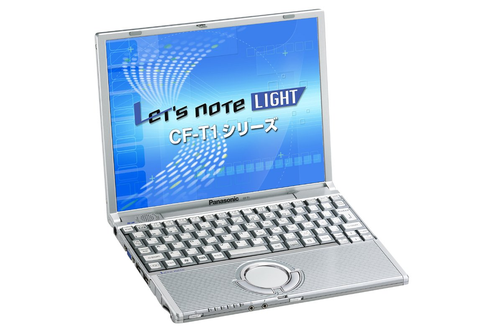

# 松下 Let's note CF-T1 规格参数

[English](../../en/CF-T1/) · [日本語](../../ja/CF-T1/) · **中文**

**CF-T1** 是松下 Let's note 笔记本电脑，属于 T1 系列，配备 12.1英寸 XGA 屏幕。本页收录其全部 6 个型号（2002-11 – 2003-02 发售）的规格参数。每个型号均附官方规格表链接。

*松下 Let's note CF-T1（CF-T1PCAXR, CF-T1PWAXR, CF-T1PDAXR, CF-T1RCAXR …）。图片 © Panasonic*

## 型号列表

| 型号（品番） | 发售 | 停产 | 主要规格 |
| :-- | :-- | :-- | :-- |
| [CF-T1PCAXR](https://panasonic.jp/pc/p-db/CF-T1PCAXR_spec.html) | 2003-02 | 2003-02 | Windows® XP Professional、PentiumIII-M(933MHz・ULV）、メモリー：256MB（最大512MB）、HDD：40GB、LAN、USB2.0 |
| [CF-T1PWAXR](https://panasonic.jp/pc/p-db/CF-T1PWAXR_spec.html) | 2003-02 | 2003-02 | Windows® XP Professional、PentiumIII-M(933MHz・ULV）、メモリー：256MB（最大512MB）、HDD：40GB、LAN、無線LAN (802.11b)、USB2.0 |
| [CF-T1PDAXR](https://panasonic.jp/pc/p-db/CF-T1PDAXR_spec.html) | 2003-02 | 2003-02 | Windows® XP Professional、PentiumIII-M(933MHz・ULV）、メモリー：128MB（最大384MB）、HDD：20GB、LAN、USB2.0、＜999gモデル＞ |
| [CF-T1RCAXR](https://panasonic.jp/pc/p-db/CF-T1RCAXR_spec.html) | 2002-11 | 2003-03 | Windows® XP Professional、PentiumIII-M(866MHz・ULV）、メモリー：256MB（最大512MB）、HDD：40GB、LAN、USB2.0 |
| [CF-T1RWAXR](https://panasonic.jp/pc/p-db/CF-T1RWAXR_spec.html) | 2002-11 | 2003-03 | Windows® XP Professional、PentiumIII-M(866MHz・ULV）、メモリー：256MB（最大512MB）、HDD：40GB、LAN、無線LAN (802.11b)、USB2.0 |
| [CF-T1RDAXR](https://panasonic.jp/pc/p-db/CF-T1RDAXR_spec.html) | 2002-11 | 2003-03 | Windows® XP Professional、PentiumIII-M(866MHz・ULV）、メモリー：128MB（最大384MB）、HDD：20GB、LAN、USB2.0、＜999gモデル＞ |

## 通用规格

| 项目 | 规格 |
| :-- | :-- |
| 芯片组 | Intel(R) 830 MG Chipset |
| 二级缓存 | 512 KB |
| 显示屏 | XGA(1024×768ドット)12.1型TFTカラー液晶 |
| 显示屏 / 色彩 | 1024×768ドット：約1600万色 |
| 调制解调器 | データ：56 kbps(V.90 / k56flex自動対応) / FAX：14.4 kbps/ボイス非対応 |
| 有线网络 | 100BASE-TX / 10BASE-T |
| 音频 | PCM音源(16ビットステレオ)、モノラルスピーカー |
| 卡槽 / PC 卡 | PCカード(TYPE II)×1スロット CardBus対応 |
| 卡槽 / SD 卡 | SDメモリーカード/マルチメディアカード×1スロット |
| 内存扩展槽 | 144ピンマイクロDIMM専用スロット×1(256 MB PC133) |
| 接口 / 音频 | マイク入力(モノラルミニジャック)、オーディオ出力(ステレオミニジャック) |
| 接口 / USB | USBコネクター×2（USB2.0） |
| 接口 / 外接显示 | アナログRGBミニDsub15ピン |
| 接口 / 其他 | モデムコネクター、LANコネクター（RJ-45） |
| 键盘 | OADG準拠キーボード(87キー)：キーピッチ19mm |
| 指点设备 | ホイールパッド |
| 电源 | AC100 V～240 V（50 Hz/60 Hz）（AC コードは100 V専用）、標準バッテリーパック（7.4 Vリチウムイオン・4.4 Ah） |
| 功耗 | 最大約40 W |
| 尺寸（宽×深×高） | 幅268 mm×奥行210 mm×高さ26.1 mm／39.1 mm（前部／後部）突起部除く |

## 各型号差异

| 型号（品番） | 处理器 | 内存 | 存储 | 重量 | 续航 |
| :-- | :-- | :-- | :-- | :-- | :-- |
| CF-T1PCAXR | 超低電圧版Pentium III 933 MHz -M | 256 MB SDRAM | 40 GB | 1.045 kg | 5 h |
| CF-T1PWAXR | 超低電圧版Pentium III 933 MHz -M | 256 MB SDRAM | 40 GB | 1.07 kg | 4 h |
| CF-T1PDAXR | 超低電圧版Pentium III 933 MHz -M | 128 MB SDRAM | 20 GB | 1.045 kg | 5 h |
| CF-T1RCAXR | 超低電圧版Pentium III 866 MHz -M | 256 MB SDRAM | 40 GB | 1.045 kg | 5 h |
| CF-T1RWAXR | 超低電圧版Pentium III 866 MHz -M | 256 MB SDRAM | 40 GB | 1.07 kg | 4 h |
| CF-T1RDAXR | 超低電圧版Pentium III 866 MHz -M | 128 MB SDRAM | 20 GB | 0.999 kg | 5 h |

CF-T1PCAXR 的全部差异规格

| 项目 | 规格 |
| :-- | :-- |
| 处理器 | 超低電圧版モバイル インテル(R) Pentium(R) III プロセッサ 933 MHz -M(Intel SpeedStep(R) テクノロジを搭載)(システムバスクロック：133 MHz) |
| 内存 | 標準256 MB SDRAM(最大512 MB) |
| 显存 | 最大48MB（メインメモリーと共用） |
| 硬盘 | 40 GB (Ultra ATA100) うち約3GBはリカバリー用データ領域として使用(ユーザ使用不可) |
| 软驱（选配） | USB接続外付3.5型3モード対応(1.44 MB/1.2 MB/720 KB)（オプション） |
| 显示屏 / 外接显示输出 | 800×600ドット、1024×768ドット、1280×1024ドット ：約1600万色 |
| 显示屏 / 同时显示 | 800×600ドット、1024×768ドット、1280×1024ドット ：約1600万色 |
| 能效 | S区分 0.00033 |
| 电池 | 駆動時間 約5時間 / 充電時間 約3時間(電源OFF時)、約3時間(電源ON時) |
| 重量（含电池） | 約1045 g |
| 预装软件 | Microsoft(R)Windows(R) XP Professional with Service Pack1、Microsoft(R)Internet Explorer6、Adobe(R) Acrobat(R) Reader、CN-Stage、Panasonic PC オンラインメンバー登録、DMIビューアー、ネットセレクター、SDユーティリティ、Microsoft(R) Windows(R) MediaTM Player 8、DirectX 8、ホイールパッドユーティリティ、オンラインサインアップ◆(hi-ho、＠nifty、BIGLOBE、DION、OCN、ODN、ドコモAOL)、ハードディスクデータ消去ユーティリティ |
| 注意事项 | 既存のインテル低電圧版に比べて、さらに電圧レベルを低下（バッテリー駆動時0.95V） / ※21 本製品はシステムの再インストールに必要なリカバリーデータをハードディスク中にバックアップしています。そのためプロダクトリカバリーCD-ROMは付属しておりません。 / ＊一般的にWindows XP、DOS/V用等と表記されているソフト及び周辺機器の中には本パソコンで使用できないものがあります。ご購入に関しては、各ソフト及び周辺機器の販売元にご確認ください。 / ◆印のソフトウェアの操作に関するサポートは、各メーカーで行っております。 / PC起動時に外部FDDを使用する際、推奨外部FDD（CF-VFDU03J）をご使用ください。 |

官方规格表: <https://panasonic.jp/pc/p-db/CF-T1PCAXR_spec.html>

CF-T1PWAXR 的全部差异规格

| 项目 | 规格 |
| :-- | :-- |
| 处理器 | 超低電圧版モバイル インテル(R) Pentium(R) III プロセッサ 933 MHz -M (Intel SpeedStep(R) テクノロジを搭載)（システムバスクロック：133 MHz） |
| 内存 | 標準256 MB SDRAM(最大512 MB) |
| 显存 | 最大48MB（メインメモリーと共用） |
| 硬盘 | 40 GB (Ultra ATA100)うち約3GBはリカバリー用データ領域として使用（ユーザ使用不可） |
| 软驱（选配） | USB接続外付3.5型3モード対応(1.44 MB/1.2 MB/720 KB) （オプション） |
| 显示屏 / 外接显示输出 | 800×600ドット、1024×768ドット、1280×1024ドット：約1600万色 |
| 显示屏 / 同时显示 | 800×600ドット、1024×768ドット、1280×1024ドット：約1600万色 |
| 能效 | S区分 0.00033 |
| 电池 | 駆動時間約4時間30分 / 充電時間約3時間(電源OFF時)、約3時間(電源ON時) |
| 重量（含电池） | 約1070 g |
| 预装软件 | Microsoft(R)Windows(R) XP Professional with Service Pack1、Microsoft(R)Internet Explorer6、Adobe(R) Acrobat(R) Reader、CN-Stage、Panasonic PC オンラインメンバー登録、DMIビューアー、ネットセレクター、SDユーティリティ、Microsoft(R) Windows(R) MediaTM Player 8、DirectX 8、ホイールパッドユーティリティ、オンラインサインアップ◆(hi-ho、＠nifty、BIGLOBE、DION、OCN、ODN、ドコモAOL)、ハードディスクデータ消去ユーティリティ |
| 注意事项 | 既存のインテル低電圧版に比べて、さらに電圧レベルを低下（バッテリー駆動時0.95V） / ※21 本製品はシステムの再インストールに必要なリカバリーデータをハードディスク中にバックアップしています。そのためプロダクトリカバリーCD-ROMは付属しておりません。 / ＊一般的にWindows XP、DOS/V用等と表記されているソフト及び周辺機器の中には本パソコンで使用できないものがあります。ご購入に関しては、各ソフト及び周辺機器の販売元にご確認ください。 / ◆印のソフトウェアの操作に関するサポートは、各メーカーで行っております。 / PC起動時に外部FDDを使用する際、推奨外部FDD（CF-VFDU03J）をご使用ください。 |
| 无线网络 | 内蔵 |

官方规格表: <https://panasonic.jp/pc/p-db/CF-T1PWAXR_spec.html>

CF-T1PDAXR 的全部差异规格

| 项目 | 规格 |
| :-- | :-- |
| 处理器 | 超低電圧版モバイル インテル(R) Pentium(R) III プロセッサ 933 MHz -M (Intel SpeedStep(R) テクノロジを搭載)(システムバスクロック：133 MHzc |
| 内存 | 標準128 MB SDRAM(最大384 MB) |
| 显存 | 最大32MB（メインメモリーと共用） |
| 硬盘 | 20 GB (Ultra ATA100) うち約3GBはリカバリー用データ領域として使用（ユーザ使用不可） |
| 软驱（选配） | USB接続外付3.5型3モード対応(1.44 MB/1.2 MB/720 KB)（オプション） |
| 显示屏 / 外接显示输出 | 800×600ドット、1024×768ドット、1280×1024ドット ：約1600万色 |
| 显示屏 / 同时显示 | 800×600ドット、1024×768ドット、1280×1024ドット ：約1600万色 |
| 能效 | S区分 0.00033 |
| 电池 | 駆動時間 約5時間 / 充電時間 約3時間(電源OFF時)、約3時間(電源ON時) |
| 重量（含电池） | 約1045 g |
| 预装软件 | Microsoft(R)Windows(R) XP Professional with Service Pack1、Microsoft(R)Internet Explorer6、Adobe(R) Acrobat(R) Reader、CN-Stage、Panasonic PC オンラインメンバー登録、DMIビューアー、ネットセレクター、SDユーティリティ、Microsoft(R) Windows(R) MediaTM Player 8、DirectX 8、ホイールパッドユーティリティ、オンラインサインアップ◆(hi-ho、＠nifty、BIGLOBE、DION、OCN、ODN、ドコモAOL)、ハードディスクデータ消去ユーティリティ |
| 注意事项 | 既存のインテル低電圧版に比べて、さらに電圧レベルを低下（バッテリー駆動時0.95V） / ※21 本製品はシステムの再インストールに必要なリカバリーデータをハードディスク中にバックアップしています。そのためプロダクトリカバリーCD-ROMは付属しておりません。 / ＊一般的にWindows XP、DOS/V用等と表記されているソフト及び周辺機器の中には本パソコンで使用できないものがあります。ご購入に関しては、各ソフト及び周辺機器の販売元にご確認ください。 / ◆印のソフトウェアの操作に関するサポートは、各メーカーで行っております。 / PC起動時に外部FDDを使用する際、推奨外部FDD（CF-VFDU03J）をご使用ください。 |

官方规格表: <https://panasonic.jp/pc/p-db/CF-T1PDAXR_spec.html>

CF-T1RCAXR 的全部差异规格

| 项目 | 规格 |
| :-- | :-- |
| 处理器 | 超低電圧版モバイル インテル(R) Pentium(R) III プロセッサ 866 MHz -M (Intel SpeedStep(R) テクノロジを搭載)（システムバスクロック：133 MHz） |
| 内存 | 標準256 MB SDRAM(最大512 MB) |
| 显存 | 最大48MB（メインメモリーを共用） |
| 硬盘 | 40 GB (Ultra ATA100) うち約3GBはリカバリー用データ領域として使用（ユーザ使用不可） |
| 软驱（选配） | USB接続外付3.5型3モード対応(1.44 MB/1.2 MB/720 KB)（オプション） |
| 显示屏 / 外接显示输出 | 800×600ドット、1024×768ドット、1280×1024ドット ：約1600万色 |
| 显示屏 / 同时显示 | 800×600ドット、1024×768ドット、1280×1024ドット ：約1600万色 |
| 能效 | S区分 0.00036 |
| 电池 | 駆動時間 約5時間 / 充電時間 約3時間(電源OFF時)、約3時間(電源ON時) |
| 重量（含电池） | 約1045 g |
| 预装软件 | Microsoft(R)Windows(R) XP Professional with Service Pack1、Microsoft(R)Internet Explorer6、Adobe(R) Acrobat(R) Reader、CN-Stage、Panasonic PC オンラインメンバー登録、DMIビューアー、ネットセレクター、SDユーティリティ、Microsoft(R) Windows(R) MediaTM Player 8、DirectX 8、ホイールパッドユーティリティ、オンラインサインアップ◆（hi-ho、＠nifty、BIGLOBE、DION、OCN、ODN、ドコモAOL） |
| 注意事项 | 既存のインテル低電圧版に比べて、さらに電圧レベルを低下（バッテリー駆動時0.95V） / ※20 本製品はシステムの再インストールに必要なリカバリーデータをハードディスク中にバックアップしています。そのためプロダクトリカバリーCD-ROMは付属しておりません。 / ＊一般的にWindows XP、DOS/V用等と表記されているソフト及び周辺機器の中には本パソコンで使用できないものがあります。ご購入に関しては、各ソフト及び周辺機器の販売元にご確認ください。 / ◆印のソフトウェアの操作に関するサポートは、各メーカーで行っております。 / PC起動時に外部FDDを使用する際、推奨外部FDD（CF-VFDU03J）をご使用ください。 |

官方规格表: <https://panasonic.jp/pc/p-db/CF-T1RCAXR_spec.html>

CF-T1RWAXR 的全部差异规格

| 项目 | 规格 |
| :-- | :-- |
| 处理器 | 超低電圧版モバイル インテル(R) Pentium(R) III プロセッサ 866 MHz -M (Intel SpeedStep(R) テクノロジを搭載)（システムバスクロック：133 MHz） |
| 内存 | 標準256 MB SDRAM(最大512 MB) |
| 显存 | 最大48MB（メインメモリーを共用） |
| 硬盘 | 40 GB (Ultra ATA100) うち約3GBはリカバリー用データ領域として使用（ユーザ使用不可） |
| 软驱（选配） | USB接続外付3.5型3モード対応(1.44 MB/1.2 MB/720 KB) （オプション） |
| 显示屏 / 外接显示输出 | 800×600ドット、1024×768ドット、1280×1024ドット ：約1600万色 |
| 显示屏 / 同时显示 | 800×600ドット、1024×768ドット、1280×1024ドット ：約1600万色 |
| 能效 | S区分 0.00036 |
| 电池 | 駆動時間 約4時間30分 / 充電時間 約3時間(電源OFF時)、約3時間(電源ON時) |
| 重量（含电池） | 約1070 g |
| 预装软件 | Microsoft(R)Windows(R) XP Professional with Service Pack1、Microsoft(R)Internet Explorer6、Adobe(R) Acrobat(R) Reader、CN-Stage、Panasonic PC オンラインメンバー登録、DMIビューアー、ネットセレクター、SDユーティリティ、Microsoft(R) Windows(R) MediaTM Player 8、DirectX 8、ホイールパッドユーティリティ、オンラインサインアップ◆（hi-ho、＠nifty、BIGLOBE、DION、OCN、ODN、ドコモAOL） |
| 注意事项 | 既存のインテル低電圧版に比べて、さらに電圧レベルを低下（バッテリー駆動時0.95V） / ※20 本製品はシステムの再インストールに必要なリカバリーデータをハードディスク中にバックアップしています。そのためプロダクトリカバリーCD-ROMは付属しておりません。 / ＊一般的にWindows XP、DOS/V用等と表記されているソフト及び周辺機器の中には本パソコンで使用できないものがあります。ご購入に関しては、各ソフト及び周辺機器の販売元にご確認ください。 / ◆印のソフトウェアの操作に関するサポートは、各メーカーで行っております。 / PC起動時に外部FDDを使用する際、推奨外部FDD（CF-VFDU03J）をご使用ください。 |
| 无线网络 | 内蔵 |

官方规格表: <https://panasonic.jp/pc/p-db/CF-T1RWAXR_spec.html>

CF-T1RDAXR 的全部差异规格

| 项目 | 规格 |
| :-- | :-- |
| 处理器 | 超低電圧版モバイル インテル(R) Pentium(R) III プロセッサ 866 MHz -M (Intel SpeedStep(R) テクノロジを搭載)（システムバスクロック：133 MHz） |
| 内存 | 標準128 MB SDRAM(最大384 MB) |
| 显存 | 最大32MB（メインメモリーを共用） |
| 硬盘 | 20 GB (Ultra ATA100) うち約3GBはリカバリー用データ領域として使用（ユーザ使用不可）（オプション） |
| 软驱（选配） | USB接続外付3.5型3モード対応(1.44 MB/1.2 MB/720 KB) |
| 显示屏 / 外接显示输出 | 800×600ドット、1024×768ドット、1280×1024ドット ：約1600万色 |
| 显示屏 / 同时显示 | 800×600ドット、1024×768ドット、1280×1024ドット ：約1600万色 |
| 能效 | S区分 0.00036 |
| 电池 | 駆動時間 約5時間 / 充電時間 約3時間(電源OFF時)、約3時間(電源ON時) |
| 重量（含电池） | 約999 g |
| 预装软件 | Microsoft(R)Windows(R) XP Professional with Service Pack1、Microsoft(R)Internet Explorer6、Adobe(R) Acrobat(R) Reader、CN-Stage、Panasonic PC オンラインメンバー登録、DMIビューアー、ネットセレクター、SDユーティリティ、Microsoft(R) Windows(R) MediaTM Player 8、DirectX 8、ホイールパッドユーティリティ、オンラインサインアップ◆（hi-ho、＠nifty、BIGLOBE、DION、OCN、ODN、ドコモAOL） |
| 注意事项 | 既存のインテル低電圧版に比べて、さらに電圧レベルを低下（バッテリー駆動時0.95V） / ※20 本製品はシステムの再インストールに必要なリカバリーデータをハードディスク中にバックアップしています。そのためプロダクトリカバリーCD-ROMは付属しておりません。 / ＊一般的にWindows XP、DOS/V用等と表記されているソフト及び周辺機器の中には本パソコンで使用できないものがあります。ご購入に関しては、各ソフト及び周辺機器の販売元にご確認ください。 / ◆印のソフトウェアの操作に関するサポートは、各メーカーで行っております。 / PC起動時に外部FDDを使用する際、推奨外部FDD（CF-VFDU03J）をご使用ください。 |

官方规格表: <https://panasonic.jp/pc/p-db/CF-T1RDAXR_spec.html>

## 相关机型

- [Let's note 全部机型](../)

---

来源：松下官方[停产产品列表](https://panasonic.jp/pc/support/products/)及各型号规格表（panasonic.jp）。规格数值保留官方日文原文。产品图片 © Panasonic。本页为非官方整理，与松下公司无关。
