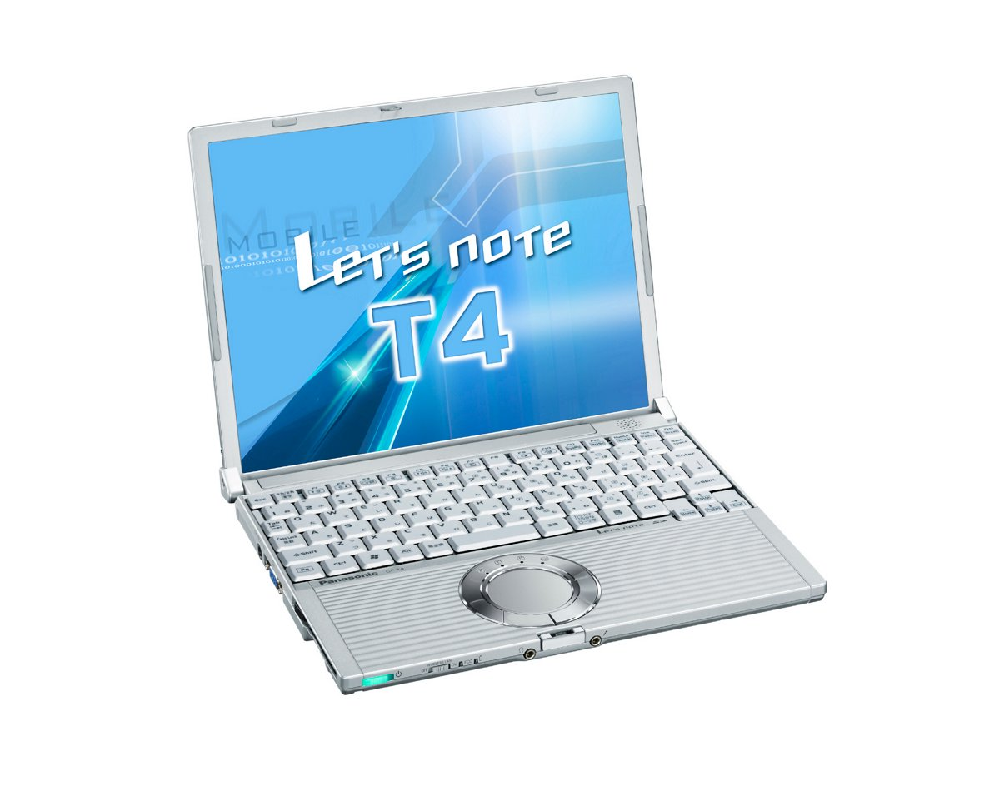

# 松下 Let's note CF-T4 规格参数

[English](../../en/CF-T4/) · [日本語](../../ja/CF-T4/) · **中文**

**CF-T4** 是松下 Let's note 笔记本电脑，属于 T4 系列，配备 12.1英寸 XGA 屏幕。本页收录其全部 3 个型号（2005-05 – 2006-02 发售）的规格参数。每个型号均附官方规格表链接。

*松下 Let's note CF-T4（CF-T4HW4AXR, CF-T4GW5AXR）。图片 © Panasonic*

## 型号列表

| 型号（品番） | 发售 | 停产 | 主要规格 |
| :-- | :-- | :-- | :-- |
| [CF-T4JWSAXR](https://panasonic.jp/pc/p-db/CF-T4JWSAXR_spec.html) | 2006-02 | 2006-04 | Windows® XP Professional、Pentium M 753(1.2GHz・ULV)、内存：512MB（最大1024MB)、HDD：60GB、LAN、无线LAN 802.11a(J52/W52/W53)/b/g、USB2.0 |
| [CF-T4HW4AXR](https://panasonic.jp/pc/p-db/CF-T4HW4AXR_spec.html) | 2005-10 | 2005-12 | Windows® XP Professional、PentiumM 753(1.2GHz・ULV)、内存：512MB（最大1024MB）、HDD：60GB、LAN、无线LAN (802.11a/b/g)、USB2.0 |
| [CF-T4GW5AXR](https://panasonic.jp/pc/p-db/CF-T4GW5AXR_spec.html) | 2005-05 | 2005-06 | Windows® XP Professional、PentiumM 753(1.2GHz・ULV)、内存：512MB（最大1024MB）、HDD：40GB、LAN、无线LAN (802.11a/b/g)、USB2.0 |

## 通用规格

| 项目 | 规格 |
| :-- | :-- |
| 操作系统 | Microsoft(R) Windows(R) XP Professional Service Pack 2 搭载安全强化功能(NTFS文件系统) |
| 芯片组 | 英特尔(R) 915GMS Express 芯片组 |
| 内存 | 标配512 M字节 / 最大1024 M字节 (PC2-3200 / DDR2 SDRAM) |
| 显存 | 最大128 M字节（与主内存共用） |
| 软驱（选配） | USB连接外置3.5英寸3模式支持(1.44 MB/1.2 MB/720 KB)（选配） |
| 显示屏 | XGA (1024×768像素) 12.1英寸TFT彩色液晶 |
| 显示屏 / 色彩 | 1024×768像素：约1677万色 |
| 显示屏 / 外接显示输出 | 800×600像素、1024×768像素、1280×768像素、1280×1024像素、1600×1200像素、2048×1536像素：约1677万色 |
| 显示屏 / 同时显示 | 800×600、1024×768像素：约1677万色 |
| 调制解调器 | 数据：56 kbps( V.90 ) / FAX：14.4 kbps/不支持语音 |
| 有线网络 | 100BASE-TX / 10BASE-T |
| 音频 | PCM音源(16位立体声)、单声道扬声器 |
| 安全芯片 | TPM(符合TCG V1.1b) |
| 卡槽 / PC 卡 | PC卡(TYPE II)×1插槽 CardBus对应 / 允许电流（3.3 V：400 mA、5V：400 mA） |
| 卡槽 / SD 卡 | SD 存储卡 ×1插槽（支持版权保护技术） |
| 内存扩展槽 | DDR2 172针 微型DIMM专用插槽×1（1.8V/PC2-3200/DDR2 SDRAM） |
| 接口 / 音频 | 麦克风输入（单声道迷你插孔）、音频输出（立体声迷你插孔） |
| 接口 / USB | USB接口×2（ USB2.0×2 ） |
| 接口 / 外接显示 | 模拟RGB迷你Dsub 15针 |
| 接口 / 其他 | 调制解调器接口（RJ-11）、LAN 接口（RJ-45） |
| 键盘 | 符合OADG标准的键盘(85键)：键距19mm（横向）×16mm（纵向）（部分按键除外） |
| 指点设备 | 滚轮触控板 |
| 功耗 | 最大约40 W |
| 能效 | S区分 0.00023 / 基于(社)电子信息技术产业协会 信息处理设备 高次谐波电流抑制对策实施计划书的额定输入功率值：24 W |
| 能效达成率 | — |
| 尺寸（不含凸起部分） | 宽268 mm×深210.4 mm×高24.9 mm／44.3 mm（前部／后部）不含突起部 |

## 各型号差异

| 型号（品番） | 处理器 | 内存 | 存储 | 重量 | 续航 |
| :-- | :-- | :-- | :-- | :-- | :-- |
| CF-T4JWSAXR | Pentium M 超低电压版 753 | 512 MB | 60 GB | 1.26 kg | 12 h |
| CF-T4HW4AXR | Pentium M 超低电压版 753 | 512 MB | 60 GB | 1.26 kg | 12 h |
| CF-T4GW5AXR | Pentium M 超低电压版 753 | 512 MB | 40 GB | 1.26 kg | 12 h |

CF-T4JWSAXR 的全部差异规格

| 项目 | 规格 |
| :-- | :-- |
| 处理器 | 英特尔(R) Centrino(R) 移动技术 / 英特尔(R) Pentium(R) M 处理器超低电压版 753 （二级缓存内存 2 M字节、 工作频率 1.20 GHz、前端总线 400 MHz) |
| 硬盘 | 60 GB (Ultra ATA100)其中约3 GB用作恢复用数据区域（用户不可使用） |
| 无线网络 | 英特尔(R) PRO / Wireless 2915ABG，符合 IEEE802.11a（J52/W52/W53）/b/g，（支持 WPA-AES/TKIP，符合 Wi-Fi） |
| 电源 | AC100 V-240 V（50 Hz/60 Hz）（电源线仅适用于100 V）、 / 标准电池：11.1V锂离子・7.65Ah / 轻量电池：7.4V锂离子・5.1Ah |
| 电池 | 驱动时间 / 标准电池：约12小时（经济模式(ECO）无效时）/ 轻量电池：约5小时（经济模式(ECO）无效时）/ 充电时间 / 标准电池：约5小时(电源关闭时)、约7小时(电源开启时) / 轻量电池：约4小时(电源关闭时/电源开启时) |
| 重量（含电池） | 标准电池：约1260 g（含电池） / 轻量电池：约1040 g（含电池） |
| 预装软件 | Microsoft(R) Internet Explorer 6 Service Pack 2、Adobe(R) Reader、DMI 查看器、Microsoft(R) Windows(R) MediaTM Player 10、DirectX 9.0c、Microsoft(R) Windows(R) Movie Maker 2.1、Microsoft(R).NET Framework 1.1、网络选择器、SD 实用程序、滚轮触摸板实用程序、Hotkey 设置、goo Stick、设置实用程序、在线注册（hi-ho、DION）、字体大小放大实用程序、缩放查看器、PC 信息查看器、NumLock 通知、硬盘数据擦除实用程序、Wireless Manager mobile edition2.0、PC-Diagnostic 实用程序、McAfee(R) VirusScan◆、无线 LAN 切换实用程序、经济模式（ECO）切换实用程序、省电设置实用程序、电池剩余电量显示校正实用程序、Infineon TPM Professional Package V1.7 SP4 / ※ 未安装文字处理、电子表格等应用软件。 |

官方规格表: <https://panasonic.jp/pc/p-db/CF-T4JWSAXR_spec.html>

CF-T4HW4AXR 的全部差异规格

| 项目 | 规格 |
| :-- | :-- |
| 处理器 | 英特尔(R) CentrinoTM 移动技术 / 英特尔(R) Pentium(R) M 处理器超低电压版 753 （二级缓存内存 2 M字节、 工作频率 1.20 GHz、前端总线 400 MHz) |
| 硬盘 | 60 GB (Ultra ATA100)其中约3 GB用作恢复用数据区域（用户不可使用） |
| 无线网络 | 英特尔(R) PRO / Wireless 2915ABG，符合 IEEE802.11a（J52/W52/W53）/b/g，（支持 WPA-AES/TKIP，符合 Wi-Fi） |
| 电源 | AC100 V-240 V（50 Hz/60 Hz）（电源线仅适用于100 V）、标准电池组（11.1 V锂离子・7.65 Ah） |
| 电池 | 驱动时间 约12小时 （经济模式(ECO）无效时）/ 充电时间约5小时(电源关闭时)、约7小时(电源开启时) |
| 重量（含电池） | 约1260 g（含标准电池） |
| 预装软件 | Microsoft(R) Internet Explorer 6 Service Pack 2、Adobe(R) Reader、DMI 查看器、Microsoft(R) Windows(R) MediaTM Player 10、DirectX 9.0c、Microsoft(R) Windows(R) Movie Maker 2.1、Microsoft(R).NET Framework 1.1、网络选择器、SD 实用程序、滚轮触摸板实用程序、Hotkey 设置、goo Stick、设置实用程序、在线注册（hi-ho、DION）、字体大小放大实用程序、缩放查看器、PC 信息查看器、NumLock 通知、硬盘数据擦除实用程序、Wireless Manager mobile edition2.0、PC-Diagnostic 实用程序、McAfee(R) VirusScan◆、无线 LAN 切换实用程序、经济模式（ECO）切换实用程序、省电设置实用程序、电池剩余电量显示校正实用程序、Infineon TPM Professional Package V1.7 SP4 / ※ 未安装文字处理、电子表格等应用软件。 |

官方规格表: <https://panasonic.jp/pc/p-db/CF-T4HW4AXR_spec.html>

CF-T4GW5AXR 的全部差异规格

| 项目 | 规格 |
| :-- | :-- |
| 处理器 | 英特尔(R) CentrinoTM 移动技术 / 英特尔(R) Pentium(R) M 处理器超低电压版 753 （二级缓存内存 2 M字节、 工作频率 1.20 GHz、前端总线 400 MHz) |
| 硬盘 | 40 GB (Ultra ATA100)其中约3 GB用作恢复用数据区域（用户不可使用） |
| 无线网络 | 英特尔(R) PRO / Wireless 2915ABG、 符合IEEE802.11a/b/ｇ、（支持WPA-AES/TKIP、符合Wi-Fi） |
| 电源 | AC100 V-240 V（50 Hz/60 Hz）（电源线仅适用于100 V）、标准电池组（11.1 V锂离子・7.65 Ah） |
| 电池 | 驱动时间 约12小时 （经济模式(ECO）无效时）/ 充电时间约5小时(电源关闭时)、约7小时(电源开启时) |
| 重量（含电池） | 约1260 g（含标准电池） |
| 预装软件 | Microsoft(R) Internet Explorer 6 Service Pack 2、Adobe(R) Reader、DMI 查看器、Microsoft(R) Windows(R) MediaTM Player 10、DirectX 9.0c、Microsoft(R) Windows(R) Movie Maker 2.1、Microsoft(R).NET Framework 1.1、网络选择器、SD 实用程序、滚轮触摸板实用程序、Hotkey 设置、goo Stick、设置实用程序、各提供商在线注册（hi-ho、DION、OCN）、字体大小放大实用程序、缩放查看器、PC 信息查看器、NumLock 通知、硬盘数据擦除实用程序、Wireless Manager mobile edition2.0、McAfee(R) VirusScan◆、无线 LAN 切换实用程序、经济模式（ECO）切换实用程序、电池剩余电量显示校正实用程序、Infinion TPM Professional Package V1.7 SP3 / ※ 未安装文字处理、电子表格等应用软件。 |

官方规格表: <https://panasonic.jp/pc/p-db/CF-T4GW5AXR_spec.html>

## 图片

*松下 Let's note CF-T4（CF-T4JWSAXR）。图片 © Panasonic*

## 相关机型

- [Let's note 全部机型](../)

---

来源：松下官方[停产产品列表](https://panasonic.jp/pc/support/products/)及各型号规格表（panasonic.jp），由日文翻译，准确措辞以官方规格表为准。产品图片 © Panasonic。本页为非官方整理，与松下公司无关。
