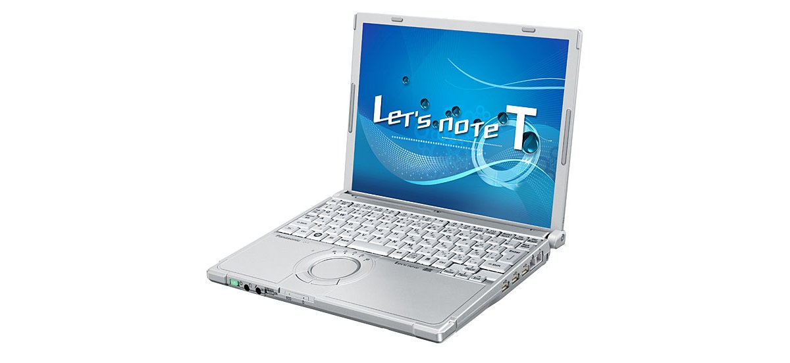
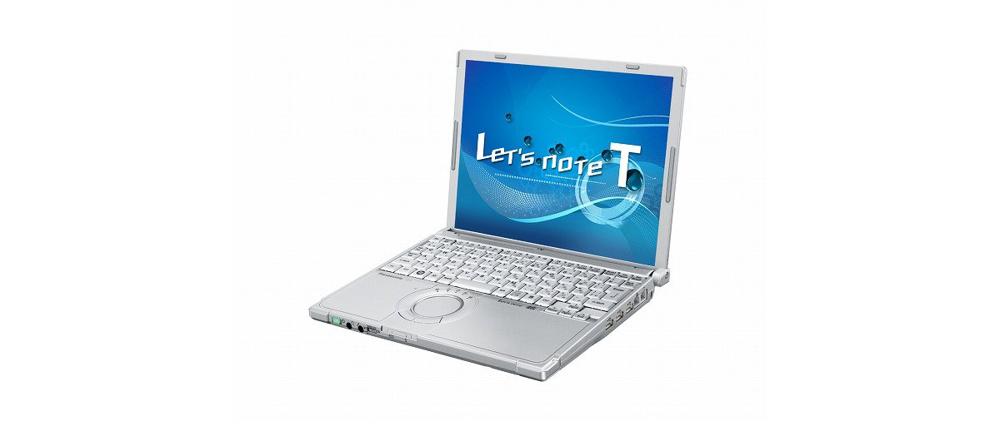
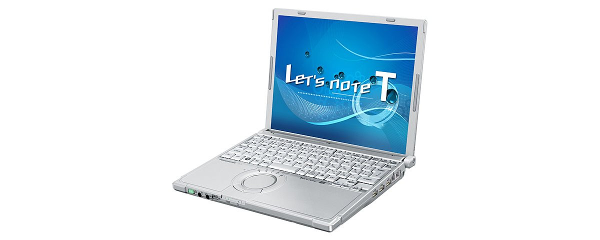

# 松下 Let's note CF-T8 规格参数

[English](../../en/CF-T8/) · [日本語](../../ja/CF-T8/) · **中文**

**CF-T8** 是松下 Let's note 笔记本电脑，属于 T8 系列，配备 12.1英寸 XGA 屏幕。本页收录其全部 5 个型号（2008-10 – 2009-05 发售）的规格参数。每个型号均附官方规格表链接。

*松下 Let's note CF-T8（CF-T8FW1AJR, CF-T8FW1NJR）。图片 © Panasonic*

## 型号列表

| 型号（品番） | 发售 | 停产 | 主要规格 |
| :-- | :-- | :-- | :-- |
| [CF-T8GW1AJR](https://panasonic.jp/pc/p-db/CF-T8GW1AJR_spec.html) | 2009-05 | 2009-09 | Windows Vista® Business with SP1 正規版 、インテル® CoreTM2 Duo SU9400（1.40GHz）、メモリー：標準2GB（最大4GB）、HDD：160GB、LAN、無線LAN 802.11a(W52/W53/W56)/b/g/n |
| [CF-T8FW1AJR](https://panasonic.jp/pc/p-db/CF-T8FW1AJR_spec.html) | 2009-02 | 2009-05 | Windows Vista® Business with SP1 正規版 、インテル® CoreTM2 Duo SU9300（1.20GHz）、メモリー：標準2GB（最大4GB）、HDD：160GB、LAN、無線LAN 802.11a(W52/W53/W56)/b/g/n |
| [CF-T8FW1NJR](https://panasonic.jp/pc/p-db/CF-T8FW1NJR_spec.html) | 2009-02 | 2009-05 | Windows Vista® Business with SP1 正規版 、インテル® CoreTM2 Duo SU9300（1.20GHz）、メモリー：標準2GB（最大4GB）、HDD：160GB、LAN、無線LAN 802.11a(W52/W53/W56)/b/g/n、Office Personal 2007 ＜台数限定＞ |
| [CF-T8EW6AJR](https://panasonic.jp/pc/p-db/CF-T8EW6AJR_spec.html) | 2008-10 | 2009-01 | Windows Vista® Business with SP1 正規版 、インテル® CoreTM2 Duo SU9300（1.20GHz）、メモリー：標準1GB（最大3GB）、HDD：120GB、LAN、無線LAN 802.11a(W52/W53/W56)/b/g/n |
| [CF-T8EW6NJR](https://panasonic.jp/pc/p-db/CF-T8EW6NJR_spec.html) | 2008-10 | 2009-01 | Windows Vista® Business with SP1 正規版 、インテル® CoreTM2 Duo SU9300（1.20GHz）、メモリー：標準1GB（最大3GB）、HDD：120GB、LAN、無線LAN 802.11a(W52/W53/W56)/b/g/n、Office Personal 2007 ＜台数限定＞ |

## 通用规格

| 项目 | 规格 |
| :-- | :-- |
| 操作系统 | Windows Vista（R） Business with Service Pack 1 正規版（Windows（R） XPダウングレード権含む） |
| 芯片组 | モバイル インテル（R） GS45 Express チップセット |
| 软驱（选配） | USB接続外付3.5型3モード対応（1.44MB/1.2MB/720KB） |
| 显示屏 | XGA(1024×768ドット)12.1型TFTカラー液晶 |
| 显示屏 / 色彩 | 1024×768ドット：約1677万色 |
| 显示屏 / 外接显示输出 | 800x600、1024x768、1280x768、1280x1024、1400x1050、1440x900、1680x1050、1600x1200、1920x1080、1920x1200ドット：約1677万色 |
| 显示屏 / 同时显示 | 800×600、1024×768ドット：約1677万色 |
| 调制解调器 | データ：56kbps（V.90） FAX：14.4kbps /ボイス非対応 |
| 有线网络 | 1000BASE-T / 100BASE-TX / 10BASE-T |
| 音频 | PCM音源（24ビットステレオ）、インテル（R） High Definition Audio 準拠、モノラルスピーカー |
| 安全芯片 | TPM（TCG V1.2準拠） |
| 卡槽 / PC 卡 | PCカード（TYPEⅡ）×1スロット(CardBus対応、許容電流3.3V：400mA、5V：400mA) |
| 卡槽 / SD 卡 | SDメモリーカード×1スロット（SDHCメモリーカード/著作権保護機能対応） |
| 接口 | USBポート×3（USB2.0）、モデムコネクター（RJ-11）、LANコネクター（RJ-45）、外部ディスプレイコネクター（アナログVGA ミニDsub 15ピン）、ミニポートリプリケーターコネクター（専用50ピン） |
| 键盘 | OADG準拠キーボード（85キー）：キーピッチ19mm(横)/16mm(縦) / (一部キーを除く) |
| 指点设备 | ホイールパッド |
| 电源 | ACアダプター 入力：AC100V～240V（50Hz/60Hz）（電源コードは100V専用） |
| 功耗 | 最大約60W |
| 能效达成率 | — |
| 电池 | バッテリーパック（10.8Vリチウムイオン・公称容量5.8Ah/定格容量5.4Ah） / 別売軽量バッテリーパック（10.8Vリチウムイオン・公称容量2.9Ah/定格容量2.7Ah） |
| 尺寸（宽×深×高） | 幅272mm×奥行214.3mm×高さ24.9mm/45.3mm（前部/後部） |
| 重量（含电池） | 約1.179kg/約1.06kg(別売軽量バッテリーパック使用時) |
| 附件 | プロダクトリカバリーDVD-ROM 2枚（Windows Vista(R)用 / Windows(R) XP用）、ACアダプター、バッテリーパック、取扱説明書 等 |

## 各型号差异

| 型号（品番） | 处理器 | 内存 | 存储 | 重量 | 续航 |
| :-- | :-- | :-- | :-- | :-- | :-- |
| CF-T8GW1AJR | — | 2GB DDR2 SDRAM | 160GB | 1.179 kg | — |
| CF-T8FW1AJR | — | 2GB DDR2 SDRAM | 160GB | 1.179 kg | — |
| CF-T8FW1NJR | — | 2GB DDR2 SDRAM | 160GB | 1.179 kg | — |
| CF-T8EW6AJR | — | 1GB DDR2 SDRAM | 120GB | 1.179 kg | — |
| CF-T8EW6NJR | — | 1GB DDR2 SDRAM | 120GB | 1.179 kg | — |

CF-T8GW1AJR 的全部差异规格

| 项目 | 规格 |
| :-- | :-- |
| 处理器 | vPro(TM)テクノロジー インテル（R） Centrino（R）2 / インテル（R） Core（TM）2 Duo プロセッサー / 超低電圧版 SU9400 / 2次キャッシュメモリー 3MB、動作周波数 1.40GHz、フロントサイド・バス 800MHz |
| 内存 | 標準2GB DDR2 SDRAM（最大4GB）空きスロット1 |
| 显存 | 最大797MB / 1GB拡張メモリー増設時最大1309MB、2GB拡張メモリー増設時最大1551MB （メインメモリーと共用） |
| 硬盘 | 160GB（Serial ATA）左記容量のうち約8GBは修復用領域（リカバリー用データ領域を含む）として使用（ユーザー使用不可） |
| 无线网络 | インテル（R） Wireless WiFi Link 5100AGN、IEEE802.11a（W52/W53/W56）/b/g準拠、IEEE802.11nドラフト2.0準拠、(WPA-AES/TKIP対応、Wi-Fi準拠) |
| 内存扩展槽 | DDR2 200ピン SO-DIMM専用スロット×1(1.8V/PC2-5300/DDR2 SDRAM) |
| 能效 | 2007年度基準Ｉ区分0.00026 |
| 预装软件 | Microsoft（R） Internet Explorer7.0、Adobe（R） Reader、Microsoft（R） Windows（R） Media Player 11、DirectX 10、Microsoft（R）Windows（R） Movie Maker 6.0、Microsoft（R） .NET Framework3.0、ズームビューアー、PC情報ビューアー、PC情報ポップアップ、NumLockお知らせ、Wireless Manager mobile edition5.0、無線切り替えユーティリティ、セキュリティ設定ユーティリティ、Infineon TPM Professional Package V3.0 SP2HF2、バッテリー残量表示補正ユーティリティ、Hotkey設定、マカフィー・インターネットセキュリティスイートベーシックエディション、緑のgooスティック、ハードディスクデータ消去ユーティリティ、ホイールパッドユーティリティ、ネットセレクター2、USBキーボードヘルパー、USBマウスヘルパー、Fn Ctrl機能入れ換えユーティリティ、Panasonic電源プラン拡張ユーティリティ、ディスプレイヘルパー、Aptioセットアップユーティリティ、PC-Diagnosticユーティリティ |

官方规格表: <https://panasonic.jp/pc/p-db/CF-T8GW1AJR_spec.html>

CF-T8FW1AJR 的全部差异规格

| 项目 | 规格 |
| :-- | :-- |
| 处理器 | インテル（R） Centrino（R） 2 プロセッサー・テクノロジー / インテル（R） Core（TM）2 Duo プロセッサー / 超低電圧版 SU9300 / 2次キャッシュメモリー 3MB、動作周波数 1.20GHz、フロントサイド・バス 800MHz |
| 内存 | 標準2GB DDR2 SDRAM（最大4GB）空きスロット1 |
| 显存 | 最大797MB / 1GB拡張メモリー増設時最大1309MB、2GB拡張メモリー増設時最大1551MB （メインメモリーと共用） |
| 硬盘 | 160GB（Serial ATA）左記容量のうち約8GBは修復用領域（リカバリー用データ領域を含む）として使用（ユーザー使用不可） |
| 无线网络 | インテル（R） Wireless WiFi Link 5100AGN、IEEE802.11a（W52/W53/W56）/b/g準拠、IEEE802.11nドラフト2.0準拠、(WPA-AES/TKIP対応、Wi-Fi準拠) |
| 内存扩展槽 | DDR2 200ピンSO-DIMM専用スロット×1(1.8V/PC2-5300/DDR2 SDRAM) |
| 能效 | 2007年度基準Ｉ区分0.00030 |
| 预装软件 | Microsoft（R） Internet Explorer7.0、Adobe（R） Reader、Microsoft（R） Windows（R） Media Player 11、DirectX 10、Microsoft（R）Windows（R） Movie Maker 6.0、Microsoft（R） .NET Framework3.0、ズームビューアー、PC情報ビューアー、PC情報ポップアップ、NumLockお知らせ、Wireless Manager mobile edition5.0、無線切り替えユーティリティ、セキュリティ設定ユーティリティ、Infineon TPM Professional Package V3.0 SP2HF2、バッテリー残量表示補正ユーティリティ、Hotkey設定、マカフィー・インターネットセキュリティスイートベーシックエディション、緑のgooスティック、ハードディスクデータ消去ユーティリティ、ホイールパッドユーティリティ、ネットセレクター2、USBキーボードヘルパー、USBマウスヘルパー、Fn Ctrl機能入れ換えユーティリティ、Panasonic電源プラン拡張ユーティリティ、ディスプレイヘルパー、Aptioセットアップユーティリティ、PC-Diagnosticユーティリティ |

官方规格表: <https://panasonic.jp/pc/p-db/CF-T8FW1AJR_spec.html>

CF-T8FW1NJR 的全部差异规格

| 项目 | 规格 |
| :-- | :-- |
| 处理器 | インテル（R） Centrino（R） 2 プロセッサー・テクノロジー / インテル（R） Core（TM）2 Duo プロセッサー / 超低電圧版 SU9300 / 2次キャッシュメモリー 3MB、動作周波数 1.20GHz、フロントサイド・バス 800MHz |
| 内存 | 標準2GB DDR2 SDRAM（最大4GB）空きスロット1 |
| 显存 | 最大797MB / 1GB拡張メモリー増設時最大1309MB、2GB拡張メモリー増設時最大1551MB （メインメモリーと共用） |
| 硬盘 | 160GB（Serial ATA）左記容量のうち約8GBは修復用領域（リカバリー用データ領域を含む）として使用（ユーザー使用不可） |
| 无线网络 | インテル（R） WiFi Link 5100AGN、IEEE802.11a（W52/W53/W56）/b/g準拠、IEEE802.11nドラフト2.0準拠、(WPA-AES/TKIP対応、Wi-Fi準拠) |
| 内存扩展槽 | DDR2 200ピンSO-DIMM専用スロット×1(1.8V/PC2-5300/DDR2 SDRAM) |
| 能效 | 2007年度基準Ｉ区分0.00030 |
| 预装软件 | Microsoft（R） Internet Explorer7.0、Adobe（R） Reader、Microsoft（R） Windows（R） Media Player 11、DirectX 10、Microsoft（R）Windows（R） Movie Maker 6.0、Microsoft（R） .NET Framework3.0、ズームビューアー、PC情報ビューアー、PC情報ポップアップ、NumLockお知らせ、Wireless Manager mobile edition5.0、無線切り替えユーティリティ、セキュリティ設定ユーティリティ、Infineon TPM Professional Package V3.0 SP2HF2、バッテリー残量表示補正ユーティリティ、Hotkey設定、マカフィー・インターネットセキュリティスイートベーシックエディション、緑のgooスティック、ハードディスクデータ消去ユーティリティ、ホイールパッドユーティリティ、ネットセレクター2、USBキーボードヘルパー、USBマウスヘルパー、Fn Ctrl機能入れ換えユーティリティ、Panasonic電源プラン拡張ユーティリティ、ディスプレイヘルパー、Aptioセットアップユーティリティ、PC-Diagnosticユーティリティ、Microsoft（R） Office Personal 2007 with PowerPoint 2007 |

官方规格表: <https://panasonic.jp/pc/p-db/CF-T8FW1NJR_spec.html>

CF-T8EW6AJR 的全部差异规格

| 项目 | 规格 |
| :-- | :-- |
| 处理器 | インテル（R） Centrino（R） 2 プロセッサー・テクノロジー / インテル（R） Core（TM）2 Duo プロセッサー / 超低電圧版 SU9300 / 2次キャッシュメモリー 3MB、動作周波数 1.20GHz、フロントサイド・バス 800MHz |
| 内存 | 標準1GB DDR2 SDRAM（最大3GB）空きスロット1 |
| 显存 | 最大285MB / 1GB拡張メモリー増設時最大797MB、2GB拡張メモリー増設時最大1309MB （メインメモリーと共用） |
| 硬盘 | 120GB（Serial ATA）左記容量のうち約6GBは修復用領域（リカバリー用データ領域を含む）として使用（ユーザー使用不可） |
| 无线网络 | インテル（R） Wireless WiFi Link 5100AGN、IEEE802.11a（W52/W53/W56）/b/g準拠、IEEE802.11nドラフト2.0準拠、(WPA-AES/TKIP対応、Wi-Fi準拠) |
| 内存扩展槽 | DDR2 200ピンSO-DIMM専用スロット×1(1.8V/PC2-5300/DDR2 SDRAM) |
| 能效 | 2007年度基準Ｉ区分0.00030 |
| 预装软件 | Microsoft（R） Internet Explorer7.0、Adobe（R） Reader、Microsoft（R） Windows（R） Media Player 11、DirectX 10、Microsoft（R）Windows（R） Movie Maker 6.0、Microsoft（R） .NET Framework3.0、ズームビューアー、PC情報ビューアー、PC情報ポップアップ、NumLockお知らせ、Wireless Manager mobile edition5.0、無線切り替えユーティリティ、セキュリティ設定ユーティリティ、Infineon TPM Professional Package V3.0 SP2HF2、バッテリー残量表示補正ユーティリティ、Hotkey設定、マカフィー・インターネットセキュリティスイートベーシックエディション、gooスティック、ハードディスクデータ消去ユーティリティ、ホイールパッドユーティリティ、ネットセレクター2、USBキーボードヘルパー、USBマウスヘルパー、Fn Ctrl機能入れ換えユーティリティ、Panasonic電源プラン拡張ユーティリティ、ディスプレイヘルパー、Aptioセットアップユーティリティ、PC-Diagnosticユーティリティ |

官方规格表: <https://panasonic.jp/pc/p-db/CF-T8EW6AJR_spec.html>

CF-T8EW6NJR 的全部差异规格

| 项目 | 规格 |
| :-- | :-- |
| 处理器 | インテル（R） Centrino（R） 2 プロセッサー・テクノロジー / インテル（R） Core（TM）2 Duo プロセッサー / 超低電圧版 SU9300 / 2次キャッシュメモリー 3MB、動作周波数 1.20GHz、フロントサイド・バス 800MHz |
| 内存 | 標準1GB DDR2 SDRAM（最大3GB）空きスロット1 |
| 显存 | 最大285MB / 1GB拡張メモリー増設時最大797MB、2GB拡張メモリー増設時最大1309MB （メインメモリーと共用） |
| 硬盘 | 120GB（Serial ATA）左記容量のうち約7GBは修復用領域（リカバリー用データ領域を含む）として使用（ユーザー使用不可） |
| 无线网络 | インテル（R） WiFi Link 5100AGN、IEEE802.11a（W52/W53/W56）/b/g準拠、IEEE802.11nドラフト2.0準拠、(WPA-AES/TKIP対応、Wi-Fi準拠) |
| 内存扩展槽 | DDR2 200ピンSO-DIMM専用スロット×1(1.8V/PC2-5300/DDR2 SDRAM) |
| 能效 | 2007年度基準Ｉ区分0.00030 |
| 预装软件 | Microsoft（R） Internet Explorer7.0、Adobe（R） Reader、Microsoft（R） Windows（R） Media Player 11、DirectX 10、Microsoft（R）Windows（R） Movie Maker 6.0、Microsoft（R） .NET Framework3.0、ズームビューアー、PC情報ビューアー、PC情報ポップアップ、NumLockお知らせ、Wireless Manager mobile edition5.0、無線切り替えユーティリティ、セキュリティ設定ユーティリティ、Infineon TPM Professional Package V3.0 SP2HF2、バッテリー残量表示補正ユーティリティ、Hotkey設定、マカフィー・インターネットセキュリティスイートベーシックエディション、gooスティック、ハードディスクデータ消去ユーティリティ、ホイールパッドユーティリティ、ネットセレクター2、USBキーボードヘルパー、USBマウスヘルパー、Fn Ctrl機能入れ換えユーティリティ、Panasonic電源プラン拡張ユーティリティ、ディスプレイヘルパー、Aptioセットアップユーティリティ、PC-Diagnosticユーティリティ、Microsoft（R） Office Personal 2007 with PowerPoint 2007 |

官方规格表: <https://panasonic.jp/pc/p-db/CF-T8EW6NJR_spec.html>

## 图片

*松下 Let's note CF-T8（CF-T8EW6AJR, CF-T8EW6NJR）。图片 © Panasonic*

*松下 Let's note CF-T8（CF-T8GW1AJR）。图片 © Panasonic*

## 相关机型

- [Let's note 全部机型](../)

---

来源：松下官方[停产产品列表](https://panasonic.jp/pc/support/products/)及各型号规格表（panasonic.jp）。规格数值保留官方日文原文。产品图片 © Panasonic。本页为非官方整理，与松下公司无关。
