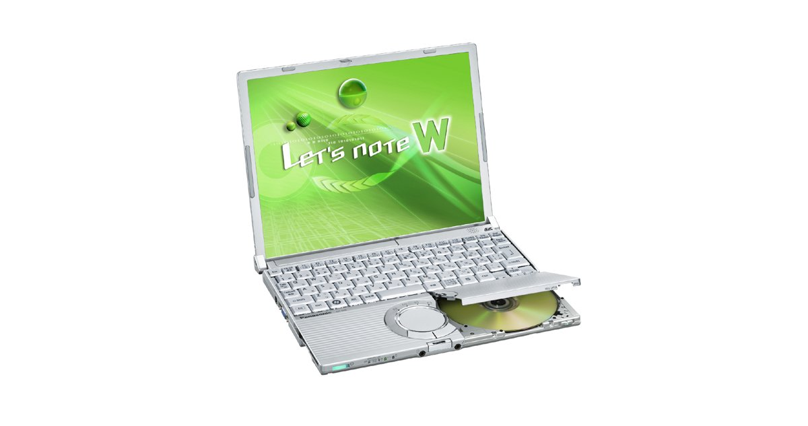
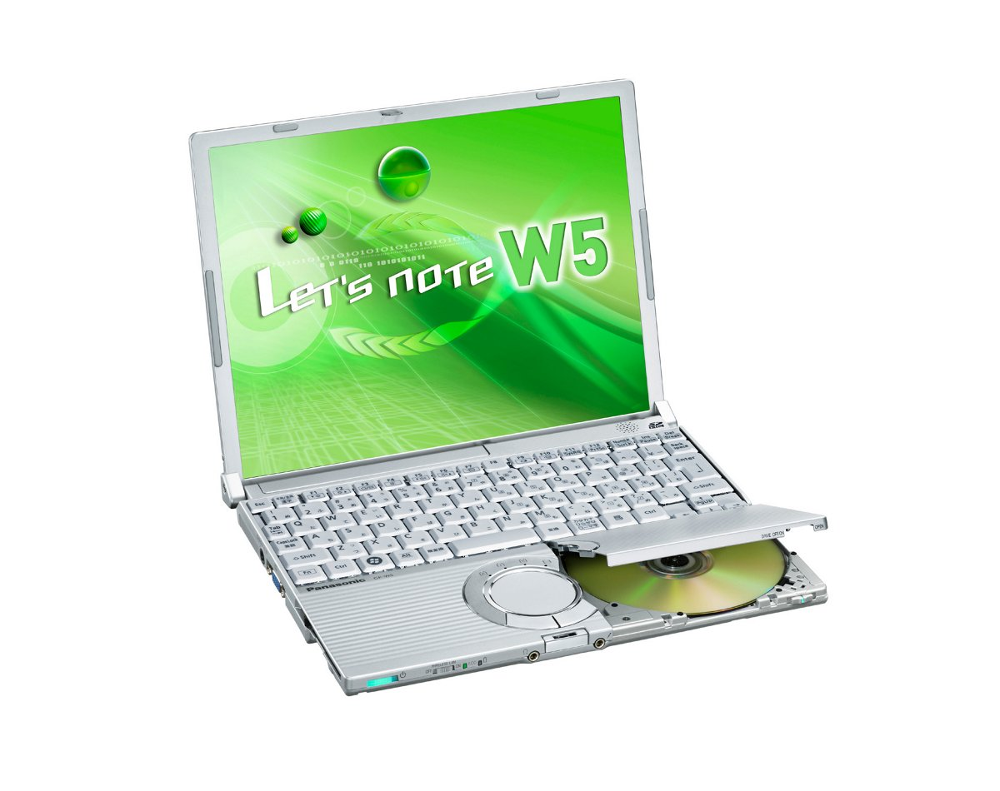
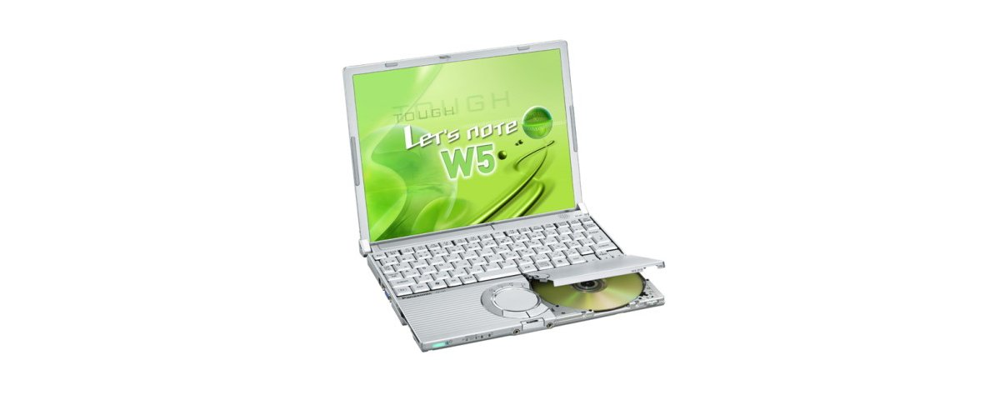
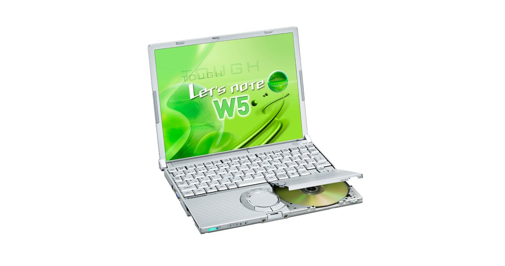

# 松下 Let's note CF-W5 规格参数

[English](../../en/CF-W5/) · [日本語](../../ja/CF-W5/) · **中文**

**CF-W5** 是松下 Let's note 笔记本电脑，属于 W5 系列，配备 12.1英寸 XGA 屏幕。本页收录其全部 8 个型号（2006-05 – 2007-05 发售）的规格参数。每个型号均附官方规格表链接。

*松下 Let's note CF-W5（CF-W5AWDBJR, CF-W5AWDPJR）。图片 © Panasonic*

## 型号列表

| 型号（品番） | 发售 | 停产 | 主要规格 |
| :-- | :-- | :-- | :-- |
| [CF-W5AWDBJR](https://panasonic.jp/pc/p-db/CF-W5AWDBJR_spec.html) | 2007-05 | 2008-03 | Windows Vista® Business 正版 、CoreTM2 Duo U7500(1.06GHz・ULV)、内存：1GB（最大1.5GB)、HDD：80GB、超级多功能驱动器、LAN、无线LAN 802.11a(J52/W52/W53)/b/g、USB2.0 |
| [CF-W5AWDPJR](https://panasonic.jp/pc/p-db/CF-W5AWDPJR_spec.html) | 2007-05 | 2008-03 | Windows Vista® Business正版 、CoreTM2 Duo U7500(1.06GHz・ULV)、内存：1GB（最大1.5GB)、HDD：80GB、超级多功能驱动器、LAN、无线LAN 802.11a(J52/W52/W53)/b/g、USB2.0、Office Personal ＜数量限定＞ |
| [CF-W5MW8AJR](https://panasonic.jp/pc/p-db/CF-W5MW8AJR_spec.html) | 2007-01 | 2008-03 | Windows VistaTM Business 正版 、CoreTM Duo U2400(1.06GHz・ULV)、内存：512MB（最大1.5GB)、HDD：60GB、超级多驱动器、LAN、无线LAN 802.11a(J52/W52/W53)/b/g、USB2.0 |
| [CF-W5MW8HJR](https://panasonic.jp/pc/p-db/CF-W5MW8HJR_spec.html) | 2007-01 | 2008-03 | Windows Vista® Business正版 、CoreTM Duo U2400(1.06GHz・ULV)、内存：512MB（最大1.5GB)、HDD：60GB、超级多功能驱动器、LAN、无线LAN 802.11a(J52/W52/W53)/b/g、USB2.0、Office Personal ＜数量限定＞ |
| [CF-W5LW8AXR](https://panasonic.jp/pc/p-db/CF-W5LW8AXR_spec.html) | 2006-10 | 2006-10 | Windows® XP Professional 正版、CoreTM Solo U1400(1.20GHz・ULV)、内存：512MB（最大1.5GB)、HDD：60GB、Super Multi Drive、LAN、无线LAN 802.11a(J52/W52/W53)/b/g、USB2.0 |
| [CF-W5LW8HXR](https://panasonic.jp/pc/p-db/CF-W5LW8HXR_spec.html) | 2006-10 | 2006-10 | Windows® XP Professional正版、CoreTM Solo U1400（1.20GHz・ULV）、内存：512MB（最大1.5GB）、HDD：60GB、超级多功能驱动器、LAN、无线LAN 802.11a(J52/W52/W53)/b/g、USB2.0、Office Personal＜数量限定＞ |
| [CF-W5KW8AXR](https://panasonic.jp/pc/p-db/CF-W5KW8AXR_spec.html) | 2006-05 | 2006-08 | Windows® XP Professional正版、CoreTM Solo U1300（1.06GHz・ULV）、内存：512MB（最大1024MB）、HDD：60GB、超级多功能驱动器、LAN、无线LAN 802.11a(J52/W52/W53)/b/g、USB2.0 |
| [CF-W5KW8HXR](https://panasonic.jp/pc/p-db/CF-W5KW8HXR_spec.html) | 2006-05 | 2006-08 | Windows® XP Professional正版、CoreTM Solo U1300（1.06GHz・ULV）、内存：512MB（最大1024MB）、HDD：60GB、超级多功能驱动器、LAN、无线LAN 802.11a(J52/W52/W53)/b/g、USB2.0、Office Personal＜数量限定＞ |

## 通用规格

| 项目 | 规格 |
| :-- | :-- |
| 显示屏 / 色彩 | 1024×768像素：约1677万色 |
| 有线网络 | 100BASE-TX / 10BASE-T |
| 指点设备 | 滚轮触控板 |

## 各型号差异

| 型号（品番） | 处理器 | 内存 | 存储 | 重量 | 续航 |
| :-- | :-- | :-- | :-- | :-- | :-- |
| CF-W5AWDBJR | Core 2 Duo 超低电压版 U7500 | 1GB DDR2 SDRAM | 80GB | 1.21 kg | — |
| CF-W5AWDPJR | Core 2 Duo 超低电压版 U7500 | 1GB DDR2 SDRAM | 80GB | 1.21 kg | — |
| CF-W5MW8AJR | Core Duo 超低电压版 U2400 | 512MB DDR2 SDRAM | 60GB | 1.199 kg | — |
| CF-W5MW8HJR | Core Duo 超低电压版 U2400 | 512MB DDR2 SDRAM | 60GB | 1.199 kg | — |
| CF-W5LW8AXR | Core Solo 超低电压版 U1400 | 512 MB | 60 GB | 1.199 kg | 12 h |
| CF-W5LW8HXR | Core Solo 超低电压版 U1400 | 512 MB | 60 GB | 1.199 kg | 12 h |
| CF-W5KW8AXR | Core Solo 超低电压版 U1300 | 512 MB | 60 GB | 1.199 kg | 12 h |
| CF-W5KW8HXR | Core Solo 超低电压版 U1300 | 512 MB | 60 GB | 1.199 kg | 12 h |

CF-W5AWDBJR 的全部差异规格

| 项目 | 规格 |
| :-- | :-- |
| 操作系统 | Windows Vista TM Business 正版 |
| 处理器 | 英特尔(R) Core TM 2 Duo处理器 超低电压版U7500 / 二级缓存内存 2MB、工作频率 1.06GHz、前端总线 533MHz |
| 芯片组 | 移动 英特尔(R) 945GMS Express 芯片组 |
| 内存 | 标准1GB DDR2 SDRAM（已在扩展内存插槽增加512MB内存，空插槽0。 / 若拆下主机标准安装的512MB内存并增加1GB内存，则最大1.5GB。） |
| 显存 | 最大224MB（与主内存共享） |
| 硬盘 | 80GB（Ultra ATA100）上述容量中约2GB用作修复用区域。（用户不可使用） |
| 光驱 | 内置超级多功能驱动器（USB2.0接口连接）配备缓冲区欠载错误防止功能（SmoothLink） |
| 光驱速度 / 读取 | DVD-RAM 2倍速[4.7GB]／1倍速[2.6GB]、DVD-R 最大4倍速、DVD-RW 最大4倍速、DVD-ROM 最大8倍速、＋R/+R DL 最大4倍速、＋RW 最大4倍速、CD-ROM 最大24倍速、CD-R 最大24倍速、CD-RW 最大20倍速 |
| 光驱速度 / 写入 | DVD-RAM 2倍速[4.7GB]、DVD-R 最大4倍速、DVD-RW 最大2倍速、＋R 最大4倍速、＋RW 2.4倍速、CD-R 最大24倍速、CD-RW 最大10倍速 |
| 支持光盘 / 读取 | DVD-RAM、DVD-ROM、DVD-Video、DVD-R 、DVD-RW、＋R、+R DL、＋RW、CD-Audio、CD-ROM（支持XA）、PhotoCD（支持多区段）、VideoCD、CD-EXTRA、CD-TEXT、CD-R、CD-RW |
| 支持光盘 / 写入 | DVD-RAM、DVD-R、DVD-RW(Ver.1.1/1.2)、＋R、＋RW、CD-R、CD-RW |
| 软驱（选配） | USB连接外置3.5英寸3模式对应（1.44MB /1.2MB /720KB ） |
| 显示屏 | XGA (1024×768点) 12.1英寸TFT彩色液晶 |
| 显示屏 / 外接显示输出 | 800×600/1024×768/1280×768/1280×1024/1400×1050/1440×900/1600×1200/2048×1536像素（60Hz）：约1677万色 |
| 显示屏 / 同时显示 | 800×600/1024×768像素：约1677万色 |
| 无线网络 | 英特尔(R)PRO/Wireless 3945ABG 网络连接，符合 IEEE802.11a（J52/W52/W53）/b/g ， / （支持 WPA-AES/TKIP，符合 Wi-Fi） |
| 调制解调器 | 数据：56kbps（V.90） FAX：14.4kbps /不支持语音 |
| 音频 | PCM音源（16位立体声）/符合英特尔(R) High Definition Audio 标准、单声道扬声器 |
| 安全芯片 | TPM（符合TCG V1.2） |
| 卡槽 / PC 卡 | PC卡（TYPEII）×1插槽（支持 CardBus、允许电流 3.3V：400mA、5V：400mA） |
| 卡槽 / SD 卡 | SD 存储卡 ×1插槽（支持 SDHC 存储卡/版权保护功能。不支持 Windows Ready Boost 功能） |
| 内存扩展槽 | DDR2 172针 microDIMM专用插槽×1（1.8V/PC2-4200/DDR2 SDRAM、已扩充512MB内存） |
| 接口 | USB端口×2（USB2.0）、调制解调器接口（RJ-11）、LAN接口（RJ-45）、 / 外部显示器接口（模拟RGB mini Dsub 15针）、迷你端口复制器接口（专用50针・配备于R6） |
| 键盘 | OADG标准键盘（85键）：键距19mm(横向)/16mm(纵向)（部分按键除外） |
| 电源 | AC100V～240V（50Hz/60Hz）（电源线仅限100V专用） / 电池组 （10.65V锂离子・5.7 Ah |
| 功耗 | 最大约40W |
| 能效 | 2007年度基准Ｉ区分0.00027 |
| 尺寸（宽×深×高） | 宽268mm×深210.4mm×高24.9mm/44.3mm（前部/后部） |
| 重量（含电池） | 约1210g |
| 预装软件 | Microsoft(R) Internet Explorer7.0、Adobe(R) Reader、DMI 查看器、Microsoft(R) Windows(R) MediaTM Player 11、DirectX 10、Microsoft(R) Windows(R) Movie Maker 6.0、Microsoft(R) .NET Framework3.0、滚轮板实用工具、hi-ho 在线注册、缩放查看器、PC 信息查看器、NumLock 通知、硬盘数据擦除实用工具、Wireless Manager mobile edition3.0、无线切换实用工具、安全设置实用工具、经济模式（ECO）切换实用工具、省电设置实用工具、电池剩余电量显示校正实用工具、Hotkey 设置、设置实用工具、PC-Diagnostic 实用工具、McAfee 互联网安全套件基础版、goo 棒、网络选择器 2、Infineon TPM Professional Package V3.0 SP1 / B's Recorder GOLD9 BASIC、B's CliP 7、WinDVDTM8（OEM 版）支持 CPRM、DVD-MovieAlbumSE 4.5、B's DVD Professional2（创作软件）、光驱盘符更改实用工具、光驱省电实用工具 |
| 附件 | 产品恢复 DVD-ROM、AC 适配器、标准电池组、Windows Anytime Upgrade DVD、使用说明书 等 |

官方规格表: <https://panasonic.jp/pc/p-db/CF-W5AWDBJR_spec.html>

CF-W5AWDPJR 的全部差异规格

| 项目 | 规格 |
| :-- | :-- |
| 操作系统 | Windows Vista TM Business 正版 |
| 处理器 | 英特尔(R) Core TM 2 Duo处理器 超低电压版U7500 / 二级缓存内存 2MB、工作频率 1.06GHz、前端总线 533MHz |
| 芯片组 | 移动 英特尔(R) 945GMS Express 芯片组 |
| 内存 | 标准1GB DDR2 SDRAM（已在扩展内存插槽增加512MB内存，空插槽0。 / 若拆下主机标准安装的512MB内存并增加1GB内存，则最大1.5GB。） |
| 显存 | 最大224MB（与主内存共享） |
| 硬盘 | 80GB（Ultra ATA100）上述容量中约2GB用作修复用区域。（用户不可使用） |
| 光驱 | 内置超级多功能驱动器（USB2.0接口连接）配备缓冲区欠载错误防止功能（SmoothLink） |
| 光驱速度 / 读取 | DVD-RAM 2倍速[4.7GB]／1倍速[2.6GB]、DVD-R 最大4倍速、DVD-RW 最大4倍速、DVD-ROM 最大8倍速、＋R/+R DL 最大4倍速、＋RW 最大4倍速、CD-ROM 最大24倍速、CD-R 最大24倍速、CD-RW 最大20倍速 |
| 光驱速度 / 写入 | DVD-RAM 2倍速[4.7GB]、DVD-R 最大4倍速、DVD-RW 最大2倍速、＋R 最大4倍速、＋RW 2.4倍速、CD-R 最大24倍速、CD-RW 最大10倍速 |
| 支持光盘 / 读取 | DVD-RAM、DVD-ROM、DVD-Video、DVD-R 、DVD-RW、＋R、+R DL、＋RW、CD-Audio、CD-ROM（支持XA）、PhotoCD（支持多区段）、VideoCD、CD-EXTRA、CD-TEXT、CD-R、CD-RW |
| 支持光盘 / 写入 | DVD-RAM、DVD-R、DVD-RW(Ver.1.1/1.2)、＋R、＋RW、CD-R、CD-RW |
| 软驱（选配） | USB连接外置3.5英寸3模式对应（1.44MB /1.2MB /720KB ） |
| 显示屏 | XGA (1024×768点) 12.1英寸TFT彩色液晶 |
| 显示屏 / 外接显示输出 | 800×600/1024×768/1280×768/1280×1024/1400×1050/1440×900/1600×1200/2048×1536像素（60Hz）：约1677万色 |
| 显示屏 / 同时显示 | 800×600/1024×768像素：约1677万色 |
| 无线网络 | 英特尔(R)PRO/Wireless 3945ABG 网络连接，符合 IEEE802.11a（J52/W52/W53）/b/g ， / （支持 WPA-AES/TKIP，符合 Wi-Fi） |
| 调制解调器 | 数据：56kbps（V.90） FAX：14.4kbps /不支持语音 |
| 音频 | PCM音源（16位立体声）/符合英特尔(R) High Definition Audio 标准、单声道扬声器 |
| 安全芯片 | TPM（符合TCG V1.2） |
| 卡槽 / PC 卡 | PC卡（TYPEII）×1插槽（支持 CardBus、允许电流 3.3V：400mA、5V：400mA） |
| 卡槽 / SD 卡 | SD 存储卡 ×1插槽（支持 SDHC 存储卡/版权保护功能。不支持 Windows Ready Boost 功能） |
| 内存扩展槽 | DDR2 172针 microDIMM专用插槽×1（1.8V/PC2-4200/DDR2 SDRAM、已扩充512MB内存） |
| 接口 | USB端口×2（USB2.0）、调制解调器接口（RJ-11）、LAN接口（RJ-45）、 / 外部显示器接口（模拟RGB mini Dsub 15针）、迷你端口复制器接口（专用50针・配备于R6） |
| 键盘 | OADG标准键盘（85键）：键距19mm(横向)/16mm(纵向)（部分按键除外） |
| 电源 | AC100V～240V（50Hz/60Hz）（电源线仅限100V专用） / 电池组 （10.65V锂离子・5.7 Ah |
| 功耗 | 最大约40W |
| 能效 | 2007年度基准Ｉ区分0.00027 |
| 尺寸（宽×深×高） | 宽268mm×深210.4mm×高24.9mm/44.3mm（前部/后部） |
| 重量（含电池） | 约1210g |
| 预装软件 | Microsoft(R) Internet Explorer7.0、Adobe(R) Reader、DMI 查看器、Microsoft(R) Windows(R) MediaTM Player 11、DirectX 10、Microsoft(R) Windows(R) Movie Maker 6.0、Microsoft(R) .NET Framework3.0、滚轮板实用工具、hi-ho 在线注册、缩放查看器、PC 信息查看器、NumLock 通知、硬盘数据擦除实用工具、Wireless Manager mobile edition3.0、无线切换实用工具、安全设置实用工具、经济模式（ECO）切换实用工具、省电设置实用工具、电池剩余电量显示校正实用工具、Hotkey 设置、设置实用工具、PC-Diagnostic 实用工具、McAfee 互联网安全套件基础版、goo 棒、网络选择器 2、Infineon TPM Professional Package V3.0 SP1 / B's Recorder GOLD9 BASIC、B's CliP 7、WinDVDTM8（OEM 版）支持 CPRM、DVD-MovieAlbumSE 4.5、B's DVD Professional2（创作软件）、光驱盘符更改实用工具、光驱省电实用工具 / Microsoft(R) Office Personal 2007with PowerPoint 2007 |
| 附件 | 产品恢复 DVD-ROM、AC 适配器、标准电池组、Windows Anytime Upgrade DVD、使用说明书 等 |

官方规格表: <https://panasonic.jp/pc/p-db/CF-W5AWDPJR_spec.html>

CF-W5MW8AJR 的全部差异规格

| 项目 | 规格 |
| :-- | :-- |
| 操作系统 | Windows Vista TM Business 正版 |
| 处理器 | 英特尔(R) Centrino(R) Duo 移动技术 / 英特尔(R) Core TM Duo处理器超低电压版U2400 / 二级缓存内存2MB、工作频率 1.06GHz、前端总线 533MHz |
| 芯片组 | 移动 英特尔(R) 945GMS Express 芯片组 |
| 内存 | 标配512MB DDR2 SDRAM（最大1536MB）空闲插槽1 |
| 显存 | 最大64MB（与主内存共享） |
| 硬盘 | 60GB（Ultra ATA100）上述容量中约2GB用作修复区域。（用户不可使用） |
| 光驱 | 内置超级多功能驱动器（USB2.0接口连接）配备缓冲区欠载错误防止功能（SmoothLink） |
| 光驱速度 / 读取 | DVD-RAM2倍速[4.7GB]／1倍速[2.6GB]、DVD-R最大4倍速、DVD-RW 最大4倍速、DVD-ROM 最大8倍速、＋R/+R DL 最大4倍速、＋RW 最大4倍速、CD-ROM 最大24倍速、CD-R 最大24倍速、CD-RW 最大20倍速 |
| 光驱速度 / 写入 | DVD-RAM 2倍速[4.7GB]、DVD-R 最大4倍速、DVD-RW 最大2倍速、＋R 最大4倍速、＋RW 2.4倍速、CD-R 最大24倍速、CD-RW 最大10倍速 |
| 支持光盘 / 读取 | DVD-RAM、DVD-ROM、DVD-Video、DVD-R、DVD-RW、＋R、+R DL、＋RW、CD-Audio、CD-ROM（支持XA）、PhotoCD（支持多区段）、VideoCD、CD-EXTRA、CD-TEXT、CD-R、CD-RW |
| 支持光盘 / 写入 | DVD-RAM、DVD-R、DVD-RW(Ver.1.1/1.2)、＋R、＋RW、CD-R、CD-RW |
| 软驱（选配） | USB连接外置3.5英寸3模式对应（1.44MB/1.2MB/720KB） |
| 显示屏 | XGA (1024×768点) 12.1英寸TFT彩色液晶 |
| 显示屏 / 外接显示输出 | 800×600/1024×768/1280×768/1280×1024/1400×1050/1600×1200/2048×1536像素（60Hz）：约1677万色 |
| 显示屏 / 同时显示 | 800×600/1024×768像素：约1677万色 |
| 无线网络 | 英特尔(R)PRO/Wireless 3945ABG 网络连接，符合 IEEE802.11a（J52/W52/W53）/b/g，（支持 WPA-AES/TKIP，符合 Wi-Fi） |
| 调制解调器 | 数据：56kbps（V.90）、FAX：14.4kbps /不支持语音 |
| 音频 | PCM音源（16位立体声）/符合英特尔(R) High Definition Audio 标准、立体声扬声器 |
| 安全芯片 | TPM（符合TCG V1.2） |
| 卡槽 / PC 卡 | PC卡（TYPEII）×1插槽（支持 CardBus、允许电流 3.3V：400mA、5V：400mA） |
| 卡槽 / SD 卡 | SD存储卡×1插槽（支持版权保护功能）・传输速度 8MB/秒 |
| 内存扩展槽 | DDR2 172针 microDIMM专用插槽×1（1.8V/PC2-4200/DDR2 SDRAM） |
| 接口 | USB端口×2（USB2.0）、调制解调器接口（RJ-11）、LAN接口（RJ-45）、外部显示器接口（模拟RGB mini Dsub 15针）、迷你端口复制器接口（专用50针・配备于Y5、R6） |
| 键盘 | OADG标准键盘（85键）：键距19mm(横向)/16mm(纵向)（部分按键除外） |
| 电源 | AC100V～240V（50Hz/60Hz）（电源线仅限100V专用） / 电池组 （10.65V锂离子・5.7 Ah） |
| 功耗 | 最大约40W |
| 能效 | 2007年度基准Ｉ区分0.00084 |
| 尺寸（宽×深×高） | 宽268mm×深210.4mm×高24.9mm/44.3mm（前部/后部） |
| 重量（含电池） | 约1199g |
| 预装软件 | Microsoft(R) Internet Explorer7.0、Adobe(R) Reader、DMI 查看器、Microsoft(R) Windows(R) MediaTM Player 11、DirectX 10、Microsoft(R) Windows(R) Movie Maker 6.0、Microsoft(R) .NET Framework3.0、滚轮板实用工具、hi-ho 在线注册、缩放查看器、PC 信息查看器、NumLock 通知、硬盘数据擦除实用工具、Wireless Manager mobile edition3.0、无线切换实用工具、安全设置实用工具、经济模式（ECO）切换实用工具、省电设置实用工具、电池剩余电量显示校正实用工具、Hotkey 设置、设置实用工具、PC-Diagnostic 实用工具、McAfee 互联网安全套件基础版、goo 棒、滚轮板实用工具、B's Recorder GOLD9 BASIC、B's CliP 7、WinDVDTM8（OEM 版）支持 CPRM、DVD-MovieAlbumSE 4.5、B's DVD Professional2（创作软件）、光盘驱动器盘符更改实用工具 |
| 附件 | 产品恢复 DVD-ROM、AC 适配器、标准电池组、Windows Anytime Upgrade DVD、使用说明书 等 |

官方规格表: <https://panasonic.jp/pc/p-db/CF-W5MW8AJR_spec.html>

CF-W5MW8HJR 的全部差异规格

| 项目 | 规格 |
| :-- | :-- |
| 操作系统 | Windows Vista TM Business 正版 |
| 处理器 | 英特尔(R) Centrino(R) Duo 移动技术 / 英特尔(R) Core TM Duo处理器超低电压版U2400 / 二级缓存内存2MB、工作频率 1.06GHz、前端总线 533MHz |
| 芯片组 | 移动 英特尔(R) 945GMS Express 芯片组 |
| 内存 | 标配512MB DDR2 SDRAM（最大1536MB）空闲插槽1 |
| 显存 | 最大64MB（与主内存共享） |
| 硬盘 | 60GB（Ultra ATA100）上述容量中约2GB用作修复区域。（用户不可使用） |
| 光驱 | 内置超级多功能驱动器（USB2.0接口连接）配备缓冲区欠载错误防止功能（SmoothLink） |
| 光驱速度 / 读取 | DVD-RAM2倍速[4.7GB]／1倍速[2.6GB]、DVD-R最大4倍速、DVD-RW 最大4倍速、DVD-ROM 最大8倍速、＋R/+R DL 最大4倍速、＋RW 最大4倍速、CD-ROM 最大24倍速、CD-R 最大24倍速、CD-RW 最大20倍速 |
| 光驱速度 / 写入 | DVD-RAM 2倍速[4.7GB]、DVD-R 最大4倍速、DVD-RW 最大2倍速、＋R 最大4倍速、＋RW 2.4倍速、CD-R 最大24倍速、CD-RW 最大10倍速 |
| 支持光盘 / 读取 | DVD-RAM、DVD-ROM、DVD-Video、DVD-R、DVD-RW、＋R、+R DL、＋RW、CD-Audio、CD-ROM（支持XA）、PhotoCD（支持多区段）、VideoCD、CD-EXTRA、CD-TEXT、CD-R、CD-RW |
| 支持光盘 / 写入 | DVD-RAM、DVD-R、DVD-RW(Ver.1.1/1.2)、＋R、＋RW、CD-R、CD-RW |
| 软驱（选配） | USB连接外置3.5英寸3模式对应（1.44MB/1.2MB/720KB） |
| 显示屏 | XGA (1024×768点) 12.1英寸TFT彩色液晶 |
| 显示屏 / 外接显示输出 | 800×600/1024×768/1280×768/1280×1024/1400×1050/1600×1200/2048×1536像素（60Hz）：约1677万色 |
| 显示屏 / 同时显示 | 800×600/1024×768像素：约1677万色 |
| 无线网络 | 英特尔(R)PRO/Wireless 3945ABG 网络连接，符合 IEEE802.11a（J52/W52/W53）/b/g，（支持 WPA-AES/TKIP，符合 Wi-Fi） |
| 调制解调器 | 数据：56kbps（V.90）、FAX：14.4kbps /不支持语音 |
| 音频 | PCM音源（16位立体声）/符合英特尔(R) High Definition Audio 标准、立体声扬声器 |
| 安全芯片 | TPM（符合TCG V1.2） |
| 卡槽 / PC 卡 | PC卡（TYPEII）×1插槽（支持 CardBus、允许电流 3.3V：400mA、5V：400mA） |
| 卡槽 / SD 卡 | SD存储卡×1插槽（支持版权保护功能）・传输速度 8MB/秒 |
| 内存扩展槽 | DDR2 172针 microDIMM专用插槽×1（1.8V/PC2-4200/DDR2 SDRAM） |
| 接口 | USB端口×2（USB2.0）、调制解调器接口（RJ-11）、LAN接口（RJ-45）、外部显示器接口（模拟RGB mini Dsub 15针）、迷你端口复制器接口（专用50针・配备于Y5、R6） |
| 键盘 | OADG标准键盘（85键）：键距19mm(横向)/16mm(纵向)（部分按键除外） |
| 电源 | AC100V～240V（50Hz/60Hz）（电源线仅限100V专用） / 电池组 （10.65V锂离子・5.7 Ah） |
| 功耗 | 最大约40W |
| 能效 | 2007年度基准Ｉ区分0.00084 |
| 尺寸（宽×深×高） | 宽268mm×深210.4mm×高24.9mm/44.3mm（前部/后部） |
| 重量（含电池） | 约1199g |
| 预装软件 | Microsoft(R) Internet Explorer7.0、Adobe(R) Reader、DMI 查看器、Microsoft(R) Windows(R) MediaTM Player 11、DirectX 10、Microsoft(R) Windows(R) Movie Maker 6.0、Microsoft(R) .NET Framework3.0、滚轮板实用工具、hi-ho 在线注册、缩放查看器、PC 信息查看器、NumLock 通知、硬盘数据擦除实用工具、Wireless Manager mobile edition3.0、无线切换实用工具、安全设置实用工具、经济模式（ECO）切换实用工具、省电设置实用工具、电池剩余电量显示校正实用工具、Hotkey 设置、设置实用工具、PC-Diagnostic 实用工具、McAfee 互联网安全套件基础版、goo 棒、滚轮板实用工具、B's Recorder GOLD9 BASIC、B's CliP 7、WinDVDTM8（OEM 版）支持 CPRM、DVD-MovieAlbumSE 4.5、B's DVD Professional2（创作软件）、光盘驱动器盘符更改实用工具、Microsoft(R) Office Personal 2007 with PowerPoint 2007 |
| 附件 | 产品恢复 DVD-ROM、AC 适配器、标准电池组、Windows Anytime Upgrade DVD、使用说明书 等 |

官方规格表: <https://panasonic.jp/pc/p-db/CF-W5MW8HJR_spec.html>

CF-W5LW8AXR 的全部差异规格

| 项目 | 规格 |
| :-- | :-- |
| 操作系统 | Microsoft(R) Windows(R) XP Professional Service Pack 2 搭载安全强化功能(NTFS文件系统) |
| 处理器 | 英特尔(R) Centrino(R) 移动技术 / 英特尔(R) CoreTM Solo 处理器 超低电压版 U1400（1.20GHz） / (二级缓存内存2 MB、工作频率 1.20 GHz、前端总线 533 MHz) |
| 芯片组 | 移动 英特尔(R) 945GMS Express 芯片组 |
| 内存 | 标配512 MB/最大1536 MB (PC2-4200 / DDR2 SDRAM)空闲插槽1 |
| 显存 | 最大128 MB （与主内存共用） |
| 硬盘 | 60 GB (Ultra ATA100) |
| 光驱 | 内置超级多功能驱动器（USB2.0 接口连接） / 配备缓冲区欠载错误防止功能（SmoothLink） |
| 光驱速度 / 读取 | DVD-RAM2倍速（4.7GB）/1倍速（2.6GB）、DVD-R最大4倍速、DVD-RW最大4倍速、DVD-ROM最大8倍速、+R 最大4倍速、+R DL最大4倍速、+RW最大4倍速、 CD-ROM最大24倍速、CD-R最大24倍速、CD-RW最大20倍速 |
| 光驱速度 / 写入 | DVD-RAM 2倍速（4.7GB）、DVD-R 最高4倍速、DVD-RW 最高2倍速、+R 最高4倍速、+RW 2.4倍速、CD-R 最高24倍速、CD-RW 最高10倍速 |
| 支持光盘 / 读取 | DVD-RAM、DVD-ROM、DVD-Video、DVD-R、DVD-RW、 +R、+R DL、+RW、CD-ROM（支持XA）、PhotoCD（支持多区段）、VideoCD、CD-EXTRA、CD-TEXT、CD-Audio、CD-R、CD-RW |
| 支持光盘 / 写入 | DVD-RAM※6 、DVD-R、DVD-RW（Ver.1.1/1.2）、+R、+RW、CD-R、CD-RW |
| 软驱（选配） | USB连接外置3.5英寸3模式支持(1.44 MB/1.2 MB/720 KB) |
| 显示屏 | XGA (1024×768点) 12.1英寸TFT彩色液晶 |
| 显示屏 / 外接显示输出 | 800×600点、1024×768点、1280×768点、1280×1024点、1400×1050点、1600×1200点、2048×1536点（60Hz）：约1677万色 |
| 显示屏 / 同时显示 | 800×600点、1024×768点：约1677万色 |
| 无线网络 | 英特尔(R) PRO / Wireless 3945ABG 网络连接 符合 IEEE802.11a(J52/W52/W53)/b/g（支持 WPA-AES/TKIP，符合 Wi-Fi） |
| 调制解调器 | 56 kbps（V.90）FAX：14.4 kbps / 不支持语音 |
| 音频 | PCM音源（16位立体声） / 符合英特尔(R) High Definition Audio标准、单声道扬声器 |
| 安全芯片 | TPM(符合TCG V1.2) |
| 卡槽 / PC 卡 | PC卡（TYPE II）×1插槽 / （支持 CardBus、允许电流 3.3 V：400 mA、5 V：400 mA） |
| 卡槽 / SD 卡 | SD存储卡×1插槽（支持版权保护功能）・传输速度 8MB/秒 |
| 内存扩展槽 | DDR2 172针 微型DIMM专用插槽×1（1.8V/PC2-4200/DDR2 SDRAM） |
| 接口 | USB端口×2（USB2.0）、调制解调器接口（RJ-11）、LAN接口（RJ-45）、外部显示器接口（模拟RGB mini D-sub 15针）、麦克风输入端子（立体声迷你插孔M3（支持插入式电源））、音频输出端子（立体声迷你插孔M3） |
| 键盘 | OADG标准键盘（85键）：键距19mm（横向）×16mm（纵向） |
| 电源 | AC100 V-240 V（50 Hz/60 Hz）（电源线仅适用于100 V） / 电池组（10.65 V锂离子・5.7 Ah） |
| 功耗 | 最大约40 W |
| 能效 | S区分 0.00028 |
| 尺寸（宽×深×高） | 宽268 mm×深210.4 mm×高24.9 mm／44.3 mm（前部／后部） |
| 重量（含电池） | 约1199 g |
| 预装软件 | Microsoft(R) Internet Explorer 6 Service Pack 2、Adobe Reader、DMI 查看器、Microsoft(R) Windows(R) Media Player 10、DirectX 9.0c、Microsoft(R) Windows(R) Movie Maker 2.1、Microsoft(R) .NET Framework 1.1 SP1/2.0、网络选择器、SD 实用程序、滚轮触摸板实用程序、Hotkey 设置、goo Stick、设置实用程序、hi-ho 在线注册、字体大小放大实用程序、缩放查看器、PC 信息查看器、NumLock 通知、硬盘数据擦除实用程序、Wireless Manager mobile edition 3.0、McAfee(R) VirusScan◆、无线切换实用程序、安全设置实用程序、经济模式（ECO）切换实用程序、电池剩余电量显示校正实用程序、Infineon TPM Professional Package V2.5 SP1、B's Recorder GOLD8 BASIC◆、B's CLiP 6◆、Win DVD 5（OEM 版）支持 CPRM◆、 / 省电设置实用程序、光盘驱动器盘符更改实用程序、光盘驱动器省电实用程序、 / DVD-MovieAlbum SE 4.1、B's DVD Expert（创作软件）◆、PC-Diagnostic 实用程序 / 未安装文字处理、电子表格等应用软件 |
| 附件 | 产品恢复 DVD-ROM、AC 适配器、电池组、使用说明书 等 |
| 能效达成率 | — |
| 电池 | 续航时间※依据JEITA电池动作时间测定法（Ver.1.0）的续航时间。经济模式（ECO）无效时。设置为经济模式（ECO）有效时的续航时间约为无效时的8成。电池续航时间会因运行环境、液晶亮度、系统设置而变化。※）：约12小时 / 充电时间：约5小时（电源OFF时）、约6.5小时（电源ON时） |

官方规格表: <https://panasonic.jp/pc/p-db/CF-W5LW8AXR_spec.html>

CF-W5LW8HXR 的全部差异规格

| 项目 | 规格 |
| :-- | :-- |
| 操作系统 | Microsoft(R) Windows(R) XP Professional Service Pack 2 搭载安全强化功能(NTFS文件系统) |
| 处理器 | 英特尔(R) Centrino(R) 移动技术 / 英特尔(R) CoreTM Solo 处理器 超低电压版 U1400（1.20GHz） / (二级缓存内存2 MB、工作频率 1.20 GHz、前端总线 533 MHz) |
| 芯片组 | 移动 英特尔(R) 945GMS Express 芯片组 |
| 内存 | 标配512 MB/最大1536 MB (PC2-4200 / DDR2 SDRAM)空闲插槽1 |
| 显存 | 最大128 MB （与主内存共用） |
| 硬盘 | 60 GB (Ultra ATA100) |
| 光驱 | 内置超级多功能驱动器（USB2.0 接口连接） / 配备缓冲区欠载错误防止功能（SmoothLink） |
| 光驱速度 / 读取 | DVD-RAM2倍速（4.7GB）/1倍速（2.6GB）、DVD-R最大4倍速、DVD-RW最大4倍速、DVD-ROM最大8倍速、+R 最大4倍速、+R DL最大4倍速、+RW最大4倍速、 CD-ROM最大24倍速、CD-R最大24倍速、CD-RW最大20倍速 |
| 光驱速度 / 写入 | DVD-RAM 2倍速（4.7GB）、DVD-R 最高4倍速、DVD-RW 最高2倍速、+R 最高4倍速、+RW 2.4倍速、CD-R 最高24倍速、CD-RW 最高10倍速 |
| 支持光盘 / 读取 | DVD-RAM、DVD-ROM、DVD-Video、DVD-R、DVD-RW、 +R、+R DL、+RW、CD-ROM（支持XA）、PhotoCD（支持多区段）、VideoCD、CD-EXTRA、CD-TEXT、CD-Audio、CD-R、CD-RW |
| 支持光盘 / 写入 | DVD-RAM※6 、DVD-R、DVD-RW（Ver.1.1/1.2）、+R、+RW、CD-R、CD-RW |
| 软驱（选配） | USB连接外置3.5英寸3模式支持(1.44 MB/1.2 MB/720 KB) |
| 显示屏 | XGA (1024×768点) 12.1英寸TFT彩色液晶 |
| 显示屏 / 外接显示输出 | 800×600点、1024×768点、1280×768点、1280×1024点、1400×1050点、1600×1200点、2048×1536点（60Hz）：约1677万色 |
| 显示屏 / 同时显示 | 800×600点、1024×768点：约1677万色 |
| 无线网络 | 英特尔(R) PRO / Wireless 3945ABG 网络连接 符合 IEEE802.11a(J52/W52/W53)/b/g（支持 WPA-AES/TKIP，符合 Wi-Fi） |
| 调制解调器 | 56 kbps（V.90）FAX：14.4 kbps / 不支持语音 |
| 音频 | PCM音源（16位立体声） / 符合英特尔(R) High Definition Audio标准、单声道扬声器 |
| 安全芯片 | TPM(符合TCG V1.2) |
| 卡槽 / PC 卡 | PC卡（TYPE II）×1插槽 / （支持 CardBus、允许电流 3.3 V：400 mA、5 V：400 mA） |
| 卡槽 / SD 卡 | SD存储卡×1插槽（支持版权保护功能）・传输速度 8MB/秒 |
| 内存扩展槽 | DDR2 172针 微型DIMM专用插槽×1（1.8V/PC2-4200/DDR2 SDRAM） |
| 接口 | USB端口×2（USB2.0）、调制解调器接口（RJ-11）、LAN接口（RJ-45）、外部显示器接口（模拟RGB mini D-sub 15针）、麦克风输入端子（立体声迷你插孔M3（支持插入式电源））、音频输出端子（立体声迷你插孔M3） |
| 键盘 | OADG标准键盘（85键）：键距19mm（横向）×16mm（纵向） |
| 电源 | AC100 V-240 V（50 Hz/60 Hz）（电源线仅适用于100 V） / 电池组（10.65 V锂离子・5.7 Ah） |
| 功耗 | 最大约40 W |
| 能效 | S区分 0.00028 |
| 尺寸（宽×深×高） | 宽268 mm×深210.4 mm×高24.9 mm／44.3 mm（前部／后部） |
| 重量（含电池） | 约1199 g |
| 预装软件 | Microsoft(R) Internet Explorer 6 Service Pack 2、Adobe Reader、DMI 查看器、Microsoft(R) Windows(R) Media Player 10、DirectX 9.0c、Microsoft(R) Windows(R) Movie Maker 2.1、Microsoft(R) .NET Framework 1.1 SP1/2.0、网络选择器、SD 实用程序、滚轮触摸板实用程序、Hotkey 设置、goo Stick、设置实用程序、hi-ho 在线注册、字体大小放大实用程序、缩放查看器、PC 信息查看器、NumLock 通知、硬盘数据擦除实用程序、Wireless Manager mobile edition 3.0、McAfee(R) VirusScan◆、无线切换实用程序、安全设置实用程序、经济模式（ECO）切换实用程序、电池剩余电量显示校正实用程序、Infineon TPM Professional Package V2.5 SP1、B's Recorder GOLD8 BASIC◆、B's CLiP 6◆、Win DVD 5（OEM 版）支持 CPRM◆、 / 省电设置实用程序、光盘驱动器盘符更改实用程序、光盘驱动器省电实用程序、 / DVD-MovieAlbum SE 4.1、B's DVD Expert（创作软件）◆、PC-Diagnostic 实用程序 / Microsoft(R) Office Personal Edition 2003◆ / （Excel 2003、Outlook 2003、Word 2003、Home Style+） |
| 附件 | 产品恢复 DVD-ROM、AC 适配器、电池组、使用说明书 等 |
| 能效达成率 | — |
| 电池 | 续航时间※依据JEITA电池动作时间测定法（Ver.1.0）的续航时间。经济模式（ECO）无效时。设置为经济模式（ECO）有效时的续航时间约为无效时的8成。电池续航时间会因运行环境、液晶亮度、系统设置而变化。※）：约12小时 / 充电时间：约5小时（电源OFF时）、约6.5小时（电源ON时） |

官方规格表: <https://panasonic.jp/pc/p-db/CF-W5LW8HXR_spec.html>

CF-W5KW8AXR 的全部差异规格

| 项目 | 规格 |
| :-- | :-- |
| 操作系统 | Microsoft(R) Windows(R) XP Professional Service Pack 2 搭载安全强化功能(NTFS文件系统) |
| 处理器 | 英特尔(R) Centrino(R) 移动技术 / 英特尔(R) CoreTM Solo 处理器 超低电压版 U1300 （1.06GHｚ） / (二级缓存内存 2 MB、工作频率 1.06 GHz、前端总线 533 MHz) |
| 芯片组 | 移动 英特尔(R) 945GMS Express 芯片组 |
| 内存 | 标配512 MB/最大1024 MB (PC2-4200 / DDR2 SDRAM) |
| 显存 | 最大128 MB （与主内存共用） |
| 硬盘 | 60 GB (Ultra ATA100)（2.5英寸） |
| 光驱 | 内置超级多功能驱动器（USB2.0 接口连接） / 配备缓冲区欠载错误防止功能（SmoothLink） |
| 光驱速度 / 读取 | DVD-RAM 2倍速（4.7GB）/1倍速（2.6GB）、DVD-R最大4倍速、DVD-RW最大4倍速、DVD-ROM最大8倍速、+R 最大4倍速、+R DL最大4倍速、+RW最大4倍速、 CD-ROM最大24倍速、CD-R最大24倍速、CD-RW最大20倍速 |
| 光驱速度 / 写入 | DVD-RAM 2倍速（4.7GB）、DVD-R最大4倍速、DVD-RW最大2倍速、+R 最大4倍速、+RW2.4倍速、CD-R最大24倍速、CD-RW最大10倍速 |
| 支持光盘 / 读取 | DVD-RAM 、DVD-ROM、DVD-Video、DVD-R 、DVD-RW、 +R、+R DL、+RW、CD-ROM（XA对应）、PhotoCD（多区段对应）、VideoCD、CD-EXTRA、CD-TEXT、CD-Audio、CD-R、CD-RW |
| 支持光盘 / 写入 | DVD-RAM、DVD-R、DVD-RW（Ver.1.1/1.2）、+R、+RW、CD-R、CD-RW |
| 软驱（选配） | USB连接外置3.5英寸3模式支持(1.44 MB/1.2 MB/720 KB) |
| 显示屏 | XGA (1024×768点) 12.1英寸TFT彩色液晶 |
| 显示屏 / 外接显示输出 | 800×600点、1024×768点、1280×768点、1280×1024点、1400×1050点、1600×1200点、2048×1536点（60Hz）：约1677万色 |
| 显示屏 / 同时显示 | 800×600点、1024×768点：约1677万色 |
| 无线网络 | 英特尔(R) PRO / Wireless 3945ABG 网络连接 符合 IEEE802.11a(J52/W52/W53)/b/g（支持 WPA-AES/TKIP，符合 Wi-Fi） |
| 调制解调器 | 56 kbps（V.90） FAX：14.4 kbps / 不支持语音 |
| 音频 | PCM音源（16位立体声）、单声道扬声器 |
| 安全芯片 | TPM(符合TCG V1.2) |
| 卡槽 / PC 卡 | PC卡（TYPEII）×1插槽 / （支持 CardBus、允许电流 3.3 V：400 mA、5 V：400 mA） |
| 卡槽 / SD 卡 | SD存储卡×1插槽（支持版权保护功能）・传输速度 8MB/秒 |
| 内存扩展槽 | DDR2 172针 微型DIMM专用插槽×1（1.8V/PC2-4200/DDR2 SDRAM） |
| 接口 | USB端口×2（USB2.0）、调制解调器接口（RJ-11）、LAN接口（RJ-45）、外部显示器接口（模拟RGB mini Dsub 15针） |
| 键盘 | OADG标准键盘（85键）：键距19mm（横向）×16mm（纵向） |
| 电源 | AC100 V-240 V（50 Hz/60 Hz）（电源线仅适用于100 V） / 电池组（10.65 V锂离子・5.7 Ah） |
| 功耗 | 最大约40 W |
| 能效 | S区分 0.00025 |
| 重量（含电池） | 约1199 g |
| 预装软件 | Microsoft(R) Internet Explorer 6 Service Pack 2、Adobe Reader、DMI 查看器、Microsoft(R) Windows(R) Media Player 10、DirectX 9.0c、Microsoft(R) Windows(R) Movie Maker 2.1、Microsoft(R) .NET Framework 1.1、网络选择器、SD 实用程序、滚轮触摸板实用程序、Hotkey 设置、goo Stick、设置实用程序、hi-ho 在线注册、字体大小放大实用程序、缩放查看器、PC 信息查看器、NumLock 通知、硬盘数据擦除实用程序、Wireless Manager mobile edition 2.0、McAfee(R) VirusScan◆、无线切换实用程序、安全设置实用程序、经济模式（ECO）切换实用程序、电池剩余电量显示校正实用程序、Infineon TPM Professional Package V2.5、B's Recorder GOLD8 BASIC◆、B's CLiP 6◆、Win DVD 5（OEM 版）支持 CPRM◆、省电设置实用程序、光盘驱动器盘符更改实用程序、光盘驱动器省电实用程序、DVD-MovieAlbum SE 4.1、B's DVD Expert（创作软件）◆、PC-Diagnostic 实用程序 / （未安装文字处理、电子表格等应用软件） |
| 附件 | 产品恢复 DVD-ROM、AC 适配器、电池组、使用说明书 等 |
| 能效达成率 | — |
| 电池 | 续航时间：约12小时 / 充电时间：约5小时（电源OFF时）、约6.5小时（电源ON时） |
| 尺寸（不含凸起部分） | 宽268 mm×深210.4 mm×高24.9 mm／44.3 mm（前部／后部） |

官方规格表: <https://panasonic.jp/pc/p-db/CF-W5KW8AXR_spec.html>

CF-W5KW8HXR 的全部差异规格

| 项目 | 规格 |
| :-- | :-- |
| 操作系统 | Microsoft(R) Windows(R) XP Professional Service Pack 2 搭载安全强化功能(NTFS文件系统) |
| 处理器 | 英特尔(R) Centrino(R) 移动技术 / 英特尔(R) CoreTM Solo 处理器 超低电压版 U1300 （1.06GHｚ） / (二级缓存内存 2 MB、工作频率 1.06 GHz、前端总线 533 MHz) |
| 芯片组 | 移动 英特尔(R) 945GMS Express 芯片组 |
| 内存 | 标配512 MB/最大1024 MB (PC2-4200 / DDR2 SDRAM) |
| 显存 | 最大128 MB （与主内存共用） |
| 硬盘 | 60 GB (Ultra ATA100)（2.5英寸） |
| 光驱 | 内置超级多功能驱动器（USB2.0 接口连接） / 配备缓冲区欠载错误防止功能（SmoothLink） |
| 光驱速度 / 读取 | DVD-RAM 2倍速（4.7GB）/1倍速（2.6GB）、DVD-R最大4倍速、DVD-RW最大4倍速、DVD-ROM最大8倍速、+R 最大4倍速、+R DL最大4倍速、+RW最大4倍速、 CD-ROM最大24倍速、CD-R最大24倍速、CD-RW最大20倍速 |
| 光驱速度 / 写入 | DVD-RAM 2倍速（4.7GB）、DVD-R最大4倍速、DVD-RW最大2倍速、+R 最大4倍速、+RW2.4倍速、CD-R最大24倍速、CD-RW最大10倍速 |
| 支持光盘 / 读取 | DVD-RAM 、DVD-ROM、DVD-Video、DVD-R 、DVD-RW、 +R、+R DL、+RW、CD-ROM（XA对应）、PhotoCD（多区段对应）、VideoCD、CD-EXTRA、CD-TEXT、CD-Audio、CD-R、CD-RW |
| 支持光盘 / 写入 | DVD-RAM、DVD-R、DVD-RW（Ver.1.1/1.2）、+R、+RW、CD-R、CD-RW |
| 软驱（选配） | USB连接外置3.5英寸3模式支持(1.44 MB/1.2 MB/720 KB) |
| 显示屏 | XGA (1024×768点) 12.1英寸TFT彩色液晶 |
| 显示屏 / 外接显示输出 | 800×600点、1024×768点、1280×768点、1280×1024点、1400×1050点、1600×1200点、2048×1536点（60Hz）：约1677万色 |
| 显示屏 / 同时显示 | 800×600点、1024×768点：约1677万色 |
| 无线网络 | 英特尔(R) PRO / Wireless 3945ABG 网络连接 符合 IEEE802.11a(J52/W52/W53)/b/g（支持 WPA-AES/TKIP，符合 Wi-Fi） |
| 调制解调器 | 56 kbps（V.90） FAX：14.4 kbps / 不支持语音 |
| 音频 | PCM音源（16位立体声）、单声道扬声器 |
| 安全芯片 | TPM(符合TCG V1.2) |
| 卡槽 / PC 卡 | PC卡（TYPEII）×1插槽 / （支持 CardBus、允许电流 3.3 V：400 mA、5 V：400 mA） |
| 卡槽 / SD 卡 | SD存储卡×1插槽（支持版权保护功能）・传输速度 8MB/秒 |
| 内存扩展槽 | DDR2 172针 微型DIMM专用插槽×1（1.8V/PC2-4200/DDR2 SDRAM） |
| 接口 | USB端口×2（USB2.0）、调制解调器接口（RJ-11）、LAN接口（RJ-45）、外部显示器接口（模拟RGB mini Dsub 15针） |
| 键盘 | OADG标准键盘（85键）：键距19mm（横向）×16mm（纵向） |
| 电源 | AC100 V-240 V（50 Hz/60 Hz）（电源线仅适用于100 V） / 电池组（10.65 V锂离子・5.7 Ah） |
| 功耗 | 最大约40 W |
| 能效 | S区分 0.00025 |
| 重量（含电池） | 约1199 g |
| 预装软件 | Microsoft(R) Internet Explorer 6 Service Pack 2、Adobe Reader、DMI 查看器、Microsoft(R) Windows(R) Media Player 10、DirectX 9.0c、Microsoft(R) Windows(R) Movie Maker 2.1、Microsoft(R) .NET Framework 1.1、网络选择器、SD 实用程序、滚轮触摸板实用程序、Hotkey 设置、goo Stick、设置实用程序、hi-ho 在线注册、字体大小放大实用程序、缩放查看器、PC 信息查看器、NumLock 通知、硬盘数据擦除实用程序、Wireless Manager mobile edition 2.0、McAfee(R) VirusScan◆、无线切换实用程序、安全设置实用程序、经济模式（ECO）切换实用程序、电池剩余电量显示校正实用程序、Infineon TPM Professional Package V2.5、B's Recorder GOLD8 BASIC◆、B's CLiP 6◆、Win DVD 5（OEM 版）支持 CPRM◆、省电设置实用程序、光盘驱动器盘符更改实用程序、光盘驱动器省电实用程序、DVD-MovieAlbum SE 4.1、B's DVD Expert（创作软件）◆、PC-Diagnostic 实用程序 / Microsoft(R) Office Personal Edition 2003◆ / （Excel 2003、Outlook 2003、Word 2003、Home Style+） |
| 附件 | 产品恢复 DVD-ROM、AC 适配器、电池组、使用说明书 等 |
| 能效达成率 | — |
| 电池 | 续航时间：约12小时 / 充电时间：约5小时（电源OFF时）、约6.5小时（电源ON时） |
| 尺寸（不含凸起部分） | 宽268 mm×深210.4 mm×高24.9 mm／44.3 mm（前部／后部） |

官方规格表: <https://panasonic.jp/pc/p-db/CF-W5KW8HXR_spec.html>

## 图片

*松下 Let's note CF-W5（CF-W5MW8AJR, CF-W5MW8HJR）。图片 © Panasonic*

*松下 Let's note CF-W5（CF-W5LW8AXR, CF-W5LW8HXR）。图片 © Panasonic*

*松下 Let's note CF-W5（CF-W5KW8AXR, CF-W5KW8HXR）。图片 © Panasonic*

## 相关机型

- [Let's note 全部机型](../)

---

来源：松下官方[停产产品列表](https://panasonic.jp/pc/support/products/)及各型号规格表（panasonic.jp），由日文翻译，准确措辞以官方规格表为准。产品图片 © Panasonic。本页为非官方整理，与松下公司无关。
