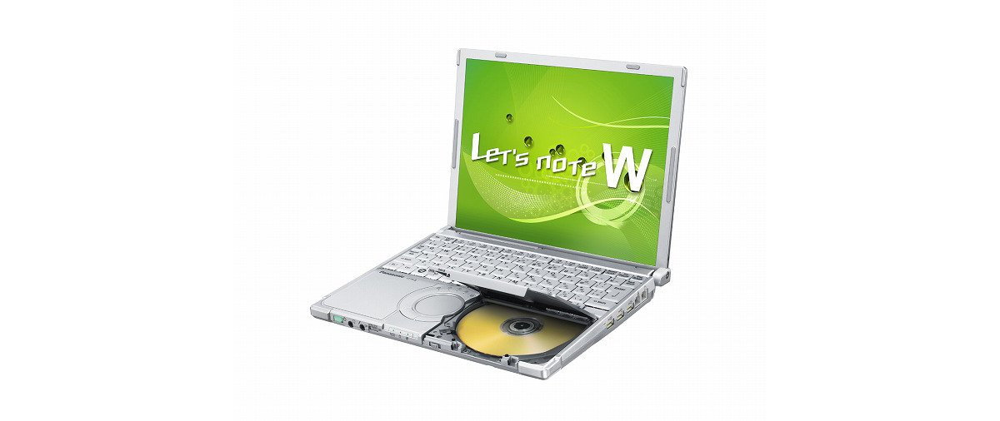
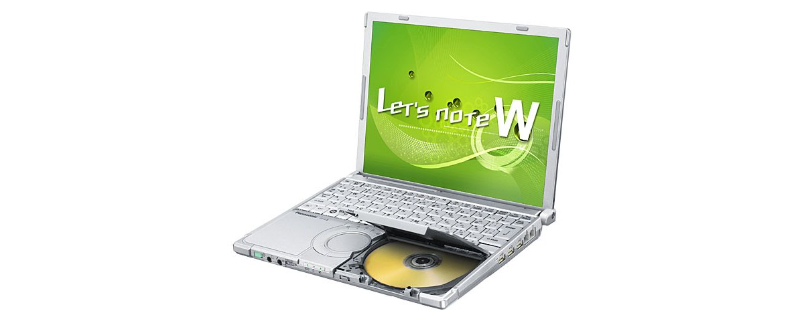
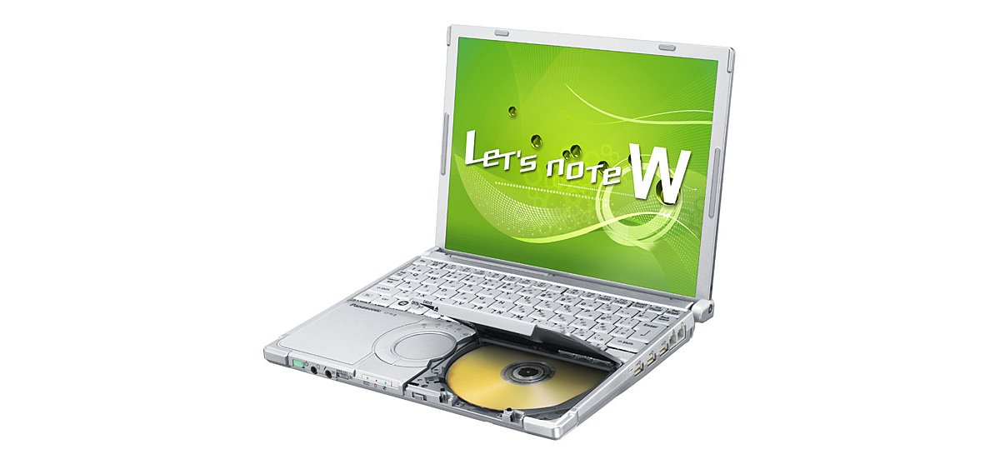
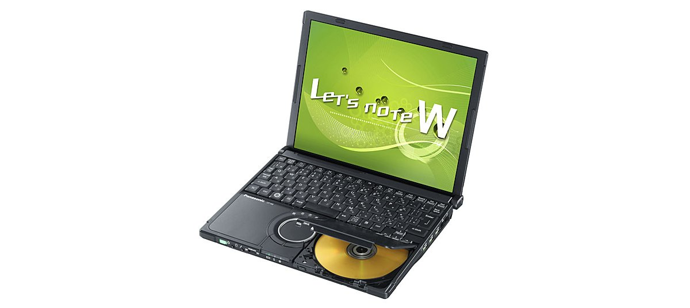
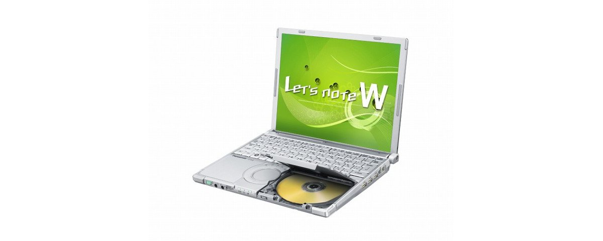

# 松下 Let's note CF-W8 规格参数

[English](../../en/CF-W8/) · [日本語](../../ja/CF-W8/) · **中文**

**CF-W8** 是松下 Let's note 笔记本电脑，属于 W8 系列，配备 12.1英寸 XGA 屏幕。本页收录其全部 9 个型号（2008-10 – 2009-06 发售）的规格参数。每个型号均附官方规格表链接。

*松下 Let's note CF-W8（CF-W8EWNQJR, CF-W8EWJAJR, CF-W8EWJNJR）。图片 © Panasonic*

## 型号列表

| 型号（品番） | 发售 | 停产 | 主要规格 |
| :-- | :-- | :-- | :-- |
| [CF-W8GWJCJR](https://panasonic.jp/pc/p-db/CF-W8GWJCJR_spec.html) | 2009-06 | 2009-09 | 黑色机型：Windows Vista® Business with SP1 正版、英特尔® CoreTM2 Duo SU9400（1.40GHz）、内存：2GB＋1GB（最大4GB）、HDD：160GB、超级多功能光驱、LAN、无线LAN 802.11a(W52/W53/W56)/b/g/n＜数量限定＞ |
| [CF-W8GWDAJR](https://panasonic.jp/pc/p-db/CF-W8GWDAJR_spec.html) | 2009-05 | 2009-09 | Windows Vista® Business with SP1 正版、英特尔® CoreTM2 Duo SU9400（1.40GHz）、内存：标配2GB（最大4GB）、HDD：160GB、Super Multi Drive、LAN、无线LAN 802.11a(W52/W53/W56)/b/g/n |
| [CF-W8GWDNJR](https://panasonic.jp/pc/p-db/CF-W8GWDNJR_spec.html) | 2009-05 | 2009-09 | Windows Vista® Business with SP1 正版 、英特尔® CoreTM2 Duo SU9400（1.40GHz）、内存：标配2GB（最大4GB）、HDD：160GB、Super Multi Drive、LAN、无线LAN 802.11a(W52/W53/W56)/b/g/n、Office Personal 2007 ＜数量限定＞ |
| [CF-W8FWDAJR](https://panasonic.jp/pc/p-db/CF-W8FWDAJR_spec.html) | 2009-02 | 2009-05 | Windows Vista® Business with SP1 正版、英特尔® CoreTM2 Duo SU9300（1.20GHz）、内存：标配2GB（最大4GB）、HDD：160GB、Super Multi Drive、LAN、无线LAN 802.11a(W52/W53/W56)/b/g/n |
| [CF-W8FWDNJR](https://panasonic.jp/pc/p-db/CF-W8FWDNJR_spec.html) | 2009-02 | 2009-05 | Windows Vista® Business with SP1 正版 、英特尔® CoreTM2 Duo SU9300（1.20GHz）、内存：标配2GB（最大4GB）、HDD：160GB、Super Multi Drive、LAN、无线LAN 802.11a(W52/W53/W56)/b/g/n、Office Personal 2007 ＜数量限定＞ |
| [CF-W8EWJQJR](https://panasonic.jp/pc/p-db/CF-W8EWJQJR_spec.html) | 2009-01 | 2009-05 | Windows Vista® Business with SP1 正版 、英特尔® CoreTM2 Duo SU9300（1.20GHz）、内存：标配2GB（已在扩展内存插槽中增加1GB内存、空插槽0）、HDD：120GB、Super Multi Drive、LAN、无线LAN 802.11a(W52/W53/W56)/b/g/n、Office Personal 2007 ＜数量限定＞ |
| [CF-W8EWNQJR](https://panasonic.jp/pc/p-db/CF-W8EWNQJR_spec.html) | 2008-10 | — | 蓝色顶板：店铺限定色：Windows Vista® Business with SP1 正版、英特尔® CoreTM2 Duo SU9300（1.20GHz）、内存：标配2GB（已在扩展内存插槽中增设1GB内存、空闲插槽0）、HDD：120GB、超级多功能光驱、LAN、无线LAN 802.11a(W52/W53/W56)/b/g/n、Office Personal 2007 ＜数量限定＞ |
| [CF-W8EWJAJR](https://panasonic.jp/pc/p-db/CF-W8EWJAJR_spec.html) | 2008-10 | 2009-01 | Windows Vista® Business with SP1 正版 、英特尔® CoreTM2 Duo SU9300（1.20GHz）、内存：标配1GB（最大3GB）、HDD：120GB、Super Multi Drive、LAN、无线LAN 802.11a(W52/W53/W56)/b/g/n |
| [CF-W8EWJNJR](https://panasonic.jp/pc/p-db/CF-W8EWJNJR_spec.html) | 2008-10 | 2009-01 | Windows Vista® Business with SP1 正版 、英特尔® CoreTM2 Duo SU9300（1.20GHz）、内存：标配1GB（最大3GB）、HDD：120GB、Super Multi Drive、LAN、无线LAN 802.11a(W52/W53/W56)/b/g/n、Office Personal 2007 ＜数量限定＞ |

## 通用规格

| 项目 | 规格 |
| :-- | :-- |
| 光驱 | 内置超级多功能驱动器、配备缓冲区欠载错误防止功能（SmoothLink） |
| 光驱速度 / 写入 | DVD-RAM 最大3倍速[4.7GB]、DVD-R 最大8倍速、DVD-RW 最大4倍速、＋R 最大8倍速、＋RW 最大4倍速、CD-R 最大16倍速、CD-RW 4倍速、High Speed CD-RW 10倍速 |
| 支持光盘 / 读取 | DVD-RAM、DVD-ROM、DVD-Video、DVD-R、DVD-RW、DVD-R DL、＋R、+R DL、＋RW、CD-Audio、CD-R、CD-ROM（支持XA）、 / PhotoCD（支持多区段）、VideoCD、CD-EXTRA、CD-TEXT、CD-RW |
| 支持光盘 / 写入 | DVD-RAM、DVD-R、DVD-RW、＋R、＋RW、CD-R、CD-RW |
| 软驱（选配） | USB连接外置3.5英寸3模式对应（1.44MB/1.2MB/720KB） |
| 显示屏 | XGA (1024×768点) 12.1英寸TFT彩色液晶 |
| 显示屏 / 色彩 | 1024×768像素：约1677万色 |
| 显示屏 / 外接显示输出 | 800x600、1024x768、1280x768、1280x1024、1400x1050、1440x900、1680x1050、1600x1200、1920x1080、1920x1200像素：约1677万色 |
| 显示屏 / 同时显示 | 800×600、1024×768点：约1677万色 |
| 无线网络 | 英特尔（R） WiFi Link 5100AGN、符合IEEE802.11a（W52/W53/W56）/b/g、符合IEEE802.11n draft 2.0、（支持WPA-AES/TKIP、符合Wi-Fi） |
| 调制解调器 | 数据：56kbps（V.90） FAX：14.4kbps /不支持语音 |
| 有线网络 | 1000BASE-T / 100BASE-TX / 10BASE-T |
| 音频 | PCM音源（24位立体声）、英特尔（R） High Definition Audio 标准、单声道扬声器 |
| 安全芯片 | TPM（符合TCG V1.2） |
| 卡槽 / PC 卡 | PC卡（TYPEⅡ）×1插槽（支持 CardBus、允许电流 3.3V：400mA、5V：400mA） |
| 卡槽 / SD 卡 | SD存储卡×1插槽（SDHC存储卡/支持版权保护功能） |
| 键盘 | OADG标准键盘（85键）：键距19mm(横向)/16mm(纵向) / （部分按键除外） |
| 指点设备 | 滚轮触控板 |
| 功耗 | 最大约60W |
| 尺寸（宽×深×高） | 宽272mm×深214.3mm×高24.9mm/45.3mm（前部/后部） |
| 附件 | 产品恢复DVD-ROM 2张（用于Windows Vista(R)/用于Windows(R) XP）、AC适配器、电池组、使用说明书 等 |

## 各型号差异

| 型号（品番） | 处理器 | 内存 | 存储 | 重量 | 续航 |
| :-- | :-- | :-- | :-- | :-- | :-- |
| CF-W8GWJCJR | — | 3GB | 160GB | 1.259 kg | — |
| CF-W8GWDAJR | — | 2GB DDR2 SDRAM | 160GB | 1.249 kg | — |
| CF-W8GWDNJR | — | 2GB DDR2 SDRAM | 160GB | 1.249 kg | — |
| CF-W8FWDAJR | — | 2GB DDR2 SDRAM | 160GB | 1.249 kg | — |
| CF-W8FWDNJR | — | 2GB DDR2 SDRAM | 160GB | 1.249 kg | — |
| CF-W8EWJQJR | — | 2GB DDR2 SDRAM | 120GB | 1.260 kg | — |
| CF-W8EWNQJR | — | 2GB DDR2 SDRAM | 120GB | 1.260 kg | — |
| CF-W8EWJAJR | — | 1GB DDR2 SDRAM | 120GB | 1.249 kg | — |
| CF-W8EWJNJR | — | 1GB DDR2 SDRAM | 120GB | 1.249 kg | — |

CF-W8GWJCJR 的全部差异规格

| 项目 | 规格 |
| :-- | :-- |
| 操作系统 | Windows Vista（R） Business with Service Pack 1 正版(32位)（含Windows（R）XP降级权） |
| 处理器 | vPro(TM)技术 英特尔（R） Centrino（R）2 / 英特尔（R）Core（TM）2 Duo 处理器 / 超低电压版 SU9400 / 二级缓存 3MB、工作频率 1.40GHz、前端总线 800MHz |
| 芯片组 | 移动 英特尔(R) GS45 Express 芯片组 |
| 内存 | 标准3GB（空插槽0：已在扩展内存插槽增加1GB内存）/最大4GB |
| 显存 | 最大1309MB（与主内存共用）（将扩展内存更改为2GB时最大1551MB） |
| 硬盘 | 160GB（Serial ATA）上述容量中约8GB用作修复区域（包含恢复用数据区域）（用户不可使用） |
| 光驱速度 / 读取 | DVD-RAM 3倍速[4.7GB]、DVD-R 最大8倍速、DVD-R DL 最大4倍速、DVD-RW 最大4倍速、DVD-ROM 最大8倍速、＋R 最大8倍速、+R DL 最大4倍速、＋RW 最大4倍速、CD-ROM 最大24倍速、CD-R 最大24倍速、CD-RW 最大24倍速 |
| 内存扩展槽 | DDR2 200针 SO-DIMM专用插槽×1 (1.8V/PC2-5300/DDR2 SDRAM)、已增配1GB内存 |
| 接口 | USB端口×3（USB2.0）、调制解调器接口（RJ-11）、LAN接口（RJ-45）、外部显示器接口（模拟RGB mini Dsub 15针）、迷你端口复制器接口（专用50针）、麦克风输入端子（立体声迷你插孔M3（支持插入式电源））、音频输出端子（立体声迷你插孔M3） |
| 电源 | AC适配器 输入：AC100V～240V、50Hz/60Hz、输出：DC16 V、3.75A、电源线仅限100V专用 |
| 能效 | 2007年度基准Ｉ区分0.00026 |
| 能效达成率 | — |
| 电池 | 电池组（10.8V锂离子・标称容量5.8Ah/额定容量5.4Ah） / 另售轻量电池组(银色)（10.8V锂离子・标称容量2.9Ah/额定容量2.7Ah） |
| 重量（含电池） | 约1.259kg/约1.14kg（使用另售轻量电池组(银色)(约0.2kg)时） |
| 预装软件 | Microsoft（R） Internet Explorer7.0、Adobe（R） Reader、Microsoft（R） Windows（R） Media Player 11、DirectX 10、Microsoft（R）Windows（R） Movie Maker 6.0、Microsoft（R） .NET Framework3.0、缩放查看器、PC信息查看器、PC信息弹窗、NumLock通知、Wireless Manager mobile edition5.5、无线切换实用工具、安全设置实用工具、Infineon TPM Professional Package V3.5 SP1（仅CF-W8GWJCJR/R8GWJCJR）、电池剩余电量显示校正实用工具、Hotkey设置、McAfee PC安全中心、绿色goo棒、硬盘数据擦除实用工具、滚轮触控板实用工具、网络选择器2、USB键盘助手、USB鼠标助手、Fn Ctrl功能互换实用工具、i-过滤器5.0（30天试用版）、Panasonic电源计划扩展实用工具、显示助手、Aptio设置实用工具、PC-Diagnostic实用工具、光盘驱动器盘符更改实用工具、Roxio Creator LJB、MyDVD、WinDVDTM8（OEM版）CPRM对应 |

官方规格表: <https://panasonic.jp/pc/p-db/CF-W8GWJCJR_spec.html>

CF-W8GWDAJR 的全部差异规格

| 项目 | 规格 |
| :-- | :-- |
| 操作系统 | Windows Vista（R） Business with Service Pack 1 正版（含Windows（R） XP降级权） |
| 处理器 | vPro(TM)技术 英特尔（R） Centrino（R）2 / 英特尔（R） Core（TM）2 Duo 处理器 / 超低电压版 SU9400 / 二级缓存 3MB、工作频率 1.40GHz、前端总线 800MHz |
| 芯片组 | 移动 英特尔(R) GS45 Express 芯片组 |
| 内存 | 标准2GB DDR2 SDRAM（最大4GB）空插槽1 |
| 显存 | 最大797MB / 增加1GB扩展内存时最大1309MB、增加2GB扩展内存时最大1551MB（与主内存共享） |
| 硬盘 | 160GB（Serial ATA）上述容量中约8GB用作修复区域（包含恢复用数据区域）（用户不可使用） |
| 光驱速度 / 读取 | DVD-RAM 3倍速[4.7GB]、DVD-R 最大8倍速、DVD-R DL 最大4倍速、DVD-RW 最大4倍速、DVD-ROM 最大8倍速、＋R 最大8倍速、+R DL 最大4倍速、＋RW 最大4倍速、CD-ROM 最大24倍速、CD-R 最大24倍速、CD-RW 最大24倍速 |
| 内存扩展槽 | DDR2 200针 SO-DIMM专用插槽×1 (1.8V/PC2-5300/DDR2 SDRAM) |
| 接口 | USB端口×3（USB2.0）、调制解调器接口（RJ-11）、LAN接口（RJ-45）、外部显示器接口（模拟VGA mini Dsub 15针）、迷你端口复制器接口（专用50针） |
| 电源 | AC适配器 输入：AC100V～240V（50Hz/60Hz）（电源线仅限100V专用） |
| 能效 | 2007年度基准Ｉ区分0.00026 |
| 能效达成率 | — |
| 电池 | 电池组（10.8V锂离子・标称容量5.8Ah/额定容量5.4Ah） / 另售轻量电池组（10.8V锂离子・标称容量2.9Ah/额定容量2.7Ah） |
| 重量（含电池） | 约1.249kg/约1.13kg（使用另售轻量电池组时） |
| 预装软件 | Microsoft（R） Internet Explorer7.0、Adobe（R） Reader、Microsoft（R） Windows（R） Media Player 11、DirectX 10、Microsoft（R）Windows（R） Movie Maker 6.0、Microsoft（R） .NET Framework3.0、缩放查看器、PC信息查看器、PC信息弹窗、NumLock通知、Wireless Manager mobile edition5.0、无线切换实用工具、安全设置实用工具、Infineon TPM Professional Package V3.0 SP2HF2、电池剩余电量显示校正实用工具、Hotkey设置、McAfee互联网安全套件基础版、绿色goo棒、硬盘数据擦除实用工具、滚轮触控板实用工具、网络选择器2、USB键盘助手、USB鼠标助手、Fn Ctrl功能互换实用工具、Panasonic电源计划扩展实用工具、显示助手、Aptio设置实用工具、PC-Diagnostic实用工具、光盘驱动器盘符更改实用工具、Roxio Creator LJB、DVD-MovieAlbumSE 4.5、MyDVD、WinDVDTM8（OEM版）CPRM对应 |

官方规格表: <https://panasonic.jp/pc/p-db/CF-W8GWDAJR_spec.html>

CF-W8GWDNJR 的全部差异规格

| 项目 | 规格 |
| :-- | :-- |
| 操作系统 | Windows Vista（R） Business with Service Pack 1 正版（含Windows（R） XP降级权） |
| 处理器 | vPro(TM)技术 英特尔（R） Centrino（R）2 / 英特尔（R） Core（TM）2 Duo 处理器 / 超低电压版 SU9400 / 二级缓存 3MB、工作频率 1.40GHz、前端总线 800MHz |
| 芯片组 | 移动 英特尔(R) GS45 Express 芯片组 |
| 内存 | 标准2GB DDR2 SDRAM（最大4GB）空插槽1 |
| 显存 | 最大797MB / 增加1GB扩展内存时最大1309MB、增加2GB扩展内存时最大1551MB（与主内存共享） |
| 硬盘 | 160GB（Serial ATA）上述容量中约8GB用作修复区域（包含恢复用数据区域）（用户不可使用） |
| 光驱速度 / 读取 | DVD-RAM 3倍速[4.7GB]、 / DVD-R 最大8倍速、DVD-R DL 最大4倍速、DVD-RW 最大4倍速、DVD-ROM 最大8倍速、＋R 最大8倍速、+R DL 最大4倍速、＋RW 最大4倍速、CD-ROM 最大24倍速、CD-R 最大24倍速、CD-RW 最大24倍速 |
| 内存扩展槽 | DDR2 200针 SO-DIMM专用插槽×1 (1.8V/PC2-5300/DDR2 SDRAM) |
| 接口 | USB端口×3（USB2.0）、调制解调器接口（RJ-11）、LAN接口（RJ-45）、外部显示器接口（模拟VGA mini Dsub 15针）、迷你端口复制器接口（专用50针） |
| 电源 | AC适配器 输入：AC100V～240V（50Hz/60Hz）（电源线仅限100V专用） |
| 能效 | 2007年度基准Ｉ区分0.00026 |
| 能效达成率 | — |
| 电池 | 电池组（10.8V锂离子・标称容量5.8Ah/额定容量5.4Ah） / 另售轻量电池组（10.8V锂离子・标称容量2.9Ah/额定容量2.7Ah） |
| 重量（含电池） | 约1.249kg/约1.13kg（使用另售轻量电池组时） |
| 预装软件 | Microsoft（R） Internet Explorer7.0、Adobe（R） Reader、Microsoft（R） Windows（R） Media Player 11、DirectX 10、Microsoft（R）Windows（R） Movie Maker 6.0、Microsoft（R） .NET Framework3.0、缩放查看器、PC信息查看器、PC信息弹窗、NumLock通知、Wireless Manager mobile edition5.0、无线切换实用工具、安全设置实用工具、Infineon TPM Professional Package V3.0 SP2HF2、电池剩余电量显示校正实用工具、Hotkey设置、McAfee互联网安全套件基础版、绿色goo棒、硬盘数据擦除实用工具、滚轮触控板实用工具、网络选择器2、USB键盘助手、USB鼠标助手、Fn Ctrl功能互换实用工具、Panasonic电源计划扩展实用工具、显示助手、Aptio设置实用工具、PC-Diagnostic实用工具、光盘驱动器盘符更改实用工具、Roxio Creator LJB、DVD-MovieAlbumSE 4.5、MyDVD、WinDVDTM8（OEM版）CPRM对应、Microsoft（R） Office Personal 2007 with PowerPoint 2007 |

官方规格表: <https://panasonic.jp/pc/p-db/CF-W8GWDNJR_spec.html>

CF-W8FWDAJR 的全部差异规格

| 项目 | 规格 |
| :-- | :-- |
| 操作系统 | Windows Vista（R） Business with Service Pack 1 正版（含Windows（R） XP降级权） |
| 处理器 | 英特尔（R） Centrino（R） 2 处理器技术 / 英特尔（R） Core（TM）2 Duo 处理器 / 超低电压版 SU9300 / 二级缓存 3MB、工作频率 1.20GHz、前端总线 800MHz |
| 芯片组 | 移动 英特尔(R) GS45 Express 芯片组 |
| 内存 | 标准2GB DDR2 SDRAM（最大4GB）空插槽1 |
| 显存 | 最大797MB / 增加1GB扩展内存时最大1309MB、增加2GB扩展内存时最大1551MB（与主内存共享） |
| 硬盘 | 160GB（Serial ATA）上述容量中约8GB用作修复区域（包含恢复用数据区域）（用户不可使用） |
| 光驱速度 / 读取 | DVD-RAM 3倍速[4.7GB]、DVD-R 最大8倍速、DVD-R DL 最大4倍速、DVD-RW 最大4倍速、DVD-ROM 最大8倍速、＋R 最大8倍速、+R DL 最大4倍速、＋RW 最大4倍速、CD-ROM 最大24倍速、CD-R 最大24倍速、CD-RW 最大24倍速 |
| 内存扩展槽 | DDR2 200针SO-DIMM专用插槽×1 (1.8V/PC2-5300/DDR2 SDRAM) |
| 接口 | USB端口×3（USB2.0）、调制解调器接口（RJ-11）、LAN接口（RJ-45）、外部显示器接口（模拟VGA mini Dsub 15针）、迷你端口复制器接口（专用50针） |
| 电源 | AC适配器 输入：AC100V～240V（50Hz/60Hz）（电源线仅限100V专用） |
| 能效 | 2007年度基准Ｉ区分0.00030 |
| 能效达成率 | — |
| 电池 | 电池组（10.8V锂离子・标称容量5.8Ah/额定容量5.4Ah） / 另售轻量电池组（10.8V锂离子・标称容量2.9Ah/额定容量2.7Ah） |
| 重量（含电池） | 约1.249kg/约1.13kg（使用另售轻量电池组时） |
| 预装软件 | Microsoft（R） Internet Explorer7.0、Adobe（R） Reader、Microsoft（R） Windows（R） Media Player 11、DirectX 10、Microsoft（R）Windows（R） Movie Maker 6.0、Microsoft（R） .NET Framework3.0、缩放查看器、PC信息查看器、PC信息弹窗、NumLock通知、Wireless Manager mobile edition5.0、无线切换实用工具、安全设置实用工具、Infineon TPM Professional Package V3.0 SP2HF2、电池剩余电量显示校正实用工具、Hotkey设置、McAfee互联网安全套件基础版、绿色goo棒、硬盘数据擦除实用工具、滚轮触控板实用工具、网络选择器2、USB键盘助手、USB鼠标助手、Fn Ctrl功能互换实用工具、Panasonic电源计划扩展实用工具、显示助手、Aptio设置实用工具、PC-Diagnostic实用工具、光盘驱动器盘符更改实用工具、Roxio Creator LJB、DVD-MovieAlbumSE 4.5、MyDVD、WinDVDTM8（OEM版）CPRM对应 |

官方规格表: <https://panasonic.jp/pc/p-db/CF-W8FWDAJR_spec.html>

CF-W8FWDNJR 的全部差异规格

| 项目 | 规格 |
| :-- | :-- |
| 操作系统 | Windows Vista（R） Business with Service Pack 1 正版（含Windows（R） XP降级权） |
| 处理器 | 英特尔（R） Centrino（R） 2 处理器技术 / 英特尔（R） Core（TM）2 Duo 处理器 / 超低电压版 SU9300 / 二级缓存 3MB、工作频率 1.20GHz、前端总线 800MHz |
| 芯片组 | 移动 英特尔(R) GS45 Express 芯片组 |
| 内存 | 标准2GB DDR2 SDRAM（最大4GB）空插槽1 |
| 显存 | 最大797MB / 增加1GB扩展内存时最大1309MB、增加2GB扩展内存时最大1551MB（与主内存共享） |
| 硬盘 | 160GB（Serial ATA）上述容量中约8GB用作修复区域（包含恢复用数据区域）（用户不可使用） |
| 光驱速度 / 读取 | DVD-RAM 3倍速[4.7GB]、 / DVD-R 最大8倍速、DVD-R DL 最大4倍速、DVD-RW 最大4倍速、DVD-ROM 最大8倍速、＋R 最大8倍速、+R DL 最大4倍速、＋RW 最大4倍速、CD-ROM 最大24倍速、CD-R 最大24倍速、CD-RW 最大24倍速 |
| 内存扩展槽 | DDR2 200针SO-DIMM专用插槽×1 (1.8V/PC2-5300/DDR2 SDRAM) |
| 接口 | USB端口×3（USB2.0）、调制解调器接口（RJ-11）、LAN接口（RJ-45）、外部显示器接口（模拟VGA mini Dsub 15针）、迷你端口复制器接口（专用50针） |
| 电源 | AC适配器 输入：AC100V～240V（50Hz/60Hz）（电源线仅限100V专用） |
| 能效 | 2007年度基准Ｉ区分0.00030 |
| 能效达成率 | — |
| 电池 | 电池组（10.8V锂离子・标称容量5.8Ah/额定容量5.4Ah） / 另售轻量电池组（10.8V锂离子・标称容量2.9Ah/额定容量2.7Ah） |
| 重量（含电池） | 约1.249kg/约1.13kg（使用另售轻量电池组时） |
| 预装软件 | Microsoft（R） Internet Explorer7.0、Adobe（R） Reader、Microsoft（R） Windows（R） Media Player 11、DirectX 10、Microsoft（R）Windows（R） Movie Maker 6.0、Microsoft（R） .NET Framework3.0、缩放查看器、PC信息查看器、PC信息弹窗、NumLock通知、Wireless Manager mobile edition5.0、无线切换实用工具、安全设置实用工具、Infineon TPM Professional Package V3.0 SP2HF2、电池剩余电量显示校正实用工具、Hotkey设置、McAfee互联网安全套件基础版、绿色goo棒、硬盘数据擦除实用工具、滚轮触控板实用工具、网络选择器2、USB键盘助手、USB鼠标助手、Fn Ctrl功能互换实用工具、Panasonic电源计划扩展实用工具、显示助手、Aptio设置实用工具、PC-Diagnostic实用工具、光盘驱动器盘符更改实用工具、Roxio Creator LJB、DVD-MovieAlbumSE 4.5、MyDVD、WinDVDTM8（OEM版）CPRM对应、Microsoft（R） Office Personal 2007 with PowerPoint 2007 |

官方规格表: <https://panasonic.jp/pc/p-db/CF-W8FWDNJR_spec.html>

CF-W8EWJQJR 的全部差异规格

| 项目 | 规格 |
| :-- | :-- |
| 操作系统 | Windows Vista（R） Business with Service Pack 1 正版（含Windows（R） XP降级权） |
| 处理器 | 英特尔（R） Centrino（R） 2 处理器技术 / 英特尔（R） Core（TM）2 Duo 处理器 / 超低电压版 SU9300 / 二级缓存 3MB、工作频率 1.20GHz、前端总线 800MHz |
| 芯片组 | 移动 英特尔(R) GS45 Express 芯片组 |
| 内存 | 标准2GB DDR2 SDRAM（最大3GB）空插槽0 |
| 显存 | 最大797MB（将扩展内存从1GB变更为2GB时最大1309MB）（与主内存共享） |
| 硬盘 | 120GB（Serial ATA）左记容量中约7GB用作修复用区域（用户不可使用） |
| 光驱速度 / 读取 | DVD-RAM 3倍速[4.7GB]、DVD-R 最大8倍速、DVD-R DL 最大4倍速、DVD-RW 最大4倍速、DVD-ROM 最大8倍速、＋R 最大8倍速、+R DL 最大4倍速、＋RW 最大4倍速、CD-ROM 最大24倍速、CD-R 最大24倍速、CD-RW 最大24倍速 |
| 内存扩展槽 | DDR2 200针SO-DIMM专用插槽×1(1.8V/PC2-5300/DDR2 SDRAM) |
| 接口 | USB端口×3（USB2.0）、调制解调器接口（RJ-11）、LAN接口（RJ-45）、外部显示器接口（模拟VGA mini Dsub 15针）、迷你端口复制器接口（专用50针） |
| 电源 | AC适配器 输入：AC100V～240V（50Hz/60Hz）（电源线仅限100V专用） |
| 能效 | 2007年度基准Ｉ区分0.00030 |
| 能效达成率 | — |
| 电池 | 电池组（10.8V锂离子・标称容量5.8Ah/额定容量5.4Ah） / 另售轻量电池组（10.8V锂离子・标称容量2.9Ah/额定容量2.7Ah） |
| 重量（含电池） | 约1.260kg/约1.14kg（使用另售轻量电池组时） |
| 预装软件 | Microsoft（R） Internet Explorer7.0、Adobe（R） Reader、Microsoft（R） Windows（R） Media Player 11、DirectX 10、Microsoft（R）Windows（R） Movie Maker 6.0、Microsoft（R） .NET Framework3.0、缩放查看器、PC信息查看器、PC信息弹窗、NumLock通知、Wireless Manager mobile edition5.0、无线切换实用工具、安全设置实用工具、Infineon TPM Professional Package V3.0 SP2HF2、电池剩余电量显示校正实用工具、Hotkey设置、McAfee互联网安全套件基础版、goo棒、硬盘数据擦除实用工具、滚轮触控板实用工具、网络选择器2、USB键盘助手、USB鼠标助手、Fn Ctrl功能互换实用工具、Panasonic电源计划扩展实用工具、显示助手、Aptio设置实用工具、PC-Diagnostic实用工具、光盘驱动器盘符更改实用工具、Roxio Creator LJB、DVD-MovieAlbumSE 4.5、MyDVD、WinDVDTM8（OEM版）CPRM对应、Microsoft（R） Office Personal 2007 with PowerPoint 2007 |

官方规格表: <https://panasonic.jp/pc/p-db/CF-W8EWJQJR_spec.html>

CF-W8EWNQJR 的全部差异规格

| 项目 | 规格 |
| :-- | :-- |
| 操作系统 | Windows Vista（R） Business with Service Pack 1 正版（含Windows（R） XP降级权） |
| 处理器 | 英特尔（R） Centrino（R） 2 处理器技术 / 英特尔（R） Core（TM）2 Duo 处理器 / 超低电压版 SU9300 / 二级缓存 3MB、工作频率 1.20GHz、前端总线 800MHz |
| 芯片组 | 移动 英特尔(R) GS45 Express 芯片组 |
| 内存 | 标准2GB DDR2 SDRAM（最大3GB）空插槽0 |
| 显存 | 最大797MB（将扩展内存从1GB变更为2GB时最大1309MB）（与主内存共享） |
| 硬盘 | 120GB（Serial ATA）左记容量中约7GB用作修复用区域（用户不可使用） |
| 光驱速度 / 读取 | DVD-RAM 3倍速[4.7GB]、DVD-R 最大8倍速、DVD-R DL 最大4倍速、DVD-RW 最大4倍速、DVD-ROM 最大8倍速、＋R 最大8倍速、+R DL 最大4倍速、＋RW 最大4倍速、CD-ROM 最大24倍速、CD-R 最大24倍速、CD-RW 最大24倍速 |
| 内存扩展槽 | DDR2 200针SO-DIMM专用插槽×1(1.8V/PC2-5300/DDR2 SDRAM) |
| 接口 | USB端口×3（USB2.0）、调制解调器接口（RJ-11）、LAN接口（RJ-45）、外部显示器接口（模拟VGA mini Dsub 15针）、迷你端口复制器接口（专用50针） |
| 电源 | AC适配器 输入：AC100V～240V（50Hz/60Hz）（电源线仅限100V专用） |
| 能效 | 2007年度基准Ｉ区分0.00030 |
| 能效达成率 | — |
| 电池 | 电池组（10.8V锂离子・标称容量5.8Ah/额定容量5.4Ah） / 另售轻量电池组（10.8V锂离子・标称容量2.9Ah/额定容量2.7Ah） |
| 重量（含电池） | 约1.260kg/约1.14kg（使用另售轻量电池组时） |
| 预装软件 | Microsoft（R） Internet Explorer7.0、Adobe（R） Reader、Microsoft（R） Windows（R） Media Player 11、DirectX 10、Microsoft（R）Windows（R） Movie Maker 6.0、Microsoft（R） .NET Framework3.0、缩放查看器、PC信息查看器、PC信息弹窗、NumLock通知、Wireless Manager mobile edition5.0、无线切换实用工具、安全设置实用工具、Infineon TPM Professional Package V3.0 SP2HF2、电池剩余电量显示校正实用工具、Hotkey设置、McAfee互联网安全套件基础版、goo棒、硬盘数据擦除实用工具、滚轮触控板实用工具、网络选择器2、USB键盘助手、USB鼠标助手、Fn Ctrl功能互换实用工具、Panasonic电源计划扩展实用工具、显示助手、Aptio设置实用工具、PC-Diagnostic实用工具、光盘驱动器盘符更改实用工具、Roxio Creator LJB、DVD-MovieAlbumSE 4.5、MyDVD、WinDVDTM8（OEM版）CPRM对应、Microsoft（R） Office Personal 2007 with PowerPoint 2007 |

官方规格表: <https://panasonic.jp/pc/p-db/CF-W8EWNQJR_spec.html>

CF-W8EWJAJR 的全部差异规格

| 项目 | 规格 |
| :-- | :-- |
| 操作系统 | Windows Vista（R） Business with Service Pack 1 正版（含Windows（R） XP降级权） |
| 处理器 | 英特尔（R） Centrino（R） 2 处理器技术 / 英特尔（R） Core（TM）2 Duo 处理器 / 超低电压版 SU9300 / 二级缓存 3MB、工作频率 1.20GHz、前端总线 800MHz |
| 芯片组 | 移动 英特尔(R) GS45 Express 芯片组 |
| 内存 | 标准1GB DDR2 SDRAM（最大3GB）空插槽1 |
| 显存 | 最大285MB / 加装1GB扩展内存时最大797MB、加装2GB扩展内存时最大1309MB（与主内存共享） |
| 硬盘 | 120GB（Serial ATA）上述容量中约6GB用作修复用区域（用户不可使用） |
| 光驱速度 / 读取 | DVD-RAM 3倍速[4.7GB]、DVD-R 最大8倍速、DVD-R DL 最大4倍速、DVD-RW 最大4倍速、DVD-ROM 最大8倍速、＋R 最大8倍速、+R DL 最大4倍速、＋RW 最大4倍速、CD-ROM 最大24倍速、CD-R 最大24倍速、CD-RW 最大24倍速 |
| 内存扩展槽 | DDR2 200针SO-DIMM专用插槽×1 (1.8V/PC2-5300/DDR2 SDRAM) |
| 接口 | USB端口×3（USB2.0）、调制解调器接口（RJ-11）、LAN接口（RJ-45）、外部显示器接口（模拟VGA mini Dsub 15针）、迷你端口复制器接口（专用50针） |
| 电源 | AC适配器 输入：AC100V～240V（50Hz/60Hz）（电源线仅限100V专用） |
| 能效 | 2007年度基准Ｉ区分0.00030 |
| 能效达成率 | — |
| 电池 | 电池组（10.8V锂离子・标称容量5.8Ah/额定容量5.4Ah） / 另售轻量电池组（10.8V锂离子・标称容量2.9Ah/额定容量2.7Ah） |
| 重量（含电池） | 约1.249kg/约1.13kg（使用另售轻量电池组时） |
| 预装软件 | Microsoft（R） Internet Explorer7.0、Adobe（R） Reader、Microsoft（R） Windows（R） Media Player 11、DirectX 10、Microsoft（R）Windows（R） Movie Maker 6.0、Microsoft（R） .NET Framework3.0、缩放查看器、PC信息查看器、PC信息弹窗、NumLock通知、Wireless Manager mobile edition5.0、无线切换实用工具、安全设置实用工具、Infineon TPM Professional Package V3.0 SP2HF2、电池剩余电量显示校正实用工具、Hotkey设置、McAfee互联网安全套件基础版、goo棒、硬盘数据擦除实用工具、滚轮触控板实用工具、网络选择器2、USB键盘助手、USB鼠标助手、Fn Ctrl功能互换实用工具、Panasonic电源计划扩展实用工具、显示助手、Aptio设置实用工具、PC-Diagnostic实用工具、光盘驱动器盘符更改实用工具、Roxio Creator LJB、DVD-MovieAlbumSE 4.5、MyDVD、WinDVDTM8（OEM版）CPRM对应 |

官方规格表: <https://panasonic.jp/pc/p-db/CF-W8EWJAJR_spec.html>

CF-W8EWJNJR 的全部差异规格

| 项目 | 规格 |
| :-- | :-- |
| 操作系统 | Windows Vista（R） Business with Service Pack 1 正版（含Windows（R） XP降级权） |
| 处理器 | 英特尔（R） Centrino（R） 2 处理器技术 / 英特尔（R） Core（TM）2 Duo 处理器 / 超低电压版 SU9300 / 二级缓存 3MB、工作频率 1.20GHz、前端总线 800MHz |
| 芯片组 | 移动 英特尔(R) GS45 Express 芯片组 |
| 内存 | 标准1GB DDR2 SDRAM（最大3GB）空插槽1 |
| 显存 | 最大285MB / 加装1GB扩展内存时最大797MB、加装2GB扩展内存时最大1309MB（与主内存共享） |
| 硬盘 | 120GB（Serial ATA）左记容量中约7GB用作修复用区域（用户不可使用） |
| 光驱速度 / 读取 | DVD-RAM 3倍速[4.7GB]、 / DVD-R 最大8倍速、DVD-R DL 最大4倍速、DVD-RW 最大4倍速、DVD-ROM 最大8倍速、＋R 最大8倍速、+R DL 最大4倍速、＋RW 最大4倍速、CD-ROM 最大24倍速、CD-R 最大24倍速、CD-RW 最大24倍速 |
| 内存扩展槽 | DDR2 200针SO-DIMM专用插槽×1 (1.8V/PC2-5300/DDR2 SDRAM) |
| 接口 | USB端口×3（USB2.0）、调制解调器接口（RJ-11）、LAN接口（RJ-45）、外部显示器接口（模拟VGA mini Dsub 15针）、迷你端口复制器接口（专用50针） |
| 电源 | AC适配器 输入：AC100V～240V（50Hz/60Hz）（电源线仅限100V专用） |
| 能效 | 2007年度基准Ｉ区分0.00030 |
| 电池 | 电池组（10.8V锂离子・标称容量5.8Ah/额定容量5.4Ah） / 另售轻量电池组（10.8V锂离子・标称容量2.9Ah/额定容量2.7Ah） |
| 重量（含电池） | 约1.249kg/约1.13kg（使用另售轻量电池组时） |
| 预装软件 | Microsoft（R） Internet Explorer7.0、Adobe（R） Reader、Microsoft（R） Windows（R） Media Player 11、DirectX 10、Microsoft（R）Windows（R） Movie Maker 6.0、Microsoft（R） .NET Framework3.0、缩放查看器、PC信息查看器、PC信息弹窗、NumLock通知、Wireless Manager mobile edition5.0、无线切换实用工具、安全设置实用工具、Infineon TPM Professional Package V3.0 SP2HF2、电池剩余电量显示校正实用工具、Hotkey设置、McAfee互联网安全套件基础版、goo棒、硬盘数据擦除实用工具、滚轮触控板实用工具、网络选择器2、USB键盘助手、USB鼠标助手、Fn Ctrl功能互换实用工具、Panasonic电源计划扩展实用工具、显示助手、Aptio设置实用工具、PC-Diagnostic实用工具、光盘驱动器盘符更改实用工具、Roxio Creator LJB、DVD-MovieAlbumSE 4.5、MyDVD、WinDVDTM8（OEM版）CPRM对应、Microsoft（R） Office Personal 2007 with PowerPoint 2007 |

官方规格表: <https://panasonic.jp/pc/p-db/CF-W8EWJNJR_spec.html>

## 图片

*松下 Let's note CF-W8（CF-W8GWDAJR, CF-W8GWDNJR）。图片 © Panasonic*

*松下 Let's note CF-W8（CF-W8FWDAJR, CF-W8FWDNJR）。图片 © Panasonic*

*松下 Let's note CF-W8（CF-W8GWJCJR）。图片 © Panasonic*

*松下 Let's note CF-W8（CF-W8EWJQJR）。图片 © Panasonic*

## 相关机型

- [Let's note 全部机型](../)

---

来源：松下官方[停产产品列表](https://panasonic.jp/pc/support/products/)及各型号规格表（panasonic.jp），由日文翻译，准确措辞以官方规格表为准。产品图片 © Panasonic。本页为非官方整理，与松下公司无关。
