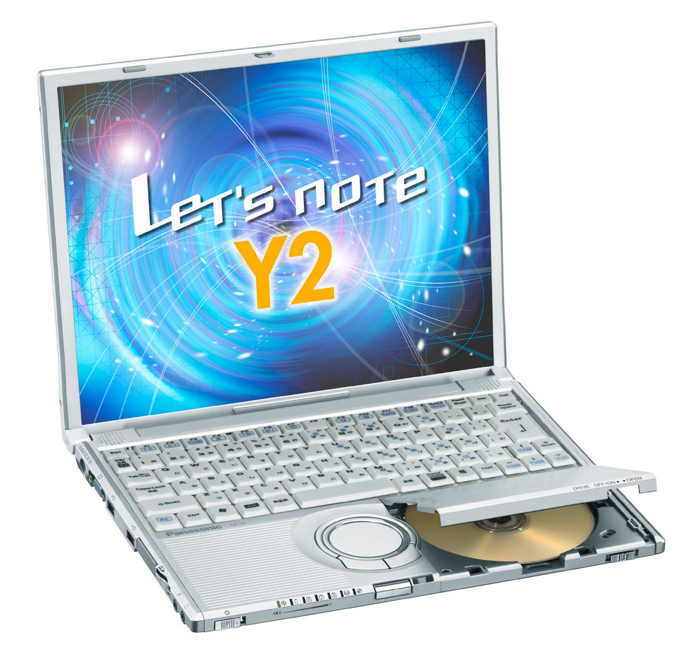

# 松下 Let's note CF-Y2 规格参数

[English](../../en/CF-Y2/) · [日本語](../../ja/CF-Y2/) · **中文**

**CF-Y2** 是松下 Let's note 笔记本电脑，属于 Y2 系列，配备 14.1英寸 SXGA＋ 屏幕。本页收录其全部 6 个型号（2004-02 – 2005-02 发售）的规格参数。每个型号均附官方规格表链接。

*松下 Let's note CF-Y2（CF-Y2FW7AXR, CF-Y2FW7HXR, CF-Y2EW6AXR）。图片 © Panasonic*

## 型号列表

| 型号（品番） | 发售 | 停产 | 主要规格 |
| :-- | :-- | :-- | :-- |
| [CF-Y2FW7AXR](https://panasonic.jp/pc/p-db/CF-Y2FW7AXR_spec.html) | 2005-02 | 2005-04 | Windows® XP Professional、PentiumM 758(1.5GHz・LV)、内存：256MB（最大768MB）、HDD：60GB、Super Multi Drive、LAN、无线LAN 802.11a(J52)/b/g、USB2.0 |
| [CF-Y2FW7HXR](https://panasonic.jp/pc/p-db/CF-Y2FW7HXR_spec.html) | 2005-02 | 2005-03 | Windows® XP Professional、PentiumM 758(1.5GHz・LV)、内存：256MB（最大768MB）、HDD：60GB、Super Multi Drive、LAN、无线LAN 802.11a(J52)/b/g、USB2.0、Office Personal ＜数量限定＞ |
| [CF-Y2EW6AXR](https://panasonic.jp/pc/p-db/CF-Y2EW6AXR_spec.html) | 2004-11 | 2004-12 | Windows® XP Professional、PentiumM 738(1.4GHz・LV)、内存：256MB（最大768MB）、HDD：40GB、Super Multi Drive、LAN、无线LAN 802.11a(J52)/b/g、USB2.0 ＜数量限定＞ |
| [CF-Y2EW1AXR](https://panasonic.jp/pc/p-db/CF-Y2EW1AXR_spec.html) | 2004-10 | 2004-11 | Windows® XP Professional、PentiumM 738(1.4GHz・LV)、内存：256MB（最大768MB）、HDD：40GB、DVD-ROM&CD-R/RW、LAN、无线LAN 802.11a(J52)/b/g、USB2.0 |
| [CF-Y2DW1AXR](https://panasonic.jp/pc/p-db/CF-Y2DW1AXR_spec.html) | 2004-05 | 2004-07 | Windows® XP Professional、PentiumM（1.3GHz・LV）、内存：256MB（最大768MB）、HDD：40GB、DVD-ROM&CD-R/RW、LAN、无线LAN（802.11b/g）、USB2.0 |
| [CF-Y2CW4AXR](https://panasonic.jp/pc/p-db/CF-Y2CW4AXR_spec.html) | 2004-02 | 2004-04 | Windows® XP Professional、PentiumM（1.2GHz・LV）、内存：256MB（最大512MB）、HDD：40GB、DVD-ROM&CD-R/RW、LAN、无线LAN（802.11b/g）、USB2.0 |

## 通用规格

| 项目 | 规格 |
| :-- | :-- |
| 显示屏 | SXGA+ (1400×1050像素) 14.1英寸TFT彩色液晶 |
| 调制解调器 | 数据：56 kbps( V.90 )FAX：14.4 kbps/不支持语音 |
| 有线网络 | 100BASE-TX / 10BASE-T |
| 音频 | PCM音源(16位立体声)、立体声扬声器 |
| 内存扩展槽 | 172针微型DIMM专用插槽×1 ( PC2700 / DDR SDRAM ) |
| 接口 / 音频 | 麦克风输入（单声道迷你插孔）、音频输出（立体声迷你插孔） |
| 接口 / USB | USB接口×2（USB2.0） |
| 接口 / 外接显示 | 模拟RGB迷你Dsub15针 |
| 接口 / 其他 | 调制解调器接口（RJ-11）、LAN 接口（RJ-45） |
| 指点设备 | 滚轮触控板 |
| 功耗 | 最大约40 W |
| 尺寸（不含凸起部分） | 宽309 mm×深243 mm×高33 mm／46 mm（前部／后部）不含突起部 |

## 各型号差异

| 型号（品番） | 处理器 | 内存 | 存储 | 重量 | 续航 |
| :-- | :-- | :-- | :-- | :-- | :-- |
| CF-Y2FW7AXR | Pentium M 低电压版 758 | 256 MB | 60 GB | 1.51 kg | 7 h |
| CF-Y2FW7HXR | Pentium M 低电压版 758 | 256 MB | 60 GB | 1.51 kg | 7 h |
| CF-Y2EW6AXR | Pentium M 低电压版 738 | 256 MB | 40 GB | 1.499 kg | 7.5 h |
| CF-Y2EW1AXR | Pentium M 低电压版 738 | 256 MB | 40 GB | 1.499 kg | 7 h |
| CF-Y2DW1AXR | 低电压版 Pentium M 1.3 GHz | 256 MB | 40 GB | 1.499 kg | 7.5 h |
| CF-Y2CW4AXR | 低电压版 Pentium M 1.2 GHz | 256 MB | 40 GB | 1.499 kg | 7.5 h |

CF-Y2FW7AXR 的全部差异规格

| 项目 | 规格 |
| :-- | :-- |
| 操作系统 | Microsoft(R) Windows(R) XP Professional Service Pack 2 搭载安全强化功能 |
| 处理器 | 英特尔(R) CentrinoTM 移动技术 / 英特尔(R) Pentium(R) M 处理器低电压版 758 / （二级缓存内存 2 M字节、工作频率 1.50 GHz、前端总线 400 MHz） |
| 芯片组 | 英特尔(R) 855 GME 芯片组 |
| 内存 | 标准256 M字节 / 最大768 M字节 (PC2700 / PC2100・DDR SDRAM) |
| 显存 | 最大64 M字节（与主内存共享） |
| 硬盘 | 60 GB (Ultra ATA100) |
| 光驱 | 内置Super Multi Drive / 配备缓冲欠载错误防止功能(SmoothLinkTM) |
| 光驱速度 / 读取 | DVD-RAM 2倍速（4.7GB）/1倍速（2.6GB）、DVD-R最大4倍速、DVD-RW最大4倍速、DVD-ROM最大8倍速、+R 最大4倍速、+RW最大4倍速、 CD-ROM最大24倍速、CD-R最大24倍速、CD-RW最大20倍速 |
| 光驱速度 / 写入 | DVD-RAM 2倍速（4.7GB）、DVD-R最大2倍速、DVD-RW最大2倍速、+R 2.4倍速、+RW2.4倍速、CD-R最大24倍速、CD-RW最大10倍速 |
| 支持光盘 / 读取 | DVD-RAM、DVD-ROM、DVD-Video、DVD-R、DVD-RW（Ver.1.1/1.2）、 +R、+RW、CD-Audio、CD-ROM（支持XA）、PhotoCD（支持多区段）、VideoCD、CD-EXTRA、CD-TEXT、CD-R、CD-RW |
| 支持光盘 / 写入 | DVD-RAM、DVD-R、DVD-RW（Ver.1.1/1.2）、+R、+RW、CD-R、CD-RW |
| 软驱（选配） | USB连接外置3.5英寸3模式支持(1.44 MB/1.2 MB/720 KB) （选配） |
| 显示屏 / 色彩 | 1400×1050像素：约1677万色 |
| 显示屏 / 外接显示输出 | 800×600、1024×768、1280×1024、1400×1050、1600×1200像素：约1677万色 |
| 显示屏 / 同时显示 | 800×600、1024×768、1280×1024、1400×1050像素：约1677万色 |
| 无线网络 | 英特尔(R) PRO/Wireless 2915ABG / 符合 IEEE802.11a/b/g（支持 WPA，符合 Wi-Fi） |
| 卡槽 / PC 卡 | PC卡(TYPE II)×1插槽 CardBus对应 / 允许电流（3.3 V：400 mA、5 V：400 mA） |
| 卡槽 / SD 卡 | SD 存储卡×1插槽 （支持版权保护技术） |
| 键盘 | 符合OADG标准的键盘(86键)：键距19 mm（纵横）（部分按键除外） |
| 电源 | AC100 V-240 V（50 Hz/60 Hz）（电源线仅适用于100 V）、标准电池组（7.4 V锂离子・7.05 Ah） |
| 能效 | S区分 0.00020 / 基于(社)电子信息技术产业协会 信息处理设备 高次谐波电流抑制对策实施计划书的额定输入功率值：24 W |
| 能效达成率 | — |
| 电池 | 续航时间 约7小时 / 充电时间 约5.5小时（电源OFF时）、约5.5小时（电源ON时） |
| 重量（含电池） | 约1510 g（含标准电池） |
| 预装软件 | Microsoft(R) Internet Explorer 6 Service Pack 2、Adobe(R) Reader、DMI 查看器、Microsoft(R) Windows(R) MediaTM Player 9、DirectX 9.0c、Microsoft(R) Windows(R) Movie Maker 2.1、网络选择器、SD 实用程序、滚轮触摸板实用程序、在线注册（hi-ho、@nifty、DION、OCN）、字体大小放大实用程序、缩放查看器、PC 信息查看器、NumLock 通知、硬盘数据擦除实用程序、Wireless Manager mobile edition、McAfee(R) VirusScan◆、无线 LAN 切换实用程序、B's Recorder GOLD8 BASIC◆、B's CLiP 6◆、Win DVD 5（OEM 版）支持 CPRM◆、光盘驱动器省电实用程序、DVD-MovieAlbum SE 4.0、B's DVD Expert（创作软件） / ※ 未安装文字处理、电子表格等应用软件。 |

官方规格表: <https://panasonic.jp/pc/p-db/CF-Y2FW7AXR_spec.html>

CF-Y2FW7HXR 的全部差异规格

| 项目 | 规格 |
| :-- | :-- |
| 操作系统 | Microsoft(R) Windows(R) XP Professional Service Pack 2 搭载安全强化功能 |
| 处理器 | 英特尔(R) CentrinoTM 移动技术 / 英特尔(R) Pentium(R) M 处理器低电压版 758 / （二级缓存内存 2 M字节、工作频率 1.50 GHz、前端总线 400 MHz） |
| 芯片组 | 英特尔(R) 855 GME 芯片组 |
| 内存 | 标准256 M字节 / 最大768 M字节 (PC2700 / PC2100・DDR SDRAM) |
| 显存 | 最大64 M字节（与主内存共享） |
| 硬盘 | 60 GB (Ultra ATA100) |
| 光驱 | 内置Super Multi Drive / 配备缓冲欠载错误防止功能(SmoothLinkTM) |
| 光驱速度 / 读取 | DVD-RAM 2倍速（4.7GB）/1倍速（2.6GB）、DVD-R最大4倍速、DVD-RW最大4倍速、DVD-ROM最大8倍速、+R 最大4倍速、+RW最大4倍速、 CD-ROM最大24倍速、CD-R最大24倍速、CD-RW最大20倍速 |
| 光驱速度 / 写入 | DVD-RAM 2倍速（4.7GB）、DVD-R最大2倍速、DVD-RW最大2倍速、+R 2.4倍速、+RW2.4倍速、CD-R最大24倍速、CD-RW最大10倍速 |
| 支持光盘 / 读取 | DVD-RAM、DVD-ROM、DVD-Video、DVD-R、DVD-RW（Ver.1.1/1.2）、 +R、+RW、CD-Audio、CD-ROM（支持XA）、PhotoCD（支持多区段）、VideoCD、CD-EXTRA、CD-TEXT、CD-R、CD-RW |
| 支持光盘 / 写入 | DVD-RAM、DVD-R、DVD-RW（Ver.1.1/1.2）、+R、+RW、CD-R、CD-RW |
| 软驱（选配） | USB连接外置3.5英寸3模式支持(1.44 MB/1.2 MB/720 KB) （选配） |
| 显示屏 / 色彩 | 1400×1050像素：约1677万色 |
| 显示屏 / 外接显示输出 | 800×600、1024×768、1280×1024、1400×1050、1600×1200像素：约1677万色 |
| 显示屏 / 同时显示 | 800×600、1024×768、1280×1024、1400×1050像素：约1677万色 |
| 无线网络 | 英特尔(R) PRO/Wireless 2915ABG / 符合 IEEE802.11a/b/g（支持 WPA，符合 Wi-Fi） |
| 卡槽 / PC 卡 | PC卡(TYPE II)×1插槽 CardBus对应 / 允许电流（3.3 V：400 mA、5 V：400 mA） |
| 卡槽 / SD 卡 | SD 存储卡×1插槽 （支持版权保护技术） |
| 键盘 | 符合OADG标准的键盘(86键)：键距19 mm（纵横）（部分按键除外） |
| 电源 | AC100 V-240 V（50 Hz/60 Hz）（电源线仅适用于100 V）、标准电池组（7.4 V锂离子・7.05 Ah） |
| 能效 | S区分 0.00020 / 基于(社)电子信息技术产业协会 信息处理设备 高次谐波电流抑制对策实施计划书的额定输入功率值：24 W |
| 能效达成率 | — |
| 电池 | 续航时间 约7小时 / 充电时间 约5.5小时（电源OFF时）、约5.5小时（电源ON时） |
| 重量（含电池） | 约1510 g（含标准电池） |
| 预装软件 | Microsoft(R) Internet Explorer 6 Service Pack 2、Adobe(R) Reader、DMI 查看器、Microsoft(R) Windows(R) MediaTM Player 9、DirectX 9.0c、Microsoft(R) Windows(R) Movie Maker 2.1、网络选择器、SD 实用工具、滚轮板实用工具、在线注册（hi-ho、@nifty、DION、OCN）、字体大小放大实用工具、缩放查看器、PC 信息查看器、NumLock 通知、硬盘数据擦除实用工具、Wireless Manager mobile edition、McAfee(R) 病毒扫描◆、无线 LAN 切换实用工具、B's Recorder GOLD8 BASIC◆、B's CLiP 6◆、Win DVD 5（OEM 版）支持 CPRM◆、光盘驱动器省电实用工具、DVD-MovieAlbum SE 4.0、B's DVD Expert（创作软件）、Microsoft(R) Office Personal Edition 2003◆（Excel 2003、Outlook 2003、Word 2003、Home Style+） / ※ 未安装文字处理、电子表格等应用软件。 |

官方规格表: <https://panasonic.jp/pc/p-db/CF-Y2FW7HXR_spec.html>

CF-Y2EW6AXR 的全部差异规格

| 项目 | 规格 |
| :-- | :-- |
| 操作系统 | Microsoft(R) Windows(R) XP Professional Service Pack 2 搭载安全强化功能 |
| 处理器 | 英特尔(R) CentrinoTM 移动技术 / 英特尔(R) Pentium(R) M 处理器低电压版 738 / （二级缓存内存 2 M字节、工作频率 1.40 GHz、前端总线 400 MHz） |
| 芯片组 | 英特尔(R) 855 GME 芯片组 |
| 内存 | 标准256 M字节 / 最大768 M字节 (PC2700 / PC2100・DDR SDRAM) |
| 显存 | 最大64 M字节（与主内存共享） |
| 硬盘 | 40 GB (Ultra ATA100) |
| 光驱 | 内置Super Multi Drive / 配备缓冲欠载错误防止功能(SmoothLinkTM) |
| 光驱速度 / 读取 | DVD-RAM 2倍速（4.7GB）/1倍速（2.6GB）、DVD-R最大4倍速、DVD-RW最大4倍速、DVD-ROM最大8倍速、+R 4倍速、+RW4倍速、 CD-ROM最大24倍速、CD-R最大24倍速、CD-RW最大20倍速 |
| 光驱速度 / 写入 | DVD-RAM 2倍速（4.7GB）、DVD-R最大2倍速、DVD-RW最大2倍速、+R 2.4倍速、+RW2.4倍速、CD-R最大24倍速、CD-RW最大10倍速 |
| 支持光盘 / 读取 | DVD-RAM、DVD-ROM、DVD-Video、DVD-R、DVD-RW（Ver.1.1/1.2）、 +R、+RW、CD-DA、CD-ROM（支持XA）、PhotoCD（支持多区段）、VideoCD、CD-EXTRA、CD-R、CD-RW |
| 支持光盘 / 写入 | DVD-RAM、DVD-R、DVD-RW（Ver.1.1/1.2）、+R、+RW、CD-R、CD-RW |
| 软驱（选配） | USB连接外置3.5英寸3模式支持(1.44 MB/1.2 MB/720 KB) （选配） |
| 显示屏 / 色彩 | 1400×1050像素：约1677万色 |
| 显示屏 / 外接显示输出 | 800×600、1024×768、1280×1024、1400×1050、1600×1200像素：约1677万色 |
| 显示屏 / 同时显示 | 800×600、1024×768、1280×1024、1400×1050像素：约1677万色 |
| 无线网络 | 英特尔(R) PRO/Wireless 2915ABG / 符合 IEEE802.11a/b/g（支持 WPA，符合 Wi-Fi） |
| 卡槽 / PC 卡 | PC卡(TYPE II)×1插槽 CardBus对应 / 允许电流（3.3 V：400 mA、5 V：400 mA） |
| 卡槽 / SD 卡 | SD 存储卡×1插槽 （支持版权保护技术） |
| 键盘 | 符合OADG标准的键盘(86键)：键距19 mm（纵横）（部分按键除外） |
| 电源 | AC100 V-240 V（50 Hz/60 Hz）（电源线仅适用于100 V）、标准电池组（7.4 V锂离子・7.05 Ah） |
| 能效 | S区分 0.00021 / 基于(社)电子信息技术产业协会 信息处理设备 高次谐波电流抑制对策实施计划书的额定输入功率值：24 W |
| 电池 | 续航时间 约7.5小时 / 充电时间 约5.5小时（电源OFF时）、约5.5小时（电源ON时） |
| 重量（含电池） | 约1499 g（含标准电池） |
| 预装软件 | Microsoft(R) Internet Explorer 6 Service Pack 2、Adobe(R) Reader、DMI 查看器、Microsoft(R) Windows(R) MediaTM Player 9、DirectX 9.0c、Microsoft(R) Windows(R) Movie Maker 2.1、网络选择器、SD 实用程序、滚轮触摸板实用程序、在线注册（hi-ho、@nifty、DION、OCN）、字体大小放大实用程序、缩放查看器、PC 信息查看器、NumLock 通知、硬盘数据擦除实用程序、Wireless Manager mobile edition、DVD-MovieAlbum SE 4、McAfee(R) VirusScan◆、无线 LAN 切换实用程序、B's Recorder GOLD7 BASIC◆、B's CLiP 6◆、Win DVD 5（OEM 版）支持 CPRM◆、光盘驱动器省电实用程序 / ※ 未安装文字处理、电子表格等应用软件。 |

官方规格表: <https://panasonic.jp/pc/p-db/CF-Y2EW6AXR_spec.html>

CF-Y2EW1AXR 的全部差异规格

| 项目 | 规格 |
| :-- | :-- |
| 操作系统 | Microsoft(R) Windows(R) XP Professional Service Pack 2 搭载安全强化功能 |
| 处理器 | 英特尔(R) CentrinoTM 移动技术 / 英特尔(R) Pentium(R) M 处理器低电压版 738 / （二级缓存内存 2 M字节、工作频率 1.40 GHz、前端总线 400 MHz） |
| 芯片组 | 英特尔(R) 855GME 芯片组 |
| 内存 | 标准256 M字节 / 最大768 M字节 (PC2700 / PC2100・DDR SDRAM) |
| 显存 | 最大64M字节（与主内存共享） |
| 硬盘 | 40 GB (Ultra ATA100) |
| 光驱 | 内置DVD-ROM & CD-R/RW驱动器 配备防止缓冲区欠载错误功能(SmoothLink TM) |
| 光驱速度 / 读取 | DVD-RAM 2倍速[4.7GB]／1倍速[2.6GB]、DVD-R 最大4倍速、DVD-RW 最大4倍速、DVD-ROM 最大8倍速、CD-ROM 最大24倍速、CD-R 最大24倍速、CD-RW 最大24倍速 |
| 光驱速度 / 写入 | CD-R 最大24倍速、CD-RW 最大16倍速 |
| 支持光盘 / 读取 | DVD-RAM、DVD-ROM、DVD-Video、DVD-R、DVD-RW（Ver.1.1）、CD-DA、CD-ROM（支持XA）、Photo CD（支持多区段）、Video CD、CD-EXTRA、CD-TEXT、CD-R、CD-RW |
| 支持光盘 / 写入 | CD-R、CD-RW |
| 软驱（选配） | USB连接外置3.5英寸3模式支持(1.44 MB/1.2 MB/720 KB) （选配） |
| 显示屏 / 色彩 | 1400×1050像素：约1677万色 |
| 显示屏 / 外接显示输出 | 800×600像素、1024×768像素、1280×1024像素、1400×1050像素、1600×1200像素：约1677万色 |
| 显示屏 / 同时显示 | 800×600像素、1024×768像素、1280×1024像素、1400×1050像素：约1677万色 |
| 无线网络 | 英特尔(R) PRO/Wireless 2915ABG / 符合 IEEE802.11a/b/g（支持 WPA，符合 Wi-Fi） |
| 卡槽 / PC 卡 | PC卡(TYPE II)×1插槽 CardBus对应 / 允许电流（3.3 V：400 mA、5 V：400 mA） |
| 卡槽 / SD 卡 | SD 存储卡×1插槽 （支持版权保护技术） |
| 键盘 | 符合OADG标准的键盘(86键)：键距19mm（纵横）（部分按键除外） |
| 电源 | AC100 V-240 V（50 Hz/60 Hz）（电源线仅适用于100 V）、标准电池组（7.4 V锂离子・7.05 Ah） |
| 能效 | S区分 0.00021 / 基于(社)电子信息技术产业协会 信息处理设备 高次谐波电流抑制对策实施计划书的额定输入功率值：24 W |
| 电池 | 续航时间 约7小时 / 充电时间 约5.5小时（电源OFF时）、约5.5小时（电源ON时） |
| 重量（含电池） | 约1499 g（含标准电池） |
| 预装软件 | Microsoft(R) Internet Explorer 6 Service Pack 2、Adobe(R) Reader、DMI 查看器、Microsoft(R) Windows(R) MediaTM Player 9、DirectX 9.0c、Microsoft(R) Windows(R) Movie Maker 2.1、网络选择器、SD 实用程序、滚轮触摸板实用程序、在线注册（hi-ho、@nifty、DION、OCN）、字体大小放大实用程序、缩放查看器、PC 信息查看器、NumLock 通知、硬盘数据擦除实用程序、Wireless Manager mobile edition、McAfee(R) VirusScan◆、无线 LAN 切换实用程序、B's Recorder GOLD7 BASIC◆、B's CLiP 6◆、Win DVD 5（OEM 版）支持 CPRM◆、光盘驱动器省电实用程序 / ※ 未安装文字处理、电子表格等应用软件。 |

官方规格表: <https://panasonic.jp/pc/p-db/CF-Y2EW1AXR_spec.html>

CF-Y2DW1AXR 的全部差异规格

| 项目 | 规格 |
| :-- | :-- |
| 操作系统 | Microsoft(R)Windows(R) XP Professional with Service Pack 1a |
| 处理器 | 低电压版 英特尔(R) Pentium(R) M 处理器 1.3 GHz / （系统总线时钟：400 MHz） |
| 芯片组 | 英特尔(R) 855GME 芯片组 |
| 内存 | 标准256 M字节 / 最大768 M字节 (PC2700 / PC2100・DDR SDRAM) |
| 显存 | 最大64M字节（与主内存共享） |
| 硬盘 | 40 GB (Ultra ATA100) |
| 光驱 | 内置DVD-ROM & CD-R/RW驱动器 配备防止缓冲区欠载错误功能(SmoothLink TM) |
| 光驱速度 / 读取 | DVD-RAM 2倍速（4.7GB）/1倍速（2.6GB）、DVD-R 最大4倍速、DVD-RW 最大4倍速、DVD-ROM 最大8倍速、CD-ROM 最大24倍速、CD-R 最大24倍速、CD-RW 最大24倍速 |
| 光驱速度 / 写入 | CD-R 最大24倍速、CD-RW 最大16倍速 |
| 支持光盘 / 读取 | DVD-RAM、DVD-ROM、DVD-Video、DVD-R、DVD-RW（Ver.1.1）、CD-DA、CD-ROM（支持XA）、Photo CD（支持多区段）、Video CD、CD-EXTRA、CD-R、CD-RW |
| 支持光盘 / 写入 | CD-R、CD-RW |
| 软驱（选配） | USB连接外置3.5英寸3模式支持(1.44 MB/1.2 MB/720 KB) （选配） |
| 显示屏 / 色彩 | 1400×1050像素：约1677万色 |
| 显示屏 / 外接显示输出 | 800×600像素、1024×768像素、1280×1024像素、1400×1050像素、1600×1200像素：约1677万色 |
| 显示屏 / 同时显示 | 800×600像素、1024×768像素、1400×1050像素：约1677万色 |
| 无线网络 | 英特尔(R) PRO/Wireless 2200BG / 符合 IEEE802.11b/g（支持 WPA，符合 Wi-Fi） |
| 卡槽 / PC 卡 | PC卡(TYPE II)×1插槽 CardBus对应 / 允许电流（3.3V：400mA、5V：400mA） |
| 卡槽 / SD 卡 | SD 存储卡×1插槽 也支持版权保护功能 |
| 键盘 | 符合OADG标准的键盘(86键)：键距19mm（纵横）（部分按键除外） |
| 电源 | AC100 V-240 V（50 Hz/60 Hz）（电源线仅适用于100 V）、标准电池组（7.4 V锂离子・7.05 Ah） |
| 能效 | S区分 0.00019 / 基于(社)电子信息技术产业协会 家电・通用产品高次谐波抑制对策指南实施计划书的额定输入功率值：24Ｗ |
| 电池 | 续航时间 约7.5小时 / 充电时间 约5.5小时（电源OFF时）、约5.5小时（电源ON时） |
| 重量（含电池） | 约1499 g（含标准电池） |
| 预装软件 | Microsoft(R) Internet Explorer 6 Service Pack 1、Adobe(R) Acrobat(R) Reader、DMI 查看器、Microsoft(R) Windows Media(TM) Player 9、DirectX 9.0b、Microsoft(R) Windows(R) Movie Maker 2.0、网络选择器、SD 实用程序、滚轮触控板实用程序、在线注册◆（hi-ho、@nifty、BIGLOBE、DION、OCN、ODN、AOL）、PC 信息查看器、B's Recorder GOLD7 BASIC◆、B's CliP 5◆、WinDVD5（OEM版）支持CPRM◆、字体大小放大实用程序、光盘驱动器省电实用程序、硬盘数据擦除实用程序、McAfee(R) 病毒扫描◆、Wireless Manager mobile edition、硬盘备份实用程序 |
| 二级缓存 | 1 M字节 |

官方规格表: <https://panasonic.jp/pc/p-db/CF-Y2DW1AXR_spec.html>

CF-Y2CW4AXR 的全部差异规格

| 项目 | 规格 |
| :-- | :-- |
| 操作系统 | Microsoft(R)Windows(R) XP Professional with Service Pack 1a |
| 处理器 | 低电压版 英特尔(R) Pentium(R) M 处理器 1.2 GHz / （系统总线时钟：400 MHz） |
| 芯片组 | 英特尔(R) 855GME 芯片组 |
| 内存 | 标准256 MB / 最大512 MB (PC2700 / DDR SDRAM) |
| 显存 | 最大64MB（与主内存共享） |
| 硬盘 | 40 GB (Ultra ATA100) |
| 光驱 | 内置DVD-ROM & CD-R/RW驱动器 配备防止缓冲区欠载错误功能(SmoothLink TM) |
| 光驱速度 / 读取 | DVD-RAM 2倍速（4.7GB）/1倍速（2.6GB）、DVD-R 最大4倍速、DVD-RW 最大4倍速、DVD-ROM 最大8倍速、CD-ROM 最大24倍速、CD-R 最大24倍速、CD-RW 最大24倍速 |
| 光驱速度 / 写入 | CD-R 最大24倍速、CD-RW 最大16倍速 |
| 支持光盘 / 读取 | DVD-RAM、DVD-ROM、DVD-Video、DVD-R、DVD-RW（Ver.1.1）、CD-DA、CD-ROM（支持XA）、Photo CD（支持多区段）、Video CD、CD-EXTRA、CD-R、CD-RW |
| 支持光盘 / 写入 | CD-R、CD-RW |
| 软驱（选配） | USB连接外置3.5英寸3模式支持(1.44 MB/1.2 MB/720 KB) （选配） |
| 显示屏 / 色彩 | 1400×1050像素：约1600万色 |
| 显示屏 / 外接显示输出 | 800×600像素、1024×768像素、1280×1024像素、1400×1050像素、1600×1200像素：约1600万色 |
| 显示屏 / 同时显示 | 800×600像素、1024×768像素、 1400×1050像素：约1600万色 |
| 无线网络 | 英特尔(R) PRO/Wireless 2200BG / 符合 IEEE802.11b/g（支持 WPA，符合 Wi-Fi） |
| 卡槽 / PC 卡 | PC卡(TYPE II)×1插槽 CardBus对应 |
| 卡槽 / SD 卡 | SD存储卡×1插槽（不支持SD I/O） |
| 键盘 | 符合OADG标准的键盘(86键)：键距19mm（纵横）（部分按键除外） |
| 电源 | AC100 V-240 V（50 Hz/60 Hz）（AC电源线仅适用于100 V）、标准电池组（7.4 V锂离子・7.05 Ah） |
| 能效 | S区分 0.00021 |
| 电池 | 续航时间 约7.5小时 / 充电时间 约5.5小时（电源OFF时）、约5.5小时（电源ON时） |
| 重量（含电池） | 约1499 g |
| 预装软件 | Microsoft(R) Internet Explorer 6 Service Pack 1、Adobe(R) Acrobat(R) Reader、DMI 查看器、Microsoft(R) Windows Media(TM) Player 9、DirectX 9b、Microsoft(R) Windows(R) Movie Maker 2.0、网络选择器、SD 实用程序、滚轮触摸板实用程序、在线注册◆（hi-ho、@nifty、BIGLOBE、DION、OCN、ODN、docomo AOL）、PC 信息查看器、B's Recorder GOLD7 BASIC◆、B's CliP 5、WinDVD5（OEM 版）◆、字体大小放大实用程序、光盘驱动器省电实用程序、硬盘数据擦除实用程序、McAfee(R) VirusScan◆ |
| 二级缓存 | 1 MB |

官方规格表: <https://panasonic.jp/pc/p-db/CF-Y2CW4AXR_spec.html>

## 图片

*松下 Let's note CF-Y2（CF-Y2EW1AXR, CF-Y2DW1AXR）。图片 © Panasonic*

*松下 Let's note CF-Y2（CF-Y2CW4AXR）。图片 © Panasonic*

## 相关机型

- [Let's note 全部机型](../)

---

来源：松下官方[停产产品列表](https://panasonic.jp/pc/support/products/)及各型号规格表（panasonic.jp），由日文翻译，准确措辞以官方规格表为准。产品图片 © Panasonic。本页为非官方整理，与松下公司无关。
