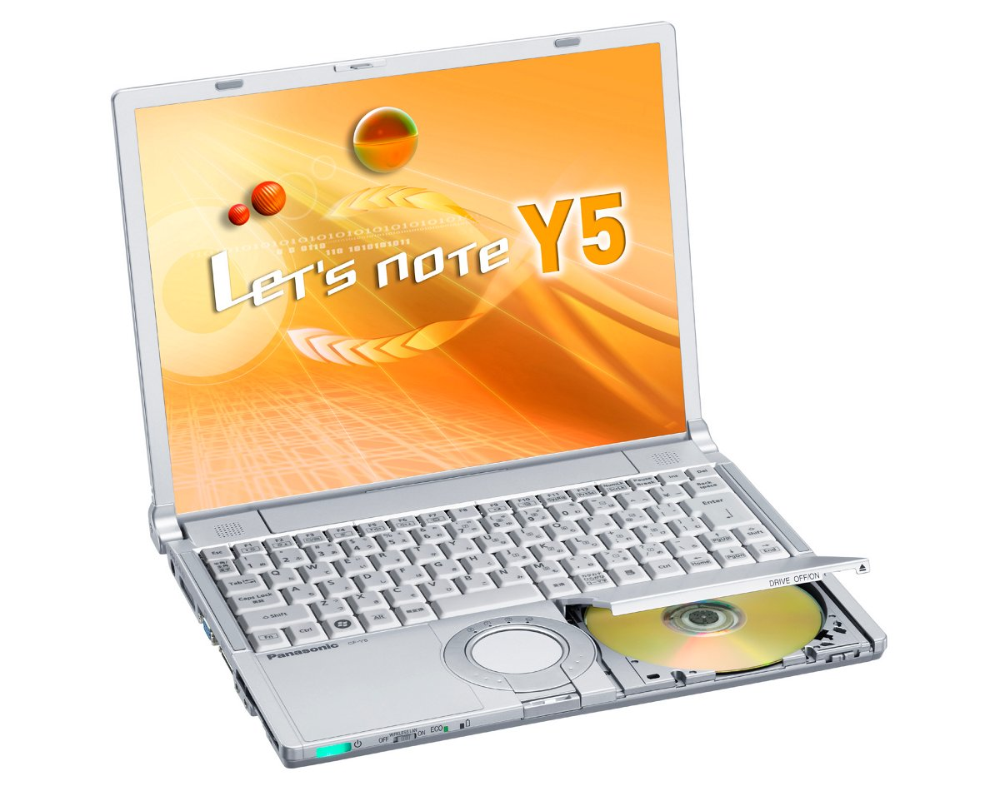
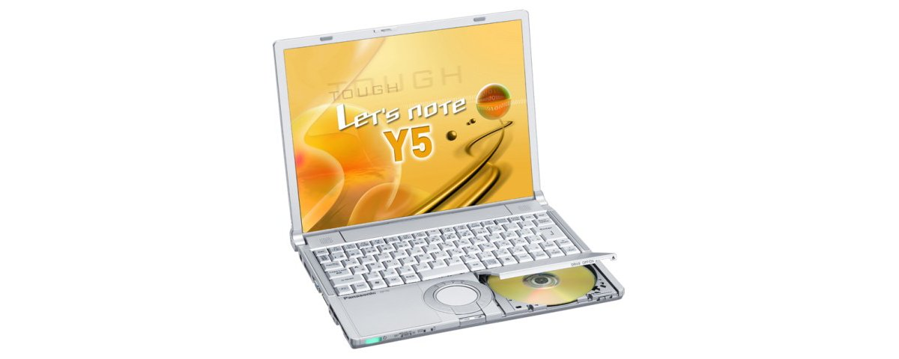
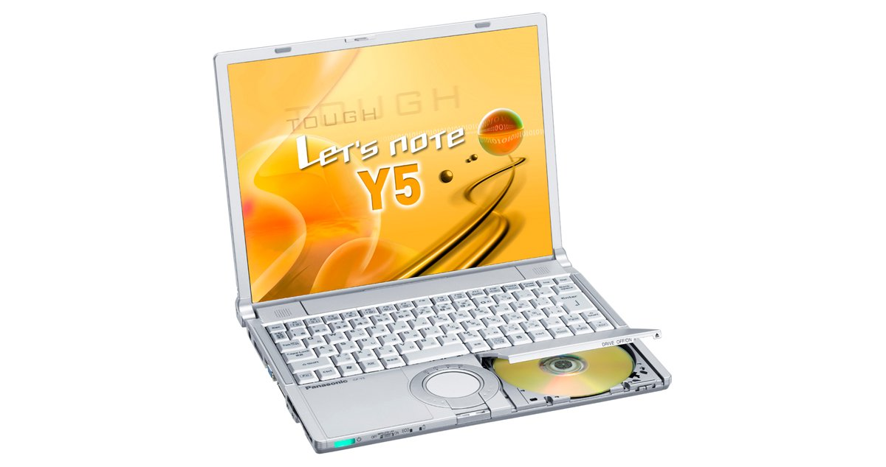

# 松下 Let's note CF-Y5 规格参数

[English](../../en/CF-Y5/) · [日本語](../../ja/CF-Y5/) · **中文**

**CF-Y5** 是松下 Let's note 笔记本电脑，属于 Y5 系列，配备 14.1英寸 SXGA＋ 屏幕。本页收录其全部 3 个型号（2006-05 – 2007-01 发售）的规格参数。每个型号均附官方规格表链接。

*松下 Let's note CF-Y5（CF-Y5MW8AJR）。图片 © Panasonic*

## 型号列表

| 型号（品番） | 发售 | 停产 | 主要规格 |
| :-- | :-- | :-- | :-- |
| [CF-Y5MW8AJR](https://panasonic.jp/pc/p-db/CF-Y5MW8AJR_spec.html) | 2007-01 | 2008-03 | Windows Vista® Business 正規版 、CoreTM Duo L2500(1.83GHz・LV)、メモリー：512MB（最大1.5GB)、HDD：60GB、スーパーマルチドライブ、LAN、無線LAN 802.11a(J52/W52/W53)/b/g、USB2.0 |
| [CF-Y5LW8AXR](https://panasonic.jp/pc/p-db/CF-Y5LW8AXR_spec.html) | 2006-10 | 2006-10 | Windows® XP Professional 正規版 、CoreTM Duo L2400(1.66GHz・LV)、メモリー：512MB（最大1.5GB)、HDD：60GB、スーパーマルチドライブ、LAN、無線LAN 802.11a(J52/W52/W53)/b/g、USB2.0 |
| [CF-Y5KW8AXR](https://panasonic.jp/pc/p-db/CF-Y5KW8AXR_spec.html) | 2006-05 | 2006-08 | Windows® XP Professional 正規版 、CoreTM Duo L2300(1.5GHz・LV)、メモリー：512MB（最大1024MB)、HDD：60GB、スーパーマルチドライブ、LAN、無線LAN 802.11a(J52/W52/W53)/b/g、USB2.0 |

## 通用规格

| 项目 | 规格 |
| :-- | :-- |
| 显示屏 / 色彩 | 1400×1050ドット：約1677万色 |
| 有线网络 | 100BASE-TX / 10BASE-T |
| 卡槽 / SD 卡 | SDメモリーカード×1スロット（著作権保護機能対応）・転送速度 8MB/秒 |
| 指点设备 | ホイールパッド |

## 各型号差异

| 型号（品番） | 处理器 | 内存 | 存储 | 重量 | 续航 |
| :-- | :-- | :-- | :-- | :-- | :-- |
| CF-Y5MW8AJR | Core Duo低電圧版L2500 | 512MB DDR2 SDRAM | 60GB | 1.49 kg | — |
| CF-Y5LW8AXR | Core Duo 低電圧版 L2400 | 512 MB | 60 GB | 1.49 kg | 9 h |
| CF-Y5KW8AXR | Core Duo 低電圧版 L2300 | 512 MB | 60 GB | 1.49 kg | 9 h |

CF-Y5MW8AJR 的全部差异规格

| 项目 | 规格 |
| :-- | :-- |
| 操作系统 | Windows Vista TM Business 正規版 |
| 处理器 | インテル(R) Centrino(R) Duo モバイルテクノロジー / インテル(R) Core TM Duoプロセッサー低電圧版L2500 / 2次キャッシュメモリー2MB、動作周波数1.83GHz、フロントサイド・バス 667MHz |
| 芯片组 | モバイル インテル(R) 945GMS Express チップセット |
| 内存 | 標準512MB DDR2 SDRAM（最大1536MB）空きスロット1 |
| 显存 | 最大64MB（メインメモリーと共用） |
| 硬盘 | 60GB（Ultra ATA100）上記容量のうち約2GBは修復用領域として使用。（ユーザー使用不可） |
| 光驱 | スーパーマルチドライブ内蔵（USB2.0インターフェース接続） / バッファアンダーランエラー防止機能（SmoothLink）搭載 |
| 光驱速度 / 读取 | DVD-RAM2倍速[4.7GB]／1倍速[2.6GB]、DVD-R最大4倍速、DVD-RW 最大4倍速、DVD-ROM 最大8倍速、＋R/+R DL 最大4倍速、＋RW 最大4倍速、CD-ROM 最大24倍速、CD-R 最大24倍速、CD-RW 最大20倍速 |
| 光驱速度 / 写入 | DVD-RAM 2倍速[4.7GB]、DVD-R 最大4倍速、DVD-RW 最大2倍速、＋R 最大4倍速、＋RW 2.4倍速、CD-R 最大24倍速、CD-RW 最大10倍速 |
| 支持光盘 / 读取 | DVD-RAM、DVD-ROM､DVD-Video､DVD-R､DVD-RW、＋R、+R DL、＋RW、CD-Audio､CD-ROM(XA対応)､PhotoCD(マルチセッション対応)､VideoCD､CD-EXTRA､CD-TEXT、CD-R､CD-RW |
| 支持光盘 / 写入 | DVD-RAM、DVD-R、DVD-RW(Ver.1.1/1.2)、＋R、＋RW、CD-R、CD-RW |
| 软驱（选配） | USB接続外付3.5型3モード対応（1.44MB/1.2MB/720KB） |
| 显示屏 | SXGA＋(1400×1050ドット)14.1型TFTカラー液晶 |
| 显示屏 / 外接显示输出 | 800×600/1024×768/1280×768/1280×1024/1400×1050/1600×1200/2048×1536ドット（60Ｈｚ）：約1677万色 |
| 显示屏 / 同时显示 | 800×600/1024×768/1280×768/1280×1024/1400ｘ1050ドット：約1677万色 |
| 无线网络 | インテル(R)PRO/Wireless 3945ABG ネットワーク・コネクション、IEEE802.11a（J52/W52/W53）/b/g準拠、(WPA-AES/TKIP対応、Wi-Fi準拠) |
| 调制解调器 | データ：56kbps（V.90）、FAX：14.4kbps /ボイス非対応 |
| 音频 | PCM音源（16ビットステレオ）/インテル(R) High Definition Audio 準拠、ステレオスピーカー |
| 安全芯片 | ＴＰＭ（TCG V1.2準拠） |
| 卡槽 / PC 卡 | PCカード（TYPEII）×1スロット(CardBus対応、許容電流3.3V：400mA、5V：400mA) |
| 内存扩展槽 | DDR2 172ピン マイクロDIMM専用スロット×1(1.8V/PC2-4200/DDR2 SDRAM) |
| 接口 | USBポート×2（USB2.0）、モデムコネクター（RJ-11）、LANコネクター（RJ-45）、外部ディスプレイコネクター（アナログRGB ミニDsub 15ピン）、ミニポートリプリケーターコネクター（専用50ピン・Y5、R6に搭載） |
| 键盘 | OADG準拠キーボード（86キー）：キーピッチ19mm（縦・横）(一部キーを除く) |
| 电源 | AC100V～240V（50Hz/60Hz）（電源コードは100V専用） / バッテリーパック （10.65Vリチウムイオン・5.7 Ah） |
| 功耗 | 最大約60W |
| 能效 | 2007年度基準Ｉ区分0.00063 |
| 尺寸（宽×深×高） | 幅309.6mm×奥行245.5mm×高さ28mm/44.5mm（前部/後部） |
| 重量（含电池） | 約1490g |
| 预装软件 | Microsoft(R) Internet Explorer7.0、Adobe(R) Reader、DMIビューアー、Microsoft(R) Windows(R) MediaTM Player 11、DirectX 10、Microsoft(R) Windows(R) Movie Maker 6.0、Microsoft(R) .NET Framework3.0、ホイールパッドユーティリティ、hi-hoオンラインサインアップ、ズームビューアー、PC情報ビューアー、NumLockお知らせ、ハードディスクデータ消去ユーティリティ、Wireless Manager mobile edition3.0、無線切り替えユーティリティ、セキュリティ設定ユーティリティ、エコノミーモード（ECO）切り替えユーティリティ、省電力設定ユーティリティ、バッテリー残量表示補正ユーティリティ、Hotkey設定、セットアップユーティリティ、PC-Diagnosticユーティリティ、マカフィー・インターネットセキュリティスイートベーシックエディション、gooスティック、ホイールパッドユーティリティ、B's Recorder GOLD9 BASIC、B's CliP 7、WinDVDTM8(OEM版)CPRM対応、DVD-MovieAlbumSE 4.5、B's DVD Professional2（オーサリングソフト）、オプティカルディスクドライブ文字変更ユーティリティ |
| 附件 | プロダクトリカバリーDVD-ROM、ACアダプター、標準バッテリーパック、Windows Anytime Upgrade DVD、取扱説明書 等 |

官方规格表: <https://panasonic.jp/pc/p-db/CF-Y5MW8AJR_spec.html>

CF-Y5LW8AXR 的全部差异规格

| 项目 | 规格 |
| :-- | :-- |
| 操作系统 | Microsoft(R) Windows(R) XP Professional Service Pack 2 セキュリティ強化機能搭載(NTFSファイルシステム） |
| 处理器 | インテル(R) Centrino(R) Duo モバイル・テクノロジー / インテル(R) Core TM Duo プロセッサー低電圧版 L2400 / （2次キャッシュメモリー 2 MB、動作周波数 1.66 GHｚ、 フロントサイド・バス 667 MHz） |
| 芯片组 | モバイルインテル(R) 945GMS Express チップセット |
| 内存 | 標準512 MB/最大1536 MB (PC2-4200 / DDR2 SDRAM)空きスロット1 |
| 显存 | 最大128MB （メインメモリーと共用） |
| 硬盘 | 60 GB (Ultra ATA100) |
| 光驱 | スーパーマルチドライブ内蔵（USB2.0 インターフェース接続） / バッファアンダーランエラー防止機能（SmoothLink）搭載 |
| 光驱速度 / 读取 | DVD-RAM2倍速（4.7GB）/1倍速（2.6GB）、DVD-R最大4倍速、DVD-RW最大4倍速、DVD-ROM最大8倍速、+R 最大4倍速、+R DL最大4倍速、+RW最大4倍速、 CD-ROM最大24倍速、CD-R最大24倍速、CD-RW最大20倍速 |
| 光驱速度 / 写入 | DVD-RAM2倍速（4.7GB）、DVD-R最大4倍速、DVD-RW最大2倍速、+R 最大4倍速、+RW2.4倍速、CD-R最大24倍速、CD-RW最大10倍速 |
| 支持光盘 / 读取 | DVD-RAM、DVD-ROM、DVD-Video、DVD-R、DVD-RW、 +R、+R DL、+RW、CD-Audio、CD-ROM（XA対応）、PhotoCD（マルチセッション対応）、VideoCD、CD-EXTRA、CD-TEXT、CD-R、CD-RW |
| 支持光盘 / 写入 | DVD-RAM、DVD-R、DVD-RW（Ver.1.1/1.2）、+R、+RW、CD-R、CD-RW |
| 软驱（选配） | USB接続外付3.5型3モード対応(1.44 MB/1.2 MB/720 KB) |
| 显示屏 | SXGA+(1400×1050ドット) 14.1型TFTカラー液晶 |
| 显示屏 / 外接显示输出 | 800×600ドット、1024×768ドット、1280×768ドット、1280×1024ドット、1400×1050ドット、1600×1200ドット、2048×1536ドット（60Hz）：約1677万色 |
| 显示屏 / 同时显示 | 800×600ドット、1024×768ドット、1280×768ドット、1280×1024ドット、1400×1050ドット：約1677万色 |
| 无线网络 | インテル(R) PRO / Wireless 3945 ABG ネットワーク・コネクション IEEE802.11a(J52/W52/W53)/b/g 準拠（WPA-AES/TKIP対応、Wi-Fi準拠） |
| 调制解调器 | データ：56 kbps（V.90）FAX：14.4 kbps / ボイス非対応 |
| 音频 | PCM音源(16ビットステレオ) / インテル(R) High Definition Audio準拠、ステレオスピーカー |
| 安全芯片 | TPM(TCG V1.2準拠) |
| 卡槽 / PC 卡 | PCカード(TYPE II )×1スロット CardBus対応 / 許容電流（3.3 V：400 mA、5 V：400 mA） |
| 内存扩展槽 | DDR2 172ピン マイクロDIMM専用スロット×1（1.8V/PC2-4200/DDR2 SDRAM） |
| 接口 | USBポート×2（USB2.0）、モデムコネクター（RJ-11）、LANコネクター（RJ-45）、外部ディスプレイコネクター（アナログRGB ミニD-sub15ピン）、ミニポートリプリケーターコネクター（専用50ピン）、マイク入力端子（ステレオミニジャックM3（プラグインパワー対応））、オーディオ出力端子（ステレオミニジャックM3） |
| 键盘 | OADG準拠キーボード（86キー）：キーピッチ19mm（横・縦） |
| 电源 | AC100 V～240 V（50 Hz/60 Hz）（電源コードは100 V専用）、バッテリーパック（10.65 Vリチウムイオン・5.7 Ah） |
| 功耗 | 最大約60 W |
| 能效 | S区分 0.00011 |
| 尺寸（宽×深×高） | 幅309.6 mm×奥行245.5 mm×高さ28 mm／44.5 mm（前部／後部） |
| 重量（含电池） | 約1490 g |
| 预装软件 | Microsoft(R) Internet Explorer 6 Service Pack 2、 Adobe Reader、DMIビューアー、Microsoft(R) Windows(R) Media Player 10、DirectX 9.0c、Microsoft(R) Windows(R) Movie Maker 2.1、Microsoft(R) .NET Framework 1.1 SP1/2.0、ネットセレクター、SDユーティリティ、ホイールパッドユーティリティ、Hotkey設定、gooスティック、セットアップユーティリティ、hi-hoオンラインサインアップ、フォントサイズ拡大ユーティリティ、ズームビューアー、PC情報ビューアー、NumLockお知らせ、ハードディスクデータ消去ユーティリティ、Wireless Manager mobile edition 3.0、マカフィー(R)・ウイルススキャン◆、無線切り替えユーティリティ、セキュリティ設定ユーティリティ、エコノミーモード(ECO）切り替えユーティリティ、バッテリー残量表示補正ユーティリティ、Infineon TPM Professional Package V2.5 SP1、B's Recorder GOLD8 BASIC◆、B's CLiP 6◆、Win DVD 5（OEM版）CPRM対応◆、省電力設定ユーティリティ、オプティカルディスクドライブ文字変更ユーティリティ、オプティカルディスクドライブ省電力ユーティリティ、DVD-MovieAlbum SE 4.1、B's DVD Expert（オーサリングソフト）◆、PC-Diagnosticユーティリティ / ワープロ、表計算等のアプリケーションソフトは導入されておりません。 |
| 附件 | プロダクトリカバリーDVD-ROM、ACアダプター、バッテリーパック、取扱説明書 等 |
| 能效达成率 | — |
| 电池 | 駆動時間※JEITAバッテリー動作時間測定法(Ver.1.0)による駆動時間。エコノミーモード（ECO）無効時。エコノミーモード（ECO）有効に設定している時の駆動時間は、無効時の約8割になります。バッテリー駆動時間は、動作環境・液晶の輝度・システム設定により変動します。※）：約9時間 / 充電時間：約5時間(電源OFF時)、約6.5時間(電源ON時) |

官方规格表: <https://panasonic.jp/pc/p-db/CF-Y5LW8AXR_spec.html>

CF-Y5KW8AXR 的全部差异规格

| 项目 | 规格 |
| :-- | :-- |
| 操作系统 | Microsoft(R) Windows(R) XP Professional Service Pack 2 セキュリティ強化機能搭載(NTFSファイルシステム） |
| 处理器 | インテル(R) Centrino(R) Duo モバイル・テクノロジー / インテル(R) Core TM Duo プロセッサー低電圧版 L2300(1.50 GHｚ) / （2次キャッシュメモリー 2 MB、動作周波数 1.50 GHｚ、 フロントサイド・バス 667 MHz） |
| 芯片组 | モバイルインテル(R) 945GMS Express チップセット |
| 内存 | 標準512 MB/最大1024 MB (PC2-4200 / DDR2 SDRAM) |
| 显存 | 最大128MB （メインメモリーと共用） |
| 硬盘 | 60 GB (Ultra ATA100)（2.5型） |
| 光驱 | スーパーマルチドライブ内蔵（USB2.0 インターフェース接続） / バッファアンダーランエラー防止機能（SmoothLink）搭載 |
| 光驱速度 / 读取 | DVD-RAM 2倍速（4.7GB）/1倍速（2.6GB）、DVD-R最大4倍速、DVD-RW最大4倍速、DVD-ROM最大8倍速、+R 最大4倍速、+R DL最大4倍速、+RW最大4倍速、 CD-ROM最大24倍速、CD-R最大24倍速、CD-RW最大20倍速 |
| 光驱速度 / 写入 | DVD-RAM 2倍速（4.7GB）、DVD-R最大4倍速、DVD-RW最大2倍速、+R 最大4倍速、+RW2.4倍速、CD-R最大24倍速、CD-RW最大10倍速 |
| 支持光盘 / 读取 | DVD-RAM 、DVD-ROM、DVD-Video、DVD-R 、DVD-RW、 +R、+R DL、+RW、CD-Audio、CD-ROM（XA対応）、PhotoCD（マルチセッション対応）、VideoCD、CD-EXTRA、CD-TEXT、CD-R、CD-RW |
| 支持光盘 / 写入 | DVD-RAM、DVD-R、DVD-RW（Ver.1.1/1.2）、+R、+RW、CD-R、CD-RW |
| 软驱（选配） | USB接続外付3.5型3モード対応(1.44 MB/1.2 MB/720 KB) |
| 显示屏 | SXGA+(1400×1050ドット) 14.1型TFTカラー液晶 |
| 显示屏 / 外接显示输出 | 800×600ドット、1024×768ドット、1280×768ドット、1280×1024ドット、1400×1050ドット、1600×1200ドット、2048×1536ドット（60Hz）：約1677万色 |
| 显示屏 / 同时显示 | 800×600ドット、1024×768ドット、1280×768ドット、1280×1024ドット、1400×1050ドット：約1677万色 |
| 无线网络 | インテル(R) PRO / Wireless 3945 ABG ネットワーク・コネクション IEEE802.11a(J52/W52/W53)/b/g 準拠 （WPA-AES/TKIP対応、Wi-Fi準拠） |
| 调制解调器 | データ：56 kbps（V.90） FAX：14.4 kbps / ボイス非対応 |
| 音频 | PCM音源(16ビットステレオ)、ステレオスピーカー |
| 安全芯片 | TPM(TCG V1.2準拠) |
| 卡槽 / PC 卡 | PCカード(TYPE II )×1スロット CardBus対応 / 許容電流（3.3 V：400 mA、5 V：400 mA） |
| 内存扩展槽 | DDR2 172ピン マイクロDIMM専用スロット×1（1.8V/PC2-4200/DDR2 SDRAM） |
| 接口 | USBポート×2（USB2.0）、モデムコネクター（RJ-11）、LANコネクター（RJ-45）、外部ディスプレイコネクター（アナログRGB ミニDsub15ピン）、ミニポートリプリケーターコネクター（専用50ピン） |
| 键盘 | OADG準拠キーボード（86キー）：キーピッチ19mm（横・縦） |
| 电源 | AC100 V～240 V（50 Hz/60 Hz）（電源コードは100 V専用） / バッテリーパック（10.65 Vリチウムイオン・5.7 Ah） |
| 功耗 | 最大約60 W |
| 能效 | S区分 0.000097 |
| 重量（含电池） | 約1490 g |
| 预装软件 | Microsoft(R) Internet Explorer 6 Service Pack 2、Adobe Reader、DMIビューアー、Microsoft(R) Windows(R) Media Player 10、DirectX 9.0c、Microsoft(R) Windows(R) Movie Maker 2.1、Microsoft(R) .NET Framework 1.1、ネットセレクター、SDユーティリティ、ホイールパッドユーティリティ、Hotkey設定、gooスティック、セットアップユーティリティ、hi-hoオンラインサインアップ、フォントサイズ拡大ユーティリティ、ズームビューアー、PC情報ビューアー、NumLockお知らせ、ハードディスクデータ消去ユーティリティ、Wireless Manager mobile edition 2.0、マカフィー(R)・ウイルススキャン◆、無線切り替えユーティリティ、セキュリティ設定ユーティリティ、エコノミーモード(ECO）切り替えユーティリティ、バッテリー残量表示補正ユーティリティ、Infineon TPM Professional Package V2.5、B's Recorder GOLD8 BASIC◆、B's CLiP 6◆、Win DVD 5（OEM版）CPRM対応◆、省電力設定ユーティリティ、オプティカルディスクドライブ文字変更ユーティリティ、オプティカルディスクドライブ省電力ユーティリティ、DVD-MovieAlbum SE 4.1、B's DVD Expert（オーサリングソフト）◆、PC-Diagnosticユーティリティ / ワープロ、表計算等のアプリケーションソフトは導入されておりません。 |
| 附件 | プロダクトリカバリーDVD-ROM、ACアダプター、バッテリーパック、取扱説明書 等 |
| 能效达成率 | — |
| 电池 | 駆動時間：約9時間 / 充電時間：約5時間(電源OFF時)、約6.5時間(電源ON時) |
| 尺寸（不含凸起部分） | 幅309.6 mm×奥行245.5 mm×高さ28 mm／44.5 mm（前部／後部） |

官方规格表: <https://panasonic.jp/pc/p-db/CF-Y5KW8AXR_spec.html>

## 图片

*松下 Let's note CF-Y5（CF-Y5LW8AXR）。图片 © Panasonic*

*松下 Let's note CF-Y5（CF-Y5KW8AXR）。图片 © Panasonic*

## 相关机型

- [Let's note 全部机型](../)

---

来源：松下官方[停产产品列表](https://panasonic.jp/pc/support/products/)及各型号规格表（panasonic.jp）。规格数值保留官方日文原文。产品图片 © Panasonic。本页为非官方整理，与松下公司无关。
