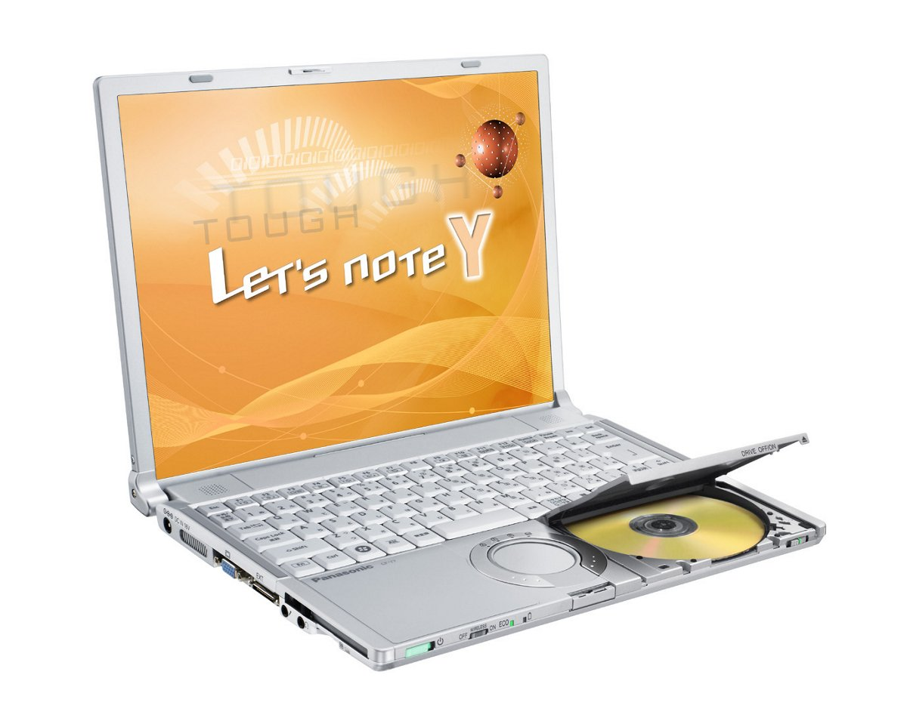
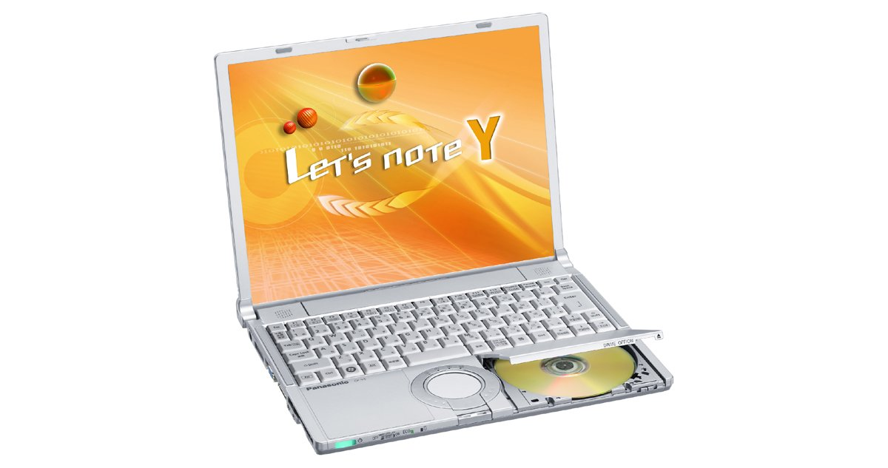

# 松下 Let's note CF-Y7 规格参数

[English](../../en/CF-Y7/) · [日本語](../../ja/CF-Y7/) · **中文**

**CF-Y7** 是松下 Let's note 笔记本电脑，属于 Y7 系列，配备 14.1英寸 SXGA＋ 屏幕。本页收录其全部 8 个型号（2007-05 – 2008-05 发售）的规格参数。每个型号均附官方规格表链接。

*松下 Let's note CF-Y7（CF-Y7DWJAJR, CF-Y7DWJNJR, CF-Y7CWHAJR, CF-Y7CWHNJR …）。图片 © Panasonic*

## 型号列表

| 型号（品番） | 发售 | 停产 | 主要规格 |
| :-- | :-- | :-- | :-- |
| [CF-Y7DWJAJR](https://panasonic.jp/pc/p-db/CF-Y7DWJAJR_spec.html) | 2008-05 | 2009-01 | Windows Vista® Business with SP1 正版 、英特尔® CoreTM2 Duo L7800（2GHz）、内存：标配1GB（最大2GB）、HDD：120GB、超级多驱动器、LAN、无线LAN 802.11a(J52/W52/W53/W56)/b/g、USB2.0 |
| [CF-Y7DWJNJR](https://panasonic.jp/pc/p-db/CF-Y7DWJNJR_spec.html) | 2008-05 | 2009-01 | Windows Vista® Business with SP1 正版 、英特尔® CoreTM2 Duo L7800（2GHz）、内存：标配1GB（最大2GB）、HDD：120GB、14.1英寸SXGA+（1400×1050像素）、超级多驱动器、LAN、无线LAN 802.11a(J52/W52/W53/W56)/b/g、USB2.0、Office Personal ＜数量限定＞ |
| [CF-Y7CWHAJR](https://panasonic.jp/pc/p-db/CF-Y7CWHAJR_spec.html) | 2008-02 | 2008-04 | Windows Vista® Business 正版 、CoreTM2 Duo L7700（1.80GHz・LV）、内存：1GB（最大2GB）、HDD：80GB、超级多功能驱动器、LAN、无线LAN 802.11a(J52/W52/W53/W56)/b/g、USB2.0 |
| [CF-Y7CWHNJR](https://panasonic.jp/pc/p-db/CF-Y7CWHNJR_spec.html) | 2008-02 | 2008-04 | Windows Vista® Business正版 、CoreTM2 Duo L7700（1.80GHz・LV）、内存：1GB（最大2GB）、HDD：80GB、超级多功能驱动器、LAN、无线LAN 802.11a(J52/W52/W53/W56)/b/g、USB2.0、Office Personal ＜数量限定＞ |
| [CF-Y7BWHAJR](https://panasonic.jp/pc/p-db/CF-Y7BWHAJR_spec.html) | 2007-10 | 2008-01 | Windows Vista® Business 正版 、CoreTM2 Duo L7500(1.60GHz・LV)、内存：1GB DDR2 SDRAM、HDD：80GB、超级多功能驱动器、LAN、无线LAN 802.11a(J52/W52/W53/W56)/b/g、USB2.0 |
| [CF-Y7BWHNJR](https://panasonic.jp/pc/p-db/CF-Y7BWHNJR_spec.html) | 2007-10 | 2008-01 | Windows Vista® Business正版 、CoreTM2 Duo L7500(1.60GHz・LV)、内存：1GB DDR2 SDRAM、HDD：80GB、超级多功能驱动器、LAN、无线LAN 802.11a(J52/W52/W53/W56)/b/g、USB2.0、Office Personal ＜数量限定＞ |
| [CF-Y7AWDPJR](https://panasonic.jp/pc/p-db/CF-Y7AWDPJR_spec.html) | 2007-06 | 2008-03 | Windows Vista® Business正版 、CoreTM2 Duo L7300(1.4GHz・LV)、内存：1GB DDR2 SDRAM、HDD：80GB、超级多功能驱动器、LAN、无线LAN 802.11a(J52/W52/W53)/b/g、USB2.0、Office Personal ＜数量限定＞ |
| [CF-Y7AWDBJR](https://panasonic.jp/pc/p-db/CF-Y7AWDBJR_spec.html) | 2007-05 | 2008-03 | Windows Vista® Business 正版 、CoreTM2 Duo L7300(1.4GHz・LV)、内存：1GB DDR2 SDRAM、HDD：80GB、超级多功能驱动器、LAN、无线LAN 802.11a(J52/W52/W53)/b/g、USB2.0 |

## 通用规格

| 项目 | 规格 |
| :-- | :-- |
| 光驱速度 / 写入 | DVD-RAM 2倍速[4.7GB]、DVD-R 最大4倍速、DVD-RW 最大2倍速、＋R 最大4倍速、＋RW 2.4倍速、CD-R 最大24倍速、CD-RW 最大10倍速 |
| 软驱（选配） | USB连接外置3.5英寸3模式对应（1.44MB/1.2MB/720KB） |
| 显示屏 / 色彩 | 1400×1050像素：约1677万色 |
| 调制解调器 | 数据：56kbps（V.90） FAX：14.4kbps /不支持语音 |
| 安全芯片 | TPM（符合TCG V1.2） |
| 键盘 | OADG标准键盘（86键）：键距19mm（纵向和横向）（部分按键除外） |
| 指点设备 | 滚轮触控板 |
| 功耗 | 最大约60W |
| 能效达成率 | — |

## 各型号差异

| 型号（品番） | 处理器 | 内存 | 存储 | 重量 | 续航 |
| :-- | :-- | :-- | :-- | :-- | :-- |
| CF-Y7DWJAJR | — | 1GB DDR2 SDRAM | 120GB | 1.51 kg | — |
| CF-Y7DWJNJR | — | 1GB DDR2 SDRAM | 120GB | — | — |
| CF-Y7CWHAJR | — | 1GB DDR2 SDRAM | 80GB | 1.51 kg | — |
| CF-Y7CWHNJR | — | 1GB DDR2 SDRAM | 80GB | 1.51 kg | — |
| CF-Y7BWHAJR | — | 1GB DDR2 SDRAM | 80GB | 1.51 kg | — |
| CF-Y7BWHNJR | — | 1GB DDR2 SDRAM | 80GB | 1.51 kg | — |
| CF-Y7AWDPJR | Core 2 Duo 低电压版 L7300 | 1GB DDR2 SDRAM | 80GB | 1.52 kg | — |
| CF-Y7AWDBJR | Core 2 Duo 低电压版 L7300 | 1GB DDR2 SDRAM | 80GB | 1.52 kg | — |

CF-Y7DWJAJR 的全部差异规格

| 项目 | 规格 |
| :-- | :-- |
| 操作系统 | Windows Vista（R） Business with Service Pack 1 正版（含Windows（R） XP降级权） |
| 处理器 | 英特尔（R） Centrino（R） 处理器技术 / 英特尔（R） CoreTM2 Duo / 处理器 低电压版 Ｌ7800 / 二级缓存 4MB、工作频率 2GHz、前端总线 800MHz |
| 芯片组 | 移动 英特尔(R) GM965 Express 芯片组 |
| 内存 | 标准1GB DDR2 SDRAM（最大2GB）空插槽1 |
| 显存 | 最大251MB / 内存扩展时最大358MB（与主内存共享） |
| 硬盘 | 120GB（Serial ATA）上述容量中约2GB用作修复用区域（用户不可使用） |
| 光驱 | 内置超级多功能驱动器、配备缓冲区欠载错误防止功能（SmoothLink） |
| 光驱速度 / 读取 | DVD-RAM ２倍速[4.7GB]/1倍速[2.6GB]、DVD-R 最大4倍速、DVD-RW 最大4倍速、DVD-ROM 最大8倍速、＋R 最大4倍速、+R DL 最大4倍速、＋RW 最大4倍速、CD-ROM 最大24倍速、CD-R 最大24倍速、CD-RW 最大20倍速 |
| 支持光盘 / 读取 | DVD-RAM、DVD-ROM、DVD-Video、DVD-R、DVD-RW、＋R、+R DL、＋RW、CD-Audio、CD-R、CD-ROM（支持XA）、PhotoCD（支持多区段）、VideoCD、CD-EXTRA、CD-TEXT、CD-RW |
| 支持光盘 / 写入 | DVD-RAMDVD-R、DVD-RW、＋R、＋RW、CD-R、CD-RW |
| 显示屏 | SXGA+(1400×1050像素) / 14.1英寸TFT彩色液晶 |
| 显示屏 / 外接显示输出 | 800×600、1024×768、1280×768、1280×1024、1400×1050、1440×900、1600×1200像素：约1677万色 |
| 显示屏 / 同时显示 | 800×600、1024×768、1280×768、1280×1024、1400ｘ1050像素：约1677万色 |
| 无线网络 | 英特尔（R） Wireless WiFi Link 4965AGN、符合IEEE802.11a（J52/W52/W53/W56）/b/g、（支持WPA-AES/TKIP、符合Wi-Fi） |
| 有线网络 | 1000BASE-T/100BASE-TX / 10BASE-T |
| 音频 | PCM音源（24位立体声）、英特尔（R） High Definition Audio 标准、立体声扬声器 |
| 卡槽 / PC 卡 | PC卡（TYPEⅡ）×1插槽（支持 CardBus、允许电流 3.3V：400mA、5V：400mA） |
| 卡槽 / SD 卡 | SD存储卡×1插槽（SDHC存储卡/支持版权保护技术） |
| 内存扩展槽 | DDR2 172针微型DIMM专用插槽×1 |
| 接口 | USB端口×2（USB2.0）、调制解调器接口（RJ-11）、LAN接口（RJ-45）、 / 外部显示器接口（模拟RGB mini Dsub 15针）、迷你端口复制器接口（专用50针） |
| 电源 | AC适配器 输入：AC100V～240V（50Hz/60Hz）（电源线仅限100V专用） / 电池组（10.65V锂离子・5.7 Ah） |
| 能效 | 2007年度基准Ｉ区分0.00023 |
| 尺寸（宽×深×高） | 宽309.6mm×深245.5mm×高28mm/44.5mm（前部/后部） |
| 重量（含电池） | 约1.51kg |
| 预装软件 | Microsoft（R） Internet Explorer7.0、Adobe（R） Reader、DMI查看器、Microsoft（R） Windows（R） Media Player 11、DirectX 10、Microsoft（R）Windows（R） Movie Maker 6.0、Microsoft（R） .NET Framework3.0、缩放查看器、PC信息查看器、PC信息弹出通知、NumLock通知、Wireless Manager mobile edition4.5、无线切换实用程序、安全设置实用程序、Infineon TPM Professional Package V3.0 SP2HF2、经济模式（ECO）切换实用程序、省电设置实用程序、电池剩余电量显示校正实用程序、Hotkey设置、McAfee・互联网安全套件基础版、goo棒、硬盘数据擦除实用程序、设置实用程序、PC-Diagnostic实用程序、滚轮触摸板实用程序、网络选择器2、LAN省电实用程序、风扇控制实用程序、Fn Ctrl功能互换实用程序 / 光盘驱动器盘符更改实用程序、光盘驱动器省电实用程序、B's Recorder GOLD9 BASIC◆、B's CliP7◆、WinDVDTM8(OEM版)CPRM对应◆、DVD-MovieAlbumSE 4.5、B's DVD Professional2（创作软件）◆ |
| 附件 | 产品恢复DVD-ROM 2张（用于Windows Vista(R)/用于Windows(R) XP）、AC适配器、电池组、使用说明书 等 |

官方规格表: <https://panasonic.jp/pc/p-db/CF-Y7DWJAJR_spec.html>

CF-Y7DWJNJR 的全部差异规格

| 项目 | 规格 |
| :-- | :-- |
| 操作系统 | Windows Vista（R） Business with Service Pack 1 正版（含Windows（R） XP降级权） |
| 处理器 | 英特尔（R） Centrino（R） 处理器技术 / 英特尔（R） CoreTM2 Duo / 处理器 低电压版 Ｌ7800 / 二级缓存 4MB、 / 工作频率 2GHz、 / 前端总线 800MHz |
| 芯片组 | 移动 英特尔(R) GM965 Express 芯片组 |
| 内存 | 标准1GB DDR2 SDRAM（最大2GB）空插槽1 |
| 显存 | 最大251MB / 内存扩展时最大358MB（与主内存共享） |
| 硬盘 | 120GB（Serial ATA）上述容量中约2GB用作修复用区域（用户不可使用） |
| 光驱 | 内置超级多功能驱动器、配备缓冲区欠载错误防止功能（SmoothLink） |
| 光驱速度 / 读取 | DVD-RAM ２倍速[4.7GB]/1倍速[2.6GB]、DVD-R 最大4倍速、DVD-RW 最大4倍速、DVD-ROM 最大8倍速、＋R 最大4倍速、+R DL 最大4倍速、＋RW 最大4倍速、CD-ROM 最大24倍速、CD-R 最大24倍速、CD-RW 最大20倍速 |
| 支持光盘 / 读取 | DVD-RAM、DVD-ROM、DVD-Video、DVD-R、DVD-RW、＋R、+R DL、＋RW、CD-Audio、CD-R、CD-ROM（支持XA）、PhotoCD（支持多区段）、VideoCD、CD-EXTRA、CD-TEXT、CD-RW |
| 支持光盘 / 写入 | DVD-RAMDVD-R、DVD-RW、＋R、＋RW、CD-R、CD-RW |
| 显示屏 | SXGA+(1400×1050像素)14.1英寸TFT彩色液晶 |
| 显示屏 / 外接显示输出 | 800×600、1024×768、1280×768、1280×1024、1400×1050、1440×900、1600×1200像素：约1677万色 |
| 显示屏 / 同时显示 | 800×600、1024×768、1280×768、1280×1024、1400ｘ1050像素：约1677万色 |
| 无线网络 | 英特尔（R） Wireless WiFi Link 4965AGN、符合IEEE802.11a（J52/W52/W53/W56）/b/g、（支持WPA-AES/TKIP、符合Wi-Fi） |
| 有线网络 | 1000BASE-T/100BASE-TX / 10BASE-T |
| 音频 | PCM音源（24位立体声）、英特尔（R） High Definition Audio 标准、立体声扬声器 |
| 卡槽 / PC 卡 | PC卡（TYPEⅡ）×1插槽（支持 CardBus、允许电流 3.3V：400mA、5V：400mA） |
| 卡槽 / SD 卡 | SD存储卡×1插槽（SDHC存储卡/支持版权保护技术） |
| 内存扩展槽 | DDR2 172针微型DIMM专用插槽×1 |
| 接口 | USB端口×2（USB2.0）、调制解调器接口（RJ-11）、LAN接口（RJ-45）、 / 外部显示器接口（模拟RGB mini Dsub 15针）、迷你端口复制器接口（专用50针） |
| 电源 | AC适配器 输入：AC100V～240V（50Hz/60Hz）（电源线仅限100V专用） / 电池组（10.65V锂离子・5.7 Ah） |
| 能效 | 2007年度基准Ｉ区分0.00023 |
| 尺寸（宽×深×高） | 宽309.6mm×深245.5mm×高28mm/44.5mm（前部/后部） |
| 重量（含电池） | 约1.51kg |
| 预装软件 | Microsoft（R） Internet Explorer7.0、Adobe（R） Reader、DMI查看器、Microsoft（R） Windows（R） Media Player 11、DirectX 10、Microsoft（R）Windows（R） Movie Maker 6.0、Microsoft（R） .NET Framework3.0、缩放查看器、PC信息查看器、PC信息弹出通知、NumLock通知、Wireless Manager mobile edition4.5、无线切换实用程序、安全设置实用程序、Infineon TPM Professional Package V3.0 SP2HF2、经济模式（ECO）切换实用程序、省电设置实用程序、电池剩余电量显示校正实用程序、Hotkey设置、McAfee・互联网安全套件基础版、goo棒、硬盘数据擦除实用程序、设置实用程序、PC-Diagnostic实用程序、滚轮触摸板实用程序、网络选择器2、LAN省电实用程序、风扇控制实用程序、Fn Ctrl功能互换实用程序 / 光盘驱动器盘符更改实用程序、光盘驱动器省电实用程序、B's Recorder GOLD9 BASIC◆、B's CliP71◆、WinDVDTM8(OEM版)CPRM对应◆、DVD-MovieAlbumSE 4.5、B's DVD Professional2（创作软件）◆、Microsoft（R） Office Personal 2007withPowerPoint 2007 |
| 附件 | 产品恢复DVD-ROM 2张（用于Windows Vista(R)/用于Windows(R) XP）、AC适配器、电池组、使用说明书 等 |

官方规格表: <https://panasonic.jp/pc/p-db/CF-Y7DWJNJR_spec.html>

CF-Y7CWHAJR 的全部差异规格

| 项目 | 规格 |
| :-- | :-- |
| 操作系统 | Windows Vista（R） Business 正版（含Windows（R） XP降级权） |
| 处理器 | 英特尔（R） Centrino（R） Duo 处理器技术 / 英特尔（R） CoreTM2 Duo / 处理器 低电压版 Ｌ7700 / 二级缓存 4MB、工作频率 1.80GHz、前端总线 800MHz |
| 芯片组 | 移动 英特尔(R) GM965 Express 芯片组 |
| 内存 | 标准1GB DDR2 SDRAM（最大2GB）空插槽1 |
| 显存 | 最大251MB / 内存扩展时最大358MB（与主内存共享） |
| 硬盘 | 80GB（Serial ATA）上述容量中约2GB用作修复用区域（用户不可使用） |
| 光驱 | 内置超级多功能驱动器、配备缓冲区欠载错误防止功能（SmoothLink） |
| 光驱速度 / 读取 | DVD-RAM ２倍速[4.7GB]/1倍速[2.6GB]、DVD-R 最大4倍速、DVD-RW 最大4倍速、DVD-ROM 最大8倍速、＋R 最大4倍速、+R DL 最大4倍速、＋RW 最大4倍速、CD-ROM 最大24倍速、CD-R 最大24倍速、CD-RW 最大20倍速 |
| 支持光盘 / 读取 | DVD-RAM、DVD-ROM、DVD-Video、DVD-R、DVD-RW、＋R、+R DL、＋RW、CD-Audio、CD-R、CD-ROM（支持XA）、PhotoCD（支持多区段）、VideoCD、CD-EXTRA、CD-TEXT、CD-RW |
| 支持光盘 / 写入 | DVD-RAMDVD-R、DVD-RW、＋R、＋RW、CD-R、CD-RW |
| 显示屏 | SXGA+(1400×1050像素) / 14.1英寸TFT彩色液晶 |
| 显示屏 / 外接显示输出 | 800×600、1024×768、1280×768、1280×1024、1400×1050、1440×900、1600×1200像素：约1677万色 |
| 显示屏 / 同时显示 | 800×600、1024×768、1280×768、1280×1024、1400ｘ1050像素：约1677万色 |
| 无线网络 | 英特尔（R） Wireless WiFi Link 4965AGN、符合IEEE802.11a（J52/W52/W53/W56）/b/g、（支持WPA-AES/TKIP、符合Wi-Fi） |
| 有线网络 | 1000BASE-T/100BASE-TX / 10BASE-T |
| 音频 | PCM音源（24位立体声）、英特尔（R） High Definition Audio 标准、立体声扬声器 |
| 卡槽 / PC 卡 | PC卡（TYPEⅡ）×1插槽（支持 CardBus、允许电流 3.3V：400mA、5V：400mA） |
| 卡槽 / SD 卡 | SD存储卡×1插槽（SDHC存储卡/支持版权保护功能） |
| 内存扩展槽 | DDR2 172针微型DIMM专用插槽×1 |
| 接口 | USB端口×2（USB2.0）、调制解调器接口（RJ-11）、LAN接口（RJ-45）、 / 外部显示器接口（模拟RGB mini Dsub 15针）、迷你端口复制器接口（专用50针） |
| 电源 | AC适配器 输入：AC100V～240V（50Hz/60Hz）（电源线仅限100V专用） / 电池组（10.65V锂离子・5.7 Ah） |
| 能效 | 2007年度基准Ｉ区分0.00026 |
| 尺寸（宽×深×高） | 宽309.6mm×深245.5mm×高28mm/44.5mm（前部/后部） |
| 重量（含电池） | 约1510g |
| 预装软件 | Microsoft（R） Internet Explorer7.0、Adobe（R） Reader、DMI查看器、Microsoft（R） Windows（R） Media Player 11、DirectX 10、Microsoft（R）Windows（R） Movie Maker 6.0、Microsoft（R） .NET Framework3.0、缩放查看器、PC信息查看器、PC信息弹出通知实用程序、NumLock通知、Wireless Manager mobile edition4.5、无线切换实用程序、安全设置实用程序、Infineon TPM Professional Package V3.0 SP2、经济模式（ECO）切换实用程序、省电设置实用程序、电池剩余电量显示校正实用程序、Hotkey设置、McAfee・互联网安全套件基础版、goo棒、硬盘数据擦除实用程序、设置实用程序、PC-Diagnostic实用程序、滚轮触摸板实用程序、网络选择器2、LAN省电实用程序、风扇控制实用程序、Fn Ctrl功能互换实用程序 / 光盘驱动器盘符更改实用程序、光盘驱动器省电实用程序、B's Recorder GOLD9 BASIC、B's CliP7、WinDVDTM8(OEM版)CPRM对应、DVD-MovieAlbumSE 4.5、B's DVD Professional2（创作软件） |
| 附件 | 产品恢复DVD-ROM 2张（用于Windows Vista(R)/用于Windows(R) XP）、AC适配器、电池组、使用说明书 等 |

官方规格表: <https://panasonic.jp/pc/p-db/CF-Y7CWHAJR_spec.html>

CF-Y7CWHNJR 的全部差异规格

| 项目 | 规格 |
| :-- | :-- |
| 操作系统 | Windows Vista（R） Business 正版（含Windows（R） XP降级权） |
| 处理器 | 英特尔（R） Centrino（R） Duo 处理器技术 / 英特尔（R） CoreTM2 Duo / 处理器 低电压版 Ｌ7700 / 二级缓存 4MB、 / 工作频率 1.80GHz、 / 前端总线 800MHz |
| 芯片组 | 移动 英特尔(R) GM965 Express 芯片组 |
| 内存 | 标准1GB DDR2 SDRAM（最大2GB）空插槽1 |
| 显存 | 最大251MB / 内存扩展时最大358MB（与主内存共享） |
| 硬盘 | 80GB（Serial ATA）上述容量中约2GB用作修复用区域（用户不可使用） |
| 光驱 | 内置超级多功能驱动器、配备缓冲区欠载错误防止功能（SmoothLink） |
| 光驱速度 / 读取 | DVD-RAM ２倍速[4.7GB]/1倍速[2.6GB]、DVD-R 最大4倍速、DVD-RW 最大4倍速、DVD-ROM 最大8倍速、＋R 最大4倍速、+R DL 最大4倍速、＋RW 最大4倍速、CD-ROM 最大24倍速、CD-R 最大24倍速、CD-RW 最大20倍速 |
| 支持光盘 / 读取 | DVD-RAM、DVD-ROM、DVD-Video、DVD-R、DVD-RW、＋R、+R DL、＋RW、CD-Audio、CD-R、CD-ROM（支持XA）、PhotoCD（支持多区段）、VideoCD、CD-EXTRA、CD-TEXT、CD-RW |
| 支持光盘 / 写入 | DVD-RAMDVD-R、DVD-RW、＋R、＋RW、CD-R、CD-RW |
| 显示屏 | SXGA+(1400×1050像素)14.1英寸TFT彩色液晶 |
| 显示屏 / 外接显示输出 | 800×600、1024×768、1280×768、1280×1024、1400×1050、1440×900、1600×1200像素：约1677万色 |
| 显示屏 / 同时显示 | 800×600、1024×768、1280×768、1280×1024、1400ｘ1050像素：约1677万色 |
| 无线网络 | 英特尔（R） Wireless WiFi Link 4965AGN、符合IEEE802.11a（J52/W52/W53/W56）/b/g、（支持WPA-AES/TKIP、符合Wi-Fi） |
| 有线网络 | 1000BASE-T/100BASE-TX / 10BASE-T |
| 音频 | PCM音源（24位立体声）、英特尔（R） High Definition Audio 标准、立体声扬声器 |
| 卡槽 / PC 卡 | PC卡（TYPEⅡ）×1插槽（支持 CardBus、允许电流 3.3V：400mA、5V：400mA） |
| 卡槽 / SD 卡 | SD存储卡×1插槽（SDHC存储卡/支持版权保护功能） |
| 内存扩展槽 | DDR2 172针微型DIMM专用插槽×1 |
| 接口 | USB端口×2（USB2.0）、调制解调器接口（RJ-11）、LAN接口（RJ-45）、 / 外部显示器接口（模拟RGB mini Dsub 15针）、迷你端口复制器接口（专用50针） |
| 电源 | AC适配器 输入：AC100V～240V（50Hz/60Hz）（电源线仅限100V专用） / 电池组（10.65V锂离子・5.7 Ah） |
| 能效 | 2007年度基准Ｉ区分0.00026 |
| 尺寸（宽×深×高） | 宽309.6mm×深245.5mm×高28mm/44.5mm（前部/后部） |
| 重量（含电池） | 约1510g |
| 预装软件 | Microsoft（R） Internet Explorer7.0、Adobe（R） Reader、DMI查看器、Microsoft（R） Windows（R） Media Player 11、DirectX 10、Microsoft（R）Windows（R） Movie Maker 6.0、Microsoft（R） .NET Framework3.0、缩放查看器、PC信息查看器、PC信息弹出通知实用程序、NumLock通知、Wireless Manager mobile edition4.5、无线切换实用程序、安全设置实用程序、Infineon TPM Professional Package V3.0 SP2、经济模式（ECO）切换实用程序、省电设置实用程序、电池剩余电量显示校正实用程序、Hotkey设置、McAfee・互联网安全套件基础版、goo棒、硬盘数据擦除实用程序、设置实用程序、PC-Diagnostic实用程序、滚轮触摸板实用程序、网络选择器2、LAN省电实用程序、风扇控制实用程序、Fn Ctrl功能互换实用程序 / 光盘驱动器盘符更改实用程序、光盘驱动器省电实用程序、B's Recorder GOLD9 BASIC、B's CliP7、WinDVDTM8(OEM版)CPRM对应、DVD-MovieAlbumSE 4.5、B's DVD Professional2（创作软件）Microsoft（R） Office Personal 2007withPowerPoint 2007 |
| 附件 | 产品恢复DVD-ROM 2张（用于Windows Vista(R)/用于Windows(R) XP）、AC适配器、电池组、使用说明书 等 |

官方规格表: <https://panasonic.jp/pc/p-db/CF-Y7CWHNJR_spec.html>

CF-Y7BWHAJR 的全部差异规格

| 项目 | 规格 |
| :-- | :-- |
| 操作系统 | Windows Vista（R） Business 正版（含Windows（R） XP降级权） |
| 处理器 | 英特尔（R） Centrino（R） Duo 处理器技术 / 英特尔（R） CoreTM2 Duo / 处理器 低电压版 Ｌ7500 / 二级缓存 4MB、工作频率 1.60GHz、前端总线 800MHz |
| 芯片组 | 移动 英特尔(R) GM965 Express 芯片组 |
| 内存 | 标准1GB DDR2 SDRAM（最大2GB）空插槽1 |
| 显存 | 最大358MB（与主内存共享） |
| 硬盘 | 80GB（Serial ATA）上述容量中约2GB用作修复用区域。（用户不可使用） |
| 光驱 | 内置超级多功能驱动器、配备缓冲区欠载错误防止功能（SmoothLink） |
| 光驱速度 / 读取 | DVD-RAM ２倍速[4.7GB]/1倍速[2.6GB]、DVD-R 最大4倍速、DVD-RW 最大4倍速、DVD-ROM 最大8倍速、＋R 最大4倍速、+R DL 最大4倍速、＋RW 最大4倍速、CD-ROM 最大24倍速、CD-R 最大24倍速、CD-RW 最大20倍速 |
| 支持光盘 / 读取 | DVD-RAM、DVD-ROM、DVD-Video、DVD-R、DVD-RW、＋R、+R DL、＋RW、CD-Audio、CD-R、CD-ROM（支持XA）、PhotoCD（支持多区段）、VideoCD、CD-EXTRA、CD-TEXT、CD-RW |
| 支持光盘 / 写入 | DVD-RAMDVD-R、DVD-RW、＋R、＋RW、CD-R、CD-RW |
| 显示屏 | SXGA+(1400×1050像素) / 14.1英寸TFT彩色液晶 |
| 显示屏 / 外接显示输出 | 800×600、1024×768、1280×768、1280×1024、1400×1050、1440×900、1600×1200像素：约1677万色 |
| 显示屏 / 同时显示 | 800×600、1024×768、1280×768、1280×1024、1400ｘ1050像素：约1677万色 |
| 无线网络 | 英特尔（R） Wireless WiFi Link 4965AGN、符合IEEE802.11a（J52/W52/W53/W56）/b/g、（支持WPA-AES/TKIP、符合Wi-Fi） |
| 有线网络 | 1000BASE-T/100BASE-TX / 10BASE-T |
| 音频 | PCM音源（24位立体声）、英特尔（R） High Definition Audio 标准、立体声扬声器 |
| 卡槽 / PC 卡 | PC卡（TYPEII）×1插槽（支持 CardBus、允许电流 3.3V：400mA、5V：400mA） |
| 卡槽 / SD 卡 | SD存储卡×1插槽（SDHC存储卡/支持版权保护功能） |
| 内存扩展槽 | DDR2 172针微型DIMM专用插槽×1 |
| 接口 | USB端口×2（USB2.0）、调制解调器接口（RJ-11）、LAN接口（RJ-45）、 / 外部显示器接口（模拟RGB mini Dsub 15针）、迷你端口复制器接口（专用50针） |
| 电源 | AC适配器 输入：AC100V～240V（50Hz/60Hz）（电源线仅限100V专用） / 电池组（10.65V锂离子・5.7 Ah） |
| 能效 | 2007年度基准Ｉ区分0.00029 |
| 尺寸（宽×深×高） | 宽309.6mm×深245.5mm×高28mm/44.5mm（前部/后部） |
| 重量（含电池） | 约1510g |
| 预装软件 | Microsoft（R） Internet Explorer7.0、Adobe（R） Reader、DMI查看器、Microsoft（R） Windows（R） Media Player 11、DirectX 10、Microsoft（R）Windows（R） Movie Maker 6.0、Microsoft（R） .NET Framework3.0、缩放查看器、PC信息查看器、PC信息弹出通知实用程序、NumLock通知、Wireless Manager mobile edition4.5、无线切换实用程序、安全设置实用程序、Infineon TPM Professional Package V3.0 SP1、经济模式（ECO）切换实用程序、省电设置实用程序、电池剩余电量显示校正实用程序、Hotkey设置、McAfee・互联网安全套件基础版、goo棒、硬盘数据擦除实用程序、设置实用程序、PC-Diagnostic实用程序、滚轮触摸板实用程序、网络选择器2、LAN省电实用程序、风扇控制实用程序、Fn Ctrl功能互换实用程序 / 光盘驱动器盘符更改实用程序、光盘驱动器省电实用程序、B's Recorder GOLD9 BASIC、B'sCliP7、WinDVDTM8(OEM版)CPRM对应、DVD-MovieAlbumSE 4.5、B's DVD Professional2（创作软件） |
| 附件 | 产品恢复 DVD-ROM、AC 适配器、电池组、使用说明书 等 |

官方规格表: <https://panasonic.jp/pc/p-db/CF-Y7BWHAJR_spec.html>

CF-Y7BWHNJR 的全部差异规格

| 项目 | 规格 |
| :-- | :-- |
| 操作系统 | Windows Vista（R） Business 正版（含Windows（R） XP降级权） |
| 处理器 | 英特尔（R） Centrino（R） Duo 处理器技术 / 英特尔（R） CoreTM2 Duo / 处理器 低电压版 Ｌ7500 / 二级缓存 4MB、 / 工作频率 1.60GHz、 / 前端总线 800MHz |
| 芯片组 | 移动 英特尔(R) GM965 Express 芯片组 |
| 内存 | 标准1GB DDR2 SDRAM（最大2GB）空插槽1 |
| 显存 | 最大358MB（与主内存共享） |
| 硬盘 | 80GB（Serial ATA）上述容量中约2GB用作修复用区域。（用户不可使用） |
| 光驱 | 内置超级多功能驱动器、配备缓冲区欠载错误防止功能（SmoothLink） |
| 光驱速度 / 读取 | DVD-RAM ２倍速[4.7GB]/1倍速[2.6GB]、DVD-R 最大4倍速、DVD-RW 最大4倍速、DVD-ROM 最大8倍速、＋R 最大4倍速、+R DL 最大4倍速、＋RW 最大4倍速、CD-ROM 最大24倍速、CD-R 最大24倍速、CD-RW 最大20倍速 |
| 支持光盘 / 读取 | DVD-RAM、DVD-ROM、DVD-Video、DVD-R、DVD-RW、＋R、+R DL、＋RW、CD-Audio、CD-R、CD-ROM（支持XA）、PhotoCD（支持多区段）、VideoCD、CD-EXTRA、CD-TEXT、CD-RW |
| 支持光盘 / 写入 | DVD-RAMDVD-R、DVD-RW、＋R、＋RW、CD-R、CD-RW |
| 显示屏 | SXGA+(1400×1050像素)14.1英寸TFT彩色液晶 |
| 显示屏 / 外接显示输出 | 800×600、1024×768、1280×768、1280×1024、1400×1050、1440×900、1600×1200像素：约1677万色 |
| 显示屏 / 同时显示 | 800×600、1024×768、1280×768、1280×1024、1400ｘ1050像素：约1677万色 |
| 无线网络 | 英特尔（R） Wireless WiFi Link 4965AGN、符合IEEE802.11a（J52/W52/W53/W56）/b/g、（支持WPA-AES/TKIP、符合Wi-Fi） |
| 有线网络 | 1000BASE-T/100BASE-TX / 10BASE-T |
| 音频 | PCM音源（24位立体声）、英特尔（R） High Definition Audio 标准、立体声扬声器 |
| 卡槽 / PC 卡 | PC卡（TYPEII）×1插槽（支持 CardBus、允许电流 3.3V：400mA、5V：400mA） |
| 卡槽 / SD 卡 | SD存储卡×1插槽（SDHC存储卡/支持版权保护功能） |
| 内存扩展槽 | DDR2 172针微型DIMM专用插槽×1 |
| 接口 | USB端口×2（USB2.0）、调制解调器接口（RJ-11）、LAN接口（RJ-45）、 / 外部显示器接口（模拟RGB mini Dsub 15针）、迷你端口复制器接口（专用50针） |
| 电源 | AC适配器 输入：AC100V～240V（50Hz/60Hz）（电源线仅限100V专用） / 电池组（10.65V锂离子・5.7 Ah） |
| 能效 | 2007年度基准Ｉ区分0.00029 |
| 尺寸（宽×深×高） | 宽309.6mm×深245.5mm×高28mm/44.5mm（前部/后部） |
| 重量（含电池） | 约1510g |
| 预装软件 | Microsoft（R） Internet Explorer7.0、Adobe（R） Reader、DMI查看器、Microsoft（R） Windows（R） Media Player 11、DirectX 10、Microsoft（R）Windows（R） Movie Maker 6.0、Microsoft（R） .NET Framework3.0、缩放查看器、PC信息查看器、PC信息弹出通知实用程序、NumLock通知、Wireless Manager mobile edition4.5、无线切换实用程序、安全设置实用程序、Infineon TPM Professional Package V3.0 SP1、经济模式（ECO）切换实用程序、省电设置实用程序、电池剩余电量显示校正实用程序、Hotkey设置、McAfee・互联网安全套件基础版、goo棒、硬盘数据擦除实用程序、设置实用程序、PC-Diagnostic实用程序、滚轮触摸板实用程序、网络选择器2、LAN省电实用程序、风扇控制实用程序、Fn Ctrl功能互换实用程序 / 光盘驱动器盘符更改实用程序、光盘驱动器省电实用程序、B's Recorder GOLD9 BASIC、B'sCliP7、WinDVDTM8(OEM版)CPRM对应、DVD-MovieAlbumSE 4.5、B's DVD Professional2（创作软件）Microsoft（R） Office Personal 2007withPowerPoint 2007 |
| 附件 | 产品恢复 DVD-ROM、AC 适配器、电池组、使用说明书 等 |

官方规格表: <https://panasonic.jp/pc/p-db/CF-Y7BWHNJR_spec.html>

CF-Y7AWDPJR 的全部差异规格

| 项目 | 规格 |
| :-- | :-- |
| 操作系统 | Windows Vista TM Business 正版 |
| 处理器 | 英特尔(R) Core TM 2 Duo处理器 低电压版Ｌ7300 / 二级缓存内存 4MB、工作频率 1.4GHz、前端总线 800MHz |
| 芯片组 | 移动 英特尔(R) GM965 Express 芯片组 |
| 内存 | 标准1GB DDR2 SDRAM（已在扩展内存插槽增装512MB内存，空闲插槽0。若拆下主机标准安装的512MB内存并增装1GB内存，则最大可升级至1.5GB。） |
| 显存 | 最大251MB（与主内存共享） |
| 硬盘 | 80GB（Serial ATA）中约2GB用作修复用区域。（用户不可使用） |
| 光驱 | 内置超级多功能驱动器：配备缓冲区欠载错误防止功能（SmoothLink） |
| 光驱速度 / 读取 | DVD-RAM 2倍速[4.7GB]／1倍速[2.6GB]、DVD-R 最大4倍速、DVD-RW 最大4倍速、DVD-ROM 最大8倍速、＋R/+R DL 最大4倍速、＋RW 最大4倍速、CD-ROM 最大24倍速、CD-R 最大24倍速、CD-RW 最大20倍速 |
| 支持光盘 / 读取 | DVD-RAM、DVD-ROM、DVD-Video、DVD-R、DVD-RW、＋R、+R DL、＋RW、CD-Audio、CD-ROM（支持XA）、PhotoCD（支持多区段）、VideoCD、CD-EXTRA、CD-TEXT、CD-R、CD-RW |
| 支持光盘 / 写入 | DVD-RAM、DVD-R、DVD-RW(Ver.1.1/1.2)、＋R、＋RW、CD-R、CD-RW |
| 显示屏 | SXGA+(1400×1050像素) 14.1英寸TFT彩色液晶 |
| 显示屏 / 外接显示输出 | 800×600/1024×768/1280×768/1280×1024/1400×1050/1440×900/1600×1200/2048×1536像素（60Hz）：约1677万色 |
| 显示屏 / 同时显示 | 800×600/1024×768/1280×768/1280×1024/1400x1050像素：约1677万色 |
| 无线网络 | 英特尔(R) Wireless WiFi Link 4965AGN， / 符合 IEEE802.11a（J52/W52/W53）/b/g（支持 WPA-AES/TKIP，符合 Wi-Fi） |
| 有线网络 | 1000BASE-T / 100BASE-TX / 10BASE-T |
| 音频 | PCM音源（16位立体声）/符合英特尔(R) High Definition Audio 标准、立体声扬声器 |
| 卡槽 / PC 卡 | PC卡（TYPEII）×1插槽（支持 CardBus、允许电流 3.3V：400mA、5V：400mA） |
| 卡槽 / SD 卡 | SD存储卡×1插槽（SDHC存储卡/支持版权保护功能）・传输速度 8MB/秒 |
| 内存扩展槽 | DDR2 172针 microDIMM专用插槽×1（1.8V/PC2-4200/DDR2 SDRAM、已扩充512MB内存） |
| 接口 | USB端口×2（USB2.0）、调制解调器接口（RJ-11）、LAN接口（RJ-45）、外部显示器接口（模拟RGB mini Dsub 15针）、迷你端口复制器接口（专用50针） |
| 电源 | AC100V～240V（50Hz/60Hz）（电源线仅限100V专用） / 电池组 （10.65V锂离子・5.7 Ah） |
| 能效 | 2007年度基准Ｉ区分0.00029 |
| 尺寸（宽×深×高） | 宽309.6mm×深245.5mm×高28mm/44.5mm（前部/后部） ※不含突起部 |
| 重量（含电池） | 约1520g |
| 预装软件 | Microsoft(R) Internet Explorer7.0、Adobe(R) Reader、DMI 查看器、Microsoft(R) Windows(R) MediaTM Player 11、DirectX 10、Microsoft(R) Windows(R) Movie Maker 6.0、Microsoft(R) .NET Framework3.0、滚轮板实用工具、hi-ho 在线注册、缩放查看器、PC 信息查看器、NumLock 通知、硬盘数据擦除实用工具、Wireless Manager mobile edition3.0、无线切换实用工具、安全设置实用工具、infineon TPM Professional Package V3.0 SP1、经济模式（ECO）切换实用工具、省电设置实用工具、电池剩余电量显示校正实用工具、Hotkey 设置、设置实用工具、PC-Diagnostic 实用工具、McAfee 互联网安全套件基础版、goo 棒、网络选择器 2、LAN 省电实用工具、光盘驱动器盘符更改实用工具、光盘驱动器省电实用工具、B's Recorder GOLD9 BASIC、B's CliP 7、WinDVDTM8（OEM 版）支持 CPRM、DVD-MovieAlbumSE 4.5、B's DVD Professional2（创作软件） / Microsoft(R) Office Personal 2007 with PowerPoint 2007 |
| 附件 | 产品恢复 DVD-ROM、AC 适配器、标准电池组、Windows Anytime Upgrade DVD、使用说明书 等 |

官方规格表: <https://panasonic.jp/pc/p-db/CF-Y7AWDPJR_spec.html>

CF-Y7AWDBJR 的全部差异规格

| 项目 | 规格 |
| :-- | :-- |
| 操作系统 | Windows Vista TM Business 正版 |
| 处理器 | 英特尔(R) Core TM 2 Duo处理器 低电压版Ｌ7300 / 二级缓存内存 4MB、工作频率 1.4GHz、前端总线 800MHz |
| 芯片组 | 移动 英特尔(R) GM965 Express 芯片组 |
| 内存 | 标准1GB DDR2 SDRAM（已在扩展内存插槽增装512MB内存，空闲插槽0。若拆下主机标准安装的512MB内存并增装1GB内存，则最大可升级至1.5GB。） |
| 显存 | 最大251MB（与主内存共享） |
| 硬盘 | 80GB（Serial ATA）中约2GB用作修复用区域。（用户不可使用） |
| 光驱 | 内置超级多功能驱动器：配备缓冲区欠载错误防止功能（SmoothLink） |
| 光驱速度 / 读取 | DVD-RAM 2倍速[4.7GB]／1倍速[2.6GB]、DVD-R 最大4倍速、DVD-RW 最大4倍速、DVD-ROM 最大8倍速、＋R/+R DL 最大4倍速、＋RW 最大4倍速、CD-ROM 最大24倍速、CD-R 最大24倍速、CD-RW 最大20倍速 |
| 支持光盘 / 读取 | DVD-RAM、DVD-ROM、DVD-Video、DVD-R、DVD-RW、＋R、+R DL、＋RW、CD-Audio、CD-ROM（支持XA）、PhotoCD（支持多区段）、VideoCD、CD-EXTRA、CD-TEXT、CD-R、CD-RW |
| 支持光盘 / 写入 | DVD-RAM、DVD-R、DVD-RW(Ver.1.1/1.2)、＋R、＋RW、CD-R、CD-RW |
| 显示屏 | SXGA+(1400×1050像素) 14.1英寸TFT彩色液晶 |
| 显示屏 / 外接显示输出 | 800×600/1024×768/1280×768/1280×1024/1400×1050/1440×900/1600×1200/2048×1536像素（60Hz）：约1677万色 |
| 显示屏 / 同时显示 | 800×600/1024×768/1280×768/1280×1024/1400x1050像素：约1677万色 |
| 无线网络 | 英特尔(R) Wireless WiFi Link 4965AGN， / 符合 IEEE802.11a（J52/W52/W53）/b/g（支持 WPA-AES/TKIP，符合 Wi-Fi） |
| 有线网络 | 1000BASE-T / 100BASE-TX / 10BASE-T |
| 音频 | PCM音源（16位立体声）/符合英特尔(R) High Definition Audio 标准、立体声扬声器 |
| 卡槽 / PC 卡 | PC卡（TYPEII）×1插槽（支持 CardBus、允许电流 3.3V：400mA、5V：400mA） |
| 卡槽 / SD 卡 | SD存储卡×1插槽（SDHC存储卡/支持版权保护功能）・传输速度 8MB/秒 |
| 内存扩展槽 | DDR2 172针 microDIMM专用插槽×1（1.8V/PC2-4200/DDR2 SDRAM、已扩充512MB内存） |
| 接口 | USB端口×2（USB2.0）、调制解调器接口（RJ-11）、LAN接口（RJ-45）、外部显示器接口（模拟RGB mini Dsub 15针）、迷你端口复制器接口（专用50针） |
| 电源 | AC100V～240V（50Hz/60Hz）（电源线仅限100V专用） / 电池组 （10.65V锂离子・5.7 Ah） |
| 能效 | 2007年度基准Ｉ区分0.00029 |
| 尺寸（宽×深×高） | 宽309.6mm×深245.5mm×高28mm/44.5mm（前部/后部） ※不含突起部 |
| 重量（含电池） | 约1520g |
| 预装软件 | Microsoft(R) Internet Explorer7.0、Adobe(R) Reader、DMI 查看器、Microsoft(R) Windows(R) MediaTM Player 11、DirectX 10、Microsoft(R) Windows(R) Movie Maker 6.0、Microsoft(R) .NET Framework3.0、滚轮板实用工具、hi-ho 在线注册、缩放查看器、PC 信息查看器、NumLock 通知、硬盘数据擦除实用工具、Wireless Manager mobile edition3.0、无线切换实用工具、安全设置实用工具、infineon TPM Professional Package V3.0 SP1、经济模式（ECO）切换实用工具、省电设置实用工具、电池剩余电量显示校正实用工具、Hotkey 设置、设置实用工具、PC-Diagnostic 实用工具、McAfee 互联网安全套件基础版、goo 棒、网络选择器 2、LAN 省电实用工具、光盘驱动器盘符更改实用工具、光盘驱动器省电实用工具、B's Recorder GOLD9 BASIC、B's CliP 7、WinDVDTM8（OEM 版）支持 CPRM、DVD-MovieAlbumSE 4.5、B's DVD Professional2（创作软件） |
| 附件 | 产品恢复 DVD-ROM、AC 适配器、标准电池组、Windows Anytime Upgrade DVD、使用说明书 等 |

官方规格表: <https://panasonic.jp/pc/p-db/CF-Y7AWDBJR_spec.html>

## 图片

*松下 Let's note CF-Y7（CF-Y7AWDBJR, CF-Y7AWDPJR）。图片 © Panasonic*

## 相关机型

- [Let's note 全部机型](../)

---

来源：松下官方[停产产品列表](https://panasonic.jp/pc/support/products/)及各型号规格表（panasonic.jp），由日文翻译，准确措辞以官方规格表为准。产品图片 © Panasonic。本页为非官方整理，与松下公司无关。
